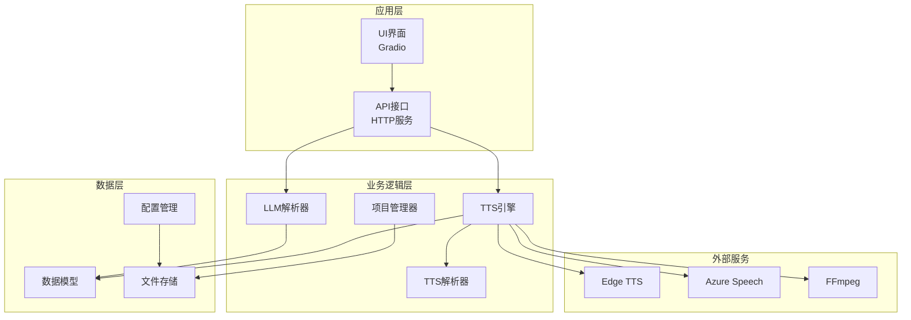
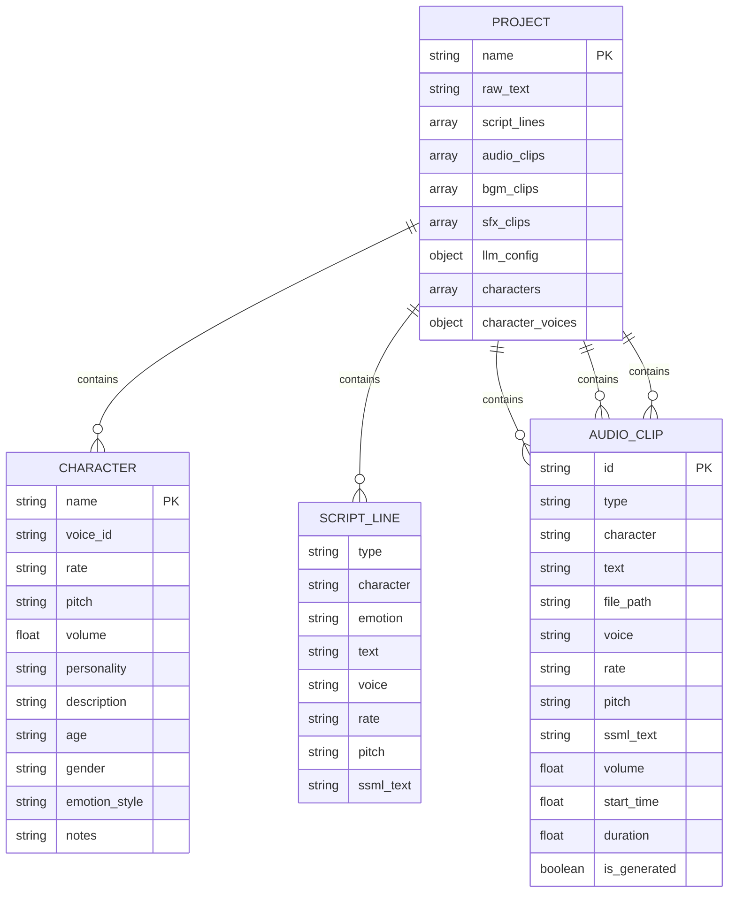
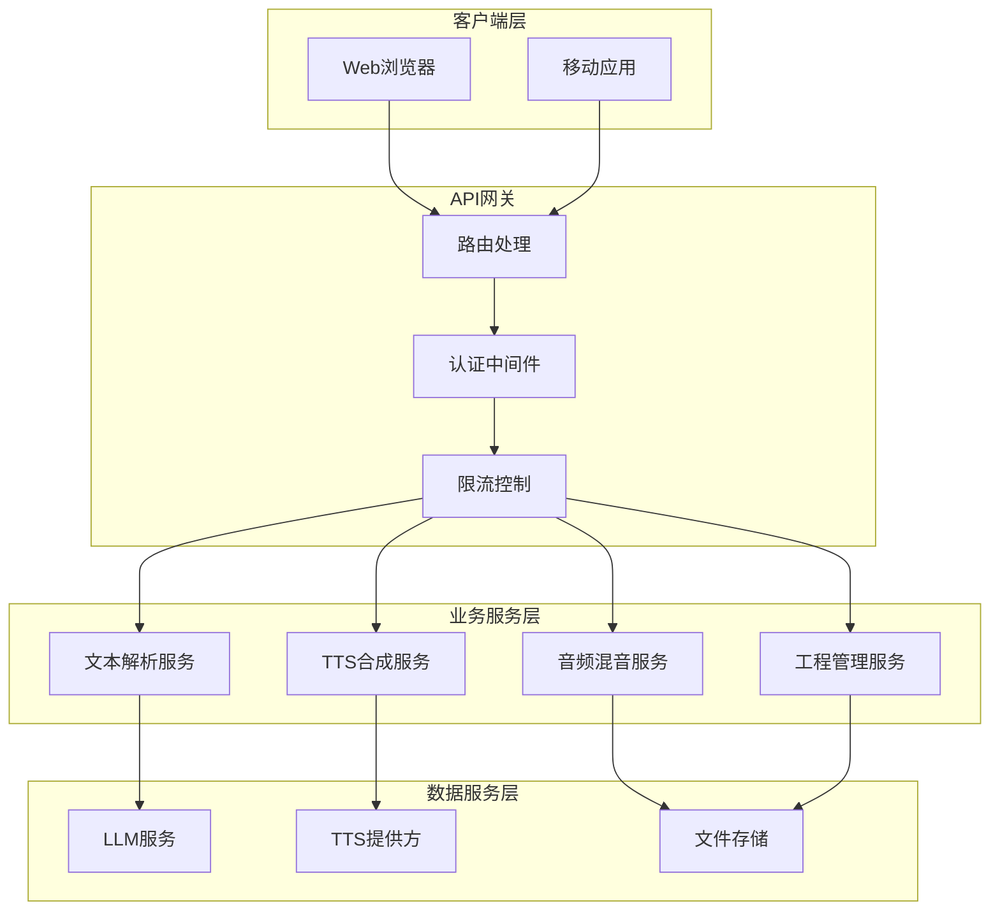
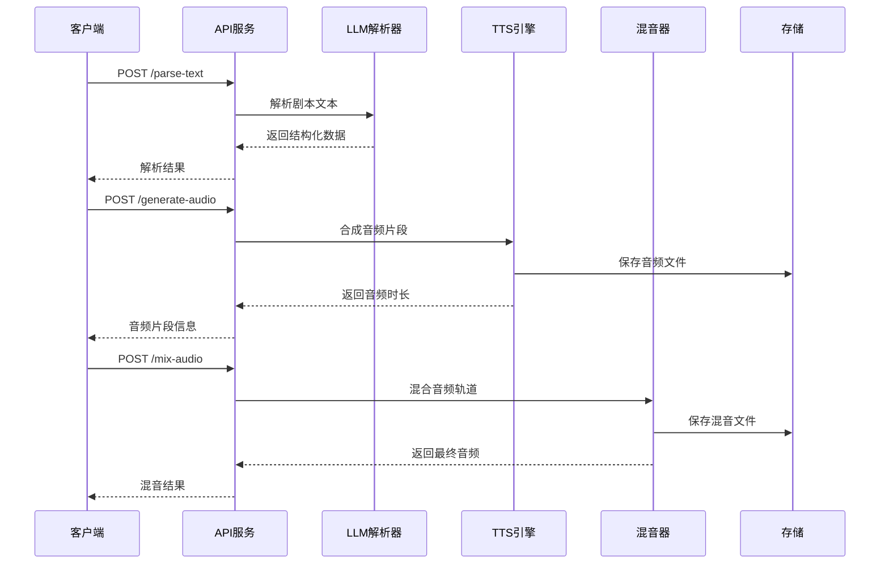
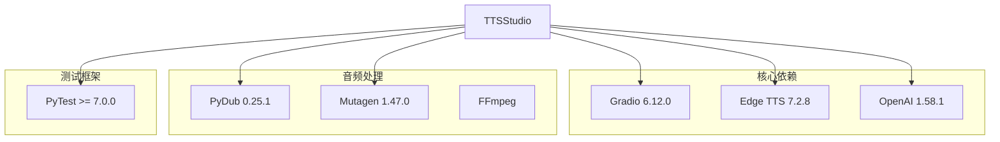
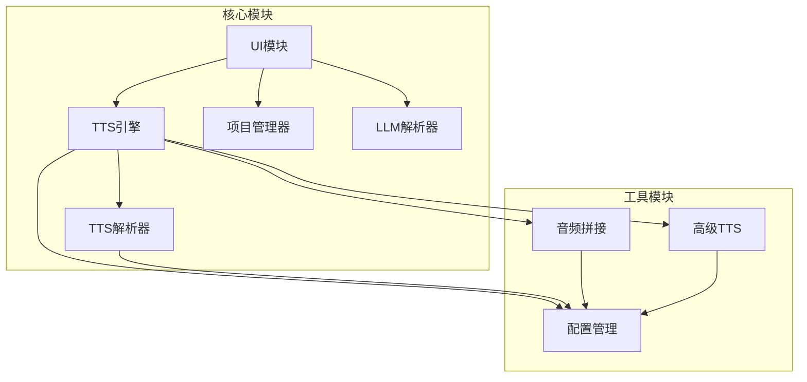

# API参考文档

<cite>
**本文档引用的文件**
- [app/main.py](file://app/main.py)
- [app/ui.py](file://app/ui.py)
- [app/models.py](file://app/models.py)
- [app/tts_engine.py](file://app/tts_engine.py)
- [app/tts_parser.py](file://app/tts_parser.py)
- [app/tts_concat.py](file://app/tts_concat.py)
- [app/tts_advanced.py](file://app/tts_advanced.py)
- [app/project_manager.py](file://app/project_manager.py)
- [app/llm_parser.py](file://app/llm_parser.py)
- [app/config.py](file://app/config.py)
- [run_server.py](file://run_server.py)
- [requirements.txt](file://requirements.txt)
- [tests/test_protocol.py](file://tests/test_protocol.py)
</cite>

## 目录
1. [简介](#简介)
2. [项目结构](#项目结构)
3. [核心数据模型](#核心数据模型)
4. [架构概览](#架构概览)
5. [详细API规范](#详细api规范)
6. [依赖关系分析](#依赖关系分析)
7. [性能考量](#性能考量)
8. [故障排除指南](#故障排除指南)
9. [结论](#结论)
10. [附录](#附录)

## 简介

TTS Studio是一个基于Gradio的多轨剧本配音工作台，提供了完整的文本到语音(TTS)合成解决方案。该系统集成了LLM解析、高级TTS标记语法、音频拼接和混音功能，支持复杂的语音合成需求。

系统采用模块化设计，主要包含以下核心功能：
- LLM自动剧本解析和角色识别
- 高级TTS标记语法支持（语速、音调、停顿、多音字）
- 多音轨音频合成和混音
- 工程文件管理和持久化
- Web界面交互和实时预览

## 项目结构



**图表来源**
- [app/ui.py:13-1827](file://app/ui.py#L13-L1827)
- [app/tts_engine.py:1-547](file://app/tts_engine.py#L1-L547)
- [app/llm_parser.py:1-21](file://app/llm_parser.py#L1-L21)

**章节来源**
- [app/main.py:1-51](file://app/main.py#L1-L51)
- [app/ui.py:13-1827](file://app/ui.py#L13-L1827)
- [app/config.py:1-74](file://app/config.py#L1-L74)

## 核心数据模型

### 实体关系图



**图表来源**
- [app/models.py:4-78](file://app/models.py#L4-L78)

### 数据模型详细说明

#### Character（角色模型）
- **name**: 角色名称（如"旁白"、"李远"）
- **voice_id**: 音色ID（如"zh-CN-YunjianNeural"）
- **rate**: 语速参数（默认"+0%"）
- **pitch**: 音调参数（默认"+0Hz"）
- **volume**: 音量倍数（默认1.0）
- **personality**: 性格摘要
- **description**: 角色介绍
- **age**: 年龄段
- **gender**: 性别
- **emotion_style**: 情绪风格
- **notes**: 备注说明

#### AudioClip（音频片段模型）
- **id**: 片段唯一标识
- **type**: 片段类型（"dialogue"、"bgm"、"sfx"）
- **character**: 角色名
- **text**: 文本内容
- **file_path**: 音频文件路径
- **voice**: 音色
- **rate**: 语速
- **pitch**: 音调
- **ssml_text**: SSML标记文本
- **volume**: 音量倍数
- **start_time**: 开始时间（秒）
- **duration**: 时长（秒）
- **is_generated**: 是否已生成

#### ScriptLine（剧本行模型）
- **type**: 行类型
- **character**: 角色
- **emotion**: 情绪
- **text**: 文本内容
- **voice**: 音色
- **rate**: 语速
- **pitch**: 音调
- **ssml_text**: SSML标记文本

#### Project（工程模型）
- **name**: 工程名称
- **raw_text**: 原始文本
- **script_lines**: 剧本行列表
- **audio_clips**: 对白音频片段
- **bgm_clips**: 背景音乐片段
- **sfx_clips**: 音效片段
- **llm_config**: LLM配置
- **characters**: 角色列表
- **character_voices**: 角色音色映射

**章节来源**
- [app/models.py:4-78](file://app/models.py#L4-L78)

## 架构概览

### 系统架构图



**图表来源**
- [app/ui.py:13-1827](file://app/ui.py#L13-L1827)
- [app/tts_engine.py:1-547](file://app/tts_engine.py#L1-L547)

### 数据流图



**图表来源**
- [app/ui.py:464-741](file://app/ui.py#L464-L741)
- [app/tts_engine.py:120-218](file://app/tts_engine.py#L120-L218)

## 详细API规范

### LLM解析接口

#### 接口定义
- **端点**: `POST /parse-text`
- **功能**: 使用LLM自动解析剧本文本，识别角色和对白
- **认证**: 无需认证
- **请求头**: `Content-Type: application/json`

#### 请求参数
| 参数名 | 类型 | 必填 | 描述 |
|--------|------|------|------|
| text | string | 是 | 剧本或小说文本 |
| api_base | string | 否 | LLM API基础地址 |
| api_key | string | 否 | LLM API密钥 |
| model | string | 否 | LLM模型名称 |

#### 响应格式
```json
{
  "success": true,
  "data": [
    {
      "type": "dialogue",
      "character": "李远",
      "emotion": "隐忍",
      "text": "臣无话可说。"
    }
  ],
  "count": 12
}
```

#### 错误处理
- **400 Bad Request**: 请求参数无效
- **500 Internal Server Error**: LLM服务异常

**章节来源**
- [app/ui.py:464-557](file://app/ui.py#L464-L557)
- [app/llm_parser.py:7-21](file://app/llm_parser.py#L7-L21)

### TTS合成接口

#### 单片段合成
- **端点**: `POST /synthesize-single`
- **功能**: 合成单个音频片段
- **请求参数**:
  - `line`: ScriptLine对象
  - `output_path`: 输出文件路径
  - `use_azure`: 是否使用Azure服务
  - `azure_key`: Azure API密钥
  - `azure_region`: Azure区域

#### 批量合成
- **端点**: `POST /synthesize-batch`
- **功能**: 合成多个音频片段
- **请求参数**: 数组形式的ScriptLine对象

#### 高级标记合成
- **端点**: `POST /synthesize-advanced`
- **功能**: 支持高级标记语法的合成
- **支持标记**:
  - `<prosody rate="-20%" pitch="+10Hz">文本</prosody>`
  - `<pause=1000>` 停顿1000ms
  - `[phoneme=同音字]原字[/phoneme]` 多音字替换

**章节来源**
- [app/tts_engine.py:120-218](file://app/tts_engine.py#L120-L218)
- [app/tts_parser.py:69-182](file://app/tts_parser.py#L69-L182)

### 音频混音接口

#### 接口定义
- **端点**: `POST /mix-audio`
- **功能**: 将多个音频轨道混合输出
- **请求参数**:
  - `clips`: AudioClip数组
  - `total_duration`: 总时长（秒）

#### 混音选项
- **背景音乐**: BGM轨道，可调节音量
- **音效**: SFX轨道，可精确定位
- **对白轨道**: 多角色对白合成

**章节来源**
- [app/tts_engine.py:454-547](file://app/tts_engine.py#L454-L547)
- [app/ui.py:693-741](file://app/ui.py#L693-L741)

### 工程管理接口

#### 工程文件操作
- **端点**: `POST /save-project`
- **功能**: 保存当前工程到文件
- **端点**: `GET /load-project`
- **功能**: 从文件加载工程
- **端点**: `GET /list-projects`
- **功能**: 列出所有工程文件

#### 工程数据结构
```json
{
  "name": "工程名称",
  "raw_text": "原始文本",
  "script_lines": [],
  "audio_clips": [],
  "bgm_clips": [],
  "sfx_clips": [],
  "llm_config": {},
  "characters": [],
  "character_voices": {}
}
```

**章节来源**
- [app/project_manager.py:31-73](file://app/project_manager.py#L31-L73)
- [app/ui.py:743-851](file://app/ui.py#L743-L851)

### 角色管理接口

#### 接口定义
- **端点**: `POST /add-character`
- **功能**: 添加新角色
- **端点**: `PUT /update-character`
- **功能**: 更新角色信息
- **端点**: `DELETE /delete-character`
- **功能**: 删除角色

#### 角色配置
- **voice_id**: 音色ID
- **rate**: 默认语速
- **pitch**: 默认音调
- **volume**: 默认音量
- **personality**: 性格特征

**章节来源**
- [app/ui.py:1139-1200](file://app/ui.py#L1139-L1200)
- [app/models.py:4-17](file://app/models.py#L4-L17)

## 依赖关系分析

### 外部依赖图



**图表来源**
- [requirements.txt:1-16](file://requirements.txt#L1-L16)

### 内部模块依赖



**图表来源**
- [app/ui.py:1-12](file://app/ui.py#L1-L12)
- [app/tts_engine.py:1-16](file://app/tts_engine.py#L1-L16)

**章节来源**
- [requirements.txt:1-16](file://requirements.txt#L1-L16)
- [app/ui.py:1-12](file://app/ui.py#L1-L12)

## 性能考量

### 合成性能优化

#### 并行处理
- **批量合成**: 支持多片段并发合成
- **异步I/O**: 使用asyncio提高I/O效率
- **内存管理**: 及时清理临时音频文件

#### 缓存策略
- **音色缓存**: 音色配置缓存减少查询开销
- **文件缓存**: 已生成音频文件缓存
- **LLM缓存**: 解析结果缓存

### 音频处理优化

#### 拼接策略
- **FFmpeg直连**: 避免pydub依赖，提高性能
- **流式处理**: 大文件分块处理
- **内存映射**: 大音频文件内存映射

#### 混音优化
- **amix滤镜**: FFmpeg内置混音器
- **adelay滤镜**: 精确时间对齐
- **动态范围压缩**: 音频质量优化

## 故障排除指南

### 常见问题及解决方案

#### LLM解析失败
- **症状**: 解析结果为空或错误
- **原因**: API密钥无效、网络连接问题
- **解决**: 检查API配置、网络连通性

#### TTS合成失败
- **症状**: 音频文件生成失败
- **原因**: Edge TTS服务不可用、代理配置错误
- **解决**: 检查服务状态、代理设置

#### 音频拼接错误
- **症状**: 混音文件损坏
- **原因**: FFmpeg路径错误、权限不足
- **解决**: 检查FFmpeg安装、文件权限

### 调试工具

#### 协议调试
```python
# 测试脚本示例
import asyncio
from app.tts_engine import synthesize_single_line
from app.models import ScriptLine

async def debug_tts():
    line = ScriptLine(
        type="dialogue",
        character="test",
        text="这是一个测试。",
        voice="zh-CN-YunjianNeural",
        rate="+0%",
        pitch="+0Hz"
    )
    
    try:
        duration = await synthesize_single_line(line, "test.mp3")
        print(f"合成完成，时长: {duration}秒")
    except Exception as e:
        print(f"合成失败: {e}")

if __name__ == "__main__":
    asyncio.run(debug_tts())
```

**章节来源**
- [tests/test_protocol.py:33-61](file://tests/test_protocol.py#L33-L61)

## 结论

TTS Studio提供了一个完整的文本到语音合成解决方案，具有以下特点：

### 技术优势
- **模块化设计**: 清晰的模块分离和职责划分
- **高性能**: 异步处理和FFmpeg优化
- **易扩展**: 插件化架构支持功能扩展
- **用户友好**: 直观的Web界面和丰富的编辑功能

### 应用价值
- **创作效率**: 自动生成高质量配音
- **成本控制**: 减少人工配音成本
- **质量保证**: 统一的音色和风格标准
- **协作便利**: 工程文件共享和版本管理

### 发展方向
- **云端集成**: 支持更多TTS服务提供商
- **AI增强**: 更智能的剧本解析和配音建议
- **多平台支持**: 移动端和桌面端应用
- **国际化**: 多语言支持和本地化

## 附录

### 配置参数说明

#### 环境变量
- `DEFAULT_API_BASE`: LLM API基础地址（默认"http://localhost:11434/v1"）
- `DEFAULT_API_KEY`: LLM API密钥（默认"ollama"）
- `DEFAULT_MODEL`: LLM模型名称（默认"qwen2.5:7b"）
- `HTTP_PROXY`: HTTP代理服务器地址

#### 目录结构
- `DATA_DIR`: 数据根目录
- `AUDIO_DIR`: 音频文件目录
- `PROJECTS_DIR`: 工程文件目录

### 安全考虑
- **认证机制**: API密钥验证
- **文件访问**: 限定允许访问的目录
- **输入验证**: 严格的参数校验
- **日志审计**: 完整的操作日志记录

### 版本控制
- **当前版本**: 1.0.0
- **API版本**: v1
- **向后兼容**: 保持接口稳定性