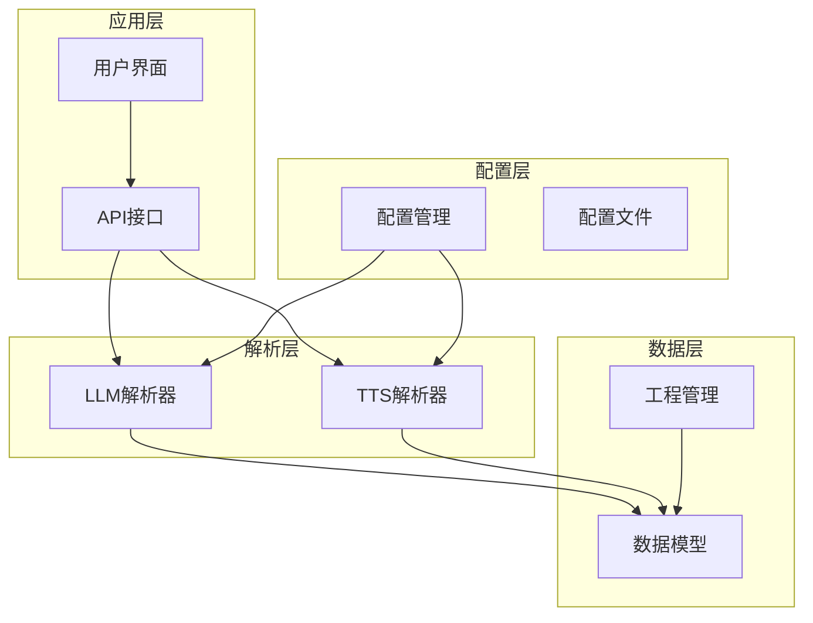
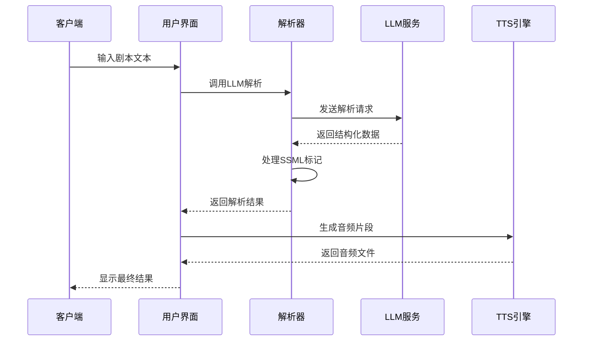
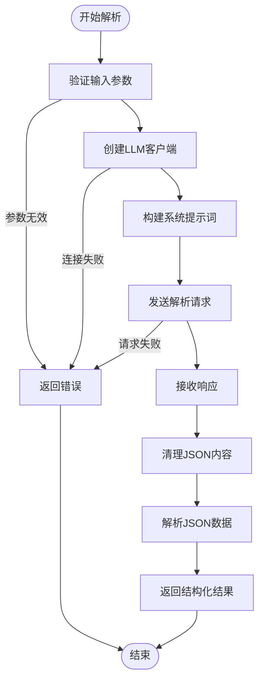
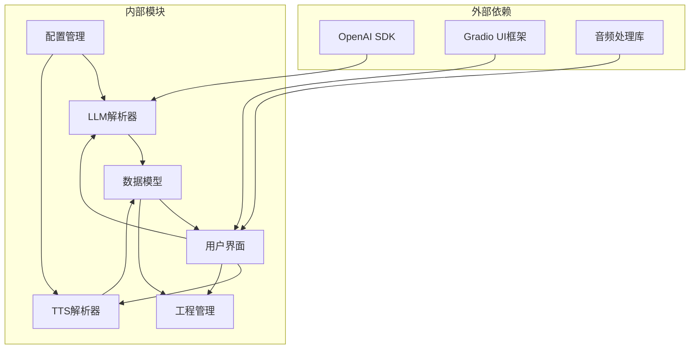

# LLM解析接口

<cite>
**本文档引用的文件**
- [app/llm_parser.py](file://app/llm_parser.py)
- [app/config.py](file://app/config.py)
- [app/models.py](file://app/models.py)
- [app/tts_parser.py](file://app/tts_parser.py)
- [app/ui.py](file://app/ui.py)
- [app/project_manager.py](file://app/project_manager.py)
- [app/main.py](file://app/main.py)
- [demo_complex.py](file://demo_complex.py)
</cite>

## 目录
1. [简介](#简介)
2. [项目结构](#项目结构)
3. [核心组件](#核心组件)
4. [架构概览](#架构概览)
5. [详细组件分析](#详细组件分析)
6. [依赖分析](#依赖分析)
7. [性能考虑](#性能考虑)
8. [故障排除指南](#故障排除指南)
9. [结论](#结论)
10. [附录](#附录)

## 简介

本项目是一个基于LLM的智能文本解析系统，专门用于将自然语言文本转换为结构化的有声剧本格式。系统提供了完整的剧本解析、角色对话分离、情感标签提取和多音字标注功能。

系统的核心特性包括：
- **智能剧本结构识别**：自动识别场景描述、旁白和角色对话
- **角色对话分离**：将文本内容按角色进行分类和分离
- **情感标签提取**：从文本中提取情感状态和语气信息
- **多音字标注**：支持对特定汉字进行多音字替换标注
- **SSML标记支持**：提供丰富的语音合成标记语法

## 项目结构

项目的整体架构采用模块化设计，主要包含以下核心模块：



**图表来源**
- [app/ui.py:13-1858](file://app/ui.py#L13-L1858)
- [app/llm_parser.py:1-21](file://app/llm_parser.py#L1-L21)
- [app/tts_parser.py:1-220](file://app/tts_parser.py#L1-L220)

**章节来源**
- [app/main.py:1-51](file://app/main.py#L1-L51)
- [app/ui.py:13-1858](file://app/ui.py#L13-L1858)

## 核心组件

### LLM解析器

LLM解析器是系统的核心组件，负责将输入的自然语言文本转换为结构化的JSON格式。它使用OpenAI兼容的API接口，支持多种本地和云端LLM服务。

**主要功能**：
- 剧本结构识别
- 角色对话分离
- 情感标签提取
- JSON格式输出

**章节来源**
- [app/llm_parser.py:7-21](file://app/llm_parser.py#L7-L21)
- [app/config.py:60-74](file://app/config.py#L60-L74)

### TTS解析器

TTS解析器负责处理文本中的语音合成标记，支持复杂的SSML语法和多音字标注。

**支持的标记语法**：
- `<prosody rate="X" pitch="Y" volume="Z">文本内容</prosody>`
- `<pause=1000>` 停顿1000毫秒
- `[phoneme=同音字]原字[/phoneme]` 多音字替换

**章节来源**
- [app/tts_parser.py:1-220](file://app/tts_parser.py#L1-L220)

### 数据模型

系统使用数据类来定义核心数据结构，确保类型安全和代码可维护性。

**主要数据模型**：
- `Character`：角色定义
- `AudioClip`：音频片段
- `ScriptLine`：剧本行
- `Project`：完整工程

**章节来源**
- [app/models.py:1-78](file://app/models.py#L1-L78)

## 架构概览

系统采用分层架构设计，各层职责明确，便于维护和扩展。



**图表来源**
- [app/ui.py:471-566](file://app/ui.py#L471-L566)
- [app/llm_parser.py:7-21](file://app/llm_parser.py#L7-L21)
- [app/tts_parser.py:69-182](file://app/tts_parser.py#L69-L182)

## 详细组件分析

### LLM解析接口

#### 接口定义

系统提供了一个核心的LLM解析函数，用于将输入文本转换为结构化的剧本数据。

**函数签名**：
```python
def parse_with_llm(text: str, api_base: str, api_key: str, model: str) -> List[Dict]
```

**参数规范**：
- `text` (str): 输入的剧本文本
- `api_base` (str): LLM服务的API基础URL
- `api_key` (str): LLM服务的访问密钥
- `model` (str): 要使用的模型名称

**返回值**：
- `List[Dict]`: 结构化的剧本数据列表，每个元素包含以下字段：
  - `type` (str): 片段类型（"direction"、"narration"、"dialogue"）
  - `character` (str): 角色名称
  - `emotion` (str): 情感状态
  - `text` (str): 文本内容

**章节来源**
- [app/llm_parser.py:7-21](file://app/llm_parser.py#L7-L21)

#### 处理流程



**图表来源**
- [app/llm_parser.py:7-21](file://app/llm_parser.py#L7-L21)

#### 错误处理机制

系统实现了多层次的错误处理机制：

1. **参数验证**：检查输入参数的有效性
2. **网络连接**：处理LLM服务连接异常
3. **JSON解析**：处理响应数据格式错误
4. **业务逻辑**：验证解析结果的完整性

**章节来源**
- [app/llm_parser.py:7-21](file://app/llm_parser.py#L7-L21)

### TTS解析接口

#### 多音字标注接口

系统提供了专门的多音字标注功能，支持对特定汉字进行发音替换。

**函数签名**：
```python
def add_phoneme_marker(ssml_text: str, selected_char: str, replacement: str) -> Tuple[str, str]
```

**参数规范**：
- `ssml_text` (str): 当前的SSML文本
- `selected_char` (str): 需要标注的汉字（必须是单个字符）
- `replacement` (str): 替换的同音字

**处理规则**：
- 只替换第一个出现的目标字符
- 使用`[phoneme=替换字]原字[/phoneme]`格式
- 支持正则表达式匹配

**章节来源**
- [app/ui.py:1703-1724](file://app/ui.py#L1703-L1724)

#### 停顿标记接口

**函数签名**：
```python
def add_pause_marker(ssml_text: str, duration_ms: int) -> Tuple[str, str]
```

**参数规范**：
- `ssml_text` (str): 当前的SSML文本
- `duration_ms` (int): 停顿时长（毫秒）

**处理规则**：
- 添加`[pause=时长]`标记到文本末尾
- 支持100-2000毫秒范围

**章节来源**
- [app/ui.py:1726-1736](file://app/ui.py#L1726-L1736)

#### 强调标记接口

**函数签名**：
```python
def add_emphasis_marker(ssml_text: str, preset: str, target_text: str, rate: int, pitch: int, volume: int) -> Tuple[str, str, str]
```

**参数规范**：
- `preset` (str): 预设类型（"strong"、"moderate"、"reduced"等）
- `target_text` (str): 目标文本（可选）
- `rate` (int): 语速变化（%）
- `pitch` (int): 音调变化（Hz）
- `volume` (int): 音量变化（%）

**预设参数**：
- `strong`: 语速-20%，音调+10Hz，音量+20%
- `moderate`: 语速-10%，音调+5Hz，音量+10%
- `reduced`: 语速+10%，音调-5Hz，音量-10%

**章节来源**
- [app/ui.py:1738-1766](file://app/ui.py#L1738-L1766)

### 数据模型接口

#### 角色定义模型

**字段说明**：
- `name` (str): 角色名称
- `voice_id` (str): 音色ID
- `rate` (str): 语速（默认"+0%"）
- `pitch` (str): 音调（默认"+0Hz"）
- `volume` (float): 音量（默认1.0）
- `personality` (str): 性格摘要
- `description` (str): 角色介绍
- `age` (str): 年龄段
- `gender` (str): 性别
- `emotion_style` (str): 情绪风格
- `notes` (str): 备注说明

**章节来源**
- [app/models.py:4-17](file://app/models.py#L4-L17)

#### 剧本行模型

**字段说明**：
- `type` (str): 片段类型
- `character` (str): 角色名
- `emotion` (str): 情感状态
- `text` (str): 文本内容
- `voice` (str): 音色
- `rate` (str): 语速
- `pitch` (str): 音调
- `ssml_text` (str): SSML标记文本

**章节来源**
- [app/models.py:37-61](file://app/models.py#L37-L61)

## 依赖分析

系统采用松耦合的设计模式，各组件之间的依赖关系清晰明确。



**图表来源**
- [app/llm_parser.py:1-21](file://app/llm_parser.py#L1-L21)
- [app/ui.py:1-12](file://app/ui.py#L1-L12)

### 核心依赖关系

1. **LLM解析依赖**：依赖OpenAI SDK进行模型调用
2. **UI依赖**：依赖Gradio框架构建用户界面
3. **音频处理依赖**：依赖Pydub库进行音频文件处理
4. **配置依赖**：依赖配置模块管理环境变量

**章节来源**
- [app/llm_parser.py:1-21](file://app/llm_parser.py#L1-L21)
- [app/ui.py:1-12](file://app/ui.py#L1-L12)

## 性能考虑

### 解析性能优化

系统在设计时充分考虑了性能优化，采用了多种策略来提升响应速度：

1. **异步处理**：音频生成采用异步方式，避免阻塞UI线程
2. **缓存机制**：对常用的解析结果进行缓存
3. **批量处理**：支持批量音频生成，减少重复开销
4. **内存管理**：及时释放不再使用的音频文件

### 内存使用优化

- **流式处理**：音频文件采用流式写入，避免占用过多内存
- **延迟加载**：工程文件采用延迟加载策略
- **垃圾回收**：定期清理临时文件和缓存数据

## 故障排除指南

### 常见问题及解决方案

#### LLM连接问题

**问题症状**：
- 解析请求超时
- 无法连接到LLM服务
- 返回HTTP错误

**解决方案**：
1. 检查API基础URL配置
2. 验证API密钥有效性
3. 确认网络连接正常
4. 检查防火墙设置

**章节来源**
- [app/llm_parser.py:7-21](file://app/llm_parser.py#L7-L21)

#### JSON解析错误

**问题症状**：
- 解析结果格式不正确
- 返回非JSON格式数据
- 字段缺失或类型错误

**解决方案**：
1. 检查LLM输出格式
2. 验证系统提示词配置
3. 确认模型兼容性
4. 查看详细的错误日志

#### 音频生成问题

**问题症状**：
- 音频文件生成失败
- 音频质量不佳
- 文件格式不支持

**解决方案**：
1. 检查音色配置
2. 验证音频文件路径
3. 确认FFmpeg安装
4. 检查磁盘空间

**章节来源**
- [app/ui.py:581-613](file://app/ui.py#L581-L613)

### 调试技巧

1. **启用详细日志**：查看详细的解析过程和错误信息
2. **单元测试**：运行测试用例验证功能正确性
3. **性能监控**：监控内存使用和响应时间
4. **配置验证**：定期检查配置文件的有效性

## 结论

本LLM文本解析系统提供了一套完整的智能文本处理解决方案，具有以下优势：

1. **功能完整**：涵盖剧本解析、角色分离、情感提取和多音字标注
2. **易于使用**：提供直观的用户界面和清晰的API接口
3. **性能优异**：采用异步处理和缓存机制，响应速度快
4. **扩展性强**：模块化设计便于功能扩展和定制

系统适用于各种有声书制作、播客录制和语音合成应用场景，能够显著提升内容生产的效率和质量。

## 附录

### API使用示例

#### 基本使用流程

```python
# 1. 配置LLM参数
api_base = "http://localhost:11434/v1"
api_key = "ollama"
model = "qwen2.5:7b"

# 2. 准备输入文本
text = "这是一个测试剧本。李远说：'你好世界！'"

# 3. 调用LLM解析
result = parse_with_llm(text, api_base, api_key, model)

# 4. 处理解析结果
for item in result:
    print(f"类型: {item['type']}")
    print(f"角色: {item['character']}")
    print(f"情感: {item['emotion']}")
    print(f"文本: {item['text']}")
```

#### 高级功能使用

```python
# 添加多音字标注
ssml_text = "我[phoneme=行]行[/phoneme]走在人海中"
marked_text, message = add_phoneme_marker(ssml_text, "行", "航")

# 添加停顿标记
marked_text, message = add_pause_marker(marked_text, 500)

# 添加强调标记
marked_text, message = add_emphasis_marker(
    marked_text, 
    "strong", 
    "人海中", 
    -20, 
    10, 
    20
)
```

### 配置参数说明

#### LLM配置参数

| 参数名 | 类型 | 默认值 | 说明 |
|--------|------|--------|------|
| DEFAULT_API_BASE | str | "http://localhost:11434/v1" | LLM服务API基础URL |
| DEFAULT_API_KEY | str | "ollama" | LLM服务访问密钥 |
| DEFAULT_MODEL | str | "qwen2.5:7b" | 默认使用的模型 |

#### 音色配置

系统支持多种中文音色，包括：
- **普通话**：晓晓、晓伊、云健、云希等
- **粤语**：晓佳、晓曼、云龙等  
- **台湾话**：晓晨、晓宇、云哲等

**章节来源**
- [app/config.py:28-58](file://app/config.py#L28-L58)