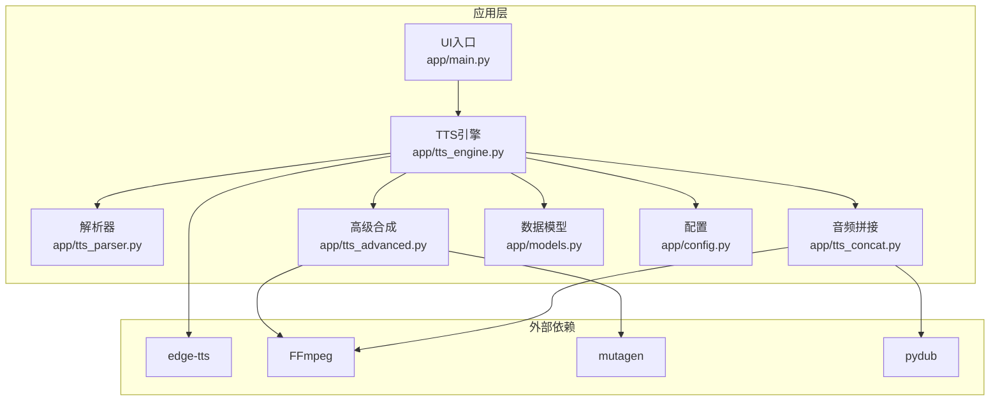
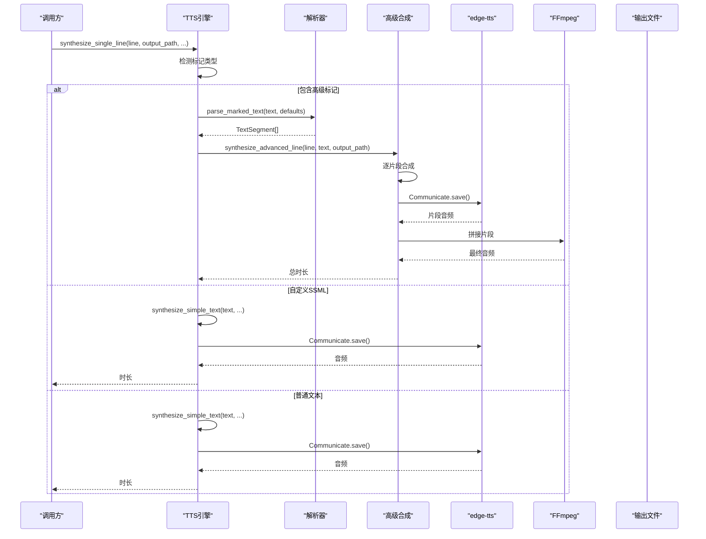
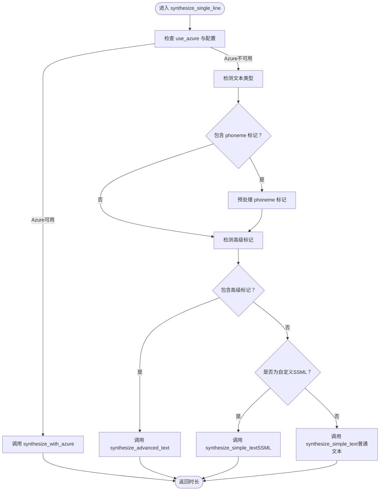
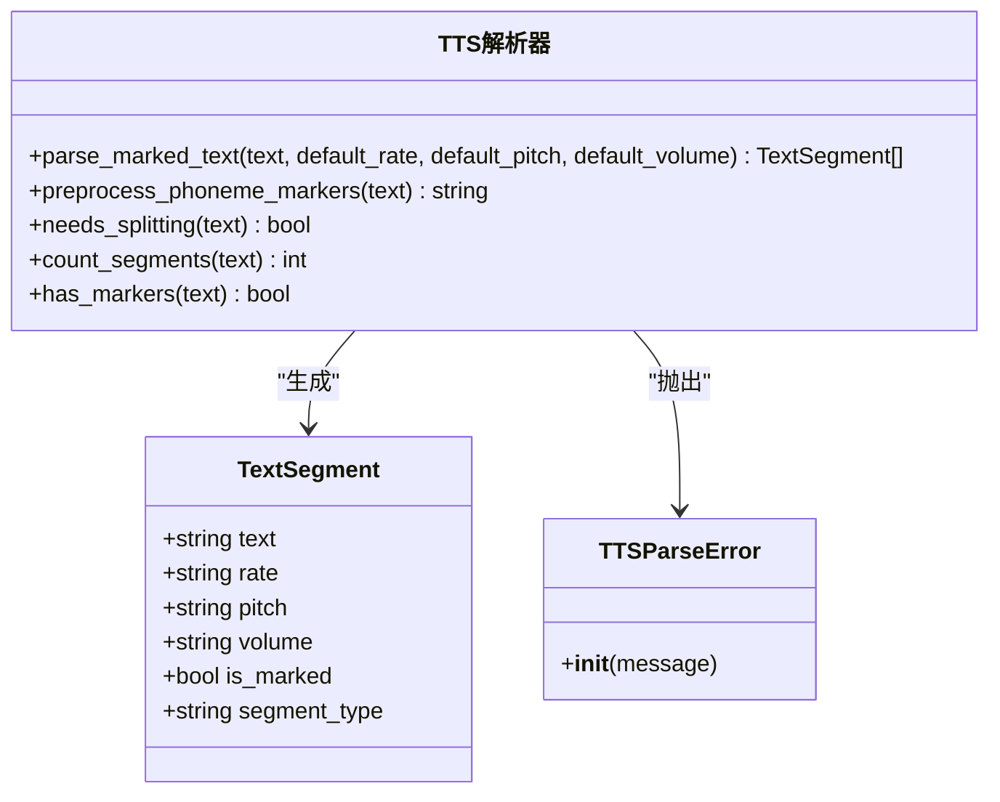
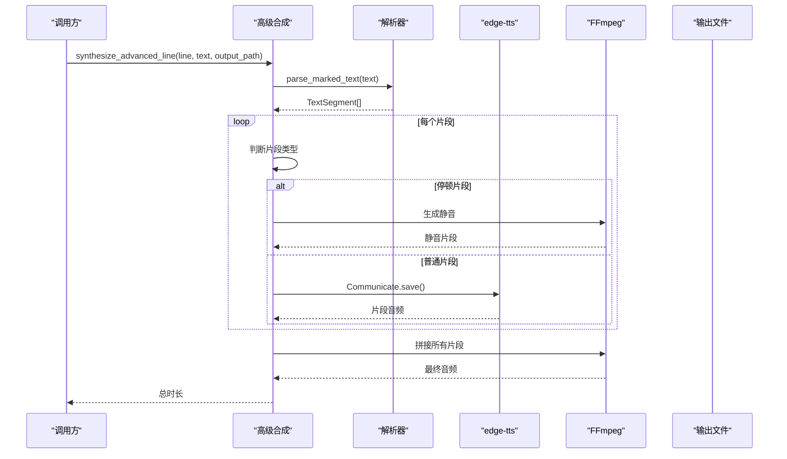
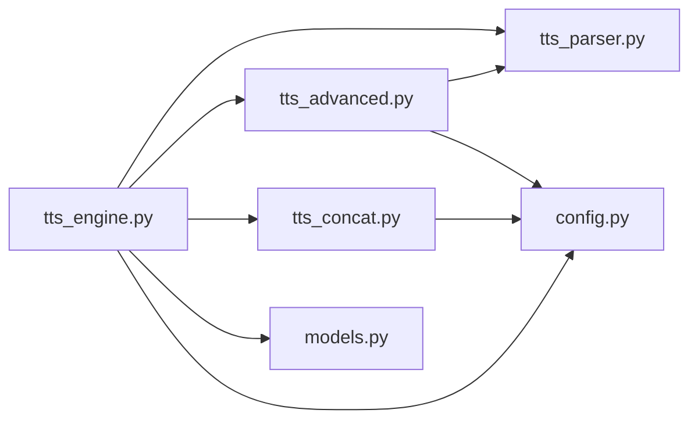

# TTS引擎接口

<cite>
**本文档引用的文件**
- [tts_engine.py](file://app/tts_engine.py)
- [tts_parser.py](file://app/tts_parser.py)
- [tts_advanced.py](file://app/tts_advanced.py)
- [tts_concat.py](file://app/tts_concat.py)
- [models.py](file://app/models.py)
- [config.py](file://app/config.py)
- [main.py](file://app/main.py)
- [EDGE_TTS_ADVANCED_MARKERS_GUIDE.md](file://docs/EDGE_TTS_ADVANCED_MARKERS_GUIDE.md)
- [ADVANCED_TTS_GUIDE.md](file://docs/ADVANCED_TTS_GUIDE.md)
- [test_tts_engine_ssml.py](file://tests/test_tts_engine_ssml.py)
- [test_advanced_tts.py](file://tests/test_advanced_tts.py)
</cite>

## 目录
1. [简介](#简介)
2. [项目结构](#项目结构)
3. [核心组件](#核心组件)
4. [架构概览](#架构概览)
5. [详细组件分析](#详细组件分析)
6. [依赖关系分析](#依赖关系分析)
7. [性能考量](#性能考量)
8. [故障排除指南](#故障排除指南)
9. [结论](#结论)
10. [附录](#附录)

## 简介
本文件为TTS Studio项目的TTS引擎核心接口完整API文档，涵盖基础TTS合成、SSML标记解析、多音字处理以及高级音频控制接口。文档面向开发者与产品使用者，提供参数说明、返回值格式、异常处理、调用示例、性能参数与最佳实践，并解释接口间的依赖关系与调用顺序。

## 项目结构
项目采用模块化设计，核心TTS引擎位于app/tts_engine.py，解析与标记处理位于app/tts_parser.py，高级合成与拼接位于app/tts_advanced.py，音频拼接工具位于app/tts_concat.py，数据模型位于app/models.py，配置位于app/config.py，UI入口位于app/main.py。

**图表来源**
- [main.py:1-51](file://app/main.py#L1-L51)
- [tts_engine.py:1-547](file://app/tts_engine.py#L1-L547)
- [tts_parser.py:1-220](file://app/tts_parser.py#L1-L220)
- [tts_advanced.py:1-290](file://app/tts_advanced.py#L1-L290)
- [tts_concat.py:1-159](file://app/tts_concat.py#L1-L159)
- [models.py:1-78](file://app/models.py#L1-L78)
- [config.py:1-74](file://app/config.py#L1-L74)

**章节来源**
- [main.py:1-51](file://app/main.py#L1-L51)
- [tts_engine.py:1-547](file://app/tts_engine.py#L1-L547)
- [tts_parser.py:1-220](file://app/tts_parser.py#L1-L220)
- [tts_advanced.py:1-290](file://app/tts_advanced.py#L1-L290)
- [tts_concat.py:1-159](file://app/tts_concat.py#L1-L159)
- [models.py:1-78](file://app/models.py#L1-L78)
- [config.py:1-74](file://app/config.py#L1-L74)

## 核心组件
- 基础TTS合成接口：负责单行文本的TTS合成，支持普通文本、自定义SSML与Azure Speech Service。
- SSML标记解析接口：解析方括号标记语法，拆分为TextSegment片段，支持rate、pitch、volume、pause、emphasis、phoneme等。
- 多音字处理接口：预处理phoneme标记，将多音字替换为指定同音字，确保edge-tts正确发音。
- 高级音频控制接口：自动拆分、分别合成、FFmpeg拼接，支持复杂语气变化与停顿控制。

**章节来源**
- [tts_engine.py:120-218](file://app/tts_engine.py#L120-L218)
- [tts_parser.py:23-220](file://app/tts_parser.py#L23-L220)
- [tts_advanced.py:22-290](file://app/tts_advanced.py#L22-L290)
- [tts_concat.py:17-91](file://app/tts_concat.py#L17-L91)

## 架构概览
TTS引擎采用三层架构：解析层、合成层、拼接层。解析层将标记文本拆分为多个片段；合成层针对每个片段调用edge-tts或Azure进行合成；拼接层使用FFmpeg将片段按顺序拼接为完整音频。

**图表来源**
- [tts_engine.py:120-218](file://app/tts_engine.py#L120-L218)
- [tts_parser.py:69-182](file://app/tts_parser.py#L69-L182)
- [tts_advanced.py:112-290](file://app/tts_advanced.py#L112-L290)

## 详细组件分析

### 基础TTS合成接口
- 接口名称：synthesize_single_line
- 功能：合成单行文本，返回音频时长（秒）
- 参数
  - line: ScriptLine对象（必填）
  - output_path: 输出路径（必填）
  - max_retries: 最大重试次数（可选，默认3）
  - use_azure: 是否使用Azure Speech Service（可选，默认False）
  - azure_key: Azure API Key（可选，use_azure为True时必填）
  - azure_region: Azure Region（可选，use_azure为True时必填）
- 返回值：float（音频时长，秒）
- 异常：抛出Exception，包含失败原因
- 调用流程
  - 检测是否使用Azure（若配置完整且SDK可用）
  - 若为Azure：调用synthesize_with_azure
  - 若为edge-tts：根据文本类型选择synthesize_simple_text或synthesize_advanced_text
- 错误码与处理
  - Azure SDK不可用：抛出异常
  - 403错误：提示网络连接问题与代理设置
  - 文件未生成：抛出FileNotFoundError
  - 重试机制：指数退避，最多max_retries次

**图表来源**
- [tts_engine.py:120-218](file://app/tts_engine.py#L120-L218)

**章节来源**
- [tts_engine.py:120-218](file://app/tts_engine.py#L120-L218)
- [tts_engine.py:43-118](file://app/tts_engine.py#L43-L118)
- [tts_engine.py:220-318](file://app/tts_engine.py#L220-L318)
- [tts_engine.py:321-453](file://app/tts_engine.py#L321-L453)

### SSML标记解析接口
- 接口名称：parse_marked_text
- 功能：解析方括号标记文本，拆分为TextSegment片段
- 参数
  - text: 输入文本（必填）
  - default_rate: 默认语速（可选，默认"+0%"）
  - default_pitch: 默认音调（可选，默认"+0Hz"）
  - default_volume: 默认音量（可选，默认"+0%"）
- 返回值：List[TextSegment]
- 支持的标记
  - [rate=±X%] / [/rate]：语速
  - [pitch=±XHz] / [/pitch]：音调
  - [volume=±X%] / [/volume]：音量
  - [pause=X]：停顿（毫秒）
  - [emphasis=level] / [/emphasis]：强调（映射为rate/pitch）
  - [phoneme=同音字]原字[/phoneme]：多音字替换（预处理阶段完成）
- 数据结构：TextSegment
  - text: 文本内容
  - rate: 语速
  - pitch: 音调
  - volume: 音量
  - is_marked: 是否包含标记
  - segment_type: 片段类型（text/pause）

**图表来源**
- [tts_parser.py:23-220](file://app/tts_parser.py#L23-L220)

**章节来源**
- [tts_parser.py:23-220](file://app/tts_parser.py#L23-L220)

### 多音字处理接口
- 接口名称：preprocess_phoneme_markers
- 功能：将[phoneme=同音字]原字[/phoneme]替换为同音字，便于edge-tts正确发音
- 参数
  - text: 输入文本（必填）
- 返回值：string（替换后的文本）
- 处理规则
  - 匹配[phoneme=同音字]原字[/phoneme]
  - 验证同音字为单个中文字符
  - 替换失败时保留原文本并记录警告
- 与高级合成的关系
  - 在synthesize_single_line入口先进行预处理
  - 预处理后重新检测是否需要高级标记处理

**章节来源**
- [tts_parser.py:39-66](file://app/tts_parser.py#L39-L66)
- [tts_engine.py:177-192](file://app/tts_engine.py#L177-L192)

### 高级音频控制接口
- 接口名称：synthesize_advanced_line
- 功能：自动拆分、分别合成、FFmpeg拼接，支持复杂语气变化与停顿
- 参数
  - line: ScriptLine对象（必填）
  - text: 处理后的文本（必填）
  - output_path: 输出路径（必填）
  - max_retries: 最大重试次数（可选，默认3）
- 返回值：float（总时长，秒）
- 处理流程
  - 解析文本为TextSegment列表
  - 逐片段合成：普通片段调用edge-tts，停顿片段使用FFmpeg生成静音
  - 使用FFmpeg concat demuxer拼接所有片段
  - 清理临时文件
- 错误处理
  - FFmpeg拼接失败：抛出异常
  - 片段合成失败：重试max_retries次
  - 估算时长：若mutagen不可用，使用字符数估算

**图表来源**
- [tts_advanced.py:112-290](file://app/tts_advanced.py#L112-L290)
- [tts_parser.py:69-182](file://app/tts_parser.py#L69-L182)

**章节来源**
- [tts_advanced.py:112-290](file://app/tts_advanced.py#L112-L290)

### 音频拼接接口
- 接口名称：concat_audio_files
- 功能：使用FFmpeg concat demuxer拼接多个音频文件
- 参数
  - audio_files: 音频文件路径列表（必填）
  - output_path: 输出路径（可选）
- 返回值：string（拼接后的音频文件路径）
- 处理流程
  - 验证文件存在
  - 生成临时列表文件
  - 调用FFmpeg concat demuxer拼接
  - 清理临时文件
- 错误处理
  - 文件不存在：抛出FileNotFoundError
  - FFmpeg失败：抛出Exception

**章节来源**
- [tts_concat.py:17-91](file://app/tts_concat.py#L17-L91)

### 混音与占位接口
- 接口名称：mix_audio_tracks
- 功能：将多个AudioClip按时间轴混合，使用FFmpeg adelay与amix
- 参数
  - clips: List[AudioClip]（必填）
  - total_duration: 总时长（可选）
- 返回值：string（混音输出路径）
- 处理流程
  - 过滤有效片段
  - 计算每个片段时长与起止时间
  - 使用adelay延迟各轨道，amix混合
- 接口名称：generate_silence / generate_tone
- 功能：生成静音/测试音文件
- 返回值：string（文件路径）

**章节来源**
- [tts_engine.py:454-547](file://app/tts_engine.py#L454-L547)

## 依赖关系分析
- 组件耦合
  - tts_engine依赖tts_parser、tts_advanced、tts_concat与models
  - tts_advanced依赖tts_parser与config
  - tts_concat独立，依赖FFmpeg
- 外部依赖
  - edge-tts：TTS合成
  - FFmpeg：音频拼接与静音生成
  - mutagen：MP3时长读取
  - pydub：音频处理（部分场景）
- 循环依赖
  - 无循环依赖，模块职责清晰

**图表来源**
- [tts_engine.py:1-547](file://app/tts_engine.py#L1-L547)
- [tts_parser.py:1-220](file://app/tts_parser.py#L1-L220)
- [tts_advanced.py:1-290](file://app/tts_advanced.py#L1-L290)
- [tts_concat.py:1-159](file://app/tts_concat.py#L1-L159)
- [models.py:1-78](file://app/models.py#L1-L78)
- [config.py:1-74](file://app/config.py#L1-L74)

**章节来源**
- [tts_engine.py:1-547](file://app/tts_engine.py#L1-L547)
- [tts_advanced.py:1-290](file://app/tts_advanced.py#L1-L290)
- [tts_concat.py:1-159](file://app/tts_concat.py#L1-L159)

## 性能考量
- 合成时间
  - 片段数×单次合成时间≈总时间
  - 建议单句片段数不超过5个
- 网络开销
  - 每个片段一次edge-tts请求
- 时长估算
  - 优先使用mutagen读取MP3时长
  - 无法读取时使用字符数估算（约4.5字符/秒）
- 重试策略
  - 指数退避（2^attempt秒）
  - 最多重试3次
- FFmpeg使用
  - concat demuxer避免重新编码，速度更快
  - 静音生成使用lavfi anullsrc，CPU友好

[本节为通用性能指导，不直接分析具体文件]

## 故障排除指南
- Azure Speech不可用
  - 现象：抛出Azure SDK未安装异常
  - 处理：安装azure-cognitiveservices-speech或回退到edge-tts
- 403错误
  - 现象：网络连接问题
  - 处理：设置HTTP_PROXY或https_proxy环境变量
- 文件未生成
  - 现象：FileNotFoundError
  - 处理：检查输出目录权限与磁盘空间
- FFmpeg拼接失败
  - 现象：FFmpeg返回非零退出码
  - 处理：确认FFmpeg安装与路径，检查输入文件完整性
- 多音字发音不准确
  - 现象：edge-tts自动处理多音字，无法精确控制
  - 处理：使用[phoneme=同音字]原字[/phoneme]预处理替换

**章节来源**
- [tts_engine.py:43-118](file://app/tts_engine.py#L43-L118)
- [tts_engine.py:292-318](file://app/tts_engine.py#L292-L318)
- [tts_advanced.py:262-264](file://app/tts_advanced.py#L262-L264)

## 结论
TTS Studio通过Monkey Patch扩展edge-tts能力，结合解析、合成、拼接三层架构，实现了复杂语气变化、停顿控制与多音字处理。接口设计清晰，错误处理完善，适合构建高质量的有声内容生产系统。建议在生产环境中合理控制片段数量、配置代理与FFmpeg，并利用重试机制提升稳定性。

[本节为总结性内容，不直接分析具体文件]

## 附录

### 接口调用示例
- 基础TTS合成（普通文本）
  - 参考：[test_tts_engine_ssml.py:18-32](file://tests/test_tts_engine_ssml.py#L18-L32)
- 自定义SSML（单个prosody）
  - 参考：[test_tts_engine_ssml.py:41-55](file://tests/test_tts_engine_ssml.py#L41-L55)
- 高级标记（多语速/音调变化）
  - 参考：[test_advanced_tts.py:19-35](file://tests/test_advanced_tts.py#L19-L35)
- 复合样式与停顿
  - 参考：[test_advanced_tts.py:63-79](file://tests/test_advanced_tts.py#L63-L79)

### 参数与取值范围
- rate：-100% ~ +100%
- pitch：无限制
- volume：无限制
- pause：毫秒数

**章节来源**
- [ADVANCED_TTS_GUIDE.md:17-22](file://docs/ADVANCED_TTS_GUIDE.md#L17-L22)
- [ADVANCED_TTS_GUIDE.md:18-21](file://docs/ADVANCED_TTS_GUIDE.md#L18-L21)