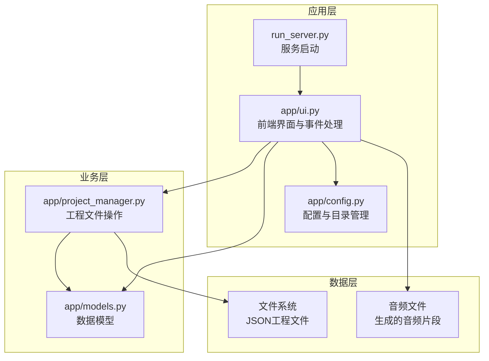
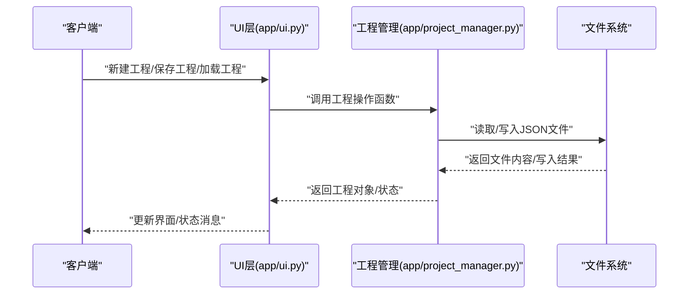
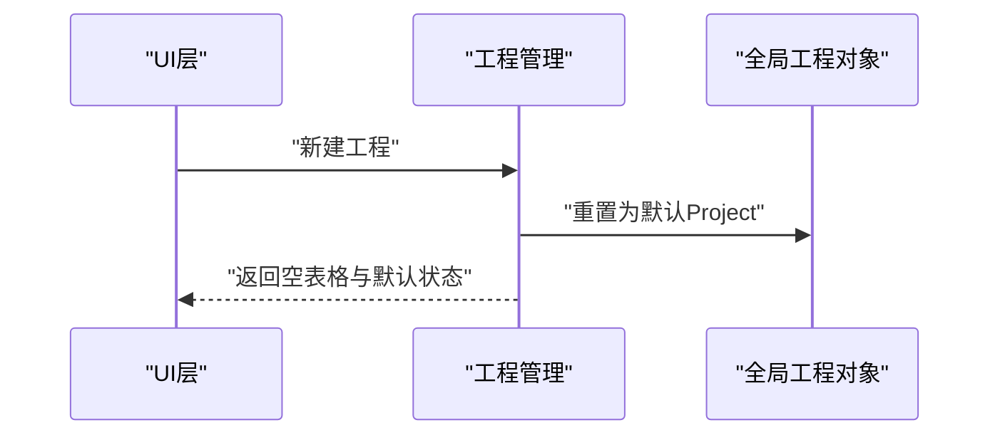
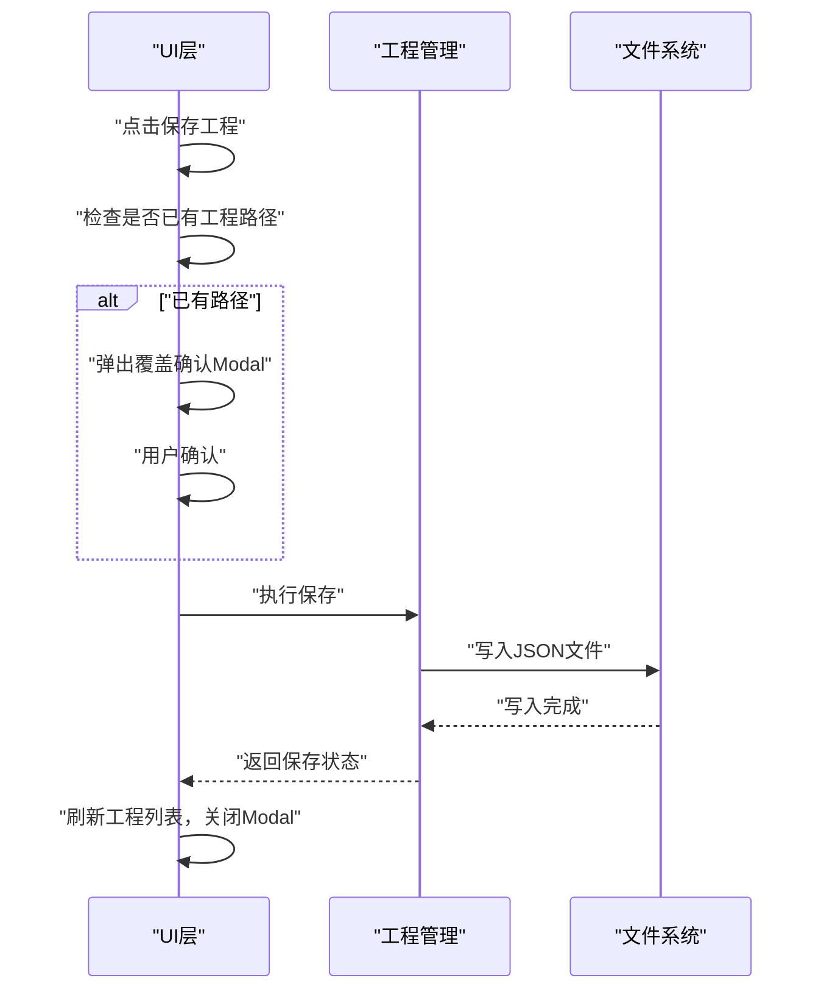
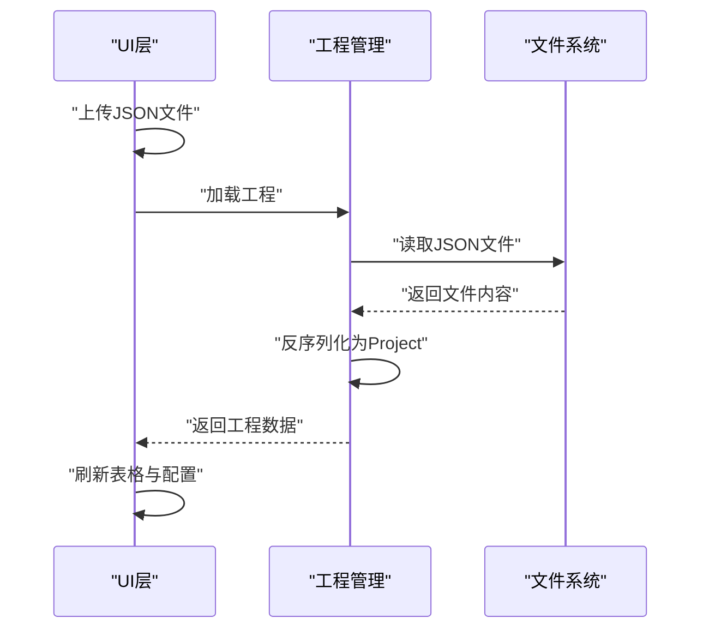
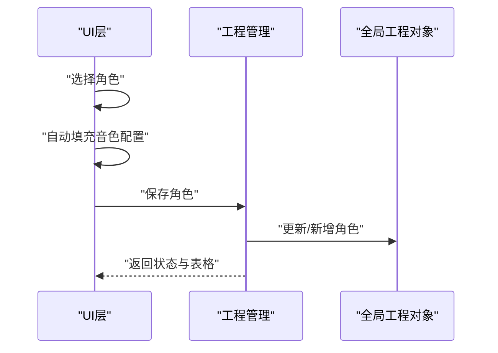
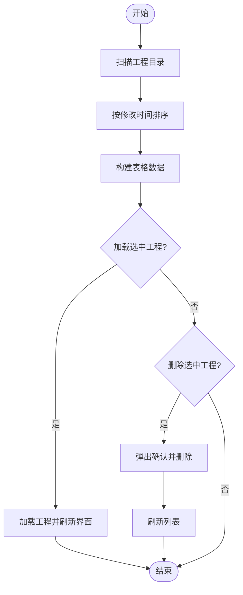
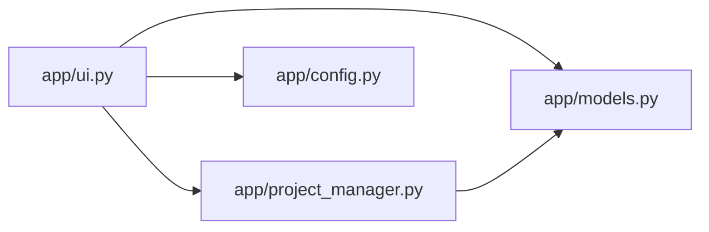

# 工程管理接口

<cite>
**本文档引用的文件**
- [app/project_manager.py](file://app/project_manager.py)
- [app/models.py](file://app/models.py)
- [app/ui.py](file://app/ui.py)
- [app/config.py](file://app/config.py)
- [run_server.py](file://run_server.py)
- [tests/test_e2e_routes.py](file://tests/test_e2e_routes.py)
</cite>

## 目录
1. [简介](#简介)
2. [项目结构](#项目结构)
3. [核心组件](#核心组件)
4. [架构概览](#架构概览)
5. [详细组件分析](#详细组件分析)
6. [依赖关系分析](#依赖关系分析)
7. [性能考量](#性能考量)
8. [故障排除指南](#故障排除指南)
9. [结论](#结论)
10. [附录](#附录)

## 简介
本文件为工程管理系统的核心API文档，聚焦于项目文件操作的完整接口体系，涵盖以下能力：
- 项目创建接口：新建工程、初始化工程数据结构
- 项目保存接口：工程持久化、覆盖保存、新工程创建
- 项目加载接口：本地工程文件加载、工程列表管理、删除确认
- 角色配置管理接口：角色增删改查、角色覆盖确认、角色与音色映射
- 工程状态查询接口：工程文件列表、工程状态展示、工程路径跟踪

文档还提供工程文件格式规范（JSON结构、字段定义、版本兼容性）、文件I/O安全考虑与性能优化建议，并给出工程备份恢复、版本管理和批量操作的最佳实践。

## 项目结构
工程采用模块化设计，核心文件如下：
- app/project_manager.py：工程文件的序列化与反序列化，负责项目创建、保存、加载
- app/models.py：工程数据模型定义（Project、ScriptLine、AudioClip、Character）
- app/ui.py：Gradio前端界面与事件处理，封装所有工程管理操作入口
- app/config.py：配置与目录管理（数据目录、音色配置、默认参数）
- run_server.py：服务启动入口
- tests/test_e2e_routes.py：端到端测试，验证工程管理流程与数据结构

**图表来源**
- [app/ui.py:13-1858](file://app/ui.py#L13-L1858)
- [app/project_manager.py:1-73](file://app/project_manager.py#L1-L73)
- [app/models.py:1-78](file://app/models.py#L1-L78)
- [app/config.py:1-74](file://app/config.py#L1-L74)
- [run_server.py:1-5](file://run_server.py#L1-L5)

**章节来源**
- [app/ui.py:13-1858](file://app/ui.py#L13-L1858)
- [app/project_manager.py:1-73](file://app/project_manager.py#L1-L73)
- [app/models.py:1-78](file://app/models.py#L1-L78)
- [app/config.py:1-74](file://app/config.py#L1-L74)
- [run_server.py:1-5](file://run_server.py#L1-L5)

## 核心组件
- 工程模型（Project）：包含工程基本信息、原始文本、脚本行、音频片段、BGM片段、音效片段、LLM配置、角色列表、角色音色映射
- 脚本行（ScriptLine）：解析后的中间格式，包含类型、角色、情感、文本、音色、语速、音调、SSML文本
- 音频片段（AudioClip）：对白/音效/背景乐的音频片段，包含ID、类型、角色、文本、文件路径、音色、语速、音调、SSML文本、音量、开始时间、时长、生成状态
- 角色（Character）：角色定义，包含名称、音色ID、语速、音调、音量、性格摘要、描述、年龄、性别、情绪风格、备注

这些组件共同构成工程文件的JSON结构，支持向后兼容与版本演进。

**章节来源**
- [app/models.py:4-78](file://app/models.py#L4-L78)

## 架构概览
工程管理API围绕三个核心流程展开：
- 项目创建：通过UI触发，初始化Project对象，生成脚本行与音频片段
- 项目保存：将Project对象序列化为JSON文件，支持覆盖保存与新工程创建
- 项目加载：从JSON文件反序列化为Project对象，支持工程列表管理与删除确认

**图表来源**
- [app/ui.py:749-826](file://app/ui.py#L749-L826)
- [app/ui.py:828-892](file://app/ui.py#L828-L892)
- [app/project_manager.py:31-73](file://app/project_manager.py#L31-L73)

**章节来源**
- [app/ui.py:749-826](file://app/ui.py#L749-L826)
- [app/ui.py:828-892](file://app/ui.py#L828-L892)
- [app/project_manager.py:31-73](file://app/project_manager.py#L31-L73)

## 详细组件分析

### 项目创建接口
- 功能概述：创建新工程，初始化Project对象，清空历史数据，准备工程编辑界面
- 触发方式：UI中的“新建工程”按钮
- 关键流程：
  - 重置全局工程对象为默认Project实例
  - 清空工程名、输入文本、LLM配置、角色列表、音频片段
  - 返回空表格与默认UI状态
- 参数规范：无外部参数，内部重置全局状态
- 返回值：空表格、默认工程名、空输入文本、默认LLM配置、空角色列表、空角色下拉框
- 异常处理：无外部异常，内部重置失败会抛出异常并由UI捕获
- 状态码：无HTTP状态码，Gradio事件返回值

**图表来源**
- [app/ui.py:895-912](file://app/ui.py#L895-L912)

**章节来源**
- [app/ui.py:895-912](file://app/ui.py#L895-L912)

### 项目保存接口
- 功能概述：将当前工程保存为JSON文件，支持覆盖保存与新工程创建
- 触发方式：UI中的“保存工程”按钮，分两步处理
  - 准备保存：检查是否已有工程路径，若存在则弹出覆盖确认Modal
  - 执行保存：根据路径决定覆盖或新建，调用保存函数并刷新工程列表
- 关键流程：
  - 若已有工程路径且存在：弹出覆盖确认Modal，等待用户确认
  - 用户确认后：执行保存，记录日志，刷新工程列表，关闭Modal
  - 若无工程路径：生成新文件名（工程名+时间戳），保存并记录日志
- 参数规范：
  - 保存路径：PROJECTS_DIR下的JSON文件
  - 工程数据：Project对象（含name、raw_text、script_lines、audio_clips、bgm_clips、sfx_clips、llm_config、characters、character_voices）
- 返回值：覆盖/新建状态消息、工程列表更新、Modal关闭
- 异常处理：保存失败记录错误日志并抛出异常，由UI捕获并提示
- 状态码：无HTTP状态码

**图表来源**
- [app/ui.py:749-826](file://app/ui.py#L749-L826)
- [app/project_manager.py:59-73](file://app/project_manager.py#L59-L73)

**章节来源**
- [app/ui.py:749-826](file://app/ui.py#L749-L826)
- [app/project_manager.py:59-73](file://app/project_manager.py#L59-L73)

### 项目加载接口
- 功能概述：从本地JSON文件加载工程，支持工程列表管理与删除确认
- 触发方式：UI中的“加载工程”按钮与工程列表操作
- 关键流程：
  - 上传JSON文件：获取文件路径，调用加载函数
  - 加载函数：读取JSON，反序列化为Project对象，恢复LLM配置与角色数据
  - 工程列表：扫描PROJECTS_DIR下的JSON文件，按修改时间排序，显示文件名、修改时间、大小
  - 删除确认：弹出Modal确认删除，执行删除并刷新列表
- 参数规范：
  - 文件路径：PROJECTS_DIR下的JSON文件
  - 工程数据：Project对象（含name、raw_text、script_lines、audio_clips、bgm_clips、sfx_clips、llm_config、characters、character_voices）
- 返回值：表格数据、LLM配置、角色列表、工程列表更新
- 异常处理：加载失败记录错误日志并抛出异常，删除失败提示错误
- 状态码：无HTTP状态码

**图表来源**
- [app/ui.py:828-892](file://app/ui.py#L828-L892)
- [app/project_manager.py:31-57](file://app/project_manager.py#L31-L57)

**章节来源**
- [app/ui.py:828-892](file://app/ui.py#L828-L892)
- [app/project_manager.py:31-57](file://app/project_manager.py#L31-L57)

### 角色配置管理接口
- 功能概述：角色的增删改查、角色覆盖确认、角色与音色映射
- 触发方式：UI中的“角色管理”面板
- 关键流程：
  - 角色列表：显示角色名、音色、语速、音调、性格摘要
  - 新建角色：清空表单，输入角色信息，点击保存
  - 覆盖确认：若角色名已存在，弹出Modal确认覆盖
  - 删除角色：选中角色，点击删除，弹出确认
  - 选择角色：从角色列表选择，自动填充音色配置
- 参数规范：
  - 角色数据：Character对象（name、voice_id、rate、pitch、volume、personality、description、age、gender、emotion_style、notes）
  - 音色选项：VOICE_OPTIONS（显示名称与真实ID映射）
- 返回值：角色状态消息、角色表格更新、Modal关闭
- 异常处理：角色名为空、角色不存在等异常由UI抛出并提示
- 状态码：无HTTP状态码

**图表来源**
- [app/ui.py:1150-1516](file://app/ui.py#L1150-L1516)
- [app/models.py:4-17](file://app/models.py#L4-L17)

**章节来源**
- [app/ui.py:1150-1516](file://app/ui.py#L1150-L1516)
- [app/models.py:4-17](file://app/models.py#L4-L17)

### 工程状态查询接口
- 功能概述：工程文件列表查询、工程状态展示、工程路径跟踪
- 触发方式：UI中的工程管理表格与状态显示
- 关键流程：
  - 工程列表：扫描PROJECTS_DIR，按修改时间排序，显示文件名、修改时间、大小
  - 加载选中工程：根据选中行索引定位文件，加载并刷新界面
  - 删除选中工程：弹出确认，执行删除并刷新列表
  - 当前工程路径：记录当前工程文件路径，用于覆盖保存
- 参数规范：无外部参数，内部维护current_project_path
- 返回值：工程列表数据、状态消息、界面更新
- 异常处理：选中行无效、文件不存在等异常由UI抛出并提示
- 状态码：无HTTP状态码

**图表来源**
- [app/ui.py:915-1140](file://app/ui.py#L915-L1140)

**章节来源**
- [app/ui.py:915-1140](file://app/ui.py#L915-L1140)

## 依赖关系分析
- 模块耦合：
  - app/ui.py依赖app/project_manager.py进行工程文件操作
  - app/ui.py依赖app/models.py进行数据模型操作
  - app/ui.py依赖app/config.py进行配置与目录管理
  - app/project_manager.py依赖app/models.py进行数据结构转换
- 外部依赖：
  - Gradio用于前端界面与事件处理
  - Python标准库（json、os、pathlib、dataclasses等）

**图表来源**
- [app/ui.py:1-12](file://app/ui.py#L1-L12)
- [app/project_manager.py:1-7](file://app/project_manager.py#L1-L7)

**章节来源**
- [app/ui.py:1-12](file://app/ui.py#L1-L12)
- [app/project_manager.py:1-7](file://app/project_manager.py#L1-L7)

## 性能考量
- UI构建性能：使用Tabs作为顶级布局，避免深层嵌套导致的DOM操作过多
- 表格刷新性能：对大量数据的表格刷新应控制在合理时间内，避免阻塞主线程
- 文件I/O性能：JSON文件读写采用UTF-8编码，建议在批量操作时合并写入以减少磁盘IO
- 异步处理：音频合成采用异步方式，避免阻塞UI线程

[本节为通用性能指导，无需特定文件来源]

## 故障排除指南
- 保存失败：检查PROJECTS_DIR是否存在与权限，确认文件路径是否有效
- 加载失败：检查JSON文件格式是否正确，字段是否完整
- 角色覆盖：若角色名重复，需确认覆盖操作；否则会弹出确认对话框
- 工程列表为空：检查PROJECTS_DIR下是否存在JSON文件，确认文件扩展名为.json
- 预加载异常：应用启动时会尝试预加载最近的工程文件，失败时会降级到默认值并记录日志

**章节来源**
- [app/ui.py:811-815](file://app/ui.py#L811-L815)
- [app/ui.py:886-890](file://app/ui.py#L886-L890)
- [app/ui.py:1195-1204](file://app/ui.py#L1195-L1204)

## 结论
本工程管理接口以清晰的模块划分与完善的错误处理机制，提供了完整的项目文件操作能力。通过统一的工程模型与JSON格式规范，实现了跨版本兼容与数据一致性。结合Gradio的事件驱动架构，用户可以在直观的界面中完成工程的创建、保存、加载与角色管理等操作。

[本节为总结性内容，无需特定文件来源]

## 附录

### 工程文件格式规范（JSON结构）
- 字段定义：
  - name：工程名称
  - raw_text：原始文本
  - script_lines：脚本行数组（ScriptLine）
  - audio_clips：音频片段数组（AudioClip）
  - bgm_clips：背景音乐片段数组（AudioClip）
  - sfx_clips：音效片段数组（AudioClip）
  - llm_config：LLM配置（api_base、api_key、model）
  - characters：角色数组（Character）
  - character_voices：角色音色映射（向后兼容）
- 版本兼容性：
  - 支持旧版工程的characters字段加载
  - 保存时同时写入characters与character_voices，确保向后兼容

**章节来源**
- [app/project_manager.py:31-73](file://app/project_manager.py#L31-L73)
- [app/models.py:4-78](file://app/models.py#L4-L78)

### 文件I/O安全考虑
- 路径安全：使用pathlib.Path确保路径安全，限制访问范围（allowed_paths）
- 编码安全：统一使用UTF-8编码读写JSON文件
- 权限控制：确保PROJECTS_DIR与AUDIO_DIR存在且具备读写权限
- 异常处理：所有文件操作均包含try-except，失败时记录详细日志

**章节来源**
- [app/ui.py:17-22](file://app/ui.py#L17-L22)
- [app/config.py:23-26](file://app/config.py#L23-L26)

### 性能优化建议
- 批量操作：在批量生成音频时，采用异步并发策略，避免阻塞UI
- 表格渲染：对大量数据的表格采用虚拟滚动或分页，减少DOM节点数量
- 缓存策略：对频繁访问的工程文件内容进行内存缓存，减少重复读取
- I/O合并：在批量保存时合并多次写入为一次写入，降低磁盘IO压力

[本节为通用性能指导，无需特定文件来源]

### 备份恢复与版本管理最佳实践
- 备份策略：定期导出工程文件，建议按日期命名并在不同介质存储
- 版本管理：在工程文件中记录版本信息，便于回滚与迁移
- 恢复流程：从备份文件加载工程，检查字段完整性，必要时进行字段迁移
- 批量操作：使用工程列表进行批量加载与保存，确保操作的一致性

**章节来源**
- [app/ui.py:915-958](file://app/ui.py#L915-L958)