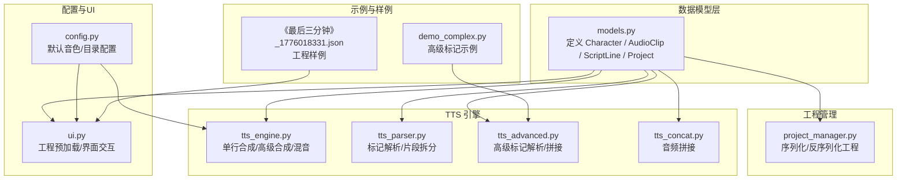
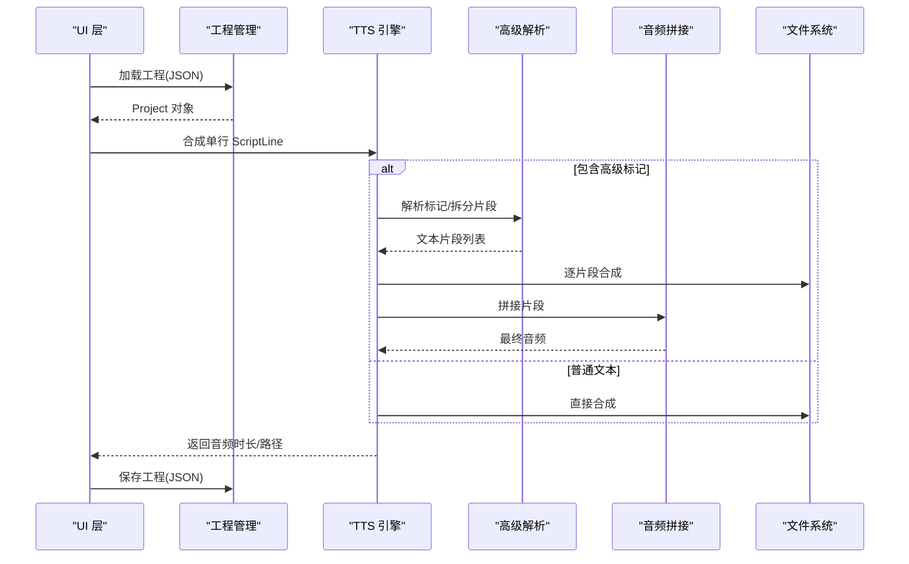
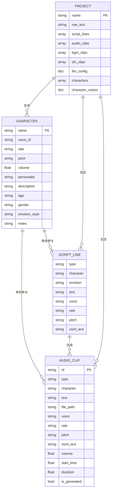
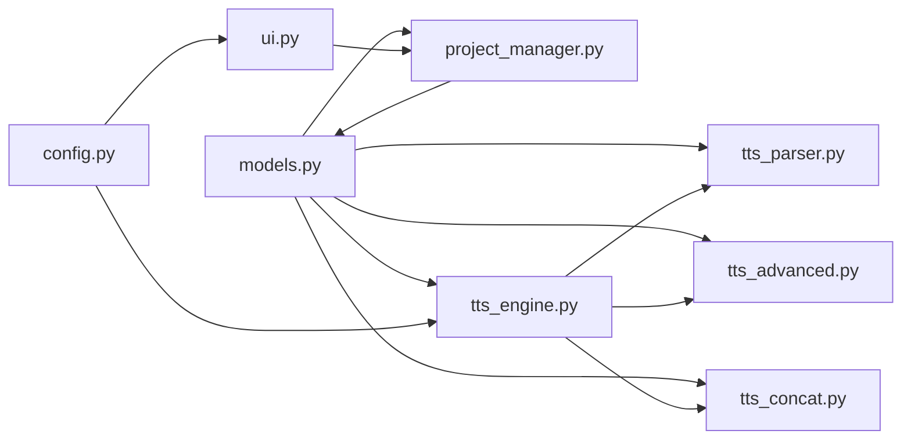

# 数据模型

<cite>
**本文引用的文件**
- [app/models.py](file://app/models.py)
- [app/project_manager.py](file://app/project_manager.py)
- [app/tts_engine.py](file://app/tts_engine.py)
- [app/tts_parser.py](file://app/tts_parser.py)
- [app/tts_advanced.py](file://app/tts_advanced.py)
- [app/tts_concat.py](file://app/tts_concat.py)
- [app/config.py](file://app/config.py)
- [app/ui.py](file://app/ui.py)
- [demo_complex.py](file://demo_complex.py)
- [data/projects/《最后三分钟》_1776018331.json](file://data/projects/《最后三分钟》_1776018331.json)
</cite>

## 目录
1. [简介](#简介)
2. [项目结构](#项目结构)
3. [核心数据模型](#核心数据模型)
4. [架构概览](#架构概览)
5. [详细组件分析](#详细组件分析)
6. [依赖关系分析](#依赖关系分析)
7. [性能考量](#性能考量)
8. [故障排查指南](#故障排查指南)
9. [结论](#结论)
10. [附录](#附录)

## 简介
本文件面向 TTS Studio 的数据模型，系统化梳理并说明以下数据类的字段定义、类型、默认值、取值范围、必填性以及它们之间的关联关系：
- Character 角色模型
- AudioClip 音频片段模型
- ScriptLine 剧本行模型
- Project 工程模型

同时给出字段间的关系图、使用示例与生命周期说明，帮助开发者与使用者高效理解与应用这些数据模型。

## 项目结构
围绕数据模型的关键模块如下：
- 数据模型定义：app/models.py
- 工程序列化/反序列化：app/project_manager.py
- TTS 引擎与高级标记解析：app/tts_engine.py、app/tts_parser.py、app/tts_advanced.py
- 音频拼接与混音：app/tts_concat.py
- 配置与默认音色：app/config.py
- UI 与工程加载：app/ui.py
- 示例与工程样例：demo_complex.py、data/projects/《最后三分钟》_1776018331.json

图表来源
- [app/models.py:1-78](file://app/models.py#L1-L78)
- [app/project_manager.py:1-73](file://app/project_manager.py#L1-L73)
- [app/tts_engine.py:1-547](file://app/tts_engine.py#L1-L547)
- [app/tts_parser.py:1-220](file://app/tts_parser.py#L1-L220)
- [app/tts_advanced.py:1-290](file://app/tts_advanced.py#L1-L290)
- [app/tts_concat.py:1-159](file://app/tts_concat.py#L1-L159)
- [app/config.py:1-74](file://app/config.py#L1-L74)
- [app/ui.py:1-200](file://app/ui.py#L1-L200)
- [demo_complex.py:1-239](file://demo_complex.py#L1-L239)
- [data/projects/《最后三分钟》_1776018331.json:1-221](file://data/projects/《最后三分钟》_1776018331.json#L1-L221)

章节来源
- [app/models.py:1-78](file://app/models.py#L1-L78)
- [app/project_manager.py:1-73](file://app/project_manager.py#L1-L73)
- [app/tts_engine.py:1-547](file://app/tts_engine.py#L1-L547)
- [app/tts_parser.py:1-220](file://app/tts_parser.py#L1-L220)
- [app/tts_advanced.py:1-290](file://app/tts_advanced.py#L1-L290)
- [app/tts_concat.py:1-159](file://app/tts_concat.py#L1-L159)
- [app/config.py:1-74](file://app/config.py#L1-L74)
- [app/ui.py:1-200](file://app/ui.py#L1-L200)
- [demo_complex.py:1-239](file://demo_complex.py#L1-L239)
- [data/projects/《最后三分钟》_1776018331.json:1-221](file://data/projects/《最后三分钟》_1776018331.json#L1-L221)

## 核心数据模型

### Character 角色模型
- 作用：描述一个角色的基本属性与声音特征，用于后续 TTS 合成与工程管理。
- 字段定义与约束
  - name: 字符串；角色名称（如“旁白”、“李远”）；必需；无默认值
  - voice_id: 字符串；音色 ID（如 zh-CN-YunjianNeural）；必需；无默认值
  - rate: 字符串；语速；可选；默认值 "+0%"
  - pitch: 字符串；音调；可选；默认值 "+0Hz"
  - volume: 浮点数；音量倍数；可选；默认值 1.0
  - personality: 字符串；性格摘要（如“沉稳、内敛”）；可选；默认值 ""
  - description: 字符串；角色介绍；可选；默认值 ""
  - age: 字符串；年龄段（如“青年”、“中年”）；可选；默认值 ""
  - gender: 字符串；性别；可选；默认值 ""
  - emotion_style: 字符串；情绪风格（如“冷静”、“激昂”）；可选；默认值 ""
  - notes: 字符串；备注说明；可选；默认值 ""
- 取值范围与说明
  - rate/pitch/volume 为字符串形式，遵循 TTS 引擎参数约定；具体格式由引擎解析
  - voice_id 来源于配置中的音色选项集合
- 关联关系
  - Project.characters 列表包含多个 Character
  - ScriptLine/ AudioClip 中的 voice/rate/pitch 字段与 Character 的对应字段可复用或覆盖

章节来源
- [app/models.py:4-17](file://app/models.py#L4-L17)
- [app/config.py:28-58](file://app/config.py#L28-L58)

### AudioClip 音频片段模型
- 作用：描述单个音频片段（对白/音效/背景乐），包含合成参数与文件路径。
- 字段定义与约束
  - id: 字符串；片段唯一标识；必需；无默认值
  - type: 字符串；类型："dialogue"、"bgm"、"sfx"；必需；无默认值
  - character: 字符串；所属角色名；可选；默认值 ""
  - text: 字符串；文本内容（供审核查看）；可选；默认值 ""
  - file_path: 字符串；音频文件绝对路径；必需；无默认值
  - voice: 字符串；音色；可选；默认值 ""
  - rate: 字符串；语速；可选；默认值 ""
  - pitch: 字符串；音调；可选；默认值 ""
  - ssml_text: 字符串；SSML 标记文本（直接发送给 TTS）；可选；默认值 ""
  - volume: 浮点数；音量倍数；可选；默认值 1.0
  - start_time: 浮点数；开始时间（秒）；可选；默认值 0.0
  - duration: 浮点数；时长（秒）；可选；默认值 0.0
  - is_generated: 布尔；是否已生成；可选；默认值 false
- 关联关系
  - Project.audio_clips/bgm_clips/sfx_clips 列表包含多个 AudioClip
  - 与 ScriptLine 的字段映射用于合成参数传递

章节来源
- [app/models.py:19-35](file://app/models.py#L19-L35)
- [app/project_manager.py:9-29](file://app/project_manager.py#L9-L29)

### ScriptLine 剧本行模型
- 作用：解析后的中间格式，承载单行剧本的类型、角色、情感与文本，以及 TTS 参数。
- 字段定义与约束
  - type: 字符串；类型："direction"、"narration"、"dialogue" 等；必需；无默认值
  - character: 字符串；角色名；可选；默认值 ""
  - emotion: 字符串；情感描述；可选；默认值 ""
  - text: 字符串；文本内容（供审核查看）；可选；默认值 ""
  - voice: 字符串；音色；可选；默认值 ""
  - rate: 字符串；语速；可选；默认值 ""
  - pitch: 字符串；音调；可选；默认值 ""
  - ssml_text: 字符串；SSML 标记文本（直接发送给 TTS）；可选；默认值 ""
- 方法
  - get_tts_text(): 返回用于 TTS 合成的文本，优先使用 ssml_text，否则使用 text
- 关联关系
  - Project.script_lines 列表包含多个 ScriptLine
  - 与 AudioClip 的字段映射用于合成参数传递

章节来源
- [app/models.py:36-61](file://app/models.py#L36-L61)

### Project 工程模型
- 作用：完整工程对象，包含原始文本、解析后的脚本行、音频片段、角色列表与 LLM 配置等。
- 字段定义与约束
  - name: 字符串；工程名；必需；无默认值
  - raw_text: 字符串；原始文本；可选；默认值 ""
  - script_lines: 列表；ScriptLine 列表；可选；默认值 []
  - audio_clips: 列表；AudioClip 列表；可选；默认值 []
  - bgm_clips: 列表；背景音乐片段列表；可选；默认值 []
  - sfx_clips: 列表；音效片段列表；可选；默认值 []
  - llm_config: 字典；LLM 配置；可选；默认值 {}
  - characters: 列表；角色列表；可选；默认值 []
  - character_voices: 字典；向后兼容的音色映射；可选；默认值 {}
- 关联关系
  - 与 Character/ScriptLine/AudioClip 的一对多关系
  - 通过 project_manager 的序列化/反序列化进行持久化

章节来源
- [app/models.py:63-77](file://app/models.py#L63-L77)
- [app/project_manager.py:31-73](file://app/project_manager.py#L31-L73)

## 架构概览
数据模型在系统中的流转路径如下：
- UI 预加载工程，构建 Project
- Project.script_lines 作为 TTS 合成的输入
- TTS 引擎根据 ScriptLine 字段生成 AudioClip
- Project.audio_clips/bgm_clips/sfx_clips 用于最终混音与导出

图表来源
- [app/ui.py:44-143](file://app/ui.py#L44-L143)
- [app/project_manager.py:31-73](file://app/project_manager.py#L31-L73)
- [app/tts_engine.py:120-453](file://app/tts_engine.py#L120-L453)
- [app/tts_advanced.py:112-290](file://app/tts_advanced.py#L112-L290)
- [app/tts_concat.py:17-90](file://app/tts_concat.py#L17-L90)

## 详细组件分析

### 字段关系与生命周期
- 生命周期阶段
  - 工程加载：从 JSON 反序列化为 Project，填充 script_lines、audio_clips 等
  - 脚本解析：LLM 或人工编辑生成 ScriptLine
  - 音频合成：根据 ScriptLine 生成 AudioClip
  - 混音导出：将多个 AudioClip 按时间轴混合并导出
  - 工程保存：将 Project 序列化为 JSON
- 关系图

图表来源
- [app/models.py:4-77](file://app/models.py#L4-L77)
- [app/project_manager.py:31-73](file://app/project_manager.py#L31-L73)

章节来源
- [app/models.py:4-77](file://app/models.py#L4-L77)
- [app/project_manager.py:31-73](file://app/project_manager.py#L31-L73)

### 使用示例与最佳实践
- 示例：高级标记合成
  - 使用 demo_complex.py 中的 ScriptLine 构造与高级合成流程
  - 适合演示 phoneme、pause、prosody 等标记的组合效果
- 工程样例：《最后三分钟》
  - 展示了完整的工程 JSON 结构，包含 script_lines、audio_clips、llm_config 等字段
  - 适合对照理解字段含义与取值范围

章节来源
- [demo_complex.py:20-239](file://demo_complex.py#L20-L239)
- [data/projects/《最后三分钟》_1776018331.json:1-221](file://data/projects/《最后三分钟》_1776018331.json#L1-L221)

## 依赖关系分析
- 模型依赖
  - Project 依赖 Character/ScriptLine/AudioClip
  - TTS 引擎依赖 ScriptLine/AudioClip
  - 工程管理依赖 Project/ScriptLine/AudioClip/Character
- 外部依赖
  - 音频拼接依赖 FFmpeg 命令行
  - 时长获取依赖 mutagen（若不可用则估算）

图表来源
- [app/models.py:1-78](file://app/models.py#L1-L78)
- [app/project_manager.py:1-73](file://app/project_manager.py#L1-L73)
- [app/tts_engine.py:1-547](file://app/tts_engine.py#L1-L547)
- [app/tts_parser.py:1-220](file://app/tts_parser.py#L1-L220)
- [app/tts_advanced.py:1-290](file://app/tts_advanced.py#L1-L290)
- [app/tts_concat.py:1-159](file://app/tts_concat.py#L1-L159)
- [app/config.py:1-74](file://app/config.py#L1-L74)
- [app/ui.py:1-200](file://app/ui.py#L1-L200)

章节来源
- [app/models.py:1-78](file://app/models.py#L1-L78)
- [app/project_manager.py:1-73](file://app/project_manager.py#L1-L73)
- [app/tts_engine.py:1-547](file://app/tts_engine.py#L1-L547)
- [app/tts_parser.py:1-220](file://app/tts_parser.py#L1-L220)
- [app/tts_advanced.py:1-290](file://app/tts_advanced.py#L1-L290)
- [app/tts_concat.py:1-159](file://app/tts_concat.py#L1-L159)
- [app/config.py:1-74](file://app/config.py#L1-L74)
- [app/ui.py:1-200](file://app/ui.py#L1-L200)

## 性能考量
- 音频拼接与混音
  - 使用 FFmpeg 命令行进行拼接与混音，避免额外依赖 pydub 的解码器
  - 混音时按 start_time 计算延迟并叠加，确保时间轴对齐
- 时长估算
  - 若无法读取音频时长，采用字符数估算或 mutagen 读取
- UI 预加载
  - 避免使用 demo.load，采用静态初始化与预加载数据，提升首屏性能

章节来源
- [app/tts_concat.py:17-90](file://app/tts_concat.py#L17-L90)
- [app/tts_engine.py:454-547](file://app/tts_engine.py#L454-L547)
- [app/ui.py:17-143](file://app/ui.py#L17-L143)

## 故障排查指南
- 常见问题
  - 403 网络错误：检查代理设置或网络访问微软服务
  - 时长读取失败：确认安装 mutagen 或接受估算时长
  - FFmpeg 拼接失败：检查 FFmpeg 可执行文件路径与权限
- 日志定位
  - TTS 引擎与高级合成均输出详细日志，包含尝试次数、错误类型与重试等待时间
- 工程加载失败
  - 确认 JSON 结构与字段完整性；必要时使用向后兼容字段（如 character_voices）

章节来源
- [app/tts_engine.py:292-318](file://app/tts_engine.py#L292-L318)
- [app/tts_engine.py:440-453](file://app/tts_engine.py#L440-L453)
- [app/project_manager.py:31-73](file://app/project_manager.py#L31-L73)

## 结论
本文系统梳理了 TTS Studio 的数据模型，明确了各字段的定义、类型、默认值与取值范围，并通过关系图与流程图展示了它们在工程中的生命周期与相互依赖。结合示例与最佳实践，开发者可据此高效构建与维护工程，实现高质量的 TTS 合成与导出。

## 附录
- 字段默认值与取值范围总结
  - Character：rate/pitch/volume 为字符串，遵循 TTS 参数约定；voice_id 来自配置
  - AudioClip：volume 默认 1.0；start_time/duration 默认 0.0；is_generated 默认 false
  - ScriptLine：ssml_text 默认空；get_tts_text 优先使用 ssml_text
  - Project：script_lines/audio_clips 等默认空列表；llm_config 默认空字典；characters 默认空列表
- 相关实现参考
  - 工程序列化/反序列化：project_manager.py
  - TTS 合成与高级标记：tts_engine.py、tts_parser.py、tts_advanced.py
  - 音频拼接与混音：tts_concat.py
  - 配置与默认音色：config.py
  - UI 预加载与工程管理：ui.py
  - 示例与样例：demo_complex.py、data/projects/《最后三分钟》_1776018331.json