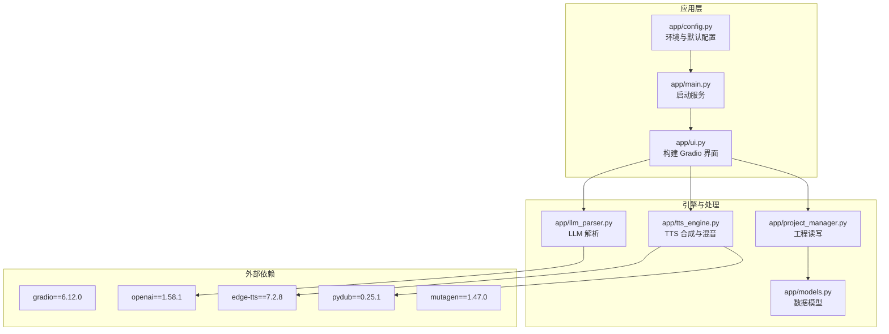
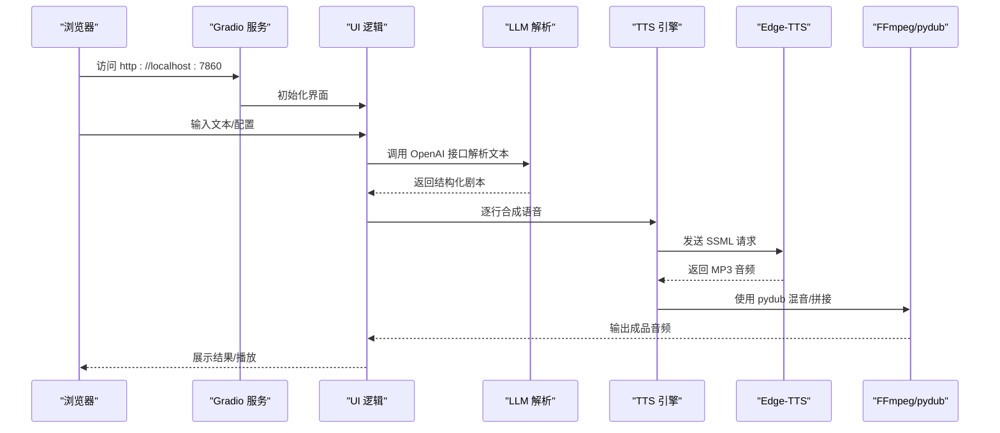

# 快速开始

<cite>
**本文引用的文件**
- [requirements.txt](file://requirements.txt)
- [Dockerfile](file://Dockerfile)
- [docker-compose.yml](file://docker-compose.yml)
- [app/main.py](file://app/main.py)
- [app/config.py](file://app/config.py)
- [docs/FFMPEG_INSTALL_GUIDE.md](file://docs/FFMPEG_INSTALL_GUIDE.md)
- [docs/FFMPEG_INSTALL_MANUAL.md](file://docs/FFMPEG_INSTALL_MANUAL.md)
- [docs/GRADIO_QUICK_REFERENCE.md](file://docs/GRADIO_QUICK_REFERENCE.md)
- [tests/test_minimal.py](file://tests/test_minimal.py)
- [tests/test_simple.py](file://tests/test_simple.py)
- [run_server.py](file://run_server.py)
</cite>

## 目录
1. [简介](#简介)
2. [项目结构](#项目结构)
3. [核心组件](#核心组件)
4. [架构概览](#架构概览)
5. [详细组件分析](#详细组件分析)
6. [依赖分析](#依赖分析)
7. [性能注意事项](#性能注意事项)
8. [故障排除指南](#故障排除指南)
9. [结论](#结论)
10. [附录](#附录)

## 简介
本指南面向首次接触 TTS Studio 的用户，帮助您在本地或容器环境中快速完成安装、配置与启动。您将学会：
- 环境要求与依赖安装
- Docker 容器化部署与本地开发环境配置
- 关键依赖项（如 Gradio、Edge-TTS、OpenAI）的作用与配置
- FFmpeg 安装与验证
- 启动 Web 界面并访问 localhost:7860
- 常见安装问题的排查与解决

## 项目结构
TTS Studio 采用模块化设计，核心由 Web UI、TTS 引擎、音频处理与工程管理组成。主要目录与文件：
- app：应用主逻辑（UI 构建、配置、TTS 引擎、项目管理）
- docs：安装与使用文档（含 FFmpeg、Gradio 性能优化）
- tests：单元测试与最小可用测试样例
- 根目录：Dockerfile、docker-compose.yml、requirements.txt、run_server.py

图表来源
- [app/main.py:1-51](file://app/main.py#L1-L51)
- [app/ui.py:1-200](file://app/ui.py#L1-L200)
- [app/config.py:1-74](file://app/config.py#L1-L74)
- [requirements.txt:1-16](file://requirements.txt#L1-L16)

章节来源
- [app/main.py:1-51](file://app/main.py#L1-L51)
- [app/config.py:1-74](file://app/config.py#L1-L74)
- [requirements.txt:1-16](file://requirements.txt#L1-L16)

## 核心组件
- Web UI（Gradio）：提供工程管理、LLM 解析、TTS 生成、混音导出等功能入口
- LLM 解析：基于 OpenAI SDK，将自然语言解析为结构化剧本
- TTS 引擎：基于 Edge-TTS 生成语音，使用 pydub 进行音频拼接与混音
- 工程管理：JSON 存储剧本、音频片段、背景乐与音效
- 配置系统：支持环境变量覆盖默认参数，区分容器与本地开发环境

章节来源
- [app/ui.py:1-200](file://app/ui.py#L1-L200)
- [app/config.py:1-74](file://app/config.py#L1-L74)
- [app/tts_engine.py:134-215](file://app/tts_engine.py#L134-L215)
- [app/llm_parser.py:110-131](file://app/llm_parser.py#L110-L131)
- [app/project_manager.py:218-286](file://app/project_manager.py#L218-L286)

## 架构概览
下图展示了从浏览器访问到音频生成的端到端流程。

图表来源
- [app/main.py:15-51](file://app/main.py#L15-L51)
- [app/ui.py:382-457](file://app/ui.py#L382-L457)
- [app/llm_parser.py:117-130](file://app/llm_parser.py#L117-L130)
- [app/tts_engine.py:144-202](file://app/tts_engine.py#L144-L202)

## 详细组件分析

### Web UI（Gradio）与启动流程
- 启动方式
  - 容器内：Dockerfile 中 CMD 直接运行 app.main
  - 本地开发：app/main.py 直接启动，或使用 run_server.py
- 端口与访问
  - 默认监听 0.0.0.0:7860，可通过环境变量覆盖
- 安全与路径
  - 限定允许访问的数据目录，避免路径泄露

章节来源
- [Dockerfile:48-50](file://Dockerfile#L48-L50)
- [docker-compose.yml:15-23](file://docker-compose.yml#L15-L23)
- [app/main.py:15-51](file://app/main.py#L15-L51)
- [run_server.py:1-5](file://run_server.py#L1-L5)

### LLM 解析（OpenAI）
- 作用：将输入文本解析为结构化剧本（对白、旁白、场景说明）
- 配置：通过 DEFAULT_API_BASE、DEFAULT_API_KEY、DEFAULT_MODEL 控制
- 输出：JSON 数组，供 UI 与 TTS 引擎使用

章节来源
- [app/config.py:4-7](file://app/config.py#L4-L7)
- [app/llm_parser.py:117-130](file://app/llm_parser.py#L117-L130)

### TTS 引擎（Edge-TTS + pydub）
- Edge-TTS：根据 SSML 生成语音，支持 prosody、音色、语速、音调
- pydub：音频拼接、混音、静音/测试音生成
- 输出：MP3 文件，供 UI 播放与导出

章节来源
- [app/tts_engine.py:144-215](file://app/tts_engine.py#L144-L215)

### 工程管理（JSON）
- 将当前工程的原始文本、脚本行、音频片段、背景乐、音效持久化为 JSON
- 支持导入/导出，便于协作与备份

章节来源
- [app/project_manager.py:218-286](file://app/project_manager.py#L218-L286)

## 依赖分析
- Web UI 框架：Gradio 6.12.0（与 requirements.txt 中的版本一致）
- TTS 引擎：Edge-TTS 7.2.8
- LLM 解析：OpenAI 1.58.1
- 音频处理：pydub 0.25.1、mutagen 1.47.0
- 测试框架：pytest >= 7.0.0

章节来源
- [requirements.txt:1-16](file://requirements.txt#L1-L16)

## 性能注意事项
- Gradio 不是响应式框架，避免在事件回调中直接修改组件状态，应通过返回值更新
- 避免使用 demo.load，尽量预加载数据并在初始化时传入
- 减少组件嵌套层级，Tabs/Accordion 不超过 3 层
- 首屏加载时间应小于 2 秒，避免控制台出现大量 Violation 警告

章节来源
- [docs/GRADIO_QUICK_REFERENCE.md:1-151](file://docs/GRADIO_QUICK_REFERENCE.md#L1-L151)

## 故障排除指南

### 1) FFmpeg 未安装或未加入 PATH
- 症状：pydub 报错无法使用 FFmpeg；音频拼接/混音失败
- 解决步骤
  - Windows 手动安装：下载并解压到 C:\ffmpeg，将 C:\ffmpeg\bin 加入 PATH，并重启终端
  - 验证安装：在新终端执行 ffmpeg -version
  - 验证 pydub：运行测试脚本，确保 pydub 可正常使用 FFmpeg
- 相关文档
  - [FFmpeg 安装指南（Windows）:1-99](file://docs/FFMPEG_INSTALL_GUIDE.md#L1-L99)
  - [FFmpeg 手动安装指南（Windows）:1-75](file://docs/FFMPEG_INSTALL_MANUAL.md#L1-L75)

章节来源
- [docs/FFMPEG_INSTALL_GUIDE.md:1-99](file://docs/FFMPEG_INSTALL_GUIDE.md#L1-L99)
- [docs/FFMPEG_INSTALL_MANUAL.md:1-75](file://docs/FFMPEG_INSTALL_MANUAL.md#L1-L75)

### 2) 容器内 FFmpeg 缺失
- 症状：容器启动后无法进行音频拼接
- 解决：Dockerfile 已安装 FFmpeg 与相关编解码库，确保镜像构建成功
- 验证：进入容器执行 ffmpeg -version

章节来源
- [Dockerfile:12-24](file://Dockerfile#L12-L24)

### 3) 端口被占用或无法访问
- 症状：浏览器无法访问 localhost:7860
- 排查
  - 检查端口占用：netstat -ano | findstr :7860
  - 更换端口：通过环境变量 GRADIO_SERVER_PORT 覆盖
  - 容器映射：确认 docker-compose.yml 将宿主机 7860 映射到容器 7860
- 相关配置
  - [app/main.py:17-22](file://app/main.py#L17-L22)
  - [docker-compose.yml:9-10](file://docker-compose.yml#L9-L10)

章节来源
- [app/main.py:17-22](file://app/main.py#L17-L22)
- [docker-compose.yml:9-10](file://docker-compose.yml#L9-L10)

### 4) Gradio 性能问题（卡顿/警告）
- 症状：Tab 切换卡顿、控制台出现 Violation 警告
- 解决：移除 demo.load，采用预加载+静态初始化；减少嵌套层级；避免运行时事件

章节来源
- [docs/GRADIO_QUICK_REFERENCE.md:1-151](file://docs/GRADIO_QUICK_REFERENCE.md#L1-L151)

### 5) LLM 解析失败或返回非 JSON
- 症状：UI 显示解析错误或空白
- 排查
  - 检查 DEFAULT_API_BASE、DEFAULT_API_KEY、DEFAULT_MODEL 是否正确
  - 确认 LLM 服务可达且返回符合要求的 JSON
- 相关配置
  - [app/config.py:4-7](file://app/config.py#L4-L7)
  - [app/llm_parser.py:117-130](file://app/llm_parser.py#L117-L130)

章节来源
- [app/config.py:4-7](file://app/config.py#L4-L7)
- [app/llm_parser.py:117-130](file://app/llm_parser.py#L117-L130)

### 6) 音频生成无声或异常
- 症状：生成的 MP3 无法播放或无声
- 排查
  - 确认 Edge-TTS 可用，SSML 语法正确
  - 确认 pydub 能找到 FFmpeg
  - 使用测试脚本验证：test_minimal.py 与 test_simple.py
- 相关测试
  - [tests/test_minimal.py:1-49](file://tests/test_minimal.py#L1-L49)
  - [tests/test_simple.py:1-34](file://tests/test_simple.py#L1-L34)

章节来源
- [tests/test_minimal.py:1-49](file://tests/test_minimal.py#L1-L49)
- [tests/test_simple.py:1-34](file://tests/test_simple.py#L1-L34)

## 结论
通过本指南，您已经完成了 TTS Studio 的环境准备、依赖安装、容器部署与本地开发配置，并掌握了常见问题的排查方法。建议在正式使用前先运行测试脚本验证各组件协同工作情况，随后即可在浏览器中访问 localhost:7860 开始创作。

## 附录

### A. 安装与配置步骤

- 环境要求
  - Python 3.11+
  - FFmpeg（用于音频拼接与混音）

- 依赖安装
  - 使用 requirements.txt 安装依赖
  - 若需加速，可使用国内镜像源（Dockerfile 中已配置）

- Docker 容器化部署
  - 构建镜像并启动容器
  - 端口映射至 7860，数据卷挂载到 /app/data
  - 通过环境变量覆盖默认 LLM 配置

- 本地开发环境
  - 直接运行 app/main.py 或使用 run_server.py
  - 确保数据目录存在（app/config.py 会自动创建）

章节来源
- [requirements.txt:1-16](file://requirements.txt#L1-L16)
- [Dockerfile:1-51](file://Dockerfile#L1-L51)
- [docker-compose.yml:1-32](file://docker-compose.yml#L1-L32)
- [app/config.py:23-26](file://app/config.py#L23-L26)
- [run_server.py:1-5](file://run_server.py#L1-L5)

### B. 关键依赖项说明

- Gradio 6.12.0
  - 作用：构建 Web 界面与交互事件
  - 版本：与 requirements.txt 一致

- Edge-TTS 7.2.8
  - 作用：将 SSML 文本转为语音
  - 注意：需配合 FFmpeg 进行音频处理

- OpenAI 1.58.1
  - 作用：调用 LLM 接口解析文本为剧本
  - 配置：DEFAULT_API_BASE、DEFAULT_API_KEY、DEFAULT_MODEL

- pydub 0.25.1、mutagen 1.47.0
  - 作用：音频拼接、混音、静音/测试音生成与元数据处理

章节来源
- [requirements.txt:1-16](file://requirements.txt#L1-L16)
- [app/tts_engine.py:134-215](file://app/tts_engine.py#L134-L215)
- [app/llm_parser.py:117-130](file://app/llm_parser.py#L117-L130)

### C. 启动 Web 界面与访问
- 容器启动后，访问 http://localhost:7860
- 本地开发：运行 app/main.py 或 run_server.py 后访问相同地址
- 端口与网络：可通过环境变量 GRADIO_SERVER_NAME/GRADIO_SERVER_PORT 自定义

章节来源
- [docker-compose.yml:15-23](file://docker-compose.yml#L15-L23)
- [app/main.py:17-22](file://app/main.py#L17-L22)
- [run_server.py:1-5](file://run_server.py#L1-L5)