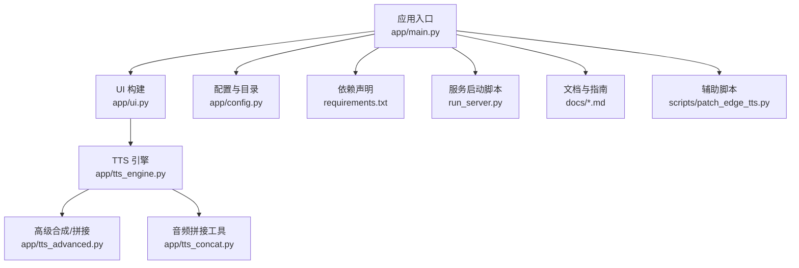
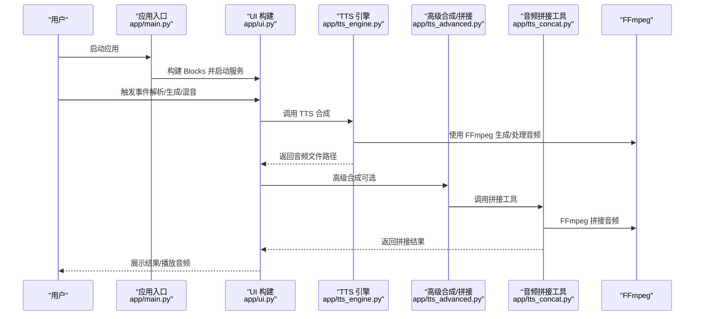
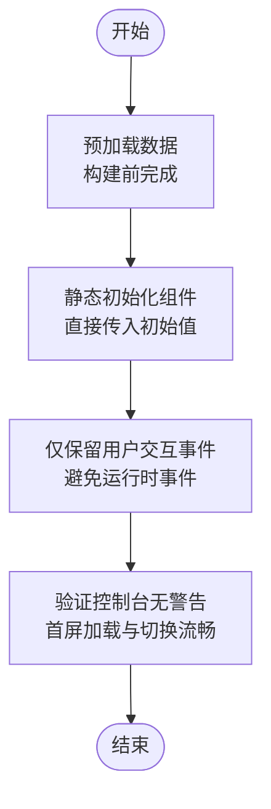
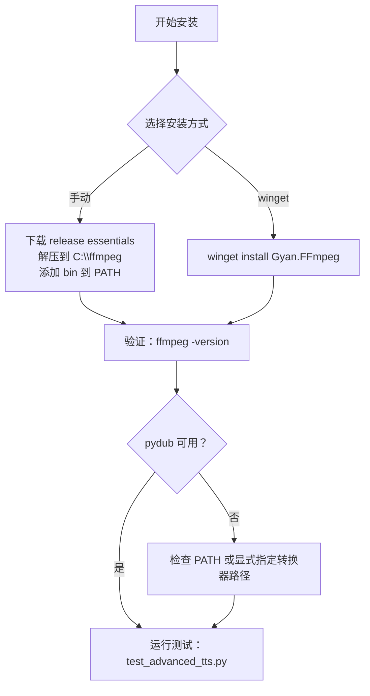
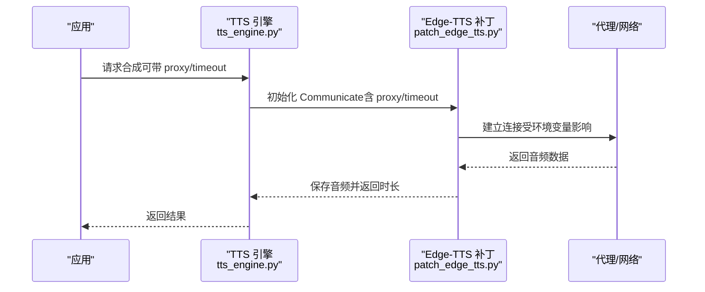
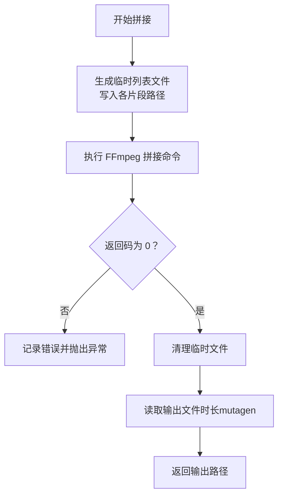
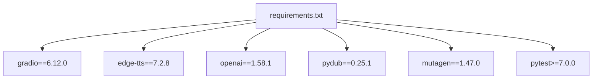

# 故障排除与常见问题

<cite>
**本文引用的文件**
- [GRADIO_PERFORMANCE_ISSUE_RECORD.md](file://docs/GRADIO_PERFORMANCE_ISSUE_RECORD.md)
- [GRADIO_QUICK_REFERENCE.md](file://docs/GRADIO_QUICK_REFERENCE.md)
- [FFMPEG_INSTALL_GUIDE.md](file://docs/FFMPEG_INSTALL_GUIDE.md)
- [FFMPEG_INSTALL_MANUAL.md](file://docs/FFMPEG_INSTALL_MANUAL.md)
- [main.py](file://app/main.py)
- [ui.py](file://app/ui.py)
- [config.py](file://app/config.py)
- [requirements.txt](file://requirements.txt)
- [run_server.py](file://run_server.py)
- [tts_engine.py](file://app/tts_engine.py)
- [tts_advanced.py](file://app/tts_advanced.py)
- [tts_concat.py](file://app/tts_concat.py)
- [.gitignore](file://.gitignore)
- [patch_edge_tts.py](file://scripts/patch_edge_tts.py)
</cite>

## 目录
1. [简介](#简介)
2. [项目结构](#项目结构)
3. [核心组件](#核心组件)
4. [架构总览](#架构总览)
5. [详细组件分析](#详细组件分析)
6. [依赖关系分析](#依赖关系分析)
7. [性能注意事项](#性能注意事项)
8. [故障排除指南](#故障排除指南)
9. [结论](#结论)
10. [附录](#附录)

## 简介
本文件面向 TTS Studio 的使用者与开发者，聚焦于以下目标：
- 系统化整理 Gradio 性能问题的记录与解决方案，涵盖内存泄漏、响应缓慢、界面卡顿等现象的诊断与修复。
- 提供 FFmpeg 安装与配置的详细指南，覆盖 Windows 环境下的多种安装方式与常见问题。
- 整理 Gradio 快速参考信息，帮助开发者快速定位界面相关问题。
- 涵盖网络连接、代理配置、权限问题等常见技术难题的解决方案。
- 提供日志分析方法与调试工具使用指南，辅助用户快速定位与解决问题。

## 项目结构
TTS Studio 采用“应用层 + 文档 + 脚本 + 测试”的组织方式。与本故障排除文档密切相关的结构要点：
- 应用入口与 UI 构建：app/main.py、app/ui.py
- 配置与目录策略：app/config.py
- 依赖声明：requirements.txt
- 服务启动脚本：run_server.py
- 高级 TTS 与音频拼接：app/tts_engine.py、app/tts_advanced.py、app/tts_concat.py
- 文档与安装指南：docs 下的 Gradio 与 FFmpeg 相关文档
- 辅助脚本：scripts/patch_edge_tts.py（代理与超时参数）

图表来源
- [main.py:15-51](file://app/main.py#L15-L51)
- [ui.py:13-144](file://app/ui.py#L13-L144)
- [config.py:1-74](file://app/config.py#L1-L74)
- [requirements.txt:1-16](file://requirements.txt#L1-L16)
- [run_server.py:1-5](file://run_server.py#L1-L5)
- [tts_engine.py:248-318](file://app/tts_engine.py#L248-L318)
- [tts_advanced.py:93-101](file://app/tts_advanced.py#L93-L101)
- [tts_concat.py:51-103](file://app/tts_concat.py#L51-L103)
- [patch_edge_tts.py:8-60](file://scripts/patch_edge_tts.py#L8-L60)

章节来源
- [main.py:15-51](file://app/main.py#L15-L51)
- [ui.py:13-144](file://app/ui.py#L13-L144)
- [config.py:1-74](file://app/config.py#L1-L74)
- [requirements.txt:1-16](file://requirements.txt#L1-L16)
- [run_server.py:1-5](file://run_server.py#L1-L5)

## 核心组件
- Gradio UI 与性能优化：通过“预加载 + 静态初始化”避免 demo.load 与深层嵌套组件带来的性能问题。
- FFmpeg 与音频拼接：高级 TTS 功能依赖 FFmpeg，提供两种安装方式与常见问题排查。
- 网络与代理：Edge-TTS 合成支持代理与超时配置，便于在受限网络环境下使用。
- 日志与调试：统一的日志配置与详细的日志输出，便于定位问题。

章节来源
- [GRADIO_PERFORMANCE_ISSUE_RECORD.md:113-241](file://docs/GRADIO_PERFORMANCE_ISSUE_RECORD.md#L113-L241)
- [GRADIO_QUICK_REFERENCE.md:117-147](file://docs/GRADIO_QUICK_REFERENCE.md#L117-L147)
- [FFMPEG_INSTALL_GUIDE.md:1-99](file://docs/FFMPEG_INSTALL_GUIDE.md#L1-L99)
- [FFMPEG_INSTALL_MANUAL.md:1-133](file://docs/FFMPEG_INSTALL_MANUAL.md#L1-L133)
- [tts_engine.py:248-318](file://app/tts_engine.py#L248-L318)
- [tts_advanced.py:93-101](file://app/tts_advanced.py#L93-L101)
- [tts_concat.py:51-103](file://app/tts_concat.py#L51-L103)

## 架构总览
下图展示 TTS Studio 的关键交互流程：应用启动、UI 构建、事件处理、TTS 合成与音频拼接，以及 FFmpeg 的参与。

图表来源
- [main.py:15-51](file://app/main.py#L15-L51)
- [ui.py:441-750](file://app/ui.py#L441-L750)
- [tts_engine.py:248-318](file://app/tts_engine.py#L248-L318)
- [tts_advanced.py:238-280](file://app/tts_advanced.py#L238-L280)
- [tts_concat.py:51-103](file://app/tts_concat.py#L51-L103)

## 详细组件分析

### Gradio 性能问题与优化
- 问题背景：Tab 切换卡死、控制台大量 Violation 警告、组件更新不显示、首次加载数据空白。
- 排查过程：尝试替换组件、降级版本、使用 demo.load、手动赋值 .value 等，均未解决或适得其反。
- 根本原因：Gradio 非响应式框架，服务器端手动赋值不会触发前端更新；demo.load 与深层嵌套组件带来显著性能开销。
- 最终方案：在 UI 构建前完成数据预加载，直接以初始值传入组件，仅保留必要的用户交互事件。
- 关键要点：预加载时机、异常降级、返回值对齐、向后兼容、扁平化布局。

图表来源
- [GRADIO_PERFORMANCE_ISSUE_RECORD.md:136-241](file://docs/GRADIO_PERFORMANCE_ISSUE_RECORD.md#L136-L241)
- [GRADIO_QUICK_REFERENCE.md:83-113](file://docs/GRADIO_QUICK_REFERENCE.md#L83-L113)

章节来源
- [GRADIO_PERFORMANCE_ISSUE_RECORD.md:113-241](file://docs/GRADIO_PERFORMANCE_ISSUE_RECORD.md#L113-L241)
- [GRADIO_QUICK_REFERENCE.md:117-147](file://docs/GRADIO_QUICK_REFERENCE.md#L117-L147)

### FFmpeg 安装与配置
- 安装方式：
  - 手动安装（推荐）：下载 release essentials，解压至 C:\ffmpeg，添加 C:\ffmpeg\bin 至 PATH，验证版本。
  - winget 安装：适用于网络良好的情况，若失败建议回退手动安装。
- 常见问题：
  - 运行 ffmpeg 提示找不到命令：PATH 未生效，需关闭并重新打开终端窗口。
  - winget 下载失败：使用手动安装方法。
  - pydub 无法使用 FFmpeg：检查 PATH，必要时在代码中显式指定转换器路径。
- 验证与测试：使用 ffmpeg -version 与 pydub 基础导出测试，确保功能正常。

图表来源
- [FFMPEG_INSTALL_GUIDE.md:1-99](file://docs/FFMPEG_INSTALL_GUIDE.md#L1-L99)
- [FFMPEG_INSTALL_MANUAL.md:1-133](file://docs/FFMPEG_INSTALL_MANUAL.md#L1-L133)

章节来源
- [FFMPEG_INSTALL_GUIDE.md:1-99](file://docs/FFMPEG_INSTALL_GUIDE.md#L1-L99)
- [FFMPEG_INSTALL_MANUAL.md:1-133](file://docs/FFMPEG_INSTALL_MANUAL.md#L1-L133)

### 网络连接与代理配置
- Edge-TTS 合成支持代理与超时参数，可通过环境变量或直接传参设置。
- 常见错误：403 错误通常与网络连接限制有关，需检查代理与访问权限。
- 代理设置：HTTP_PROXY/https_proxy 环境变量，或在调用时传入 proxy 参数。
- 超时配置：connect_timeout、receive_timeout 控制连接与读取超时。

图表来源
- [tts_engine.py:248-318](file://app/tts_engine.py#L248-L318)
- [patch_edge_tts.py:8-60](file://scripts/patch_edge_tts.py#L8-L60)

章节来源
- [tts_engine.py:248-318](file://app/tts_engine.py#L248-L318)
- [patch_edge_tts.py:8-60](file://scripts/patch_edge_tts.py#L8-L60)

### 音频拼接与 FFmpeg 使用
- 高级合成/拼接：使用 FFmpeg concat demuxer 拼接多个音频片段，避免 pydub 依赖 ffprobe。
- 错误处理：捕获子进程返回码，记录 stderr，抛出异常并清理临时文件。
- 时长统计：使用 mutagen 获取 MP3 时长，未安装时进行估算。

图表来源
- [tts_advanced.py:238-280](file://app/tts_advanced.py#L238-L280)
- [tts_concat.py:51-103](file://app/tts_concat.py#L51-L103)

章节来源
- [tts_advanced.py:238-280](file://app/tts_advanced.py#L238-L280)
- [tts_concat.py:51-103](file://app/tts_concat.py#L51-L103)

## 依赖关系分析
- Gradio 版本：6.12.0（与性能问题记录一致）
- Edge-TTS：7.2.8
- OpenAI：1.58.1（LLM 解析）
- Pydub：0.25.1（音频处理）
- Mutagen：1.47.0（音频时长读取）
- 测试框架：pytest>=7.0.0

图表来源
- [requirements.txt:1-16](file://requirements.txt#L1-L16)

章节来源
- [requirements.txt:1-16](file://requirements.txt#L1-L16)

## 性能注意事项
- 避免使用 demo.load：即使只执行一次也会产生显著性能开销。
- 减少嵌套层级：Accordion/Tabs 不超过 3 层，深层嵌套导致 DOM 操作缓慢。
- 预加载优于懒加载：在 HTML 生成前准备好数据，直接传入组件初始值。
- 服务器端预渲染：通过静态初始化替代运行时动态更新。
- 事件处理规范：通过返回值更新组件，避免手动赋值 .value。

章节来源
- [GRADIO_QUICK_REFERENCE.md:117-147](file://docs/GRADIO_QUICK_REFERENCE.md#L117-L147)
- [GRADIO_PERFORMANCE_ISSUE_RECORD.md:267-327](file://docs/GRADIO_PERFORMANCE_ISSUE_RECORD.md#L267-L327)

## 故障排除指南

### Gradio 性能问题
- 症状：Tab 切换卡死、控制台大量 Violation 警告、组件更新不显示、首次加载空白。
- 诊断：确认是否使用 demo.load、是否存在深层嵌套、是否在运行时手动赋值 .value。
- 修复：采用“预加载 + 静态初始化”，仅保留必要的用户交互事件；确保返回值数量与输出组件一致；使用 getattr 处理旧工程字段。

章节来源
- [GRADIO_PERFORMANCE_ISSUE_RECORD.md:113-241](file://docs/GRADIO_PERFORMANCE_ISSUE_RECORD.md#L113-L241)
- [GRADIO_QUICK_REFERENCE.md:1-151](file://docs/GRADIO_QUICK_REFERENCE.md#L1-L151)

### FFmpeg 安装与配置
- 症状：运行 ffmpeg 提示找不到命令、winget 下载失败、pydub 无法使用 FFmpeg。
- 诊断：检查 PATH 是否包含 C:\ffmpeg\bin；确认新终端窗口已生效；验证 pydub 转换器路径。
- 修复：重新打开终端窗口；使用手动安装回退；在代码中显式指定转换器路径。

章节来源
- [FFMPEG_INSTALL_GUIDE.md:60-99](file://docs/FFMPEG_INSTALL_GUIDE.md#L60-L99)
- [FFMPEG_INSTALL_MANUAL.md:85-133](file://docs/FFMPEG_INSTALL_MANUAL.md#L85-L133)

### 网络连接与代理
- 症状：Edge-TTS 合成失败（如 403）、连接超时。
- 诊断：检查 HTTP_PROXY/https_proxy 环境变量；确认代理地址与端口正确；评估网络连通性。
- 修复：设置环境变量或在调用时传入 proxy 参数；调整 connect_timeout/receive_timeout；必要时更换代理或网络。

章节来源
- [tts_engine.py:248-318](file://app/tts_engine.py#L248-L318)
- [patch_edge_tts.py:8-60](file://scripts/patch_edge_tts.py#L8-L60)

### 权限与目录问题
- 症状：无法保存工程、音频文件写入失败、目录不存在。
- 诊断：确认 DATA_DIR/AUDIO_DIR/PROJECTS_DIR 是否存在且具备写权限；Docker 环境与本地环境的差异。
- 修复：确保目录存在并具备写权限；在 Docker 环境中使用 /app/data；本地开发环境使用项目根目录下的 data 文件夹。

章节来源
- [config.py:10-27](file://app/config.py#L10-L27)

### 日志分析与调试
- 日志配置：统一的 logging.basicConfig，格式包含时间戳、级别、名称与消息。
- 调试建议：关注控制台警告（如 Violation）、FFmpeg 错误输出（stderr）、Edge-TTS 重试与最终失败信息；结合 .gitignore 中的 logs/ 目录进行持久化日志收集。

章节来源
- [main.py:7-13](file://app/main.py#L7-L13)
- [tts_advanced.py:262-264](file://app/tts_advanced.py#L262-L264)
- [tts_concat.py:76-78](file://app/tts_concat.py#L76-L78)
- [.gitignore:46-47](file://.gitignore#L46-L47)

## 结论
通过“预加载 + 静态初始化”的 Gradio 优化策略、完善的 FFmpeg 安装与验证流程、合理的网络代理与超时配置，以及系统化的日志与调试方法，TTS Studio 能够显著提升用户体验与稳定性。建议在后续开发中持续遵循性能最佳实践，完善自动化测试与监控，以降低回归风险并提高可维护性。

## 附录
- 快速检查清单（启动后）：
  - 浏览器控制台无 [Violation] 警告
  - Tab 切换流畅（< 100ms）
  - 首次加载时间 < 2 秒
  - 所有组件正常显示数据
  - 切换工程响应迅速
  - 内存占用稳定

章节来源
- [GRADIO_QUICK_REFERENCE.md:117-147](file://docs/GRADIO_QUICK_REFERENCE.md#L117-L147)