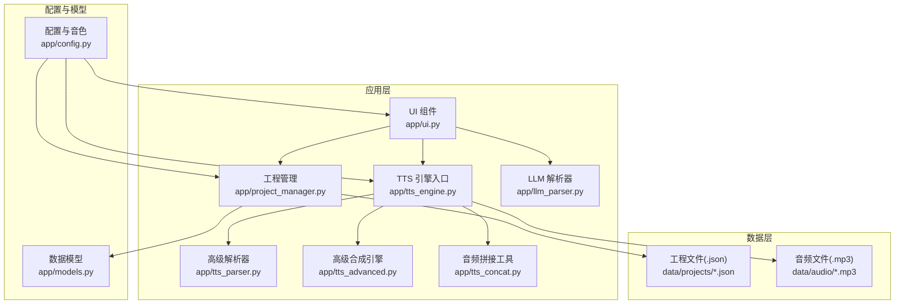
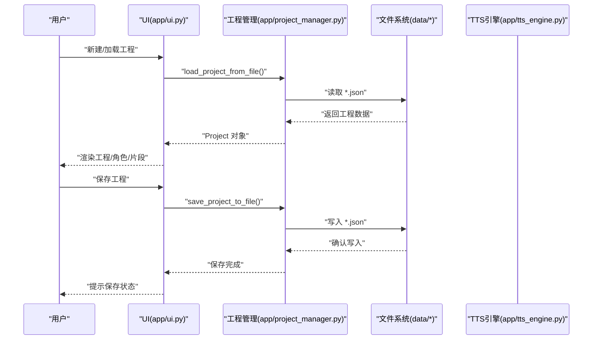
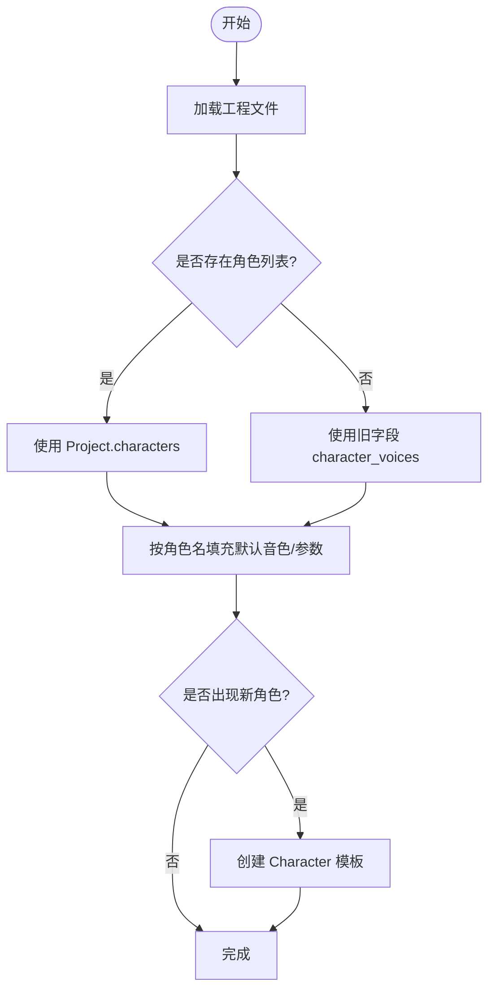
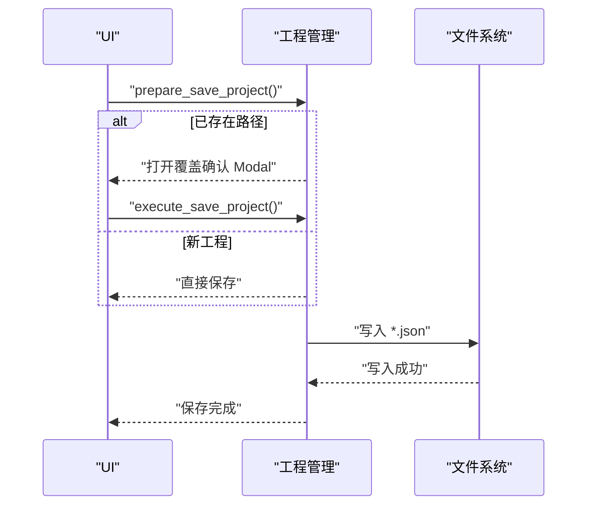
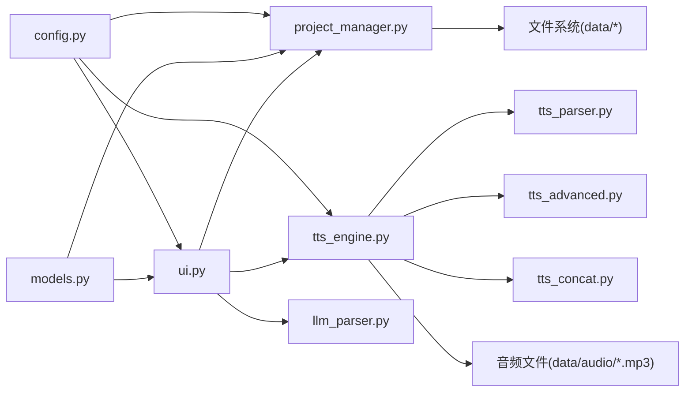

# 工程管理系统

<cite>
**本文引用的文件**
- [app/project_manager.py](file://app/project_manager.py)
- [app/models.py](file://app/models.py)
- [app/config.py](file://app/config.py)
- [app/ui.py](file://app/ui.py)
- [app/tts_engine.py](file://app/tts_engine.py)
- [app/tts_parser.py](file://app/tts_parser.py)
- [app/tts_advanced.py](file://app/tts_advanced.py)
- [app/tts_concat.py](file://app/tts_concat.py)
- [app/llm_parser.py](file://app/llm_parser.py)
- [app/main.py](file://app/main.py)
- [docs/PROJECT_BASELINE.md](file://docs/PROJECT_BASELINE.md)
- [docs/音色选择技术方案.md](file://docs/音色选择技术方案.md)
</cite>

## 目录
1. [简介](#简介)
2. [项目结构](#项目结构)
3. [核心组件](#核心组件)
4. [架构总览](#架构总览)
5. [详细组件分析](#详细组件分析)
6. [依赖关系分析](#依赖关系分析)
7. [性能考量](#性能考量)
8. [故障排查指南](#故障排查指南)
9. [结论](#结论)
10. [附录](#附录)

## 简介
本文件面向 TTS Studio 的工程管理系统，系统围绕“工程文件格式与数据结构设计、角色配置管理、工程版本控制与回滚、工程保存与加载流程、数据模型设计原则与扩展性、团队协作最佳实践”展开，帮助开发者与运营人员高效理解与使用工程管理能力。

## 项目结构
- 应用层：UI（Gradio）、业务逻辑（TTS 引擎、解析器、拼接器）、工程管理（项目序列化/反序列化）
- 数据层：工程文件（JSON）与音频文件（MP3）
- 配置层：音色选项、默认 API、目录结构等

图表来源
- [app/ui.py](file://app/ui.py)
- [app/project_manager.py](file://app/project_manager.py)
- [app/tts_engine.py](file://app/tts_engine.py)
- [app/tts_parser.py](file://app/tts_parser.py)
- [app/tts_advanced.py](file://app/tts_advanced.py)
- [app/tts_concat.py](file://app/tts_concat.py)
- [app/llm_parser.py](file://app/llm_parser.py)
- [app/config.py](file://app/config.py)
- [app/models.py](file://app/models.py)

章节来源
- [app/main.py](file://app/main.py)
- [app/config.py](file://app/config.py)

## 核心组件
- 工程模型与序列化：Project、ScriptLine、AudioClip、Character，统一以 JSON 存储，支持向后兼容字段
- 工程管理：工程文件读写、角色列表加载/保存、片段生成与状态恢复
- 角色配置管理：音色选择（中文别名与真实 ID 分离）、参数（语速/音调/音量）、模板化角色
- TTS 引擎：根据文本标记类型自动路由到简单/高级合成路径，支持重试与时长估算
- 音频拼接：FFmpeg 拼接与静音生成，支持多轨混合与总时长控制
- LLM 解析：基于外部 LLM 的剧本解析，输出结构化 ScriptLine 列表

章节来源
- [app/models.py](file://app/models.py)
- [app/project_manager.py](file://app/project_manager.py)
- [app/config.py](file://app/config.py)
- [app/tts_engine.py](file://app/tts_engine.py)
- [app/tts_concat.py](file://app/tts_concat.py)
- [app/llm_parser.py](file://app/llm_parser.py)

## 架构总览
工程管理贯穿“数据模型—序列化—UI—引擎—拼接”的全链路，确保工程文件的可读性、可迁移性与可扩展性。

图表来源
- [app/ui.py](file://app/ui.py)
- [app/project_manager.py](file://app/project_manager.py)

## 详细组件分析

### 工程文件格式与数据结构设计
- 数据模型
  - Project：工程名、原始文本、脚本行、音频片段、BGM/音效片段、LLM 配置、角色列表、角色音色映射（向后兼容）
  - ScriptLine：类型、角色、情感、文本、音色、语速、音调、SSML 文本、属性
  - AudioClip：片段标识、类型(dialogue/bgm/sfx)、角色、文本、文件路径、音色、参数、起始/时长、生成状态
  - Character：角色名、音色ID、语速、音调、音量、性格/描述/年龄/性别/情绪风格/备注
- JSON 序列化
  - 保存字段：name/raw_text/script_lines/audio_clips/bgm_clips/sfx_clips/llm_config/characters/character_voices
  - 反序列化：兼容旧工程的 characters 字段；遍历 audio_clips/bgm_clips/sfx_clips，校验文件存在性并设置 is_generated
- 版本兼容性
  - 保留 character_voices 字段，兼容旧版工程
  - 优先使用 Project.characters，若不存在则回退到旧字段
- 数据完整性
  - 生成状态 is_generated 基于文件存在性判断
  - 时长 duration 通过外部工具估算或读取，确保 UI 与引擎一致

章节来源
- [app/models.py](file://app/models.py)
- [app/project_manager.py](file://app/project_manager.py)

### 角色配置管理
- 音色选择
  - UI 下拉框使用 (显示名, 真实ID) 元组，用户看到中文别名，系统存储真实音色ID
  - 加载时通过 ensure_voice_in_choices 校验并回退默认值，保证向后兼容
- 参数调整
  - 语速/音调/音量滑块，支持对 ScriptLine/Clip 的批量应用
- 配置模板
  - 通过 Character 模板化角色参数，解析文本时按角色名自动填充默认音色与参数
  - 自动创建角色：当解析出新角色名时，自动在工程中创建对应 Character

图表来源
- [app/ui.py](file://app/ui.py)
- [app/config.py](file://app/config.py)
- [docs/音色选择技术方案.md](file://docs/音色选择技术方案.md)

章节来源
- [app/ui.py](file://app/ui.py)
- [app/config.py](file://app/config.py)
- [docs/音色选择技术方案.md](file://docs/音色选择技术方案.md)

### 工程版本控制机制
- 增量更新
  - UI 仅更新当前选中行的文本/角色/SSML，其余保持不变
  - 保存时整体写入，不涉及版本差异计算
- 回滚策略
  - 通过工程文件命名区分历史版本（工程名+时间戳），保留多份历史文件
  - 删除/覆盖保存前弹窗确认，避免误操作
- 冲突解决
  - 工程文件为纯文本 JSON，无并发写入冲突
  - 若多人协作，建议通过外部版本管理工具（如 Git）管理 data/projects 目录

章节来源
- [app/ui.py](file://app/ui.py)
- [app/project_manager.py](file://app/project_manager.py)

### 项目保存与加载流程
- 保存
  - 新工程：生成带时间戳的文件名
  - 覆盖保存：弹窗确认后写入
  - 写入前确保 PROJECTS_DIR 存在
- 加载
  - 预加载最近修改的工程，填充 UI 表格与角色下拉
  - 逐字段反序列化，兼容旧字段
  - 校验音频片段文件存在性，恢复 is_generated 状态

图表来源
- [app/ui.py](file://app/ui.py)
- [app/project_manager.py](file://app/project_manager.py)

章节来源
- [app/ui.py](file://app/ui.py)
- [app/project_manager.py](file://app/project_manager.py)

### 数据模型设计原则与扩展性
- 设计原则
  - 结构化与可读性：JSON 字段清晰，便于人工审阅与迁移
  - 向后兼容：旧字段保留，加载时自动迁移
  - 状态一致性：is_generated 与文件存在性绑定，duration 通过工具估算
- 扩展性
  - 新增字段：在 Project/ScriptLine/AudioClip 中添加字段，序列化时纳入 JSON
  - 新片段类型：扩展 AudioClip.type 并在 UI/引擎中增加分支处理
  - 新角色属性：在 Character 中扩展字段，解析/保存时同步

章节来源
- [app/models.py](file://app/models.py)
- [app/project_manager.py](file://app/project_manager.py)

### 团队协作最佳实践
- 工程命名与版本
  - 使用语义化工程名+时间戳，便于检索与回溯
- 角色模板化
  - 统一角色参数模板，减少重复配置
- LLM 配置集中管理
  - 将 API Base/Key/Model 保存在工程 llm_config 中，便于跨设备迁移
- 文件组织
  - 将 data/projects 与 data/audio 分离，避免无关文件污染
- 备份与迁移
  - 定期备份 data 目录，必要时通过 Git 管理工程文件

章节来源
- [app/ui.py](file://app/ui.py)
- [app/config.py](file://app/config.py)

## 依赖关系分析

图表来源
- [app/config.py](file://app/config.py)
- [app/ui.py](file://app/ui.py)
- [app/project_manager.py](file://app/project_manager.py)
- [app/models.py](file://app/models.py)
- [app/tts_engine.py](file://app/tts_engine.py)
- [app/tts_parser.py](file://app/tts_parser.py)
- [app/tts_advanced.py](file://app/tts_advanced.py)
- [app/tts_concat.py](file://app/tts_concat.py)
- [app/llm_parser.py](file://app/llm_parser.py)

章节来源
- [app/ui.py](file://app/ui.py)
- [app/project_manager.py](file://app/project_manager.py)
- [app/tts_engine.py](file://app/tts_engine.py)

## 性能考量
- 合成路径选择
  - 普通文本：直接 edge-tts 合成
  - 高级标记：自动拆分+FFmpeg 拼接，避免过度分片（phoneme 不参与分片）
- 重试与容错
  - TTS 合成与 FFmpeg 操作均具备指数退避重试
- 时长估算
  - 无法读取音频时长时，使用字符数估算，保证 UI 交互连续性
- 资源清理
  - 合成完成后清理临时文件，避免磁盘占用

章节来源
- [app/tts_engine.py](file://app/tts_engine.py)
- [app/tts_advanced.py](file://app/tts_advanced.py)
- [app/tts_concat.py](file://app/tts_concat.py)

## 故障排查指南
- 403/网络问题
  - 检查代理配置（HTTP_PROXY/https_proxy），确保可访问微软服务
- FFmpeg 未安装
  - 按文档安装并配置环境变量，验证可用性
- 工程加载失败
  - 检查工程文件格式与字段完整性；必要时使用旧字段回退逻辑
- 音色不可选
  - 使用 ensure_voice_in_choices 校验音色ID是否在 VOICE_IDS 中，否则回退默认值

章节来源
- [app/tts_engine.py](file://app/tts_engine.py)
- [docs/PROJECT_BASELINE.md](file://docs/PROJECT_BASELINE.md)
- [docs/音色选择技术方案.md](file://docs/音色选择技术方案.md)

## 结论
TTS Studio 的工程管理系统以清晰的数据模型与 JSON 文件为核心，结合 UI 的可视化编辑、TTS 引擎的智能路由与 FFmpeg 的高效拼接，形成了稳定、可扩展、易协作的工程管理方案。通过角色模板化、LLM 配置集中化与工程命名规范，团队可在保证质量的同时提升生产效率。

## 附录

### 代码示例（路径指引）
- 创建新项目
  - 步骤：在 UI 中点击“新建工程”，填写工程名，解析文本后自动生成 ScriptLine 与 AudioClip
  - 参考：[app/ui.py](file://app/ui.py)
- 编辑角色配置
  - 步骤：在“角色管理”面板中新增/编辑 Character，应用到当前工程
  - 参考：[app/ui.py](file://app/ui.py)，[app/config.py](file://app/config.py)
- 保存工程文件
  - 步骤：点击“保存工程”，覆盖保存时弹窗确认
  - 参考：[app/ui.py](file://app/ui.py)，[app/project_manager.py](file://app/project_manager.py)
- 加载历史项目
  - 步骤：在“工程管理”表格中选择历史工程，点击“加载选中工程”
  - 参考：[app/ui.py](file://app/ui.py)，[app/project_manager.py](file://app/project_manager.py)
- 项目解析与生成
  - 步骤：输入文本→LLM 解析→生成 ScriptLine→逐片段合成→拼接输出
  - 参考：[app/llm_parser.py](file://app/llm_parser.py)，[app/tts_engine.py](file://app/tts_engine.py)，[app/tts_concat.py](file://app/tts_concat.py)