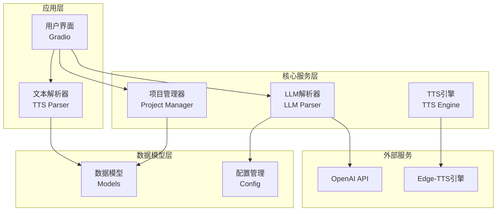
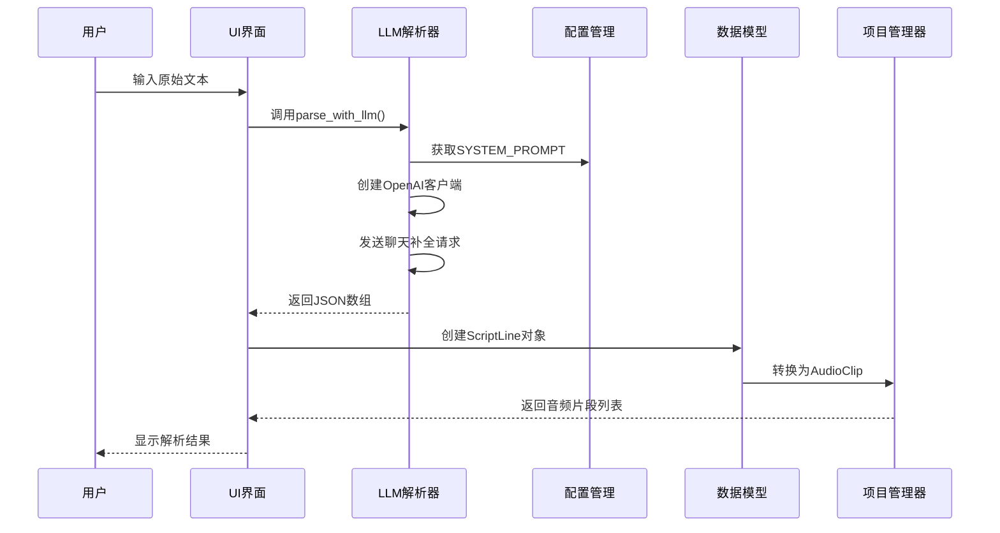
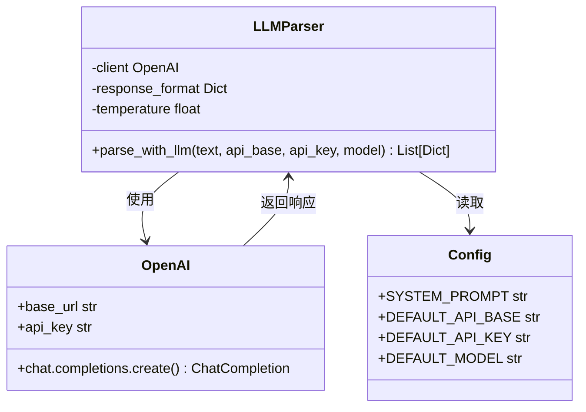
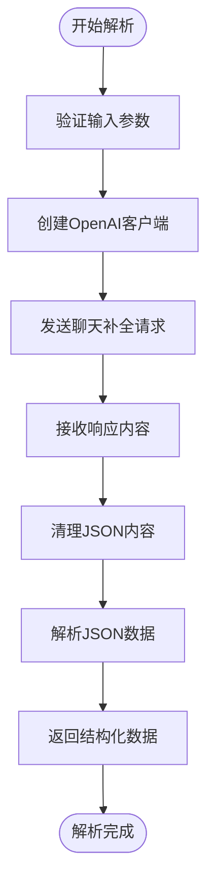
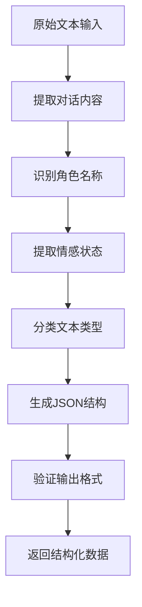
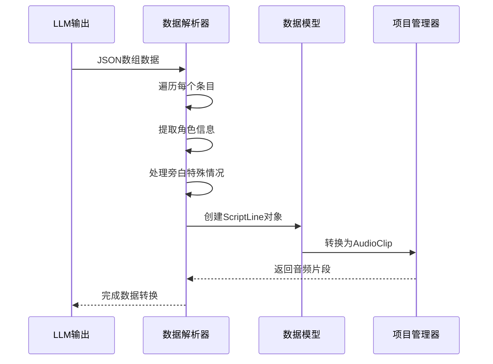
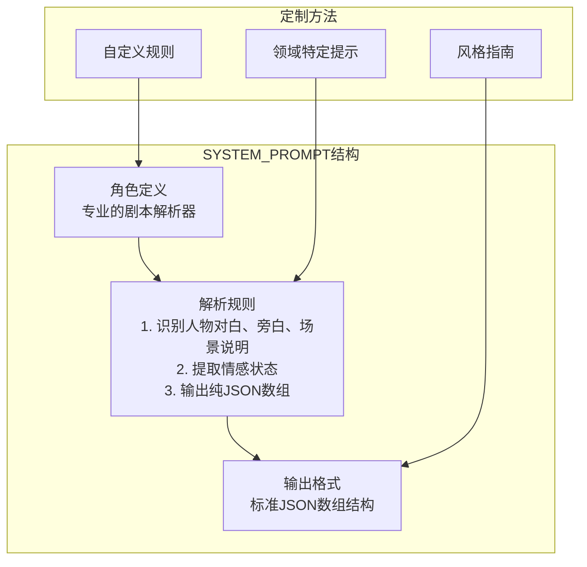
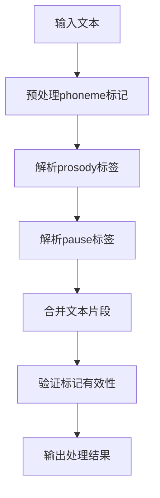
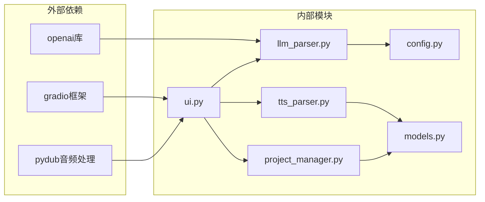

# 智能文本解析系统

<cite>
**本文档引用的文件**
- [app/llm_parser.py](file://app/llm_parser.py)
- [app/config.py](file://app/config.py)
- [app/models.py](file://app/models.py)
- [app/ui.py](file://app/ui.py)
- [app/project_manager.py](file://app/project_manager.py)
- [app/tts_parser.py](file://app/tts_parser.py)
- [tests/test_tts_parser.py](file://tests/test_tts_parser.py)
- [demo_complex.py](file://demo_complex.py)
</cite>

## 目录
1. [简介](#简介)
2. [项目结构](#项目结构)
3. [核心组件](#核心组件)
4. [架构概览](#架构概览)
5. [详细组件分析](#详细组件分析)
6. [依赖分析](#依赖分析)
7. [性能考虑](#性能考虑)
8. [故障排除指南](#故障排除指南)
9. [结论](#结论)
10. [附录](#附录)

## 简介

TTS Studio的智能文本解析系统是一个基于大型语言模型（LLM）的自动化剧本解析解决方案。该系统能够将原始文本自动转换为结构化的有声剧本格式，识别角色对白、旁白和场景说明，并提供完整的音频合成工作流。

系统的核心特色包括：
- **LLM集成**：通过OpenAI兼容的API进行智能文本解析
- **角色识别**：自动从文本中提取角色名称和对话内容
- **结构化输出**：生成标准化的JSON格式数据
- **多音字处理**：支持多音字标注和发音优化
- **情感标注**：识别并提取对话中的情感状态
- **SSML标记**：生成可直接用于TTS引擎的标记文本

## 项目结构



**图表来源**
- [app/ui.py:13-51](file://app/ui.py#L13-L51)
- [app/llm_parser.py:1-21](file://app/llm_parser.py#L1-L21)
- [app/models.py:1-78](file://app/models.py#L1-L78)

**章节来源**
- [app/ui.py:13-51](file://app/ui.py#L13-L51)
- [app/llm_parser.py:1-21](file://app/llm_parser.py#L1-L21)
- [app/models.py:1-78](file://app/models.py#L1-L78)

## 核心组件

### LLM解析器组件

LLM解析器是系统的核心，负责将原始文本转换为结构化的剧本数据。它使用OpenAI兼容的API，通过精心设计的SYSTEM_PROMPT指导模型进行准确的文本解析。

### 文本解析器组件

文本解析器专门处理TTS相关的文本标记，支持复杂的SSML语法，包括：
- prosody标签：控制语速、音调和音量
- pause标签：插入停顿
- phoneme标签：多音字标注
- emphasis标签：情感强调

### 数据模型组件

系统使用强类型的数据模型来确保数据的一致性和完整性：
- Character：角色定义
- ScriptLine：剧本行
- AudioClip：音频片段
- Project：完整工程

**章节来源**
- [app/llm_parser.py:7-21](file://app/llm_parser.py#L7-L21)
- [app/tts_parser.py:23-36](file://app/tts_parser.py#L23-L36)
- [app/models.py:4-78](file://app/models.py#L4-L78)

## 架构概览



**图表来源**
- [app/ui.py:471-566](file://app/ui.py#L471-L566)
- [app/llm_parser.py:7-21](file://app/llm_parser.py#L7-L21)
- [app/config.py:61-74](file://app/config.py#L61-L74)

## 详细组件分析

### LLM解析器实现

LLM解析器采用简洁而高效的设计模式，通过最少的代码实现强大的文本解析功能。

#### 核心实现模式



**图表来源**
- [app/llm_parser.py:7-21](file://app/llm_parser.py#L7-L21)
- [app/config.py:61-74](file://app/config.py#L61-L74)

#### API配置机制

LLM解析器支持灵活的API配置，包括：
- **API基础URL**：支持OpenAI兼容的各种部署
- **API密钥**：支持多种认证方式
- **模型选择**：可配置不同的LLM模型
- **温度参数**：控制输出的创造性

#### 请求参数详解

| 参数 | 类型 | 默认值 | 说明 |
|------|------|--------|------|
| model | str | qwen2.5:7b | LLM模型名称 |
| temperature | float | 0.3 | 输出随机性控制 |
| response_format | dict | json_object | 响应格式要求 |
| messages | list | system + user | 消息数组 |

#### 响应处理流程



**图表来源**
- [app/llm_parser.py:7-21](file://app/llm_parser.py#L7-L21)

**章节来源**
- [app/llm_parser.py:7-21](file://app/llm_parser.py#L7-L21)

### 角色识别算法

系统采用基于上下文的启发式算法来识别和提取角色信息。

#### 角色识别流程



**图表来源**
- [app/ui.py:471-566](file://app/ui.py#L471-L566)

#### 文本分类机制

系统能够识别三种主要的文本类型：

1. **场景说明** (`type: "direction"`)
   - 格式：场景描述、动作描写
   - 示例：`"场景：大殿内，夜。"`

2. **旁白** (`type: "narration"`)
   - 格式：叙述性内容
   - 示例：`"这场权力的游戏..."`

3. **对白** (`type: "dialogue"`)
   - 格式：角色对白，可包含情感标注
   - 示例：`"臣无话可说。"`

**章节来源**
- [app/ui.py:471-566](file://app/ui.py#L471-L566)

### 对白结构化处理

系统将LLM解析的结果转换为内部使用的结构化数据格式。

#### 数据转换流程



**图表来源**
- [app/ui.py:485-513](file://app/ui.py#L485-L513)
- [app/project_manager.py:9-29](file://app/project_manager.py#L9-L29)

#### JSON格式规范

系统输出的标准JSON格式包含以下字段：

| 字段 | 类型 | 必需 | 说明 |
|------|------|------|------|
| type | str | 是 | 文本类型：direction/narration/dialogue |
| character | str | 是 | 角色名称或"旁白" |
| emotion | str | 否 | 情感状态描述 |
| text | str | 是 | 文本内容 |

**章节来源**
- [app/ui.py:485-513](file://app/ui.py#L485-L513)
- [app/project_manager.py:9-29](file://app/project_manager.py#L9-L29)

### SYSTEM_PROMPT作用与定制

SYSTEM_PROMPT是LLM解析能力的关键，它定义了模型的行为准则和输出格式。

#### SYSTEM_PROMPT核心要素



**图表来源**
- [app/config.py:61-74](file://app/config.py#L61-L74)

#### 自定义最佳实践

1. **明确角色识别规则**
   - 定义角色名称的识别模式
   - 设定情感状态的提取标准
   - 规范场景描述的格式要求

2. **输出格式约束**
   - 确保只输出纯JSON数组
   - 避免Markdown代码块
   - 保持格式一致性

3. **领域适配**
   - 小说/剧本专用提示词
   - 专业术语处理
   - 文体风格适配

**章节来源**
- [app/config.py:61-74](file://app/config.py#L61-L74)

### 文本标记处理系统

系统提供了完整的SSML标记处理能力，支持复杂的语音合成需求。

#### 标记语法支持

| 标记类型 | 语法 | 功能 | 示例 |
|----------|------|------|------|
| prosody | `<prosody rate="X" pitch="Y" volume="Z">文本</prosody>` | 控制语音参数 | `<prosody rate="-20%" pitch="+10Hz">强调文本</prosody>` |
| pause | `<pause=1000>` 或 `[pause=1000]` | 插入停顿 | `<pause=500>停顿半秒` |
| phoneme | `[phoneme=同音字]原字[/phoneme]` | 多音字标注 | `[phoneme=日]天[/phoneme]` |
| emphasis | `[emphasis=level]文本[/emphasis]` | 情感强调 | `[emphasis=strong]重要内容[/emphasis]` |

#### 处理算法实现



**图表来源**
- [app/tts_parser.py:69-182](file://app/tts_parser.py#L69-L182)

**章节来源**
- [app/tts_parser.py:69-182](file://app/tts_parser.py#L69-L182)

## 依赖分析



**图表来源**
- [app/llm_parser.py](file://app/llm_parser.py#L4)
- [app/ui.py:1-12](file://app/ui.py#L1-L12)

### 模块间耦合关系

系统采用了松耦合的设计模式，各模块职责清晰：

1. **UI层**：负责用户交互和业务流程协调
2. **解析层**：独立处理文本解析任务
3. **数据层**：提供统一的数据模型和持久化
4. **配置层**：集中管理系统配置和默认值

**章节来源**
- [app/ui.py:1-12](file://app/ui.py#L1-L12)
- [app/llm_parser.py](file://app/llm_parser.py#L4)

## 性能考虑

### LLM调用优化

1. **批量处理**：合理控制每次LLM调用的文本长度
2. **缓存策略**：对重复的解析结果进行缓存
3. **并发控制**：限制同时进行的LLM请求数量
4. **超时设置**：为LLM调用设置合理的超时时间

### 内存管理

1. **数据流处理**：避免一次性加载大量数据
2. **及时释放**：及时清理不再使用的中间结果
3. **分页处理**：对大数据集进行分页处理

### 网络优化

1. **连接复用**：复用OpenAI客户端连接
2. **重试机制**：实现智能的网络请求重试
3. **降级策略**：在网络异常时提供降级方案

## 故障排除指南

### 常见问题及解决方案

#### LLM解析失败

**症状**：LLM调用返回错误或解析结果为空

**可能原因**：
1. API配置错误（base_url、api_key、model）
2. 网络连接问题
3. LLM模型不可用
4. 输入文本格式不符合预期

**解决步骤**：
1. 验证API配置参数
2. 检查网络连接状态
3. 确认LLM服务可用性
4. 查看日志获取详细错误信息

#### JSON格式错误

**症状**：解析后的JSON格式不正确

**解决方法**：
1. 检查SYSTEM_PROMPT的格式要求
2. 验证LLM输出的JSON格式
3. 实施严格的JSON验证机制

#### 性能问题

**症状**：系统响应缓慢或内存占用过高

**优化措施**：
1. 实施分批处理策略
2. 添加适当的缓存机制
3. 优化正则表达式匹配
4. 实现异步处理模式

**章节来源**
- [app/ui.py:471-566](file://app/ui.py#L471-L566)
- [app/llm_parser.py:7-21](file://app/llm_parser.py#L7-L21)

## 结论

TTS Studio的智能文本解析系统通过精心设计的架构和算法，实现了从原始文本到结构化剧本数据的自动化转换。系统的主要优势包括：

1. **高度集成**：LLM与本地解析器的完美结合
2. **灵活配置**：支持多种LLM和自定义提示词
3. **强类型数据**：确保数据一致性和完整性
4. **扩展性强**：模块化设计便于功能扩展
5. **用户体验**：直观的界面和流畅的工作流程

该系统为音频合成和有声书制作提供了强有力的技术支撑，通过智能化的文本处理大大提高了内容创作的效率和质量。

## 附录

### 使用示例

#### 基本配置示例

```python
# LLM配置
api_base = "http://localhost:11434/v1"
api_key = "ollama"
model = "qwen2.5:7b"

# 调用解析函数
parsed_data = parse_with_llm(raw_text, api_base, api_key, model)
```

#### 数据验证机制

系统内置了多层次的数据验证：
1. **格式验证**：确保输出符合JSON格式
2. **字段验证**：检查必需字段的存在性
3. **类型验证**：验证字段类型的正确性
4. **范围验证**：检查数值参数的有效范围

#### 最佳实践建议

1. **提示词优化**：根据具体应用场景定制SYSTEM_PROMPT
2. **错误处理**：实施完善的异常处理和重试机制
3. **性能监控**：建立系统性能监控和告警机制
4. **版本管理**：对提示词和配置进行版本控制
5. **安全考虑**：确保API密钥的安全存储和传输