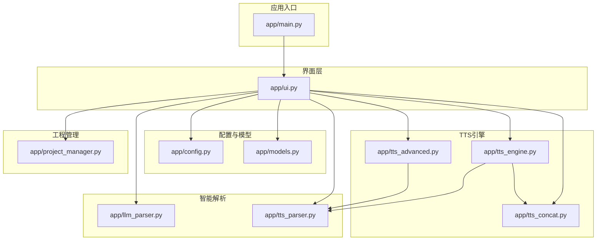
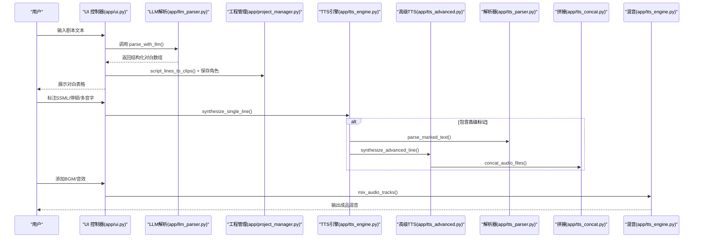
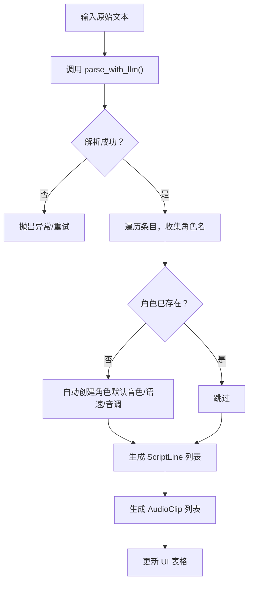
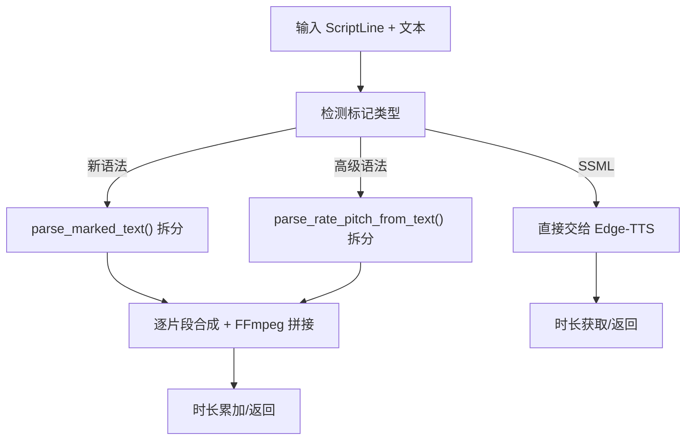
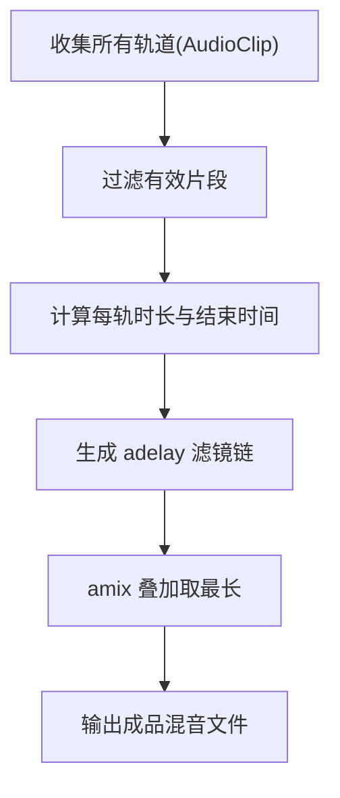
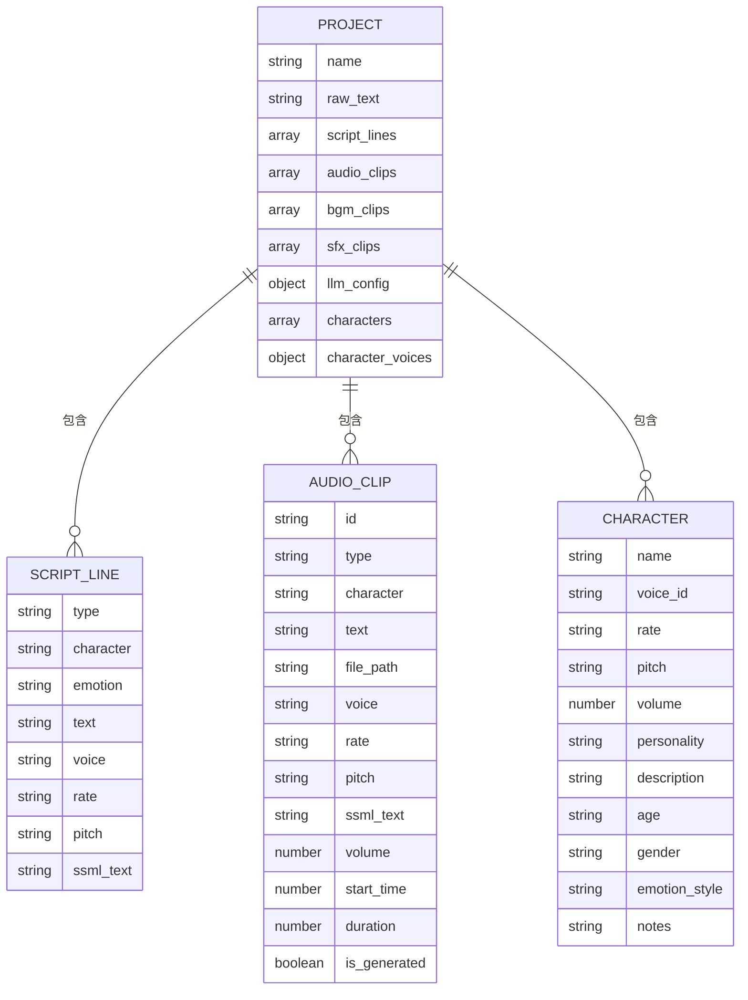
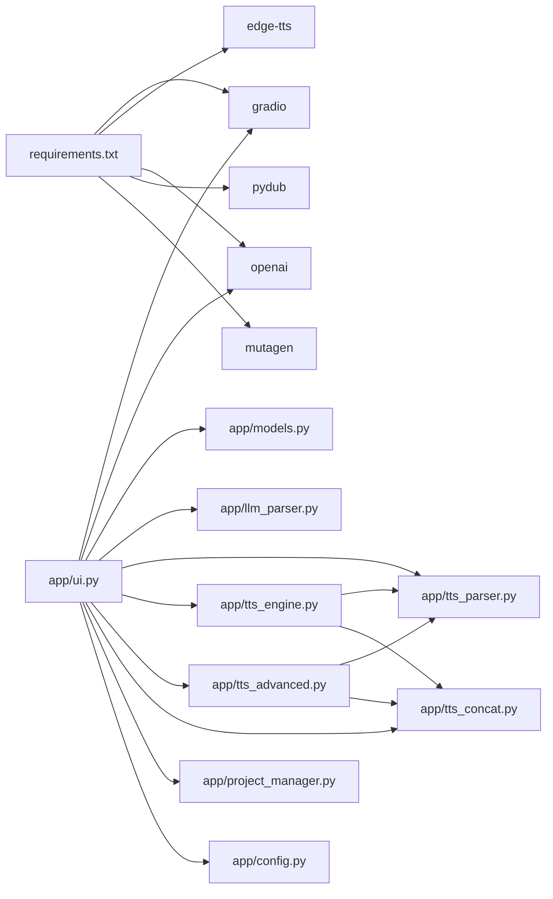

# 核心功能模块

<cite>
**本文引用的文件**
- [app/main.py](file://app/main.py)
- [app/ui.py](file://app/ui.py)
- [app/config.py](file://app/config.py)
- [app/models.py](file://app/models.py)
- [app/llm_parser.py](file://app/llm_parser.py)
- [app/project_manager.py](file://app/project_manager.py)
- [app/tts_engine.py](file://app/tts_engine.py)
- [app/tts_parser.py](file://app/tts_parser.py)
- [app/tts_advanced.py](file://app/tts_advanced.py)
- [app/tts_concat.py](file://app/tts_concat.py)
- [requirements.txt](file://requirements.txt)
- [tests/test_advanced_tts.py](file://tests/test_advanced_tts.py)
- [tests/test_ssml.py](file://tests/test_ssml.py)
</cite>

## 目录
1. [简介](#简介)
2. [项目结构](#项目结构)
3. [核心组件](#核心组件)
4. [架构总览](#架构总览)
5. [详细组件分析](#详细组件分析)
6. [依赖分析](#依赖分析)
7. [性能考虑](#性能考虑)
8. [故障排查指南](#故障排查指南)
9. [结论](#结论)
10. [附录](#附录)

## 简介
本文件面向开发者与高级用户，系统性梳理 TTS Studio 的四大核心功能模块：智能文本解析系统（LLM 集成与角色识别）、高级 TTS 合成引擎（基础功能、标记语法支持、多音字处理）、音频混音系统（多轨混音原理、时间轴同步）、工程管理系统（项目文件格式、角色配置管理）。文档解释模块间交互关系与数据流，提供可操作的使用路径与最佳实践，帮助快速上手与扩展。

## 项目结构
TTS Studio 采用“模块化 + UI 驱动”的组织方式：
- 应用入口负责构建 UI 并启动服务
- UI 作为控制器协调 LLM 解析、TTS 合成、混音与工程管理
- 核心引擎模块提供具体能力：文本解析、TTS 合成、音频拼接与混音
- 配置模块统一管理环境变量、目录与默认音色
- 工程管理模块负责项目文件的序列化与反序列化

图表来源
- [app/main.py:1-51](file://app/main.py#L1-L51)
- [app/ui.py:1-120](file://app/ui.py#L1-L120)
- [app/config.py:1-74](file://app/config.py#L1-L74)
- [app/models.py:1-78](file://app/models.py#L1-L78)
- [app/llm_parser.py:1-21](file://app/llm_parser.py#L1-L21)
- [app/tts_parser.py:1-220](file://app/tts_parser.py#L1-L220)
- [app/tts_engine.py:1-547](file://app/tts_engine.py#L1-L547)
- [app/tts_advanced.py:1-290](file://app/tts_advanced.py#L1-L290)
- [app/tts_concat.py:1-159](file://app/tts_concat.py#L1-L159)
- [app/project_manager.py:1-73](file://app/project_manager.py#L1-L73)

章节来源
- [app/main.py:1-51](file://app/main.py#L1-L51)
- [app/ui.py:1-120](file://app/ui.py#L1-L120)
- [app/config.py:1-74](file://app/config.py#L1-L74)

## 核心组件
- 智能文本解析系统：基于 LLM 的角色识别与剧本结构化，输出结构化 ScriptLine 列表，并自动创建角色配置
- 高级 TTS 合成引擎：支持普通文本、自定义 SSML、高级标记（prosody/pause/phoneme）的自动拆分与拼接
- 音频混音系统：多轨（对白/背景乐/音效）按时间轴混合，支持延迟与叠加
- 工程管理系统：项目文件 JSON 格式，包含原始文本、脚本行、音频片段、BGM/音效片段、LLM 配置与角色列表

章节来源
- [app/llm_parser.py:7-21](file://app/llm_parser.py#L7-L21)
- [app/tts_engine.py:120-453](file://app/tts_engine.py#L120-L453)
- [app/tts_advanced.py:112-290](file://app/tts_advanced.py#L112-L290)
- [app/tts_concat.py:17-91](file://app/tts_concat.py#L17-L91)
- [app/project_manager.py:31-73](file://app/project_manager.py#L31-L73)

## 架构总览
整体流程：用户在 UI 中输入文本，LLM 解析为结构化对白；随后可在“对白编辑”页签精细标注 SSML 标记；生成对白音频后，加入 BGM/音效，最终进行多轨混音输出。

图表来源
- [app/ui.py:464-606](file://app/ui.py#L464-L606)
- [app/llm_parser.py:7-21](file://app/llm_parser.py#L7-L21)
- [app/project_manager.py:9-29](file://app/project_manager.py#L9-L29)
- [app/tts_engine.py:120-453](file://app/tts_engine.py#L120-L453)
- [app/tts_advanced.py:112-290](file://app/tts_advanced.py#L112-L290)
- [app/tts_parser.py:216-220](file://app/tts_parser.py#L216-L220)
- [app/tts_concat.py:17-91](file://app/tts_concat.py#L17-L91)

## 详细组件分析

### 智能文本解析系统（LLM 集成与角色识别）
- LLM 解析：接收原始文本、API 地址、密钥与模型名，调用 OpenAI 兼容接口，返回结构化 JSON（类型、角色、情感、文本）
- 角色识别与自动创建：遍历解析结果，收集角色名，若工程中不存在则自动创建默认配置角色
- 输出：ScriptLine 列表与 AudioClip 列表，供后续合成与混音使用

图表来源
- [app/llm_parser.py:7-21](file://app/llm_parser.py#L7-L21)
- [app/ui.py:464-557](file://app/ui.py#L464-L557)
- [app/project_manager.py:9-29](file://app/project_manager.py#L9-L29)

章节来源
- [app/llm_parser.py:7-21](file://app/llm_parser.py#L7-L21)
- [app/ui.py:464-557](file://app/ui.py#L464-L557)
- [app/project_manager.py:9-29](file://app/project_manager.py#L9-L29)

### 高级 TTS 合成引擎（基础功能、标记语法、多音字）
- 基础功能：支持普通文本、自定义 SSML、Edge-TTS 原生参数（语速、音调、代理）
- 标记语法支持：
  - 新语法：<prosody rate="...">...</prosody>、<pause=...>、[pause=...]
  - 高级语法：{rate=...}...{/rate}、{pitch=...}...{/pitch}、{style=rate=...,pitch=...}...{/style}、{pause=...}
  - 多音字：[phoneme=同音字]原字[/phoneme]，预处理阶段替换
- 自动拆分与拼接：将带标记的文本拆分为多个片段，逐段合成后使用 FFmpeg 拼接，支持停顿与静音生成

图表来源
- [app/tts_engine.py:120-453](file://app/tts_engine.py#L120-L453)
- [app/tts_parser.py:69-182](file://app/tts_parser.py#L69-L182)
- [app/tts_advanced.py:22-85](file://app/tts_advanced.py#L22-L85)
- [app/tts_advanced.py:112-290](file://app/tts_advanced.py#L112-L290)

章节来源
- [app/tts_engine.py:120-453](file://app/tts_engine.py#L120-L453)
- [app/tts_parser.py:69-182](file://app/tts_parser.py#L69-L182)
- [app/tts_advanced.py:22-85](file://app/tts_advanced.py#L22-L85)
- [app/tts_advanced.py:112-290](file://app/tts_advanced.py#L112-L290)

### 音频混音系统（多轨混音原理、时间轴同步）
- 多轨混音：支持对白、BGM、音效三类轨道，按起始时间与持续时长叠加
- 时间轴同步：根据每条轨道的 start_time 计算 adelay，使用 amix 滤镜叠加，输出最终成品
- 辅助工具：静音生成、测试音生成、拼接工具（concat）

图表来源
- [app/tts_engine.py:454-534](file://app/tts_engine.py#L454-L534)

章节来源
- [app/tts_engine.py:454-534](file://app/tts_engine.py#L454-L534)

### 工程管理系统（项目文件格式、角色配置管理）
- 项目文件格式：JSON，包含工程名、原始文本、脚本行、音频片段、BGM/音效片段、LLM 配置、角色列表与向后兼容字段
- 角色配置管理：支持新建、编辑、删除角色，角色属性包含音色、语速、音调、音量、性格等
- UI 集成：角色列表与对白编辑联动，自动填充音色与参数

图表来源
- [app/models.py:4-78](file://app/models.py#L4-L78)
- [app/project_manager.py:31-73](file://app/project_manager.py#L31-L73)

章节来源
- [app/models.py:4-78](file://app/models.py#L4-L78)
- [app/project_manager.py:31-73](file://app/project_manager.py#L31-L73)

## 依赖分析
- 外部依赖：Gradio（UI）、edge-tts（TTS）、OpenAI（LLM）、PyDub/Mutagen（音频处理）、FFmpeg（拼接/混音）
- 模块耦合：UI 作为编排者，高度依赖解析与引擎模块；引擎模块内部通过解析器与拼接器协作；工程管理模块贯穿数据持久化

图表来源
- [requirements.txt:1-16](file://requirements.txt#L1-L16)
- [app/ui.py:1-120](file://app/ui.py#L1-L120)
- [app/tts_engine.py:1-547](file://app/tts_engine.py#L1-L547)
- [app/tts_advanced.py:1-290](file://app/tts_advanced.py#L1-L290)
- [app/tts_concat.py:1-159](file://app/tts_concat.py#L1-L159)
- [app/llm_parser.py:1-21](file://app/llm_parser.py#L1-L21)
- [app/models.py:1-78](file://app/models.py#L1-L78)
- [app/config.py:1-74](file://app/config.py#L1-L74)
- [app/project_manager.py:1-73](file://app/project_manager.py#L1-L73)

章节来源
- [requirements.txt:1-16](file://requirements.txt#L1-L16)

## 性能考虑
- 合成重试：TTS 合成与高级合成均内置指数回退重试，提升稳定性
- 时长估算：缺失时长库时使用字符数估算，避免阻塞；最终以实际文件为准
- 拼接策略：优先使用 FFmpeg concat demuxer，避免解码/重编码；高级合成使用命令行拼接减少依赖
- 混音策略：使用 adelay + amix，按最长轨道时长输出，减少裁剪误差
- UI 性能：工程列表与角色表格懒加载，避免 demo.load 导致的启动卡顿

章节来源
- [app/tts_engine.py:255-318](file://app/tts_engine.py#L255-L318)
- [app/tts_advanced.py:194-221](file://app/tts_advanced.py#L194-L221)
- [app/tts_engine.py:510-534](file://app/tts_engine.py#L510-L534)

## 故障排查指南
- 403 网络错误：常见于网络访问限制，建议配置 HTTP_PROXY/https_proxy 或更换网络
- FFmpeg 依赖：确保系统 PATH 中存在 ffmpeg，或在项目目录提供可执行文件
- 时长获取失败：缺少 mutagen 时使用估算，建议安装以获得精确时长
- 角色/音色不匹配：UI 会在下拉中校验音色 ID，必要时回退默认值
- 工程加载失败：检查 JSON 结构完整性与文件权限

章节来源
- [app/tts_engine.py:303-311](file://app/tts_engine.py#L303-L311)
- [app/ui.py:1520-1530](file://app/ui.py#L1520-L1530)

## 结论
TTS Studio 通过清晰的模块划分与 UI 驱动的工作流，实现了从文本解析、精细标注到高质量合成与多轨混音的完整链路。其可扩展点包括：LLM 模型替换、更多音色接入、SSML 语法增强、混音滤镜扩展与工程模板化。建议在生产环境中固定 FFmpeg 路径、启用时长库、合理配置代理与重试策略。

## 附录

### 使用示例与最佳实践
- 基础合成（普通文本）
  - 调用路径：[app/ui.py:574-606](file://app/ui.py#L574-L606) → [app/tts_engine.py:120-217](file://app/tts_engine.py#L120-L217)
  - 关键参数：voice、rate、pitch、代理（HTTP_PROXY/https_proxy）
  - 返回值：音频时长（秒）
- 自定义 SSML 合成
  - 调用路径：[app/ui.py:574-606](file://app/ui.py#L574-L606) → [app/tts_engine.py:220-290](file://app/tts_engine.py#L220-L290)
  - 关键参数：ssml_text（直接传给 Edge-TTS）
  - 返回值：音频时长（秒）
- 高级标记合成（prosody/pause/phoneme）
  - 调用路径：[app/ui.py:574-606](file://app/ui.py#L574-L606) → [app/tts_engine.py:321-453](file://app/tts_engine.py#L321-L453) → [app/tts_advanced.py:112-290](file://app/tts_advanced.py#L112-L290)
  - 关键参数：文本中包含 <prosody>/<pause>/[phoneme] 等标记
  - 返回值：拼接后音频时长（秒）
- 多轨混音
  - 调用路径：[app/ui.py:693-699](file://app/ui.py#L693-L699) → [app/tts_engine.py:454-534](file://app/tts_engine.py#L454-L534)
  - 关键参数：各轨道 start_time、duration、volume
  - 返回值：成品混音文件路径
- 工程管理
  - 保存/加载：[app/ui.py:743-787](file://app/ui.py#L743-L787)、[app/project_manager.py:31-73](file://app/project_manager.py#L31-L73)
  - 角色管理：[app/ui.py:1127-1500](file://app/ui.py#L1127-L1500)、[app/project_manager.py:31-73](file://app/project_manager.py#L31-L73)

### 测试参考
- 高级 TTS 测试：[tests/test_advanced_tts.py:12-110](file://tests/test_advanced_tts.py#L12-L110)
- SSML 测试：[tests/test_ssml.py:12-123](file://tests/test_ssml.py#L12-L123)