# 音频混音系统

<cite>
**本文档引用的文件**
- [tts_engine.py](file://app/tts_engine.py)
- [tts_concat.py](file://app/tts_concat.py)
- [tts_parser.py](file://app/tts_parser.py)
- [tts_advanced.py](file://app/tts_advanced.py)
- [models.py](file://app/models.py)
- [project_manager.py](file://app/project_manager.py)
- [config.py](file://app/config.py)
- [ui.py](file://app/ui.py)
- [demo_complex.py](file://demo_complex.py)
- [requirements.txt](file://requirements.txt)
</cite>

## 目录
1. [简介](#简介)
2. [项目结构](#项目结构)
3. [核心组件](#核心组件)
4. [架构概览](#架构概览)
5. [详细组件分析](#详细组件分析)
6. [依赖关系分析](#依赖关系分析)
7. [性能考虑](#性能考虑)
8. [故障排除指南](#故障排除指南)
9. [结论](#结论)

## 简介

TTS Studio 的音频混音系统是一个基于 FFmpeg 的多轨音频处理解决方案，专门设计用于将多个音频片段、背景音乐和音效进行精确的时间轴对齐和混合。该系统支持复杂的音频拼接算法，包括无缝连接技术、过渡效果处理和时长计算方法，能够处理大规模音频项目并提供高质量的音频输出。

系统的核心特性包括：
- 多轨音频混合：支持对话、背景音乐、音效的精确时间对齐
- 音频拼接算法：使用 FFmpeg concat demuxer 实现无缝拼接
- 时间轴管理：基于起始时间和持续时间的精确对齐
- 音量平衡：支持每个轨道的独立音量控制
- 声相协调：通过 FFmpeg 滤镜链实现多轨混合

## 项目结构

TTS Studio 的音频处理模块采用模块化设计，主要包含以下核心文件：

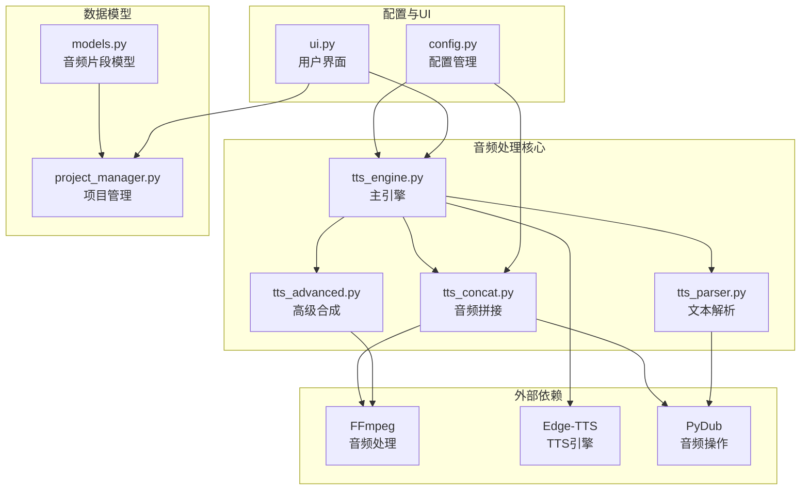

**图表来源**
- [tts_engine.py:1-547](file://app/tts_engine.py#L1-L547)
- [tts_concat.py:1-159](file://app/tts_concat.py#L1-L159)
- [models.py:1-78](file://app/models.py#L1-L78)

**章节来源**
- [tts_engine.py:1-547](file://app/tts_engine.py#L1-L547)
- [tts_concat.py:1-159](file://app/tts_concat.py#L1-L159)
- [models.py:1-78](file://app/models.py#L1-L78)

## 核心组件

### 音频片段模型系统

系统使用数据类来表示各种音频元素，确保类型安全和清晰的数据结构：

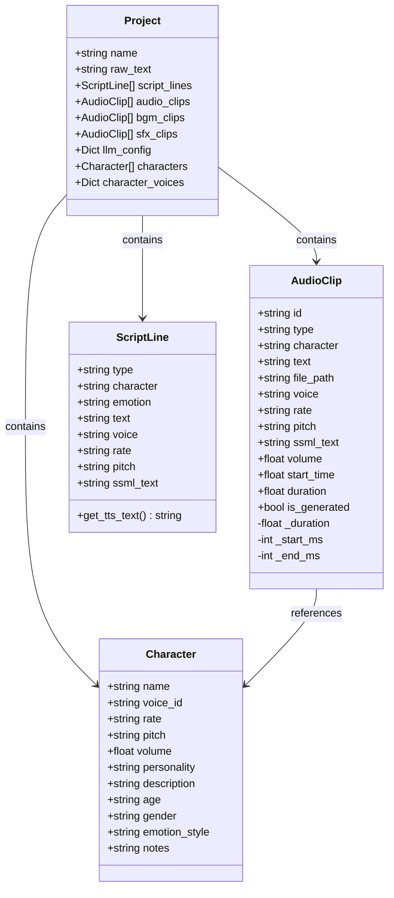

**图表来源**
- [models.py:4-78](file://app/models.py#L4-L78)

### 音频拼接引擎

音频拼接系统提供了多种拼接模式，支持无缝连接和带间隙的拼接：

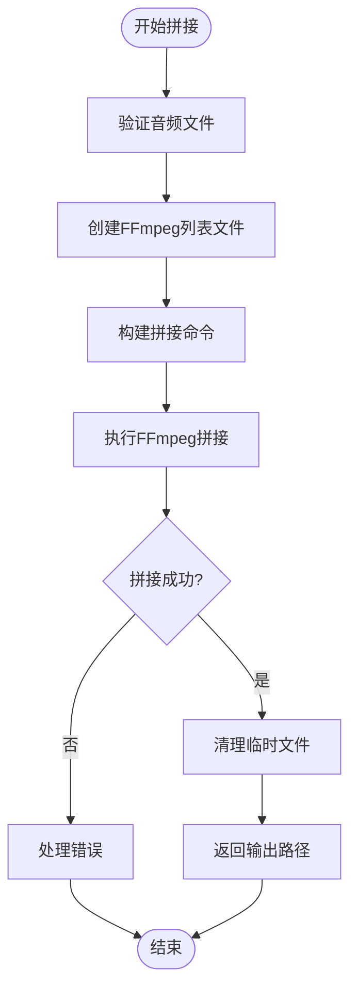

**图表来源**
- [tts_concat.py:17-90](file://app/tts_concat.py#L17-L90)

**章节来源**
- [tts_concat.py:1-159](file://app/tts_concat.py#L1-L159)
- [models.py:19-35](file://app/models.py#L19-L35)

## 架构概览

TTS Studio 的音频混音系统采用分层架构设计，实现了清晰的关注点分离：

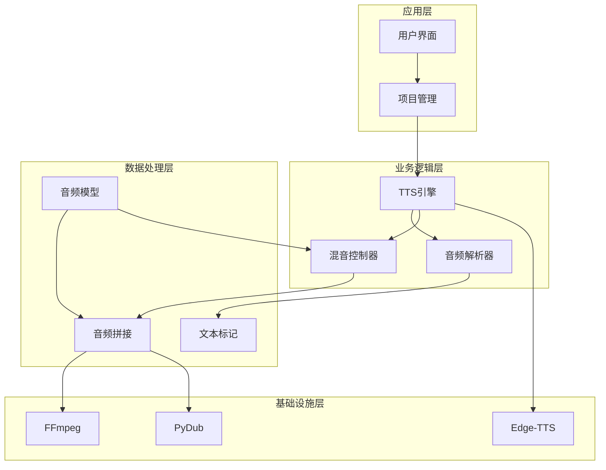

**图表来源**
- [tts_engine.py:454-546](file://app/tts_engine.py#L454-L546)
- [tts_concat.py:17-90](file://app/tts_concat.py#L17-L90)
- [tts_parser.py:69-182](file://app/tts_parser.py#L69-L182)

系统的核心流程包括：

1. **音频生成阶段**：通过 TTS 引擎合成音频片段
2. **文本解析阶段**：解析标记语法并拆分文本片段
3. **音频拼接阶段**：使用 FFmpeg 进行无缝拼接
4. **多轨混合阶段**：将多个轨道按时间轴混合
5. **输出生成阶段**：生成最终的混音音频文件

## 详细组件分析

### 音频混音控制器

混音控制器是系统的核心组件，负责将多个音频轨道按照精确的时间轴进行混合：

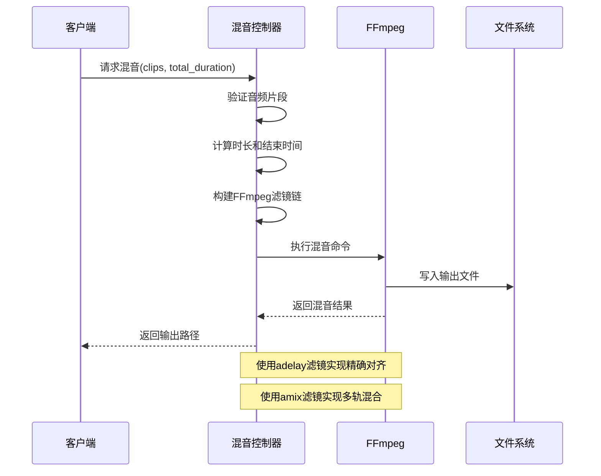

**图表来源**
- [tts_engine.py:454-534](file://app/tts_engine.py#L454-L534)

混音控制器的关键实现特点：

1. **时间轴对齐**：使用 `adelay` 滤镜为每个轨道添加精确的延迟
2. **多轨混合**：使用 `amix` 滤镜将多个轨道混合
3. **时长计算**：基于最长轨道确定最终输出时长
4. **资源管理**：自动清理临时文件和资源

**章节来源**
- [tts_engine.py:454-546](file://app/tts_engine.py#L454-L546)

### 高级文本解析器

高级文本解析器支持复杂的标记语法，能够将单一文本拆分为多个具有不同语速、音调和音量的音频片段：

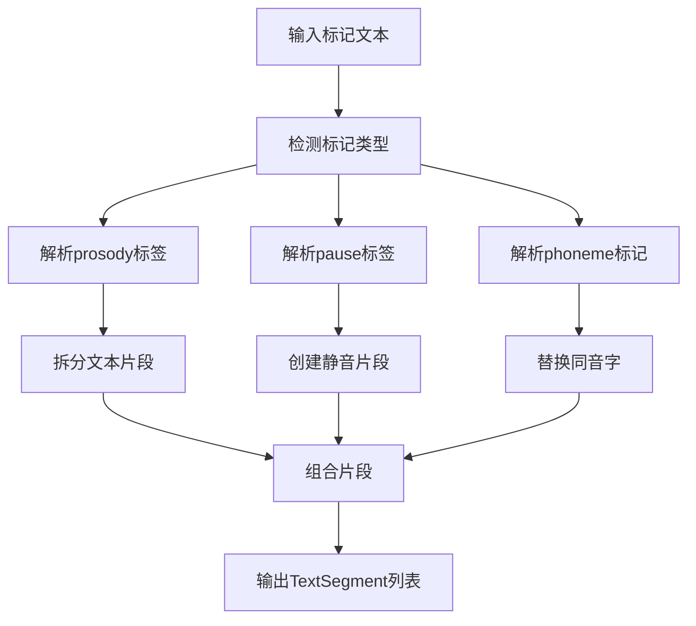

**图表来源**
- [tts_parser.py:69-182](file://app/tts_parser.py#L69-L182)

解析器支持的标记类型：

1. **语速控制** (`<prosody rate="-20%">`)
2. **音调控制** (`<prosody pitch="+10Hz">`)
3. **音量控制** (`<prosody volume="1.2">`)
4. **停顿控制** (`<pause=1000>` 或 `[pause=500]`)
5. **同音字替换** (`[phoneme=日]天[/phoneme]`)

**章节来源**
- [tts_parser.py:1-220](file://app/tts_parser.py#L1-L220)

### 音频拼接算法

音频拼接系统提供了两种主要的拼接模式：

#### FFmpeg 命令行拼接

这是系统推荐的拼接方式，使用 FFmpeg 的 concat demuxer 实现零重编码的高速拼接：

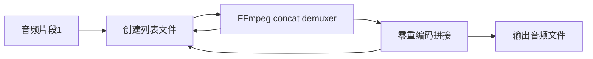

**图表来源**
- [tts_concat.py:47-90](file://app/tts_concat.py#L47-L90)

#### PyDub 拼接（带间隙）

当需要在片段间插入静音间隙时，使用 PyDub 进行拼接：

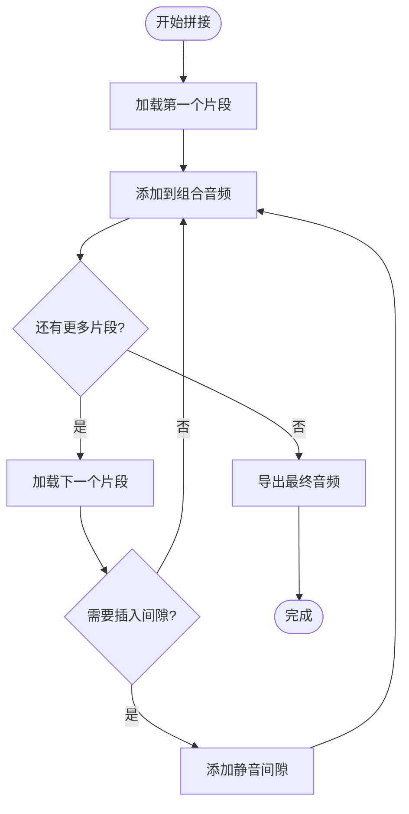

**图表来源**
- [tts_concat.py:128-158](file://app/tts_concat.py#L128-L158)

**章节来源**
- [tts_concat.py:1-159](file://app/tts_concat.py#L1-L159)

### 背景音乐和音效集成

系统支持背景音乐和音效的集成，提供灵活的同步机制：

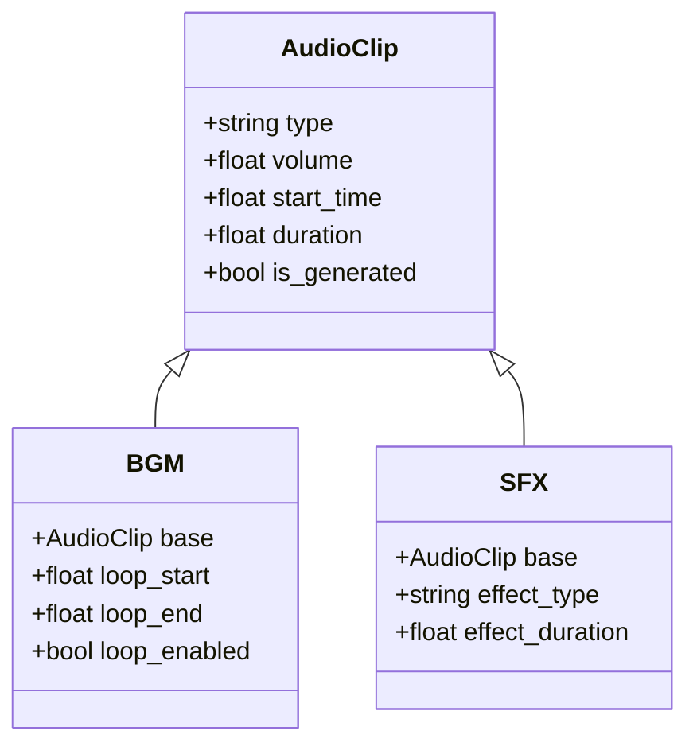

**图表来源**
- [models.py:19-35](file://app/models.py#L19-L35)

背景音乐和音效的集成特点：

1. **独立轨道**：每个轨道独立管理
2. **时间对齐**：通过 start_time 精确对齐
3. **音量控制**：支持独立的音量调节
4. **循环播放**：背景音乐支持循环播放
5. **效果处理**：音效支持各种音频效果

**章节来源**
- [models.py:19-35](file://app/models.py#L19-L35)
- [ui.py:708-744](file://app/ui.py#L708-L744)

## 依赖关系分析

系统的主要依赖关系如下：

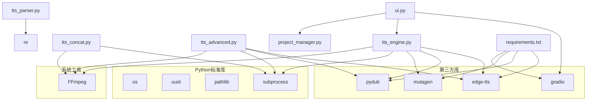

**图表来源**
- [requirements.txt:1-16](file://requirements.txt#L1-L16)
- [tts_engine.py:1-16](file://app/tts_engine.py#L1-L16)

**章节来源**
- [requirements.txt:1-16](file://requirements.txt#L1-L16)
- [tts_engine.py:1-547](file://app/tts_engine.py#L1-L547)

## 性能考虑

### 内存管理策略

系统采用了多种内存管理策略来优化性能：

1. **流式处理**：使用 FFmpeg 命令行进行音频处理，避免大文件加载到内存
2. **渐进式拼接**：音频片段按顺序处理，减少内存峰值
3. **及时清理**：临时文件在使用后立即清理
4. **资源池管理**：避免重复创建昂贵的对象

### 并发处理机制

系统支持异步处理以提高并发性能：

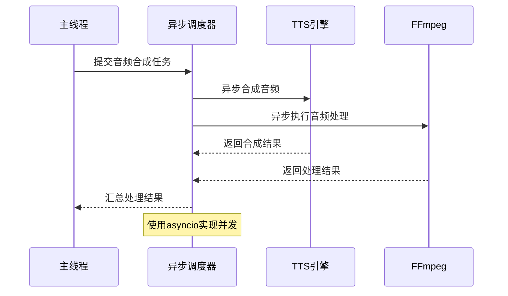

### 大规模项目优化技巧

针对大规模音频项目的优化策略：

1. **分批处理**：将大型项目分解为多个批次处理
2. **增量合成**：只合成发生变化的片段
3. **缓存机制**：缓存已生成的音频片段
4. **并行合成**：利用多核CPU进行并行音频合成
5. **磁盘I/O优化**：使用SSD和合适的缓冲区大小

## 故障排除指南

### 常见问题及解决方案

#### FFmpeg 错误处理

当 FFmpeg 操作失败时，系统会捕获错误并提供详细的诊断信息：

```python
# 错误处理示例
try:
    result = subprocess.run(cmd, capture_output=True, text=True)
    if result.returncode != 0:
        logger.error(f"FFmpeg 错误: {result.stderr}")
        raise Exception(f"FFmpeg 拼接失败: {result.stderr}")
except Exception as e:
    logger.error(f"处理失败: {e}")
    # 清理临时文件
    cleanup_temp_files()
```

#### 音频时长计算问题

系统提供了多种时长计算方法：

1. **精确计算**：使用 mutagen 库读取 MP3 文件的实际时长
2. **估算计算**：基于文本长度估算时长
3. **混合计算**：结合多种方法获得最佳结果

#### 内存不足问题

当处理大型音频文件时可能遇到内存不足：

```python
# 内存优化策略
def process_large_audio_files(file_paths):
    temp_files = []
    try:
        for file_path in file_paths:
            # 分块处理大文件
            chunk_size = 1024 * 1024  # 1MB chunks
            with open(file_path, 'rb') as f:
                while True:
                    chunk = f.read(chunk_size)
                    if not chunk:
                        break
                    # 处理chunk
                    process_chunk(chunk)
    finally:
        # 清理临时文件
        cleanup_temp_files()
```

**章节来源**
- [tts_engine.py:76-118](file://app/tts_engine.py#L76-L118)
- [tts_concat.py:76-88](file://app/tts_concat.py#L76-L88)

## 结论

TTS Studio 的音频混音系统是一个功能强大且高效的多轨音频处理解决方案。通过精心设计的架构和优化的算法，系统能够处理复杂的音频合成、拼接和混合需求。

系统的主要优势包括：

1. **高性能**：基于 FFmpeg 的零重编码处理，速度极快
2. **高精度**：精确的时间轴对齐和音量控制
3. **高扩展性**：支持大规模音频项目的处理
4. **易用性**：提供直观的 API 和丰富的配置选项
5. **稳定性**：完善的错误处理和资源管理机制

对于开发者而言，系统提供了清晰的扩展点和良好的代码组织结构，便于进一步的功能增强和定制开发。对于最终用户而言，系统提供了直观的界面和强大的音频处理能力，能够满足各种音频制作需求。