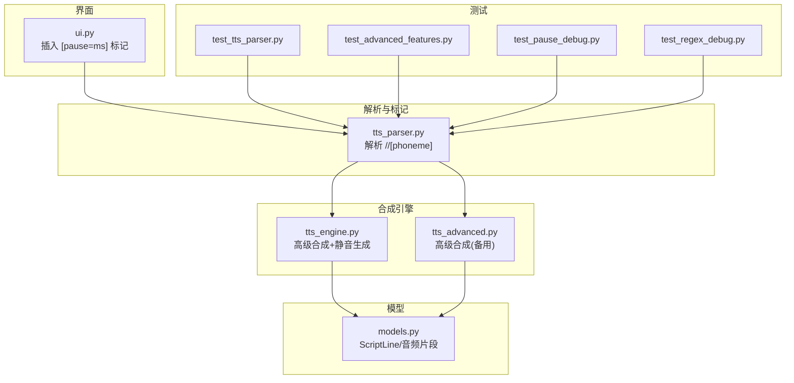
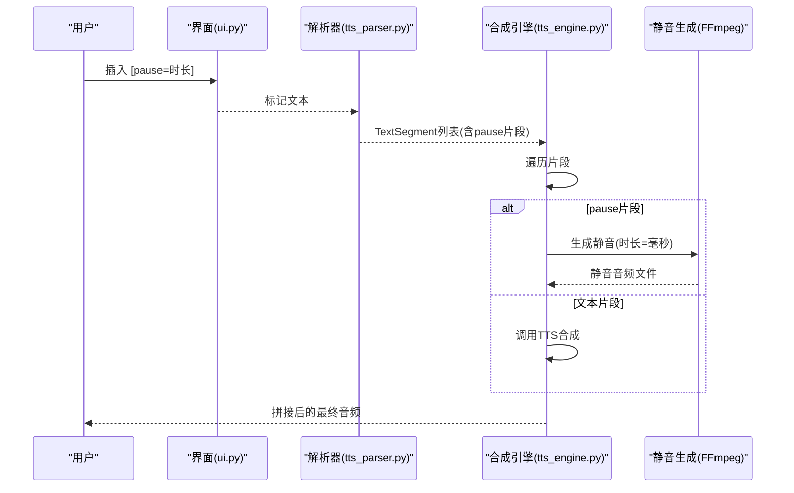
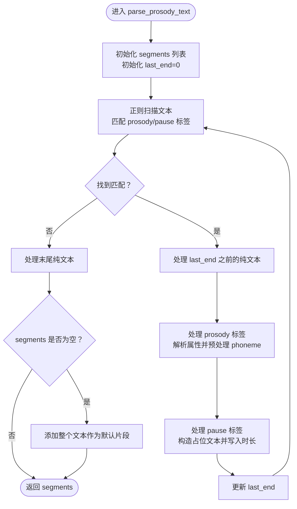
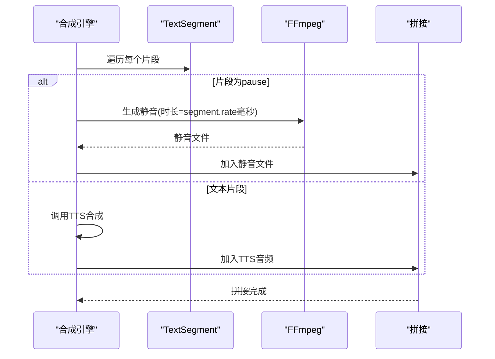
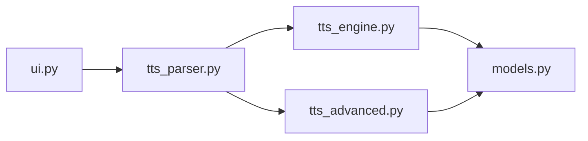

# Pause停顿标记

<cite>
**本文引用的文件**
- [tts_parser.py](file://app/tts_parser.py)
- [tts_engine.py](file://app/tts_engine.py)
- [tts_advanced.py](file://app/tts_advanced.py)
- [ui.py](file://app/ui.py)
- [test_tts_parser.py](file://tests/test_tts_parser.py)
- [test_advanced_features.py](file://tests/test_advanced_features.py)
- [test_pause_debug.py](file://tests/test_pause_debug.py)
- [test_regex_debug.py](file://tests/test_regex_debug.py)
- [models.py](file://app/models.py)
</cite>

## 目录
1. [简介](#简介)
2. [项目结构](#项目结构)
3. [核心组件](#核心组件)
4. [架构概览](#架构概览)
5. [详细组件分析](#详细组件分析)
6. [依赖分析](#依赖分析)
7. [性能考量](#性能考量)
8. [故障排查指南](#故障排查指南)
9. [结论](#结论)
10. [附录](#附录)

## 简介
本文件聚焦于TTS Studio中的pause停顿标记，系统性阐述两种语法形式（<pause=数字>与[pause=数字]）的差异、停顿时间单位与取值范围、解析逻辑、在音频合成中的实现机制（静音片段生成与时间轴同步）、实际使用示例以及与其他标记的组合规则。目标读者既包括开发者，也包括需要在TTS Studio中进行高质量音频制作的非技术用户。

## 项目结构
与pause停顿标记直接相关的模块与文件如下：
- 解析与标记处理：app/tts_parser.py
- 高级合成流程与静音生成：app/tts_engine.py、app/tts_advanced.py
- UI交互与标记插入：app/ui.py
- 单元测试与调试：tests/test_tts_parser.py、tests/test_advanced_features.py、tests/test_pause_debug.py、tests/test_regex_debug.py
- 数据模型：app/models.py

图表来源
- [tts_parser.py:1-220](file://app/tts_parser.py#L1-L220)
- [tts_engine.py:1-547](file://app/tts_engine.py#L1-L547)
- [tts_advanced.py:1-290](file://app/tts_advanced.py#L1-L290)
- [ui.py:1720-1858](file://app/ui.py#L1720-L1858)
- [test_tts_parser.py:89-265](file://tests/test_tts_parser.py#L89-L265)
- [test_advanced_features.py:1-101](file://tests/test_advanced_features.py#L1-L101)
- [test_pause_debug.py:1-26](file://tests/test_pause_debug.py#L1-L26)
- [test_regex_debug.py:1-16](file://tests/test_regex_debug.py#L1-L16)
- [models.py:1-78](file://app/models.py#L1-L78)

章节来源
- [tts_parser.py:1-220](file://app/tts_parser.py#L1-L220)
- [tts_engine.py:1-547](file://app/tts_engine.py#L1-L547)
- [tts_advanced.py:1-290](file://app/tts_advanced.py#L1-L290)
- [ui.py:1720-1858](file://app/ui.py#L1720-L1858)
- [models.py:1-78](file://app/models.py#L1-L78)

## 核心组件
- 解析器：负责识别并拆分文本中的标记，生成TextSegment序列，其中包含pause片段。
- 合成引擎：在高级模式下，对每个片段分别合成，pause片段通过静音生成器创建静音音频。
- UI：提供可视化界面插入pause标记，便于非技术用户操作。
- 测试：覆盖pause标记的解析、组合使用与正则调试。

章节来源
- [tts_parser.py:69-182](file://app/tts_parser.py#L69-L182)
- [tts_engine.py:321-453](file://app/tts_engine.py#L321-L453)
- [tts_advanced.py:112-290](file://app/tts_advanced.py#L112-L290)
- [ui.py:1726-1736](file://app/ui.py#L1726-L1736)
- [test_tts_parser.py:89-265](file://tests/test_tts_parser.py#L89-L265)

## 架构概览
pause停顿标记在系统中的工作流如下：
- 用户在UI中插入[pause=数字]或在文本中直接书写<pause=数字>。
- 解析器识别并拆分为TextSegment，pause片段携带时长信息。
- 高级合成流程中，pause片段通过FFmpeg生成对应时长的静音音频。
- 各片段按顺序拼接，形成最终音频，时间轴严格同步。

图表来源
- [ui.py:1726-1736](file://app/ui.py#L1726-L1736)
- [tts_parser.py:69-182](file://app/tts_parser.py#L69-L182)
- [tts_engine.py:321-453](file://app/tts_engine.py#L321-L453)

## 详细组件分析

### 语法形式与区别
- <pause=数字>：angle-bracket语法，通常用于SSML风格的文本中，由解析器识别为独立停顿片段。
- [pause=数字]：bracket语法，与[rate=]、[pitch=]、[emphasis=]等标记保持一致的书写风格，便于在UI中批量插入与编辑。

两者在解析器层面被视为同一类停顿标记，都会生成segment_type为pause的TextSegment，且时长信息存储在segment.rate字段中。

章节来源
- [tts_parser.py:89-132](file://app/tts_parser.py#L89-L132)
- [ui.py:1726-1736](file://app/ui.py#L1726-L1736)

### 停顿时间单位与取值范围
- 单位：毫秒（ms）。解析器将匹配到的数字直接作为毫秒值使用，并在pause片段中以字符串形式存入segment.rate。
- 取值范围：解析器未对数值进行显式校验，因此理论上可接受任意非负整数。但在实际使用中，建议遵循合理范围以保证音频可听性与播放设备兼容性。

章节来源
- [tts_parser.py:113-132](file://app/tts_parser.py#L113-L132)
- [tts_engine.py:374-389](file://app/tts_engine.py#L374-L389)

### 解析逻辑（parse_prosody_text）
解析器采用正则表达式一次性扫描文本，匹配三种模式：
- prosody标签：<prosody ...>...</prosody>
- angle-bracket停顿：<pause=数字>
- bracket停顿：[pause=数字]

匹配后按出现顺序拆分文本，生成TextSegment列表。对于纯文本片段，会先进行phoneme预处理再加入列表；对于pause片段，会构造特定的占位文本并把时长写入segment.rate，同时segment.segment_type设为pause。

图表来源
- [tts_parser.py:69-182](file://app/tts_parser.py#L69-L182)

章节来源
- [tts_parser.py:69-182](file://app/tts_parser.py#L69-L182)

### 音频合成中的实现机制
- 高级合成流程：当检测到高级标记（包含pause或prosody）时，系统会进入高级合成模式，逐片段合成并拼接。
- pause片段处理：pause片段不调用TTS，而是通过FFmpeg命令生成指定时长的静音音频（采样率24kHz，单声道，MP3编码）。生成的静音文件时长与pause时长严格一致。
- 时间轴同步：各片段按顺序拼接，pause片段的时长直接计入总时长，确保最终音频的时间轴连续且准确。

图表来源
- [tts_engine.py:321-453](file://app/tts_engine.py#L321-L453)

章节来源
- [tts_engine.py:321-453](file://app/tts_engine.py#L321-L453)

### 实际使用示例与效果
- 示例1：基础停顿
  - 输入：前半部分[pause=500]后半部分
  - 效果：中间插入500ms静音，形成明显的停顿。
- 示例2：混合prosody与pause
  - 输入：<prosody rate="-20%" pitch="+10Hz">今晚</prosody><pause=500><prosody rate="-20%" pitch="+10Hz">她终于转过头。</prosody>
  - 效果：两段慢速+轻微升调的文本之间插入500ms停顿，增强节奏感。
- 示例3：复杂场景
  - 输入：每[phoneme=日]天[/phoneme]<pause=300>坐这趟末班车，<prosody rate="-20%" pitch="+10Hz">今[phoneme=日]天[/phoneme>，</prosody><pause=1000><prosody rate="-20%" pitch="+10Hz">她终于转过头。</prosody>
  - 效果：多处停顿与语速/音调变化结合，形成丰富的节奏层次。

章节来源
- [test_tts_parser.py:94-134](file://tests/test_tts_parser.py#L94-L134)
- [test_tts_parser.py:211-247](file://tests/test_tts_parser.py#L211-L247)
- [test_advanced_features.py:22-84](file://tests/test_advanced_features.py#L22-L84)

### 与其他标记的组合规则
- 与[phoneme=]组合：phoneme在prosody内部会被预处理替换，不影响pause的解析与生成。
- 与[rate=]、[pitch=]、[volume=]组合：pause可与这些标记在同一文本中自由穿插，解析器按出现顺序拆分。
- 与<prosody>组合：angle-bracket与bracket两种pause均可与<prosody>混用，解析器统一处理为pause片段。

章节来源
- [tts_parser.py:133-151](file://app/tts_parser.py#L133-L151)
- [test_tts_parser.py:211-247](file://tests/test_tts_parser.py#L211-L247)

## 依赖分析
- 解析器依赖正则表达式一次性扫描文本，减少多次遍历开销。
- 合成引擎依赖FFmpeg生成静音，避免加载额外库，提高稳定性。
- UI通过滑条提供常用停顿时长（如100~2000ms步进50ms），便于快速插入。

图表来源
- [tts_parser.py:69-182](file://app/tts_parser.py#L69-L182)
- [tts_engine.py:321-453](file://app/tts_engine.py#L321-L453)
- [tts_advanced.py:112-290](file://app/tts_advanced.py#L112-L290)
- [ui.py:1726-1736](file://app/ui.py#L1726-L1736)
- [models.py:36-62](file://app/models.py#L36-L62)

章节来源
- [tts_parser.py:69-182](file://app/tts_parser.py#L69-L182)
- [tts_engine.py:321-453](file://app/tts_engine.py#L321-L453)
- [tts_advanced.py:112-290](file://app/tts_advanced.py#L112-L290)
- [ui.py:1726-1736](file://app/ui.py#L1726-L1736)
- [models.py:36-62](file://app/models.py#L36-L62)

## 性能考量
- 片段数量与合成时间：每个片段均需一次TTS调用或静音生成，片段越多，总合成时间越长。
- 建议：单句片段数不宜过多，避免过长等待时间。
- 静音生成：使用FFmpeg生成静音，开销较低，适合频繁停顿场景。

## 故障排查指南
- 停顿无效或时长异常
  - 检查pause语法是否正确（<pause=数字>或[pause=数字]）。
  - 确认数字为非负整数，避免解析异常。
- 音频拼接后时长不准确
  - 确认pause时长以毫秒为单位，引擎会将其转换为秒累加至总时长。
- FFmpeg不可用
  - 确保FFmpeg已安装并加入PATH，否则静音生成会失败。
- UI插入后未生效
  - 确认插入位置与目标文本一致，且最终提交的文本包含pause标记。

章节来源
- [tts_engine.py:372-390](file://app/tts_engine.py#L372-L390)
- [ui.py:1726-1736](file://app/ui.py#L1726-L1736)

## 结论
TTS Studio的pause停顿标记提供了灵活而直观的节奏控制能力。通过两种语法形式（<pause=数字>与[pause=数字]）与解析器的统一处理，pause能够与prosody、phoneme等标记无缝组合。在高级合成流程中，pause通过FFmpeg生成精确时长的静音音频，确保最终音频的时间轴连续与准确。建议在实际使用中结合语境选择合适的停顿长度，并注意片段数量对性能的影响。

## 附录
- 常用时长参考
  - 微停顿：100~200ms，适合短暂停顿或强调转折。
  - 中停顿：300~500ms，适合句间停顿或情绪转换。
  - 长停顿：800~1200ms，适合段落间或重大情节停顿。
- 与其他标记的组合建议
  - 与<prosody>配合，可在语速/音调变化后插入pause，增强节奏层次。
  - 与[phoneme]配合，先替换多音字再插入pause，避免停顿打断发音替换逻辑。