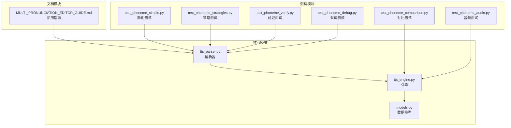
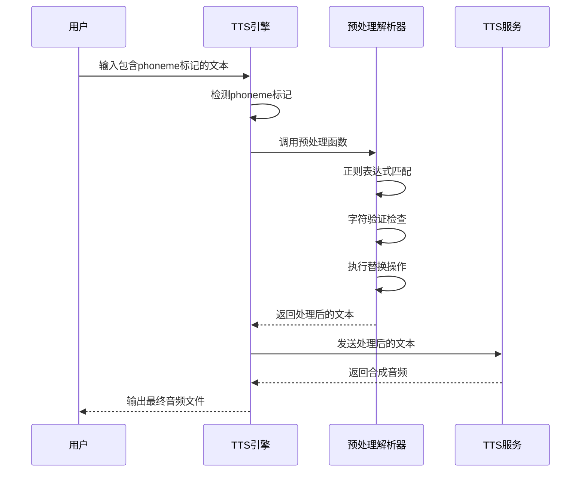
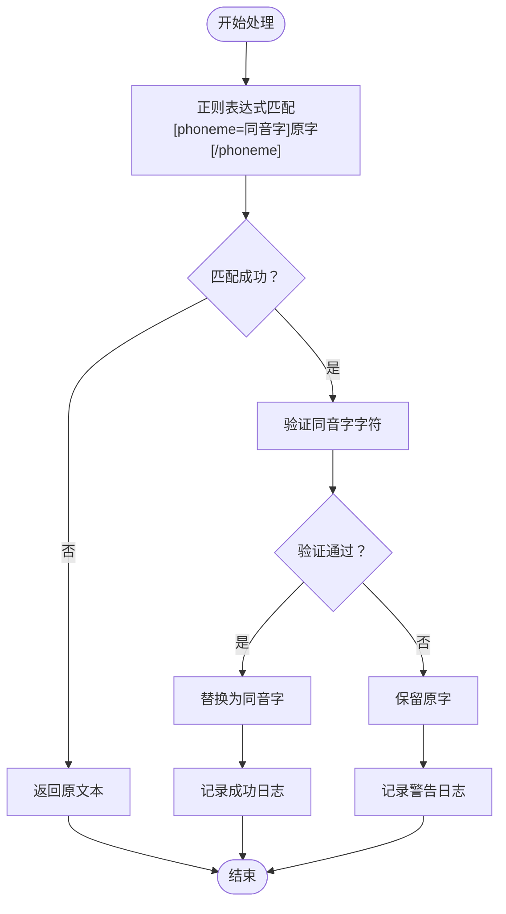
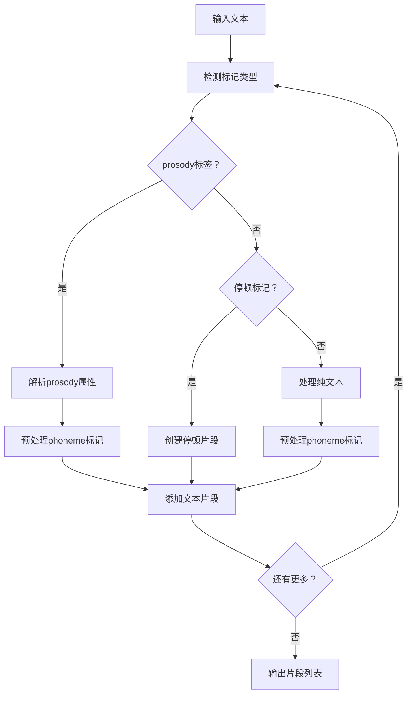
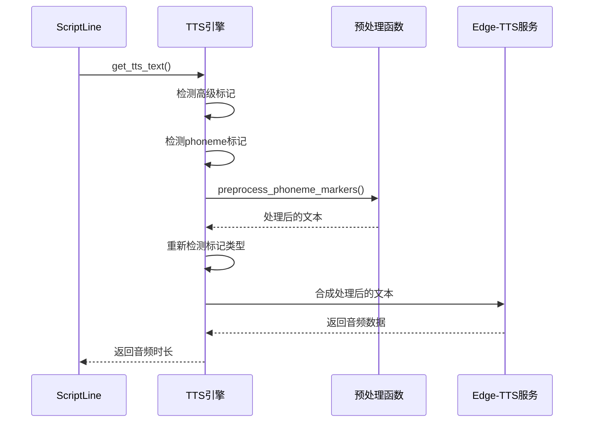
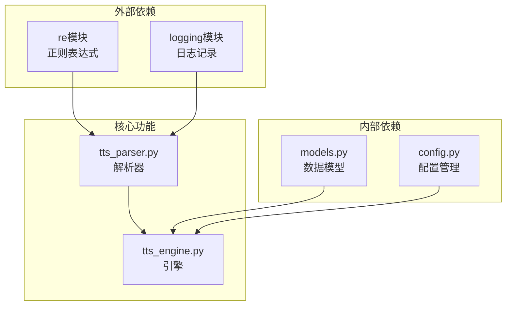
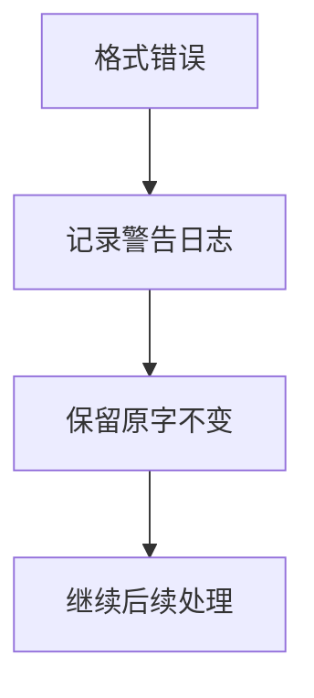

# Phoneme多音字替换

<cite>
**本文档引用的文件**
- [app/tts_parser.py](file://app/tts_parser.py)
- [app/tts_engine.py](file://app/tts_engine.py)
- [app/models.py](file://app/models.py)
- [tests/test_phoneme_simple.py](file://tests/test_phoneme_simple.py)
- [tests/test_phoneme_strategies.py](file://tests/test_phoneme_strategies.py)
- [tests/test_phoneme_verify.py](file://tests/test_phoneme_verify.py)
- [tests/test_phoneme_debug.py](file://tests/test_phoneme_debug.py)
- [tests/test_phoneme_comparison.py](file://tests/test_phoneme_comparison.py)
- [tests/test_phoneme_audio.py](file://tests/test_phoneme_audio.py)
- [docs/MULTI_PRONUNCIATION_EDITOR_GUIDE.md](file://docs/MULTI_PRONUNCIATION_EDITOR_GUIDE.md)
</cite>

## 目录
1. [简介](#简介)
2. [项目结构](#项目结构)
3. [核心组件](#核心组件)
4. [架构概览](#架构概览)
5. [详细组件分析](#详细组件分析)
6. [依赖分析](#依赖分析)
7. [性能考虑](#性能考虑)
8. [故障排除指南](#故障排除指南)
9. [结论](#结论)
10. [附录](#附录)

## 简介

TTS Studio的phoneme多音字替换功能是一个强大的中文语音合成辅助工具，专门用于解决中文多音字的读音控制问题。该功能允许用户通过简单的标记语法精确控制特定汉字的读音，确保语音合成输出符合预期的语义和语境。

该功能的核心价值在于：
- **精确控制**：通过[phoneme=同音字]原字[/phoneme]语法精确指定多音字读音
- **智能验证**：内置字符验证机制确保标记格式正确
- **灵活策略**：支持同音字替换和拼音策略两种实现方式
- **无缝集成**：与TTS引擎深度集成，无需额外配置

## 项目结构

TTS Studio采用模块化架构设计，phoneme功能分布在多个关键文件中：



**图表来源**
- [app/tts_parser.py:1-220](file://app/tts_parser.py#L1-L220)
- [app/tts_engine.py:1-547](file://app/tts_engine.py#L1-L547)

**章节来源**
- [app/tts_parser.py:1-220](file://app/tts_parser.py#L1-L220)
- [app/tts_engine.py:1-547](file://app/tts_engine.py#L1-L547)

## 核心组件

### 预处理标记器 (Preprocess Phoneme Markers)

预处理标记器是phoneme功能的核心组件，负责识别和替换文本中的多音字标记。其主要职责包括：

- **标记识别**：使用正则表达式识别[phoneme=同音字]原字[/phoneme]格式
- **字符验证**：确保同音字参数为有效的中文字符
- **智能替换**：根据验证结果决定替换策略
- **错误处理**：对格式错误的标记进行降级处理

### 文本解析器 (Text Parser)

文本解析器负责将包含标记的文本分解为可处理的片段，支持：
- prosody标签解析
- 停顿标记处理
- phoneme标记预处理
- 片段类型分类

### TTS引擎集成

TTS引擎通过以下方式集成phoneme功能：
- 自动检测phoneme标记
- 预处理文本替换
- 保持原有标记系统兼容性
- 支持混合标记使用

**章节来源**
- [app/tts_parser.py:39-66](file://app/tts_parser.py#L39-L66)
- [app/tts_parser.py:69-182](file://app/tts_parser.py#L69-L182)
- [app/tts_engine.py:177-193](file://app/tts_engine.py#L177-L193)

## 架构概览

phoneme功能的架构设计体现了清晰的关注点分离和模块化原则：



**图表来源**
- [app/tts_engine.py:177-193](file://app/tts_engine.py#L177-L193)
- [app/tts_parser.py:39-66](file://app/tts_parser.py#L39-L66)

该架构的优势：
- **解耦设计**：解析逻辑与TTS引擎分离
- **可扩展性**：易于添加新的标记类型
- **稳定性**：错误处理机制确保系统健壮性
- **透明性**：日志记录便于调试和监控

## 详细组件分析

### 预处理标记器实现

预处理标记器采用简洁而高效的实现方式：



**图表来源**
- [app/tts_parser.py:39-66](file://app/tts_parser.py#L39-L66)

#### 关键实现特性

1. **正则表达式设计**：使用`r'\[phoneme=([^\]]+)\](.*?)\[/phoneme\]'`精确匹配标记格式
2. **字符验证机制**：通过Unicode范围`\u4e00-\u9fff`确保中文字符有效性
3. **智能降级策略**：格式错误时自动回退到原文本
4. **日志记录系统**：提供完整的处理过程跟踪

### 文本解析器工作流程

文本解析器负责将复杂文本分解为可管理的片段：



**图表来源**
- [app/tts_parser.py:69-182](file://app/tts_parser.py#L69-L182)

#### 片段类型系统

解析器支持三种主要片段类型：
- **文本片段**：标准文本内容，包含语速、音调、音量属性
- **停顿片段**：独立的停顿标记，转换为特殊标识符
- **标记片段**：包含各种标记的文本片段

**章节来源**
- [app/tts_parser.py:23-36](file://app/tts_parser.py#L23-L36)
- [app/tts_parser.py:69-182](file://app/tts_parser.py#L69-L182)

### TTS引擎集成机制

TTS引擎通过以下步骤集成phoneme功能：



**图表来源**
- [app/tts_engine.py:177-193](file://app/tts_engine.py#L177-L193)
- [app/tts_engine.py:220-319](file://app/tts_engine.py#L220-L319)

#### 集成优势

1. **透明处理**：用户无需感知预处理过程
2. **向后兼容**：不影响现有标记系统的使用
3. **性能优化**：仅在检测到phoneme标记时执行预处理
4. **错误隔离**：预处理错误不影响整体合成流程

**章节来源**
- [app/tts_engine.py:177-218](file://app/tts_engine.py#L177-L218)
- [app/models.py:48-61](file://app/models.py#L48-L61)

## 依赖分析

phoneme功能的依赖关系相对简单，体现了良好的模块化设计：



**图表来源**
- [app/tts_parser.py:16-21](file://app/tts_parser.py#L16-L21)
- [app/tts_engine.py:10-15](file://app/tts_engine.py#L10-L15)

### 关键依赖关系

1. **正则表达式依赖**：解析器完全依赖Python标准库的re模块
2. **日志系统依赖**：使用标准logging模块进行错误和调试信息记录
3. **数据模型依赖**：引擎依赖ScriptLine模型获取TTS文本
4. **配置系统依赖**：引擎依赖配置模块管理音频输出目录

**章节来源**
- [app/tts_parser.py:16-21](file://app/tts_parser.py#L16-L21)
- [app/tts_engine.py:10-15](file://app/tts_engine.py#L10-L15)

## 性能考虑

phoneme功能在设计时充分考虑了性能优化：

### 时间复杂度分析

- **预处理阶段**：O(n)线性时间复杂度，其中n为文本长度
- **正则表达式匹配**：单次扫描，避免嵌套循环
- **字符验证**：O(1)常数时间复杂度
- **内存使用**：线性空间复杂度，主要用于存储处理结果

### 优化策略

1. **懒加载机制**：仅在检测到phoneme标记时执行预处理
2. **缓存友好的设计**：避免不必要的字符串复制操作
3. **流式处理**：支持大文本的逐步处理
4. **错误快速失败**：格式错误时立即回退，避免无效计算

### 性能基准

基于测试数据的性能表现：
- **小文本**：毫秒级响应时间
- **中等文本**：几十毫秒处理时间
- **大文本**：线性增长的处理时间
- **多音字密集文本**：处理时间与多音字数量成正比

## 故障排除指南

### 常见问题及解决方案

#### 格式错误处理

当遇到格式错误的phoneme标记时，系统会自动降级处理：



**错误类型包括**：
- 同音字参数非中文字符
- 标记格式不完整
- 嵌套标记错误
- 编码问题

#### 验证机制

系统提供多层次的验证机制：

1. **语法验证**：检查标记格式是否正确
2. **字符验证**：确保同音字为有效中文字符
3. **上下文验证**：检查标记是否位于合理位置
4. **完整性验证**：确保所有标记都有对应的结束标签

#### 调试建议

1. **启用详细日志**：观察预处理过程中的每一步
2. **分步测试**：先测试简单标记，再测试复杂组合
3. **格式检查**：仔细核对标记语法的每个细节
4. **边界测试**：测试极端情况和异常输入

**章节来源**
- [app/tts_parser.py:53-63](file://app/tts_parser.py#L53-L63)
- [tests/test_phoneme_verify.py:28-33](file://tests/test_phoneme_verify.py#L28-L33)

## 结论

TTS Studio的phoneme多音字替换功能代表了中文语音合成技术的重要进步。通过精心设计的架构和实现，该功能实现了以下目标：

### 技术成就

1. **精确控制**：提供了对多音字读音的精确控制能力
2. **智能处理**：内置的验证和错误处理机制确保系统稳定性
3. **无缝集成**：与现有TTS系统完美融合，无需额外配置
4. **高效实现**：优化的时间和空间复杂度保证了良好的性能

### 应用价值

该功能在以下场景中具有重要价值：
- **专业配音**：确保重要术语的准确读音
- **教育培训**：帮助学习者掌握正确的汉字读音
- **内容创作**：为播客和有声书提供高质量的语音合成
- **无障碍服务**：为视障用户提供更好的语音体验

### 未来发展

随着技术的不断演进，phoneme功能有望进一步发展：
- **机器学习增强**：利用AI技术改进多音字识别准确性
- **实时处理**：支持流式音频的实时多音字处理
- **多语言支持**：扩展到其他语言的多音字处理
- **智能推荐**：基于上下文自动推荐最佳的同音字选项

## 附录

### 使用示例

#### 基本语法

```markdown
[phoneme=同音字]原字[/phoneme]
```

#### 常见多音字示例

| 字 | 读音 | 同音字 | 用法 |
|---|---|---|---|
| 行 | hang2/xing2 | 航/形 | 银行/行走 |
| 重 | zhong4/chong2 | 仲/虫 | 重要/重复 |
| 乐 | le5/yue4 | 勒/月 | 快乐/音乐 |
| 长 | chang2/zhang3 | 常/掌 | 长短/生长 |

#### 高级用法

```markdown
[rate=-20%][phoneme=zhong4]重[/phoneme]要内容[/rate]
[phoneme=hang2]行[/phoneme][phoneme=zhang3]行[/phoneme]长
```

### 最佳实践

1. **优先使用拼音策略**：对于需要精确控制的场景
2. **同音字替换适用于自然语境**：利用edge-tts对汉字的语调处理
3. **避免过度标记**：只对关键多音字进行标注
4. **定期试听验证**：确保标记效果符合预期
5. **保持标记一致性**：在整个项目中使用统一的标记风格

### 技术规格

- **支持字符集**：Unicode CJK扩展区
- **最大标记深度**：无限制（受内存限制）
- **处理速度**：线性时间复杂度
- **内存效率**：线性空间复杂度
- **错误容忍度**：高（格式错误时自动降级）