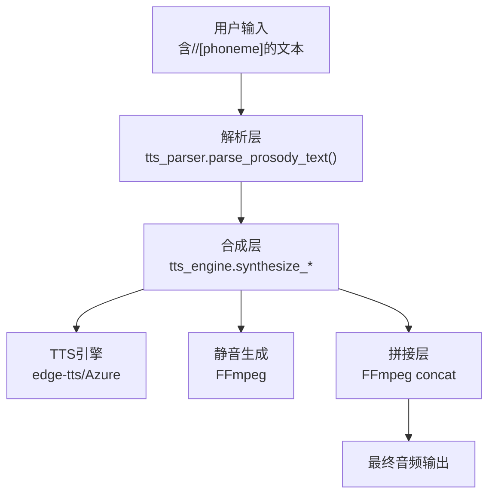
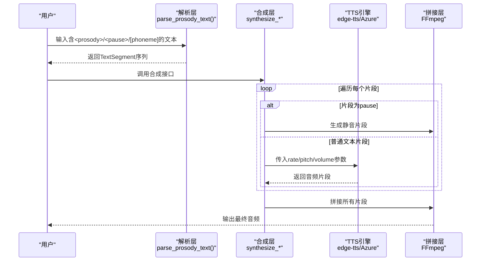
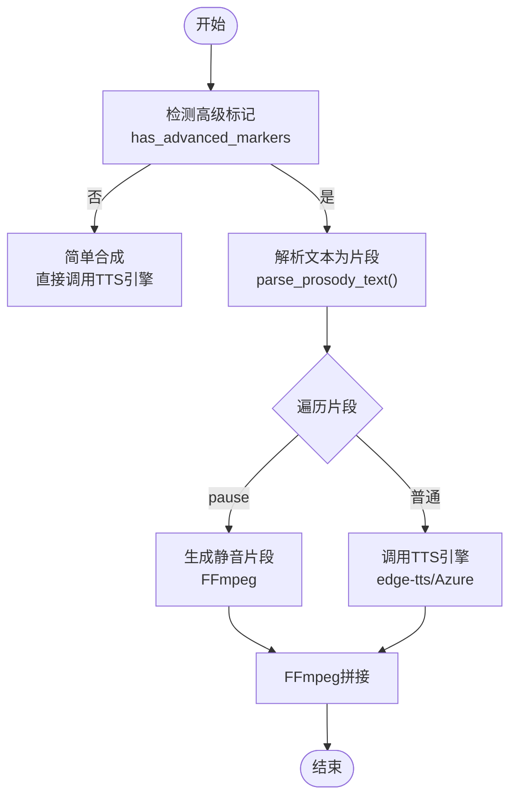
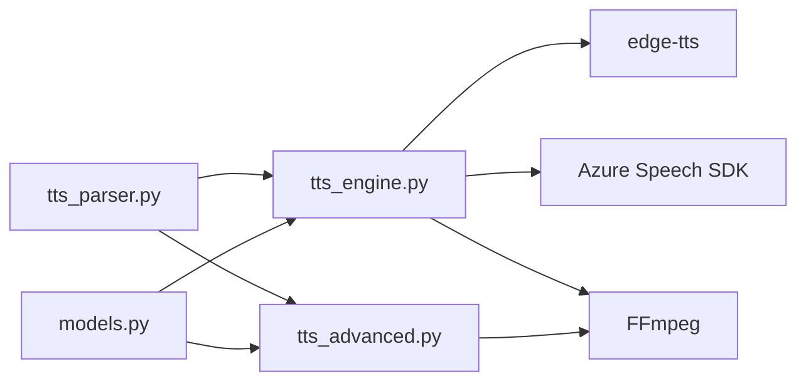

# Prosody语调控制标签

<cite>
**本文引用的文件**
- [tts_parser.py](file://app/tts_parser.py)
- [tts_engine.py](file://app/tts_engine.py)
- [tts_advanced.py](file://app/tts_advanced.py)
- [models.py](file://app/models.py)
- [test_tts_parser.py](file://tests/test_tts_parser.py)
- [test_multi_prosody_correct.py](file://tests/test_multi_prosody_correct.py)
- [test_ssml.py](file://tests/test_ssml.py)
- [EDGE_TTS_ADVANCED_MARKERS_GUIDE.md](file://docs/EDGE_TTS_ADVANCED_MARKERS_GUIDE.md)
</cite>

## 目录
1. [简介](#简介)
2. [项目结构](#项目结构)
3. [核心组件](#核心组件)
4. [架构总览](#架构总览)
5. [详细组件分析](#详细组件分析)
6. [依赖关系分析](#依赖关系分析)
7. [性能考量](#性能考量)
8. [故障排查指南](#故障排查指南)
9. [结论](#结论)
10. [附录](#附录)

## 简介
本文件面向TTS Studio中“prosody语调控制标签”的使用与实现，系统化阐述以下内容：
- <prosody>标签的语法结构与属性参数格式规范（rate语速、pitch音调、volume音量）
- 属性取值范围、正负号约定、单位标识与合法值范围
- 嵌套处理机制与优先级规则
- 在文本分割与音频合成过程中的作用机制
- 丰富的实际使用示例与最佳实践
- 与Edge-TTS能力边界的对应关系及替代方案

## 项目结构
围绕prosody标签，TTS Studio在以下模块协同工作：
- 解析层：负责识别并拆分包含<prosody>、<pause>、[phoneme]等标记的文本，生成TextSegment序列
- 合成层：针对每个片段调用TTS引擎（edge-tts或Azure），并按需生成静音片段
- 拼接层：使用FFmpeg将多个音频片段拼接为最终音频
- 模型层：提供ScriptLine、AudioClip等数据结构，承载文本、音色、参数等信息

图表来源
- [tts_parser.py:69-182](file://app/tts_parser.py#L69-L182)
- [tts_engine.py:120-218](file://app/tts_engine.py#L120-L218)
- [tts_engine.py:321-453](file://app/tts_engine.py#L321-L453)

章节来源
- [tts_parser.py:69-182](file://app/tts_parser.py#L69-L182)
- [tts_engine.py:120-218](file://app/tts_engine.py#L120-L218)
- [tts_engine.py:321-453](file://app/tts_engine.py#L321-L453)

## 核心组件
- TextSegment：表示一个文本片段及其参数（rate、pitch、volume、是否标记、片段类型等）
- parse_prosody_text：解析<prosody>、<pause>、[phoneme]等标记，输出TextSegment序列
- synthesize_*系列：根据是否包含高级标记，选择简单合成或高级合成（自动拆分+拼接）

章节来源
- [tts_parser.py:23-32](file://app/tts_parser.py#L23-L32)
- [tts_parser.py:69-182](file://app/tts_parser.py#L69-L182)
- [tts_engine.py:120-218](file://app/tts_engine.py#L120-L218)
- [tts_engine.py:321-453](file://app/tts_engine.py#L321-L453)

## 架构总览
下图展示了从输入文本到最终音频的端到端流程，重点体现prosody标签在“文本拆分—片段合成—音频拼接”中的作用。

图表来源
- [tts_parser.py:69-182](file://app/tts_parser.py#L69-L182)
- [tts_engine.py:321-453](file://app/tts_engine.py#L321-L453)

## 详细组件分析

### 1) prosody标签语法与属性格式规范
- 语法结构
  - <prosody rate="..." pitch="..." volume="...">内容</prosody>
  - 属性可选，未提供的属性使用默认值
- 属性参数格式
  - rate：语速
    - 支持百分比（如"-20%"、"+50%"）
    - 支持具体数值（如"1.2"）
    - 正负号约定：正号表示加快，负号表示减慢；省略时默认"+0%"
  - pitch：音调
    - 支持赫兹单位（如"+10Hz"、"-5Hz"）
    - 支持百分比（如"+10%"、"-5%"）
    - 正负号约定：正号表示升高，负号表示降低；省略时默认"+0Hz"
  - volume：音量
    - 支持百分比（如"+10%"、"-5%"）
    - 支持具体数值（如"1.2"）
    - 正负号约定：正号表示增大，负号表示减小；省略时默认"+0%"
- 取值范围
  - rate：建议在-100%~+100%范围内使用，具体取决于TTS引擎支持
  - pitch：建议在±几十Hz范围内使用，避免极端值导致音质异常
  - volume：建议在合理范围内使用，避免过度放大造成失真
- 注意事项
  - 属性值必须符合上述格式，否则解析器会使用默认值
  - 若同时出现百分比与具体数值，以解析器实现为准（通常以百分比为主）

章节来源
- [tts_parser.py:69-144](file://app/tts_parser.py#L69-L144)
- [tts_parser.py:185-189](file://app/tts_parser.py#L185-L189)

### 2) 嵌套处理机制与优先级规则
- 嵌套与继承
  - prosody标签内部可包含其他标记（如[phoneme]），但prosody本身不支持嵌套
  - prosody标签内的文本片段会继承其rate/pitch/volume参数
- 优先级
  - 外层prosody参数对内层片段生效
  - 若内层再次声明相同参数，则以内层为准
- 解析流程
  - 解析器按顺序扫描文本，遇到<prosody ...>...</prosody>即提取属性与内容
  - prosody内容内部的[phoneme]会在解析前被预处理替换
  - prosody前后的纯文本也会作为独立片段处理（默认参数）

章节来源
- [tts_parser.py:69-182](file://app/tts_parser.py#L69-L182)

### 3) 文本分割与音频合成过程
- 文本分割
  - 解析器将文本按<prosody>、<pause>、[pause]等标记切分为多个片段
  - 每个片段携带独立的rate/pitch/volume参数
- 音频合成
  - 对每个片段分别调用TTS引擎（edge-tts或Azure）
  - pause片段通过FFmpeg生成固定时长的静音
- 音频拼接
  - 使用FFmpeg concat demuxer将所有片段拼接为最终音频
  - 输出文件路径由调用方指定

图表来源
- [tts_engine.py:167-218](file://app/tts_engine.py#L167-L218)
- [tts_engine.py:321-453](file://app/tts_engine.py#L321-L453)

章节来源
- [tts_engine.py:167-218](file://app/tts_engine.py#L167-L218)
- [tts_engine.py:321-453](file://app/tts_engine.py#L321-L453)

### 4) 实际使用示例与最佳实践
- 示例1：单个prosody标签
  - 场景：整句慢速朗读
  - 语法：<prosody rate="-20%" pitch="+10Hz">内容</prosody>
- 示例2：多个prosody标签
  - 场景：前后两段不同语速/音调
  - 语法：<prosody rate="-20%">前半句</prosody><prosody rate="+50%" pitch="+10Hz">后半句</prosody>
- 示例3：pause停顿
  - 场景：句间停顿
  - 语法：<prosody rate="-20%">前半句</prosody><pause=500><prosody rate="+50%">后半句</prosody>
- 示例4：phoneme替换
  - 场景：多音字替换
  - 语法：<prosody pitch="+10Hz">[phoneme=航]行[/phoneme]走</prosody>
- 示例5：复杂组合
  - 场景：多段语气变化+停顿+多音字
  - 语法：<prosody rate="-20%">慢速</prosody><pause=300><prosody rate="+50%" pitch="+10Hz">快速高音</prosody>

章节来源
- [test_tts_parser.py:43-86](file://tests/test_tts_parser.py#L43-L86)
- [test_tts_parser.py:113-134](file://tests/test_tts_parser.py#L113-L134)
- [test_multi_prosody_correct.py:18-40](file://tests/test_multi_prosody_correct.py#L18-L40)
- [test_ssml.py:38-44](file://tests/test_ssml.py#L38-L44)

### 5) 与Edge-TTS能力边界的对应关系
- Edge-TTS原生支持
  - 基础文本合成
  - 单个或两个prosody标签
  - 自定义SSML（通过补丁）
- Edge-TTS不支持（需替代）
  - <break>标签（停顿）→ 使用[pause=...]或<pause=...>替代
  - <phoneme>标签（多音字）→ 使用[phoneme=同音字]替代
  - <emphasis>标签（强调）→ 使用rate/pitch组合模拟
  - 三个以上prosody嵌套→ 拆分为多个片段分别合成
  - rate/pitch逗号分隔多值→ 分开设置

章节来源
- [EDGE_TTS_ADVANCED_MARKERS_GUIDE.md:81-136](file://docs/EDGE_TTS_ADVANCED_MARKERS_GUIDE.md#L81-L136)

## 依赖关系分析
- 解析层依赖
  - 正则表达式匹配<prosody>、<pause>、[pause]等标记
  - phoneme预处理函数
- 合成层依赖
  - tts_parser.parse_prosody_text输出的TextSegment序列
  - edge-tts或Azure TTS引擎
  - FFmpeg用于生成静音与拼接音频
- 模型层依赖
  - ScriptLine、AudioClip等数据结构承载参数与状态

图表来源
- [tts_parser.py:69-182](file://app/tts_parser.py#L69-L182)
- [tts_engine.py:120-218](file://app/tts_engine.py#L120-L218)
- [tts_advanced.py:112-290](file://app/tts_advanced.py#L112-L290)
- [models.py:37-61](file://app/models.py#L37-L61)

章节来源
- [tts_parser.py:69-182](file://app/tts_parser.py#L69-L182)
- [tts_engine.py:120-218](file://app/tts_engine.py#L120-L218)
- [tts_advanced.py:112-290](file://app/tts_advanced.py#L112-L290)
- [models.py:37-61](file://app/models.py#L37-L61)

## 性能考量
- 合成耗时
  - 每个片段均需一次TTS请求，N个片段约等于N×单片段合成时间
- 网络开销
  - 每个片段都会产生一次网络往返
- 拼接成本
  - 使用FFmpeg concat demuxer进行无损拼接，避免二次编码
- 优化建议
  - 合理拆分片段，避免过多细碎片段
  - 控制pause时长，减少静音片段数量
  - 使用合适的rate/pitch/volume参数，避免极端值导致多次重试

[本节为通用性能讨论，不直接分析特定文件]

## 故障排查指南
- 常见问题
  - prosody标签未生效：确认标签格式正确，属性值符合规范
  - pause无效：确保使用<pause=...>或[pause=...]语法
  - phoneme未替换：确认[phoneme=同音字]格式正确，且同音字为单个汉字
  - 音频拼接失败：检查FFmpeg是否可用，以及临时文件权限
- 排查步骤
  - 检查输入文本是否包含高级标记
  - 查看解析结果（segments数量与参数）
  - 观察TTS引擎返回的错误信息
  - 确认FFmpeg命令执行是否成功

章节来源
- [tts_engine.py:167-218](file://app/tts_engine.py#L167-L218)
- [tts_engine.py:321-453](file://app/tts_engine.py#L321-L453)
- [tts_parser.py:69-182](file://app/tts_parser.py#L69-L182)

## 结论
- prosody标签提供了灵活的语速、音调、音量控制能力，结合pause与phoneme，可在一句话内实现丰富的语气变化
- 解析层负责将复杂文本拆分为可合成的片段，合成层与拼接层保证最终音频的连贯与质量
- 遵循属性格式规范与优先级规则，配合合理的示例与最佳实践，可显著提升TTS音频的表现力

[本节为总结性内容，不直接分析特定文件]

## 附录
- 数据模型
  - TextSegment：rate、pitch、volume、is_marked、segment_type等字段
  - ScriptLine：text、voice、rate、pitch、ssml_text等字段
- 测试参考
  - 单个prosody标签测试
  - prosody与pause混合测试
  - prosody内部phoneme替换测试
  - 多prosody正确用法测试
  - 自定义SSML测试

章节来源
- [tts_parser.py:23-32](file://app/tts_parser.py#L23-L32)
- [models.py:37-61](file://app/models.py#L37-L61)
- [test_tts_parser.py:43-86](file://tests/test_tts_parser.py#L43-L86)
- [test_tts_parser.py:113-134](file://tests/test_tts_parser.py#L113-L134)
- [test_multi_prosody_correct.py:18-40](file://tests/test_multi_prosody_correct.py#L18-L40)
- [test_ssml.py:38-44](file://tests/test_ssml.py#L38-L44)