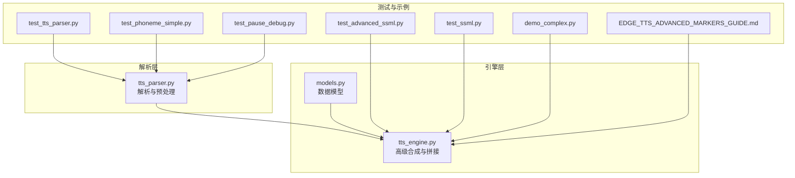
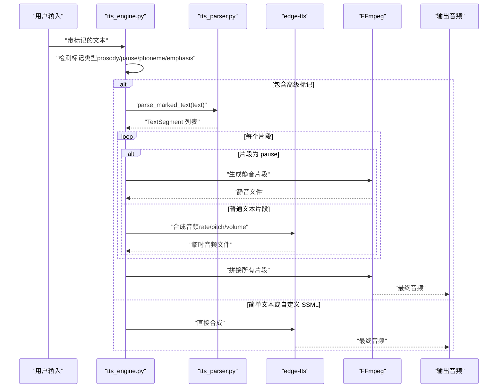
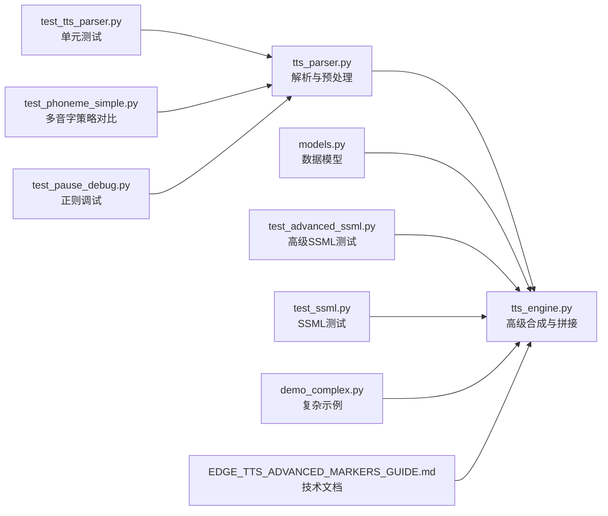

# SSML标记语法

<cite>
**本文引用的文件**
- [tts_parser.py](file://app/tts_parser.py)
- [tts_engine.py](file://app/tts_engine.py)
- [models.py](file://app/models.py)
- [test_tts_parser.py](file://tests/test_tts_parser.py)
- [test_advanced_ssml.py](file://tests/test_advanced_ssml.py)
- [test_ssml.py](file://tests/test_ssml.py)
- [test_phoneme_simple.py](file://tests/test_phoneme_simple.py)
- [test_pause_debug.py](file://tests/test_pause_debug.py)
- [EDGE_TTS_ADVANCED_MARKERS_GUIDE.md](file://docs/EDGE_TTS_ADVANCED_MARKERS_GUIDE.md)
- [demo_complex.py](file://demo_complex.py)
</cite>

## 目录
1. [简介](#简介)
2. [项目结构](#项目结构)
3. [核心组件](#核心组件)
4. [架构总览](#架构总览)
5. [详细组件分析](#详细组件分析)
6. [依赖关系分析](#依赖关系分析)
7. [性能考量](#性能考量)
8. [故障排查指南](#故障排查指南)
9. [结论](#结论)
10. [附录](#附录)

## 简介
本文件系统化梳理 TTS Studio 中的 SSML 标记语法与解析实现，重点覆盖以下方面：
- prosody 标签的使用：语速(rate)、音调(pitch)、音量(volume)的控制语法与参数格式
- pause 停顿标记：两种语法形式（<pause=...> 与 [pause=...]）及其实现机制
- phoneme 多音字替换标记：音素符号语法、同音字精确控制与替换算法
- parse_marked_text 函数的解析逻辑：标记识别、参数提取与文本分割机制
- 结合测试与示例，给出组合使用与最佳实践建议

## 项目结构
围绕 SSML 标记语法的核心代码主要集中在解析层与引擎层：
- 解析层：负责识别与拆分标记、提取参数、预处理 phoneme
- 引擎层：根据解析结果决定是否切片合成、如何生成停顿片段、如何拼接音频

图表来源
- [tts_parser.py:1-220](file://app/tts_parser.py#L1-L220)
- [tts_engine.py:1-547](file://app/tts_engine.py#L1-L547)
- [models.py:1-78](file://app/models.py#L1-L78)
- [test_tts_parser.py:1-364](file://tests/test_tts_parser.py#L1-L364)
- [test_advanced_ssml.py:1-143](file://tests/test_advanced_ssml.py#L1-L143)
- [test_ssml.py:1-123](file://tests/test_ssml.py#L1-L123)
- [test_phoneme_simple.py:1-51](file://tests/test_phoneme_simple.py#L1-L51)
- [test_pause_debug.py:1-26](file://tests/test_pause_debug.py#L1-L26)
- [demo_complex.py:116-145](file://demo_complex.py#L116-L145)
- [EDGE_TTS_ADVANCED_MARKERS_GUIDE.md:1-800](file://docs/EDGE_TTS_ADVANCED_MARKERS_GUIDE.md#L1-L800)

章节来源
- [tts_parser.py:1-220](file://app/tts_parser.py#L1-L220)
- [tts_engine.py:1-547](file://app/tts_engine.py#L1-L547)
- [models.py:1-78](file://app/models.py#L1-L78)

## 核心组件
- TextSegment 数据结构：承载每个片段的文本、语速、音调、音量、片段类型与标记状态
- preprocess_phoneme_markers：将 [phoneme=同音字]原字[/phoneme] 替换为同音字
- parse_prosody_text：识别 prosody、pause、phoneme 等标记，拆分为多个 TextSegment
- parse_marked_text：兼容旧接口，直接委托 parse_prosody_text
- tts_engine：根据是否包含高级标记（prosody/pause/phoneme/emphasis）决定走高级合成或简单合成

章节来源
- [tts_parser.py:23-36](file://app/tts_parser.py#L23-L36)
- [tts_parser.py:39-66](file://app/tts_parser.py#L39-L66)
- [tts_parser.py:69-182](file://app/tts_parser.py#L69-L182)
- [tts_parser.py:216-218](file://app/tts_parser.py#L216-L218)
- [tts_engine.py:13-15](file://app/tts_engine.py#L13-L15)

## 架构总览
下图展示了从用户输入到最终音频输出的端到端流程，重点体现标记解析、片段拆分、停顿生成与音频拼接：

图表来源
- [tts_engine.py:167-217](file://app/tts_engine.py#L167-L217)
- [tts_engine.py:321-453](file://app/tts_engine.py#L321-L453)
- [tts_parser.py:69-182](file://app/tts_parser.py#L69-L182)

## 详细组件分析

### prosody 标签：语速(rate)、音调(pitch)、音量(volume)控制
- 语法形式：`<prosody rate="X" pitch="Y" volume="Z">内容</prosody>`
- 参数格式要求：
  - rate：百分比字符串，如 "+0%"、"-20%"、"+40%"
  - pitch：频率偏移字符串，如 "+0Hz"、"+10Hz"、"-5Hz"
  - volume：数值字符串，如 "+0%"、"1.2"（相对倍数）
- 解析逻辑：
  - 使用正则提取 prosody 属性，若缺失则使用默认值
  - prosody 内容中的 [phoneme] 标记会在预处理阶段被替换
- 片段类型：is_marked=True，segment_type="text"

章节来源
- [tts_parser.py:69-151](file://app/tts_parser.py#L69-L151)
- [tts_parser.py:185-189](file://app/tts_parser.py#L185-L189)
- [test_tts_parser.py:43-86](file://tests/test_tts_parser.py#L43-L86)

### pause 停顿标记：两种语法与实现机制
- 语法形式：
  - `<pause=毫秒>`：如 `<pause=500>`
  - `[pause=毫秒]`：如 `[pause=300]`
- 实现机制：
  - 解析器识别两类语法，统一生成 segment_type="pause" 的 TextSegment
  - rate 字段存储停顿时长（毫秒），text 字段为占位符 "__PAUSE_X__"
  - 高级合成阶段由引擎层使用 FFmpeg 生成对应时长的静音片段
- 停顿位置：可出现在任意文本片段之间，不影响前后文本的 prosody 参数

章节来源
- [tts_parser.py:89-132](file://app/tts_parser.py#L89-L132)
- [tts_engine.py:372-390](file://app/tts_engine.py#L372-L390)
- [test_tts_parser.py:89-134](file://tests/test_tts_parser.py#L89-L134)
- [demo_complex.py:116-145](file://demo_complex.py#L116-L145)

### phoneme 多音字替换标记：语法、算法与策略
- 语法形式：`[phoneme=同音字]原字[/phoneme]`
- 算法实现：
  - 预处理阶段一次性替换所有 [phoneme=同音字]原字[/phoneme]，将原字替换为同音字
  - 仅允许单个中文字符作为替换字；否则保留原文本并告警
  - prosody 内部的 phoneme 标记也会被预处理替换
- 策略说明：
  - 采用“同音字替换”而非“拼音标注”，避免 edge-tts 将拼音当作字母串读出
  - 前端直接指定替换字，无需维护庞大的拼音→同音字映射表
- 片段类型：phoneme 标记本身不改变 is_marked，但替换后的文本作为普通文本片段参与合成

章节来源
- [tts_parser.py:39-66](file://app/tts_parser.py#L39-L66)
- [tts_engine.py:177-192](file://app/tts_engine.py#L177-L192)
- [test_tts_parser.py:164-203](file://tests/test_tts_parser.py#L164-L203)
- [test_phoneme_simple.py:14-51](file://tests/test_phoneme_simple.py#L14-L51)
- [EDGE_TTS_ADVANCED_MARKERS_GUIDE.md:687-774](file://docs/EDGE_TTS_ADVANCED_MARKERS_GUIDE.md#L687-L774)

### parse_marked_text 函数：解析逻辑与文本分割
- 输入：带标记的文本
- 输出：TextSegment 列表
- 解析步骤：
  - 若文本为空或仅空白，返回空列表
  - 使用正则匹配 prosody、pause、phoneme 等标记
  - 对 prosody 标签前后的纯文本，按默认参数生成片段
  - 对 pause 标签，生成 pause 片段（segment_type="pause"）
  - 对 prosody 标签，解析 rate/pitch/volume，并对内容执行 phoneme 预处理
  - 处理最后一个标签之后的纯文本
  - 若未匹配到任何标记，整个文本作为单一片段返回
- 辅助函数：
  - _parse_attr：从属性字符串中提取指定属性的值
  - _has_markers：检测是否包含标记
  - has_markers/count_segments/needs_splitting：兼容旧接口与工具函数

章节来源
- [tts_parser.py:69-182](file://app/tts_parser.py#L69-L182)
- [tts_parser.py:185-195](file://app/tts_parser.py#L185-L195)
- [tts_parser.py:216-218](file://app/tts_parser.py#L216-L218)

### 数据模型与集成点
- TextSegment：承载每个片段的文本、rate、pitch、volume、is_marked、segment_type
- ScriptLine：提供 get_tts_text，优先返回 ssml_text（包含标记的完整文本），否则返回 text
- tts_engine：在合成前检测标记类型，决定走高级合成还是简单合成

章节来源
- [tts_parser.py:23-36](file://app/tts_parser.py#L23-L36)
- [models.py:36-61](file://app/models.py#L36-L61)
- [tts_engine.py:31-41](file://app/tts_engine.py#L31-L41)

## 依赖关系分析
- 解析层依赖正则表达式进行标记识别与参数提取
- 引擎层依赖解析层输出的 TextSegment 列表，决定是否切片与如何生成停顿
- 测试与示例文件覆盖了多种标记组合与边界情况，确保解析与合成行为符合预期

图表来源
- [tts_parser.py:1-220](file://app/tts_parser.py#L1-L220)
- [tts_engine.py:1-547](file://app/tts_engine.py#L1-L547)
- [models.py:1-78](file://app/models.py#L1-L78)
- [test_tts_parser.py:1-364](file://tests/test_tts_parser.py#L1-L364)
- [test_advanced_ssml.py:1-143](file://tests/test_advanced_ssml.py#L1-L143)
- [test_ssml.py:1-123](file://tests/test_ssml.py#L1-L123)
- [test_phoneme_simple.py:1-51](file://tests/test_phoneme_simple.py#L1-L51)
- [test_pause_debug.py:1-26](file://tests/test_pause_debug.py#L1-L26)
- [demo_complex.py:116-145](file://demo_complex.py#L116-L145)
- [EDGE_TTS_ADVANCED_MARKERS_GUIDE.md:1-800](file://docs/EDGE_TTS_ADVANCED_MARKERS_GUIDE.md#L1-L800)

## 性能考量
- 切片合成的代价：N 个片段约等于 N 次 TTS 请求与一次拼接，耗时与网络开销随片段数线性增长
- 停顿生成：使用 FFmpeg 直接生成静音，避免额外的 TTS 调用
- 建议：
  - 合理拆分 prosody，避免过多小片段导致网络往返频繁
  - 将相近语速/音调的文本合并到同一 prosody 片段中
  - 使用 [pause=...] 控制停顿，减少不必要的片段边界

章节来源
- [EDGE_TTS_ADVANCED_MARKERS_GUIDE.md:282-316](file://docs/EDGE_TTS_ADVANCED_MARKERS_GUIDE.md#L282-L316)

## 故障排查指南
- 标记未生效
  - 检查是否包含高级标记（prosody/pause/phoneme/emphasis），否则引擎会走简单合成
  - 确认文本中包含正确的语法形式（如 <pause=500> 或 [pause=300]）
- phoneme 标记无效
  - 确保替换字为单个中文字符；否则会被视为格式错误并保留原文本
  - 确认预处理阶段已执行，且后续 prosody 标签内的 phoneme 也被替换
- 停顿不生效
  - 确认使用了正确的语法形式；解析器会将 pause 标记识别为 segment_type="pause"
  - 高级合成阶段才会生成静音片段，确保进入高级合成路径
- 自定义 SSML 与高级标记混用
  - 若文本以 <speak 开头，将被视为自定义 SSML，直接传给 edge-tts
  - 若包含高级标记（prosody/pause/phoneme/emphasis），将触发切片合成

章节来源
- [tts_engine.py:167-217](file://app/tts_engine.py#L167-L217)
- [tts_parser.py:39-66](file://app/tts_parser.py#L39-L66)
- [tts_parser.py:89-132](file://app/tts_parser.py#L89-L132)

## 结论
TTS Studio 通过解析层与引擎层的协同，实现了对 prosody、pause、phoneme 等标记的完整支持。其核心策略包括：
- prosody：灵活控制语速、音调、音量，适合表达情感与节奏变化
- pause：统一支持两种语法，便于在复杂文本中插入停顿
- phoneme：采用“同音字替换”策略，保证多音字读音可控且与 TTS 引擎兼容
- parse_marked_text：稳定可靠的解析与拆分逻辑，为高级合成提供基础

## 附录

### 实际示例与最佳实践
- prosody 示例
  - 一句话内多次语气变化：将不同语速/音调的片段放入多个 prosody 标签
  - 参考：[test_advanced_ssml.py:23-102](file://tests/test_advanced_ssml.py#L23-L102)
- pause 示例
  - 短停顿与长停顿组合：在文本中插入多个 pause 标记
  - 参考：[demo_complex.py:116-145](file://demo_complex.py#L116-L145)
- phoneme 示例
  - 同音字替换 vs 拼音策略：对比两种方式的解析结果
  - 参考：[test_phoneme_simple.py:14-51](file://tests/test_phoneme_simple.py#L14-L51)
- 组合使用
  - 多音字 + 停顿 + 语气变化：先预处理 phoneme，再拆分 prosody 与 pause
  - 参考：[test_tts_parser.py:206-247](file://tests/test_tts_parser.py#L206-L247)

### 语法速查
- prosody：`<prosody rate="X" pitch="Y" volume="Z">内容</prosody>`
- pause：`<pause=毫秒>` 或 `[pause=毫秒]`
- phoneme：`[phoneme=同音字]原字[/phoneme]`
- 自定义 SSML：以 `<speak` 开头的完整 SSML 文本

章节来源
- [test_advanced_ssml.py:18-143](file://tests/test_advanced_ssml.py#L18-L143)
- [test_ssml.py:12-123](file://tests/test_ssml.py#L12-L123)
- [test_phoneme_simple.py:14-51](file://tests/test_phoneme_simple.py#L14-L51)
- [test_tts_parser.py:206-247](file://tests/test_tts_parser.py#L206-L247)