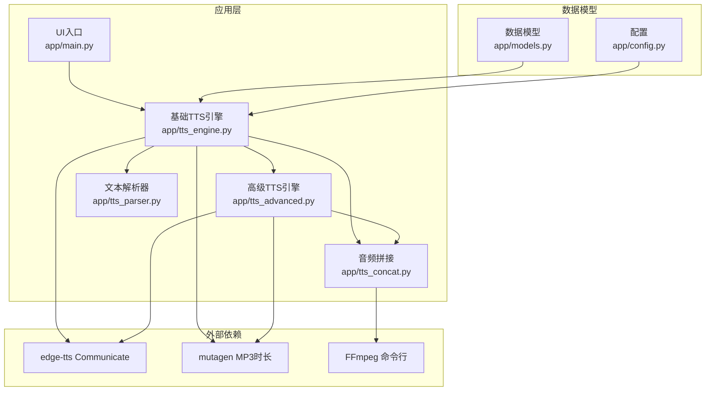
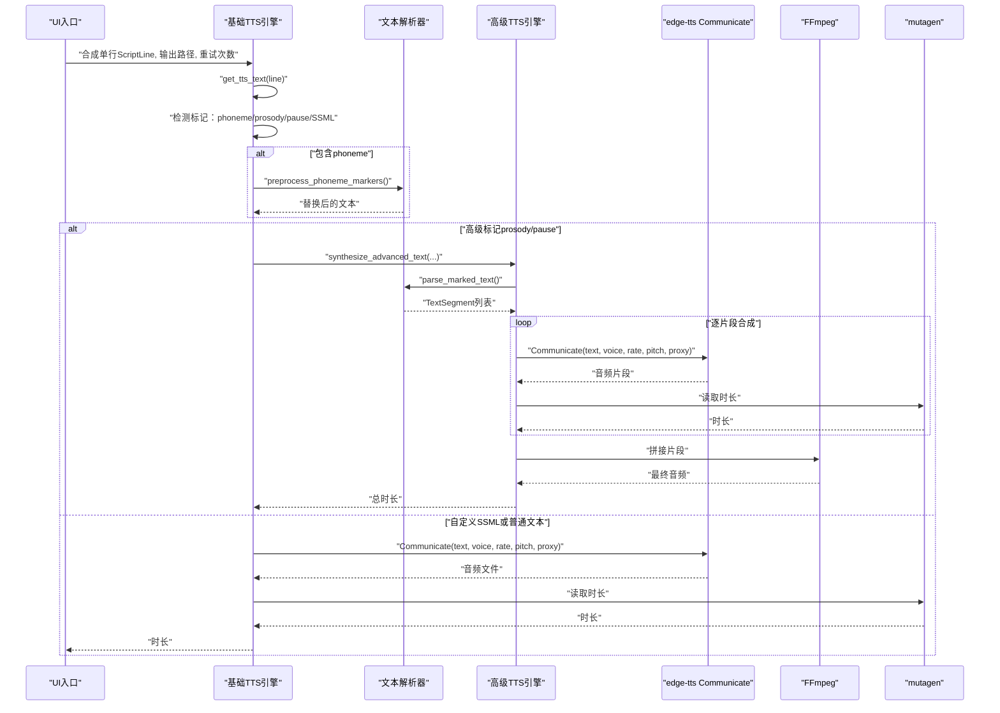
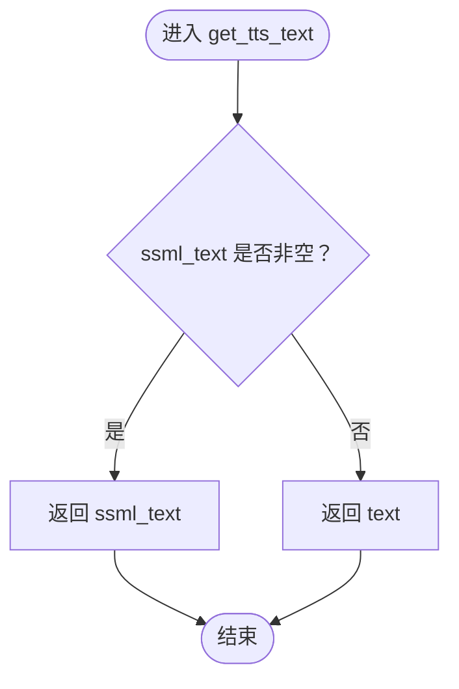
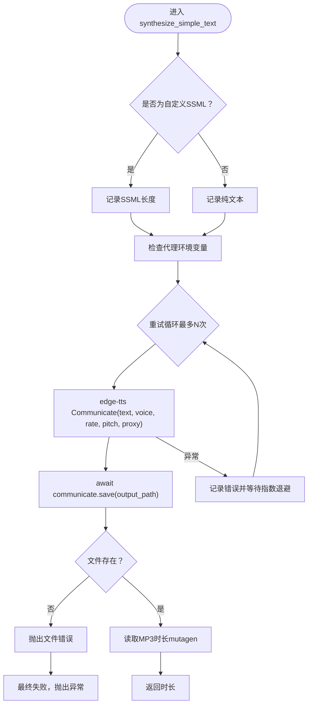
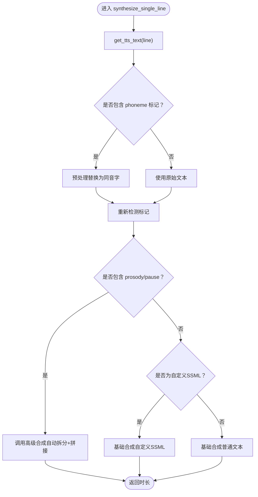
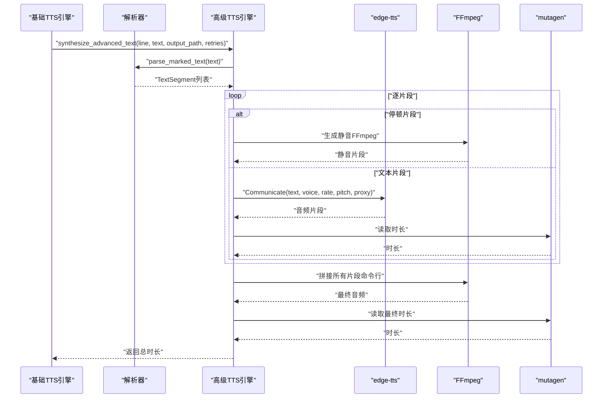
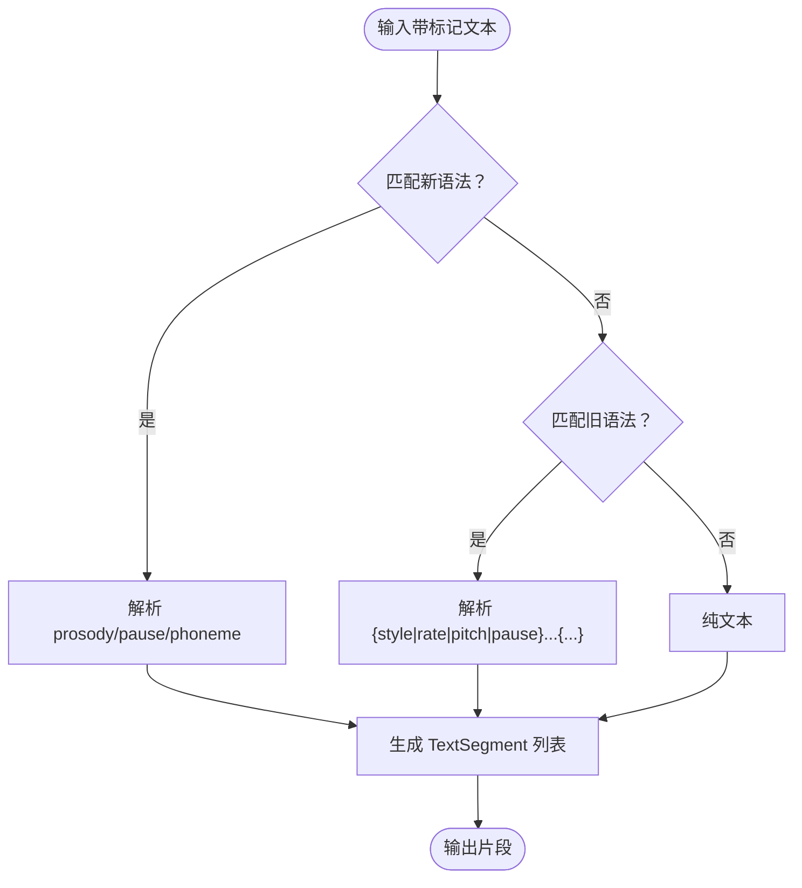
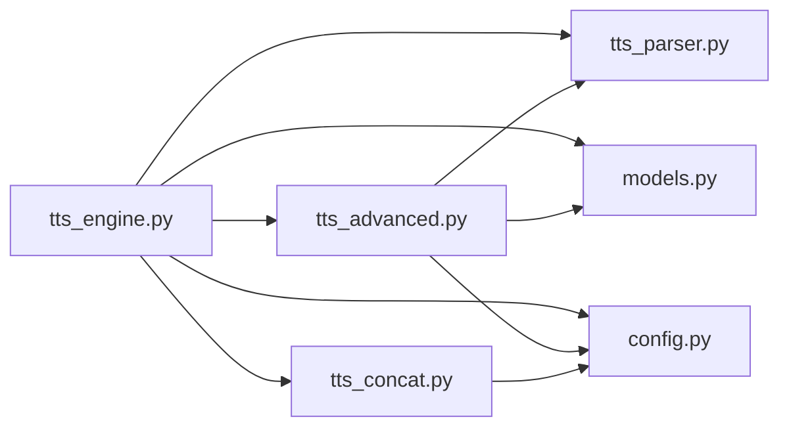

# 基础TTS功能

<cite>
**本文引用的文件**
- [tts_engine.py](file://app/tts_engine.py)
- [tts_parser.py](file://app/tts_parser.py)
- [tts_advanced.py](file://app/tts_advanced.py)
- [tts_concat.py](file://app/tts_concat.py)
- [models.py](file://app/models.py)
- [config.py](file://app/config.py)
- [main.py](file://app/main.py)
- [requirements.txt](file://requirements.txt)
- [test_simple.py](file://tests/test_simple.py)
- [test_pure_text.py](file://tests/test_pure_text.py)
- [test_ssml.py](file://tests/test_ssml.py)
- [test_rate_comma.py](file://tests/test_rate_comma.py)
- [test_modified_params.py](file://tests/test_modified_params.py)
</cite>

## 目录
1. [简介](#简介)
2. [项目结构](#项目结构)
3. [核心组件](#核心组件)
4. [架构总览](#架构总览)
5. [详细组件分析](#详细组件分析)
6. [依赖关系分析](#依赖关系分析)
7. [性能考量](#性能考量)
8. [故障排查指南](#故障排查指南)
9. [结论](#结论)
10. [附录](#附录)

## 简介
本章节面向希望掌握TTS Studio基础TTS功能的用户，重点讲解以下内容：
- 文本预处理流程：get_tts_text函数的作用与文本提取机制
- 基础文本合成：synthesize_simple_text函数的实现原理，包括edge-tts Communicate类的使用、参数配置（voice、rate、pitch）、代理与重试机制
- 普通文本与自定义SSML的区别：检测逻辑与处理流程
- 基础文本合成的使用场景：参数设置、错误处理与性能优化建议

## 项目结构
TTS Studio围绕“剧本行（ScriptLine）→ 文本预处理 → 合成引擎（基础/高级）→ 音频拼接”的主干流程组织代码。关键模块如下：
- app/tts_engine.py：基础TTS合成入口与流程控制
- app/tts_parser.py：文本标记解析（新语法 prosody/pause/phoneme）
- app/tts_advanced.py：高级TTS（自动拆分+拼接）与SSML解析
- app/tts_concat.py：音频拼接工具（FFmpeg命令行）
- app/models.py：数据模型（ScriptLine、AudioClip、Character等）
- app/config.py：全局配置（音色、目录、默认参数）
- app/main.py：UI入口（Gradio）
- requirements.txt：依赖声明
- tests/*：基础与高级TTS功能的测试用例

图表来源
- [tts_engine.py:120-217](file://app/tts_engine.py#L120-L217)
- [tts_parser.py:69-182](file://app/tts_parser.py#L69-L182)
- [tts_advanced.py:112-290](file://app/tts_advanced.py#L112-L290)
- [tts_concat.py:17-90](file://app/tts_concat.py#L17-L90)
- [models.py:37-61](file://app/models.py#L37-L61)
- [config.py:20-58](file://app/config.py#L20-L58)

章节来源
- [main.py:15-50](file://app/main.py#L15-L50)
- [requirements.txt:1-16](file://requirements.txt#L1-16)

## 核心组件
- get_tts_text：统一从ScriptLine对象提取用于TTS合成的文本，优先使用ssml_text（若非空），否则使用text
- synthesize_simple_text：基础文本/自定义SSML合成，封装edge-tts Communicate调用、参数注入、代理与指数退避重试
- 文本解析器：支持新语法（prosody/pause/phoneme）与旧语法（{style|rate|pitch|pause}...{/style}）的解析
- 高级合成：自动拆分多片段并逐段合成后拼接
- 音频拼接：使用FFmpeg命令行进行无损拼接

章节来源
- [models.py:48-61](file://app/models.py#L48-L61)
- [tts_engine.py:220-318](file://app/tts_engine.py#L220-L318)
- [tts_parser.py:69-182](file://app/tts_parser.py#L69-L182)
- [tts_advanced.py:112-290](file://app/tts_advanced.py#L112-L290)
- [tts_concat.py:17-90](file://app/tts_concat.py#L17-L90)

## 架构总览
下图展示了基础TTS合成的关键调用序列：UI触发→脚本行准备→文本预处理→检测与分流→基础/高级合成→时长获取→输出。

图表来源
- [tts_engine.py:120-217](file://app/tts_engine.py#L120-L217)
- [tts_engine.py:220-318](file://app/tts_engine.py#L220-L318)
- [tts_parser.py:39-66](file://app/tts_parser.py#L39-L66)
- [tts_parser.py:69-182](file://app/tts_parser.py#L69-L182)
- [tts_advanced.py:112-290](file://app/tts_advanced.py#L112-L290)

## 详细组件分析

### 文本预处理与提取：get_tts_text
- 作用：统一从ScriptLine对象提取用于TTS合成的文本
- 优先级：若ssml_text非空则使用；否则使用text
- 重要性：保证上层调用无需关心具体字段差异，简化调用方逻辑

图表来源
- [models.py:48-61](file://app/models.py#L48-L61)

章节来源
- [models.py:48-61](file://app/models.py#L48-L61)

### 基础文本合成：synthesize_simple_text
- 输入：ScriptLine对象、处理后的文本、输出路径、最大重试次数
- 参数配置：
  - voice：音色ID（来自ScriptLine）
  - rate：语速（来自ScriptLine，缺省"+0%"）
  - pitch：音调（来自ScriptLine，缺省"+0Hz"）
  - proxy：从环境变量HTTP_PROXY/https_proxy读取
- 代理与网络：若配置代理则通过edge-tts Communicate走代理；否则直连微软服务
- 重试机制：指数退避（2^attempt秒），最多max_retries次
- 时长获取：优先使用mutagen读取MP3时长；若缺失依赖则按字符数估算
- 错误处理：捕获文件不存在、网络异常等；403错误给出代理提示

图表来源
- [tts_engine.py:220-318](file://app/tts_engine.py#L220-L318)

章节来源
- [tts_engine.py:220-318](file://app/tts_engine.py#L220-L318)

### 文本标记检测与分流：synthesize_single_line
- 文本来源：先通过get_tts_text提取，再根据标记进行分流
- 标记检测：
  - phoneme：[phoneme=同音字]原字[/phoneme]，先预处理替换为同音字
  - prosody/pause：新语法（<prosody>...</prosody>、<pause=...>、[pause=...>）
  - 自定义SSML：<speak>...</speak>
- 分流策略：
  - 若包含phoneme，先预处理替换，再重新检测
  - 若包含prosody/pause，调用高级合成（自动拆分+拼接）
  - 若为自定义SSML，直接走基础合成
  - 否则为普通文本，走基础合成

图表来源
- [tts_engine.py:120-217](file://app/tts_engine.py#L120-L217)
- [tts_parser.py:39-66](file://app/tts_parser.py#L39-L66)

章节来源
- [tts_engine.py:120-217](file://app/tts_engine.py#L120-L217)

### 高级合成（自动拆分+拼接）：synthesize_advanced_text
- 适用场景：同一行文本包含多个语速/音调变化或停顿
- 流程：
  1) parse_marked_text解析为TextSegment列表（含rate/pitch/volume/segment_type）
  2) 逐片段调用基础合成（或生成静音片段）
  3) 使用FFmpeg命令行拼接所有片段
  4) 返回最终时长
- 重试：每片段独立重试，指数退避
- 代理：继承环境变量代理
- 时长：最终使用mutagen读取

图表来源
- [tts_advanced.py:112-290](file://app/tts_advanced.py#L112-L290)
- [tts_parser.py:69-182](file://app/tts_parser.py#L69-L182)
- [tts_concat.py:17-90](file://app/tts_concat.py#L17-L90)

章节来源
- [tts_advanced.py:112-290](file://app/tts_advanced.py#L112-L290)

### 文本解析器：新语法与旧语法
- 新语法（推荐）：
  - prosody：控制rate/pitch/volume
  - pause：控制停顿（毫秒）
  - phoneme：内部替换（不拆分）
- 旧语法（兼容）：
  - {rate=...}...{/rate}
  - {pitch=...}...{/pitch}
  - {style=...}...{/style}
  - {pause=...}
- 预处理：phoneme标记替换为同音字，再进行拆分

图表来源
- [tts_parser.py:69-182](file://app/tts_parser.py#L69-L182)
- [tts_parser.py:216-220](file://app/tts_parser.py#L216-L220)

章节来源
- [tts_parser.py:39-66](file://app/tts_parser.py#L39-L66)
- [tts_parser.py:69-182](file://app/tts_parser.py#L69-L182)
- [tts_parser.py:216-220](file://app/tts_parser.py#L216-L220)

### 音频拼接：concat_audio_files
- 使用FFmpeg命令行拼接多个音频片段（不依赖pydub的ffprobe）
- 优点：避免额外依赖，拼接速度快
- 注意：使用concat demuxer，确保路径格式正确

章节来源
- [tts_concat.py:17-90](file://app/tts_concat.py#L17-L90)

## 依赖关系分析
- 外部库
  - edge-tts：基础TTS合成
  - mutagen：读取MP3时长
  - pydub：生成静音/测试音（仅工具函数）
  - FFmpeg：命令行拼接与静音生成
- 内部模块
  - tts_engine依赖tts_parser、tts_advanced、tts_concat、models、config
  - tts_advanced依赖tts_parser、models、config
  - tts_concat独立于TTS逻辑，专注拼接

图表来源
- [tts_engine.py:13-15](file://app/tts_engine.py#L13-L15)
- [tts_advanced.py:16-17](file://app/tts_advanced.py#L16-L17)
- [tts_concat.py:13](file://app/tts_concat.py#L13)

章节来源
- [requirements.txt:1-16](file://requirements.txt#L1-16)
- [tts_engine.py:13-15](file://app/tts_engine.py#L13-L15)
- [tts_advanced.py:16-17](file://app/tts_advanced.py#L16-L17)
- [tts_concat.py:13](file://app/tts_concat.py#L13)

## 性能考量
- 重试策略：指数退避降低瞬时并发压力，提升成功率
- 代理：在网络受限环境下通过HTTP_PROXY/https_proxy提升可达性
- 时长估算：缺少mutagen时按字符数估算，避免阻塞；建议安装mutagen以获得精确时长
- 拼接方式：使用FFmpeg命令行避免额外依赖，提高吞吐
- 临时文件清理：高级合成完成后清理临时片段，避免磁盘占用

章节来源
- [tts_engine.py:255-318](file://app/tts_engine.py#L255-L318)
- [tts_advanced.py:192-221](file://app/tts_advanced.py#L192-L221)
- [tts_concat.py:82-88](file://app/tts_concat.py#L82-L88)

## 故障排查指南
- 403错误
  - 现象：edge-tts调用返回403
  - 原因：网络不可达或被限制
  - 处理：设置HTTP_PROXY或https_proxy环境变量，或更换网络
- 文件未生成
  - 现象：communicate.save成功但输出文件不存在
  - 处理：检查输出路径权限与磁盘空间
- 时长读取失败
  - 现象：mutagen导入失败或读取异常
  - 处理：安装mutagen；或接受字符数估算
- 高级合成失败
  - 现象：某片段重试多次仍失败
  - 处理：检查该片段的rate/pitch是否合理；减少片段数量；确认FFmpeg可用

章节来源
- [tts_engine.py:292-318](file://app/tts_engine.py#L292-L318)
- [tts_advanced.py:214-221](file://app/tts_advanced.py#L214-L221)

## 结论
TTS Studio的基础TTS功能以清晰的文本预处理与分流为核心，结合edge-tts的参数化能力与稳健的重试机制，既能满足普通文本的快速合成，也能通过高级合成实现复杂的语速/音调/停顿控制。配合FFmpeg命令行拼接与精确时长读取，整体具备良好的性能与可维护性。

## 附录

### 使用场景与最佳实践
- 普通文本合成
  - 场景：日常对白、旁白等
  - 关键点：设置合理的voice、rate、pitch；必要时启用代理
  - 示例参考：[test_pure_text.py:10-31](file://tests/test_pure_text.py#L10-L31)
- 自定义SSML
  - 场景：需要严格控制语速、停顿、强调、多音字
  - 关键点：使用<speak>包裹；注意rate/pitch语法；可结合break/pause
  - 示例参考：[test_ssml.py:12-122](file://tests/test_ssml.py#L12-L122)
- 高级标记文本（新语法）
  - 场景：同一行内多段不同语速/音调/停顿
  - 关键点：使用<prosody>/<pause>或[pause]；phoneme仅替换不拆分
  - 示例参考：[test_simple.py:9-31](file://tests/test_simple.py#L9-L31)
- 参数优化
  - rate：支持逗号分隔的区间（见测试）
  - pitch：Hz单位
  - 代理：设置HTTP_PROXY/https_proxy
  - 示例参考：[test_rate_comma.py:13-37](file://tests/test_rate_comma.py#L13-L37)，[test_modified_params.py:18-114](file://tests/test_modified_params.py#L18-L114)

章节来源
- [test_pure_text.py:10-31](file://tests/test_pure_text.py#L10-L31)
- [test_ssml.py:12-122](file://tests/test_ssml.py#L12-122)
- [test_simple.py:9-31](file://tests/test_simple.py#L9-L31)
- [test_rate_comma.py:13-37](file://tests/test_rate_comma.py#L13-L37)
- [test_modified_params.py:18-114](file://tests/test_modified_params.py#L18-L114)