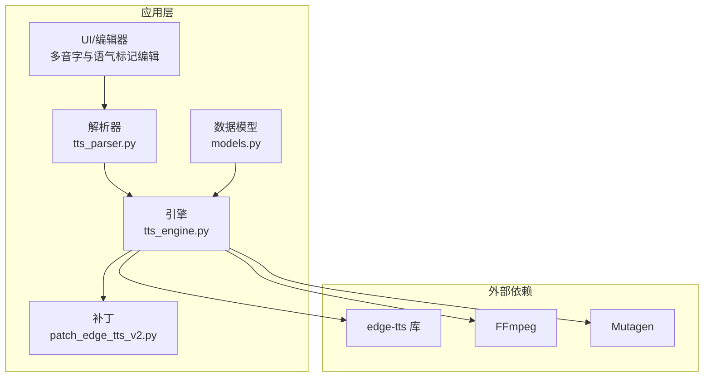
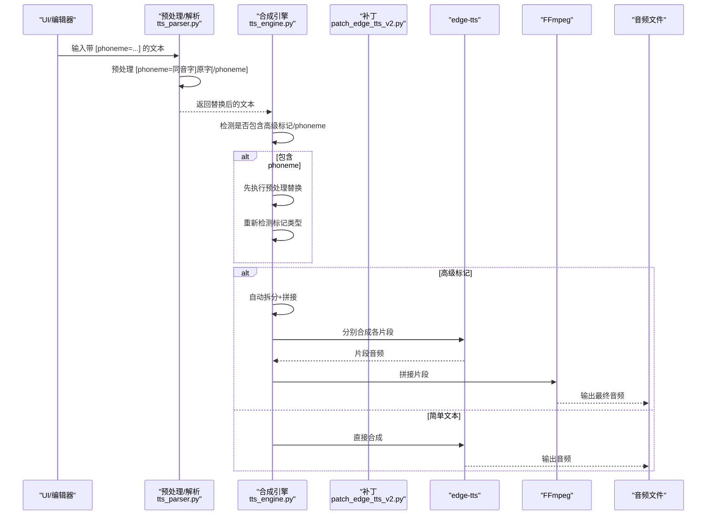
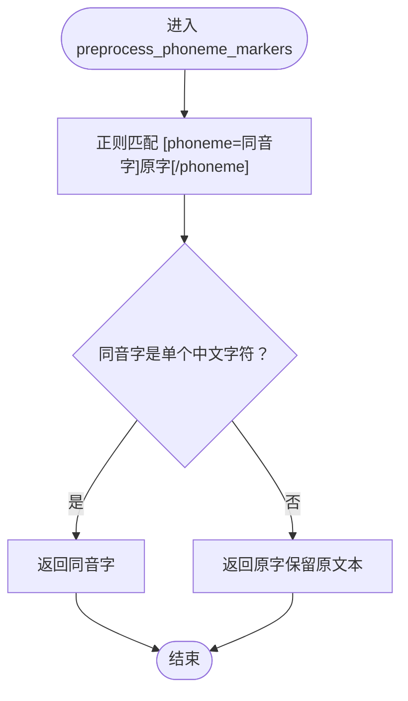
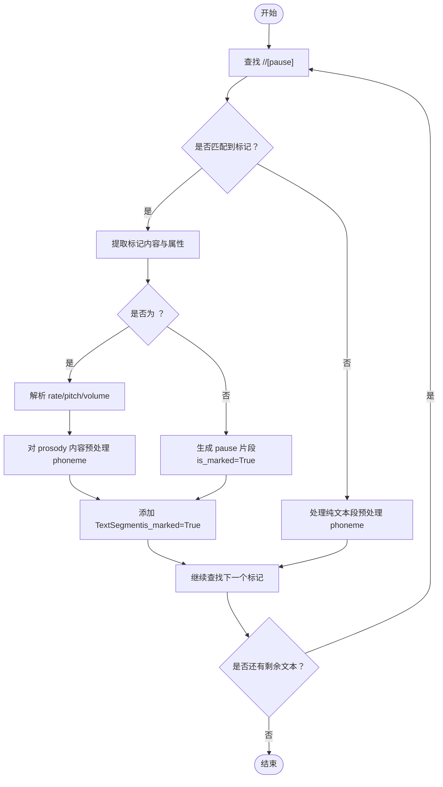
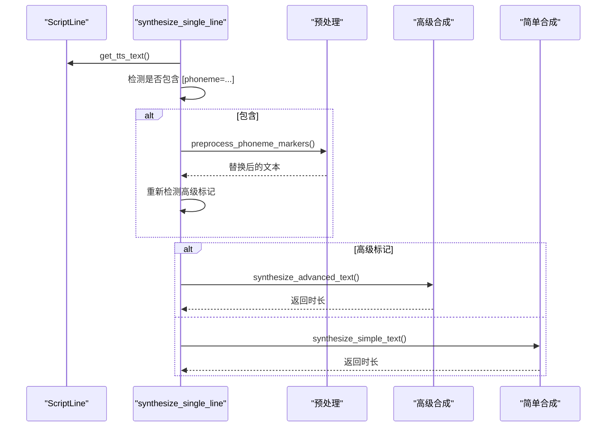
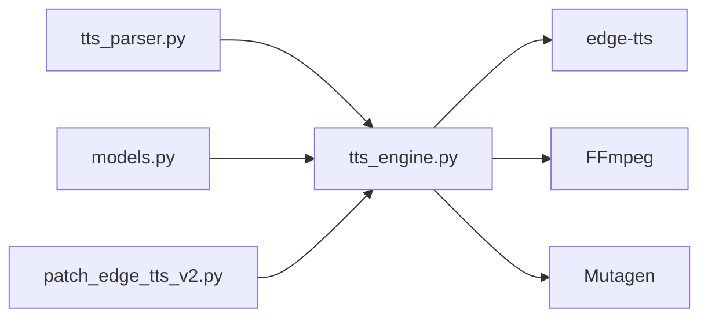

# 多音字处理机制

<cite>
**本文引用的文件**
- [tts_parser.py](file://app/tts_parser.py)
- [tts_engine.py](file://app/tts_engine.py)
- [models.py](file://app/models.py)
- [patch_edge_tts_v2.py](file://app/patch_edge_tts_v2.py)
- [MULTI_PRONUNCIATION_EDITOR_GUIDE.md](file://docs/MULTI_PRONUNCIATION_EDITOR_GUIDE.md)
- [test_phoneme_strategies.py](file://tests/test_phoneme_strategies.py)
- [test_phoneme_comparison.py](file://tests/test_phoneme_comparison.py)
- [test_phoneme_debug.py](file://tests/test_phoneme_debug.py)
- [test_ssml_before_split.py](file://tests/test_ssml_before_split.py)
- [EDGE_TTS_ADVANCED_MARKERS_GUIDE.md](file://docs/EDGE_TTS_ADVANCED_MARKERS_GUIDE.md)
</cite>

## 目录
1. [简介](#简介)
2. [项目结构](#项目结构)
3. [核心组件](#核心组件)
4. [架构总览](#架构总览)
5. [详细组件分析](#详细组件分析)
6. [依赖分析](#依赖分析)
7. [性能考量](#性能考量)
8. [故障排查指南](#故障排查指南)
9. [结论](#结论)
10. [附录](#附录)

## 简介
本文件系统性阐述 TTS Studio 的多音字处理机制，重点覆盖：
- 同音字自动检测与替换算法
- 上下文感知与候选字选择策略
- phoneme 标记预处理流程（含 preprocess_phoneme_markers 的实现原理与替换算法）
- 多音字控制策略（精确发音控制、语境依赖处理、用户自定义规则）
- 实际应用场景示例（古诗词、地名、人名等）
- 常见问题与性能优化建议

## 项目结构
围绕多音字处理，涉及的关键模块如下：
- 解析与预处理：app/tts_parser.py
- 引擎与合成：app/tts_engine.py
- 数据模型：app/models.py
- 辅助补丁：app/patch_edge_tts_v2.py
- 用户指南与策略：docs/MULTI_PRONUNCIATION_EDITOR_GUIDE.md、docs/EDGE_TTS_ADVANCED_MARKERS_GUIDE.md
- 测试与示例：tests/test_phoneme_strategies.py、tests/test_phoneme_comparison.py、tests/test_phoneme_debug.py、tests/test_ssml_before_split.py

图表来源
- [tts_parser.py:1-220](file://app/tts_parser.py#L1-L220)
- [tts_engine.py:1-547](file://app/tts_engine.py#L1-L547)
- [models.py:1-78](file://app/models.py#L1-L78)
- [patch_edge_tts_v2.py:1-117](file://app/patch_edge_tts_v2.py#L1-L117)

章节来源
- [tts_parser.py:1-220](file://app/tts_parser.py#L1-L220)
- [tts_engine.py:1-547](file://app/tts_engine.py#L1-L547)
- [models.py:1-78](file://app/models.py#L1-L78)
- [patch_edge_tts_v2.py:1-117](file://app/patch_edge_tts_v2.py#L1-L117)

## 核心组件
- 多音字预处理与替换：由 tts_parser.py 的 preprocess_phoneme_markers 实现，负责将 [phoneme=同音字]原字[/phoneme] 替换为同音字，确保后续 TTS 合成时按目标读音发音。
- 文本标记解析与分片：parse_prosody_text 将带标记的文本拆分为多个 TextSegment，支持 prosody、pause、phoneme 等标记；phoneme 标记在 prosody 内部被预处理替换，不参与分片。
- 引擎集成与合成：tts_engine.py 在检测到 phoneme 标记时，先执行预处理替换，再根据是否包含高级标记决定走“自动拆分+拼接”还是“简单合成”路径。
- 数据模型：models.py 的 ScriptLine 提供统一的文本来源接口 get_tts_text，保证引擎始终使用最新标记文本。
- 补丁支持：patch_edge_tts_v2.py 通过 Monkey Patch 让 edge-tts 支持自定义 SSML，从而实现更灵活的标记传递与合成。

章节来源
- [tts_parser.py:39-66](file://app/tts_parser.py#L39-L66)
- [tts_parser.py:69-182](file://app/tts_parser.py#L69-L182)
- [tts_engine.py:177-218](file://app/tts_engine.py#L177-L218)
- [models.py:48-61](file://app/models.py#L48-L61)
- [patch_edge_tts_v2.py:15-114](file://app/patch_edge_tts_v2.py#L15-L114)

## 架构总览
多音字处理在 TTS Studio 中的端到端流程如下：

图表来源
- [tts_parser.py:39-66](file://app/tts_parser.py#L39-L66)
- [tts_parser.py:69-182](file://app/tts_parser.py#L69-L182)
- [tts_engine.py:177-218](file://app/tts_engine.py#L177-L218)
- [tts_engine.py:321-453](file://app/tts_engine.py#L321-L453)
- [patch_edge_tts_v2.py:15-114](file://app/patch_edge_tts_v2.py#L15-L114)

## 详细组件分析

### 预处理与替换：preprocess_phoneme_markers
- 目标：将 [phoneme=同音字]原字[/phoneme] 替换为“同音字”，以便 edge-tts 按该字的标准读音合成。
- 算法要点：
  - 使用正则匹配 [phoneme=...] 块，捕获“同音字”和“原字”两部分。
  - 对“同音字”进行有效性校验（需为单个中文字符）。
  - 若合法，返回“同音字”；否则保留原文本并记录警告。
  - 该替换发生在解析前，确保后续 prosody 分片不会将 phoneme 内容再次拆分。
- 复杂度：O(n) 正则扫描与替换，n 为文本长度。

图表来源
- [tts_parser.py:39-66](file://app/tts_parser.py#L39-L66)

章节来源
- [tts_parser.py:39-66](file://app/tts_parser.py#L39-L66)

### 文本解析与分片：parse_prosody_text
- 目标：将带标记的文本拆分为多个 TextSegment，支持 prosody、pause、phoneme 等。
- 关键规则：
  - 使用正则一次性匹配 <prosody>、<pause>、[pause] 三种形式。
  - prosody 内部的 phoneme 标记先被预处理替换，不参与分片。
  - prosody 标签内的 rate/pitch/volume 属性被解析并注入到对应片段。
  - 纯文本段同样进行 phoneme 预处理。
- 复杂度：O(n) 正则扫描与分片，n 为文本长度。

图表来源
- [tts_parser.py:69-182](file://app/tts_parser.py#L69-L182)

章节来源
- [tts_parser.py:69-182](file://app/tts_parser.py#L69-L182)

### 引擎集成与控制：synthesize_single_line
- 目标：在合成入口处检测并处理 phoneme 标记，决定后续路径。
- 控制逻辑：
  - 检测是否包含 [phoneme=...]，若存在则先执行预处理替换。
  - 重新检测是否包含高级标记（<prosody>、<pause>、[pause]），决定走“自动拆分+拼接”还是“简单合成”。
  - 对于高级标记，调用 synthesize_advanced_text；否则调用 synthesize_simple_text。
- 与 models 的交互：通过 ScriptLine.get_tts_text 获取当前最新文本，确保包含最新标记。

图表来源
- [tts_engine.py:177-218](file://app/tts_engine.py#L177-L218)
- [models.py:48-61](file://app/models.py#L48-L61)

章节来源
- [tts_engine.py:177-218](file://app/tts_engine.py#L177-L218)
- [models.py:48-61](file://app/models.py#L48-L61)

### 多音字控制策略
- 策略一：同音字替换（推荐）
  - 将 [phoneme=同音字]原字[/phoneme] 替换为“同音字”，交由 edge-tts 按该字的标准读音合成。
  - 适合大多数场景，发音自然、连贯。
- 策略二：拼音策略（辅助）
  - 将 [phoneme=拼音声调]原字[/phoneme] 直接替换为拼音，用于精确控制声调。
  - 由于 edge-tts 不识别拼音标签，需配合预处理替换为拼音字符串。
- 策略三：上下文依赖与候选字选择
  - 对于“行”“长”“重”等常见多音字，结合上下文选择“银行/行长/重要/长长”等读音。
  - 通过 UI 编辑器提供的“多音字标注”功能，逐字标注并生成相应标记。
- 策略四：与语速/音调/停顿协同
  - 多音字标记可与 rate/pitch/pause 等标记嵌套使用，形成复合语气控制。

章节来源
- [test_phoneme_strategies.py:16-139](file://tests/test_phoneme_strategies.py#L16-L139)
- [MULTI_PRONUNCIATION_EDITOR_GUIDE.md:119-135](file://docs/MULTI_PRONUNCIATION_EDITOR_GUIDE.md#L119-L135)
- [EDGE_TTS_ADVANCED_MARKERS_GUIDE.md:687-740](file://docs/EDGE_TTS_ADVANCED_MARKERS_GUIDE.md#L687-L740)

### 典型应用场景
- 地名与机构名称
  - “银行行长”：将“行”标注为“航”，确保“银行/行长”的读音分别为 hang2 与 zhang3。
- 人名与古诗词
  - “重”字在“重要”中读 zhòng（第四声），在“重复”中读 chóng（第二声）；通过同音字“仲”或拼音“zhong4”控制。
- 复合语义与节奏
  - 将“长重的行李”中的“长/重/行”分别标注为“常/掌/航”，配合停顿与语速形成自然节奏。

章节来源
- [test_phoneme_comparison.py:27-104](file://tests/test_phoneme_comparison.py#L27-L104)
- [test_phoneme_strategies.py:81-98](file://tests/test_phoneme_strategies.py#L81-L98)

## 依赖分析
- 组件耦合
  - tts_engine 依赖 tts_parser 的预处理能力，确保 phoneme 标记在进入高级合成前已被替换。
  - models 的 ScriptLine 提供统一文本来源，避免引擎直接读取旧状态。
  - patch_edge_tts_v2 为底层依赖提供自定义 SSML 支持，间接支撑高级标记解析与合成。
- 外部依赖
  - edge-tts：负责实际语音合成。
  - FFmpeg：用于高级合成模式下的音频片段拼接。
  - Mutagen：用于读取音频时长。

图表来源
- [tts_parser.py:1-220](file://app/tts_parser.py#L1-L220)
- [tts_engine.py:1-547](file://app/tts_engine.py#L1-L547)
- [models.py:1-78](file://app/models.py#L1-L78)
- [patch_edge_tts_v2.py:1-117](file://app/patch_edge_tts_v2.py#L1-L117)

章节来源
- [tts_parser.py:1-220](file://app/tts_parser.py#L1-L220)
- [tts_engine.py:1-547](file://app/tts_engine.py#L1-L547)
- [models.py:1-78](file://app/models.py#L1-L78)
- [patch_edge_tts_v2.py:1-117](file://app/patch_edge_tts_v2.py#L1-L117)

## 性能考量
- 减少不必要的分片
  - phoneme 标记不参与分片，可显著降低片段数量，提升合成效率与自然度。
- 合理使用停顿
  - 过多细碎停顿会增加片段数与拼接开销；建议合并连续停顿或使用更少的停顿节点。
- 使用高效拼接
  - 采用 FFmpeg concat demuxer 进行拼接，避免 pydub 的额外转换成本。
- 预处理前置
  - 在进入高级合成前完成 phoneme 替换，避免重复扫描与替换。

章节来源
- [EDGE_TTS_ADVANCED_MARKERS_GUIDE.md:776-834](file://docs/EDGE_TTS_ADVANCED_MARKERS_GUIDE.md#L776-L834)

## 故障排查指南
- 症状：多音字未按预期读出
  - 检查 [phoneme=...] 格式是否正确，同音字是否为单个中文字符。
  - 确认引擎是否检测到 phoneme 标记并执行了预处理替换。
- 症状：高级标记未生效
  - 确认文本是否包含 <prosody>、<pause>、[pause] 等高级标记。
  - 检查是否走“高级合成”路径（自动拆分+拼接）。
- 症状：自定义 SSML 未被识别
  - 确认补丁是否成功加载，且文本以 <speak 开头。
- 症状：时长异常或文件损坏
  - 检查 FFmpeg 拼接命令与权限；确认临时文件清理逻辑是否执行。

章节来源
- [tts_parser.py:39-66](file://app/tts_parser.py#L39-L66)
- [tts_engine.py:177-218](file://app/tts_engine.py#L177-L218)
- [patch_edge_tts_v2.py:15-114](file://app/patch_edge_tts_v2.py#L15-L114)

## 结论
TTS Studio 的多音字处理通过“预处理替换 + 高级标记解析 + 自动拆分拼接”的组合，实现了对多音字的精确控制与自然合成。preprocess_phoneme_markers 作为核心预处理函数，确保 [phoneme=...] 标记在进入 TTS 合成前被安全替换；parse_prosody_text 将复杂标记文本拆分为可控片段；synthesize_single_line 则在引擎层面统一调度，保证流程稳定与性能最优。配合 UI 编辑器与测试用例，用户可以高效地标注与验证多音字读音，满足古诗词、地名、人名等多样化场景的需求。

## 附录
- 多音字策略与示例参考
  - [test_phoneme_strategies.py:16-139](file://tests/test_phoneme_strategies.py#L16-L139)
  - [test_phoneme_comparison.py:27-104](file://tests/test_phoneme_comparison.py#L27-L104)
  - [test_phoneme_debug.py:14-30](file://tests/test_phoneme_debug.py#L14-L30)
  - [test_ssml_before_split.py:16-47](file://tests/test_ssml_before_split.py#L16-L47)
- 用户指南与最佳实践
  - [MULTI_PRONUNCIATION_EDITOR_GUIDE.md:1-248](file://docs/MULTI_PRONUNCIATION_EDITOR_GUIDE.md#L1-L248)
  - [EDGE_TTS_ADVANCED_MARKERS_GUIDE.md:687-834](file://docs/EDGE_TTS_ADVANCED_MARKERS_GUIDE.md#L687-L834)