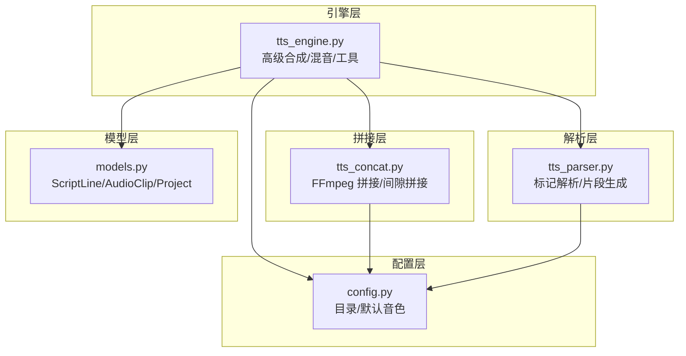
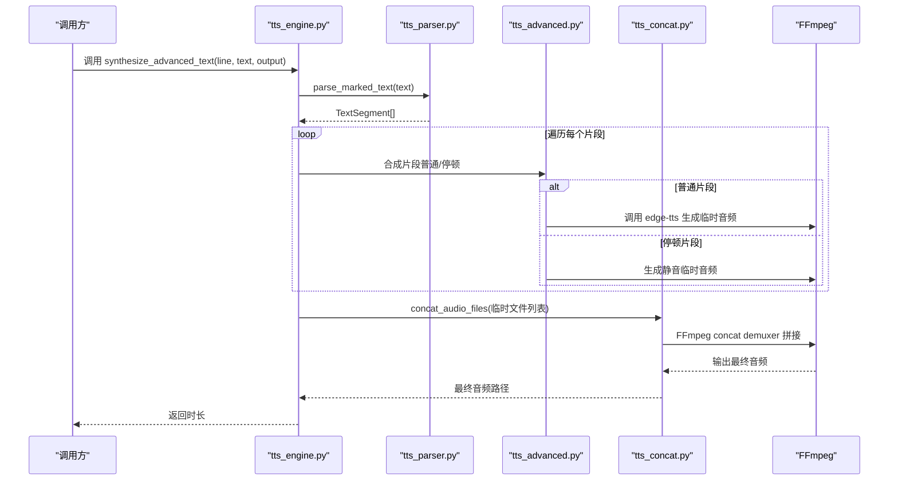
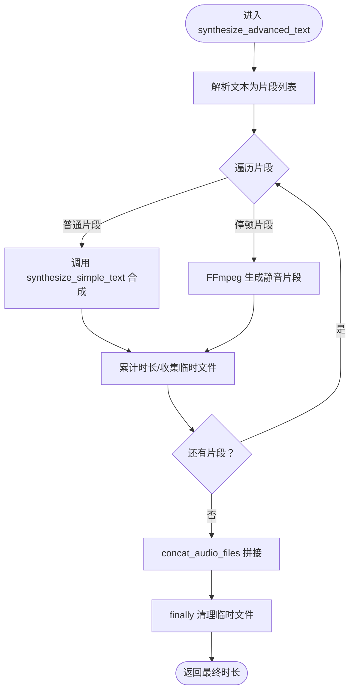
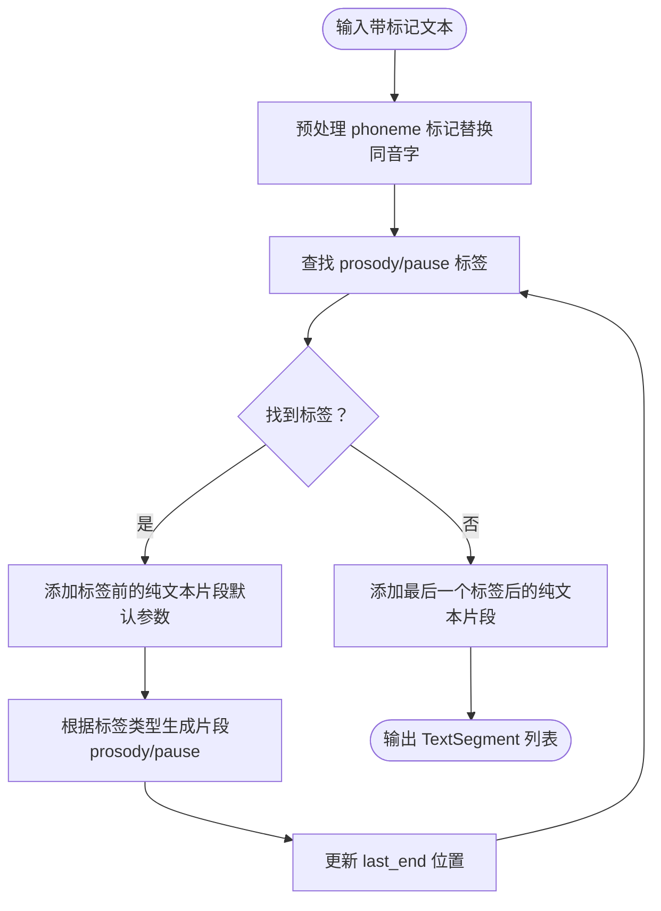
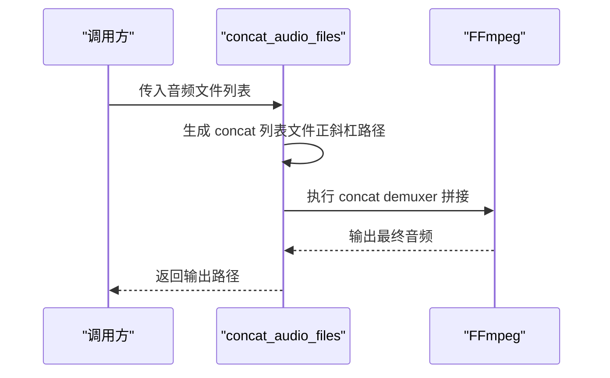
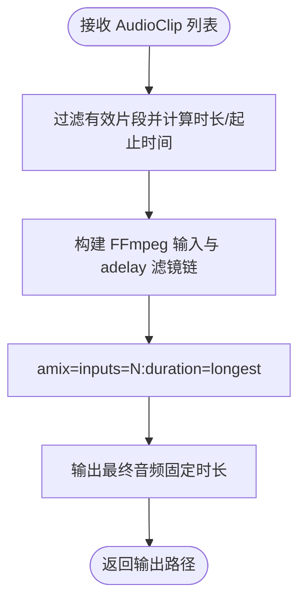
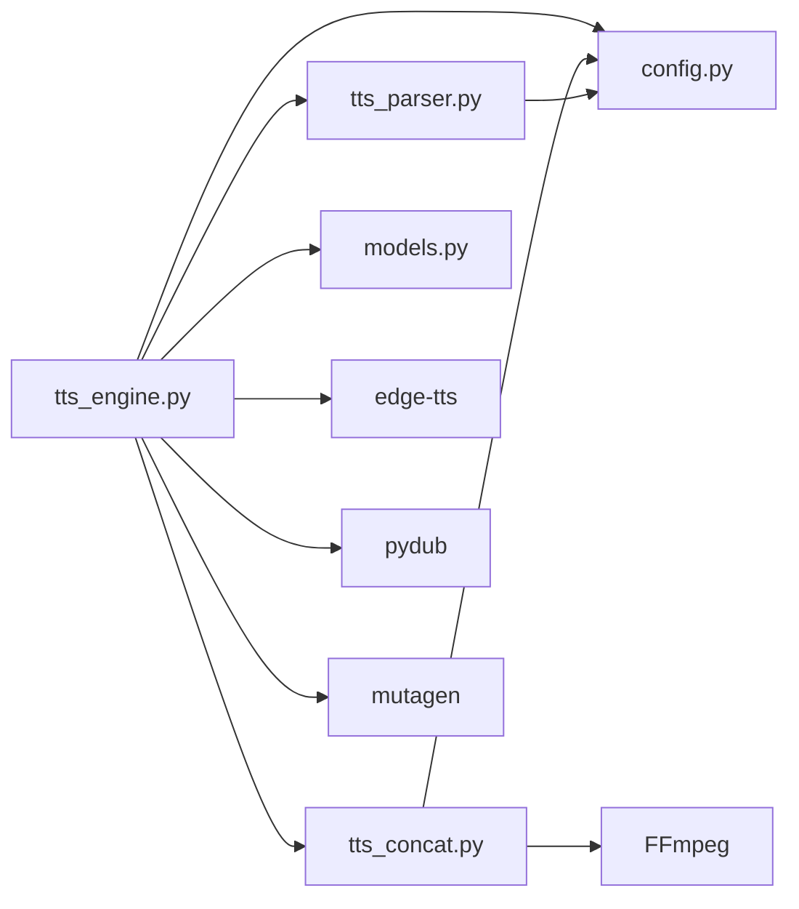

# 音频分段与混音

<cite>
**本文引用的文件**
- [app/tts_engine.py](file://app/tts_engine.py)
- [app/tts_advanced.py](file://app/tts_advanced.py)
- [app/tts_parser.py](file://app/tts_parser.py)
- [app/tts_concat.py](file://app/tts_concat.py)
- [app/models.py](file://app/models.py)
- [app/config.py](file://app/config.py)
- [demo_complex.py](file://demo_complex.py)
- [tests/test_advanced_tts.py](file://tests/test_advanced_tts.py)
- [tests/test_advanced_features.py](file://tests/test_advanced_features.py)
</cite>

## 目录
1. [简介](#简介)
2. [项目结构](#项目结构)
3. [核心组件](#核心组件)
4. [架构总览](#架构总览)
5. [详细组件分析](#详细组件分析)
6. [依赖关系分析](#依赖关系分析)
7. [性能考量](#性能考量)
8. [故障排查指南](#故障排查指南)
9. [结论](#结论)
10. [附录](#附录)

## 简介
本文件面向 TTS Studio 的音频分段与混音能力，围绕以下目标展开：
- 详解 synthesize_advanced_text 的工作流程：文本解析、片段合成、文件拼接
- 深入解析 parse_marked_text 的分段算法：标记识别、片段分割、参数继承
- 说明 mix_audio_tracks 的混音实现：FFmpeg 命令行、amix 滤镜、时间轴同步
- 描述临时文件管理与清理机制：资源释放、错误恢复策略
- 提供实际音频处理示例：多轨混音、静音生成、测试音创建

## 项目结构
本项目采用模块化设计，围绕 TTS 引擎、解析器、拼接器与混音器四个核心模块组织：
- 引擎层：负责高级文本合成、混音与辅助工具
- 解析层：负责标记解析与片段生成
- 拼接层：负责音频片段拼接（含 FFmpeg）
- 模型层：定义数据结构（脚本行、音频片段、项目）
- 配置层：统一管理目录与默认音色

图表来源
- [app/tts_engine.py:1-547](file://app/tts_engine.py#L1-L547)
- [app/tts_parser.py:1-220](file://app/tts_parser.py#L1-L220)
- [app/tts_concat.py:1-159](file://app/tts_concat.py#L1-L159)
- [app/models.py:1-78](file://app/models.py#L1-L78)
- [app/config.py:1-74](file://app/config.py#L1-L74)

章节来源
- [app/tts_engine.py:1-547](file://app/tts_engine.py#L1-L547)
- [app/tts_parser.py:1-220](file://app/tts_parser.py#L1-L220)
- [app/tts_concat.py:1-159](file://app/tts_concat.py#L1-L159)
- [app/models.py:1-78](file://app/models.py#L1-L78)
- [app/config.py:1-74](file://app/config.py#L1-L74)

## 核心组件
- 高级文本合成引擎：合成高级标记文本，自动拆分、逐段合成、拼接输出
- 标记解析器：识别 prosody/pause/phoneme 等标记，生成 TextSegment 列表
- 音频拼接器：基于 FFmpeg 的 concat demuxer 拼接，支持列表文件与路径规范化
- 混音器：基于 FFmpeg 的 amix 滤镜与 adelay，实现多轨时间轴同步混音
- 辅助工具：静音生成、测试音生成、时长估算与重试机制

章节来源
- [app/tts_engine.py:321-453](file://app/tts_engine.py#L321-L453)
- [app/tts_parser.py:23-220](file://app/tts_parser.py#L23-L220)
- [app/tts_concat.py:17-91](file://app/tts_concat.py#L17-L91)
- [app/tts_engine.py:454-547](file://app/tts_engine.py#L454-L547)

## 架构总览
高级文本合成的整体流程如下：
- 输入文本经预处理（phoneme 替换）后，由解析器拆分为多个片段
- 每个片段独立合成（普通片段走 edge-tts，停顿片段走 FFmpeg 生成静音）
- 合成完成后，使用 FFmpeg concat demuxer 拼接为最终音频
- 混音阶段，按时间轴对齐各轨道，使用 amix 滤镜进行多轨混合

图表来源
- [app/tts_engine.py:321-453](file://app/tts_engine.py#L321-L453)
- [app/tts_parser.py:216-220](file://app/tts_parser.py#L216-L220)
- [app/tts_advanced.py:112-290](file://app/tts_advanced.py#L112-L290)
- [app/tts_concat.py:17-91](file://app/tts_concat.py#L17-L91)

## 详细组件分析

### 组件一：高级文本合成（synthesize_advanced_text）
- 输入：ScriptLine、处理后的文本、输出路径、最大重试次数
- 主要步骤：
  1) 解析文本为 TextSegment 列表（继承默认语速/音调）
  2) 逐段合成：普通片段调用 synthesize_simple_text；停顿片段用 FFmpeg 生成静音
  3) 拼接：调用 concat_audio_files 使用 FFmpeg concat demuxer
  4) 清理：finally 中删除所有临时文件
- 关键点：
  - 停顿片段通过 FFmpeg 的 anullsrc 生成指定时长的静音
  - 拼接使用 concat 列表文件，路径规范化为正斜杠
  - 时长获取：优先使用 mutagen，失败则估算

图表来源
- [app/tts_engine.py:321-453](file://app/tts_engine.py#L321-L453)
- [app/tts_advanced.py:112-290](file://app/tts_advanced.py#L112-L290)
- [app/tts_concat.py:17-91](file://app/tts_concat.py#L17-L91)

章节来源
- [app/tts_engine.py:321-453](file://app/tts_engine.py#L321-L453)
- [app/tts_advanced.py:112-290](file://app/tts_advanced.py#L112-L290)
- [app/tts_concat.py:17-91](file://app/tts_concat.py#L17-L91)

### 组件二：标记解析（parse_marked_text 与 parse_prosody_text）
- 支持的标记：
  - prosody：rate、pitch、volume
  - pause：停顿（毫秒）
  - phoneme：多音字替换（预处理阶段）
- 解析规则：
  - 以 prosody 标签为边界切分，每个 prosody 为独立片段
  - prosody 内部的 phoneme 标记先替换为同音字，再作为片段文本
  - prosody 前后的纯文本也作为片段（默认参数）
  - pause 生成独立的暂停片段（segment_type='pause'）
- 参数继承：
  - prosody 标签内的 rate/pitch/volume 作为该片段的默认参数
  - prosody 前后纯文本片段使用默认参数
- 输出：TextSegment 列表，包含 text、rate、pitch、volume、is_marked、segment_type

图表来源
- [app/tts_parser.py:39-220](file://app/tts_parser.py#L39-L220)

章节来源
- [app/tts_parser.py:23-220](file://app/tts_parser.py#L23-L220)

### 组件三：音频拼接（concat_audio_files 与 merge_audio_with_gaps）
- concat_audio_files：
  - 生成 concat 列表文件，路径使用正斜杠
  - 调用 FFmpeg concat demuxer，直接复制流（不重新编码）
  - 清理临时列表文件
- merge_audio_with_gaps：
  - 使用 pydub（AudioSegment）逐段叠加
  - 在相邻片段间插入指定时长的静音间隙
  - 导出最终 MP3

图表来源
- [app/tts_concat.py:17-91](file://app/tts_concat.py#L17-L91)

章节来源
- [app/tts_concat.py:17-91](file://app/tts_concat.py#L17-L91)
- [app/tts_concat.py:106-159](file://app/tts_concat.py#L106-L159)

### 组件四：多轨混音（mix_audio_tracks）
- 输入：AudioClip 列表（含起始时间、音色、语速、音调等）
- 时间轴同步：
  - 计算每个片段的起止时间（毫秒）
  - 使用 adelay 滤镜为每个轨道添加延迟，实现时间对齐
- 混音策略：
  - 使用 amix 滤镜进行多轨混合，duration=longest
  - 输出为单一音频流
- 时长控制：
  - 若未指定总时长，自动取最大结束时间
  - 为避免截断，额外增加 0.5 秒余量

图表来源
- [app/tts_engine.py:454-534](file://app/tts_engine.py#L454-L534)

章节来源
- [app/tts_engine.py:454-534](file://app/tts_engine.py#L454-L534)

### 组件五：临时文件管理与清理
- 生成的临时文件：
  - 各片段合成的临时 MP3
  - FFmpeg concat 列表文件
- 清理策略：
  - 合成流程中，finally 块中逐一删除临时文件
  - 拼接流程中，finally 块中删除 concat 列表文件
- 错误恢复：
  - 合成阶段：对每个片段进行指数回退重试
  - 拼接阶段：捕获 FFmpeg 返回码，失败时记录错误并抛出异常
  - 混音阶段：捕获 FFmpeg 返回码，失败时记录错误并抛出异常

章节来源
- [app/tts_advanced.py:158-290](file://app/tts_advanced.py#L158-L290)
- [app/tts_concat.py:47-90](file://app/tts_concat.py#L47-L90)
- [app/tts_engine.py:454-534](file://app/tts_engine.py#L454-L534)

## 依赖关系分析
- 模块耦合：
  - tts_engine 依赖 tts_parser、tts_concat、models、config
  - tts_advanced 依赖 tts_parser、config、mutagen、subprocess
  - tts_concat 依赖 config、subprocess
- 外部依赖：
  - FFmpeg：用于静音生成、拼接、混音
  - edge-tts：用于文本片段合成
  - pydub：用于合并音频与生成测试音
  - mutagen：用于读取 MP3 时长

图表来源
- [app/tts_engine.py:1-547](file://app/tts_engine.py#L1-L547)
- [app/tts_parser.py:1-220](file://app/tts_parser.py#L1-L220)
- [app/tts_concat.py:1-159](file://app/tts_concat.py#L1-L159)
- [app/models.py:1-78](file://app/models.py#L1-L78)
- [app/config.py:1-74](file://app/config.py#L1-L74)

章节来源
- [app/tts_engine.py:1-547](file://app/tts_engine.py#L1-L547)
- [app/tts_parser.py:1-220](file://app/tts_parser.py#L1-L220)
- [app/tts_concat.py:1-159](file://app/tts_concat.py#L1-L159)
- [app/models.py:1-78](file://app/models.py#L1-L78)
- [app/config.py:1-74](file://app/config.py#L1-L74)

## 性能考量
- 合成阶段：
  - 指数回退重试减少瞬时压力，避免频繁失败导致的资源浪费
  - 对每个片段独立合成，便于并行优化（当前为串行，可考虑并发队列）
- 拼接阶段：
  - concat demuxer 直接复制流，避免解码/重编码，性能最优
  - 列表文件路径规范化为正斜杠，提升跨平台兼容性
- 混音阶段：
  - amix 滤镜适合多轨混合，但会引入额外 CPU 占用
  - adelay 滤镜按轨道延迟，避免额外的音频重采样
- I/O 与磁盘：
  - 临时文件集中清理，避免残留占用空间
  - 输出目录提前创建，减少运行时 IO 异常

[本节为通用性能讨论，无需特定文件来源]

## 故障排查指南
- 合成失败（edge-tts）：
  - 检查代理配置（HTTP_PROXY/https_proxy）
  - 查看重试日志，确认网络可达性
  - 403 错误通常与网络限制相关
- 拼接失败（FFmpeg）：
  - 确认 ffmpeg.exe 可执行且路径正确
  - 检查 concat 列表文件是否生成与权限
  - 确认输入音频均为 MP3 且可读
- 混音失败（FFmpeg）：
  - 检查 amix 滤镜参数与轨道数量
  - 确认轨道起始时间与总时长设置合理
- 时长不一致：
  - 使用 mutagen 读取时长，若缺失则使用估算
  - 混音时增加 0.5 秒余量，避免截断

章节来源
- [app/tts_engine.py:255-318](file://app/tts_engine.py#L255-L318)
- [app/tts_concat.py:67-88](file://app/tts_concat.py#L67-L88)
- [app/tts_engine.py:520-534](file://app/tts_engine.py#L520-L534)

## 结论
本系统通过“标记解析 + 片段合成 + FFmpeg 拼接”的组合，实现了灵活的高级 TTS 文本处理与多轨混音能力。parse_marked_text 提供了稳定的分段与参数继承机制，synthesize_advanced_text 将其与 edge-tts 合成、静音生成与 FFmpeg 拼接无缝衔接。mix_audio_tracks 则利用 amix 与 adelay 实现精确的时间轴同步混音。配合完善的临时文件管理与错误恢复策略，整体具备良好的稳定性与可维护性。

[本节为总结，无需特定文件来源]

## 附录

### 实际使用示例

- 多轨混音
  - 准备多个 AudioClip，设置不同的 start_time 与音色参数
  - 调用 mix_audio_tracks，系统自动按时间轴对齐并混合
  - 可通过 total_duration 控制输出总时长

- 静音生成
  - 使用 generate_silence(duration_sec) 生成指定时长的静音文件
  - 适用于占位或在混音中插入停顿

- 测试音创建
  - 使用 generate_tone(freq, duration_sec) 生成指定频率与时长的测试音
  - 适用于音效占位或调试

- 高级文本合成示例
  - 使用 demo_complex.py 中的示例文本，验证 phoneme、pause、prosody 的组合效果
  - 通过 tests/test_advanced_tts.py 与 tests/test_advanced_features.py 验证解析与合成流程

章节来源
- [app/tts_engine.py:536-547](file://app/tts_engine.py#L536-L547)
- [demo_complex.py:1-239](file://demo_complex.py#L1-L239)
- [tests/test_advanced_tts.py:1-110](file://tests/test_advanced_tts.py#L1-L110)
- [tests/test_advanced_features.py:1-101](file://tests/test_advanced_features.py#L1-L101)