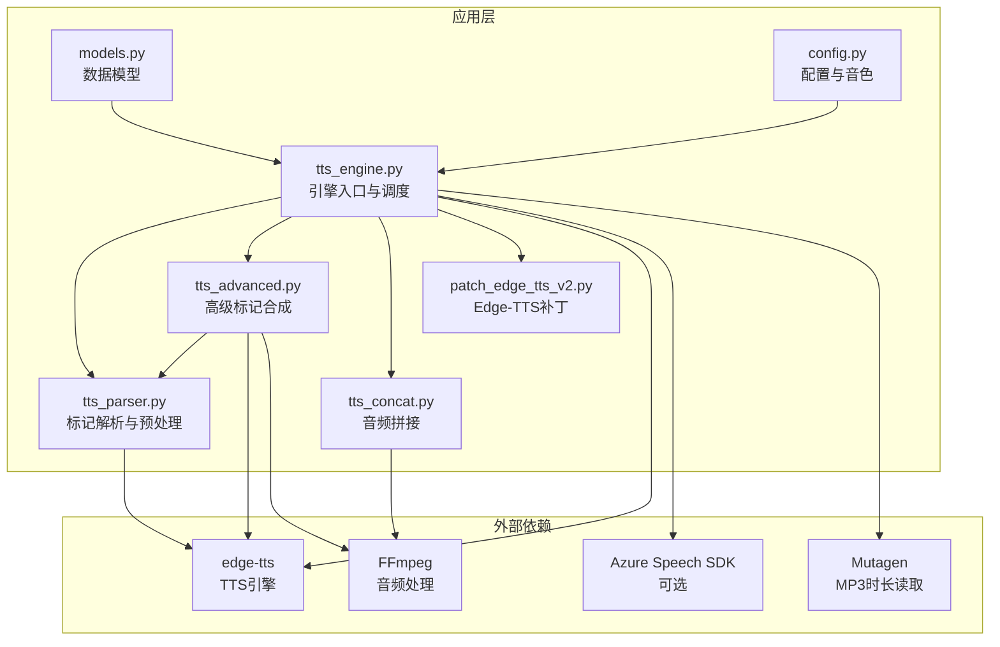
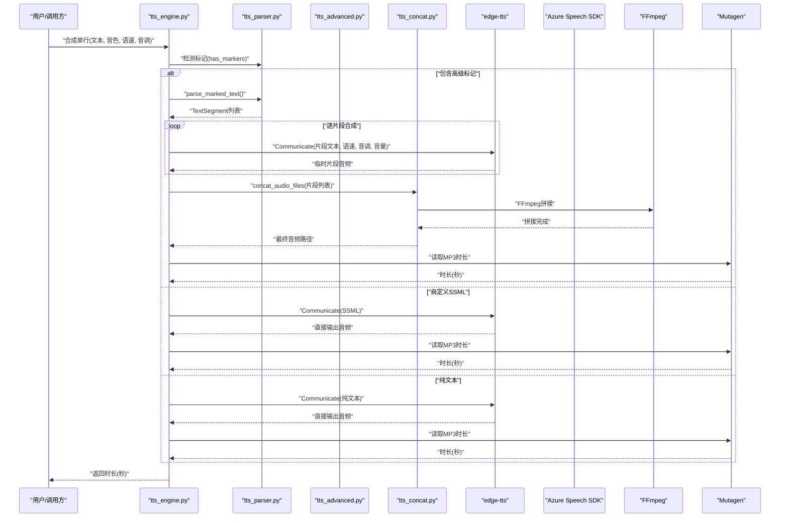
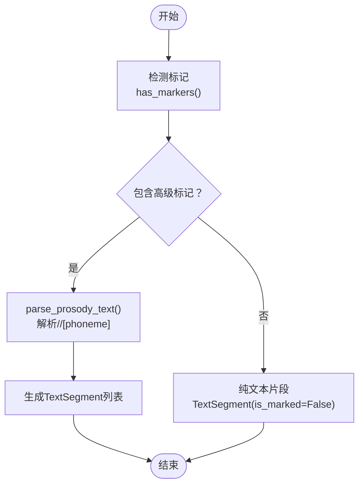
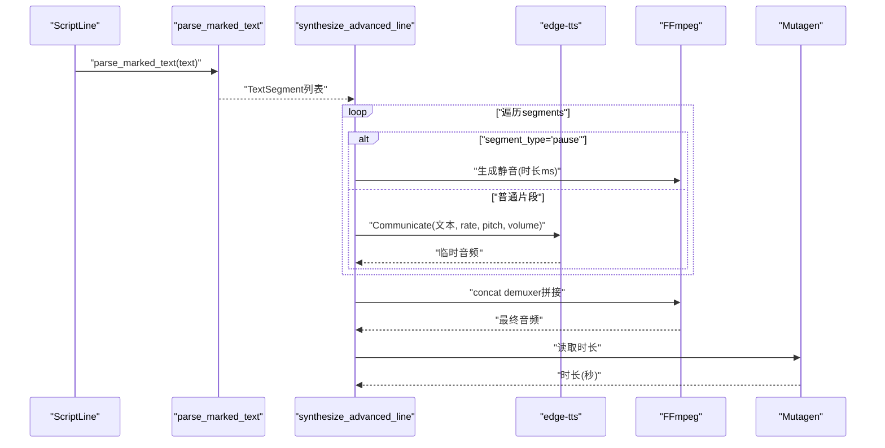
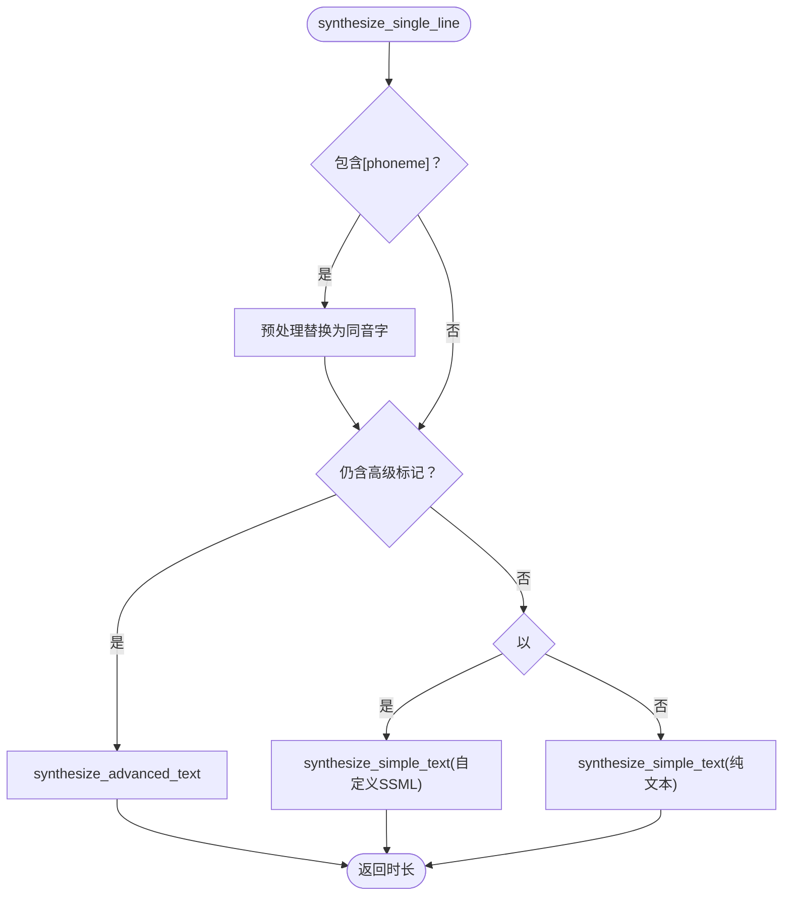
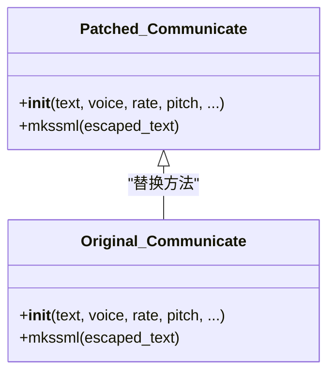
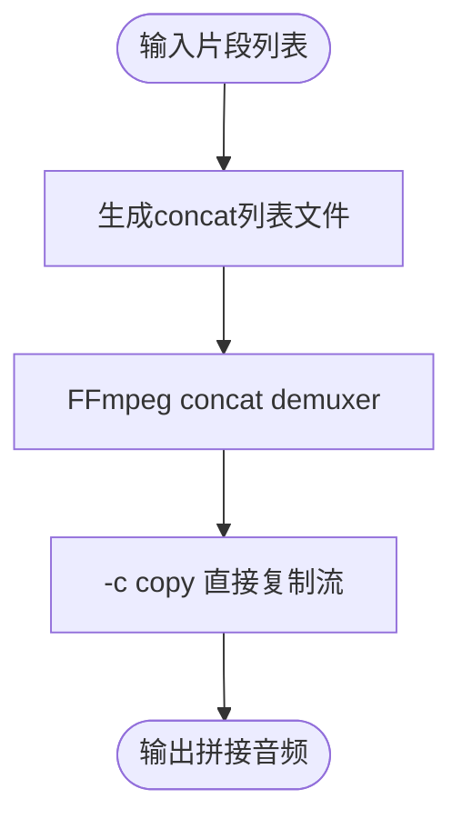
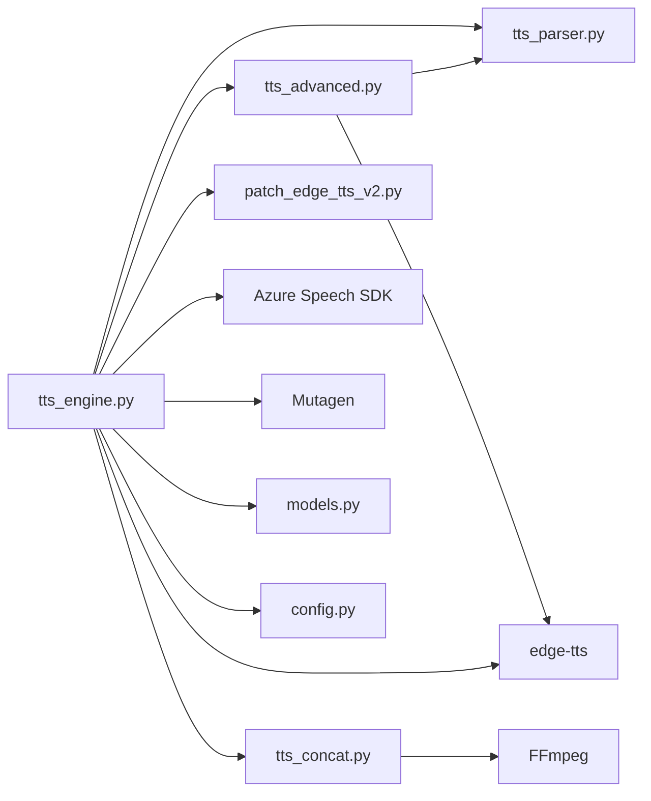

# 高级TTS合成引擎

<cite>
**本文引用的文件**
- [app/tts_engine.py](file://app/tts_engine.py)
- [app/tts_advanced.py](file://app/tts_advanced.py)
- [app/tts_parser.py](file://app/tts_parser.py)
- [app/tts_concat.py](file://app/tts_concat.py)
- [app/patch_edge_tts_v2.py](file://app/patch_edge_tts_v2.py)
- [app/models.py](file://app/models.py)
- [app/config.py](file://app/config.py)
- [demo_complex.py](file://demo_complex.py)
- [tests/test_advanced_tts_e2e.py](file://tests/test_advanced_tts_e2e.py)
- [tests/test_tts_engine_ssml.py](file://tests/test_tts_engine_ssml.py)
- [tests/test_advanced_ssml.py](file://tests/test_advanced_ssml.py)
- [docs/EDGE_TTS_ADVANCED_MARKERS_GUIDE.md](file://docs/EDGE_TTS_ADVANCED_MARKERS_GUIDE.md)
- [docs/ADVANCED_TTS_GUIDE.md](file://docs/ADVANCED_TTS_GUIDE.md)
- [requirements.txt](file://requirements.txt)
</cite>

## 目录
1. [简介](#简介)
2. [项目结构](#项目结构)
3. [核心组件](#核心组件)
4. [架构总览](#架构总览)
5. [详细组件分析](#详细组件分析)
6. [依赖关系分析](#依赖关系分析)
7. [性能考量](#性能考量)
8. [故障排查指南](#故障排查指南)
9. [结论](#结论)
10. [附录](#附录)

## 简介
本文件面向TTS Studio的高级TTS合成引擎，系统化阐述基础TTS功能的实现原理与扩展能力，包括文本预处理、语音合成与音频生成流程；深入解释SSML标记语法支持，涵盖prosody标签（语速、音调、音量控制）、pause停顿标记与phoneme多音字替换机制；总结多音字处理策略（同音字自动检测、精确控制方法与替换算法）；说明Azure Speech Service集成选项与Edge TTS补丁机制；并通过丰富的测试与示例路径帮助读者掌握参数配置、标记嵌套与组合使用技巧。

## 项目结构
TTS Studio采用模块化设计，围绕“解析-合成-拼接-输出”的流水线组织代码，关键模块如下：
- 引擎入口与调度：tts_engine.py
- 高级标记解析与合成：tts_parser.py、tts_advanced.py
- 音频拼接与混音：tts_concat.py
- Edge-TTS补丁：patch_edge_tts_v2.py
- 数据模型与配置：models.py、config.py
- 示例与测试：demo_complex.py、tests/*、docs/*

**图表来源**
- [app/tts_engine.py:1-547](file://app/tts_engine.py#L1-547)
- [app/tts_advanced.py:1-290](file://app/tts_advanced.py#L1-290)
- [app/tts_parser.py:1-220](file://app/tts_parser.py#L1-220)
- [app/tts_concat.py:1-159](file://app/tts_concat.py#L1-159)
- [app/patch_edge_tts_v2.py:1-117](file://app/patch_edge_tts_v2.py#L1-117)
- [app/models.py:1-78](file://app/models.py#L1-78)
- [app/config.py:1-74](file://app/config.py#L1-74)

**章节来源**
- [app/tts_engine.py:1-547](file://app/tts_engine.py#L1-547)
- [app/tts_advanced.py:1-290](file://app/tts_advanced.py#L1-290)
- [app/tts_parser.py:1-220](file://app/tts_parser.py#L1-220)
- [app/tts_concat.py:1-159](file://app/tts_concat.py#L1-159)
- [app/patch_edge_tts_v2.py:1-117](file://app/patch_edge_tts_v2.py#L1-117)
- [app/models.py:1-78](file://app/models.py#L1-78)
- [app/config.py:1-74](file://app/config.py#L1-74)

## 核心组件
- 文本预处理与标记解析
  - tts_parser.py负责解析<prosody>、<pause>、[pause]与[phoneme]等标记，生成TextSegment序列；同时提供phoneme预处理，将多音字替换为同音字，确保edge-tts按预期发音。
- 高级合成与自动拆分
  - tts_advanced.py实现“自动拆分+拼接”：将包含多个语气变化的文本拆分为若干片段，分别合成后使用FFmpeg拼接，支持pause停顿与音量控制。
- 引擎入口与调度
  - tts_engine.py统一调度：根据输入文本类型（纯文本、自定义SSML、高级标记文本）选择对应合成路径；支持Azure Speech Service与Edge-TTS双栈；内置重试与时长估算。
- Edge-TTS补丁
  - patch_edge_tts_v2.py通过Monkey Patch让edge-tts接受自定义SSML，避免官方库对<break>、<phoneme>等标签的限制。
- 音频拼接与混音
  - tts_concat.py提供基于FFmpeg concat demuxer的拼接能力，以及带间隙的拼接与基于adelay的多轨混合（混音）。
- 数据模型与配置
  - models.py定义ScriptLine、AudioClip、Character等核心数据结构；config.py管理音色、默认参数与目录结构。

**章节来源**
- [app/tts_parser.py:23-182](file://app/tts_parser.py#L23-L182)
- [app/tts_advanced.py:22-290](file://app/tts_advanced.py#L22-L290)
- [app/tts_engine.py:31-453](file://app/tts_engine.py#L31-L453)
- [app/patch_edge_tts_v2.py:15-117](file://app/patch_edge_tts_v2.py#L15-L117)
- [app/tts_concat.py:17-159](file://app/tts_concat.py#L17-L159)
- [app/models.py:37-61](file://app/models.py#L37-L61)
- [app/config.py:29-58](file://app/config.py#L29-L58)

## 架构总览
下图展示了从用户输入到最终音频输出的端到端流程，包括三种主要路径：纯文本、自定义SSML与高级标记文本（自动拆分+拼接）。

**图表来源**
- [app/tts_engine.py:120-453](file://app/tts_engine.py#L120-L453)
- [app/tts_parser.py:69-182](file://app/tts_parser.py#L69-L182)
- [app/tts_advanced.py:112-290](file://app/tts_advanced.py#L112-L290)
- [app/tts_concat.py:17-90](file://app/tts_concat.py#L17-L90)

**章节来源**
- [app/tts_engine.py:120-453](file://app/tts_engine.py#L120-L453)
- [app/tts_parser.py:69-182](file://app/tts_parser.py#L69-L182)
- [app/tts_advanced.py:112-290](file://app/tts_advanced.py#L112-L290)
- [app/tts_concat.py:17-90](file://app/tts_concat.py#L17-L90)

## 详细组件分析

### 文本预处理与标记解析（tts_parser.py）
- TextSegment数据结构：text、rate、pitch、volume、is_marked、segment_type，用于承载解析后的片段信息。
- 标记解析规则：
  - <prosody rate="X" pitch="Y" volume="Z">内容</prosody>：独立片段，属性继承自prosody。
  - <pause=X> 与 [pause=X]：停顿片段，segment_type='pause'，时长以毫秒存储。
  - [phoneme=同音字]原字[/phoneme]：在prosody内部进行替换，不打断分片。
- 预处理phoneme：将多音字替换为同音字，确保edge-tts按预期发音。
- 辅助函数：needs_splitting、count_segments、has_markers等，便于上层判断是否需要拆分。

**图表来源**
- [app/tts_parser.py:39-182](file://app/tts_parser.py#L39-L182)

**章节来源**
- [app/tts_parser.py:23-182](file://app/tts_parser.py#L23-L182)

### 高级合成与自动拆分（tts_advanced.py）
- parse_rate_pitch_from_text：解析{rate=...}、{pitch=...}、{style=...}与{pause=...}等内部标记，返回(文本, rate, pitch)元组列表。
- synthesize_text_segment：对单个片段进行edge-tts合成并返回时长。
- synthesize_advanced_line：核心流程
  - 解析文本为segments；
  - 对pause片段使用FFmpeg生成静音；
  - 对普通片段调用edge-tts合成；
  - 使用FFmpeg concat demuxer拼接所有片段；
  - 返回最终时长。

**图表来源**
- [app/tts_advanced.py:22-290](file://app/tts_advanced.py#L22-L290)

**章节来源**
- [app/tts_advanced.py:22-290](file://app/tts_advanced.py#L22-L290)

### 引擎入口与调度（tts_engine.py）
- synthesize_single_line：统一入口
  - 检测是否包含phoneme、高级标记或自定义SSML；
  - 若存在phoneme，先预处理替换，再决定是否拆分；
  - 选择synthesize_simple_text或synthesize_advanced_text；
  - 支持use_azure参数切换Azure Speech Service。
- synthesize_simple_text：edge-tts原生逻辑，支持代理、重试与时长估算。
- synthesize_with_azure：Azure Speech SDK合成，支持重试与时长读取。
- mix_audio_tracks：基于FFmpeg的多轨混合（adelay+amix），支持总时长裁剪与静音占位。

**图表来源**
- [app/tts_engine.py:120-218](file://app/tts_engine.py#L120-L218)

**章节来源**
- [app/tts_engine.py:120-453](file://app/tts_engine.py#L120-L453)

### Edge-TTS补丁机制（patch_edge_tts_v2.py）
- 通过Monkey Patch替换edge_tts.communicate.Communicate.__init__与mkssml，使edge-tts能接受自定义SSML而不进行二次转义或包装。
- 关键点：
  - 检测text是否以<speak开头，若是则保持原样；
  - 避免对自定义SSML重复转义；
  - 保持TTSConfig与超时等其他初始化逻辑不变。

**图表来源**
- [app/patch_edge_tts_v2.py:15-117](file://app/patch_edge_tts_v2.py#L15-L117)

**章节来源**
- [app/patch_edge_tts_v2.py:1-117](file://app/patch_edge_tts_v2.py#L1-L117)

### 音频拼接与混音（tts_concat.py）
- concat_audio_files：使用FFmpeg concat demuxer拼接多个音频文件，避免依赖ffprobe。
- merge_audio_with_gaps：在片段间插入静音间隙，适合简单拼接场景。
- mix_audio_tracks：基于adelay延迟与amix混合，支持多轨对齐与总时长裁剪。

**图表来源**
- [app/tts_concat.py:17-90](file://app/tts_concat.py#L17-L90)

**章节来源**
- [app/tts_concat.py:17-159](file://app/tts_concat.py#L17-L159)

### 数据模型与配置（models.py、config.py）
- ScriptLine：剧本行数据结构，提供get_tts_text()优先使用ssml_text（若非空）。
- AudioClip：音频片段，支持音色、语速、音调、起始时间与是否已生成等字段。
- Character：角色定义，包含音色ID与默认语速/音调/音量。
- config.py：音色选项、默认音色、数据目录与Docker环境适配。

**章节来源**
- [app/models.py:37-61](file://app/models.py#L37-L61)
- [app/config.py:29-58](file://app/config.py#L29-L58)

## 依赖关系分析
- 外部依赖
  - edge-tts：核心TTS引擎，支持语速、音调、音量参数与SSML（经补丁支持自定义SSML）。
  - Azure Speech SDK：可选，提供完整SSML支持与更丰富的语音资源。
  - FFmpeg：音频拼接与静音生成。
  - Mutagen：读取MP3时长。
- 内部模块耦合
  - tts_engine.py依赖tts_parser.py、tts_advanced.py、tts_concat.py与patch_edge_tts_v2.py。
  - tts_advanced.py依赖tts_parser.py与edge-tts。
  - tts_concat.py独立于其他模块，仅依赖FFmpeg。
  - models.py与config.py为通用支撑模块。

**图表来源**
- [app/tts_engine.py:1-547](file://app/tts_engine.py#L1-L547)
- [app/tts_advanced.py:1-290](file://app/tts_advanced.py#L1-290)
- [app/tts_parser.py:1-220](file://app/tts_parser.py#L1-220)
- [app/tts_concat.py:1-159](file://app/tts_concat.py#L1-159)
- [app/patch_edge_tts_v2.py:1-117](file://app/patch_edge_tts_v2.py#L1-117)
- [app/models.py:1-78](file://app/models.py#L1-78)
- [app/config.py:1-74](file://app/config.py#L1-74)

**章节来源**
- [app/tts_engine.py:1-547](file://app/tts_engine.py#L1-L547)
- [app/tts_advanced.py:1-290](file://app/tts_advanced.py#L1-290)
- [app/tts_parser.py:1-220](file://app/tts_parser.py#L1-220)
- [app/tts_concat.py:1-159](file://app/tts_concat.py#L1-159)
- [app/patch_edge_tts_v2.py:1-117](file://app/patch_edge_tts_v2.py#L1-117)
- [app/models.py:1-78](file://app/models.py#L1-78)
- [app/config.py:1-74](file://app/config.py#L1-74)

## 性能考量
- 片段数量与合成时间：每个片段均需一次edge-tts请求，N个片段耗时约N×单次合成时间。
- 网络开销：多片段合成带来多次HTTP往返，建议控制单句片段数（建议不超过5个）。
- 拼接成本：FFmpeg concat demuxer避免了ffprobe依赖，直接复制流减少CPU消耗。
- 重试与代理：引擎内置指数回退重试与代理支持，提升稳定性。
- 时长估算：在缺少mutagen时使用字符数/4.5估算时长，避免阻塞等待。

[本节为通用性能讨论，无需特定文件引用]

## 故障排查指南
- Azure Speech Service不可用
  - 现象：导入失败或运行时报错。
  - 处理：检查AZURE_SPEECH_AVAILABLE状态，确认安装与密钥配置。
- 403/网络连接问题
  - 现象：Edge-TTS报403或连接失败。
  - 处理：设置HTTP_PROXY或https_proxy环境变量，或检查网络访问微软服务。
- FFmpeg拼接失败
  - 现象：concat demuxer返回非零退出码。
  - 处理：检查输入文件路径、权限与FFmpeg安装；确认列表文件路径使用正斜杠。
- 时长读取异常
  - 现象：mutagen不可用或读取失败。
  - 处理：回退到字符数估算；确保FFmpeg可用以生成音频。
- 临时文件清理失败
  - 现象：合成结束后残留临时文件。
  - 处理：检查权限与磁盘空间；代码已尽力清理，必要时手动清理。

**章节来源**
- [app/tts_engine.py:256-318](file://app/tts_engine.py#L256-L318)
- [app/tts_concat.py:67-88](file://app/tts_concat.py#L67-L88)

## 结论
TTS Studio通过“解析-合成-拼接-输出”的流水线，结合Edge-TTS补丁与FFmpeg，实现了对SSML标记的深度支持与灵活控制。高级标记语法允许在单句内实现多处语气变化、停顿与音量调节；phoneme多音字替换策略通过同音字预处理，解决了edge-tts对多音字的限制。引擎同时兼容Azure Speech Service与本地Edge-TTS，具备完善的重试、时长估算与临时文件管理机制，适合复杂有声内容制作场景。

[本节为总结性内容，无需特定文件引用]

## 附录

### SSML与高级标记语法要点
- prosody标签：支持rate、pitch、volume参数，用于控制语速、音调与音量。
- pause停顿：支持<pause=X>与[pause=X]两种形式，X为毫秒数。
- phoneme多音字：通过[phoneme=同音字]原字[/phoneme]在prosody内部替换，不打断分片。
- 自定义SSML：以<speak>开头的完整SSML文档可直接传入edge-tts（经补丁支持）。

**章节来源**
- [docs/EDGE_TTS_ADVANCED_MARKERS_GUIDE.md:81-122](file://docs/EDGE_TTS_ADVANCED_MARKERS_GUIDE.md#L81-L122)
- [docs/ADVANCED_TTS_GUIDE.md:15-62](file://docs/ADVANCED_TTS_GUIDE.md#L15-L62)

### Azure Speech Service集成
- 条件导入：若未安装Azure SDK，引擎会回退到Edge-TTS。
- 合成流程：使用SpeechConfig与SpeechSynthesizer，支持重试与时长读取。
- 适用场景：需要完整SSML支持与更丰富音色资源时启用。

**章节来源**
- [app/tts_engine.py:43-118](file://app/tts_engine.py#L43-L118)

### 多音字处理策略
- 同音字替换：在解析前将[phoneme=同音字]原字[/phoneme]替换为同音字，确保edge-tts按预期发音。
- 自动检测：通过正则匹配检测[phoneme=...]标记，预处理后重新检测是否仍有高级标记。
- 优势：无需维护庞大拼音映射表，前端直接指定替换字，覆盖全面。

**章节来源**
- [app/tts_parser.py:39-66](file://app/tts_parser.py#L39-L66)
- [docs/EDGE_TTS_ADVANCED_MARKERS_GUIDE.md:687-773](file://docs/EDGE_TTS_ADVANCED_MARKERS_GUIDE.md#L687-L773)

### 代码示例路径（不含具体代码内容）
- 端到端高级标记测试
  - [tests/test_advanced_tts_e2e.py:10-123](file://tests/test_advanced_tts_e2e.py#L10-L123)
- 自定义SSML与多prosody测试
  - [tests/test_tts_engine_ssml.py:10-86](file://tests/test_tts_engine_ssml.py#L10-L86)
  - [tests/test_advanced_ssml.py:18-143](file://tests/test_advanced_ssml.py#L18-L143)
- 复杂示例生成
  - [demo_complex.py:20-239](file://demo_complex.py#L20-L239)

**章节来源**
- [tests/test_advanced_tts_e2e.py:10-123](file://tests/test_advanced_tts_e2e.py#L10-L123)
- [tests/test_tts_engine_ssml.py:10-86](file://tests/test_tts_engine_ssml.py#L10-L86)
- [tests/test_advanced_ssml.py:18-143](file://tests/test_advanced_ssml.py#L18-L143)
- [demo_complex.py:20-239](file://demo_complex.py#L20-L239)

### 依赖与安装
- 核心依赖：edge-tts、pydub、mutagen、pytest、gradio等。
- FFmpeg：音频拼接与静音生成必备。
- Docker环境：自动适配数据目录与音色配置。

**章节来源**
- [requirements.txt:1-16](file://requirements.txt#L1-L16)
- [app/config.py:10-27](file://app/config.py#L10-L27)