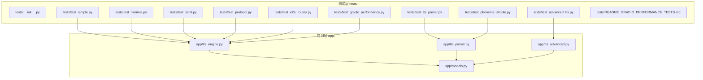
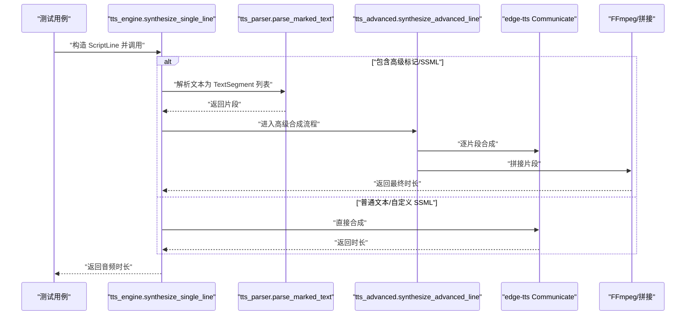
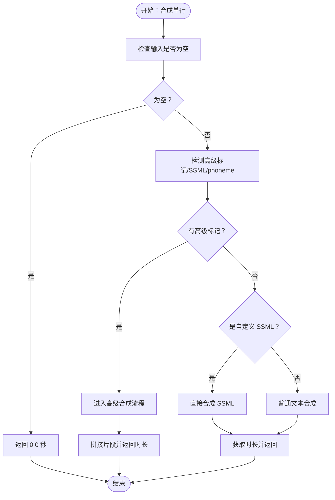
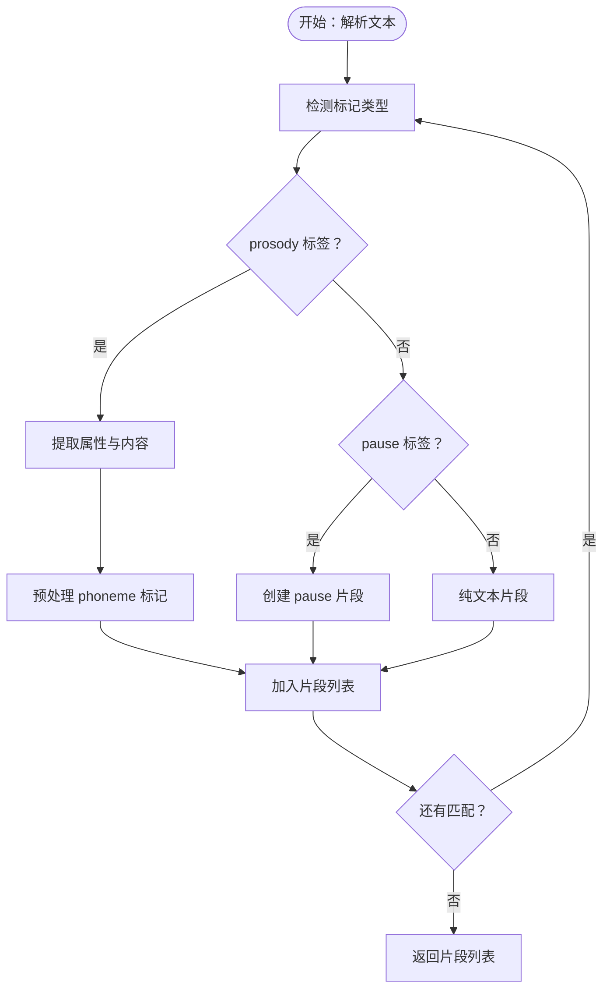
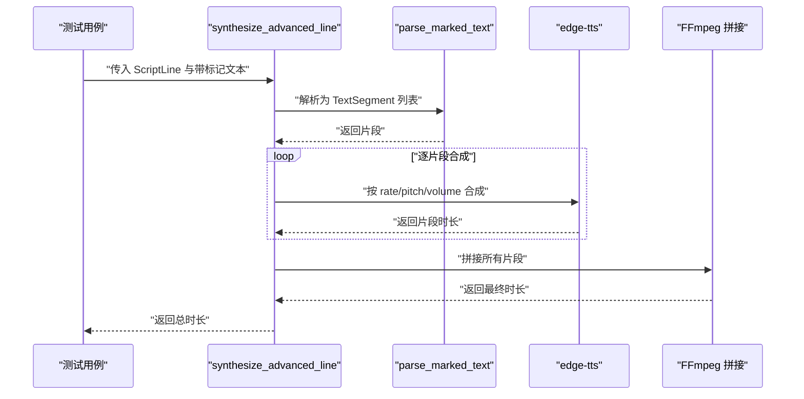
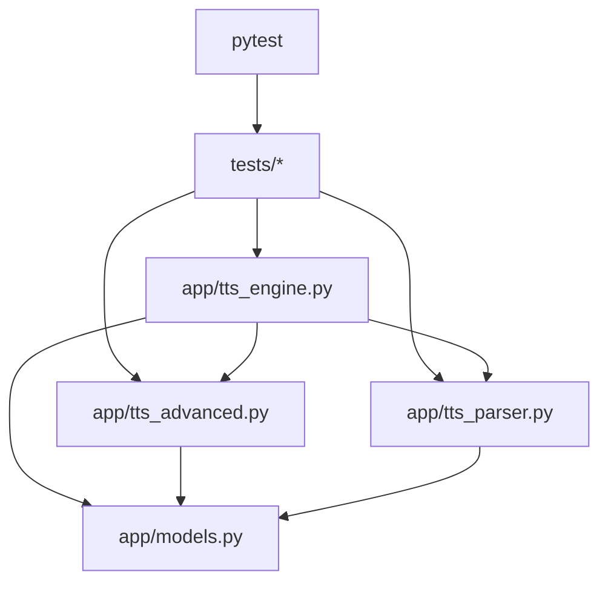

# 单元测试

<cite>
**本文引用的文件**
- [tests/__init__.py](file://tests/__init__.py)
- [requirements.txt](file://requirements.txt)
- [app/tts_engine.py](file://app/tts_engine.py)
- [app/tts_parser.py](file://app/tts_parser.py)
- [app/tts_advanced.py](file://app/tts_advanced.py)
- [app/models.py](file://app/models.py)
- [tests/test_simple.py](file://tests/test_simple.py)
- [tests/test_minimal.py](file://tests/test_minimal.py)
- [tests/test_ssml.py](file://tests/test_ssml.py)
- [tests/test_advanced_tts.py](file://tests/test_advanced_tts.py)
- [tests/test_tts_parser.py](file://tests/test_tts_parser.py)
- [tests/test_phoneme_simple.py](file://tests/test_phoneme_simple.py)
- [tests/test_protocol.py](file://tests/test_protocol.py)
- [tests/test_e2e_routes.py](file://tests/test_e2e_routes.py)
- [tests/test_ultimate_acceptance.py](file://tests/test_ultimate_acceptance.py)
- [tests/test_gradio_performance.py](file://tests/test_gradio_performance.py)
- [tests/README_GRADIO_PERFORMANCE_TESTS.md](file://tests/README_GRADIO_PERFORMANCE_TESTS.md)
</cite>

## 目录
1. [简介](#简介)
2. [项目结构](#项目结构)
3. [核心组件](#核心组件)
4. [架构总览](#架构总览)
5. [详细组件分析](#详细组件分析)
6. [依赖分析](#依赖分析)
7. [性能考虑](#性能考虑)
8. [故障排查指南](#故障排查指南)
9. [结论](#结论)
10. [附录](#附录)

## 简介
本文件面向 TTS Studio 的单元测试体系，系统化阐述测试框架与实践方法，涵盖 pytest 配置与用法、测试用例编写规范、核心模块测试策略（TTS 引擎、解析器、高级 TTS 功能）、测试数据准备、模拟对象与断言技巧、测试分类与组织方式、覆盖率与质量标准、以及测试执行与调试方法。目标是帮助开发者高效、稳定地维护测试套件，确保 TTS 引擎与解析能力的正确性与鲁棒性。

## 项目结构
测试相关文件主要位于 tests/ 目录，按功能与场景划分，既有面向具体模块的单元测试，也有端到端与性能测试；核心业务代码集中在 app/ 目录，包含 TTS 引擎、解析器、高级 TTS 能力与数据模型。

图表来源
- [tests/test_simple.py:1-34](file://tests/test_simple.py#L1-L34)
- [tests/test_minimal.py:1-49](file://tests/test_minimal.py#L1-L49)
- [tests/test_ssml.py:1-123](file://tests/test_ssml.py#L1-L123)
- [tests/test_advanced_tts.py:1-110](file://tests/test_advanced_tts.py#L1-L110)
- [tests/test_tts_parser.py:1-364](file://tests/test_tts_parser.py#L1-L364)
- [tests/test_phoneme_simple.py:1-51](file://tests/test_phoneme_simple.py#L1-L51)
- [tests/test_protocol.py:1-61](file://tests/test_protocol.py#L1-L61)
- [tests/test_e2e_routes.py](file://tests/test_e2e_routes.py)
- [tests/test_gradio_performance.py](file://tests/test_gradio_performance.py)
- [app/tts_engine.py:1-547](file://app/tts_engine.py#L1-L547)
- [app/tts_parser.py:1-220](file://app/tts_parser.py#L1-L220)
- [app/tts_advanced.py:1-290](file://app/tts_advanced.py#L1-L290)
- [app/models.py:1-78](file://app/models.py#L1-L78)

章节来源
- [tests/__init__.py:1-2](file://tests/__init__.py#L1-L2)
- [requirements.txt:1-16](file://requirements.txt#L1-L16)

## 核心组件
- TTS 引擎（app/tts_engine.py）：负责单行文本合成、高级标记文本拆分与拼接、Azure 语音合成回退、代理与重试机制、时长获取与清理临时文件。
- 解析器（app/tts_parser.py）：解析新语法标记（<prosody>/<pause>/[phoneme]），生成 TextSegment 列表，支持 phoneme 预处理与片段计数。
- 高级 TTS（app/tts_advanced.py）：基于解析器结果进行自动拆分+拼接，支持停顿、音色/语速/音调参数的片段化合成。
- 数据模型（app/models.py）：ScriptLine、AudioClip、Character、Project 等，提供 TTS 输入与中间表示。

章节来源
- [app/tts_engine.py:1-547](file://app/tts_engine.py#L1-L547)
- [app/tts_parser.py:1-220](file://app/tts_parser.py#L1-L220)
- [app/tts_advanced.py:1-290](file://app/tts_advanced.py#L1-L290)
- [app/models.py:1-78](file://app/models.py#L1-L78)

## 架构总览
下图展示测试与被测模块的关系，以及典型调用链路（以 synthesize_single_line 为例）：

图表来源
- [tests/test_simple.py:1-34](file://tests/test_simple.py#L1-L34)
- [tests/test_ssml.py:1-123](file://tests/test_ssml.py#L1-L123)
- [app/tts_engine.py:120-218](file://app/tts_engine.py#L120-L218)
- [app/tts_parser.py:69-182](file://app/tts_parser.py#L69-L182)
- [app/tts_advanced.py:112-290](file://app/tts_advanced.py#L112-L290)

## 详细组件分析

### TTS 引擎测试策略
- 目标：验证单行合成、高级标记拆分与拼接、自定义 SSML、代理与重试、Azure 回退、时长计算与清理。
- 关键测试用例：
  - 最小化 SSML 与纯文本：确保基础路径可用。
  - 自定义 SSML 语气起伏与多音字标注：验证 edge-tts 原生能力。
  - 协议捕获：通过 monkey patch 捕获发送的原始消息，核对协议字段。
- 断言要点：
  - 输出文件存在且可读。
  - 时长获取成功（优先使用 mutagen，降级估算）。
  - 代理与重试行为符合预期。
  - Azure 合成可用性与回退逻辑正确。

图表来源
- [app/tts_engine.py:120-218](file://app/tts_engine.py#L120-L218)
- [app/tts_engine.py:220-318](file://app/tts_engine.py#L220-L318)
- [app/tts_engine.py:321-453](file://app/tts_engine.py#L321-L453)

章节来源
- [tests/test_minimal.py:1-49](file://tests/test_minimal.py#L1-L49)
- [tests/test_ssml.py:1-123](file://tests/test_ssml.py#L1-L123)
- [tests/test_simple.py:1-34](file://tests/test_simple.py#L1-L34)
- [tests/test_protocol.py:1-61](file://tests/test_protocol.py#L1-L61)
- [app/tts_engine.py:120-218](file://app/tts_engine.py#L120-L218)

### 解析器测试策略
- 目标：验证新语法标记解析、phoneme 预处理、片段计数与兼容性。
- 关键测试用例：
  - 纯文本、单个 prosody、pause 停顿、混合 prosody/pause、纯文本夹杂 prosody、仅 phoneme、多个 phoneme、复杂真实场景。
  - 空文本与空白文本处理。
  - phoneme 预处理器独立测试。
  - 向后兼容 parse_marked_text/count_segments/has_markers。
- 断言要点：
  - 片段数量与类型正确。
  - rate/pitch/volume 属性继承与默认值。
  - phoneme 替换逻辑与保留策略。

图表来源
- [app/tts_parser.py:69-182](file://app/tts_parser.py#L69-L182)
- [app/tts_parser.py:39-66](file://app/tts_parser.py#L39-L66)
- [tests/test_tts_parser.py:1-364](file://tests/test_tts_parser.py#L1-L364)

章节来源
- [tests/test_tts_parser.py:1-364](file://tests/test_tts_parser.py#L1-L364)
- [app/tts_parser.py:1-220](file://app/tts_parser.py#L1-L220)

### 高级 TTS 功能测试策略
- 目标：验证自动拆分+拼接、多音字控制、停顿、复合样式与重试。
- 关键测试用例：
  - 多语速变化、音调变化、复合样式+停顿、多音字拆分控制。
  - 与解析器结果对比：同音字策略 vs 拼音策略。
- 断言要点：
  - 片段拆分正确，参数继承合理。
  - 停顿片段时长与拼接时长一致。
  - 重试与错误传播符合预期。

图表来源
- [tests/test_advanced_tts.py:1-110](file://tests/test_advanced_tts.py#L1-L110)
- [app/tts_advanced.py:112-290](file://app/tts_advanced.py#L112-L290)
- [app/tts_parser.py:216-218](file://app/tts_parser.py#L216-L218)

章节来源
- [tests/test_advanced_tts.py:1-110](file://tests/test_advanced_tts.py#L1-L110)
- [tests/test_phoneme_simple.py:1-51](file://tests/test_phoneme_simple.py#L1-L51)
- [app/tts_advanced.py:1-290](file://app/tts_advanced.py#L1-L290)

### 测试数据准备与模拟对象
- 测试数据准备：
  - 使用 tests/ 目录下的脚本生成最小化 SSML、自定义 SSML、高级标记文本等。
  - 通过 app/models.py 的 ScriptLine 构造输入对象，设置 voice/rate/pitch/text/ssml_text。
- 模拟对象与补丁：
  - 协议捕获：对 edge_tts 通信层进行 monkey patch，拦截发送消息，便于核对协议字段。
  - 代理与网络：通过环境变量设置 HTTP_PROXY/https_proxy，验证代理路径。
  - Azure SDK：在缺少依赖时验证回退逻辑。
- 断言技巧：
  - 文件存在性与可读性。
  - 时长获取（mutagen 优先，降级估算）。
  - 片段数量、类型与属性一致性。
  - 错误传播与重试次数。

章节来源
- [tests/test_protocol.py:1-61](file://tests/test_protocol.py#L1-L61)
- [tests/test_minimal.py:1-49](file://tests/test_minimal.py#L1-L49)
- [tests/test_ssml.py:1-123](file://tests/test_ssml.py#L1-L123)
- [app/models.py:37-62](file://app/models.py#L37-L62)

### 测试分类与组织
- 基础功能测试：最小化 SSML、纯文本、自定义 SSML。
- 边界条件测试：空文本、空白文本、仅 phoneme、仅 pause、纯文本夹杂 prosody。
- 异常处理测试：代理不可用、网络错误、Azure 不可用、重试失败。
- 高级特性测试：多音字策略对比、停顿与复合样式、自动拆分+拼接。
- 端到端测试：路由与工作流（如 test_e2e_routes.py）。
- 性能测试：UI 与 Gradio 相关性能测试（见 test_gradio_performance.py 与 README）。

章节来源
- [tests/test_simple.py:1-34](file://tests/test_simple.py#L1-L34)
- [tests/test_minimal.py:1-49](file://tests/test_minimal.py#L1-L49)
- [tests/test_ssml.py:1-123](file://tests/test_ssml.py#L1-L123)
- [tests/test_tts_parser.py:1-364](file://tests/test_tts_parser.py#L1-L364)
- [tests/test_advanced_tts.py:1-110](file://tests/test_advanced_tts.py#L1-L110)
- [tests/test_phoneme_simple.py:1-51](file://tests/test_phoneme_simple.py#L1-L51)
- [tests/test_protocol.py:1-61](file://tests/test_protocol.py#L1-L61)
- [tests/test_e2e_routes.py](file://tests/test_e2e_routes.py)
- [tests/test_gradio_performance.py](file://tests/test_gradio_performance.py)
- [tests/README_GRADIO_PERFORMANCE_TESTS.md](file://tests/README_GRADIO_PERFORMANCE_TESTS.md)

## 依赖分析
- 测试框架：pytest（requirements.txt 指定版本）。
- 外部依赖：edge-tts、pydub、mutagen、gradio（UI 性能测试相关）。
- 组件耦合：
  - tts_engine 依赖 tts_parser、tts_advanced、models、config。
  - tts_advanced 依赖 tts_parser、models、edge-tts、FFmpeg。
  - tests 通过直接导入 app 模块进行测试，保持高内聚低耦合。

图表来源
- [requirements.txt:1-16](file://requirements.txt#L1-L16)
- [app/tts_engine.py:1-18](file://app/tts_engine.py#L1-L18)
- [app/tts_parser.py:1-18](file://app/tts_parser.py#L1-L18)
- [app/tts_advanced.py:1-18](file://app/tts_advanced.py#L1-L18)

章节来源
- [requirements.txt:1-16](file://requirements.txt#L1-L16)
- [app/tts_engine.py:1-18](file://app/tts_engine.py#L1-L18)
- [app/tts_parser.py:1-18](file://app/tts_parser.py#L1-L18)
- [app/tts_advanced.py:1-18](file://app/tts_advanced.py#L1-L18)

## 性能考虑
- 性能测试关注 Gradio UI 响应与渲染开销，建议：
  - 使用 tests/test_gradio_performance.py 评估交互延迟。
  - 结合 tests/README_GRADIO_PERFORMANCE_TESTS.md 的指导进行基准测试。
  - 控制测试并发与资源占用，避免影响 CI 环境稳定性。

章节来源
- [tests/test_gradio_performance.py](file://tests/test_gradio_performance.py)
- [tests/README_GRADIO_PERFORMANCE_TESTS.md](file://tests/README_GRADIO_PERFORMANCE_TESTS.md)

## 故障排查指南
- 常见问题与定位：
  - 403/网络错误：检查代理设置（HTTP_PROXY/https_proxy），确认可访问微软服务。
  - Azure 不可用：SDK 缺失时自动回退 edge-tts，确保日志提示正确。
  - 时长获取失败：mutagen 未安装时使用估算，建议安装以获得准确时长。
  - 协议异常：使用 test_protocol.py 捕获并比对发送消息，核对字段。
- 调试建议：
  - 启用详细日志，观察合成流程与重试记录。
  - 分步执行：先验证解析器，再验证引擎，最后验证高级功能。
  - 使用最小化用例快速复现问题。

章节来源
- [tests/test_protocol.py:1-61](file://tests/test_protocol.py#L1-L61)
- [app/tts_engine.py:255-318](file://app/tts_engine.py#L255-L318)
- [app/tts_engine.py:83-118](file://app/tts_engine.py#L83-L118)

## 结论
本测试体系以 pytest 为核心，围绕 TTS 引擎、解析器与高级 TTS 功能构建了覆盖基础、边界与异常的测试矩阵。通过协议捕获、模拟对象与断言技巧，确保合成流程的正确性与可维护性。建议持续完善覆盖率与性能测试，结合 CI/CD 保障发布质量。

## 附录

### 测试执行命令与调试方法
- 安装依赖与运行测试：
  - 安装测试框架：pip install pytest
  - 运行单个测试：python -m pytest tests/test_simple.py -v
  - 运行某类测试：python -m pytest tests/test_ssml.py tests/test_advanced_tts.py -v
  - 运行全部测试：python -m pytest tests/ -v
- 调试技巧：
  - 使用 -s 输出日志与打印信息。
  - 使用 -k 过滤测试名称关键字。
  - 使用 --tb=short 快速定位异常堆栈。

章节来源
- [requirements.txt:14-16](file://requirements.txt#L14-L16)
- [tests/test_simple.py:1-34](file://tests/test_simple.py#L1-L34)
- [tests/test_ssml.py:1-123](file://tests/test_ssml.py#L1-L123)
- [tests/test_advanced_tts.py:1-110](file://tests/test_advanced_tts.py#L1-L110)