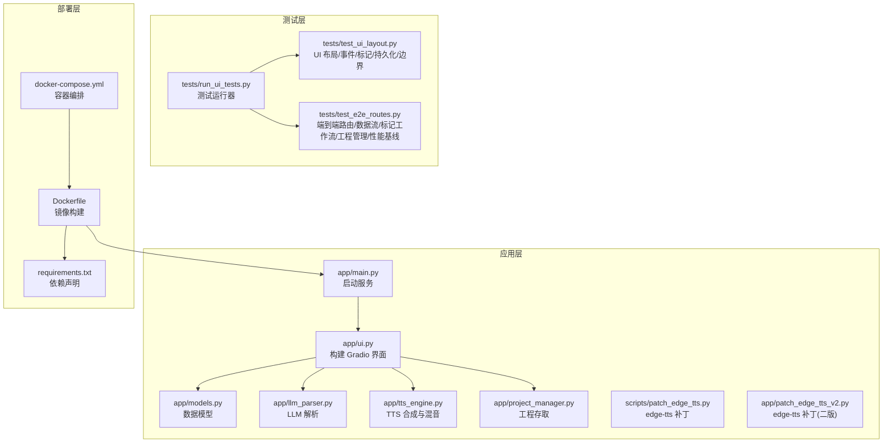
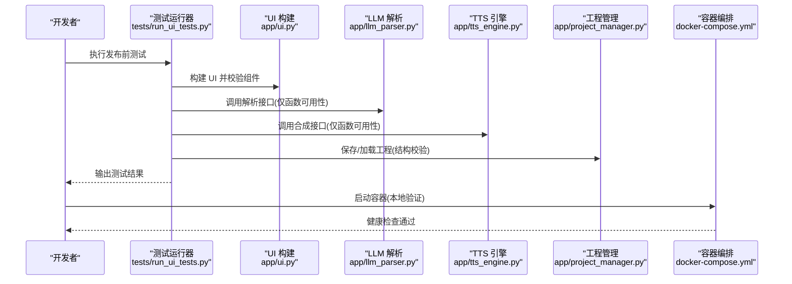
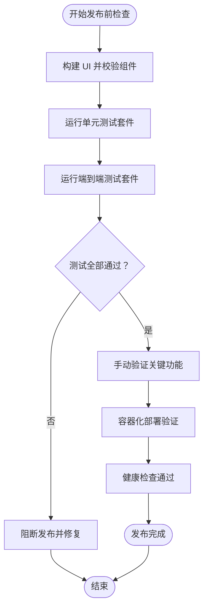
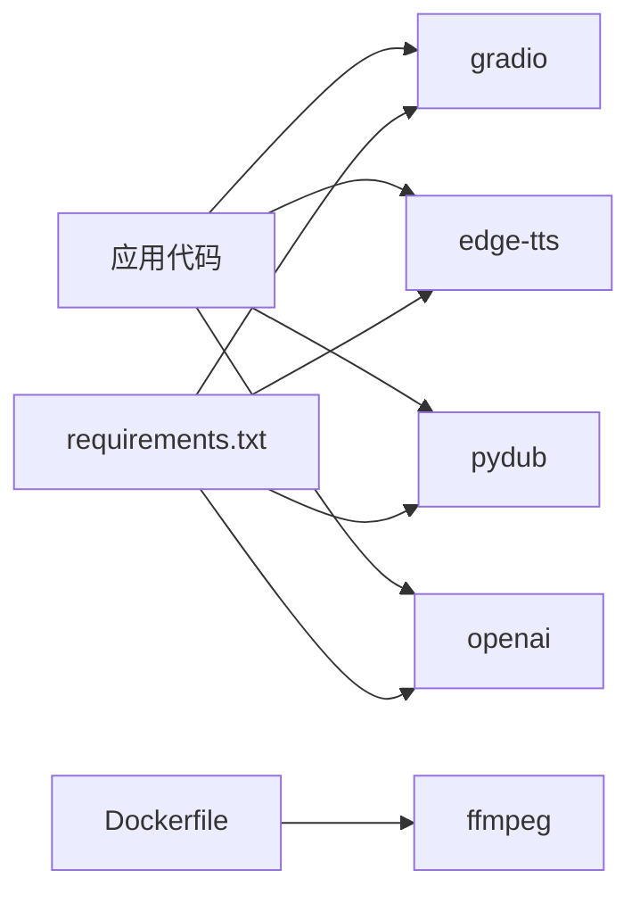

# 发布检查清单

<cite>
**本文引用的文件**
- [docs/RELEASE_CHECKLIST.md](file://docs/RELEASE_CHECKLIST.md)
- [tests/run_ui_tests.py](file://tests/run_ui_tests.py)
- [tests/test_ui_layout.py](file://tests/test_ui_layout.py)
- [tests/test_e2e_routes.py](file://tests/test_e2e_routes.py)
- [app/main.py](file://app/main.py)
- [Dockerfile](file://Dockerfile)
- [docker-compose.yml](file://docker-compose.yml)
- [requirements.txt](file://requirements.txt)
- [scripts/patch_edge_tts.py](file://scripts/patch_edge_tts.py)
- [app/patch_edge_tts_v2.py](file://app/patch_edge_tts_v2.py)
- [docs/GRADIO_PERFORMANCE_ISSUE_RECORD.md](file://docs/GRADIO_PERFORMANCE_ISSUE_RECORD.md)
- [docs/README.md](file://docs/README.md)
</cite>

## 目录
1. [简介](#简介)
2. [项目结构](#项目结构)
3. [核心组件](#核心组件)
4. [架构总览](#架构总览)
5. [详细组件分析](#详细组件分析)
6. [依赖分析](#依赖分析)
7. [性能考量](#性能考量)
8. [故障排查指南](#故障排查指南)
9. [结论](#结论)
10. [附录](#附录)

## 简介
本文件为 TTS Studio 的完整发布检查清单，面向发布前的质量把关，涵盖功能验证、性能测试、安全检查与兼容性验证；明确发布流程阶段与责任人分工；制定版本号管理与变更日志生成方法；给出发布后的监控与回滚策略，并提供风险评估与应急预案，以及发布质量标准与验收条件。

## 项目结构
TTS Studio 采用“应用模块 + 文档 + 测试 + 脚本”的组织方式，核心入口为 Gradio 应用，容器化部署通过 Dockerfile 与 docker-compose.yml 实现，自动化测试由 tests/run_ui_tests.py 统一调度，文档集中于 docs 目录。

图表来源
- [app/main.py:1-51](file://app/main.py#L1-L51)
- [tests/run_ui_tests.py:1-122](file://tests/run_ui_tests.py#L1-L122)
- [Dockerfile:1-51](file://Dockerfile#L1-L51)
- [docker-compose.yml:1-32](file://docker-compose.yml#L1-L32)
- [requirements.txt:1-16](file://requirements.txt#L1-L16)

章节来源
- [docs/README.md:1-171](file://docs/README.md#L1-L171)

## 核心组件
- 应用入口与服务启动：负责启动 Gradio 服务，暴露本地端口，配置日志与静态资源路径。
- UI 构建：组织 Tabs、Dataframe、按钮等组件，定义事件处理与数据流。
- 数据模型：定义工程、剧本行、音频片段等数据结构。
- LLM 解析：调用 OpenAI 兼容接口解析文本为结构化剧本。
- TTS 引擎：基于 edge-tts 生成语音，支持 SSML Prosody 参数；使用 pydub 进行音频拼接与混音。
- 工程管理：序列化/反序列化工程文件，兼容历史字段。
- 测试套件：自动化 UI 构建与端到端流程验证，覆盖布局、事件、标记、持久化、边界与性能基线。
- 部署与运行：Dockerfile 与 docker-compose.yml 提供容器化部署与健康检查。

章节来源
- [app/main.py:1-51](file://app/main.py#L1-L51)
- [app/ui.py](file://app/ui.py)
- [app/models.py](file://app/models.py)
- [app/llm_parser.py](file://app/llm_parser.py)
- [app/tts_engine.py](file://app/tts_engine.py)
- [app/project_manager.py](file://app/project_manager.py)
- [tests/run_ui_tests.py:1-122](file://tests/run_ui_tests.py#L1-L122)
- [Dockerfile:1-51](file://Dockerfile#L1-L51)
- [docker-compose.yml:1-32](file://docker-compose.yml#L1-L32)

## 架构总览
发布前检查围绕“自动化测试 + 手动验证 + 部署验证”三层展开，确保 UI 构建、功能路径、标记与混音链路、工程存取、性能与兼容性均满足发布标准。

图表来源
- [tests/run_ui_tests.py:1-122](file://tests/run_ui_tests.py#L1-L122)
- [app/ui.py](file://app/ui.py)
- [app/llm_parser.py](file://app/llm_parser.py)
- [app/tts_engine.py](file://app/tts_engine.py)
- [app/project_manager.py](file://app/project_manager.py)
- [docker-compose.yml:26-31](file://docker-compose.yml#L26-L31)

## 详细组件分析

### 自动化测试与发布前检查
- 测试运行器统一调度 UI 构建与端到端测试，失败即阻断发布。
- UI 布局测试覆盖 Tabs 结构、组件移除（Azure/代理）、表格列数等。
- 端到端测试覆盖工程配置、文本解析、对白生成、表格刷新、标记工作流、工程保存/加载、边界与性能基线。
- 测试结果决定是否进入手动验证与发布。

图表来源
- [tests/run_ui_tests.py:88-122](file://tests/run_ui_tests.py#L88-L122)
- [tests/test_ui_layout.py:17-418](file://tests/test_ui_layout.py#L17-L418)
- [tests/test_e2e_routes.py:17-505](file://tests/test_e2e_routes.py#L17-L505)

章节来源
- [docs/RELEASE_CHECKLIST.md:3-168](file://docs/RELEASE_CHECKLIST.md#L3-L168)
- [tests/run_ui_tests.py:1-122](file://tests/run_ui_tests.py#L1-L122)
- [tests/test_ui_layout.py:17-418](file://tests/test_ui_layout.py#L17-L418)
- [tests/test_e2e_routes.py:17-505](file://tests/test_e2e_routes.py#L17-L505)

### 功能验证清单
- UI 布局与组件：Tabs 结构、无 Azure/代理配置、对白表格仅两列。
- 事件处理：表格刷新格式、选中行更新、应用属性逻辑。
- 标记功能：多音字标注（仅替换首个）、停顿插入、强调标记、清除标记。
- 数据持久化：应用表格编辑到 audio_clips。
- 边界情况：空表格、长文本截断、无效行索引。
- 端到端路径：工程配置、文本解析、对白生成、预听、混音输出、工程保存/加载。

章节来源
- [docs/RELEASE_CHECKLIST.md:11-96](file://docs/RELEASE_CHECKLIST.md#L11-L96)
- [tests/test_ui_layout.py:17-418](file://tests/test_ui_layout.py#L17-L418)
- [tests/test_e2e_routes.py:17-505](file://tests/test_e2e_routes.py#L17-L505)

### 性能测试与基准
- UI 构建性能：构建时间应小于阈值。
- 表格刷新性能：对大量数据刷新应在阈值内完成。
- 首次加载与交互：Tab 切换流畅、无卡顿；控制台无性能警告。

章节来源
- [tests/test_e2e_routes.py:444-501](file://tests/test_e2e_routes.py#L444-L501)
- [docs/GRADIO_PERFORMANCE_ISSUE_RECORD.md:244-264](file://docs/GRADIO_PERFORMANCE_ISSUE_RECORD.md#L244-L264)

### 安全检查与兼容性验证
- 依赖版本：确保 requirements.txt 中关键依赖版本符合预期。
- 容器安全：镜像最小化、非 root 用户（可选）、只读配置挂载、必要时启用用户映射。
- 网络与代理：容器网络策略、健康检查端口可达。
- 跨平台兼容：Windows/macOS/Linux 下 UI 与 FFmpeg 依赖一致性。

章节来源
- [requirements.txt:1-16](file://requirements.txt#L1-L16)
- [Dockerfile:1-51](file://Dockerfile#L1-L51)
- [docker-compose.yml:1-32](file://docker-compose.yml#L1-L32)

### 版本号管理与变更日志
- 版本号策略：采用语义化版本（主.次.修订），发布前在文档与脚本中统一更新。
- 变更日志：遵循“版本标题 + 日期 + 主要变更 + 测试结果”的格式，便于追溯。
- 发布记录：在发布检查清单中记录本次版本号、变更摘要与测试结果。

章节来源
- [docs/RELEASE_CHECKLIST.md:109-126](file://docs/RELEASE_CHECKLIST.md#L109-L126)

### 发布流程与责任分工
- 阶段划分
  - 准备阶段：更新版本号与变更日志、合并代码、准备发布分支。
  - 自动化测试：运行测试运行器，确保 UI 构建与端到端测试通过。
  - 手动验证：按发布检查清单逐项验证 UI、功能、性能与兼容性。
  - 部署验证：使用 docker-compose 启动服务，进行健康检查与功能回归。
  - 发布与公告：对外发布版本，更新文档与公告。
- 责任分工
  - 开发者：编写与维护测试、修复缺陷、提供功能说明。
  - 测试工程师：执行自动化与手动测试，输出测试报告。
  - 运维工程师：维护容器镜像与部署脚本，保障发布环境稳定。
  - 项目经理：协调发布节奏，审批发布决策。

章节来源
- [docs/RELEASE_CHECKLIST.md:128-168](file://docs/RELEASE_CHECKLIST.md#L128-L168)

### 发布后的监控与回滚策略
- 监控
  - 健康检查：容器健康检查端口可达、进程存活。
  - 日志：应用日志级别、错误聚合与告警。
  - 性能：UI 加载时间、合成耗时、内存/CPU 使用率。
- 回滚
  - 快速回滚：停止服务、恢复上一版本文件、重启服务。
  - 渐进回滚：灰度释放、观察窗口、自动回滚阈值。

章节来源
- [docs/RELEASE_CHECKLIST.md:148-161](file://docs/RELEASE_CHECKLIST.md#L148-L161)
- [docker-compose.yml:26-31](file://docker-compose.yml#L26-L31)

### 发布风险评估与应急预案
- 风险类别
  - 功能风险：UI 卡顿、合成失败、工程文件损坏。
  - 性能风险：首屏加载慢、表格刷新卡顿、CPU/内存飙升。
  - 兼容性风险：不同操作系统/浏览器表现差异、依赖冲突。
  - 运维风险：容器启动失败、端口占用、权限问题。
- 应急预案
  - 立即回滚至上一稳定版本。
  - 临时降级：关闭高负载功能、降低并发、启用缓存。
  - 热修复：小范围修复后快速验证并重新发布。

章节来源
- [docs/GRADIO_PERFORMANCE_ISSUE_RECORD.md:113-141](file://docs/GRADIO_PERFORMANCE_ISSUE_RECORD.md#L113-L141)

### 发布质量标准与验收条件
- 质量标准
  - 自动化测试：100% 通过，无阻断性缺陷。
  - 手动验证：UI 与功能符合设计，性能达标。
  - 兼容性：主流浏览器与操作系统下可用。
- 验收条件
  - 测试运行器输出“所有测试通过”，手动验证清单完成。
  - 容器健康检查通过，服务可访问。
  - 变更日志与版本号已更新，发布文档已同步。

章节来源
- [docs/RELEASE_CHECKLIST.md:109-126](file://docs/RELEASE_CHECKLIST.md#L109-L126)
- [tests/run_ui_tests.py:50-60](file://tests/run_ui_tests.py#L50-L60)

## 依赖分析
- 应用依赖
  - Gradio：UI 框架，版本在 requirements.txt 中声明。
  - edge-tts：TTS 引擎，配合补丁支持自定义 SSML。
  - pydub：音频处理与混音。
  - openai：LLM 解析接口。
- 运行时依赖
  - FFmpeg：容器内安装，用于音频处理。
- 测试依赖
  - pytest：测试框架。

图表来源
- [requirements.txt:1-16](file://requirements.txt#L1-L16)
- [Dockerfile:12-24](file://Dockerfile#L12-L24)

章节来源
- [requirements.txt:1-16](file://requirements.txt#L1-L16)
- [Dockerfile:1-51](file://Dockerfile#L1-L51)

## 性能考量
- UI 构建与交互
  - 避免运行时事件与深层嵌套容器，采用预加载与静态初始化。
  - 首次加载时间与 Tab 切换延迟应满足用户体验阈值。
- 合成与混音
  - 合理拆分长文本，避免单次请求过大；使用异步合成与批量处理。
  - 混音时注意音量叠加与静音占位，避免爆音与无声片段。
- 资源与并发
  - 控制并发合成数量，避免 TTS 服务过载。
  - 监控内存与 CPU，防止长时间任务导致资源耗尽。

章节来源
- [docs/GRADIO_PERFORMANCE_ISSUE_RECORD.md:113-141](file://docs/GRADIO_PERFORMANCE_ISSUE_RECORD.md#L113-L141)
- [tests/test_e2e_routes.py:444-501](file://tests/test_e2e_routes.py#L444-L501)

## 故障排查指南
- UI 卡顿与 Tab 切换失败
  - 根因：Gradio 组件更新机制与运行时事件导致性能问题。
  - 处理：采用预加载与静态初始化，避免运行时 DOM 操作。
- 自定义 SSML 不生效
  - 根因：edge-tts 默认转义与包装逻辑。
  - 处理：应用补丁脚本，保留自定义 SSML 并避免重复包装。
- 容器启动失败
  - 根因：端口占用、权限不足、依赖缺失。
  - 处理：检查端口占用、修正权限、确认 FFmpeg 安装与环境变量。

章节来源
- [docs/GRADIO_PERFORMANCE_ISSUE_RECORD.md:113-141](file://docs/GRADIO_PERFORMANCE_ISSUE_RECORD.md#L113-L141)
- [scripts/patch_edge_tts.py:1-105](file://scripts/patch_edge_tts.py#L1-L105)
- [app/patch_edge_tts_v2.py:1-117](file://app/patch_edge_tts_v2.py#L1-L117)
- [docker-compose.yml:26-31](file://docker-compose.yml#L26-L31)

## 结论
通过严格的自动化测试、手动验证与容器化部署验证，结合完善的性能与安全检查，TTS Studio 可实现高质量、可追溯、可回滚的发布流程。建议在每次发布前严格执行本检查清单，并根据实际运行情况持续优化测试覆盖与性能基线。

## 附录
- 发布检查清单模板与示例可参考发布检查清单文档。
- 性能优化与问题记录可参考性能问题记录文档。
- 部署与依赖管理可参考 Dockerfile 与 requirements.txt。

章节来源
- [docs/RELEASE_CHECKLIST.md:1-168](file://docs/RELEASE_CHECKLIST.md#L1-L168)
- [docs/GRADIO_PERFORMANCE_ISSUE_RECORD.md:1-360](file://docs/GRADIO_PERFORMANCE_ISSUE_RECORD.md#L1-L360)
- [Dockerfile:1-51](file://Dockerfile#L1-L51)
- [requirements.txt:1-16](file://requirements.txt#L1-L16)