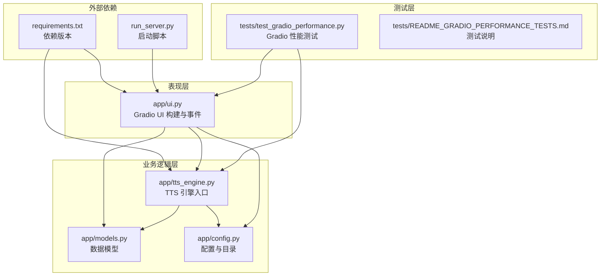
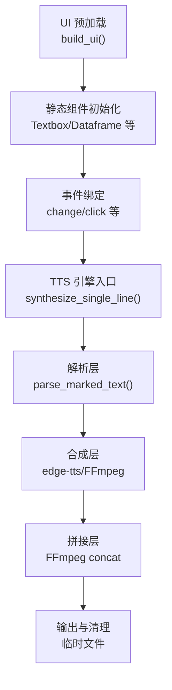
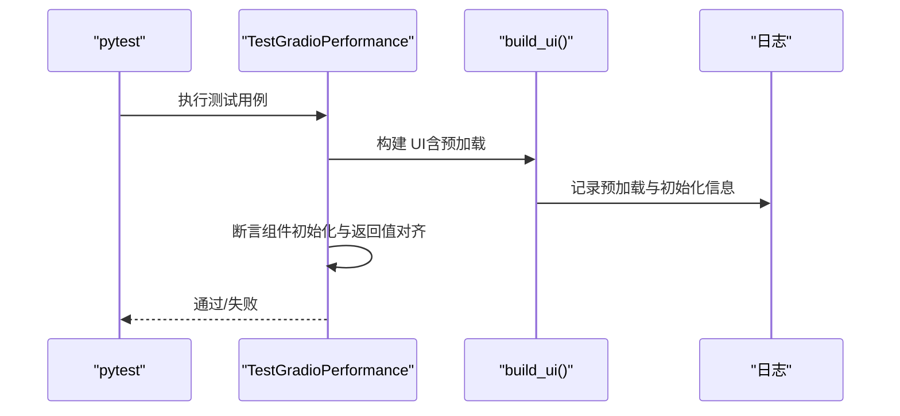
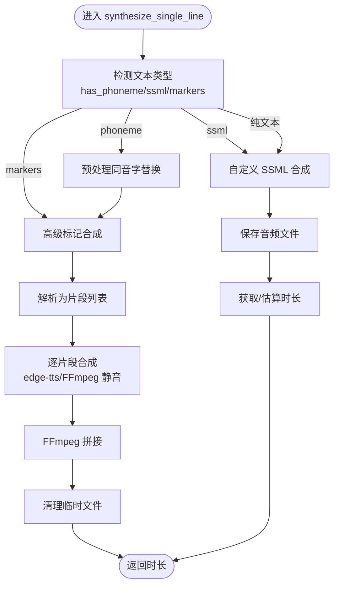
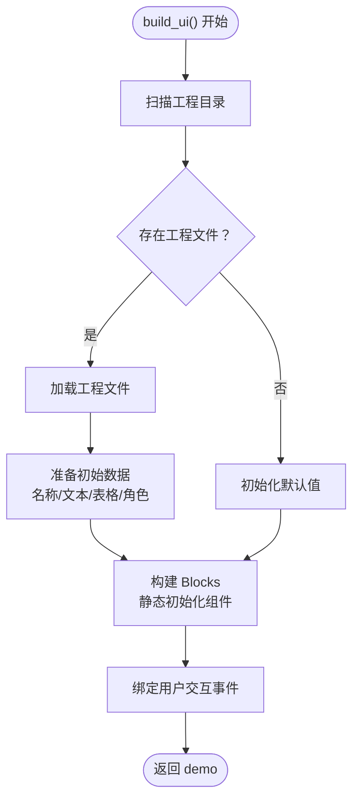
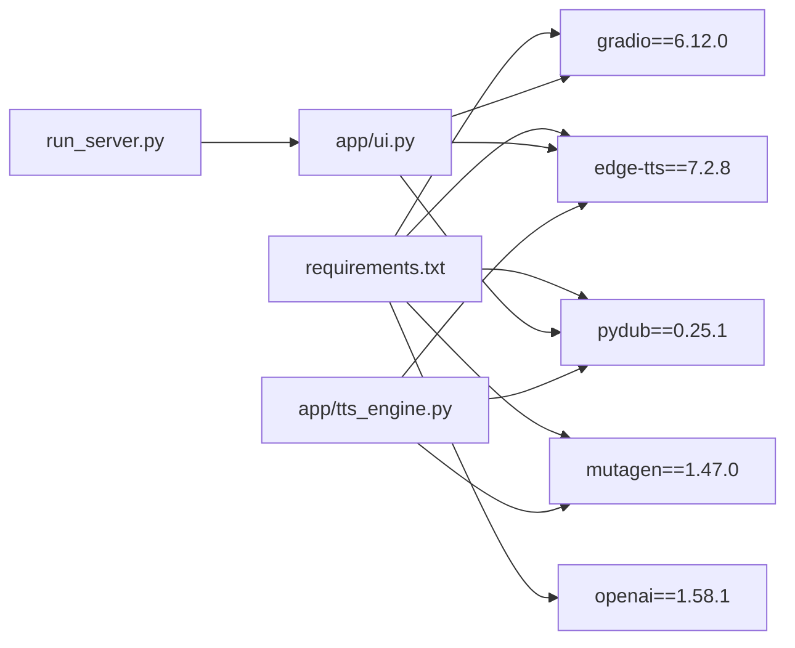

# 性能测试

<cite>
**本文引用的文件**
- [README_GRADIO_PERFORMANCE_TESTS.md](file://tests/README_GRADIO_PERFORMANCE_TESTS.md)
- [test_gradio_performance.py](file://tests/test_gradio_performance.py)
- [GRADIO_PERFORMANCE_OPTIMIZATION.md](file://docs/GRADIO_PERFORMANCE_OPTIMIZATION.md)
- [GRADIO_PERFORMANCE_ISSUE_RECORD.md](file://docs/GRADIO_PERFORMANCE_ISSUE_RECORD.md)
- [PROJECT_BASELINE.md](file://docs/PROJECT_BASELINE.md)
- [ui.py](file://app/ui.py)
- [tts_engine.py](file://app/tts_engine.py)
- [models.py](file://app/models.py)
- [config.py](file://app/config.py)
- [requirements.txt](file://requirements.txt)
- [run_server.py](file://run_server.py)
- [test_tts_engine_ssml.py](file://tests/test_tts_engine_ssml.py)
- [test_advanced_tts.py](file://tests/test_advanced_tts.py)
</cite>

## 目录
1. [简介](#简介)
2. [项目结构](#项目结构)
3. [核心组件](#核心组件)
4. [架构总览](#架构总览)
5. [详细组件分析](#详细组件分析)
6. [依赖分析](#依赖分析)
7. [性能考量](#性能考量)
8. [故障排查指南](#故障排查指南)
9. [结论](#结论)
10. [附录](#附录)

## 简介
本文件面向 TTS Studio 的性能测试与优化，聚焦于 Gradio Web UI 的性能测试框架与工具使用、响应时间与并发用户测试方法、资源使用监控策略、性能基线设定与回归测试策略、内存泄漏与 CPU 使用率分析方法，以及性能瓶颈识别与优化建议，并提供测试结果解读与报告生成指导。

## 项目结构
TTS Studio 采用分层架构：表现层（Gradio UI）、业务逻辑层（TTS 引擎与标记解析）、数据层（工程与音频）。性能测试围绕 UI 首次加载、组件初始化、事件处理与 TTS 合成路径展开。

图示来源
- [ui.py](file://app/ui.py)
- [tts_engine.py](file://app/tts_engine.py)
- [models.py](file://app/models.py)
- [config.py](file://app/config.py)
- [test_gradio_performance.py](file://tests/test_gradio_performance.py)
- [README_GRADIO_PERFORMANCE_TESTS.md](file://tests/README_GRADIO_PERFORMANCE_TESTS.md)
- [requirements.txt](file://requirements.txt)
- [run_server.py](file://run_server.py)

章节来源
- [ui.py](file://app/ui.py)
- [tts_engine.py](file://app/tts_engine.py)
- [models.py](file://app/models.py)
- [config.py](file://app/config.py)
- [requirements.txt](file://requirements.txt)
- [run_server.py](file://run_server.py)

## 核心组件
- Gradio UI 构建与预加载：在页面构建前完成工程数据预加载，组件静态初始化，避免运行时事件与手动赋值，确保首屏快速渲染与无性能警告。
- TTS 引擎：支持普通文本、自定义 SSML 与高级标记（语速/音调/停顿/强调）的自动拆分与拼接，具备重试与容错机制。
- 测试框架：基于 pytest 的 Gradio 性能测试套件，覆盖预加载、组件初始化、事件返回值对齐、布局结构、异常处理与集成加载周期。

章节来源
- [test_gradio_performance.py](file://tests/test_gradio_performance.py)
- [README_GRADIO_PERFORMANCE_TESTS.md](file://tests/README_GRADIO_PERFORMANCE_TESTS.md)
- [GRADIO_PERFORMANCE_OPTIMIZATION.md](file://docs/GRADIO_PERFORMANCE_OPTIMIZATION.md)
- [GRADIO_PERFORMANCE_ISSUE_RECORD.md](file://docs/GRADIO_PERFORMANCE_ISSUE_RECORD.md)
- [ui.py](file://app/ui.py)
- [tts_engine.py](file://app/tts_engine.py)

## 架构总览
Gradio UI 的性能优化核心在于“预加载 + 静态初始化”，将运行时操作降至最少；TTS 合成路径通过解析层、合成层与拼接层分层处理，结合临时文件管理与 FFmpeg 拼接，确保时长与资源占用可控。

图示来源
- [ui.py](file://app/ui.py)
- [tts_engine.py](file://app/tts_engine.py)

章节来源
- [ui.py](file://app/ui.py)
- [tts_engine.py](file://app/tts_engine.py)

## 详细组件分析

### Gradio 性能测试套件
- 测试目标：验证预加载初始数据、组件静态初始化、避免 demo.load、事件返回值对齐、向后兼容、布局结构、禁止手动赋值 .value、异常处理与日志质量，以及完整加载周期的性能。
- 运行方式：pytest，支持单测、全量、详细输出与 HTML 报告生成。
- 覆盖维度：预加载逻辑、组件初始化、性能优化、代码规范、兼容性、异常处理、集成测试。

图示来源
- [test_gradio_performance.py](file://tests/test_gradio_performance.py)
- [README_GRADIO_PERFORMANCE_TESTS.md](file://tests/README_GRADIO_PERFORMANCE_TESTS.md)

章节来源
- [test_gradio_performance.py](file://tests/test_gradio_performance.py)
- [README_GRADIO_PERFORMANCE_TESTS.md](file://tests/README_GRADIO_PERFORMANCE_TESTS.md)

### TTS 引擎与标记解析
- 文本类型判定：普通文本、自定义 SSML、高级标记（prosody/pause/emphasis/phoneme）。
- 高级标记处理：解析文本为片段，分别合成后使用 FFmpeg 拼接，finally 清理临时文件。
- 重试与容错：网络异常与文件生成失败具备重试与降级日志。
- 时长获取：优先使用 mutagen，缺失时估算。

图示来源
- [tts_engine.py](file://app/tts_engine.py)

章节来源
- [tts_engine.py](file://app/tts_engine.py)

### UI 预加载与静态初始化
- 预加载时机：在构建 Blocks 之前完成工程数据加载，准备初始值。
- 组件初始化：直接传入 value，避免运行时事件与手动赋值。
- 布局结构：使用 Tabs 作为顶级布局，Accordion 嵌套不超过 2 层。
- 兼容性：使用 getattr 提供默认值，保证旧工程文件可加载。
- 异常处理：try-except 与错误日志，失败时降级为默认值。

图示来源
- [ui.py](file://app/ui.py)

章节来源
- [ui.py](file://app/ui.py)
- [GRADIO_PERFORMANCE_OPTIMIZATION.md](file://docs/GRADIO_PERFORMANCE_OPTIMIZATION.md)
- [GRADIO_PERFORMANCE_ISSUE_RECORD.md](file://docs/GRADIO_PERFORMANCE_ISSUE_RECORD.md)

### 性能测试工具与方法
- 响应时间测试：使用 time.time() 记录 UI 构建总耗时，断言 < 3 秒。
- 并发用户测试：建议使用 locust 或 wrk 对 Gradio 服务端发起并发请求，观察响应时间与错误率。
- 资源使用监控：使用系统监控工具（如 top/htop、Windows 任务管理器、Docker stats）观测 CPU、内存与磁盘 IO。
- 基线设定：记录不同数据规模（工程文件数量、音频片段数、标记复杂度）下的 UI 首次加载时间与 TTS 合成时长。
- 回归测试：将性能测试纳入 CI，固定阈值，失败即阻断发布。

章节来源
- [README_GRADIO_PERFORMANCE_TESTS.md](file://tests/README_GRADIO_PERFORMANCE_TESTS.md)
- [test_gradio_performance.py](file://tests/test_gradio_performance.py)

### 内存泄漏检测与 CPU 使用率分析
- 内存泄漏检测：长时间运行 UI（模拟多用户频繁切换页签、生成音频），使用进程内存快照对比，关注对象数量与堆大小增长。
- CPU 使用率分析：在合成路径中定位热点（edge-tts 网络请求、FFmpeg 拼接），评估是否可通过并行或缓存优化。
- 日志辅助：TTS 引擎与 UI 构建均输出详细日志，便于定位异常耗时阶段。

章节来源
- [tts_engine.py](file://app/tts_engine.py)
- [ui.py](file://app/ui.py)

### 性能瓶颈识别与优化建议
- UI 层瓶颈：深层嵌套 Accordion/Tabs、运行时事件（demo.load）、手动赋值 .value。
  - 优化：使用 Tabs 顶层 + 少量 Accordion；预加载 + 静态初始化；通过返回值更新组件。
- TTS 合成瓶颈：网络请求延迟、FFmpeg 拼接、临时文件管理。
  - 优化：重试退避、批量/并行合成（未来可扩展）、拼接策略优化、finally 确保清理。
- 数据层瓶颈：工程文件读取与解析。
  - 优化：预加载与降级、向后兼容 getattr、日志记录关键步骤。

章节来源
- [GRADIO_PERFORMANCE_OPTIMIZATION.md](file://docs/GRADIO_PERFORMANCE_OPTIMIZATION.md)
- [GRADIO_PERFORMANCE_ISSUE_RECORD.md](file://docs/GRADIO_PERFORMANCE_ISSUE_RECORD.md)
- [tts_engine.py](file://app/tts_engine.py)
- [ui.py](file://app/ui.py)

### 性能测试结果解读与报告生成
- 结果解读：关注 UI 首次加载时间、Tab 切换流畅度、控制台性能警告数量、组件数据正确性与事件返回值一致性。
- 报告生成：pytest 支持 HTML 报告，记录用例通过/失败、耗时与日志摘要，便于持续集成与回归对比。

章节来源
- [README_GRADIO_PERFORMANCE_TESTS.md](file://tests/README_GRADIO_PERFORMANCE_TESTS.md)
- [test_gradio_performance.py](file://tests/test_gradio_performance.py)

## 依赖分析
- Gradio 版本：6.12.0，注意 row_count 参数在未来版本的变化。
- TTS 引擎：edge-tts、pydub、mutagen、openai（LLM 解析）。
- 启动与运行：run_server.py 启动 Gradio 服务，监听 0.0.0.0:7860。

图示来源
- [requirements.txt](file://requirements.txt)
- [run_server.py](file://run_server.py)
- [ui.py](file://app/ui.py)
- [tts_engine.py](file://app/tts_engine.py)

章节来源
- [requirements.txt](file://requirements.txt)
- [run_server.py](file://run_server.py)

## 性能考量
- 首次加载时间：通过预加载与静态初始化，确保 < 3 秒。
- 事件处理：仅保留用户交互事件，避免 demo.load 与手动赋值 .value。
- 布局结构：Tabs 顶层 + 少量 Accordion，避免深层嵌套。
- 标记解析与合成：先处理 phoneme 再检测语气标记，避免过度分片；使用 FFmpeg 拼接提升速度。
- 重试与容错：网络异常具备指数退避重试与日志记录。

章节来源
- [README_GRADIO_PERFORMANCE_TESTS.md](file://tests/README_GRADIO_PERFORMANCE_TESTS.md)
- [GRADIO_PERFORMANCE_OPTIMIZATION.md](file://docs/GRADIO_PERFORMANCE_OPTIMIZATION.md)
- [GRADIO_PERFORMANCE_ISSUE_RECORD.md](file://docs/GRADIO_PERFORMANCE_ISSUE_RECORD.md)
- [tts_engine.py](file://app/tts_engine.py)

## 故障排查指南
- UI 卡顿与 Tab 切换失败：检查是否使用 demo.load、是否手动赋值 .value、布局嵌套层数是否过多。
- 首次加载空白：确认预加载是否成功、初始值是否传入组件、异常处理是否降级。
- 事件返回值不一致：核对事件函数返回值数量与绑定输出组件一致。
- 日志缺失：检查日志级别与关键步骤记录，确保异常可追踪。

章节来源
- [test_gradio_performance.py](file://tests/test_gradio_performance.py)
- [GRADIO_PERFORMANCE_OPTIMIZATION.md](file://docs/GRADIO_PERFORMANCE_OPTIMIZATION.md)
- [GRADIO_PERFORMANCE_ISSUE_RECORD.md](file://docs/GRADIO_PERFORMANCE_ISSUE_RECORD.md)

## 结论
通过“预加载 + 静态初始化”的 UI 设计与分层 TTS 合成架构，TTS Studio 在 Gradio 上实现了高性能的 Web 界面与稳定的音频生成能力。建议将性能测试纳入 CI，建立基线与回归策略，持续监控响应时间、并发表现与资源占用，保障用户体验与系统稳定性。

## 附录
- 相关文档与指南：Gradio 性能优化指南、性能问题记录、项目基础文档。
- 测试用例补充建议：性能基准测试、压力测试（大量工程文件）、内存泄漏测试、并发测试。

章节来源
- [PROJECT_BASELINE.md](file://docs/PROJECT_BASELINE.md)
- [README_GRADIO_PERFORMANCE_TESTS.md](file://tests/README_GRADIO_PERFORMANCE_TESTS.md)