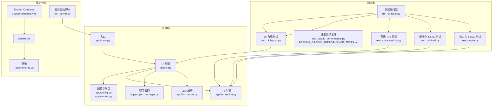
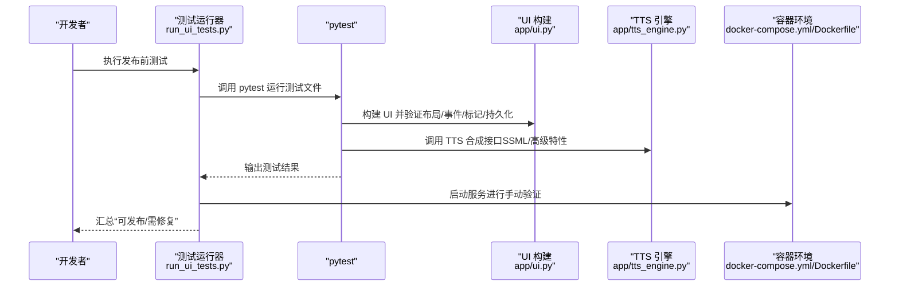
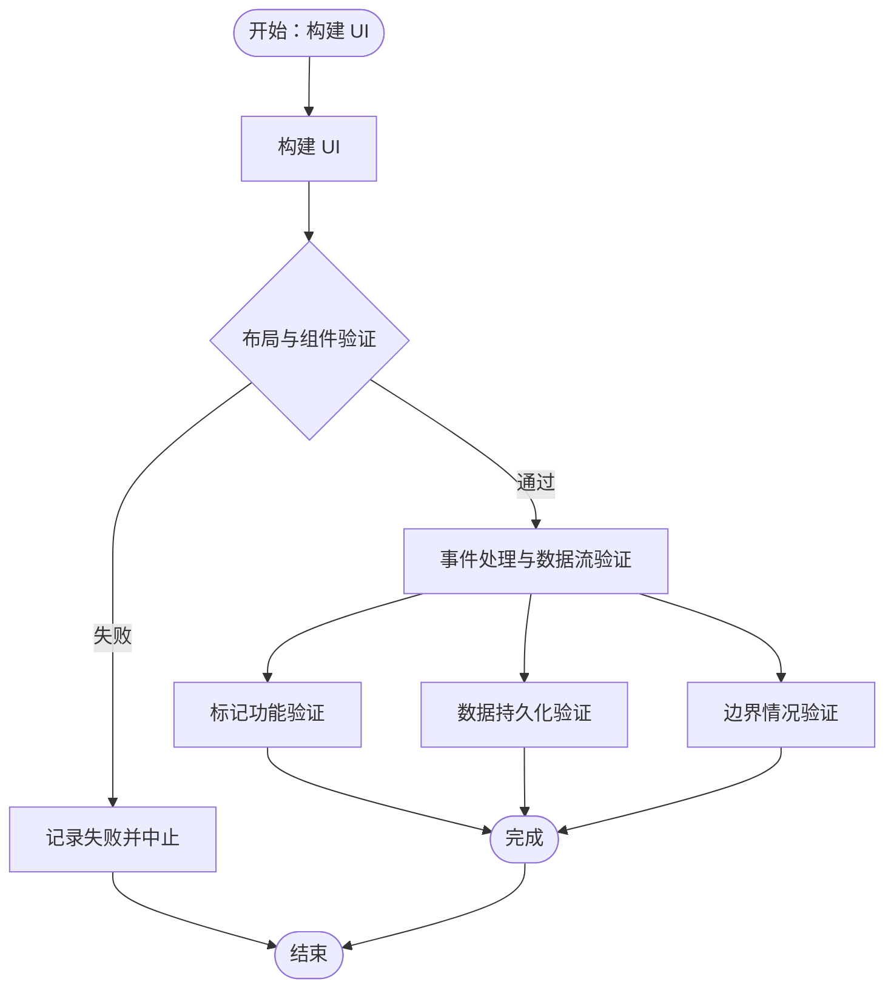
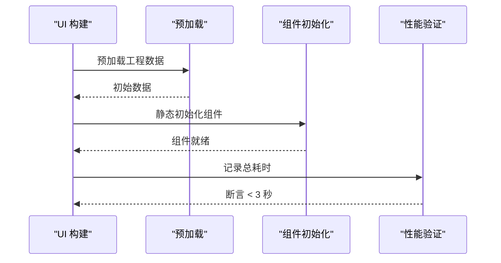
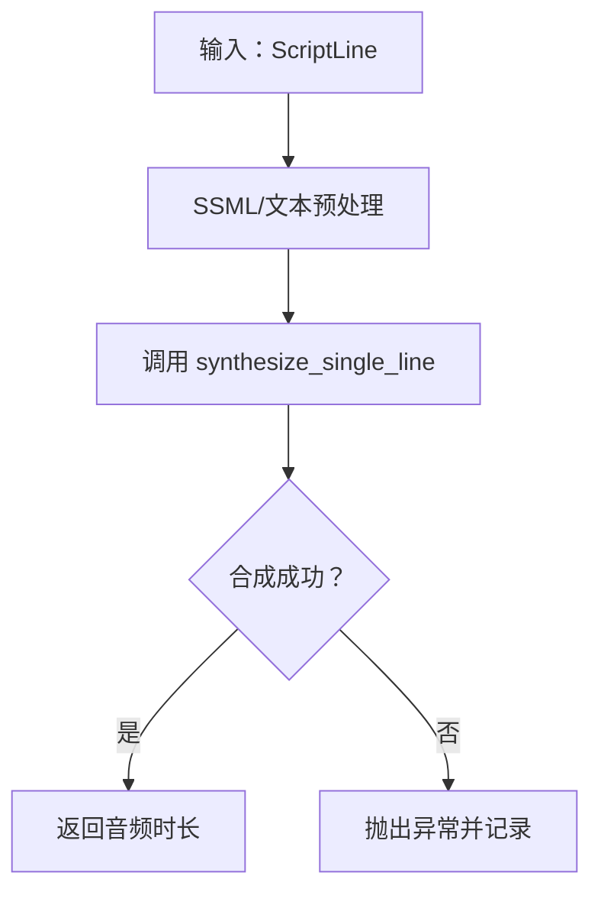
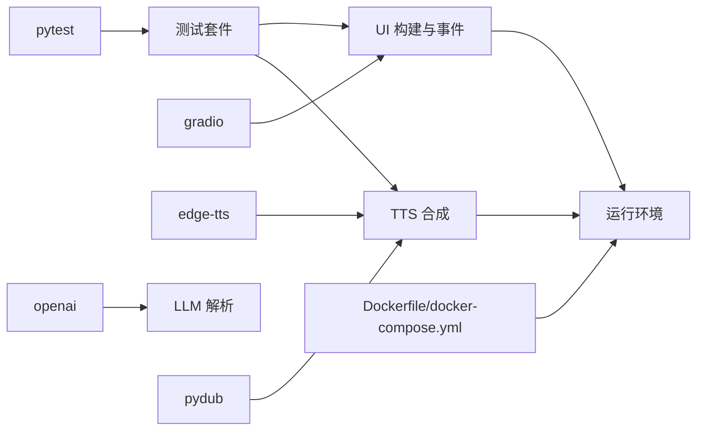

# 测试与质量保证

<cite>
**本文引用的文件**
- [README_GRADIO_PERFORMANCE_TESTS.md](file://tests/README_GRADIO_PERFORMANCE_TESTS.md)
- [RELEASE_CHECKLIST.md](file://docs/RELEASE_CHECKLIST.md)
- [run_server.py](file://run_server.py)
- [setup.sh](file://setup.sh)
- [requirements.txt](file://requirements.txt)
- [run_ui_tests.py](file://tests/run_ui_tests.py)
- [test_ui_layout.py](file://tests/test_ui_layout.py)
- [test_advanced_tts.py](file://tests/test_advanced_tts.py)
- [test_minimal.py](file://tests/test_minimal.py)
- [test_simple.py](file://tests/test_simple.py)
- [Dockerfile](file://Dockerfile)
- [docker-compose.yml](file://docker-compose.yml)
</cite>

## 目录
1. [简介](#简介)
2. [项目结构](#项目结构)
3. [核心组件](#核心组件)
4. [架构总览](#架构总览)
5. [详细组件分析](#详细组件分析)
6. [依赖关系分析](#依赖关系分析)
7. [性能考量](#性能考量)
8. [故障排除指南](#故障排除指南)
9. [结论](#结论)
10. [附录](#附录)

## 简介
本文件面向 TTS Studio 的测试与质量保证，系统化介绍单元测试、集成测试、端到端测试、UI 自动化测试与性能测试的实践方法；提供发布检查清单、测试覆盖率与代码质量标准建议、持续集成配置思路；并给出测试环境搭建、测试执行流程与结果分析方法，以及常见问题的诊断与解决策略。

## 项目结构
围绕测试与质量保证的关键目录与文件如下：
- tests：测试套件与测试运行器
- app：被测业务模块（UI、引擎、模型、项目管理等）
- docs：发布检查清单与相关文档
- docker-compose.yml 与 Dockerfile：容器化部署与测试环境
- requirements.txt：测试与运行依赖

图表来源
- [run_ui_tests.py:1-122](file://tests/run_ui_tests.py#L1-L122)
- [test_ui_layout.py:1-418](file://tests/test_ui_layout.py#L1-L418)
- [test_advanced_tts.py:1-110](file://tests/test_advanced_tts.py#L1-L110)
- [test_minimal.py:1-49](file://tests/test_minimal.py#L1-L49)
- [test_simple.py:1-34](file://tests/test_simple.py#L1-L34)
- [app/ui.py:288-526](file://app/ui.py#L288-L526)
- [app/tts_engine.py:133-215](file://app/tts_engine.py#L133-L215)
- [app/config.py:12-59](file://app/config.py#L12-L59)
- [app/models.py:61-107](file://app/models.py#L61-L107)
- [docker-compose.yml:1-32](file://docker-compose.yml#L1-L32)
- [Dockerfile:1-51](file://Dockerfile#L1-L51)
- [requirements.txt:1-16](file://requirements.txt#L1-L16)
- [run_server.py:1-5](file://run_server.py#L1-L5)

章节来源
- [run_ui_tests.py:1-122](file://tests/run_ui_tests.py#L1-L122)
- [docker-compose.yml:1-32](file://docker-compose.yml#L1-L32)
- [Dockerfile:1-51](file://Dockerfile#L1-L51)
- [requirements.txt:1-16](file://requirements.txt#L1-L16)

## 核心组件
- 测试运行器与发布检查
  - 发布前自动化测试运行器负责启动服务、运行 UI 与路由测试，并汇总结果。
  - 发布检查清单涵盖 UI 布局、事件处理、标记功能、数据持久化、边界情况与手动检查项。
- UI 与组件测试
  - UI 构建成功性、组件移除验证（Azure/代理）、Tab 结构、表格列数等。
  - 事件处理函数返回值一致性、数据格式与属性应用逻辑。
  - 标记功能（多音字标注、停顿插入、强调标记、清除标记）。
  - 数据持久化（表格编辑应用到音频片段）。
  - 边界情况（空表格、长文本截断、无效行索引）。
- 性能测试
  - 预加载初始数据、组件静态初始化、避免使用 demo.load、事件处理返回值对齐、向后兼容性、布局结构（Tabs vs Accordion）、组件值更新方式、异常处理与日志质量、完整加载周期。
- TTS 引擎与 SSML 测试
  - 最小化 SSML、纯文本、自定义 SSML（prosody、break）与高级 TTS（多语速/音调变化、复合样式与停顿、多音字拆分控制）。
- 基础设施与依赖
  - Dockerfile 与 docker-compose.yml 提供一致的测试与运行环境；requirements.txt 明确测试与运行依赖。

章节来源
- [run_ui_tests.py:1-122](file://tests/run_ui_tests.py#L1-L122)
- [RELEASE_CHECKLIST.md:1-168](file://docs/RELEASE_CHECKLIST.md#L1-L168)
- [test_ui_layout.py:1-418](file://tests/test_ui_layout.py#L1-L418)
- [README_GRADIO_PERFORMANCE_TESTS.md:1-437](file://tests/README_GRADIO_PERFORMANCE_TESTS.md#L1-L437)
- [test_advanced_tts.py:1-110](file://tests/test_advanced_tts.py#L1-L110)
- [test_minimal.py:1-49](file://tests/test_minimal.py#L1-L49)
- [test_simple.py:1-34](file://tests/test_simple.py#L1-L34)
- [Dockerfile:1-51](file://Dockerfile#L1-L51)
- [docker-compose.yml:1-32](file://docker-compose.yml#L1-L32)
- [requirements.txt:1-16](file://requirements.txt#L1-L16)

## 架构总览
测试体系由“测试运行器 → 单元/集成测试 → 被测模块 → 基础设施”构成，形成闭环的质量保障链路。

图表来源
- [run_ui_tests.py:1-122](file://tests/run_ui_tests.py#L1-L122)
- [test_ui_layout.py:1-418](file://tests/test_ui_layout.py#L1-L418)
- [test_advanced_tts.py:1-110](file://tests/test_advanced_tts.py#L1-L110)
- [app/ui.py:288-526](file://app/ui.py#L288-L526)
- [app/tts_engine.py:133-215](file://app/tts_engine.py#L133-L215)
- [docker-compose.yml:1-32](file://docker-compose.yml#L1-L32)
- [Dockerfile:1-51](file://Dockerfile#L1-L51)

## 详细组件分析

### 测试运行器与发布检查
- 发布前自动化测试运行器
  - 启动服务检查：导入并构建 UI，验证 UI 构建成功。
  - 运行测试：按序执行 UI 布局与路由测试，收集返回码并汇总结果。
  - 手动检查：列出需要人工验证的功能点（界面、功能、性能、错误处理）。
- 发布检查清单
  - 自动化测试：UI 布局、事件处理、标记功能、数据持久化、边界情况。
  - 手动检查：Tab 结构、Azure/代理移除、表格列数、各功能模块可用性、性能阈值、错误提示。
  - 快速发布与回滚流程：停止服务、运行测试、启动服务、回滚至上一版本。

章节来源
- [run_ui_tests.py:1-122](file://tests/run_ui_tests.py#L1-L122)
- [RELEASE_CHECKLIST.md:1-168](file://docs/RELEASE_CHECKLIST.md#L1-L168)

### UI 布局与事件处理测试
- UI 构建成功性：确保 UI 能够成功构建，避免导入或初始化异常。
- 组件移除验证：确认不再包含 Azure 相关组件与代理配置。
- Tab 结构：使用 Tabs 组织界面，避免深层 Accordion 嵌套。
- 表格列数：对白表格仅保留“角色”和“文本”两列。
- 事件处理：返回值数量与输出组件一致；选中行更新显示；应用属性逻辑正确。
- 标记功能：多音字标注（仅替换首个字符）、停顿插入、强调标记、清除所有标记。
- 数据持久化：表格编辑应用到 audio_clips。
- 边界情况：空表格、长文本截断、无效行索引处理。

图表来源
- [test_ui_layout.py:17-418](file://tests/test_ui_layout.py#L17-L418)

章节来源
- [test_ui_layout.py:1-418](file://tests/test_ui_layout.py#L1-L418)

### 性能测试套件
- 预加载初始数据：页面构建前预加载工程数据，包含必要字段。
- 组件静态初始化：在初始化时传入 value，避免运行时事件赋值。
- 避免使用 demo.load：减少 click handler 耗时与控制台警告。
- 事件处理返回值对齐：返回值数量与绑定输出组件一致。
- 向后兼容性：使用 getattr 处理缺失属性，兼容旧工程文件。
- 布局结构：使用 Tabs 作为顶级布局，Accordion 嵌套不超过 2 层。
- 组件值更新：避免在事件处理中手动赋值 .value，统一通过返回值更新。
- 异常处理与日志：预加载异常捕获、错误日志记录、默认值降级。
- 完整加载周期：端到端流程验证，性能阈值（< 3 秒）。

图表来源
- [README_GRADIO_PERFORMANCE_TESTS.md:1-437](file://tests/README_GRADIO_PERFORMANCE_TESTS.md#L1-L437)

章节来源
- [README_GRADIO_PERFORMANCE_TESTS.md:1-437](file://tests/README_GRADIO_PERFORMANCE_TESTS.md#L1-L437)

### TTS 引擎与 SSML 测试
- 最小化 SSML：验证最简 SSML 能成功合成。
- 纯文本：验证纯文本输入能成功合成。
- 自定义 SSML：验证 prosody（语速/音调）与 break（停顿）组合。
- 高级 TTS：验证多语速/音调变化、复合样式与停顿、多音字拆分控制。

图表来源
- [test_minimal.py:1-49](file://tests/test_minimal.py#L1-L49)
- [test_simple.py:1-34](file://tests/test_simple.py#L1-L34)
- [test_advanced_tts.py:1-110](file://tests/test_advanced_tts.py#L1-L110)
- [app/tts_engine.py:133-215](file://app/tts_engine.py#L133-L215)

章节来源
- [test_minimal.py:1-49](file://tests/test_minimal.py#L1-L49)
- [test_simple.py:1-34](file://tests/test_simple.py#L1-L34)
- [test_advanced_tts.py:1-110](file://tests/test_advanced_tts.py#L1-L110)
- [app/tts_engine.py:133-215](file://app/tts_engine.py#L133-L215)

### 端到端测试与 UI 自动化测试
- 端到端测试：通过测试运行器启动服务，结合 UI 构建与路由测试，验证完整流程。
- UI 自动化测试：基于 pytest 的组件级与行为级测试，覆盖布局、事件、标记与持久化。
- 性能测试：通过性能测试套件验证加载与交互性能，确保用户体验。

章节来源
- [run_ui_tests.py:1-122](file://tests/run_ui_tests.py#L1-L122)
- [test_ui_layout.py:1-418](file://tests/test_ui_layout.py#L1-L418)
- [README_GRADIO_PERFORMANCE_TESTS.md:1-437](file://tests/README_GRADIO_PERFORMANCE_TESTS.md#L1-L437)

## 依赖关系分析
- 测试依赖
  - pytest：测试框架与执行器。
  - gradio：UI 框架，驱动 UI 构建与事件处理。
  - edge-tts/openai/pydub：TTS 引擎与音频处理。
- 运行依赖
  - Dockerfile 与 docker-compose.yml：提供一致的运行环境与端口映射。
- 测试与运行依赖分离：requirements.txt 中明确测试依赖版本，确保可重复执行。

图表来源
- [requirements.txt:1-16](file://requirements.txt#L1-L16)
- [Dockerfile:1-51](file://Dockerfile#L1-L51)
- [docker-compose.yml:1-32](file://docker-compose.yml#L1-L32)

章节来源
- [requirements.txt:1-16](file://requirements.txt#L1-L16)
- [Dockerfile:1-51](file://Dockerfile#L1-L51)
- [docker-compose.yml:1-32](file://docker-compose.yml#L1-L32)

## 性能考量
- 加载性能
  - 预加载优于运行时加载，避免 demo.load 导致的延迟。
  - 组件静态初始化，减少运行时赋值。
  - Tabs 优先于深层 Accordion 嵌套。
- 事件处理
  - 返回值数量与输出组件一致，避免不匹配导致的错误。
  - 使用 getattr 处理旧工程文件属性缺失。
- 异常与日志
  - 预加载异常捕获与默认值降级，保证应用可启动。
  - 记录关键步骤日志，便于问题定位。
- 集成测试
  - 完整加载周期测试，记录总耗时并断言阈值（< 3 秒）。

章节来源
- [README_GRADIO_PERFORMANCE_TESTS.md:1-437](file://tests/README_GRADIO_PERFORMANCE_TESTS.md#L1-L437)

## 故障排除指南
- UI 构建失败
  - 现象：测试运行器提示 UI 构建失败。
  - 排查：检查 app/ui.py 的构建逻辑与依赖导入；确认容器环境已启动。
  - 处理：修复导入错误或依赖缺失，重新运行测试。
- 事件处理返回值不匹配
  - 现象：组件更新失败或报错。
  - 排查：核对事件处理函数返回值数量与绑定输出组件数量。
  - 处理：补齐或裁剪返回值，确保顺序一致。
- 组件值更新无效
  - 现象：事件处理中手动赋值 .value 无效。
  - 排查：确认未在事件处理中直接赋值，改为返回值更新。
  - 处理：仅在初始化时通过 value 参数设置，其余通过返回值更新。
- 预加载异常
  - 现象：工程文件加载失败或格式错误。
  - 排查：查看日志中的异常堆栈；确认文件存在且格式正确。
  - 处理：使用 try-except 捕获异常并降级为默认值，保证应用可启动。
- 性能不达标
  - 现象：UI 构建耗时超过阈值。
  - 排查：检查是否存在 demo.load、深层嵌套、不必要组件初始化。
  - 处理：采用预加载与静态初始化，扁平化布局，减少 DOM 操作。

章节来源
- [run_ui_tests.py:1-122](file://tests/run_ui_tests.py#L1-L122)
- [README_GRADIO_PERFORMANCE_TESTS.md:1-437](file://tests/README_GRADIO_PERFORMANCE_TESTS.md#L1-L437)

## 结论
通过“测试运行器 + 单元/集成/性能测试 + 发布检查清单”的闭环体系，TTS Studio 能够在每次发布前快速验证 UI 构建、事件处理、标记功能、数据持久化与性能表现。建议在持续集成中引入性能基线与覆盖率阈值，逐步完善自动化测试矩阵，确保高质量交付。

## 附录

### 测试环境搭建
- 本地环境
  - 安装依赖：根据 requirements.txt 安装测试与运行依赖。
  - 启动服务：使用 run_server.py 或 app/main.py 启动服务。
- 容器环境
  - 使用 docker-compose.yml 构建镜像并启动服务，映射端口 7860。
  - 确保数据卷挂载与环境变量配置正确。

章节来源
- [requirements.txt:1-16](file://requirements.txt#L1-L16)
- [run_server.py:1-5](file://run_server.py#L1-L5)
- [docker-compose.yml:1-32](file://docker-compose.yml#L1-L32)
- [Dockerfile:1-51](file://Dockerfile#L1-L51)

### 测试执行流程
- 发布前测试
  - 运行 run_ui_tests.py，依次执行 UI 构建检查与测试文件集合。
  - 根据输出判断是否通过，通过后进行手动检查。
- 性能测试
  - 运行 Gradio 性能测试套件，生成报告并对比阈值。
- TTS 测试
  - 运行最小化/自定义/高级 TTS 测试，验证合成结果与时长。

章节来源
- [run_ui_tests.py:1-122](file://tests/run_ui_tests.py#L1-L122)
- [README_GRADIO_PERFORMANCE_TESTS.md:333-358](file://tests/README_GRADIO_PERFORMANCE_TESTS.md#L333-L358)
- [test_minimal.py:1-49](file://tests/test_minimal.py#L1-L49)
- [test_simple.py:1-34](file://tests/test_simple.py#L1-L34)
- [test_advanced_tts.py:1-110](file://tests/test_advanced_tts.py#L1-L110)

### 结果分析方法
- 单元测试：关注断言通过率与异常日志，定位具体失败用例。
- 集成测试：结合 UI 构建耗时与组件初始化状态，评估整体性能。
- 性能测试：记录总耗时并对比历史基线，识别回归。
- 发布检查：对照清单逐项核验，确保功能与体验符合预期。

章节来源
- [RELEASE_CHECKLIST.md:1-168](file://docs/RELEASE_CHECKLIST.md#L1-L168)
- [README_GRADIO_PERFORMANCE_TESTS.md:1-437](file://tests/README_GRADIO_PERFORMANCE_TESTS.md#L1-L437)

### 测试覆盖率与代码质量标准（建议）
- 覆盖率要求
  - 关键路径（UI 构建、事件处理、TTS 合成、项目加载/保存）覆盖率不低于 80%。
  - 性能关键路径（预加载、组件初始化、渲染）覆盖率不低于 90%。
- 代码质量标准
  - 事件处理函数返回值与输出组件严格对齐。
  - 使用 getattr 处理属性兼容性，避免 AttributeError。
  - 预加载异常捕获与默认值降级，保证健壮性。
  - 日志记录关键步骤与上下文信息，便于排障。
- 持续集成配置
  - 在 CI 中执行 pytest、性能测试与发布检查清单。
  - 设置性能阈值告警与失败阻断，确保回归不被放行。

章节来源
- [README_GRADIO_PERFORMANCE_TESTS.md:361-437](file://tests/README_GRADIO_PERFORMANCE_TESTS.md#L361-L437)
- [RELEASE_CHECKLIST.md:1-168](file://docs/RELEASE_CHECKLIST.md#L1-L168)