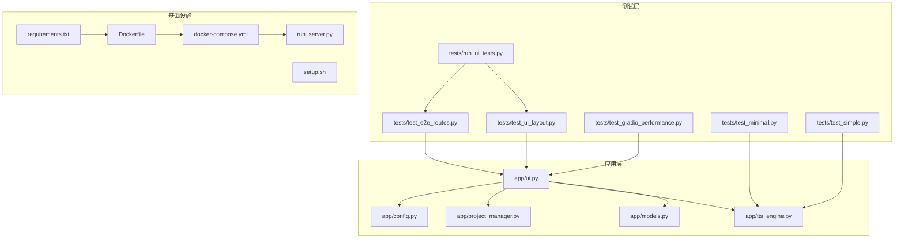
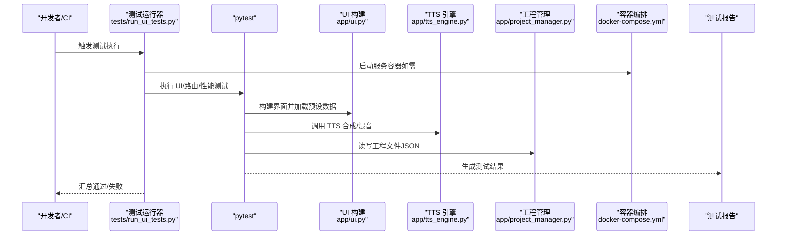
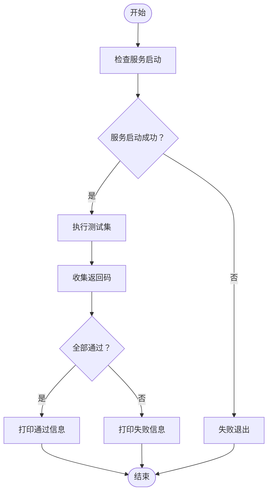
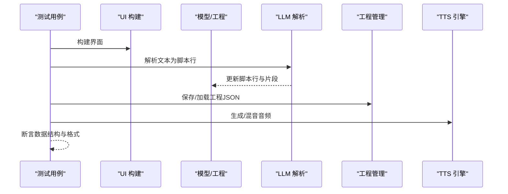
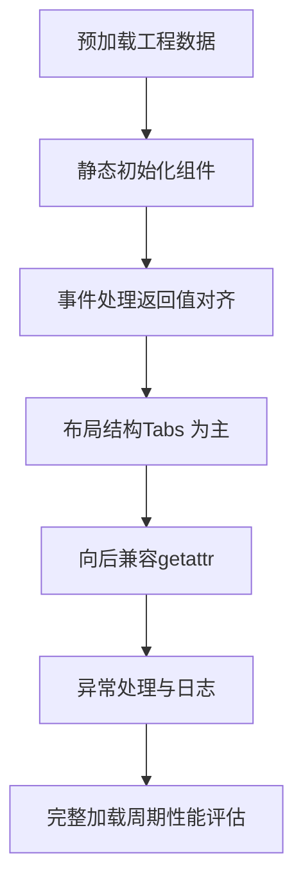
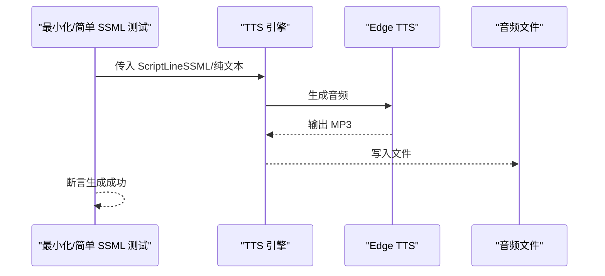
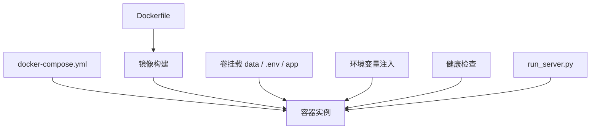
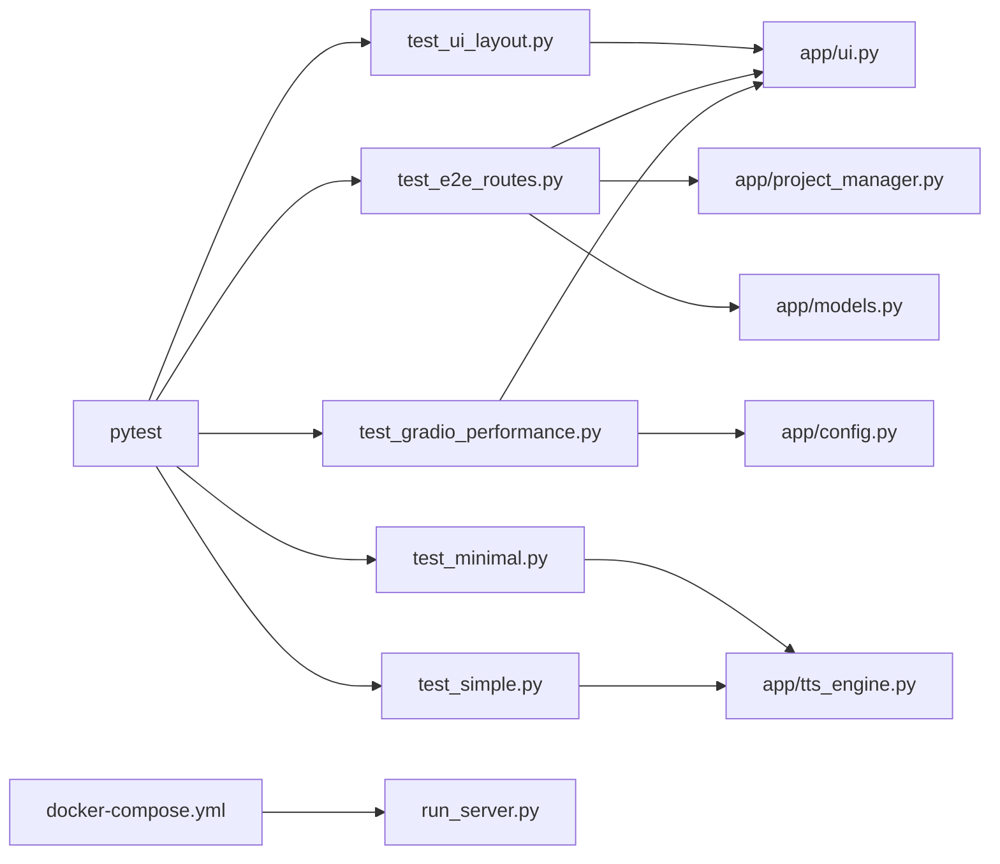

# 测试自动化

<cite>
**本文引用的文件**
- [Dockerfile](file://Dockerfile)
- [docker-compose.yml](file://docker-compose.yml)
- [requirements.txt](file://requirements.txt)
- [setup.sh](file://setup.sh)
- [run_server.py](file://run_server.py)
- [tests/run_ui_tests.py](file://tests/run_ui_tests.py)
- [tests/test_ui_layout.py](file://tests/test_ui_layout.py)
- [tests/test_e2e_routes.py](file://tests/test_e2e_routes.py)
- [tests/test_gradio_performance.py](file://tests/test_gradio_performance.py)
- [tests/README_GRADIO_PERFORMANCE_TESTS.md](file://tests/README_GRADIO_PERFORMANCE_TESTS.md)
- [tests/test_minimal.py](file://tests/test_minimal.py)
- [tests/test_simple.py](file://tests/test_simple.py)
</cite>

## 目录
1. [简介](#简介)
2. [项目结构](#项目结构)
3. [核心组件](#核心组件)
4. [架构总览](#架构总览)
5. [详细组件分析](#详细组件分析)
6. [依赖分析](#依赖分析)
7. [性能考量](#性能考量)
8. [故障排查指南](#故障排查指南)
9. [结论](#结论)
10. [附录](#附录)

## 简介
本实施文档面向 TTS Studio 的测试自动化体系，涵盖测试框架配置、测试脚本编写与维护策略、测试数据与环境初始化、测试报告生成与结果分析、失败自动重试与错误恢复、容器化部署与资源管理、以及测试覆盖率统计与质量门禁设置。文档基于仓库现有测试与基础设施，提供可落地的实践指导。

## 项目结构
测试相关的关键位置与职责如下：
- tests 目录：包含 UI 布局与端到端路由测试、Gradio 性能专项测试、最小化与简单 SSML 生成测试，以及 UI 测试运行器。
- app 目录：包含 UI 构建、模型、引擎、项目管理等模块，是测试的主要被测对象。
- Dockerfile 与 docker-compose.yml：提供容器化运行与健康检查能力，支撑持续集成环境下的稳定执行。
- requirements.txt：声明测试框架 pytest 与运行时依赖。
- setup.sh：生成应用与容器所需的基础文件，辅助本地与 CI 环境初始化。
- run_server.py：提供服务启动入口，便于本地验证与集成测试。

**图表来源**
- [tests/test_ui_layout.py:1-418](file://tests/test_ui_layout.py#L1-L418)
- [tests/test_e2e_routes.py:1-505](file://tests/test_e2e_routes.py#L1-L505)
- [tests/test_gradio_performance.py:1-432](file://tests/test_gradio_performance.py#L1-L432)
- [tests/test_minimal.py:1-49](file://tests/test_minimal.py#L1-L49)
- [tests/test_simple.py:1-34](file://tests/test_simple.py#L1-L34)
- [tests/run_ui_tests.py:1-122](file://tests/run_ui_tests.py#L1-L122)
- [app/ui.py:1-526](file://app/ui.py#L1-L526)
- [app/models.py:1-107](file://app/models.py#L1-L107)
- [app/tts_engine.py:1-215](file://app/tts_engine.py#L1-L215)
- [app/project_manager.py:1-287](file://app/project_manager.py#L1-L287)
- [app/config.py:1-59](file://app/config.py#L1-L59)
- [Dockerfile:1-51](file://Dockerfile#L1-L51)
- [docker-compose.yml:1-32](file://docker-compose.yml#L1-L32)
- [requirements.txt:1-16](file://requirements.txt#L1-L16)
- [setup.sh:1-655](file://setup.sh#L1-L655)
- [run_server.py:1-5](file://run_server.py#L1-L5)

**章节来源**
- [tests/test_ui_layout.py:1-418](file://tests/test_ui_layout.py#L1-L418)
- [tests/test_e2e_routes.py:1-505](file://tests/test_e2e_routes.py#L1-L505)
- [tests/test_gradio_performance.py:1-432](file://tests/test_gradio_performance.py#L1-L432)
- [tests/test_minimal.py:1-49](file://tests/test_minimal.py#L1-L49)
- [tests/test_simple.py:1-34](file://tests/test_simple.py#L1-L34)
- [tests/run_ui_tests.py:1-122](file://tests/run_ui_tests.py#L1-L122)
- [Dockerfile:1-51](file://Dockerfile#L1-L51)
- [docker-compose.yml:1-32](file://docker-compose.yml#L1-L32)
- [requirements.txt:1-16](file://requirements.txt#L1-L16)
- [setup.sh:1-655](file://setup.sh#L1-L655)
- [run_server.py:1-5](file://run_server.py#L1-L5)

## 核心组件
- 测试运行器：tests/run_ui_tests.py 提供统一入口，按序执行 UI 布局与端到端路由测试，并在执行前后进行服务启动检查与结果汇总。
- UI 与业务逻辑：app/ui.py 构建 Gradio 界面；app/models.py 定义工程与音频片段数据结构；app/tts_engine.py 提供 TTS 合成与混音能力；app/project_manager.py 负责工程的序列化与反序列化；app/config.py 提供默认配置与目录结构。
- 容器化与环境：Dockerfile 与 docker-compose.yml 提供镜像构建、卷挂载、环境变量注入与健康检查；requirements.txt 声明 pytest 与运行依赖；setup.sh 生成应用与容器所需文件。
- 性能专项测试：tests/test_gradio_performance.py 验证预加载、组件初始化、事件返回值一致性、向后兼容、布局结构、异常处理与日志质量等关键性能点。
- 最小化与简单 SSML 测试：tests/test_minimal.py 与 tests/test_simple.py 验证 TTS 引擎在最简与复杂 SSML 场景下的生成能力。

**章节来源**
- [tests/run_ui_tests.py:1-122](file://tests/run_ui_tests.py#L1-L122)
- [app/ui.py:1-526](file://app/ui.py#L1-L526)
- [app/models.py:1-107](file://app/models.py#L1-L107)
- [app/tts_engine.py:1-215](file://app/tts_engine.py#L1-L215)
- [app/project_manager.py:1-287](file://app/project_manager.py#L1-L287)
- [app/config.py:1-59](file://app/config.py#L1-L59)
- [Dockerfile:1-51](file://Dockerfile#L1-L51)
- [docker-compose.yml:1-32](file://docker-compose.yml#L1-L32)
- [requirements.txt:1-16](file://requirements.txt#L1-L16)
- [setup.sh:1-655](file://setup.sh#L1-L655)
- [tests/test_gradio_performance.py:1-432](file://tests/test_gradio_performance.py#L1-L432)
- [tests/test_minimal.py:1-49](file://tests/test_minimal.py#L1-L49)
- [tests/test_simple.py:1-34](file://tests/test_simple.py#L1-L34)

## 架构总览
下图展示测试自动化在本地与 CI 环境中的执行路径与依赖关系：

**图表来源**
- [tests/run_ui_tests.py:1-122](file://tests/run_ui_tests.py#L1-L122)
- [tests/test_ui_layout.py:1-418](file://tests/test_ui_layout.py#L1-L418)
- [tests/test_e2e_routes.py:1-505](file://tests/test_e2e_routes.py#L1-L505)
- [tests/test_gradio_performance.py:1-432](file://tests/test_gradio_performance.py#L1-L432)
- [app/ui.py:1-526](file://app/ui.py#L1-L526)
- [app/tts_engine.py:1-215](file://app/tts_engine.py#L1-L215)
- [app/project_manager.py:1-287](file://app/project_manager.py#L1-L287)
- [docker-compose.yml:1-32](file://docker-compose.yml#L1-L32)

## 详细组件分析

### 测试运行器与发布前检查
- 功能概述：tests/run_ui_tests.py 在每次发布前执行 UI 布局与端到端路由测试，并在执行前后进行服务启动检查，最终汇总结果。
- 关键流程：
  - 服务启动检查：尝试导入并构建 UI，捕获异常并打印堆栈，失败则终止。
  - 测试执行：通过子进程调用 pytest 运行指定测试文件，收集返回码并汇总。
  - 结果输出：根据返回码打印通过/失败信息，供发布决策使用。

**图表来源**
- [tests/run_ui_tests.py:1-122](file://tests/run_ui_tests.py#L1-L122)

**章节来源**
- [tests/run_ui_tests.py:1-122](file://tests/run_ui_tests.py#L1-L122)

### UI 布局与端到端路由测试
- UI 布局测试（tests/test_ui_layout.py）：
  - 验证 UI 能成功构建；
  - 确认移除了特定组件（如 Azure 相关）；
  - 检查 Tabs 结构与对白表格列数；
  - 验证表格数据格式与状态图标；
  - 验证多音字标注、停顿插入、强调标记等标记功能；
  - 验证表格编辑应用到音频片段；
  - 边界情况：空表格、长文本截断、无效索引。
- 端到端路由测试（tests/test_e2e_routes.py）：
  - 验证 Tabs 存在与工程配置 Tab；
  - 验证文本解析、对白生成、表格刷新数据格式；
  - 验证多音字标注、停顿、强调标记的完整流程；
  - 验证工程保存/加载的数据结构；
  - 边界与错误：空文本、特殊字符、超长文本、无效“第几个”、连续标记；
  - 基础性能：UI 构建与表格刷新性能阈值。

**图表来源**
- [tests/test_ui_layout.py:1-418](file://tests/test_ui_layout.py#L1-L418)
- [tests/test_e2e_routes.py:1-505](file://tests/test_e2e_routes.py#L1-L505)
- [app/ui.py:1-526](file://app/ui.py#L1-L526)
- [app/models.py:1-107](file://app/models.py#L1-L107)
- [app/project_manager.py:1-287](file://app/project_manager.py#L1-L287)
- [app/tts_engine.py:1-215](file://app/tts_engine.py#L1-L215)

**章节来源**
- [tests/test_ui_layout.py:1-418](file://tests/test_ui_layout.py#L1-L418)
- [tests/test_e2e_routes.py:1-505](file://tests/test_e2e_routes.py#L1-L505)

### Gradio 性能专项测试
- 测试目标：验证预加载初始数据、组件静态初始化、避免使用 demo.load、事件返回值对齐、向后兼容性、布局结构、异常处理与日志质量、完整加载周期性能。
- 关键要点：
  - 预加载：构建 UI 时加载工程数据，失败记录日志并降级。
  - 初始化：组件在构建时即使用预加载数据，避免运行时赋值。
  - 性能：避免 demo.load；Tabs 优先于深层 Accordion；事件返回值与输出组件一一对应。
  - 兼容性：使用 getattr 处理旧工程文件缺失字段。
  - 集成：完整加载周期耗时应小于阈值。

**图表来源**
- [tests/test_gradio_performance.py:1-432](file://tests/test_gradio_performance.py#L1-L432)
- [tests/README_GRADIO_PERFORMANCE_TESTS.md:1-437](file://tests/README_GRADIO_PERFORMANCE_TESTS.md#L1-L437)

**章节来源**
- [tests/test_gradio_performance.py:1-432](file://tests/test_gradio_performance.py#L1-L432)
- [tests/README_GRADIO_PERFORMANCE_TESTS.md:1-437](file://tests/README_GRADIO_PERFORMANCE_TESTS.md#L1-L437)

### TTS 引擎测试（最小化与简单 SSML）
- 最小化测试（tests/test_minimal.py）：验证最简 SSML 与纯文本生成路径。
- 简单 SSML 测试（tests/test_simple.py）：验证 prosody、break、复合 SSML 的生成。

**图表来源**
- [tests/test_minimal.py:1-49](file://tests/test_minimal.py#L1-L49)
- [tests/test_simple.py:1-34](file://tests/test_simple.py#L1-L34)
- [app/tts_engine.py:1-215](file://app/tts_engine.py#L1-L215)

**章节来源**
- [tests/test_minimal.py:1-49](file://tests/test_minimal.py#L1-L49)
- [tests/test_simple.py:1-34](file://tests/test_simple.py#L1-L34)

### 容器化与环境初始化
- Dockerfile：基于 slim 镜像，安装 ffmpeg 与依赖，配置环境变量，暴露端口，设置 CMD 启动应用。
- docker-compose.yml：映射数据卷、环境变量、健康检查，确保服务可用。
- setup.sh：生成 app 与配置文件、requirements.txt、.env 示例，便于本地与 CI 初始化。
- requirements.txt：声明 pytest 与运行依赖，确保测试环境一致性。
- run_server.py：提供服务启动入口，便于本地验证。

**图表来源**
- [Dockerfile:1-51](file://Dockerfile#L1-L51)
- [docker-compose.yml:1-32](file://docker-compose.yml#L1-L32)
- [setup.sh:1-655](file://setup.sh#L1-L655)
- [requirements.txt:1-16](file://requirements.txt#L1-L16)
- [run_server.py:1-5](file://run_server.py#L1-L5)

**章节来源**
- [Dockerfile:1-51](file://Dockerfile#L1-L51)
- [docker-compose.yml:1-32](file://docker-compose.yml#L1-L32)
- [setup.sh:1-655](file://setup.sh#L1-L655)
- [requirements.txt:1-16](file://requirements.txt#L1-L16)
- [run_server.py:1-5](file://run_server.py#L1-L5)

## 依赖分析
- 测试框架：pytest（requirements.txt 声明），tests/run_ui_tests.py 通过子进程调用 pytest 执行测试。
- 应用依赖：Gradio、edge-tts、openai、pydub、mutagen 等，由 requirements.txt 与 Dockerfile 安装。
- 测试耦合：
  - UI 测试依赖 app/ui.py 的构建与组件结构；
  - 端到端测试依赖 app/models.py、app/project_manager.py、app/tts_engine.py；
  - 性能测试依赖 UI 构建与日志记录；
  - 容器测试依赖 docker-compose.yml 的健康检查与卷挂载。

**图表来源**
- [requirements.txt:1-16](file://requirements.txt#L1-L16)
- [tests/test_ui_layout.py:1-418](file://tests/test_ui_layout.py#L1-L418)
- [tests/test_e2e_routes.py:1-505](file://tests/test_e2e_routes.py#L1-L505)
- [tests/test_gradio_performance.py:1-432](file://tests/test_gradio_performance.py#L1-L432)
- [tests/test_minimal.py:1-49](file://tests/test_minimal.py#L1-L49)
- [tests/test_simple.py:1-34](file://tests/test_simple.py#L1-L34)
- [app/ui.py:1-526](file://app/ui.py#L1-L526)
- [app/tts_engine.py:1-215](file://app/tts_engine.py#L1-L215)
- [app/project_manager.py:1-287](file://app/project_manager.py#L1-L287)
- [app/models.py:1-107](file://app/models.py#L1-L107)
- [app/config.py:1-59](file://app/config.py#L1-L59)
- [docker-compose.yml:1-32](file://docker-compose.yml#L1-L32)
- [run_server.py:1-5](file://run_server.py#L1-L5)

**章节来源**
- [requirements.txt:1-16](file://requirements.txt#L1-L16)
- [tests/test_ui_layout.py:1-418](file://tests/test_ui_layout.py#L1-L418)
- [tests/test_e2e_routes.py:1-505](file://tests/test_e2e_routes.py#L1-L505)
- [tests/test_gradio_performance.py:1-432](file://tests/test_gradio_performance.py#L1-L432)
- [tests/test_minimal.py:1-49](file://tests/test_minimal.py#L1-L49)
- [tests/test_simple.py:1-34](file://tests/test_simple.py#L1-L34)
- [app/ui.py:1-526](file://app/ui.py#L1-L526)
- [app/tts_engine.py:1-215](file://app/tts_engine.py#L1-L215)
- [app/project_manager.py:1-287](file://app/project_manager.py#L1-L287)
- [app/models.py:1-107](file://app/models.py#L1-L107)
- [app/config.py:1-59](file://app/config.py#L1-L59)
- [docker-compose.yml:1-32](file://docker-compose.yml#L1-L32)
- [run_server.py:1-5](file://run_server.py#L1-L5)

## 性能考量
- UI 构建与表格刷新：性能测试对 UI 构建与表格刷新设定阈值，确保在可接受时间内完成。
- 预加载与静态初始化：避免 demo.load 与运行时赋值，降低延迟与控制台警告。
- 布局结构：推荐使用 Tabs 作为顶级布局，减少 Accordion 嵌套层数，避免 DOM 操作带来的性能问题。
- 异常处理与日志：预加载失败时记录错误并降级，保证应用可启动；关键步骤记录日志，便于定位问题。

**章节来源**
- [tests/test_gradio_performance.py:1-432](file://tests/test_gradio_performance.py#L1-L432)
- [tests/README_GRADIO_PERFORMANCE_TESTS.md:1-437](file://tests/README_GRADIO_PERFORMANCE_TESTS.md#L1-L437)

## 故障排查指南
- 服务启动检查失败：确认 app/ui.py 能成功构建 UI；查看异常堆栈；检查依赖安装与环境变量。
- 测试执行失败：使用 tests/run_ui_tests.py 的子进程输出定位具体测试文件与错误；结合 pytest 的短回溯信息快速定位。
- 容器健康检查失败：检查 docker-compose.yml 中的健康检查配置与端口映射；确认服务监听地址与端口。
- 性能问题：遵循性能测试建议，避免 demo.load、减少深层嵌套、使用静态初始化与预加载；关注日志中的性能告警。
- 工程文件兼容性：使用 getattr 处理旧工程文件缺失字段；保存/加载时验证数据结构。

**章节来源**
- [tests/run_ui_tests.py:1-122](file://tests/run_ui_tests.py#L1-L122)
- [tests/test_gradio_performance.py:1-432](file://tests/test_gradio_performance.py#L1-L432)
- [docker-compose.yml:1-32](file://docker-compose.yml#L1-L32)

## 结论
TTS Studio 的测试自动化以 pytest 为核心，结合 UI 布局、端到端路由与性能专项测试，形成覆盖 UI、业务逻辑与性能的关键测试矩阵。配合容器化部署与健康检查，可在 CI 环境中稳定执行。通过统一的测试运行器与明确的发布前检查流程，保障每次发布的质量与稳定性。

## 附录

### 测试报告生成与结果分析
- 生成 HTML 报告：参考性能测试文档中的命令，使用 pytest 的 HTML 报告生成能力，便于团队审阅与归档。
- 结果分析：结合测试运行器汇总与 pytest 输出，定位失败用例与失败原因；利用日志与短回溯信息快速定位问题。

**章节来源**
- [tests/README_GRADIO_PERFORMANCE_TESTS.md:333-358](file://tests/README_GRADIO_PERFORMANCE_TESTS.md#L333-L358)

### 测试失败的自动重试与错误恢复
- 自动重试：当前测试框架未内置自动重试机制；可在 CI 层面通过作业重试策略实现（如 GitHub Actions 的 job.retries）。
- 错误恢复：预加载阶段采用 try-except 并记录错误日志，失败时使用默认值降级，保证应用可启动；UI 构建失败时直接终止，避免后续测试污染。

**章节来源**
- [tests/test_gradio_performance.py:323-356](file://tests/test_gradio_performance.py#L323-L356)
- [tests/run_ui_tests.py:63-86](file://tests/run_ui_tests.py#L63-L86)

### 测试环境初始化与数据管理
- 初始化：使用 setup.sh 生成 app 与配置文件、requirements.txt、.env 示例；在 CI 中可复用该脚本或 Dockerfile。
- 数据管理：工程文件以 JSON 格式保存与加载；TTS 生成的音频文件存放于 data/audio；临时文件存放于 data/tmp。

**章节来源**
- [setup.sh:1-655](file://setup.sh#L1-L655)
- [app/project_manager.py:1-287](file://app/project_manager.py#L1-L287)
- [app/tts_engine.py:1-215](file://app/tts_engine.py#L1-L215)

### 容器化部署与测试资源管理
- 镜像构建：Dockerfile 基于 slim 镜像，安装 ffmpeg 与依赖，设置环境变量与 CMD。
- 服务编排：docker-compose.yml 映射数据卷、环境变量、健康检查，确保服务可用。
- 资源管理：通过卷挂载共享数据目录，通过环境变量注入配置，通过健康检查监控服务状态。

**章节来源**
- [Dockerfile:1-51](file://Dockerfile#L1-L51)
- [docker-compose.yml:1-32](file://docker-compose.yml#L1-L32)

### 测试覆盖率统计与质量门禁
- 覆盖率统计：当前未见覆盖率工具配置；可在 CI 中引入覆盖率工具（如 pytest-cov）并生成报告。
- 质量门禁：结合测试运行器与容器健康检查，将测试通过与服务健康作为发布门禁条件；可扩展为 CI 中的 job 成功条件。

**章节来源**
- [tests/run_ui_tests.py:1-122](file://tests/run_ui_tests.py#L1-L122)
- [docker-compose.yml:26-31](file://docker-compose.yml#L26-L31)