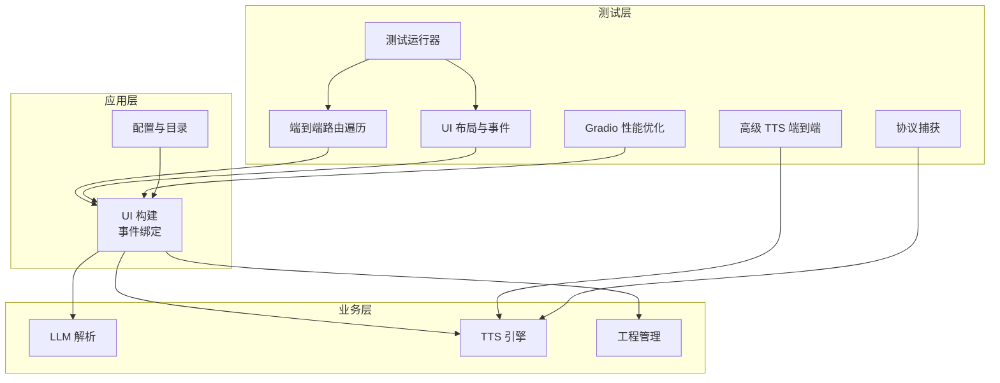
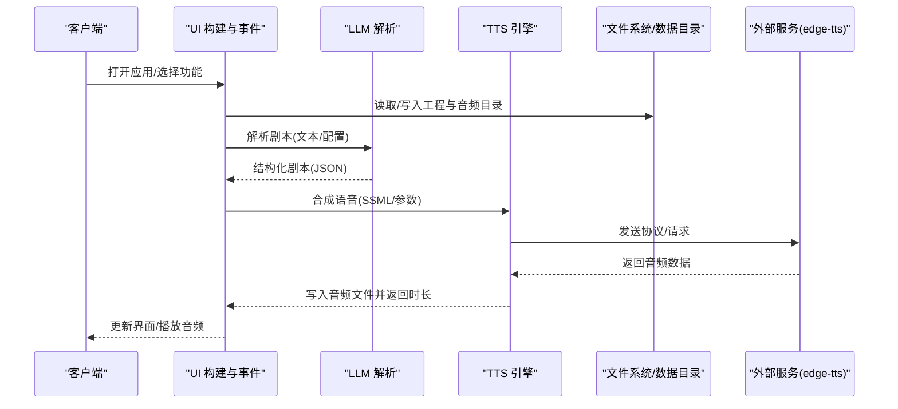
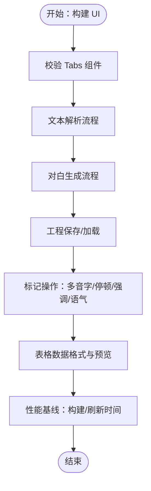
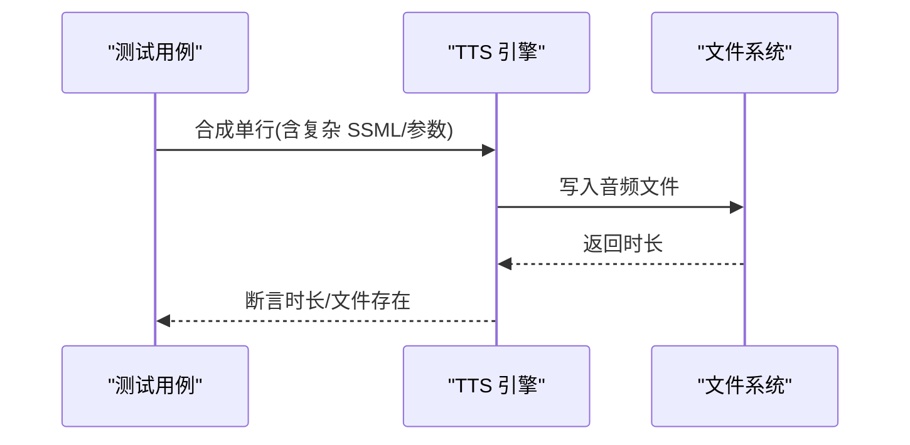
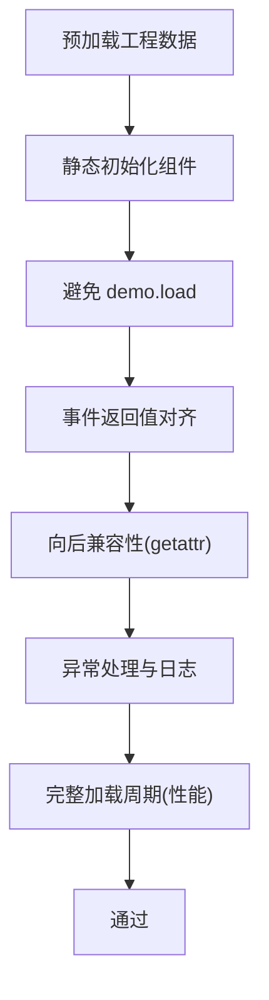
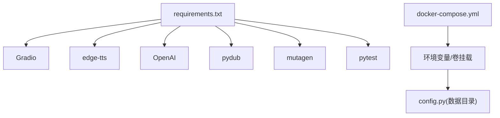

# 集成测试

<cite>
**本文引用的文件**   
- [app/main.py](file://app/main.py)
- [app/config.py](file://app/config.py)
- [app/ui.py](file://app/ui.py)
- [app/models.py](file://app/models.py)
- [app/llm_parser.py](file://app/llm_parser.py)
- [app/tts_engine.py](file://app/tts_engine.py)
- [app/project_manager.py](file://app/project_manager.py)
- [tests/test_e2e_routes.py](file://tests/test_e2e_routes.py)
- [tests/test_advanced_tts_e2e.py](file://tests/test_advanced_tts_e2e.py)
- [tests/run_ui_tests.py](file://tests/run_ui_tests.py)
- [tests/test_ui_layout.py](file://tests/test_ui_layout.py)
- [tests/test_gradio_performance.py](file://tests/test_gradio_performance.py)
- [tests/test_minimal.py](file://tests/test_minimal.py)
- [tests/test_ssml.py](file://tests/test_ssml.py)
- [tests/test_protocol.py](file://tests/test_protocol.py)
- [requirements.txt](file://requirements.txt)
- [docker-compose.yml](file://docker-compose.yml)
- [setup.sh](file://setup.sh)
</cite>

## 目录
1. [简介](#简介)
2. [项目结构](#项目结构)
3. [核心组件](#核心组件)
4. [架构总览](#架构总览)
5. [详细组件分析](#详细组件分析)
6. [依赖分析](#依赖分析)
7. [性能考量](#性能考量)
8. [故障排查指南](#故障排查指南)
9. [结论](#结论)
10. [附录](#附录)

## 简介
本文件面向 TTS Studio 的集成测试实践，系统化阐述端到端测试、UI 自动化测试策略、API 路由与网络通信测试方法，并提供测试环境搭建、测试数据库与外部服务模拟、测试数据管理与环境隔离、以及测试结果分析与问题定位的方法论。文档基于仓库现有测试用例与实现进行归纳总结，帮助研发与测试人员高效落地高质量的集成测试。

## 项目结构
- 应用入口与服务启动：通过 Gradio 构建 UI 并对外提供服务，监听本地端口。
- 核心模块：
  - 配置与数据目录：统一管理数据、音频与工程目录，区分容器与本机环境。
  - UI 构建与事件：集中于 UI 模块，负责工程管理、文本解析、对白编辑、混音输出等。
  - LLM 解析：调用外部 LLM 将自然语言解析为结构化剧本。
  - TTS 引擎：基于 edge-tts 合成语音，支持 SSML 与音色参数。
  - 工程管理：序列化/反序列化工程数据，支持多音轨与音效。
- 测试体系：
  - 端到端路由遍历：覆盖 UI 构建、数据流、标记操作、工程管理与边界情况。
  - 高级 TTS 端到端：验证复杂 SSML、速率/音调组合与多音字处理。
  - UI 布局与事件：校验 UI 结构、组件初始化、事件返回值一致性与边界处理。
  - Gradio 性能优化：预加载、静态初始化、避免 demo.load、事件返回值对齐、兼容性与异常处理。
  - 协议捕获：通过 monkey patch 捕获 edge-tts 发送的原始协议数据，辅助网络通信验证。
  - 运行器：一键运行 UI 相关测试并进行服务启动检查。

**图表来源**
- [app/ui.py:13-1858](file://app/ui.py#L13-L1858)
- [app/config.py:1-74](file://app/config.py#L1-L74)
- [tests/test_e2e_routes.py:1-505](file://tests/test_e2e_routes.py#L1-L505)
- [tests/test_advanced_tts_e2e.py:1-123](file://tests/test_advanced_tts_e2e.py#L1-L123)
- [tests/test_ui_layout.py:1-418](file://tests/test_ui_layout.py#L1-L418)
- [tests/test_gradio_performance.py:1-432](file://tests/test_gradio_performance.py#L1-L432)
- [tests/test_protocol.py:1-61](file://tests/test_protocol.py#L1-L61)
- [tests/run_ui_tests.py:1-122](file://tests/run_ui_tests.py#L1-L122)

**章节来源**
- [app/main.py:1-51](file://app/main.py#L1-L51)
- [app/config.py:1-74](file://app/config.py#L1-L74)
- [app/ui.py:13-1858](file://app/ui.py#L13-L1858)
- [tests/test_e2e_routes.py:1-505](file://tests/test_e2e_routes.py#L1-L505)
- [tests/test_ui_layout.py:1-418](file://tests/test_ui_layout.py#L1-L418)
- [tests/test_gradio_performance.py:1-432](file://tests/test_gradio_performance.py#L1-L432)
- [tests/test_protocol.py:1-61](file://tests/test_protocol.py#L1-L61)
- [tests/run_ui_tests.py:1-122](file://tests/run_ui_tests.py#L1-L122)

## 核心组件
- UI 构建与事件处理：集中于 UI 模块，包含工程与配置、文本解析、对白编辑、混音输出四大 Tab，以及 LLM 配置、角色管理、标记编辑、音轨添加等子功能；通过事件绑定实现端到端工作流。
- 配置与目录：根据运行环境（容器/本机）自动选择数据目录，确保音频与工程文件的读写权限与路径一致性。
- LLM 解析：封装 OpenAI 客户端调用，将输入文本解析为结构化剧本，供后续对白生成使用。
- TTS 引擎：基于 edge-tts 合成语音，支持 SSML、prosody、phoneme、break、emphasis 等标签，异步生成并计算音频时长。
- 工程管理：将工程序列化为 JSON，支持 audio/bgm/sfx 多轨与角色配置，加载时进行向后兼容处理。

**章节来源**
- [app/ui.py:13-1858](file://app/ui.py#L13-L1858)
- [app/config.py:1-74](file://app/config.py#L1-L74)
- [app/llm_parser.py:117-130](file://app/llm_parser.py#L117-L130)
- [app/tts_engine.py:144-215](file://app/tts_engine.py#L144-L215)
- [app/project_manager.py:249-286](file://app/project_manager.py#L249-L286)

## 架构总览
下图展示从 UI 到引擎再到外部服务的端到端调用链路，以及测试覆盖的关键节点。

**图表来源**
- [app/ui.py:442-750](file://app/ui.py#L442-L750)
- [app/llm_parser.py:117-130](file://app/llm_parser.py#L117-L130)
- [app/tts_engine.py:144-171](file://app/tts_engine.py#L144-L171)
- [app/config.py:13-26](file://app/config.py#L13-L26)

## 详细组件分析

### 端到端路由遍历测试（UI 与数据流）
- 目标：验证 UI 构建、Tabs 结构、数据解析、对白生成、工程保存/加载、标记操作（多音字、停顿、强调、语气）与边界情况。
- 关键点：
  - UI 构建成功与 Tabs 存在性校验。
  - 文本解析流程与对白生成流程的正确性。
  - 表格数据格式与预览逻辑。
  - 标记插入与清理、连续标记处理。
  - 工程保存/加载的数据结构一致性。
  - 性能基线：UI 构建与表格刷新时间阈值。
- 测试覆盖：
  - UI 导航与布局验证。
  - 数据流与事件处理验证。
  - 标记工作流与边界处理。
  - 工程持久化与加载。
  - 性能基线与告警。

**图表来源**
- [tests/test_e2e_routes.py:17-501](file://tests/test_e2e_routes.py#L17-L501)

**章节来源**
- [tests/test_e2e_routes.py:17-501](file://tests/test_e2e_routes.py#L17-L501)

### 高级 TTS 端到端测试
- 目标：验证复杂 SSML、速率/音调组合、多音字处理与自动拆分拼接。
- 关键点：
  - 多片段（慢-快）与多音字标注的合成。
  - 速率与音调叠加场景的时长计算。
  - 纯文本模式下多音字由引擎自动处理。
- 测试流程：构造 ScriptLine，调用异步合成接口，断言时长与文件生成。

**图表来源**
- [tests/test_advanced_tts_e2e.py:10-119](file://tests/test_advanced_tts_e2e.py#L10-L119)
- [app/tts_engine.py:144-171](file://app/tts_engine.py#L144-L171)

**章节来源**
- [tests/test_advanced_tts_e2e.py:1-123](file://tests/test_advanced_tts_e2e.py#L1-L123)
- [app/tts_engine.py:144-171](file://app/tts_engine.py#L144-L171)

### UI 布局与事件测试
- 目标：验证 UI 结构、组件初始化、事件返回值一致性、边界处理与兼容性。
- 关键点：
  - Tabs 结构与组件列数校验。
  - 刷新表格数据格式与预览逻辑。
  - 选中行与属性应用逻辑。
  - 标记添加/清除与正则清理。
  - 表格编辑到音频片段同步。
  - 边界：空片段、长文本截断、无效索引。
- 测试策略：通过构建 UI 获取组件与函数，构造测试数据，断言返回值与状态。

**章节来源**
- [tests/test_ui_layout.py:17-418](file://tests/test_ui_layout.py#L17-L418)
- [app/ui.py:442-750](file://app/ui.py#L442-L750)

### Gradio 性能优化测试
- 目标：验证预加载、静态初始化、避免 demo.load、事件返回值对齐、兼容性与异常处理、日志质量与完整加载周期。
- 关键点：
  - 预加载工程数据并在组件初始化时直接传入 value。
  - 避免使用 demo.load，采用静态初始化方案。
  - 事件处理函数返回值数量与绑定组件一致。
  - 使用 getattr 处理旧工程文件缺失属性的兼容性。
  - 异常处理与日志记录质量。
  - 完整加载周期性能阈值（<3 秒）。

**图表来源**
- [tests/test_gradio_performance.py:24-428](file://tests/test_gradio_performance.py#L24-L428)
- [app/ui.py:13-143](file://app/ui.py#L13-L143)

**章节来源**
- [tests/test_gradio_performance.py:24-432](file://tests/test_gradio_performance.py#L24-L432)
- [app/ui.py:13-143](file://app/ui.py#L13-L143)

### 协议捕获与网络通信测试
- 目标：验证与外部服务（edge-tts）的网络通信，捕获原始协议消息，辅助定位网络层问题。
- 方法：通过 monkey patch 拦截 edge-tts 的 WebSocket 发送方法，打印并收集消息，结合合成流程断言成功/失败。
- 适用场景：调试协议格式、定位网络异常、验证消息完整性。

**章节来源**
- [tests/test_protocol.py:16-26](file://tests/test_protocol.py#L16-L26)
- [app/tts_engine.py:167-168](file://app/tts_engine.py#L167-L168)

### 测试运行器与服务启动检查
- 目标：一键运行 UI 相关测试并检查服务启动。
- 流程：检查 UI 构建成功 → 运行指定测试文件 → 输出汇总结果。

**章节来源**
- [tests/run_ui_tests.py:9-122](file://tests/run_ui_tests.py#L9-L122)

## 依赖分析
- 外部依赖：Gradio、edge-tts、OpenAI SDK、pydub、mutagen、pytest。
- 容器与本机差异：数据目录与环境变量在容器/本机环境下自动切换，确保测试与生产一致。
- 事件耦合：UI 事件与业务模块（LLM/TTS/工程管理）松耦合，通过函数调用与返回值传递状态。

**图表来源**
- [requirements.txt:1-16](file://requirements.txt#L1-L16)
- [docker-compose.yml:1-32](file://docker-compose.yml#L1-L32)
- [app/config.py:1-74](file://app/config.py#L1-L74)

**章节来源**
- [requirements.txt:1-16](file://requirements.txt#L1-L16)
- [docker-compose.yml:1-32](file://docker-compose.yml#L1-L32)
- [app/config.py:1-74](file://app/config.py#L1-L74)

## 性能考量
- UI 构建与刷新：通过预加载与静态初始化减少首次渲染与交互延迟；表格刷新在大数据量下仍需控制在合理阈值内。
- 事件处理：避免在事件中直接赋值组件 .value，统一通过返回值更新；确保返回值数量与绑定组件一致。
- 兼容性：使用 getattr 提供默认值，避免旧工程文件缺失字段导致异常。
- 日志：关键步骤记录日志，便于性能分析与问题定位。

[本节为通用指导，无需特定文件引用]

## 故障排查指南
- UI 构建失败：检查 UI 构建函数是否抛错，确认依赖安装与环境变量。
- 预加载异常：查看日志中“预加载失败”记录，确认工程文件格式与路径。
- 事件返回值不匹配：核对事件函数返回值数量与绑定组件数量，修正返回顺序。
- 表格编辑无效：确认编辑后同步逻辑是否执行，检查行索引与数据映射。
- 网络通信问题：启用协议捕获测试，观察发送的消息格式与长度，定位异常。
- 性能异常：关注 UI 构建与表格刷新耗时，优化数据量与渲染策略。

**章节来源**
- [tests/test_gradio_performance.py:323-355](file://tests/test_gradio_performance.py#L323-L355)
- [tests/test_protocol.py:16-26](file://tests/test_protocol.py#L16-L26)
- [tests/test_ui_layout.py:380-414](file://tests/test_ui_layout.py#L380-L414)

## 结论
本集成测试体系围绕 UI、数据流、引擎与外部服务四个维度构建，既覆盖端到端工作流，又针对性能与稳定性进行专项验证。通过预加载、静态初始化与事件返回值对齐等手段，显著提升 UI 性能与可靠性；通过协议捕获与最小化测试，增强网络通信与基础能力的可观测性。建议在持续集成中固定运行性能测试与 UI 布局测试，配合发布前运行器进行端到端验证，保障交付质量。

[本节为总结性内容，无需特定文件引用]

## 附录

### 集成测试环境搭建指南
- 依赖安装：使用项目提供的依赖清单安装核心依赖。
- 容器部署：通过 docker-compose 启动服务，映射数据目录与环境变量，健康检查确保端口可用。
- 本机开发：使用 setup 脚本生成核心模块与配置，确保数据目录存在。
- 服务启动：通过应用入口启动 Gradio 服务，默认监听 7860 端口。

**章节来源**
- [requirements.txt:1-16](file://requirements.txt#L1-L16)
- [docker-compose.yml:1-32](file://docker-compose.yml#L1-L32)
- [setup.sh:542-595](file://setup.sh#L542-L595)
- [app/main.py:15-51](file://app/main.py#L15-L51)

### 测试数据库与外部服务模拟
- 工程与音频数据：通过工程管理模块读写 JSON 文件与音频文件，无需专用数据库。
- 外部服务：LLM 与 TTS 依赖外部服务，可通过环境变量配置 API Base/Key/Model；协议捕获测试可用于验证网络通信。

**章节来源**
- [app/project_manager.py:249-286](file://app/project_manager.py#L249-L286)
- [app/llm_parser.py:117-130](file://app/llm_parser.py#L117-L130)
- [app/tts_engine.py:144-171](file://app/tts_engine.py#L144-L171)
- [tests/test_protocol.py:16-26](file://tests/test_protocol.py#L16-L26)

### 测试数据管理与环境隔离
- 数据目录：容器与本机分别指向不同路径，确保测试与生产隔离。
- 工程文件：以 JSON 形式保存，支持向后兼容与增量扩展。
- 环境变量：通过 .env 与 docker-compose 注入，避免硬编码。

**章节来源**
- [app/config.py:13-26](file://app/config.py#L13-L26)
- [docker-compose.yml:15-23](file://docker-compose.yml#L15-L23)
- [setup.sh:641-648](file://setup.sh#L641-L648)

### 测试结果分析与问题定位
- 性能指标：UI 构建时间、表格刷新时间、完整加载周期耗时。
- 功能指标：UI 构建成功、事件返回值数量、表格数据格式、工程保存/加载一致性。
- 网络指标：协议消息长度与格式、异常日志与错误码。
- 建议：在 CI 中固定运行性能与 UI 测试，结合日志与协议捕获进行回归分析。

**章节来源**
- [tests/test_gradio_performance.py:412-427](file://tests/test_gradio_performance.py#L412-L427)
- [tests/test_ui_layout.py:67-125](file://tests/test_ui_layout.py#L67-L125)
- [tests/test_protocol.py:16-26](file://tests/test_protocol.py#L16-L26)