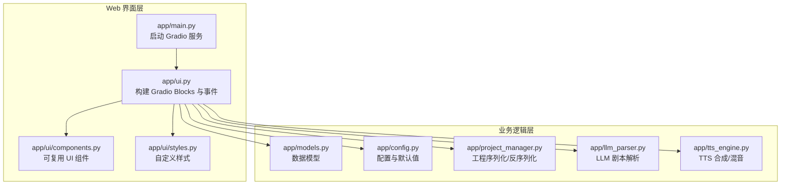
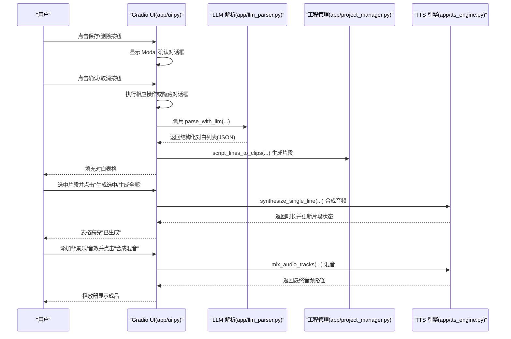
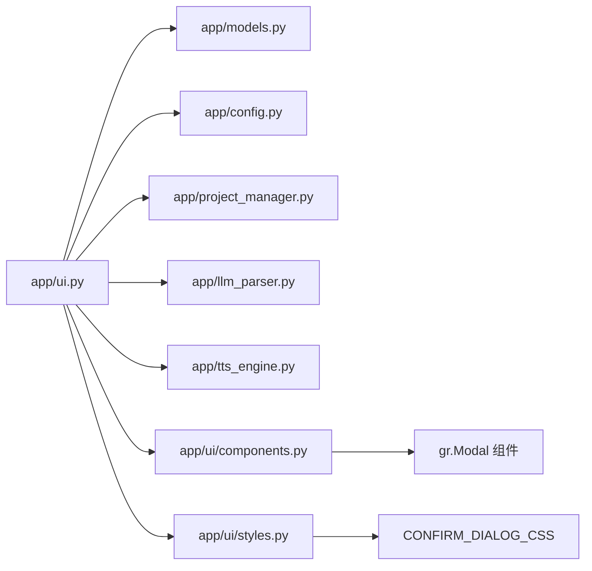

# 用户界面指南

<cite>
**本文引用的文件**
- [app/ui.py](file://app/ui.py)
- [app/main.py](file://app/main.py)
- [app/models.py](file://app/models.py)
- [app/config.py](file://app/config.py)
- [app/project_manager.py](file://app/project_manager.py)
- [app/tts_engine.py](file://app/tts_engine.py)
- [app/llm_parser.py](file://app/llm_parser.py)
- [app/ui/components.py](file://app/ui/components.py)
- [app/ui/styles.py](file://app/ui/styles.py)
- [docs/README.md](file://docs/README.md)
- [docs/GRADIO_QUICK_REFERENCE.md](file://docs/GRADIO_QUICK_REFERENCE.md)
- [docs/MULTI_PRONUNCIATION_EDITOR_GUIDE.md](file://docs/MULTI_PRONUNCIATION_EDITOR_GUIDE.md)
- [tests/test_ui_layout.py](file://tests/test_ui_layout.py)
- [demo_complex.py](file://demo_complex.py)
- [MODAL_REFACTOR_SUMMARY.md](file://MODAL_REFACTOR_SUMMARY.md)
- [test_modal_changes.py](file://test_modal_changes.py)
</cite>

## 更新摘要
**变更内容**
- 更新确认系统架构：从基于计时器的 gr.Row + gr.Timer 完全重构为基于模态对话框的 gr.Modal 系统
- 移除 10 秒自动隐藏机制，改为用户自主控制的确认流程
- 优化用户体验：明确的确认对话框，居中显示带遮罩层
- 简化代码复杂度：从多组件同步控制改为单一 Modal 组件管理

## 目录
1. [简介](#简介)
2. [项目结构](#项目结构)
3. [核心组件](#核心组件)
4. [架构总览](#架构总览)
5. [详细组件分析](#详细组件分析)
6. [依赖关系分析](#依赖关系分析)
7. [性能与体验优化](#性能与体验优化)
8. [故障排查指南](#故障排查指南)
9. [结论](#结论)
10. [附录](#附录)

## 简介
本指南面向 TTS Studio 的 Web 用户界面使用者，系统讲解界面布局、各功能模块的使用方法与交互流程，并提供从剧本创作到音频导出的完整工作流示例。文档还涵盖响应式设计与用户体验优化（如实时预览、批量处理）、界面自定义与主题配置，以及常见问题的排查建议。

**更新** 界面确认系统已从基于计时器的 gr.Row + gr.Timer 完全重构为基于模态对话框的 gr.Modal 系统，提供更直观和可靠的用户确认体验。

## 项目结构
TTS Studio 的 Web 界面基于 Gradio 构建，核心入口在主程序中启动 Blocks 并注入 UI 定义。数据模型、工程管理、TTS 引擎与 LLM 解析器分别位于独立模块中，形成清晰的分层架构。

**图表来源**
- [app/main.py:15-51](file://app/main.py#L15-L51)
- [app/ui.py:13-144](file://app/ui.py#L13-L144)
- [app/ui/components.py:1-70](file://app/ui/components.py#L1-L70)
- [app/ui/styles.py:1-48](file://app/ui/styles.py#L1-L48)
- [app/models.py:4-78](file://app/models.py#L4-L78)
- [app/config.py:1-74](file://app/config.py#L1-L74)
- [app/project_manager.py:1-73](file://app/project_manager.py#L1-L73)
- [app/llm_parser.py:1-21](file://app/llm_parser.py#L1-L21)
- [app/tts_engine.py:1-547](file://app/tts_engine.py#L1-L547)

**章节来源**
- [app/main.py:15-51](file://app/main.py#L15-L51)
- [app/ui.py:13-144](file://app/ui.py#L13-L144)

## 核心组件
- 工程与配置（工程信息、工程管理、LLM 配置、角色管理）
- 文本解析（粘贴文本、LLM 解析、自动角色识别）
- 对白编辑（片段表格、SSML 文本、角色/音色参数、多音字标注、停顿、强调、试听）
- 混音输出（背景乐/音效添加、最终混音）

**更新** 确认系统现已重构为基于模态对话框的 gr.Modal 系统，提供更直观的用户确认体验。

**章节来源**
- [app/ui.py:147-433](file://app/ui.py#L147-L433)

## 架构总览
下图展示了从用户输入到音频导出的关键交互流程，包括 LLM 解析、TTS 合成、音频拼接与混音。

**图表来源**
- [app/ui.py:464-606](file://app/ui.py#L464-L606)
- [app/llm_parser.py:7-21](file://app/llm_parser.py#L7-L21)
- [app/project_manager.py:9-29](file://app/project_manager.py#L9-L29)
- [app/tts_engine.py:120-145](file://app/tts_engine.py#L120-L145)
- [app/tts_engine.py:454-534](file://app/tts_engine.py#L454-L534)

## 详细组件分析

### 工程与配置（工程信息、工程管理、LLM 配置、角色管理）
- 工程信息
  - 工程名：可编辑，变更后写入当前工程
  - 保存/加载工程：新建工程、保存工程、加载工程 JSON
  - 保存状态：显示保存/覆盖状态
- 工程管理
  - 工程列表：显示工程名称、修改时间、文件大小
  - 加载/删除/刷新：支持加载选中工程、删除确认、定时器自动隐藏
- LLM 配置
  - API Base、API Key、模型：变更后写入当前工程的 llm_config
- 角色管理
  - 角色列表：可编辑，包含角色名、音色、语速、音调、音量、性格摘要
  - 新建/删除/刷新：支持新增角色、删除确认、定时器自动隐藏
  - 角色编辑：名称、音色、语速、音调、音量、性格摘要、角色介绍、年龄、性别、情绪风格、备注
  - 状态：显示操作反馈

**更新** 确认系统已重构为基于模态对话框的 gr.Modal 系统，移除了原有的 10 秒自动隐藏机制，改为用户自主控制的确认流程。

**章节来源**
- [app/ui.py:149-273](file://app/ui.py#L149-L273)
- [app/ui.py:743-787](file://app/ui.py#L743-L787)
- [app/ui.py:789-841](file://app/ui.py#L789-L841)
- [app/config.py:28-74](file://app/config.py#L28-L74)

### 文本解析（粘贴文本、LLM 解析、自动角色识别）
- 输入文本框：支持任意格式文本粘贴
- LLM 解析：调用本地/远程 LLM，按系统提示词解析为结构化对白（含类型、角色、情感、文本）
- 自动角色：若角色不存在，自动创建默认配置角色
- 输出：填充对白片段表格，同步角色列表与下拉选择

**章节来源**
- [app/ui.py:274-286](file://app/ui.py#L274-L286)
- [app/ui.py:464-557](file://app/ui.py#L464-L557)
- [app/llm_parser.py:7-21](file://app/llm_parser.py#L7-L21)
- [app/config.py:60-74](file://app/config.py#L60-L74)

### 对白编辑（片段表格、SSML 文本、角色/音色参数、多音字标注、停顿、强调、试听）
- 片段表格
  - 列：角色、文本
  - 交互：选中行高亮、应用修改、生成选中、预听、生成全部
- SSML 文本
  - 直接编辑发送给 TTS 的标记文本
  - 应用属性：将 SSML 与音色参数（语速/音调/音量）合并
- 角色与参数
  - 角色选择：从角色列表选择或管理
  - 音色：从 VOICE_OPTIONS 下拉选择
  - 语速/音调/音量：滑块调节
- 多音字标注
  - 输入"待标注字"和"替换为"，点击"标注"生成 [phoneme=...] 标记
- 停顿插入
  - 选择时长（100-2000ms），点击"插入"生成 [pause=...] 标记
- 强调添加
  - 预设强调等级（强烈/中等/减弱/极慢强调/快速激昂/低音沉稳/高音尖锐/慢速+停顿/自定义）
  - 可选目标文本、自定义 rate/pitch/volume
- 试听与清理
  - "试听"：立即合成并播放
  - "清除标记"：移除所有方括号标记

**章节来源**
- [app/ui.py:287-433](file://app/ui.py#L287-L433)
- [app/ui.py:574-606](file://app/ui.py#L574-L606)
- [app/ui.py:681-691](file://app/ui.py#L681-L691)
- [app/ui.py:693-699](file://app/ui.py#L693-L699)
- [app/config.py:35-58](file://app/config.py#L35-L58)
- [docs/MULTI_PRONUNCIATION_EDITOR_GUIDE.md:1-248](file://docs/MULTI_PRONUNCIATION_EDITOR_GUIDE.md#L1-L248)

### 混音输出（背景乐/音效添加、最终混音）
- 背景乐
  - 上传音频文件、设置音量、添加背景乐
- 音效
  - 名称、上传音频、开始时间（秒）、音量、添加音效
- 最终混音
  - 总时长（0=自动），合成混音，输出成品音频

**章节来源**
- [app/ui.py:414-433](file://app/ui.py#L414-L433)
- [app/ui.py:701-741](file://app/ui.py#L701-L741)
- [app/ui.py:693-699](file://app/ui.py#L693-L699)
- [app/tts_engine.py:454-534](file://app/tts_engine.py#L454-L534)

### 确认系统重构（Modal 对话框）
**新增** 界面确认系统已完全重构为基于模态对话框的 gr.Modal 系统，提供更直观和可靠的用户确认体验。

- **保存工程确认**
  - 当工程已存在时，点击"保存工程"按钮会弹出 Modal 对话框
  - 对话框标题："💾 确认保存"
  - 包含警告信息和两个按钮："✅ 覆盖保存"和"❌ 取消"
  - 用户必须手动点击确认或取消按钮，对话框不会自动隐藏

- **删除工程确认**
  - 点击"删除选中工程"按钮会弹出 Modal 对话框
  - 对话框标题："⚠️ 确认删除"
  - 包含警告信息和两个按钮："✅ 确认删除"和"❌ 取消"
  - 删除操作完成后会自动刷新工程列表

- **角色覆盖确认**
  - 当保存同名角色时，会弹出 Modal 对话框
  - 对话框标题："⚠️ 确认覆盖"
  - 包含警告信息和两个按钮："✅ 确认覆盖"和"❌ 取消"
  - 覆盖保存后会自动刷新角色列表

- **交互流程优势**
  - 移除了原有的 10 秒自动隐藏机制
  - 用户可以充分注意到确认信息
  - 明确的视觉焦点，居中显示带遮罩层
  - 代码复杂度大幅降低，从多组件同步控制改为单一 Modal 管理

**章节来源**
- [app/ui.py:818-895](file://app/ui.py#L818-L895)
- [app/ui.py:1121-1210](file://app/ui.py#L1121-L1210)
- [app/ui.py:1252-1340](file://app/ui.py#L1252-L1340)
- [MODAL_REFACTOR_SUMMARY.md:1-139](file://MODAL_REFACTOR_SUMMARY.md#L1-L139)

## 依赖关系分析
- UI 依赖
  - 数据模型：Project、ScriptLine、AudioClip、Character
  - 配置：默认 API、模型、音色列表、系统提示词
  - 工程管理：序列化/反序列化工程文件
  - LLM 解析：OpenAI 客户端调用
  - TTS 引擎：Edge-TTS 合成、高级标记解析、FFmpeg 拼接/混音
- 事件耦合
  - UI 事件与后台处理解耦，通过函数封装与返回值驱动组件更新
  - 避免使用 demo.load，采用预加载与静态初始化，提升性能
- **新增** 确认系统依赖
  - 可复用组件：create_confirm_dialog、show_confirm_dialog、hide_confirm_dialog
  - 自定义样式：CONFIRM_DIALOG_CSS 用于覆盖 Gradio 默认样式

**图表来源**
- [app/ui.py:1-12](file://app/ui.py#L1-L12)
- [app/models.py:1-78](file://app/models.py#L1-L78)
- [app/config.py:1-74](file://app/config.py#L1-L74)
- [app/project_manager.py:1-73](file://app/project_manager.py#L1-L73)
- [app/llm_parser.py:1-21](file://app/llm_parser.py#L1-L21)
- [app/tts_engine.py:1-16](file://app/tts_engine.py#L1-L16)
- [app/ui/components.py:1-70](file://app/ui/components.py#L1-L70)
- [app/ui/styles.py:1-48](file://app/ui/styles.py#L1-L48)

**章节来源**
- [app/ui.py:1-12](file://app/ui.py#L1-L12)
- [app/models.py:1-78](file://app/models.py#L1-L78)
- [app/config.py:1-74](file://app/config.py#L1-L74)
- [app/project_manager.py:1-73](file://app/project_manager.py#L1-L73)
- [app/llm_parser.py:1-21](file://app/llm_parser.py#L1-L21)
- [app/tts_engine.py:1-16](file://app/tts_engine.py#L1-L16)

## 性能与体验优化
- 预加载与静态初始化
  - 避免使用 demo.load，改为在构建 UI 时预加载工程列表、角色与片段数据，静态传入组件 value，确保首屏即时显示
- 组件更新策略
  - Gradio 非响应式，需通过事件回调返回值更新组件，而非直接赋值 .value
- 响应式与实时预览
  - 选中片段后可"预听"即时生成音频；"试听"按钮可快速验证标记效果
- 批量处理
  - "生成全部"逐个合成片段并自动计算起始时间，保证连续播放
- 主题与样式
  - 使用 Soft 主题；通过 CSS 类 compact-table 控制表格高度与工具栏隐藏，提升可读性
- **新增** 确认系统优化
  - 移除定时器组件，简化事件处理逻辑
  - Modal 对话框提供更好的视觉焦点和用户体验
  - 代码复杂度降低，维护成本减少

**章节来源**
- [docs/GRADIO_QUICK_REFERENCE.md:1-151](file://docs/GRADIO_QUICK_REFERENCE.md#L1-L151)
- [app/main.py:17-50](file://app/main.py#L17-L50)
- [app/ui.py:447-573](file://app/ui.py#L447-L573)

## 故障排查指南
- Tab 切换卡顿
  - 症状：点击 Tab 后浏览器无响应
  - 原因：使用了 demo.load 或嵌套过多 Accordion
  - 解决：采用预加载+静态初始化，避免运行时事件
- 控制台大量警告
  - 症状：出现 Violation 警告
  - 原因：demo.load 或深层嵌套组件
  - 解决：移除 demo.load，减少嵌套层级
- 组件更新不显示
  - 症状：设置 .value 但前端不刷新
  - 原因：Gradio 非响应式
  - 解决：通过 change 回调返回值更新
- 首次加载数据空白
  - 症状：工程已加载但界面显示为空
  - 原因：运行时赋值不会触发渲染
  - 解决：在构建 UI 时传入初始值，而非运行时赋值
- **新增** 确认系统问题
  - 症状：确认对话框不显示
  - 原因：Gradio 版本过低不支持 gr.Modal
  - 解决：升级到 Gradio 6.12.0 或更高版本
  - 症状：确认对话框自动隐藏
  - 原因：代码中仍包含定时器组件
  - 解决：确保已完全移除定时器相关代码

**章节来源**
- [docs/GRADIO_QUICK_REFERENCE.md:1-151](file://docs/GRADIO_QUICK_REFERENCE.md#L1-L151)

## 结论
TTS Studio 的 Web 界面以 Gradio 为核心，围绕"工程—文本—片段—混音"的工作流提供直观易用的操作体验。通过预加载与静态初始化、事件驱动的组件更新策略，界面具备良好的性能与稳定性。结合多音字标注、停顿与强调等高级标记能力，用户可在可视化界面中高效完成从剧本创作到音频导出的全流程制作。

**更新** 确认系统重构为基于模态对话框的 gr.Modal 系统，显著提升了用户体验和代码质量。移除定时器机制后，用户可以更清楚地看到确认信息，避免误操作的风险。

## 附录

### 完整工作流程示例（从剧本到导出）
- 步骤 1：工程与配置
  - 新建/加载工程，填写 LLM 配置（API Base、Key、模型）
  - 在"角色管理"中创建或编辑角色，设置音色与基础参数
- 步骤 2：文本解析
  - 在"文本解析"页签粘贴剧本，点击"LLM 解析"
  - 自动识别角色与对白，生成对白片段表格
- 步骤 3：对白编辑
  - 选中片段，调整角色/音色/语速/音调/音量
  - 使用"多音字标注""插入停顿""添加强调"等工具完善标记
  - 点击"试听"验证效果；必要时"清除标记"后重新编辑
  - 点击"应用属性（SSML + 音色参数）"将标记写入 SSML 文本
  - 点击"生成选中/生成全部"合成音频
- 步骤 4：混音输出
  - 在"混音输出"页签添加背景乐/音效，设置开始时间与音量
  - 点击"合成混音"，获得成品音频

**章节来源**
- [app/ui.py:464-606](file://app/ui.py#L464-L606)
- [app/ui.py:693-699](file://app/ui.py#L693-L699)
- [docs/MULTI_PRONUNCIATION_EDITOR_GUIDE.md:1-248](file://docs/MULTI_PRONUNCIATION_EDITOR_GUIDE.md#L1-L248)

### 界面自定义与主题配置
- 主题
  - 启动时使用 Soft 主题，适合阅读与长时间使用
- 样式
  - 通过 CSS 类 compact-table 控制表格高度与工具栏隐藏，避免工具栏干扰
  - 自定义确认对话框样式，防止 Gradio 加载状态覆盖
- 布局
  - Tabs 组织四大功能页签，左侧表格右侧属性面板，便于对比编辑与实时试听

**章节来源**
- [app/main.py:17-50](file://app/main.py#L17-L50)
- [app/ui.py:147-433](file://app/ui.py#L147-L433)

### 数据模型与工程持久化
- 数据模型
  - Project：工程名称、原始文本、脚本行、音频片段、背景乐、音效、LLM 配置、角色列表
  - ScriptLine：类型、角色、情感、文本、音色、语速、音调、SSML 文本
  - AudioClip：片段标识、类型、角色、文本、文件路径、音色、语速、音调、SSML 文本、音量、起始/时长、生成状态
  - Character：角色定义（名称、音色、语速、音调、音量、性格摘要、介绍、年龄、性别、情绪风格、备注）
- 工程持久化
  - 保存工程：序列化 Project 至 JSON 文件
  - 加载工程：从 JSON 文件反序列化，恢复工程状态与片段生成状态

**章节来源**
- [app/models.py:4-78](file://app/models.py#L4-L78)
- [app/project_manager.py:31-73](file://app/project_manager.py#L31-L73)

### 高级标记与 TTS 合成
- 高级标记
  - 支持 [phoneme=...]、[pause=...]、[emphasis=...]、<prosody ...> 等
  - 自动拆分与拼接，使用 FFmpeg 合成最终音频
- 合成流程
  - 普通文本/自定义 SSML：直接调用 Edge-TTS
  - 高级标记：解析为多个 TextSegment，逐段合成后拼接
  - 混音：按起始时间叠加，amix 混合，输出成品

**章节来源**
- [app/tts_engine.py:120-218](file://app/tts_engine.py#L120-L218)
- [app/tts_engine.py:321-453](file://app/tts_engine.py#L321-L453)
- [app/tts_engine.py:454-534](file://app/tts_engine.py#L454-L534)
- [demo_complex.py:20-239](file://demo_complex.py#L20-L239)

### 确认系统技术实现
**新增** 界面确认系统的技术实现细节。

- **组件封装**
  - create_confirm_dialog：创建带红色边框的确认对话框组件
  - show_confirm_dialog：显示确认对话框并更新警告信息
  - hide_confirm_dialog：隐藏确认对话框并清空警告信息

- **样式定制**
  - CONFIRM_DIALOG_CSS：防止 Gradio 加载状态覆盖确认对话框样式
  - 确保确认对话框在各种状态下保持一致的视觉外观

- **事件处理**
  - prepare_*_project：检查是否需要覆盖确认
  - execute_*_project：执行相应操作
  - cancel_*：取消操作，隐藏确认区域

- **优势对比**
  - 显示方式：从 Row 显示/隐藏改为 Modal 对话框
  - 自动隐藏：从 10 秒定时器改为用户自主控制
  - 视觉焦点：从不明显改为居中 + 遮罩
  - 代码复杂度：从高（多组件同步）降至低（单一 Modal）
  - 用户体验：从容易错过确认提升为明确的确认流程

**章节来源**
- [app/ui/components.py:1-70](file://app/ui/components.py#L1-L70)
- [app/ui/styles.py:1-48](file://app/ui/styles.py#L1-L48)
- [MODAL_REFACTOR_SUMMARY.md:1-139](file://MODAL_REFACTOR_SUMMARY.md#L1-L139)