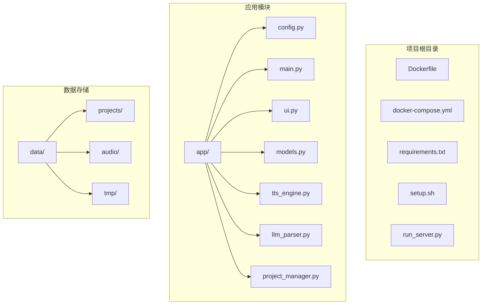
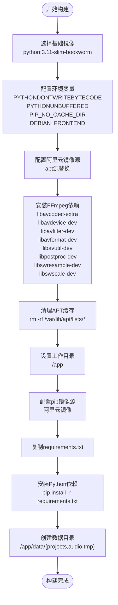
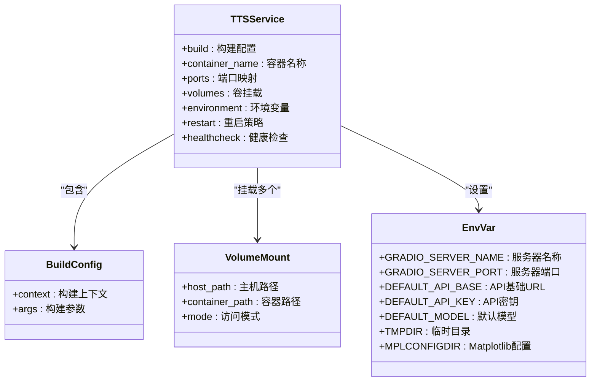
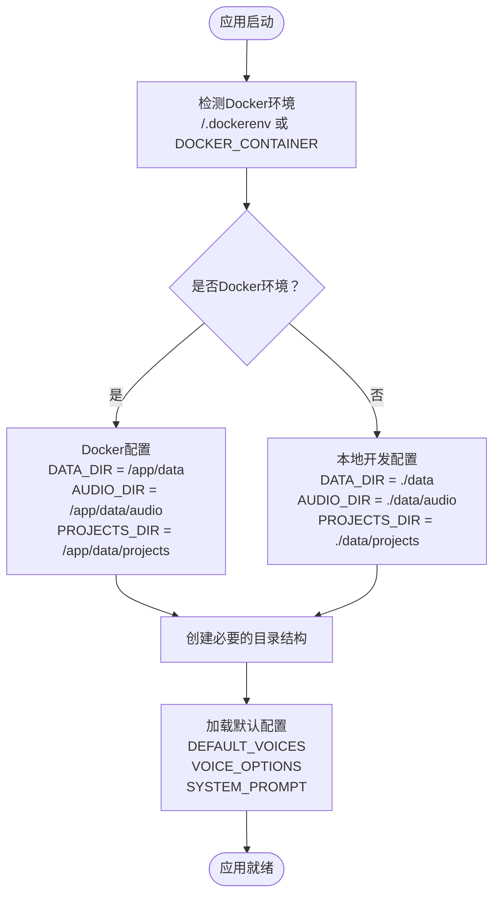
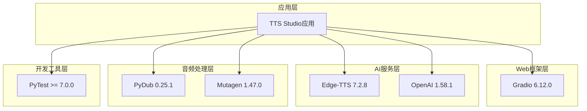
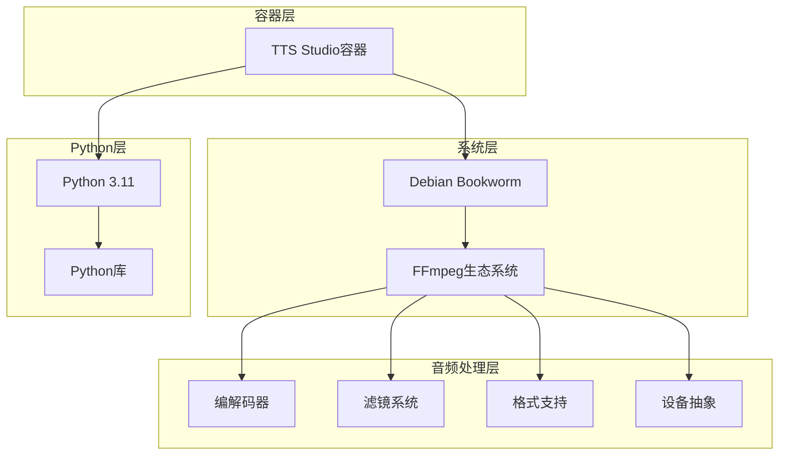
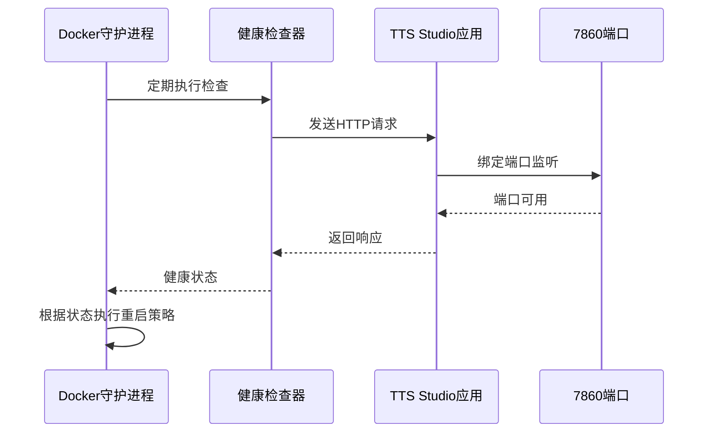

# Docker容器化部署

<cite>
**本文档引用的文件**
- [Dockerfile](file://Dockerfile)
- [docker-compose.yml](file://docker-compose.yml)
- [requirements.txt](file://requirements.txt)
- [setup.sh](file://setup.sh)
- [app/config.py](file://app/config.py)
- [app/main.py](file://app/main.py)
- [run_server.py](file://run_server.py)
</cite>

## 目录
1. [简介](#简介)
2. [项目结构](#项目结构)
3. [核心组件](#核心组件)
4. [架构概览](#架构概览)
5. [详细组件分析](#详细组件分析)
6. [依赖关系分析](#依赖关系分析)
7. [性能考虑](#性能考虑)
8. [故障排除指南](#故障排除指南)
9. [结论](#结论)

## 简介

TTS Studio是一个基于Python的文本转语音（Text-to-Speech）应用程序，提供了直观的图形用户界面用于音频合成和项目管理。本指南详细介绍了如何使用Docker容器化部署TTS Studio，包括Dockerfile构建过程、docker-compose配置以及完整的部署流程。

该应用程序集成了多种音频处理功能，包括：
- 基于Gradio的Web界面
- Edge-TTS语音合成引擎
- OpenAI LLM解析功能
- 多轨道音频混合和导出
- 项目管理和持久化存储

## 项目结构

TTS Studio采用模块化设计，主要包含以下核心目录和文件：



**图表来源**
- [Dockerfile:1-51](file://Dockerfile#L1-L51)
- [docker-compose.yml:1-32](file://docker-compose.yml#L1-L32)

**章节来源**
- [Dockerfile:1-51](file://Dockerfile#L1-L51)
- [docker-compose.yml:1-32](file://docker-compose.yml#L1-L32)

## 核心组件

### Docker镜像构建组件

TTS Studio的Docker镜像构建包含以下关键组件：

#### 基础镜像选择
- **基础镜像**: `python:3.11-slim-bookworm`
- **优势**: 基于Debian Bookworm的轻量级Python环境，提供稳定的运行时基础
- **版本**: Python 3.11确保与现代库兼容性

#### 系统依赖安装
镜像构建过程中安装了完整的FFmpeg生态系统：
- **核心编解码器**: `libavcodec-extra` - 扩展的音频视频编解码器
- **设备支持**: `libavdevice-dev` - 多媒体设备抽象层
- **滤镜系统**: `libavfilter-dev` - 音频视频滤镜处理
- **格式支持**: `libavformat-dev` - 多种容器格式支持
- **实用工具**: `libavutil-dev` - 编解码器通用工具
- **后处理**: `libpostproc-dev` - 视频后处理滤镜
- **重采样**: `libswresample-dev` - 音频重采样
- **缩放**: `libswscale-dev` - 图像缩放和转换

#### Python环境配置
- **包管理**: 使用阿里云镜像源加速pip安装
- **缓存控制**: 禁用Python字节码缓存和pip缓存
- **环境隔离**: 配置非交互式apt安装

**章节来源**
- [Dockerfile:1-51](file://Dockerfile#L1-L51)
- [requirements.txt:1-16](file://requirements.txt#L1-L16)

### 应用程序组件

#### Web界面框架
- **Gradio 6.12.0**: 提供现代化的Web界面
- **服务器配置**: 监听0.0.0.0:7860端口
- **主题定制**: 使用Soft主题提供良好的用户体验

#### TTS引擎集成
- **Edge-TTS 7.2.8**: 微软Azure语音服务集成
- **SSML支持**: 结构化语音标记语言处理
- **音色配置**: 支持多种中文音色选项

#### LLM解析功能
- **OpenAI 1.58.1**: 与OpenAI兼容的API接口
- **剧本解析**: 将文本转换为结构化音频剧本
- **JSON输出**: 标准化的JSON格式输出

**章节来源**
- [app/main.py:1-51](file://app/main.py#L1-L51)
- [app/config.py:1-74](file://app/config.py#L1-L74)

## 架构概览

TTS Studio采用容器化微服务架构，通过Docker实现完整的应用打包和部署：

```mermaid
graph TB
subgraph "客户端层"
Browser[Web浏览器]
Users[终端用户]
end
subgraph "网络层"
Port[7860端口]
Network[Docker网络]
end
subgraph "应用容器"
Container[TTS Studio容器]
subgraph "容器内部"
App[Python应用]
Gradio[Gradio服务]
TTS[Edge-TTS引擎]
LLM[OpenAI LLM]
FFmpeg[FFmpeg处理]
end
end
subgraph "数据层"
Volume[持久化卷]
DataDir[/app/data目录]
AudioDir[audio子目录]
ProjectsDir[projects子目录]
TempDir[tmp子目录]
end
Browser --> Port
Users --> Port
Port --> Container
Container --> App
App --> Gradio
App --> TTS
App --> LLM
App --> FFmpeg
Container --> Volume
Volume --> DataDir
DataDir --> AudioDir
DataDir --> ProjectsDir
DataDir --> TempDir
```

**图表来源**
- [docker-compose.yml:9-14](file://docker-compose.yml#L9-L14)
- [Dockerfile:36-36](file://Dockerfile#L36-L36)

## 详细组件分析

### Dockerfile构建流程

Dockerfile定义了完整的镜像构建过程，包含以下关键步骤：

#### 环境变量配置阶段


**图表来源**
- [Dockerfile:3-34](file://Dockerfile#L3-L34)

#### 用户权限管理
Dockerfile提供了两种用户管理模式：

**模式A：简化权限（当前使用）**
- 以root用户运行
- 简化权限问题，便于开发调试
- 适合开发环境和测试环境

**模式B：安全权限（可选配置）**
- 创建专用用户组和用户
- 设置适当的文件权限
- 更适合生产环境部署

**章节来源**
- [Dockerfile:38-47](file://Dockerfile#L38-L47)

### docker-compose服务配置

docker-compose.yml定义了完整的服务配置，包含以下关键要素：

#### 服务定义


**图表来源**
- [docker-compose.yml:2-32](file://docker-compose.yml#L2-L32)

#### 端口映射配置
- **主机端口**: 7860
- **容器端口**: 7860
- **访问方式**: http://localhost:7860

#### 卷挂载策略
1. **数据持久化**: `./data:/app/data:rw`
   - 持久化音频文件和项目数据
   - 支持读写访问

2. **环境配置**: `./.env:/app/.env:ro`
   - 只读挂载环境变量文件
   - 支持动态配置

3. **应用代码**: `./app:/app/app:rw`
   - 支持热重载开发
   - 实时代码更新

#### 环境变量配置
- **GRADIO_SERVER_NAME**: 0.0.0.0（允许外部访问）
- **GRADIO_SERVER_PORT**: 7860（默认端口）
- **DEFAULT_API_BASE**: LLM服务基础URL
- **DEFAULT_API_KEY**: LLM服务API密钥
- **DEFAULT_MODEL**: 默认使用的LLM模型
- **TMPDIR**: 临时文件存储目录
- **MPLCONFIGDIR**: Matplotlib配置目录

**章节来源**
- [docker-compose.yml:9-23](file://docker-compose.yml#L9-L23)

### 应用程序配置管理

应用程序通过config.py实现了智能的环境检测和配置管理：



**图表来源**
- [app/config.py:10-26](file://app/config.py#L10-L26)

**章节来源**
- [app/config.py:1-74](file://app/config.py#L1-L74)

## 依赖关系分析

### Python依赖层次结构

TTS Studio的Python依赖关系呈现清晰的分层结构：



**图表来源**
- [requirements.txt:1-16](file://requirements.txt#L1-L16)

### 系统依赖关系

容器内的系统依赖关系确保了完整的音频处理能力：



**图表来源**
- [Dockerfile:12-24](file://Dockerfile#L12-L24)

**章节来源**
- [requirements.txt:1-16](file://requirements.txt#L1-L16)
- [Dockerfile:12-24](file://Dockerfile#L12-L24)

## 性能考虑

### 内存和CPU优化

#### Python进程优化
- **字节码缓存禁用**: `PYTHONDONTWRITEBYTECODE=1` - 减少磁盘I/O
- **缓冲区控制**: `PYTHONUNBUFFERED=1` - 实时日志输出
- **缓存清理**: `PIP_NO_CACHE_DIR=1` - 控制pip缓存大小

#### FFmpeg性能配置
- **硬件加速**: 利用FFmpeg的硬件加速功能
- **多线程处理**: 支持并行音频处理
- **内存管理**: 合理的内存分配策略

### 存储性能优化

#### 数据目录结构
- **分层存储**: 将不同类型的数据分离存储
- **索引优化**: 项目文件使用JSON格式便于快速解析
- **缓存策略**: 临时文件自动清理机制

**章节来源**
- [Dockerfile:3-7](file://Dockerfile#L3-L7)
- [app/config.py:23-26](file://app/config.py#L23-L26)

## 故障排除指南

### 常见部署问题及解决方案

#### 网络连接问题
**问题**: 容器无法连接到外部LLM服务
**解决方案**:
1. 检查`DEFAULT_API_BASE`环境变量配置
2. 验证网络连通性
3. 确认防火墙设置

#### 权限问题
**问题**: 容器内无法写入数据目录
**解决方案**:
1. 检查宿主机目录权限
2. 验证用户ID和组ID映射
3. 确认SELinux设置

#### 端口冲突
**问题**: 端口7860被占用
**解决方案**:
1. 修改docker-compose.yml中的端口映射
2. 使用其他可用端口
3. 检查现有进程占用情况

#### 音频处理失败
**问题**: FFmpeg相关操作失败
**解决方案**:
1. 检查FFmpeg安装完整性
2. 验证音频文件格式支持
3. 确认磁盘空间充足

### 健康检查配置

容器提供了完善的健康检查机制：



**图表来源**
- [docker-compose.yml:26-31](file://docker-compose.yml#L26-L31)

**章节来源**
- [docker-compose.yml:26-31](file://docker-compose.yml#L26-L31)

## 结论

TTS Studio的Docker容器化部署提供了完整的解决方案，具有以下优势：

### 技术优势
- **一致性**: 容器化确保开发、测试和生产环境的一致性
- **可移植性**: 跨平台部署能力
- **可扩展性**: 支持水平扩展和负载均衡
- **安全性**: 隔离的运行环境

### 部署建议
1. **开发环境**: 使用简化权限模式，便于调试
2. **测试环境**: 配置适当的资源限制
3. **生产环境**: 启用安全权限模式，配置监控告警

### 最佳实践
- 定期更新基础镜像和依赖库
- 配置适当的日志轮转策略
- 建立完整的备份和恢复机制
- 监控容器资源使用情况

通过遵循本指南，您可以成功部署TTS Studio的Docker容器化版本，并根据不同的部署需求进行相应的配置调整。