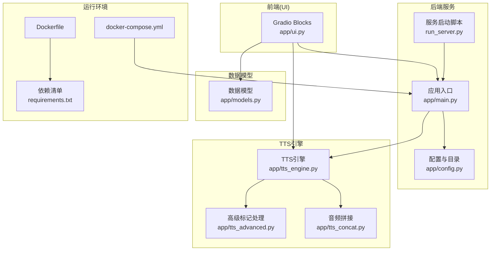
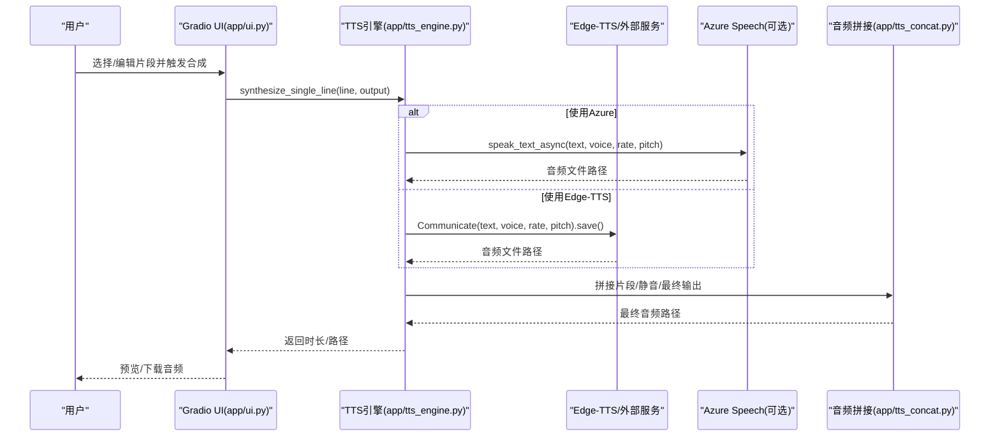
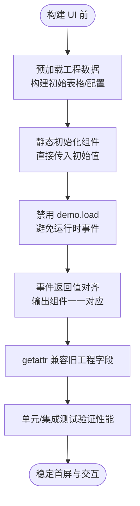
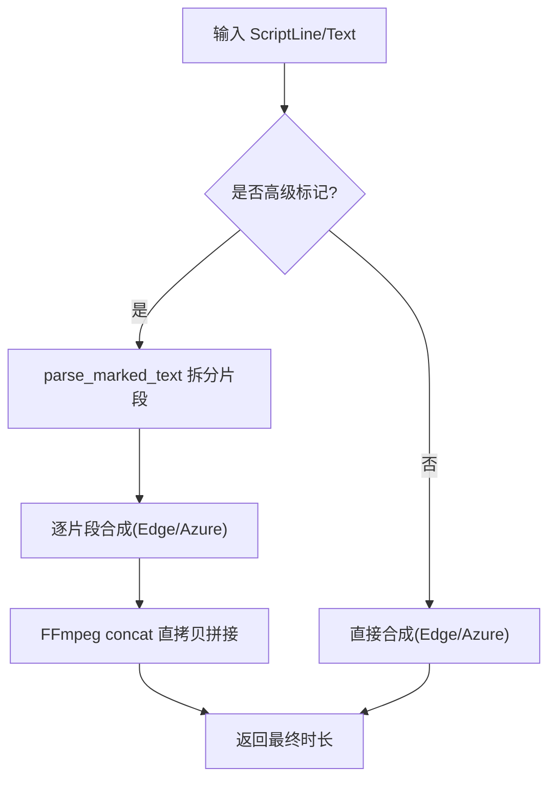
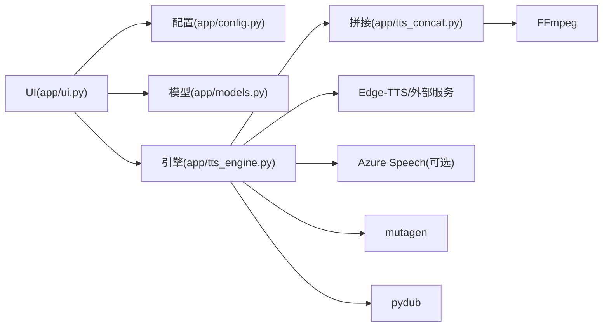

# 性能优化

<cite>
**本文引用的文件**
- [app/main.py](file://app/main.py)
- [app/ui.py](file://app/ui.py)
- [app/tts_engine.py](file://app/tts_engine.py)
- [app/tts_concat.py](file://app/tts_concat.py)
- [app/models.py](file://app/models.py)
- [app/config.py](file://app/config.py)
- [run_server.py](file://run_server.py)
- [Dockerfile](file://Dockerfile)
- [docker-compose.yml](file://docker-compose.yml)
- [requirements.txt](file://requirements.txt)
- [tests/test_gradio_performance.py](file://tests/test_gradio_performance.py)
- [docs/GRADIO_PERFORMANCE_ISSUE_RECORD.md](file://docs/GRADIO_PERFORMANCE_ISSUE_RECORD.md)
- [docs/GRADIO_QUICK_REFERENCE.md](file://docs/GRADIO_QUICK_REFERENCE.md)
</cite>

## 目录
1. [简介](#简介)
2. [项目结构](#项目结构)
3. [核心组件](#核心组件)
4. [架构总览](#架构总览)
5. [详细组件分析](#详细组件分析)
6. [依赖分析](#依赖分析)
7. [性能考量](#性能考量)
8. [故障排查指南](#故障排查指南)
9. [结论](#结论)
10. [附录](#附录)

## 简介
本指南聚焦于 TTS Studio 的性能优化，围绕以下目标展开：
- 识别并优化 TTS 合成过程中的性能瓶颈（并发、内存、CPU）
- 优化 Gradio 界面的首屏加载与交互性能（预加载、静态初始化、事件约束）
- 提升音频处理阶段的吞吐与稳定性（并行化、缓冲与 I/O 优化）
- 建立系统资源监控与性能指标采集方法（CPU、内存、磁盘 I/O）
- 设计负载均衡与高可用部署方案
- 提供性能测试与基准测试实施建议

## 项目结构
TTS Studio 采用模块化组织，Gradio UI 作为入口，后台通过 TTS 引擎与音频拼接工具完成合成与混音，容器化部署提供稳定的运行环境。

**图表来源**
- [app/ui.py:13-800](file://app/ui.py#L13-L800)
- [app/main.py:15-51](file://app/main.py#L15-L51)
- [app/tts_engine.py:1-547](file://app/tts_engine.py#L1-L547)
- [app/tts_concat.py:1-159](file://app/tts_concat.py#L1-L159)
- [app/models.py:1-78](file://app/models.py#L1-L78)
- [app/config.py:1-74](file://app/config.py#L1-L74)
- [run_server.py:1-5](file://run_server.py#L1-L5)
- [Dockerfile:1-51](file://Dockerfile#L1-L51)
- [docker-compose.yml:1-32](file://docker-compose.yml#L1-L32)
- [requirements.txt:1-16](file://requirements.txt#L1-L16)

**章节来源**
- [app/main.py:15-51](file://app/main.py#L15-L51)
- [app/ui.py:13-800](file://app/ui.py#L13-L800)
- [app/tts_engine.py:1-547](file://app/tts_engine.py#L1-L547)
- [app/tts_concat.py:1-159](file://app/tts_concat.py#L1-L159)
- [app/models.py:1-78](file://app/models.py#L1-L78)
- [app/config.py:1-74](file://app/config.py#L1-L74)
- [run_server.py:1-5](file://run_server.py#L1-L5)
- [Dockerfile:1-51](file://Dockerfile#L1-L51)
- [docker-compose.yml:1-32](file://docker-compose.yml#L1-L32)
- [requirements.txt:1-16](file://requirements.txt#L1-L16)

## 核心组件
- Gradio UI（app/ui.py）：采用“预加载 + 静态初始化”策略，避免运行时事件与深层嵌套，确保首屏与交互性能。
- TTS 引擎（app/tts_engine.py）：统一调度 edge-tts 与 Azure 合成，支持高级标记文本的自动拆分与拼接，内置重试与时长估算。
- 音频拼接（app/tts_concat.py）：使用 FFmpeg concat demuxer 进行零重编码拼接，降低 CPU 与 I/O 开销。
- 数据模型（app/models.py）：定义工程、角色、音频片段与脚本行的数据结构，支撑 UI 与引擎协作。
- 配置与目录（app/config.py）：按 Docker/本地环境自动选择数据目录，确保持久化与隔离。
- 运行与容器（app/main.py、run_server.py、Dockerfile、docker-compose.yml、requirements.txt）：提供稳定的服务暴露、卷挂载与健康检查。

**章节来源**
- [app/ui.py:13-800](file://app/ui.py#L13-L800)
- [app/tts_engine.py:1-547](file://app/tts_engine.py#L1-L547)
- [app/tts_concat.py:1-159](file://app/tts_concat.py#L1-L159)
- [app/models.py:1-78](file://app/models.py#L1-L78)
- [app/config.py:1-74](file://app/config.py#L1-L74)
- [app/main.py:15-51](file://app/main.py#L15-L51)
- [run_server.py:1-5](file://run_server.py#L1-L5)
- [Dockerfile:1-51](file://Dockerfile#L1-L51)
- [docker-compose.yml:1-32](file://docker-compose.yml#L1-L32)
- [requirements.txt:1-16](file://requirements.txt#L1-L16)

## 架构总览
下图展示从 UI 到 TTS 合成与音频拼接的端到端流程，以及关键性能优化点（预加载、静态初始化、零重编码拼接、重试与清理）。

**图表来源**
- [app/ui.py:581-613](file://app/ui.py#L581-L613)
- [app/tts_engine.py:120-318](file://app/tts_engine.py#L120-L318)
- [app/tts_engine.py:321-453](file://app/tts_engine.py#L321-L453)
- [app/tts_concat.py:17-90](file://app/tts_concat.py#L17-L90)

## 详细组件分析

### Gradio 界面性能优化
- 预加载与静态初始化
  - 在构建 Blocks 之前完成工程数据预加载，直接将初始值传入组件，避免运行时事件与 DOM 重建。
  - 关键点：不在 demo.load 中刷新表格；不在事件中手动赋值 .value。
- 组件布局与事件约束
  - 使用 Tabs 作为顶级布局，内部少量 Accordion，避免深层嵌套导致的 DOM 操作开销。
  - 事件处理函数返回值数量与输出组件严格对齐，减少无效更新。
- 兼容性与异常处理
  - 使用 getattr 处理旧工程文件缺失字段，保证加载失败时使用默认值降级。
- 性能测试保障
  - 单元测试覆盖预加载、事件返回值、无 demo.load、无手动赋值等关键点，集成测试验证全链路加载时间。

**图表来源**
- [app/ui.py:13-800](file://app/ui.py#L13-L800)
- [tests/test_gradio_performance.py:38-428](file://tests/test_gradio_performance.py#L38-L428)
- [docs/GRADIO_PERFORMANCE_ISSUE_RECORD.md:136-242](file://docs/GRADIO_PERFORMANCE_ISSUE_RECORD.md#L136-L242)
- [docs/GRADIO_QUICK_REFERENCE.md:1-82](file://docs/GRADIO_QUICK_REFERENCE.md#L1-L82)

**章节来源**
- [app/ui.py:13-800](file://app/ui.py#L13-L800)
- [tests/test_gradio_performance.py:38-428](file://tests/test_gradio_performance.py#L38-L428)
- [docs/GRADIO_PERFORMANCE_ISSUE_RECORD.md:113-242](file://docs/GRADIO_PERFORMANCE_ISSUE_RECORD.md#L113-L242)
- [docs/GRADIO_QUICK_REFERENCE.md:1-82](file://docs/GRADIO_QUICK_REFERENCE.md#L1-L82)

### TTS 合成与音频处理
- 合成路径选择
  - 若启用 Azure 且配置可用，优先使用 Azure；否则回退至 edge-tts。
  - 支持高级标记（prosody/pause/SSML/phoneme）的自动拆分与逐片段合成。
- 重试与容错
  - 对外服务调用采用指数退避重试，失败时记录详细错误并返回最终时长估算。
- 音频拼接与混音
  - 使用 FFmpeg concat demuxer 进行“直拷贝”拼接，避免重编码 CPU 开销。
  - 混音采用 adelay + amix，支持多轨叠加与起始时间对齐。
- 临时文件管理
  - 片段合成与拼接过程产生的临时文件在 finally 中清理，防止磁盘膨胀。

**图表来源**
- [app/tts_engine.py:120-453](file://app/tts_engine.py#L120-L453)
- [app/tts_concat.py:17-90](file://app/tts_concat.py#L17-L90)

**章节来源**
- [app/tts_engine.py:120-453](file://app/tts_engine.py#L120-L453)
- [app/tts_concat.py:17-90](file://app/tts_concat.py#L17-L90)

### 数据模型与目录管理
- 数据模型
  - Project/Character/AudioClip/ScriptLine 提供清晰的数据边界，支撑 UI 与引擎解耦。
- 目录与持久化
  - 按 Docker/本地环境自动选择数据目录，确保 audio 与 projects 目录存在，避免运行时 IO 异常。

**章节来源**
- [app/models.py:1-78](file://app/models.py#L1-L78)
- [app/config.py:1-74](file://app/config.py#L1-L74)

### 服务与容器化
- 服务暴露与启动
  - app/main.py 与 run_server.py 提供统一入口，Gradio 暴露 7860 端口。
- 容器化
  - Dockerfile 安装 FFmpeg 与 Python 依赖，docker-compose 暴露端口、挂载数据卷、设置环境变量与健康检查。
- 依赖
  - requirements.txt 明确 Gradio、edge-tts、pydub、mutagen、pytest 等版本。

**章节来源**
- [app/main.py:15-51](file://app/main.py#L15-L51)
- [run_server.py:1-5](file://run_server.py#L1-L5)
- [Dockerfile:1-51](file://Dockerfile#L1-L51)
- [docker-compose.yml:1-32](file://docker-compose.yml#L1-L32)
- [requirements.txt:1-16](file://requirements.txt#L1-L16)

## 依赖分析
- 组件耦合
  - UI 仅依赖引擎接口与配置，耦合度低；引擎与拼接工具职责清晰，避免循环依赖。
- 外部依赖
  - Gradio、edge-tts、Azure Speech SDK、FFmpeg、mutagen、pydub。
- 潜在风险
  - 外部服务（Edge/Azure）的可用性与网络状况直接影响合成时延与成功率，需结合重试与降级策略。

**图表来源**
- [app/ui.py:13-800](file://app/ui.py#L13-L800)
- [app/tts_engine.py:1-547](file://app/tts_engine.py#L1-L547)
- [app/tts_concat.py:1-159](file://app/tts_concat.py#L1-L159)
- [app/models.py:1-78](file://app/models.py#L1-L78)
- [app/config.py:1-74](file://app/config.py#L1-L74)

**章节来源**
- [app/ui.py:13-800](file://app/ui.py#L13-L800)
- [app/tts_engine.py:1-547](file://app/tts_engine.py#L1-L547)
- [app/tts_concat.py:1-159](file://app/tts_concat.py#L1-L159)
- [app/models.py:1-78](file://app/models.py#L1-L78)
- [app/config.py:1-74](file://app/config.py#L1-L74)

## 性能考量

### 并发处理
- UI 事件
  - 采用“预加载 + 静态初始化”，避免 demo.load 与深层嵌套导致的主线程阻塞。
  - 事件处理函数返回值对齐，减少无效更新。
- TTS 合成
  - 当前实现为逐片段顺序合成，适合稳定与可控的时序需求。
  - 优化建议（可选）：在多用户/多任务场景下，可考虑将“片段级合成”放入线程池或异步队列，配合限流与超时控制，避免阻塞主线程。

**章节来源**
- [app/ui.py:13-800](file://app/ui.py#L13-L800)
- [tests/test_gradio_performance.py:38-428](file://tests/test_gradio_performance.py#L38-L428)

### 内存管理
- 临时文件清理
  - 高级合成与拼接过程在 finally 中清理临时文件，避免磁盘与句柄泄漏。
- 音频对象
  - 混音使用 FFmpeg 命令行，避免 pydub 在大文件上的高内存占用。
- UI 数据
  - 预加载一次性注入，避免运行时频繁构造大型数据结构。

**章节来源**
- [app/tts_engine.py:444-453](file://app/tts_engine.py#L444-L453)
- [app/tts_concat.py:82-89](file://app/tts_concat.py#L82-L89)
- [app/ui.py:13-800](file://app/ui.py#L13-L800)

### CPU 资源分配
- 零重编码拼接
  - 使用 FFmpeg concat demuxer 直拷贝，显著降低 CPU 压力。
- 混音策略
  - adelay + amix 的组合在多轨混合时具备较好性能与可预测性。
- 外部服务
  - Azure/Edge 合成受网络与服务端策略影响，建议在 UI 层限制并发请求并增加进度反馈。

**章节来源**
- [app/tts_concat.py:17-90](file://app/tts_concat.py#L17-L90)
- [app/tts_engine.py:494-534](file://app/tts_engine.py#L494-L534)

### 音频处理阶段优化
- 并行处理
  - 片段级合成可并行化，结合线程池/进程池与队列限流，避免过度占用 CPU。
- 缓冲与 I/O
  - 使用临时目录与直拷贝拼接，减少磁盘随机写；在容器中将数据卷挂载到高性能存储。
- 重试与降级
  - 外部服务失败时回退到本地静音/占位音，保证流程可用性。

**章节来源**
- [app/tts_engine.py:120-318](file://app/tts_engine.py#L120-L318)
- [app/tts_concat.py:17-90](file://app/tts_concat.py#L17-L90)

### 系统资源监控与指标采集
- 建议指标
  - CPU 使用率、内存占用、磁盘 I/O（读写速率与队列深度）、网络 RTT（外部服务）、Gradio 事件处理耗时。
- 采集方式
  - 容器内使用系统工具（如 top、iostat、iftop）或 Python 监控库（psutil、prometheus_client）。
  - 将指标暴露到 Prometheus/Grafana，建立告警阈值。
- 采样频率
  - UI 交互与合成关键路径采用短周期采样，后台批处理采用中长周期采样。

[本节为通用指导，无需特定文件引用]

### 负载均衡与高可用部署
- 多实例部署
  - 使用 docker-compose 或编排平台启动多个实例，前端通过 Nginx/Ingress 均衡。
- 数据持久化
  - 将 /app/data 挂载到共享存储，确保各实例可访问相同工程与音频资源。
- 健康检查
  - 利用健康检查探测端口可达性，自动摘除不健康实例。
- 会话与状态
  - UI 与引擎均无跨实例状态，天然适合水平扩展。

**章节来源**
- [docker-compose.yml:1-32](file://docker-compose.yml#L1-L32)
- [Dockerfile:1-51](file://Dockerfile#L1-L51)

### 性能测试与基准测试
- 单元测试
  - 覆盖预加载、事件返回值对齐、无 demo.load、无手动赋值、兼容性与异常处理。
- 集成测试
  - 验证完整加载周期耗时（建议 < 3s），确保 UI 构建与组件初始化稳定。
- 基准测试建议
  - 场景：不同工程规模（片段数）、不同标记复杂度、不同并发用户数。
  - 指标：首屏加载时间、合成平均时延、峰值 CPU/内存、磁盘 I/O、外部服务成功率。
  - 工具：pytest（现有）、locust（并发）、wrk/ab（接口压测）、htop/iostat（系统监控）。

**章节来源**
- [tests/test_gradio_performance.py:38-428](file://tests/test_gradio_performance.py#L38-L428)

## 故障排查指南
- UI 卡顿/Tab 无响应
  - 检查是否使用 demo.load 或深层嵌套 Accordion；确认事件返回值数量与输出组件一致；确保初始化时传入初始值而非运行时赋值。
- 首次加载空白
  - 确认预加载逻辑在 Blocks 之前执行；检查 getattr 兼容性；查看日志定位异常。
- 合成失败/时长异常
  - 查看重试日志与外部服务错误码；确认代理配置；检查 FFmpeg 可用性与权限。
- 磁盘空间不足
  - 确认临时文件清理逻辑；检查 AUDIO_DIR 与 PROJECTS_DIR 挂载路径；定期清理历史工程。

**章节来源**
- [docs/GRADIO_PERFORMANCE_ISSUE_RECORD.md:113-242](file://docs/GRADIO_PERFORMANCE_ISSUE_RECORD.md#L113-L242)
- [docs/GRADIO_QUICK_REFERENCE.md:1-82](file://docs/GRADIO_QUICK_REFERENCE.md#L1-L82)
- [app/tts_engine.py:120-318](file://app/tts_engine.py#L120-L318)
- [app/tts_concat.py:82-89](file://app/tts_concat.py#L82-L89)

## 结论
通过“预加载 + 静态初始化”的 UI 优化、FFmpeg 直拷贝拼接与合理的重试/清理策略，TTS Studio 在首屏加载、交互流畅性与合成稳定性方面取得显著改善。建议在多实例场景下结合限流与队列控制，持续以测试与监控驱动性能迭代。

[本节为总结，无需特定文件引用]

## 附录
- 相关文档与参考
  - Gradio 性能问题记录与快速参考
  - Edge-TTS 高级标记指南（用于理解高级合成流程）

**章节来源**
- [docs/GRADIO_PERFORMANCE_ISSUE_RECORD.md:1-360](file://docs/GRADIO_PERFORMANCE_ISSUE_RECORD.md#L1-L360)
- [docs/GRADIO_QUICK_REFERENCE.md:1-82](file://docs/GRADIO_QUICK_REFERENCE.md#L1-L82)