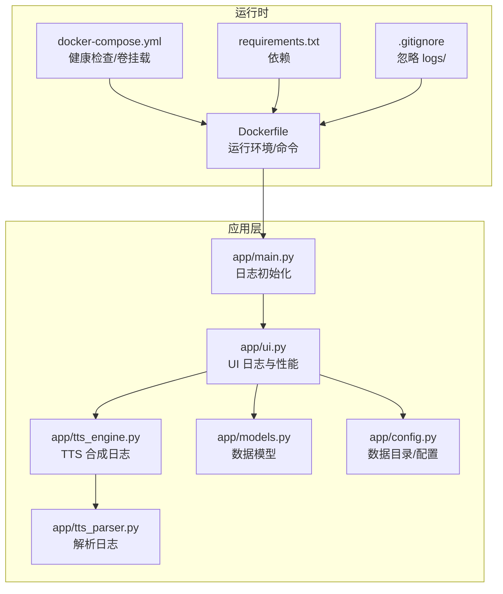
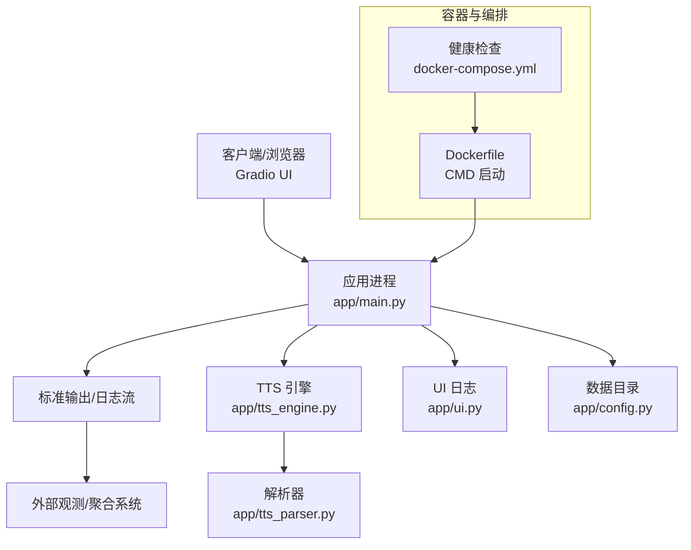
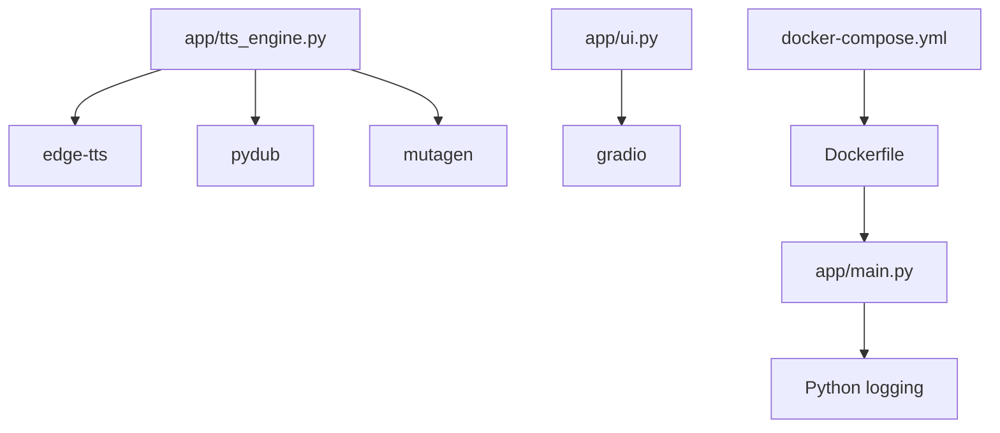
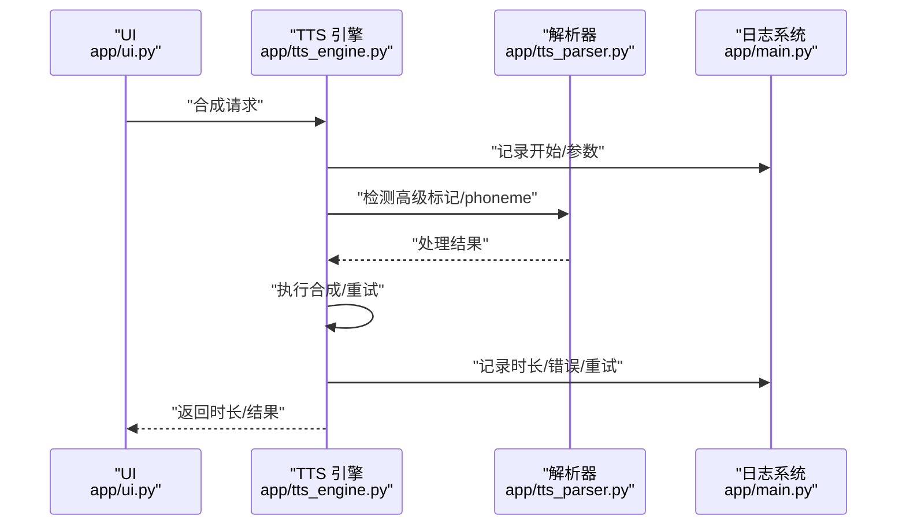
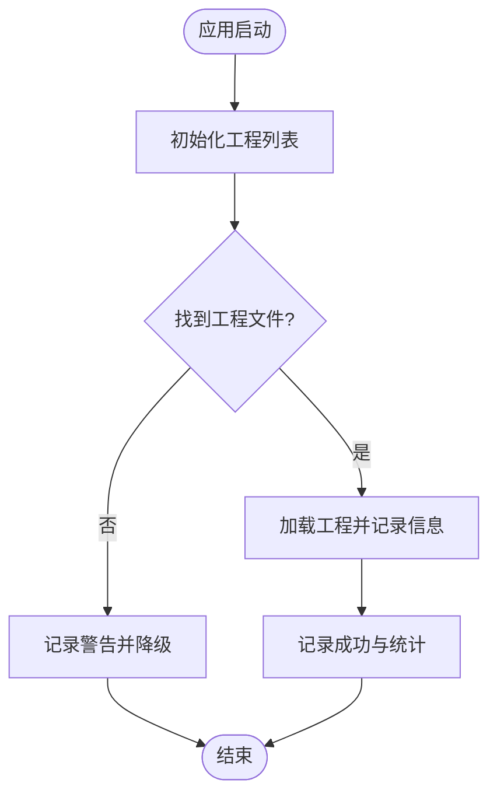

# 监控与日志管理

<cite>
**本文引用的文件**   
- [app/main.py](file://app/main.py)
- [app/config.py](file://app/config.py)
- [app/tts_engine.py](file://app/tts_engine.py)
- [app/tts_parser.py](file://app/tts_parser.py)
- [app/ui.py](file://app/ui.py)
- [app/models.py](file://app/models.py)
- [docker-compose.yml](file://docker-compose.yml)
- [Dockerfile](file://Dockerfile)
- [requirements.txt](file://requirements.txt)
- [.gitignore](file://.gitignore)
- [tests/README_GRADIO_PERFORMANCE_TESTS.md](file://tests/README_GRADIO_PERFORMANCE_TESTS.md)
- [docs/GRADIO_QUICK_REFERENCE.md](file://docs/GRADIO_QUICK_REFERENCE.md)
- [docs/EDGE_TTS_ADVANCED_MARKERS_GUIDE.md](file://docs/EDGE_TTS_ADVANCED_MARKERS_GUIDE.md)
</cite>

## 目录
1. [简介](#简介)
2. [项目结构](#项目结构)
3. [核心组件](#核心组件)
4. [架构总览](#架构总览)
5. [详细组件分析](#详细组件分析)
6. [依赖分析](#依赖分析)
7. [性能考虑](#性能考虑)
8. [故障排查指南](#故障排查指南)
9. [结论](#结论)
10. [附录](#附录)

## 简介
本指南面向运维与开发人员，聚焦于 TTS Studio 的监控与日志管理。内容涵盖：
- 日志系统配置与使用：日志级别、格式与轮转策略
- 关键性能指标监控：TTS 合成耗时、并发用户数、内存与磁盘
- 系统健康检查：服务状态、依赖服务与告警
- 日志分析与故障诊断：聚合、异常追踪、性能分析
- 监控数据可视化与报表：结合现有日志与容器健康检查
- 告警配置与通知：基于容器健康检查与日志级别的联动

## 项目结构
TTS Studio 的监控与日志相关能力主要分布在以下位置：
- 应用入口与日志初始化：app/main.py
- 配置与数据目录：app/config.py
- TTS 引擎与日志：app/tts_engine.py、app/tts_parser.py
- UI 与日志：app/ui.py
- 数据模型：app/models.py
- 容器编排与健康检查：docker-compose.yml、Dockerfile
- 依赖与忽略项：requirements.txt、.gitignore
- 性能测试与日志规范：tests/README_GRADIO_PERFORMANCE_TESTS.md、docs/GRADIO_QUICK_REFERENCE.md、docs/EDGE_TTS_ADVANCED_MARKERS_GUIDE.md

图表来源
- [app/main.py:1-51](file://app/main.py#L1-L51)
- [app/ui.py:1-200](file://app/ui.py#L1-L200)
- [app/tts_engine.py:1-200](file://app/tts_engine.py#L1-L200)
- [app/tts_parser.py:1-36](file://app/tts_parser.py#L1-L36)
- [app/models.py:1-78](file://app/models.py#L1-L78)
- [app/config.py:1-74](file://app/config.py#L1-L74)
- [Dockerfile:1-51](file://Dockerfile#L1-L51)
- [docker-compose.yml:1-32](file://docker-compose.yml#L1-L32)
- [requirements.txt:1-16](file://requirements.txt#L1-L16)
- [.gitignore:1-51](file://.gitignore#L1-L51)

章节来源
- [app/main.py:1-51](file://app/main.py#L1-L51)
- [app/config.py:1-74](file://app/config.py#L1-L74)
- [docker-compose.yml:1-32](file://docker-compose.yml#L1-L32)
- [Dockerfile:1-51](file://Dockerfile#L1-L51)
- [.gitignore:1-51](file://.gitignore#L1-L51)

## 核心组件
- 日志系统初始化：应用入口统一配置日志级别与格式，便于集中管理
- TTS 引擎日志：合成过程的关键节点与错误记录，便于定位性能瓶颈与失败原因
- UI 日志：工程加载、组件初始化、事件处理等关键路径的日志，支撑性能与稳定性分析
- 健康检查：容器层面的服务可用性探测，保障外部可观测性
- 数据目录与持久化：统一的数据与音频输出目录，便于监控磁盘占用与清理策略

章节来源
- [app/main.py:7-12](file://app/main.py#L7-L12)
- [app/tts_engine.py:17-18](file://app/tts_engine.py#L17-L18)
- [app/ui.py:18-20](file://app/ui.py#L18-L20)
- [app/config.py:10-26](file://app/config.py#L10-L26)
- [docker-compose.yml:26-31](file://docker-compose.yml#L26-L31)

## 架构总览
下图展示了日志与监控在系统中的交互关系：应用层日志、容器健康检查与外部观测工具协同工作。

图表来源
- [app/main.py:15-50](file://app/main.py#L15-L50)
- [app/tts_engine.py:120-200](file://app/tts_engine.py#L120-L200)
- [app/ui.py:13-143](file://app/ui.py#L13-L143)
- [app/config.py:10-26](file://app/config.py#L10-L26)
- [Dockerfile:50](file://Dockerfile#L50)
- [docker-compose.yml:26-31](file://docker-compose.yml#L26-L31)

## 详细组件分析

### 日志系统配置与使用
- 日志初始化：应用入口通过基础配置设置日志级别与格式，确保统一输出风格
- 日志级别：INFO 为主，配合 WARNING/ERROR 记录异常与警告
- 日志格式：包含时间戳、级别、模块名与消息体，便于检索与聚合
- 日志位置：容器标准输出，便于对接外部日志收集系统
- 目录忽略：.gitignore 中排除 logs/，避免本地开发日志污染仓库

建议
- 生产环境可通过环境变量调整日志级别（例如 DEBUG），但需权衡性能与存储
- 使用结构化日志字段（如请求 ID、用户 ID、阶段）提升检索效率

章节来源
- [app/main.py:7-12](file://app/main.py#L7-L12)
- [.gitignore:46-48](file://.gitignore#L46-L48)

### TTS 引擎日志与性能指标
- 合成流程日志：记录角色、文本、音色、语速、音调、输出路径、时长等关键信息
- 错误与重试：Azure 合成的重试机制与错误详情记录
- 空文本保护：空文本跳过合成并记录警告
- 高级标记处理：phoneme 预处理、新语法标记检测与拆分拼接流程均有日志

关键指标建议
- TTS 合成耗时：从开始合成到完成的时长（秒），可用于评估吞吐与延迟
- 并发用户数：结合容器实例数与 UI 访问量估算
- 内存使用：容器资源监控（RSS/堆等），结合日志中的异常栈定位内存泄漏
- 磁盘空间：监控 data/audio 与 data/projects 目录增长趋势

章节来源
- [app/tts_engine.py:54-118](file://app/tts_engine.py#L54-L118)
- [app/tts_engine.py:147-200](file://app/tts_engine.py#L147-L200)
- [app/tts_engine.py:177-193](file://app/tts_engine.py#L177-L193)
- [app/config.py:20-26](file://app/config.py#L20-L26)

### UI 日志与性能监控
- 应用启动与工程列表初始化：记录工程数量、路径与加载状态
- 预加载与异常处理：失败时记录错误与堆栈，使用默认值降级
- 事件处理与更新：日志规范要求通过返回值更新组件，避免运行时赋值导致的前端不刷新
- 表格与工程管理：工程文件扫描、排序与大小格式化，均记录日志

性能建议
- 预加载优于懒加载，静态初始化优于动态更新
- 控制组件数量与嵌套深度，避免深层 Accordion 导致的卡顿

章节来源
- [app/ui.py:18-20](file://app/ui.py#L18-L20)
- [app/ui.py:20-31](file://app/ui.py#L20-L31)
- [app/ui.py:136-142](file://app/ui.py#L136-L142)
- [tests/README_GRADIO_PERFORMANCE_TESTS.md:273-329](file://tests/README_GRADIO_PERFORMANCE_TESTS.md#L273-L329)
- [docs/GRADIO_QUICK_REFERENCE.md:1-82](file://docs/GRADIO_QUICK_REFERENCE.md#L1-L82)

### 健康检查与系统监控
- 容器健康检查：通过 TCP 探针检测 7860 端口，配置间隔、超时与重试
- 服务暴露：容器映射 7860 端口，便于外部探测
- 数据持久化：卷挂载 /app/data，便于监控磁盘使用与备份

建议
- 结合外部健康检查工具（如 Prometheus、Grafana）采集容器指标
- 配置告警阈值：端口不可达、CPU/内存/磁盘使用率过高、日志错误率上升

章节来源
- [docker-compose.yml:26-31](file://docker-compose.yml#L26-L31)
- [docker-compose.yml:9-13](file://docker-compose.yml#L9-L13)
- [Dockerfile:48](file://Dockerfile#L48)

### 日志格式与轮转策略
- 格式：时间戳、级别、模块名、消息体
- 输出：容器标准输出，适合对接日志聚合系统（如 Fluent Bit、Fluentd、Vector、Loki）
- 轮转：建议在部署环境中使用容器日志驱动的轮转策略（如 json-file 驱动的 maxSize/maxFile）

章节来源
- [app/main.py:9-11](file://app/main.py#L9-L11)

### 数据目录与磁盘监控
- 目录结构：data/audio、data/projects、data/tmp
- 持久化：卷挂载至 /app/data，便于监控与备份
- 建议：定期清理临时文件与历史工程，设置磁盘配额与告警

章节来源
- [app/config.py:10-26](file://app/config.py#L10-L26)
- [Dockerfile:36](file://Dockerfile#L36)
- [docker-compose.yml:11-13](file://docker-compose.yml#L11-L13)

## 依赖分析
- 运行时依赖：Gradio、edge-tts、pydub、mutagen
- 健康检查依赖：网络连通性（TCP 7860）
- 日志依赖：Python logging 标准库

图表来源
- [app/main.py:1-51](file://app/main.py#L1-L51)
- [app/tts_engine.py:1-29](file://app/tts_engine.py#L1-L29)
- [app/ui.py:1-12](file://app/ui.py#L1-L12)
- [Dockerfile:1-51](file://Dockerfile#L1-L51)
- [docker-compose.yml:1-32](file://docker-compose.yml#L1-L32)
- [requirements.txt:1-16](file://requirements.txt#L1-L16)

章节来源
- [requirements.txt:1-16](file://requirements.txt#L1-L16)

## 性能考虑
- UI 构建性能：端到端构建应在合理时间内完成，避免深层嵌套与运行时赋值
- 合成性能：记录每条合成耗时，识别慢请求与失败重试
- 资源监控：容器 CPU/内存/磁盘使用率与日志错误率联动告警

章节来源
- [tests/README_GRADIO_PERFORMANCE_TESTS.md:273-329](file://tests/README_GRADIO_PERFORMANCE_TESTS.md#L273-L329)
- [docs/GRADIO_QUICK_REFERENCE.md:1-82](file://docs/GRADIO_QUICK_REFERENCE.md#L1-L82)

## 故障排查指南
- 合成失败定位：查看 TTS 引擎日志中的错误详情与重试记录
- UI 卡顿排查：检查是否存在深层嵌套与运行时赋值，遵循返回值更新原则
- 健康检查失败：确认容器端口 7860 可达，查看容器日志与资源使用
- 数据目录异常：检查 data/audio 与 data/projects 目录权限与磁盘空间

章节来源
- [app/tts_engine.py:109-118](file://app/tts_engine.py#L109-L118)
- [app/ui.py:136-142](file://app/ui.py#L136-L142)
- [docker-compose.yml:26-31](file://docker-compose.yml#L26-L31)
- [app/config.py:20-26](file://app/config.py#L20-L26)

## 结论
TTS Studio 的监控与日志体系以应用层日志与容器健康检查为核心，辅以性能测试与日志规范，能够有效支撑稳定性与可维护性。建议在生产环境中完善日志聚合、指标采集与告警联动，并持续优化 UI 与合成流程的性能表现。

## 附录

### 关键流程时序图：TTS 合成与日志记录

图表来源
- [app/ui.py:1574-1597](file://app/ui.py#L1574-L1597)
- [app/tts_engine.py:120-200](file://app/tts_engine.py#L120-L200)
- [app/tts_parser.py:1-36](file://app/tts_parser.py#L1-L36)
- [app/main.py:7-12](file://app/main.py#L7-L12)

### 流程图：UI 预加载与日志记录

图表来源
- [app/ui.py:18-31](file://app/ui.py#L18-L31)
- [app/ui.py:136-142](file://app/ui.py#L136-L142)