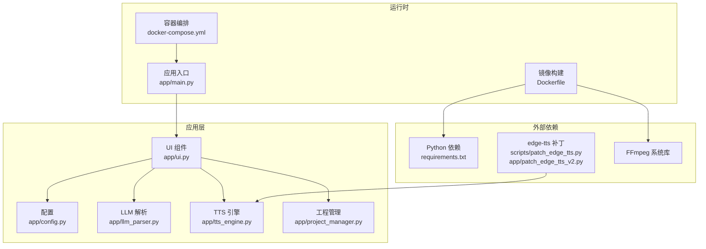
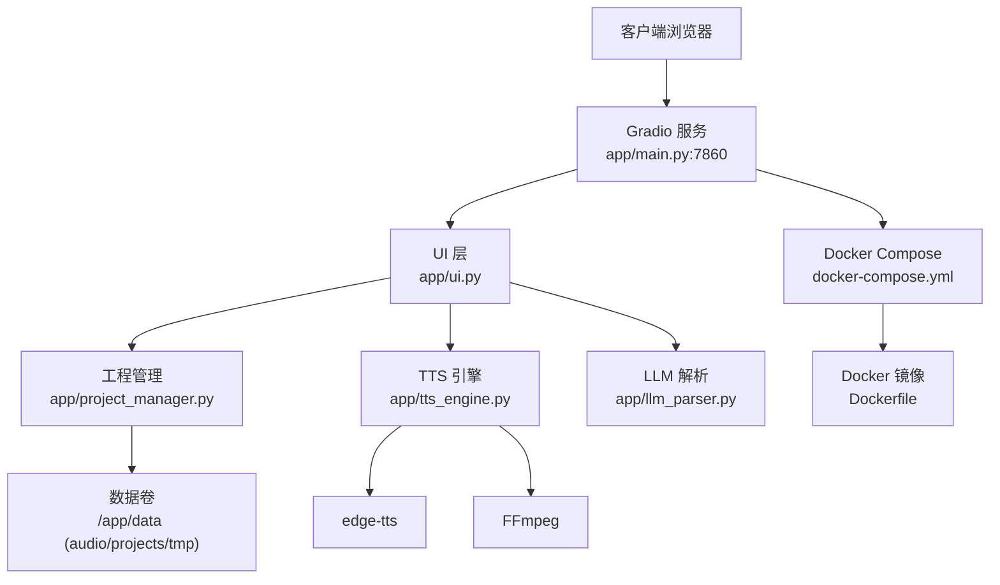
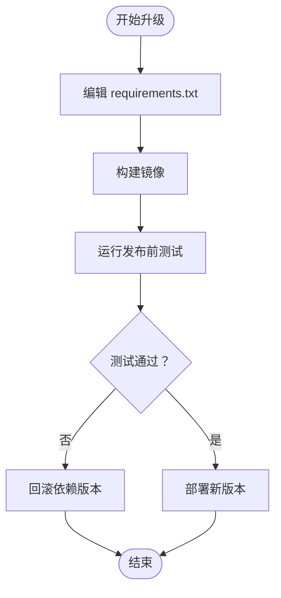
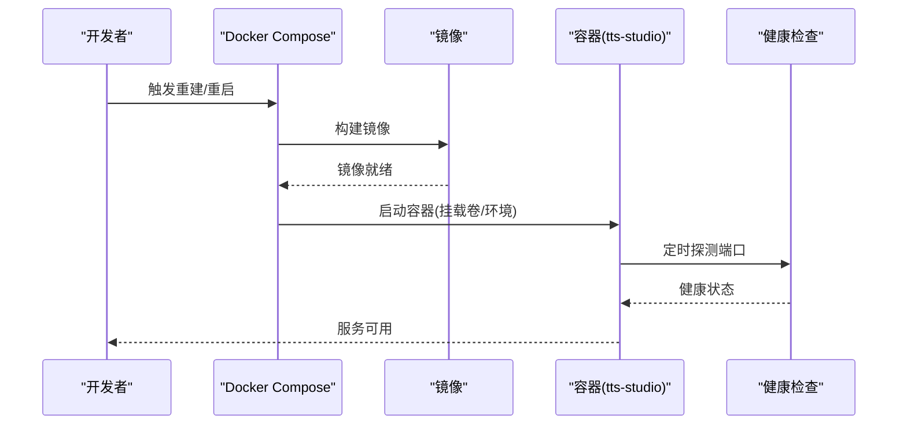
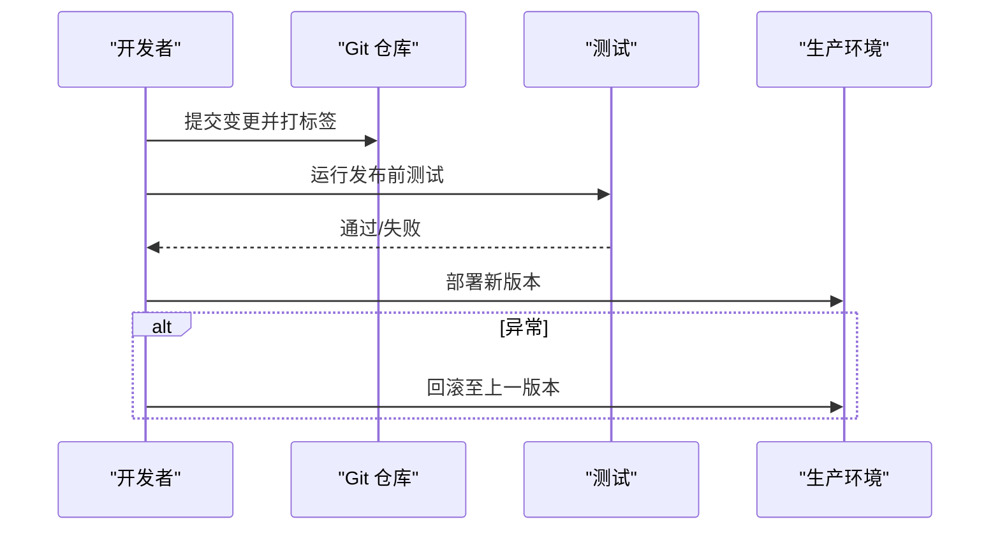
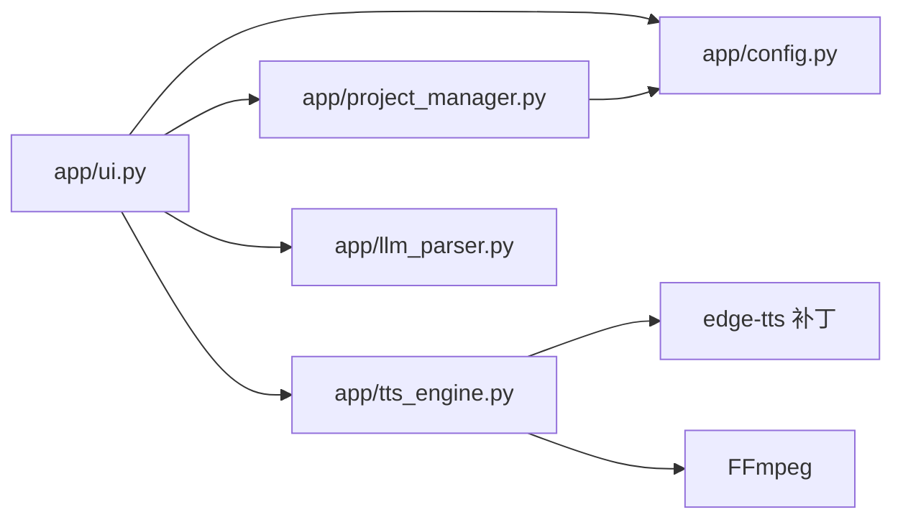

# 维护与更新

<cite>
**本文引用的文件**
- [Dockerfile](file://Dockerfile)
- [docker-compose.yml](file://docker-compose.yml)
- [requirements.txt](file://requirements.txt)
- [setup.sh](file://setup.sh)
- [app/config.py](file://app/config.py)
- [app/main.py](file://app/main.py)
- [app/ui.py](file://app/ui.py)
- [app/llm_parser.py](file://app/llm_parser.py)
- [app/tts_engine.py](file://app/tts_engine.py)
- [app/project_manager.py](file://app/project_manager.py)
- [scripts/patch_edge_tts.py](file://scripts/patch_edge_tts.py)
- [app/patch_edge_tts_v2.py](file://app/patch_edge_tts_v2.py)
- [tests/run_ui_tests.py](file://tests/run_ui_tests.py)
- [docs/RELEASE_CHECKLIST.md](file://docs/RELEASE_CHECKLIST.md)
- [docs/README.md](file://docs/README.md)
- [docs/GRADIO_QUICK_REFERENCE.md](file://docs/GRADIO_QUICK_REFERENCE.md)
- [demo_complex.py](file://demo_complex.py)
</cite>

## 目录
1. [简介](#简介)
2. [项目结构](#项目结构)
3. [核心组件](#核心组件)
4. [架构总览](#架构总览)
5. [详细组件分析](#详细组件分析)
6. [依赖关系分析](#依赖关系分析)
7. [性能考量](#性能考量)
8. [故障排除指南](#故障排除指南)
9. [结论](#结论)
10. [附录](#附录)

## 简介
本指南面向运维与开发人员，提供 TTS Studio 的维护与更新策略，涵盖依赖包升级、Docker 镜像更新、配置文件变更处理、备份与恢复、自动化维护任务、安全更新与漏洞修复、版本管理与回滚、系统检查清单与故障排除、以及灾难恢复与业务连续性保障。

## 项目结构
- 应用入口与运行方式
  - 本地运行：通过模块入口启动服务，监听 0.0.0.0:7860。
  - 容器运行：基于 Dockerfile 构建镜像，docker-compose 挂载数据卷与源码，暴露 7860 端口，并内置健康检查。
- 配置与数据
  - 配置读取优先级：环境变量 > 默认值；容器内默认数据目录为 /app/data，本地开发默认为项目根目录 data。
  - 数据目录：audio、projects、tmp，分别用于音频输出、工程文件与临时文件。
- 依赖与补丁
  - Python 依赖集中在 requirements.txt；项目包含对 edge-tts 的补丁脚本，以支持自定义 SSML。
- 文档与测试
  - 发布检查清单与测试运行器，提供自动化回归与手动检查项。

图表来源
- [Dockerfile:1-51](file://Dockerfile#L1-L51)
- [docker-compose.yml:1-32](file://docker-compose.yml#L1-L32)
- [app/main.py:1-540](file://app/main.py#L1-L540)
- [app/ui.py:1-526](file://app/ui.py#L1-L526)
- [app/config.py:1-74](file://app/config.py#L1-L74)
- [app/llm_parser.py:1-20](file://app/llm_parser.py#L1-L20)
- [app/tts_engine.py:1-215](file://app/tts_engine.py#L1-L215)
- [app/project_manager.py:1-286](file://app/project_manager.py#L1-L286)
- [requirements.txt:1-16](file://requirements.txt#L1-L16)
- [scripts/patch_edge_tts.py:1-105](file://scripts/patch_edge_tts.py#L1-L105)
- [app/patch_edge_tts_v2.py:1-117](file://app/patch_edge_tts_v2.py#L1-L117)

章节来源
- [Dockerfile:1-51](file://Dockerfile#L1-L51)
- [docker-compose.yml:1-32](file://docker-compose.yml#L1-L32)
- [app/config.py:1-74](file://app/config.py#L1-L74)
- [app/main.py:1-540](file://app/main.py#L1-L540)

## 核心组件
- 配置与环境
  - 通过环境变量 DEFAULT_API_BASE、DEFAULT_API_KEY、DEFAULT_MODEL 控制 LLM 接入参数；容器内自动识别并设置数据目录。
- UI 与交互
  - 基于 Gradio Blocks 构建，包含工程管理、文本解析、对白编辑、混音输出等模块；支持工程保存/加载、音效/背景乐添加、批量生成与预听。
- TTS 引擎
  - 使用 edge-tts 生成语音，结合 pydub 进行音频拼接与混合；支持自定义 SSML 与 prosody 标记。
- 工程管理
  - 将剧本解析为 ScriptLine，转换为 AudioClip 并持久化为 JSON；支持加载/保存工程文件。
- 补丁与兼容
  - 提供两个版本的 edge-tts 补丁脚本，增强自定义 SSML 支持与调试能力。

章节来源
- [app/config.py:1-74](file://app/config.py#L1-L74)
- [app/ui.py:1-526](file://app/ui.py#L1-L526)
- [app/tts_engine.py:1-215](file://app/tts_engine.py#L1-L215)
- [app/project_manager.py:1-286](file://app/project_manager.py#L1-L286)
- [scripts/patch_edge_tts.py:1-105](file://scripts/patch_edge_tts.py#L1-L105)
- [app/patch_edge_tts_v2.py:1-117](file://app/patch_edge_tts_v2.py#L1-L117)

## 架构总览
TTS Studio 采用“容器化部署 + Gradio UI + Python 服务”的架构。容器内安装 FFmpeg 与 Python 依赖，应用通过 app/main.py 启动 Gradio 服务；数据通过卷挂载持久化至宿主机。

图表来源
- [app/main.py:1-540](file://app/main.py#L1-L540)
- [app/ui.py:1-526](file://app/ui.py#L1-L526)
- [app/project_manager.py:1-286](file://app/project_manager.py#L1-L286)
- [app/tts_engine.py:1-215](file://app/tts_engine.py#L1-L215)
- [app/llm_parser.py:1-20](file://app/llm_parser.py#L1-L20)
- [docker-compose.yml:1-32](file://docker-compose.yml#L1-L32)
- [Dockerfile:1-51](file://Dockerfile#L1-L51)

## 详细组件分析

### 依赖包升级策略
- 升级流程
  - 在隔离环境中更新 requirements.txt 中的版本约束。
  - 使用 pip 安装新依赖，确保镜像构建阶段可用（镜像内使用国内源）。
  - 运行发布前测试套件，验证 UI 与核心功能。
- 影响评估
  - edge-tts、gradio、openai、pydub 等关键依赖升级可能影响 SSML 生成、UI 响应与音频处理行为，需重点回归。
- 回滚策略
  - 若升级导致功能异常，回退到上一版本镜像或锁定旧版本依赖。

图表来源
- [requirements.txt:1-16](file://requirements.txt#L1-L16)
- [Dockerfile:28-34](file://Dockerfile#L28-L34)
- [tests/run_ui_tests.py:1-122](file://tests/run_ui_tests.py#L1-L122)

章节来源
- [requirements.txt:1-16](file://requirements.txt#L1-L16)
- [Dockerfile:28-34](file://Dockerfile#L28-L34)
- [tests/run_ui_tests.py:1-122](file://tests/run_ui_tests.py#L1-L122)

### Docker 镜像更新与健康检查
- 镜像构建
  - 使用 Python slim-bookworm 基础镜像，安装 FFmpeg 与系统库，pip 使用国内源加速。
  - 构建上下文包含 app 源码与 requirements.txt，容器暴露 7860 端口。
- 健康检查
  - docker-compose 中定义健康检查，探测本地 7860 端口连通性，间隔 30s，超时 10s，重试 3 次，启动期 15s。
- 更新步骤
  - 更改 Dockerfile 或 requirements.txt 后重建镜像，重启容器生效。
  - 如需权限修复，可使用 setup.sh 生成 .env 并按需调整 UID/GID。

图表来源
- [Dockerfile:1-51](file://Dockerfile#L1-L51)
- [docker-compose.yml:1-32](file://docker-compose.yml#L1-L32)
- [setup.sh:641-655](file://setup.sh#L641-L655)

章节来源
- [Dockerfile:1-51](file://Dockerfile#L1-L51)
- [docker-compose.yml:1-32](file://docker-compose.yml#L1-L32)
- [setup.sh:641-655](file://setup.sh#L641-L655)

### 配置文件变更处理
- 环境变量
  - DEFAULT_API_BASE、DEFAULT_API_KEY、DEFAULT_MODEL 通过 .env 或 docker-compose environment 注入。
  - 容器内自动识别 /app/data 作为数据根目录，本地开发使用项目 data 目录。
- 卷挂载
  - docker-compose 将 ./data 映射到 /app/data，.env 只读挂载，便于在不重建镜像的情况下调整配置。
- 变更流程
  - 修改 .env 或 docker-compose 环境变量后，重启容器使变更生效。
  - 如涉及目录结构或权限，可通过 setup.sh 生成 .env 并设置 UID/GID。

章节来源
- [app/config.py:1-74](file://app/config.py#L1-L74)
- [docker-compose.yml:1-32](file://docker-compose.yml#L1-L32)
- [setup.sh:641-655](file://setup.sh#L641-L655)

### 备份与恢复策略
- 数据备份
  - 容器数据卷：/app/data/audio、/app/data/projects、/app/data/tmp。
  - 建议周期性将宿主机 ./data 目录打包备份。
- 配置备份
  - .env 文件与 docker-compose.yml 为关键配置，建议纳入版本控制或单独备份。
- 完整系统备份
  - 镜像层 + 卷 + 配置三者备份，恢复时先还原配置与卷，再重建容器。
- 恢复演练
  - 使用 demo_complex.py 生成示例音频，验证 TTS 与拼接链路是否正常。

章节来源
- [docker-compose.yml:11-14](file://docker-compose.yml#L11-L14)
- [app/config.py:13-26](file://app/config.py#L13-L26)
- [demo_complex.py:1-239](file://demo_complex.py#L1-L239)

### 自动化维护与 Cron 作业
- 建议任务
  - 日志清理：清理 /app/data/tmp 下临时文件，避免磁盘膨胀。
  - 健康巡检：通过 curl 或端口探测检查 7860 状态。
  - 备份校验：对最近备份进行完整性校验。
- 配置方式
  - 在宿主机 crontab 中添加上述任务，注意容器重启后卷挂载路径保持一致。
- 与容器集成
  - 可将维护脚本放入容器内或宿主机，通过 docker exec 或卷挂载执行。

[本节为通用运维建议，无需特定文件引用]

### 安全更新与漏洞修复
- 依赖安全扫描
  - 使用 pip-audit 或第三方工具扫描 requirements.txt 中的安全漏洞。
- 及时升级
  - 对发现的高危漏洞，立即在隔离环境验证升级可行性，随后按发布流程上线。
- 网络与代理
  - 若需代理访问 LLM，确保 .env 中 DEFAULT_API_BASE 指向可信地址。
- 审计与日志
  - 保留容器日志与应用日志，便于审计与问题追踪。

章节来源
- [requirements.txt:1-16](file://requirements.txt#L1-L16)
- [app/llm_parser.py:1-20](file://app/llm_parser.py#L1-L20)

### 版本管理与回滚机制
- 版本标签与分支
  - 使用 Git 标签标记发布版本；建议主干分支保护，发布分支用于热修复。
- 回滚方案
  - 发布前测试通过后方可上线；若异常，可回滚到上一版本镜像或代码。
  - 文档提供了针对 UI 的快速回滚示例，可迁移至生产流程。

图表来源
- [docs/RELEASE_CHECKLIST.md:128-161](file://docs/RELEASE_CHECKLIST.md#L128-L161)

章节来源
- [docs/RELEASE_CHECKLIST.md:1-168](file://docs/RELEASE_CHECKLIST.md#L1-L168)

### 系统维护检查清单
- 依赖与镜像
  - 依赖版本与许可证合规性检查；镜像构建日志无错误。
- 配置与卷
  - .env 与 docker-compose 环境变量正确；卷挂载路径有效。
- 服务健康
  - 7860 端口可访问；健康检查通过；容器日志无异常。
- 数据与权限
  - /app/data 目录存在且可写；UID/GID 与宿主机映射正确。
- 功能回归
  - 运行发布前测试套件；手动验证关键功能。

章节来源
- [tests/run_ui_tests.py:1-122](file://tests/run_ui_tests.py#L1-L122)
- [docker-compose.yml:26-31](file://docker-compose.yml#L26-L31)
- [app/config.py:13-26](file://app/config.py#L13-L26)

## 依赖关系分析
- 组件耦合
  - UI 依赖配置、工程管理、TTS 引擎与 LLM 解析；TTS 引擎依赖 edge-tts 与 FFmpeg；工程管理负责序列化/反序列化。
- 外部依赖
  - Python 依赖集中于 requirements.txt；edge-tts 通过补丁脚本增强 SSML 支持。
- 循环依赖
  - 当前模块间无明显循环导入；补丁脚本仅在模块导入时替换方法。

图表来源
- [app/ui.py:1-526](file://app/ui.py#L1-L526)
- [app/config.py:1-74](file://app/config.py#L1-L74)
- [app/project_manager.py:1-286](file://app/project_manager.py#L1-L286)
- [app/tts_engine.py:1-215](file://app/tts_engine.py#L1-L215)
- [app/llm_parser.py:1-20](file://app/llm_parser.py#L1-L20)
- [scripts/patch_edge_tts.py:1-105](file://scripts/patch_edge_tts.py#L1-L105)
- [app/patch_edge_tts_v2.py:1-117](file://app/patch_edge_tts_v2.py#L1-L117)

章节来源
- [app/ui.py:1-526](file://app/ui.py#L1-L526)
- [app/tts_engine.py:1-215](file://app/tts_engine.py#L1-L215)
- [app/project_manager.py:1-286](file://app/project_manager.py#L1-L286)
- [app/llm_parser.py:1-20](file://app/llm_parser.py#L1-L20)
- [scripts/patch_edge_tts.py:1-105](file://scripts/patch_edge_tts.py#L1-L105)
- [app/patch_edge_tts_v2.py:1-117](file://app/patch_edge_tts_v2.py#L1-L117)

## 性能考量
- UI 性能
  - 避免使用 demo.load；采用预加载与静态初始化，减少嵌套层级，提升首屏与切换性能。
- 音频处理
  - 合理设置临时目录与缓存，避免频繁 IO；批量合成时注意内存占用。
- 容器资源
  - 为容器设置合理的 CPU/内存限制，避免与其他服务争抢资源。

章节来源
- [docs/GRADIO_QUICK_REFERENCE.md:1-151](file://docs/GRADIO_QUICK_REFERENCE.md#L1-L151)
- [docker-compose.yml:1-32](file://docker-compose.yml#L1-L32)

## 故障排除指南
- UI 无法加载或卡顿
  - 检查是否存在 demo.load 或深层嵌套；采用预加载与静态初始化替代。
- 组件更新不显示
  - 通过返回值更新组件，而非运行时赋值 .value。
- 首次加载数据空白
  - 在初始化时传入初始值，避免运行时赋值。
- 服务启动失败
  - 检查 7860 端口占用与健康检查；查看容器日志。
- LLM 解析异常
  - 校验 DEFAULT_API_BASE、DEFAULT_API_KEY、DEFAULT_MODEL；确保网络可达。
- TTS 生成失败
  - 确认 edge-tts 补丁已生效；检查 FFmpeg 是否可用；查看音频输出目录权限。

章节来源
- [docs/GRADIO_QUICK_REFERENCE.md:1-151](file://docs/GRADIO_QUICK_REFERENCE.md#L1-L151)
- [docker-compose.yml:26-31](file://docker-compose.yml#L26-L31)
- [app/llm_parser.py:1-20](file://app/llm_parser.py#L1-L20)
- [app/tts_engine.py:1-215](file://app/tts_engine.py#L1-L215)

## 结论
通过规范的依赖升级流程、容器化部署与健康检查、完善的配置与数据备份策略、自动化测试与回滚机制，以及持续的安全与性能优化，TTS Studio 可实现稳定、可维护、可扩展的运行与演进。建议将本文流程固化为标准作业程序（SOP），并定期演练灾难恢复。

## 附录

### 发布前测试与回滚流程
- 发布前测试
  - 运行测试套件，验证 UI 构建与核心功能。
- 快速发布
  - 停止旧服务，运行测试，通过后启动新服务。
- 回滚方案
  - 停止服务，回退到上一版本代码，重新启动。

章节来源
- [tests/run_ui_tests.py:1-122](file://tests/run_ui_tests.py#L1-L122)
- [docs/RELEASE_CHECKLIST.md:128-161](file://docs/RELEASE_CHECKLIST.md#L128-L161)

### 边界与限制说明
- Gradio 性能限制与最佳实践详见文档索引与快速参考。
- Edge-TTS 能力边界与多音字编辑器限制详见相关文档。

章节来源
- [docs/README.md:1-171](file://docs/README.md#L1-L171)
- [docs/GRADIO_QUICK_REFERENCE.md:1-151](file://docs/GRADIO_QUICK_REFERENCE.md#L1-L151)