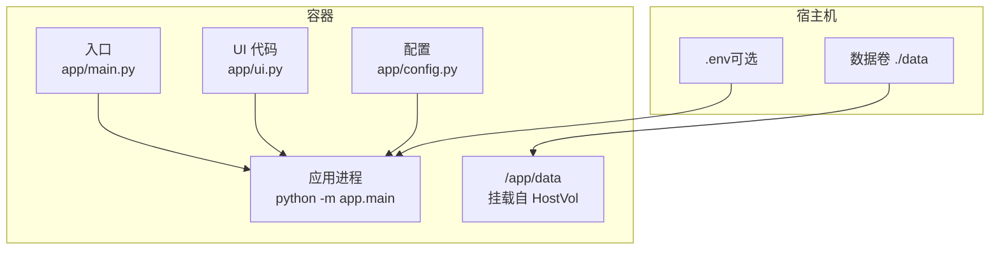
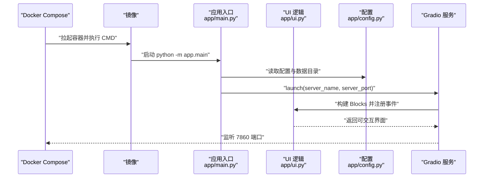
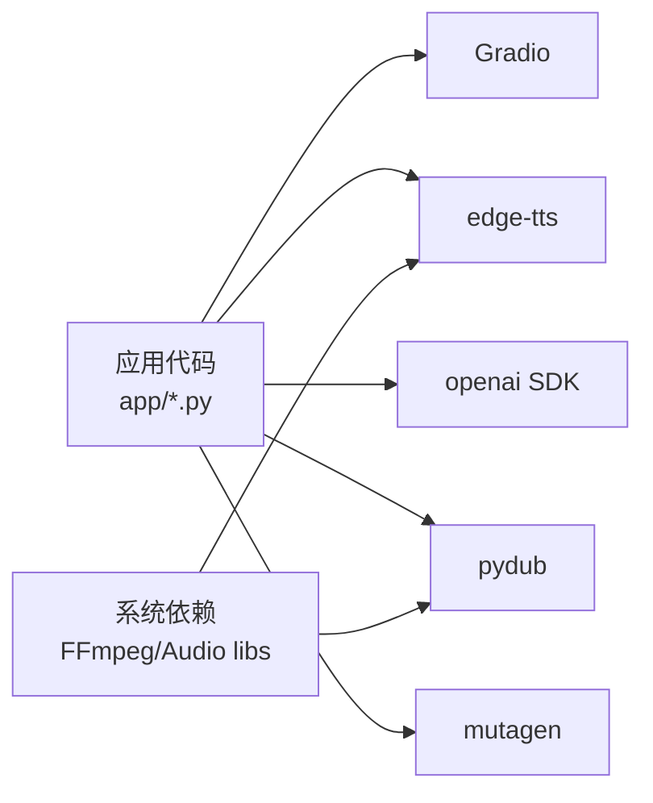

# 部署与运维

<cite>
**本文引用的文件**
- [Dockerfile](file://Dockerfile)
- [docker-compose.yml](file://docker-compose.yml)
- [requirements.txt](file://requirements.txt)
- [app/config.py](file://app/config.py)
- [app/main.py](file://app/main.py)
- [app/ui.py](file://app/ui.py)
- [run_server.py](file://run_server.py)
- [setup.sh](file://setup.sh)
- [docs/RELEASE_CHECKLIST.md](file://docs/RELEASE_CHECKLIST.md)
- [tests/README_GRADIO_PERFORMANCE_TESTS.md](file://tests/README_GRADIO_PERFORMANCE_TESTS.md)
</cite>

## 目录
1. [简介](#简介)
2. [项目结构](#项目结构)
3. [核心组件](#核心组件)
4. [架构总览](#架构总览)
5. [详细组件分析](#详细组件分析)
6. [依赖分析](#依赖分析)
7. [性能考虑](#性能考虑)
8. [故障排除指南](#故障排除指南)
9. [结论](#结论)
10. [附录](#附录)

## 简介
本指南面向运维与平台工程团队，提供 TTS Studio 的完整部署与运维实践，涵盖 Docker 容器化打包与编排、生产环境部署策略、配置项与环境变量说明、性能优化建议、监控与日志管理、备份与恢复、安全加固以及维护更新流程，并配套常见问题排查方法。

## 项目结构
TTS Studio 采用“Python 应用 + Gradio UI + Docker 容器化”的结构。核心目录与文件如下：
- Dockerfile：镜像构建脚本，安装运行时依赖（FFmpeg 等），准备 Python 环境与应用代码。
- docker-compose.yml：服务编排，暴露端口、挂载数据卷、注入环境变量、健康检查。
- requirements.txt：Python 依赖清单（Gradio、edge-tts、OpenAI SDK、pydub 等）。
- app/config.py：应用配置与数据目录策略（区分容器与本地开发环境）。
- app/main.py：应用入口，启动 Gradio 服务。
- app/ui.py：Gradio 界面与业务逻辑（工程管理、文本解析、TTS 合成、混音输出）。
- run_server.py：便捷启动脚本（直接启动 Gradio 服务）。
- setup.sh：一键生成项目所需文件（含 Dockerfile、compose、requirements 等）。

图表来源
- [Dockerfile](file://Dockerfile)
- [docker-compose.yml](file://docker-compose.yml)
- [app/config.py](file://app/config.py)
- [app/main.py](file://app/main.py)
- [app/ui.py](file://app/ui.py)

章节来源
- [Dockerfile](file://Dockerfile)
- [docker-compose.yml](file://docker-compose.yml)
- [requirements.txt](file://requirements.txt)
- [app/config.py](file://app/config.py)
- [app/main.py](file://app/main.py)
- [app/ui.py](file://app/ui.py)
- [run_server.py](file://run_server.py)
- [setup.sh](file://setup.sh)

## 核心组件
- 容器镜像与运行时
  - 基于精简 Debian 的 Python 3.11 镜像，安装 FFmpeg 与音频处理依赖，禁用 Python 编译缓存与缓冲，提升容器稳定性与启动速度。
  - 暴露 7860 端口，CMD 启动应用入口模块。
- 服务编排与数据持久化
  - docker-compose 将宿主机 ./data 映射到容器 /app/data，确保工程与音频数据持久化。
  - 注入环境变量（如 DEFAULT_API_BASE、DEFAULT_API_KEY、DEFAULT_MODEL），并设置健康检查。
- 应用配置与目录策略
  - app/config.py 根据是否处于容器环境自动选择数据目录，确保容器内统一使用 /app/data。
  - 预创建 audio、projects、tmp 子目录，避免首次运行权限与路径问题。
- UI 与业务逻辑
  - app/ui.py 实现工程管理、文本解析、TTS 合成、混音输出等全流程。
  - app/main.py 配置日志级别与 Gradio 启动参数，限定允许访问的路径，提升安全性。

章节来源
- [Dockerfile](file://Dockerfile)
- [docker-compose.yml](file://docker-compose.yml)
- [app/config.py](file://app/config.py)
- [app/main.py](file://app/main.py)
- [app/ui.py](file://app/ui.py)

## 架构总览
下图展示容器内应用启动与服务暴露的关键流程：

图表来源
- [docker-compose.yml](file://docker-compose.yml)
- [app/main.py](file://app/main.py)
- [app/ui.py](file://app/ui.py)
- [app/config.py](file://app/config.py)

## 详细组件分析

### 容器化与镜像构建
- 基础镜像与环境变量
  - 使用 Python 3.11 slim-bookworm，设置 PYTHONDONTWRITEBYTECODE、PYTHONUNBUFFERED、PIP_* 等环境变量，减少磁盘写入与 IO 缓冲，提升容器启动与运行效率。
  - 使用阿里云镜像源加速 pip 安装。
- 系统依赖
  - 安装 FFmpeg 与音频编解码库，满足 edge-tts 输出与 pydub 音频处理需求。
- 工作目录与数据目录
  - WORKDIR 设为 /app，预创建 /app/data/{audio, projects, tmp}，确保容器内路径一致性。
- 用户与权限
  - 原始 Dockerfile 以 root 运行，便于权限问题排查；若需更严格的安全基线，可启用非 root 用户（参考 docker-compose 中的 UID/GID 参数与 setup.sh 的用户创建逻辑）。

章节来源
- [Dockerfile](file://Dockerfile)

### 服务编排与运行参数
- 端口映射
  - 将容器 7860 映射到宿主机 7860，便于本地访问。
- 数据卷
  - ./data 挂载到 /app/data，持久化工程与音频文件。
- 环境变量
  - GRADIO_SERVER_NAME/GRADIO_SERVER_PORT：控制 Gradio 监听地址与端口。
  - DEFAULT_API_BASE/DEFAULT_API_KEY/DEFAULT_MODEL：LLM 解析服务的默认配置。
  - TMPDIR/MPLCONFIGDIR：临时目录与 Matplotlib 配置目录，避免权限问题。
- 健康检查
  - 通过连接本地 7860 端口判断服务可用性，间隔、超时、重试次数与启动宽限期已配置。

章节来源
- [docker-compose.yml](file://docker-compose.yml)

### 应用配置与数据目录策略
- 容器检测
  - 通过 /.dockerenv 或 DOCKER_CONTAINER 环境变量判断是否在容器内，从而选择 /app/data 作为数据根目录。
- 目录创建
  - 自动创建 AUDIO_DIR 与 PROJECTS_DIR，避免首次运行报错。
- 默认 LLM 配置
  - 从环境变量读取 DEFAULT_API_BASE、DEFAULT_API_KEY、DEFAULT_MODEL，未设置时使用默认值。

章节来源
- [app/config.py](file://app/config.py)

### 启动入口与日志
- 启动入口
  - app/main.py 配置日志格式与级别，启动 Gradio 服务，限定 allowed_paths 仅允许访问 DATA_DIR，降低路径遍历风险。
- 便捷启动
  - run_server.py 直接启动 Gradio，适合本地开发调试。

章节来源
- [app/main.py](file://app/main.py)
- [run_server.py](file://run_server.py)

### UI 与业务流程
- 工程管理
  - 支持新建、保存、加载工程，工程文件保存在 PROJECTS_DIR，音频片段保存在 AUDIO_DIR。
- 文本解析
  - 调用 LLM（OpenAI 兼容接口）解析剧本，生成对白片段。
- TTS 合成与混音
  - 使用 edge-tts 生成语音，pydub 进行音频叠加与导出。
- 事件与日志
  - UI 中大量使用日志记录关键步骤与上下文，便于运维定位问题。

章节来源
- [app/ui.py](file://app/ui.py)

## 依赖分析
- Python 依赖
  - Gradio：Web UI 框架。
  - edge-tts：微软 Edge TTS 引擎。
  - openai：LLM 解析（OpenAI 兼容 API）。
  - pydub/mutagen：音频处理与元数据读取。
- 运行时依赖
  - FFmpeg 与音频编解码库：容器内已安装，满足 TTS 与混音需求。

图表来源
- [requirements.txt](file://requirements.txt)
- [app/ui.py](file://app/ui.py)

章节来源
- [requirements.txt](file://requirements.txt)

## 性能考虑
- 启动与首屏性能
  - 避免使用 Gradio demo.load 等运行时事件，采用预加载与静态初始化，确保首屏加载与 Tab 切换流畅。
  - 测试文档建议首屏加载时间 < 3 秒，避免控制台大量性能警告。
- 并发与资源分配
  - Gradio 默认单进程，若需更高吞吐，可在反向代理后多实例部署并通过负载均衡分发请求。
  - 容器资源限制建议：CPU/内存配额按并发与音频合成时长估算，预留一定余量。
- I/O 与存储
  - 将 /app/data 挂载到高性能持久化存储，避免频繁小文件写入导致的 I/O 抖动。
- 日志与诊断
  - 生产环境建议将日志输出到 stdout/stderr，结合容器日志收集系统集中管理。

章节来源
- [tests/README_GRADIO_PERFORMANCE_TESTS.md](file://tests/README_GRADIO_PERFORMANCE_TESTS.md)
- [app/main.py](file://app/main.py)

## 故障排除指南
- 无法访问 Web UI
  - 检查端口 7860 是否被占用，确认 docker-compose 端口映射与防火墙放行。
  - 查看健康检查是否通过，必要时查看容器日志。
- 服务启动后空白页面或卡顿
  - 确认未使用 demo.load 等导致性能问题的模式；检查是否存在大量嵌套 Accordion/Tabs。
  - 关注浏览器控制台是否有性能警告。
- LLM 解析失败
  - 核对 DEFAULT_API_BASE/DEFAULT_API_KEY/DEFAULT_MODEL 是否正确，确保 LLM 服务可达且返回 JSON。
- 音频合成失败
  - 确认 edge-tts 可用，FFmpeg 正常，/app/data/tmp 可写。
- 工程文件加载异常
  - 检查工程文件格式与字段完整性，必要时使用回滚方案恢复至上一版本。

章节来源
- [docker-compose.yml](file://docker-compose.yml)
- [app/config.py](file://app/config.py)
- [tests/README_GRADIO_PERFORMANCE_TESTS.md](file://tests/README_GRADIO_PERFORMANCE_TESTS.md)
- [docs/RELEASE_CHECKLIST.md](file://docs/RELEASE_CHECKLIST.md)

## 结论
通过标准化的 Docker 镜像与 compose 编排，TTS Studio 可在生产环境中实现快速部署与稳定运行。结合合理的资源配置、日志与监控策略、严格的备份与回滚流程，可有效保障服务的可用性与可维护性。

## 附录

### Docker 部署与运维最佳实践
- 镜像与版本
  - 使用固定标签的 Python 基础镜像，避免运行时差异。
  - 定期扫描镜像漏洞并更新依赖。
- 容器运行
  - 限制 CPU/内存，设置重启策略（unless-stopped）。
  - 使用只读根文件系统与最小权限原则（如启用非 root 用户）。
- 网络与安全
  - 仅暴露必要端口，使用反向代理（Nginx/Caddy）统一入口与 TLS 终止。
  - 通过环境变量注入敏感配置，避免硬编码。
- 数据与备份
  - 将 /app/data 挂载到持久化卷，定期备份 projects 与 audio 目录。
  - 备份策略建议：每日增量 + 每周全量，异地存放。
- 监控与日志
  - 收集容器 stdout/stderr，结合日志聚合系统（如 ELK/Fluent Bit）进行检索与告警。
  - 关键指标：容器 CPU/内存/IO、服务健康检查成功率、UI 首屏加载时间、音频合成耗时分布。

### 配置项与环境变量说明
- 通用
  - GRADIO_SERVER_NAME：Gradio 监听地址（生产建议 0.0.0.0）。
  - GRADIO_SERVER_PORT：Gradio 监听端口（默认 7860）。
- LLM 与 TTS
  - DEFAULT_API_BASE：LLM API 基础地址（OpenAI 兼容）。
  - DEFAULT_API_KEY：LLM API 密钥。
  - DEFAULT_MODEL：默认模型名称。
- 临时与绘图目录
  - TMPDIR：临时文件目录。
  - MPLCONFIGDIR：Matplotlib 配置目录。
- 容器运行参数
  - UID/GID：用于非 root 用户运行（compose build.args）。

章节来源
- [docker-compose.yml](file://docker-compose.yml)
- [app/config.py](file://app/config.py)

### 备份与恢复策略
- 备份范围
  - /app/data/projects：工程文件（JSON）。
  - /app/data/audio：合成音频文件。
- 备份频率
  - 每日增量备份，每周全量备份。
- 恢复流程
  - 停止服务 -> 恢复数据卷 -> 启动服务 -> 校验工程与音频文件完整性。

章节来源
- [docs/RELEASE_CHECKLIST.md](file://docs/RELEASE_CHECKLIST.md)

### 安全加固措施
- 网络
  - 仅开放 7860 端口，通过反向代理限制来源 IP。
- 认证与密钥
  - 将 DEFAULT_API_KEY 等敏感信息放入只读环境文件，避免明文存储。
- 权限
  - 使用非 root 用户运行容器，限制文件系统权限。
- 日志
  - 不在日志中输出敏感信息，开启日志轮转与保留策略。

章节来源
- [docker-compose.yml](file://docker-compose.yml)
- [app/main.py](file://app/main.py)

### 维护与更新流程
- 发布前检查
  - 运行 UI 与性能测试，确保功能与性能达标。
- 发布步骤
  - 停止旧容器 -> 拉取新镜像 -> 启动新容器 -> 健康检查 -> 切流。
- 回滚方案
  - 若新版本异常，回滚至上一版本的 app/ui.py 并重启服务。

章节来源
- [docs/RELEASE_CHECKLIST.md](file://docs/RELEASE_CHECKLIST.md)