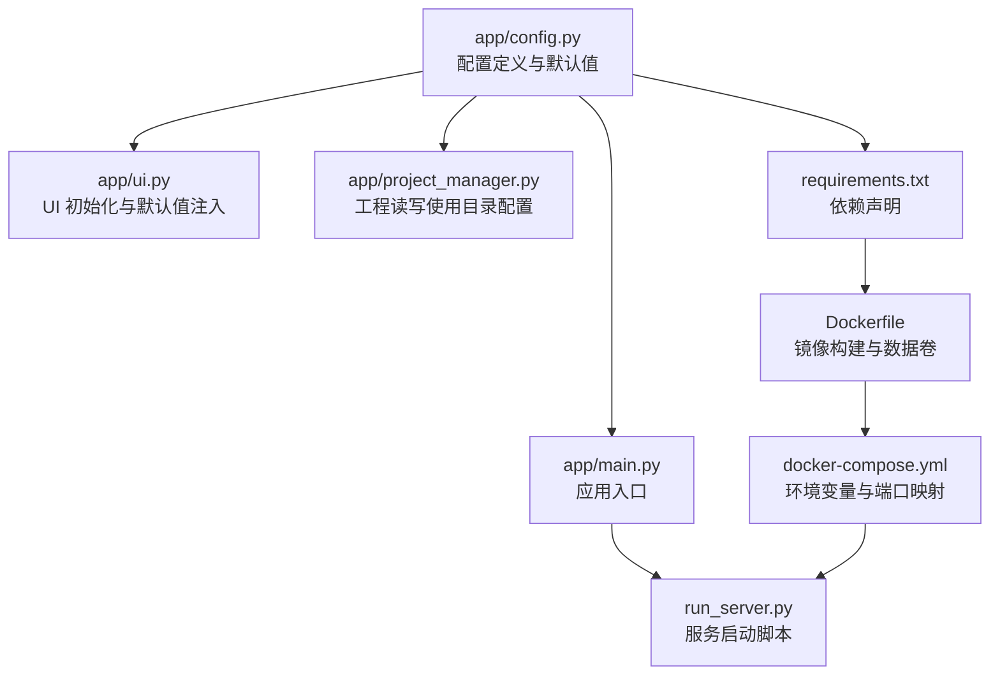
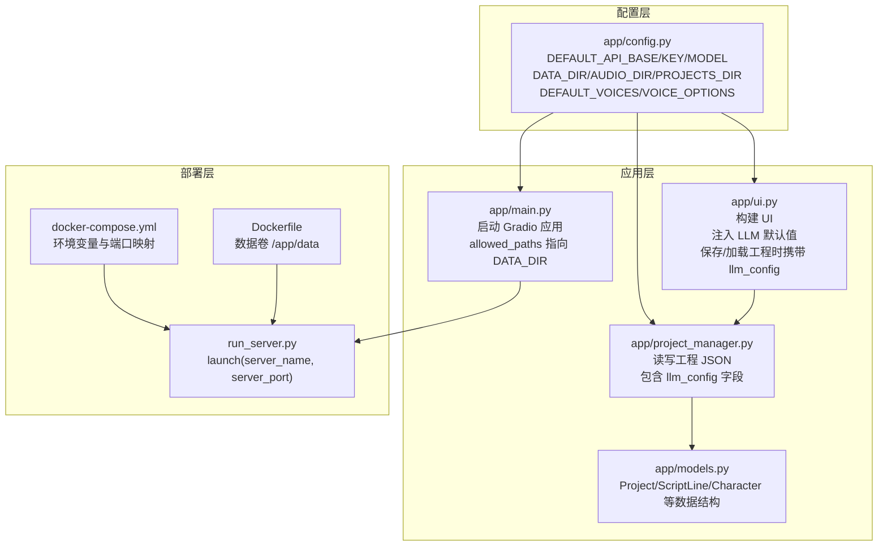
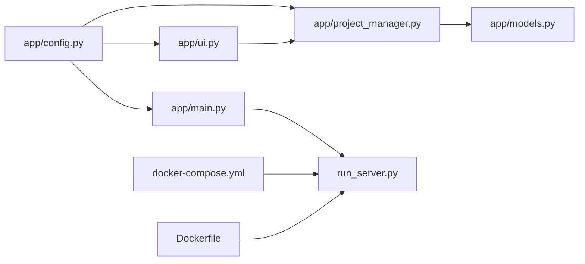

# 配置管理

<cite>
**本文引用的文件**   
- [app/config.py](file://app/config.py)
- [app/main.py](file://app/main.py)
- [app/ui.py](file://app/ui.py)
- [app/project_manager.py](file://app/project_manager.py)
- [app/models.py](file://app/models.py)
- [run_server.py](file://run_server.py)
- [Dockerfile](file://Dockerfile)
- [docker-compose.yml](file://docker-compose.yml)
- [requirements.txt](file://requirements.txt)
- [tests/test_gradio_performance.py](file://tests/test_gradio_performance.py)
- [tests/test_e2e_routes.py](file://tests/test_e2e_routes.py)
</cite>

## 目录
1. [简介](#简介)
2. [项目结构](#项目结构)
3. [核心组件](#核心组件)
4. [架构总览](#架构总览)
5. [详细组件分析](#详细组件分析)
6. [依赖分析](#依赖分析)
7. [性能考虑](#性能考虑)
8. [故障排查指南](#故障排查指南)
9. [结论](#结论)
10. [附录](#附录)

## 简介
本指南聚焦于 TTS Studio 的配置管理，围绕以下目标展开：
- 解释配置文件中的关键配置项及其作用，包括数据目录、网络监听、LLM 默认参数等
- 说明环境变量的使用方式与优先级规则
- 提供开发、测试、生产三类部署环境的最佳实践
- 解释配置加载顺序、默认值来源与验证机制
- 给出配置热更新、备份与迁移的操作建议
- 提供常见配置问题的排查方法与解决方案

## 项目结构
TTS Studio 的配置管理主要集中在 app/config.py，并由应用入口与 UI 组件共同消费这些配置。容器化部署通过 Dockerfile 与 docker-compose.yml 注入环境变量并暴露端口。

**图表来源**
- [app/config.py:1-74](file://app/config.py#L1-L74)
- [app/main.py:1-51](file://app/main.py#L1-L51)
- [app/ui.py:1-120](file://app/ui.py#L1-L120)
- [app/project_manager.py:1-72](file://app/project_manager.py#L1-L72)
- [run_server.py:1-5](file://run_server.py#L1-L5)
- [Dockerfile:1-51](file://Dockerfile#L1-L51)
- [docker-compose.yml:1-32](file://docker-compose.yml#L1-L32)
- [requirements.txt:1-16](file://requirements.txt#L1-L16)

**章节来源**
- [app/config.py:1-74](file://app/config.py#L1-L74)
- [app/main.py:1-51](file://app/main.py#L1-L51)
- [app/ui.py:1-120](file://app/ui.py#L1-L120)
- [app/project_manager.py:1-72](file://app/project_manager.py#L1-L72)
- [run_server.py:1-5](file://run_server.py#L1-L5)
- [Dockerfile:1-51](file://Dockerfile#L1-L51)
- [docker-compose.yml:1-32](file://docker-compose.yml#L1-L32)
- [requirements.txt:1-16](file://requirements.txt#L1-L16)

## 核心组件
本节聚焦 app/config.py 中的关键配置项与行为。

- 数据目录与容器检测
  - 通过检测容器标识判断运行环境，自动选择数据目录根路径
  - 在容器环境中固定使用 /app/data；在本地开发环境使用项目根目录下的 data 子目录
  - 自动创建音频与工程目录，确保运行时可用

- LLM 默认参数
  - 通过环境变量注入默认的 API Base、API Key 与模型名
  - 若未设置对应环境变量，则采用内置默认值

- 音色与提示词
  - 提供默认音色集合与可用音色列表
  - 提供系统提示词模板，用于 LLM 解析剧本

- 网络监听
  - 应用入口与服务启动脚本分别指定监听地址与端口
  - docker-compose 将端口映射到宿主机

**章节来源**
- [app/config.py:1-74](file://app/config.py#L1-L74)
- [app/main.py:15-51](file://app/main.py#L15-L51)
- [run_server.py:1-5](file://run_server.py#L1-L5)
- [docker-compose.yml:9-11](file://docker-compose.yml#L9-L11)

## 架构总览
下图展示配置在系统中的流向与使用点：

**图表来源**
- [app/config.py:1-74](file://app/config.py#L1-L74)
- [app/main.py:15-51](file://app/main.py#L15-L51)
- [app/ui.py:33-90](file://app/ui.py#L33-L90)
- [app/project_manager.py:31-72](file://app/project_manager.py#L31-L72)
- [app/models.py:48-78](file://app/models.py#L48-L78)
- [run_server.py:1-5](file://run_server.py#L1-L5)
- [docker-compose.yml:15-23](file://docker-compose.yml#L15-L23)
- [Dockerfile:36-36](file://Dockerfile#L36-L36)

## 详细组件分析

### 配置项与含义
- DEFAULT_API_BASE / DEFAULT_API_KEY / DEFAULT_MODEL
  - 用途：作为 UI 中 LLM 配置的默认值，便于用户快速开始
  - 来源：通过环境变量注入，默认值在配置文件中设定
  - 使用点：UI 初始化时注入到 LLM 配置输入框；保存工程时随工程文件一同持久化

- DATA_DIR / AUDIO_DIR / PROJECTS_DIR
  - 用途：统一管理数据存储位置，确保音频与工程文件有序存放
  - 容器检测：根据容器标识自动选择 /app/data 或本地 data 目录
  - 目录创建：启动时自动创建所需子目录

- DEFAULT_VOICES / VOICE_OPTIONS
  - 用途：提供默认音色与可用音色列表，支撑 UI 下拉选择与角色管理
  - 使用点：UI 初始化时作为角色默认参数来源；解析剧本时按需回退到默认音色

- 网络监听配置
  - 应用入口：指定 server_name 与 server_port，并限定 allowed_paths 指向 DATA_DIR
  - 服务脚本：run_server.py 以 0.0.0.0 与 7860 启动
  - 容器编排：docker-compose 映射 7860 端口并注入环境变量

**章节来源**
- [app/config.py:5-26](file://app/config.py#L5-L26)
- [app/config.py:29-58](file://app/config.py#L29-L58)
- [app/main.py:17-22](file://app/main.py#L17-L22)
- [run_server.py:3-4](file://run_server.py#L3-L4)
- [docker-compose.yml:15-23](file://docker-compose.yml#L15-L23)

### 环境变量使用与优先级
- 注入方式
  - Dockerfile 中通过 ENV 设置若干运行时环境变量
  - docker-compose.yml 通过 environment 字段注入 DEFAULT_API_BASE、DEFAULT_API_KEY、DEFAULT_MODEL 等
  - run_server.py 通过 Gradio launch 的 server_name/server_port 参数控制监听

- 优先级规则
  - 环境变量优先于配置文件中的默认值
  - docker-compose.yml 的 environment 会覆盖 Dockerfile 的 ENV
  - 容器内运行时，配置文件会基于容器标识选择 /app/data 作为 DATA_DIR

- 验证与测试
  - 测试用例验证工程文件中 llm_config 字段的读写一致性，间接验证配置持久化能力

**章节来源**
- [Dockerfile:3-7](file://Dockerfile#L3-L7)
- [docker-compose.yml:15-23](file://docker-compose.yml#L15-L23)
- [app/config.py:5-7](file://app/config.py#L5-L7)
- [tests/test_e2e_routes.py:347-352](file://tests/test_e2e_routes.py#L347-L352)

### 配置加载顺序与默认值
- 加载顺序
  - Python 模块导入时，app/config.py 中的全局变量被初始化
  - 应用启动时，main.py 读取 DATA_DIR 并传递给 Gradio launch 的 allowed_paths
  - UI 构建时，从配置文件读取默认 LLM 参数与音色配置

- 默认值来源
  - DEFAULT_API_BASE/DEFAULT_API_KEY/DEFAULT_MODEL：来自环境变量，若未设置则使用配置文件中的默认值
  - DATA_DIR：容器检测决定根目录；随后 AUDIO_DIR/PROJECTS_DIR 由其派生
  - DEFAULT_VOICES/VOICE_OPTIONS：硬编码在配置文件中

- 验证机制
  - 工程文件保存时包含 llm_config 字段；加载时恢复该配置
  - UI 初始化阶段对工程文件进行预加载，失败时使用默认值降级

**章节来源**
- [app/config.py:5-26](file://app/config.py#L5-L26)
- [app/main.py:17-22](file://app/main.py#L17-L22)
- [app/ui.py:33-90](file://app/ui.py#L33-L90)
- [app/project_manager.py:31-72](file://app/project_manager.py#L31-L72)
- [tests/test_gradio_performance.py:323-345](file://tests/test_gradio_performance.py#L323-L345)

### 配置热更新、备份与迁移
- 热更新
  - LLM 配置可通过 UI 实时更新并保存到当前工程文件的 llm_config 字段
  - 工程文件保存后，下次加载会恢复该配置；如需全局生效，可在启动时读取最新工程文件

- 备份
  - 工程文件以 JSON 形式保存在 PROJECTS_DIR，包含 llm_config、角色与音频片段等
  - 建议定期将 PROJECTS_DIR 整体备份，以保留所有配置与中间产物

- 迁移
  - 不同环境间迁移时，确保 DATA_DIR 挂载一致（容器场景下为 /app/data）
  - 如需更换 LLM 服务，只需更新工程文件中的 llm_config 或通过 UI 重新配置并保存

**章节来源**
- [app/ui.py:441-448](file://app/ui.py#L441-L448)
- [app/project_manager.py:59-72](file://app/project_manager.py#L59-L72)
- [app/models.py:63-78](file://app/models.py#L63-L78)

### 部署环境最佳实践
- 开发环境
  - 使用本地 data 目录，便于调试与快速迭代
  - 通过 run_server.py 或 Gradio 直接启动，server_name 可设为 127.0.0.1 或 0.0.0.0

- 测试环境
  - 通过 docker-compose 启动，设置合适的 DEFAULT_API_BASE/DEFAULT_API_KEY/DEFAULT_MODEL
  - 将 DATA_DIR 挂载到宿主机便于持久化与审计

- 生产环境
  - 使用容器编排，严格限定 allowed_paths 指向 DATA_DIR，提升安全性
  - 通过环境变量集中管理 LLM 服务信息，避免硬编码

**章节来源**
- [app/config.py:11-18](file://app/config.py#L11-L18)
- [app/main.py:17-22](file://app/main.py#L17-L22)
- [docker-compose.yml:15-23](file://docker-compose.yml#L15-L23)
- [Dockerfile:36-36](file://Dockerfile#L36-L36)

## 依赖分析
配置模块在多个组件之间形成松耦合依赖，主要通过导入全局配置变量实现共享。

**图表来源**
- [app/config.py:1-74](file://app/config.py#L1-L74)
- [app/main.py:1-10](file://app/main.py#L1-L10)
- [app/ui.py:1-12](file://app/ui.py#L1-L12)
- [app/project_manager.py:1-10](file://app/project_manager.py#L1-L10)
- [app/models.py:1-5](file://app/models.py#L1-L5)
- [run_server.py:1-5](file://run_server.py#L1-L5)
- [docker-compose.yml:1-32](file://docker-compose.yml#L1-L32)
- [Dockerfile:1-51](file://Dockerfile#L1-L51)

**章节来源**
- [app/config.py:1-74](file://app/config.py#L1-L74)
- [app/main.py:1-10](file://app/main.py#L1-L10)
- [app/ui.py:1-12](file://app/ui.py#L1-L12)
- [app/project_manager.py:1-10](file://app/project_manager.py#L1-L10)
- [app/models.py:1-5](file://app/models.py#L1-L5)
- [run_server.py:1-5](file://run_server.py#L1-L5)
- [docker-compose.yml:1-32](file://docker-compose.yml#L1-L32)
- [Dockerfile:1-51](file://Dockerfile#L1-L51)

## 性能考虑
- 预加载与静态初始化
  - UI 初始化时预加载工程数据，避免使用 demo.load 导致的性能问题
  - 组件的初始值通过静态参数传入，减少运行时赋值引发的渲染延迟

- 目录访问限制
  - Gradio launch 的 allowed_paths 仅指向 DATA_DIR，降低不必要的文件系统扫描

- 日志与异常处理
  - 预加载失败时记录错误日志并使用默认值降级，保证应用可启动

**章节来源**
- [tests/test_gradio_performance.py:38-91](file://tests/test_gradio_performance.py#L38-L91)
- [tests/test_gradio_performance.py:323-345](file://tests/test_gradio_performance.py#L323-L345)
- [app/main.py:17-22](file://app/main.py#L17-L22)

## 故障排查指南
- LLM 配置未生效
  - 检查环境变量是否正确注入（docker-compose.yml 的 environment）
  - 确认 UI 中 LLM 配置输入框是否被覆盖保存到工程文件（llm_config）

- 工程文件加载失败
  - 查看日志中关于预加载异常的记录，确认文件格式与字段完整性
  - 确保工程文件包含 llm_config 字段，以便恢复配置

- 目录权限或路径问题
  - 容器环境下确认 /app/data 已正确挂载
  - 本地开发环境确认 data 目录存在且具备读写权限

- 端口占用或无法访问
  - 检查 run_server.py 与 docker-compose.yml 的端口映射
  - 确认 server_name 与防火墙设置

**章节来源**
- [docker-compose.yml:15-23](file://docker-compose.yml#L15-L23)
- [app/ui.py:441-448](file://app/ui.py#L441-L448)
- [app/project_manager.py:31-72](file://app/project_manager.py#L31-L72)
- [tests/test_gradio_performance.py:323-345](file://tests/test_gradio_performance.py#L323-L345)
- [run_server.py:3-4](file://run_server.py#L3-L4)

## 结论
TTS Studio 的配置管理以 app/config.py 为核心，结合环境变量与容器编排，实现了跨环境的一致性与灵活性。通过明确的加载顺序、默认值来源与验证机制，配合工程文件的持久化能力，满足了开发、测试与生产的差异化需求。建议在实际部署中遵循本文的最佳实践，并结合故障排查指南快速定位与解决问题。

## 附录
- 相关文件与职责
  - app/config.py：定义全局配置、默认值与目录结构
  - app/main.py：应用入口，负责监听与目录访问控制
  - app/ui.py：UI 初始化与配置注入，负责工程的保存/加载
  - app/project_manager.py：工程文件的读写，包含 llm_config 字段
  - run_server.py：服务启动脚本
  - docker-compose.yml：环境变量与端口映射
  - Dockerfile：镜像构建与数据卷
  - requirements.txt：运行依赖

**章节来源**
- [app/config.py:1-74](file://app/config.py#L1-L74)
- [app/main.py:1-51](file://app/main.py#L1-L51)
- [app/ui.py:1-120](file://app/ui.py#L1-L120)
- [app/project_manager.py:1-72](file://app/project_manager.py#L1-L72)
- [run_server.py:1-5](file://run_server.py#L1-L5)
- [docker-compose.yml:1-32](file://docker-compose.yml#L1-L32)
- [Dockerfile:1-51](file://Dockerfile#L1-L51)
- [requirements.txt:1-16](file://requirements.txt#L1-L16)