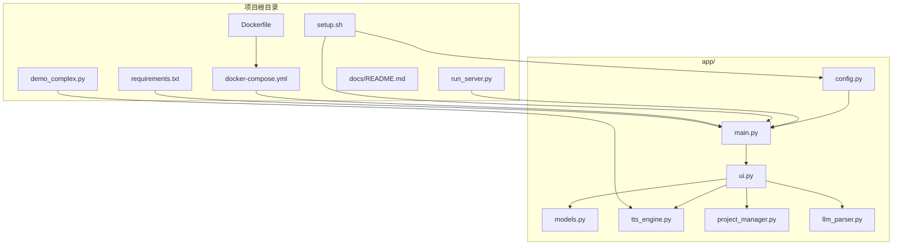
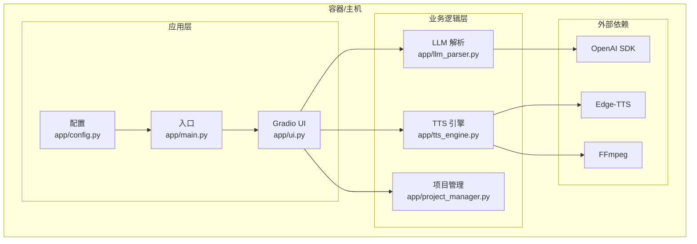
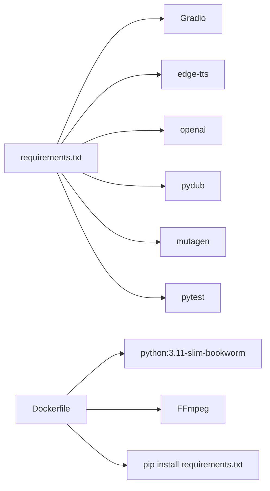

# 快速开始

<cite>
**本文引用的文件**
- [requirements.txt](file://requirements.txt)
- [Dockerfile](file://Dockerfile)
- [docker-compose.yml](file://docker-compose.yml)
- [setup.sh](file://setup.sh)
- [run_server.py](file://run_server.py)
- [app/config.py](file://app/config.py)
- [app/main.py](file://app/main.py)
- [app/ui.py](file://app/ui.py)
- [demo_complex.py](file://demo_complex.py)
- [docs/README.md](file://docs/README.md)
- [docs/FFMPEG_INSTALL_GUIDE.md](file://docs/FFMPEG_INSTALL_GUIDE.md)
- [docs/GRADIO_QUICK_REFERENCE.md](file://docs/GRADIO_QUICK_REFERENCE.md)
</cite>

## 目录
1. [简介](#简介)
2. [项目结构](#项目结构)
3. [核心组件](#核心组件)
4. [架构概览](#架构概览)
5. [详细组件分析](#详细组件分析)
6. [依赖关系分析](#依赖关系分析)
7. [性能注意事项](#性能注意事项)
8. [故障排除指南](#故障排除指南)
9. [结论](#结论)
10. [附录](#附录)

## 简介
TTS Studio 是一个基于 Gradio 的中文语音合成工作台，支持将文本解析为结构化剧本，使用 Edge-TTS 生成对白音频，并通过 FFmpeg 进行多轨混音。本指南提供从零开始的完整安装与部署步骤，涵盖本地安装与 Docker 容器化两种方式，并给出首次运行验证、常见问题解决方案以及简单使用示例，帮助新手快速上手。

## 项目结构
该项目采用模块化组织，核心入口位于 app 目录，包含配置、UI、TTS 引擎、项目管理等模块；顶层提供 Dockerfile、docker-compose.yml、requirements.txt 和一键脚本 setup.sh，便于快速搭建本地或容器环境。

图表来源
- [requirements.txt:1-16](file://requirements.txt#L1-L16)
- [Dockerfile:1-51](file://Dockerfile#L1-L51)
- [docker-compose.yml:1-32](file://docker-compose.yml#L1-L32)
- [setup.sh:1-655](file://setup.sh#L1-L655)
- [run_server.py:1-5](file://run_server.py#L1-L5)
- [app/config.py:1-74](file://app/config.py#L1-L74)
- [app/main.py:1-51](file://app/main.py#L1-L51)
- [app/ui.py:288-526](file://app/ui.py#L288-L526)
- [demo_complex.py:1-239](file://demo_complex.py#L1-L239)

章节来源
- [requirements.txt:1-16](file://requirements.txt#L1-L16)
- [Dockerfile:1-51](file://Dockerfile#L1-L51)
- [docker-compose.yml:1-32](file://docker-compose.yml#L1-L32)
- [setup.sh:1-655](file://setup.sh#L1-L655)
- [app/config.py:1-74](file://app/config.py#L1-L74)
- [app/main.py:1-51](file://app/main.py#L1-L51)
- [app/ui.py:288-526](file://app/ui.py#L288-L526)

## 核心组件
- 应用入口与启动
  - 本地启动：通过 app/main.py 启动 Gradio 服务，默认监听 0.0.0.0:7860。
  - 快捷脚本：run_server.py 提供简化的启动入口。
- 配置管理
  - app/config.py 定义默认 LLM API 地址、密钥、模型、数据目录、音色选项与系统提示词。
  - 支持 Docker 环境检测，自动切换数据目录。
- UI 交互
  - app/ui.py 构建 Gradio 界面，包含工程管理、LLM 解析、对白片段编辑、音轨添加、混音导出等功能。
- TTS 引擎
  - app/tts_engine.py 使用 edge-tts 生成音频，结合 pydub 进行时长计算与多轨混合。
- 项目管理
  - app/project_manager.py 负责工程的序列化/反序列化，支持保存与加载。
- LLM 解析
  - app/llm_parser.py 使用 OpenAI SDK 与 LLM 对输入文本进行结构化解析，输出剧本行。

章节来源
- [app/main.py:15-51](file://app/main.py#L15-L51)
- [run_server.py:1-5](file://run_server.py#L1-L5)
- [app/config.py:1-74](file://app/config.py#L1-L74)
- [app/ui.py:288-526](file://app/ui.py#L288-L526)
- [app/tts_engine.py:133-215](file://app/tts_engine.py#L133-L215)
- [app/project_manager.py:217-286](file://app/project_manager.py#L217-L286)
- [app/llm_parser.py:109-131](file://app/llm_parser.py#L109-L131)

## 架构概览
TTS Studio 的运行时架构由三层组成：UI 层（Gradio）、业务逻辑层（解析、合成、混音）、外部依赖（Edge-TTS、OpenAI、FFmpeg）。Dockerfile 与 docker-compose.yml 提供容器化部署能力，setup.sh 可自动生成基础文件与目录结构。

图表来源
- [app/ui.py:288-526](file://app/ui.py#L288-L526)
- [app/config.py:1-74](file://app/config.py#L1-L74)
- [app/main.py:15-51](file://app/main.py#L15-L51)
- [app/llm_parser.py:109-131](file://app/llm_parser.py#L109-L131)
- [app/tts_engine.py:133-215](file://app/tts_engine.py#L133-L215)
- [app/project_manager.py:217-286](file://app/project_manager.py#L217-L286)

## 详细组件分析

### 本地安装与首次运行
- 系统要求
  - Python 3.11+
  - FFmpeg（用于音频处理与拼接）
- 安装步骤
  1) 准备目录与配置
     - 使用 setup.sh 生成 app/config.py、app/models.py、app/llm_parser.py、app/tts_engine.py、app/project_manager.py、app/ui.py、app/main.py 等文件，同时创建 data 目录。
     - 若直接使用现有文件，确保 app/config.py 中的数据目录与权限正确。
  2) 安装依赖
     - 使用 requirements.txt 安装依赖包（Gradio、edge-tts、openai、pydub、mutagen、pytest 等）。
  3) 安装 FFmpeg
     - 按照 docs/FFMPEG_INSTALL_GUIDE.md 的步骤安装并验证 FFmpeg。
  4) 启动服务
     - 通过 app/main.py 或 run_server.py 启动服务，默认监听 0.0.0.0:7860。
- 首次运行验证
  - 打开浏览器访问 http://localhost:7860，确认页面加载正常且无控制台错误。
  - 在“输入文本”区域粘贴一段中文文本，点击“LLM 解析”，观察右侧“对白片段”表格是否生成。
  - 选择一条片段，点击“生成选中片段”，等待合成完成后点击“预听”验证音频。
  - 点击“合成混音”生成最终音频文件。

章节来源
- [setup.sh:1-655](file://setup.sh#L1-L655)
- [requirements.txt:1-16](file://requirements.txt#L1-L16)
- [docs/FFMPEG_INSTALL_GUIDE.md:1-99](file://docs/FFMPEG_INSTALL_GUIDE.md#L1-L99)
- [app/main.py:15-51](file://app/main.py#L15-L51)
- [run_server.py:1-5](file://run_server.py#L1-L5)

### Docker 容器化部署
- 构建镜像
  - 使用 Dockerfile 构建镜像，镜像基于 python:3.11-slim-bookworm，预装 FFmpeg 并安装 Python 依赖。
- 启动容器
  - 使用 docker-compose.yml 启动服务，映射端口 7860，挂载 data 目录与 app 源码，设置环境变量（DEFAULT_API_BASE、DEFAULT_API_KEY、DEFAULT_MODEL 等）。
- 配置要点
  - 环境变量可通过 .env 文件注入，或在 docker-compose.yml 中直接指定。
  - 数据持久化：将 ./data 映射到容器内的 /app/data。
  - 权限：容器内以非 root 用户运行，可通过 UID/GID 参数调整。
- 首次运行验证
  - 访问 http://localhost:7860，按本地安装步骤进行功能验证。

章节来源
- [Dockerfile:1-51](file://Dockerfile#L1-L51)
- [docker-compose.yml:1-32](file://docker-compose.yml#L1-L32)

### 使用示例（快速体验）
- 示例一：复杂标记合成演示
  - 运行 demo_complex.py，它会异步合成多种强调、停顿、音调变化的示例音频，输出到 data/audio/demo 目录。
  - 适合快速验证高级标记语法与效果。
- 示例二：本地/容器内 UI 体验
  - 在浏览器中打开 7860 端口，粘贴一段中文文本，点击“LLM 解析”→“生成全部对白”→“合成混音”，即可获得成品音频。

章节来源
- [demo_complex.py:1-239](file://demo_complex.py#L1-L239)

## 依赖关系分析
- Python 依赖
  - Gradio：Web UI 框架
  - edge-tts：微软 Edge-TTS 引擎
  - openai：LLM 调用 SDK
  - pydub、mutagen：音频处理与元数据读写
  - pytest：测试框架
- 外部工具
  - FFmpeg：音频编解码与拼接
- 容器化依赖
  - Debian Bookworm 基础镜像、Python 3.11、apt 安装的 FFmpeg 及开发库

图表来源
- [requirements.txt:1-16](file://requirements.txt#L1-L16)
- [Dockerfile:1-51](file://Dockerfile#L1-L51)

章节来源
- [requirements.txt:1-16](file://requirements.txt#L1-L16)
- [Dockerfile:1-51](file://Dockerfile#L1-L51)

## 性能注意事项
- UI 性能优化
  - 避免使用 demo.load 事件，改为预加载与静态初始化组件，减少首次加载与切换开销。
  - 控制组件嵌套层级，避免深层 Accordion/Tabs。
  - 通过返回值更新组件，而非运行时赋值。
- 音频合成
  - 合成任务为 I/O 密集型，建议批量生成后再统一混音，减少多次 I/O。
  - 使用 pydub 的 overlay 进行多轨混合，注意内存占用与时长计算。

章节来源
- [docs/GRADIO_QUICK_REFERENCE.md:1-151](file://docs/GRADIO_QUICK_REFERENCE.md#L1-L151)
- [app/ui.py:288-526](file://app/ui.py#L288-L526)
- [app/tts_engine.py:173-215](file://app/tts_engine.py#L173-L215)

## 故障排除指南
- FFmpeg 未找到
  - 现象：pydub 报错无法使用 FFmpeg
  - 处理：按照 docs/FFMPEG_INSTALL_GUIDE.md 安装并加入系统 PATH，重启终端后验证。
- LLM 连接失败
  - 现象：解析阶段报错
  - 处理：检查 DEFAULT_API_BASE、DEFAULT_API_KEY、DEFAULT_MODEL 环境变量，确保 LLM 服务可达。
- UI 加载缓慢或卡顿
  - 现象：Tab 切换卡顿、控制台出现 Violation 警告
  - 处理：遵循 docs/GRADIO_QUICK_REFERENCE.md 的建议，移除 demo.load、减少嵌套、采用预加载模式。
- Docker 权限问题
  - 现象：容器内无法写入 data 目录
  - 处理：确认宿主机目录权限，或通过 UID/GID 参数调整容器内用户与组 ID。
- 端口冲突
  - 现象：端口 7860 被占用
  - 处理：修改 docker-compose.yml 中的端口映射，或释放 7860 端口。

章节来源
- [docs/FFMPEG_INSTALL_GUIDE.md:1-99](file://docs/FFMPEG_INSTALL_GUIDE.md#L1-L99)
- [docs/GRADIO_QUICK_REFERENCE.md:1-151](file://docs/GRADIO_QUICK_REFERENCE.md#L1-L151)
- [docker-compose.yml:1-32](file://docker-compose.yml#L1-L32)
- [app/config.py:1-74](file://app/config.py#L1-L74)

## 结论
通过本指南，您可以在本地或容器环境中快速部署 TTS Studio，并完成首次运行验证。建议优先使用 Docker 以降低环境差异带来的问题；若需深度定制，可选择本地安装并配合 setup.sh 生成基础文件。遇到性能或 UI 问题时，可参考文档中的优化建议与故障排除清单。

## 附录
- 快速命令摘要
  - 本地安装（含 setup.sh）
    - 生成基础文件与目录：bash setup.sh
    - 安装依赖：pip install -r requirements.txt
    - 安装 FFmpeg：参考 docs/FFMPEG_INSTALL_GUIDE.md
    - 启动服务：python app/main.py 或 python run_server.py
  - Docker 部署
    - 构建镜像：docker build -t tts-studio .
    - 启动容器：docker-compose up -d
    - 访问：http://localhost:7860
- 参考文档
  - 项目总览与导航：docs/README.md
  - UI 性能问题快速参考：docs/GRADIO_QUICK_REFERENCE.md
  - FFmpeg 安装指南：docs/FFMPEG_INSTALL_GUIDE.md

章节来源
- [setup.sh:1-655](file://setup.sh#L1-L655)
- [requirements.txt:1-16](file://requirements.txt#L1-L16)
- [docs/README.md:1-171](file://docs/README.md#L1-L171)
- [docs/GRADIO_QUICK_REFERENCE.md:1-151](file://docs/GRADIO_QUICK_REFERENCE.md#L1-L151)
- [docs/FFMPEG_INSTALL_GUIDE.md:1-99](file://docs/FFMPEG_INSTALL_GUIDE.md#L1-L99)