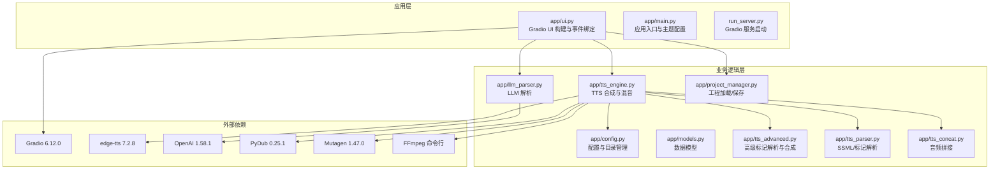
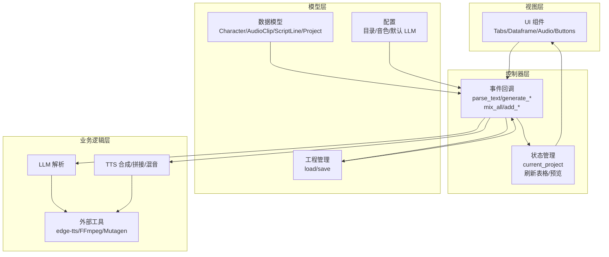
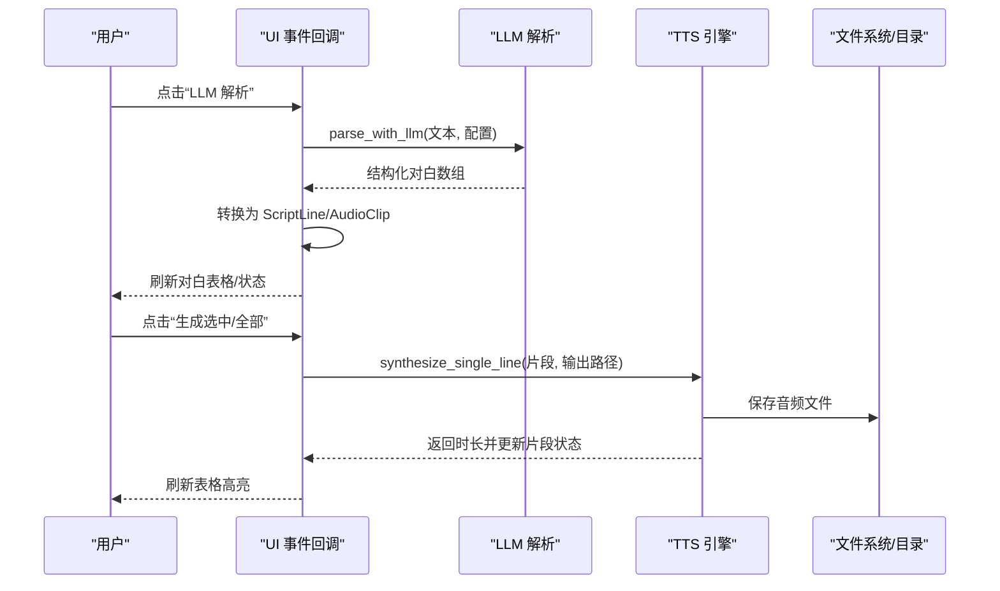
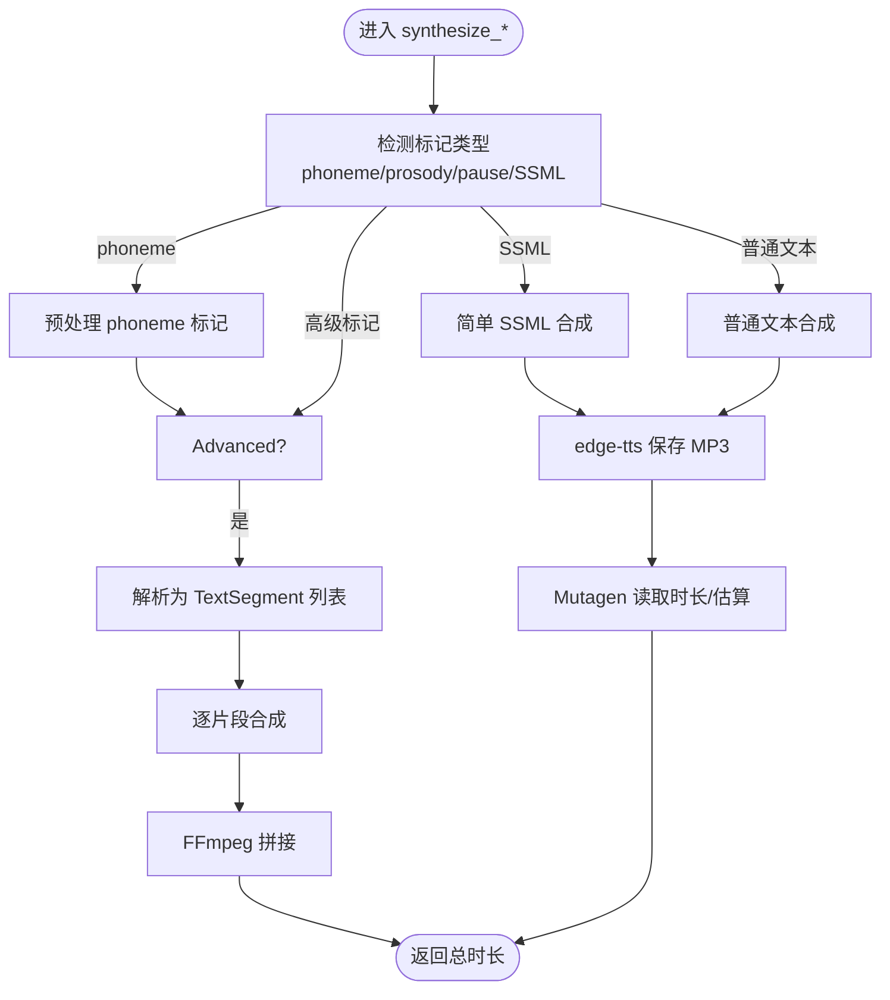
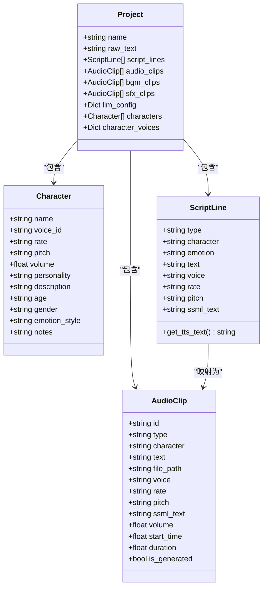
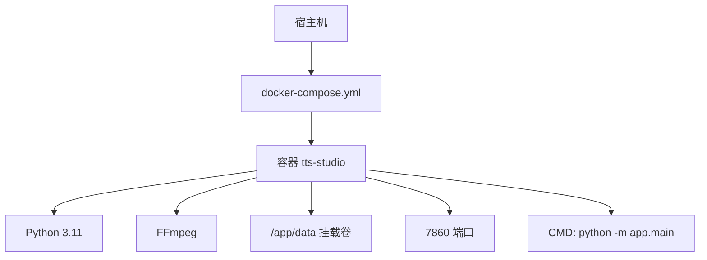
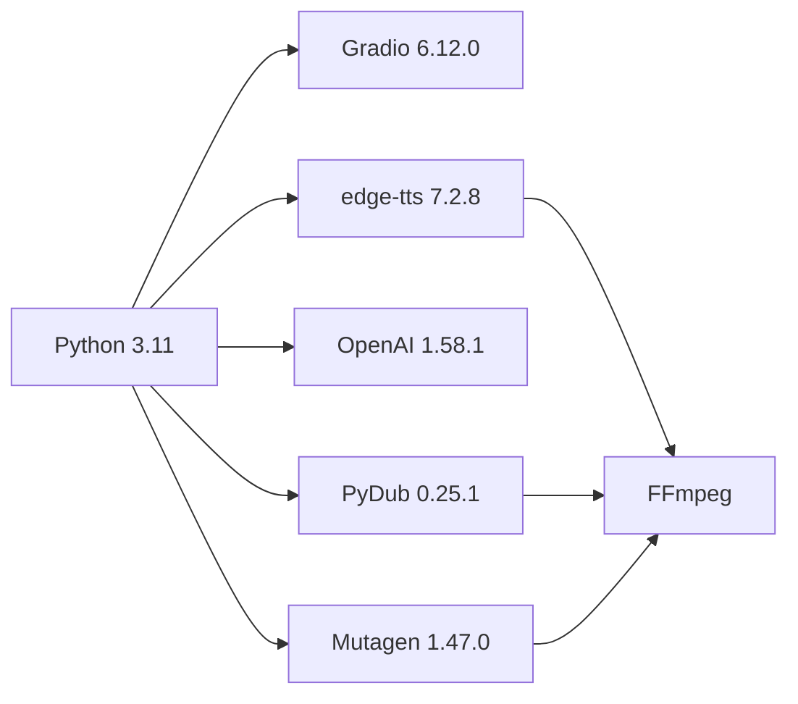

# 技术栈与架构

<cite>
**本文引用的文件**
- [requirements.txt](file://requirements.txt)
- [Dockerfile](file://Dockerfile)
- [docker-compose.yml](file://docker-compose.yml)
- [run_server.py](file://run_server.py)
- [app/main.py](file://app/main.py)
- [app/ui.py](file://app/ui.py)
- [app/config.py](file://app/config.py)
- [app/models.py](file://app/models.py)
- [app/llm_parser.py](file://app/llm_parser.py)
- [app/tts_engine.py](file://app/tts_engine.py)
- [app/tts_parser.py](file://app/tts_parser.py)
- [app/tts_advanced.py](file://app/tts_advanced.py)
- [app/tts_concat.py](file://app/tts_concat.py)
- [app/project_manager.py](file://app/project_manager.py)
- [demo_complex.py](file://demo_complex.py)
- [setup.sh](file://setup.sh)
</cite>

## 目录
1. [简介](#简介)
2. [项目结构](#项目结构)
3. [核心组件](#核心组件)
4. [架构总览](#架构总览)
5. [详细组件分析](#详细组件分析)
6. [依赖分析](#依赖分析)
7. [性能考虑](#性能考虑)
8. [故障排查指南](#故障排查指南)
9. [结论](#结论)
10. [附录](#附录)

## 简介
本项目为 TTS Studio，旨在提供一个基于 Web 的多轨剧本配音工作台，支持通过 LLM 解析文本、精细化的 SSML/标记控制、多音字标注、停顿与强调、以及背景音乐与音效的混音输出。项目采用 Python 3.11 作为运行环境，Gradio 6.12.0 构建交互界面，edge-tts 7.2.8 作为语音合成引擎，OpenAI 1.58.1 提供 LLM 解析服务，PyDub 0.25.1 与 Mutagen 1.47.0 处理音频数据，结合 FFmpeg 命令行进行高效拼接与混音。整体采用 MVC 分离、模块化设计与事件驱动的异步处理模式，分层架构清晰：UI 层负责用户交互与事件绑定；业务逻辑层封装 TTS 合成、音频拼接与混音；数据访问层负责工程与音频文件的持久化。

## 项目结构
项目采用按功能模块组织的分层结构，核心目录与文件如下：
- app：核心业务模块（UI、配置、模型、解析器、引擎、拼接、混音、工程管理）
- docs：项目文档与指南
- scripts：辅助脚本（如 edge-tts 补丁）
- tests：单元测试与验收测试
- 根目录：容器化与运行入口（Dockerfile、docker-compose.yml、requirements.txt、run_server.py）

图表来源
- [app/ui.py:13-800](file://app/ui.py#L13-L800)
- [app/tts_engine.py:1-547](file://app/tts_engine.py#L1-L547)
- [app/llm_parser.py:1-21](file://app/llm_parser.py#L1-L21)
- [app/config.py:1-74](file://app/config.py#L1-L74)
- [requirements.txt:1-16](file://requirements.txt#L1-L16)

章节来源
- [requirements.txt:1-16](file://requirements.txt#L1-L16)
- [Dockerfile:1-51](file://Dockerfile#L1-L51)
- [docker-compose.yml:1-32](file://docker-compose.yml#L1-L32)
- [app/main.py:1-51](file://app/main.py#L1-L51)
- [run_server.py:1-5](file://run_server.py#L1-L5)

## 核心组件
- Gradio UI（app/ui.py）：构建多标签页界面，绑定事件处理函数，负责工程管理、LLM 解析、对白编辑、SSML 标记、生成与预听、背景音乐/音效添加、最终混音输出。
- 配置与目录（app/config.py）：统一管理默认 LLM 配置、数据目录（Docker/本地）、音色选项与系统提示词。
- 数据模型（app/models.py）：定义角色、音频片段、剧本行与工程对象，提供 get_tts_text 以优先使用 SSML 标记文本。
- LLM 解析（app/llm_parser.py）：基于 OpenAI 客户端，调用指定模型解析文本为结构化 JSON。
- TTS 引擎（app/tts_engine.py）：封装 edge-tts 合成、Azure Speech 可选路径、高级标记自动拆分与拼接、FFmpeg 混音、时长获取与重试机制。
- 高级解析（app/tts_advanced.py）：解析 {style}、{rate}、{pitch}、{pause} 等标记，拆分片段后逐段合成并拼接。
- 标记解析（app/tts_parser.py）：解析 <prosody>、<pause>、[phoneme] 等新语法，生成 TextSegment 列表。
- 音频拼接（app/tts_concat.py）：使用 FFmpeg concat demuxer 拼接音频片段，避免依赖 ffprobe。
- 工程管理（app/project_manager.py）：将 ScriptLine 转换为 AudioClip，序列化/反序列化工程文件。
- 容器化（Dockerfile、docker-compose.yml）：基于 Python 3.11 slim，安装 FFmpeg，暴露 7860 端口，挂载数据卷，健康检查。

章节来源
- [app/ui.py:13-800](file://app/ui.py#L13-L800)
- [app/config.py:1-74](file://app/config.py#L1-L74)
- [app/models.py:1-78](file://app/models.py#L1-L78)
- [app/llm_parser.py:1-21](file://app/llm_parser.py#L1-L21)
- [app/tts_engine.py:1-547](file://app/tts_engine.py#L1-L547)
- [app/tts_advanced.py:1-290](file://app/tts_advanced.py#L1-L290)
- [app/tts_parser.py:1-220](file://app/tts_parser.py#L1-L220)
- [app/tts_concat.py:1-159](file://app/tts_concat.py#L1-L159)
- [app/project_manager.py:1-73](file://app/project_manager.py#L1-L73)
- [Dockerfile:1-51](file://Dockerfile#L1-L51)
- [docker-compose.yml:1-32](file://docker-compose.yml#L1-L32)

## 架构总览
项目采用分层架构与 MVC 模式：
- 视图层（View）：Gradio Blocks 构建的 UI，负责用户交互与事件触发。
- 控制器（Controller）：UI 中的事件回调函数，协调模型与业务逻辑，更新状态与界面。
- 模型（Model）：数据模型与工程状态，持久化于 JSON 文件，音频片段路径与元数据由配置目录管理。

图表来源
- [app/ui.py:441-800](file://app/ui.py#L441-L800)
- [app/models.py:1-78](file://app/models.py#L1-L78)
- [app/project_manager.py:1-73](file://app/project_manager.py#L1-L73)
- [app/config.py:1-74](file://app/config.py#L1-L74)
- [app/tts_engine.py:1-547](file://app/tts_engine.py#L1-L547)
- [app/llm_parser.py:1-21](file://app/llm_parser.py#L1-L21)

## 详细组件分析

### UI 与事件流（Gradio）
- 构建多标签页：工程与配置、文本解析、对白编辑、混音输出。
- 事件绑定：解析按钮触发 LLM 解析，生成按钮触发单片段/全量合成，预听按钮返回已生成音频，混音按钮调用 FFmpeg 混音。
- 异步处理：使用 asyncio 协程处理长耗时的 TTS 合成，避免阻塞 UI。
- 状态更新：通过 gr.update 动态刷新表格、下拉框与状态信息。

图表来源
- [app/ui.py:471-613](file://app/ui.py#L471-L613)
- [app/llm_parser.py:1-21](file://app/llm_parser.py#L1-L21)
- [app/tts_engine.py:120-218](file://app/tts_engine.py#L120-L218)

章节来源
- [app/ui.py:13-800](file://app/ui.py#L13-L800)

### TTS 引擎与音频处理
- 合成策略：优先判断高级标记（prosody/pause/phoneme），否则走简单文本或自定义 SSML；支持 Azure Speech 作为可选路径。
- 时长获取：优先使用 Mutagen 读取 MP3 时长，降级估算。
- 重试机制：指数退避重试，提升网络不稳定场景的稳定性。
- 拼接与混音：使用 FFmpeg concat demuxer 拼接片段，使用 FFmpeg filter_complex 混音，避免额外 Python 依赖。

图表来源
- [app/tts_engine.py:120-453](file://app/tts_engine.py#L120-L453)
- [app/tts_parser.py:69-182](file://app/tts_parser.py#L69-L182)
- [app/tts_advanced.py:112-290](file://app/tts_advanced.py#L112-L290)
- [app/tts_concat.py:17-90](file://app/tts_concat.py#L17-L90)

章节来源
- [app/tts_engine.py:1-547](file://app/tts_engine.py#L1-L547)
- [app/tts_parser.py:1-220](file://app/tts_parser.py#L1-L220)
- [app/tts_advanced.py:1-290](file://app/tts_advanced.py#L1-L290)
- [app/tts_concat.py:1-159](file://app/tts_concat.py#L1-L159)

### 数据模型与工程管理
- 模型定义：Character、AudioClip、ScriptLine、Project，提供 get_tts_text 优先使用 SSML 文本。
- 工程转换：将 ScriptLine 列表转换为 AudioClip 列表，计算起始时间与持续时间。
- 工程持久化：JSON 序列化/反序列化，兼容角色列表与历史字段。

图表来源
- [app/models.py:1-78](file://app/models.py#L1-L78)
- [app/project_manager.py:9-29](file://app/project_manager.py#L9-L29)

章节来源
- [app/models.py:1-78](file://app/models.py#L1-L78)
- [app/project_manager.py:1-73](file://app/project_manager.py#L1-L73)

### 容器化与部署拓扑
- Dockerfile：基于 python:3.11-slim，安装 FFmpeg，配置国内镜像源，创建工作目录与数据目录，暴露 7860 端口，CMD 启动应用。
- docker-compose：映射数据卷、环境变量（LLM 地址/密钥/模型）、健康检查，便于本地开发与部署。
- 运行入口：run_server.py 与 app/main.py 均可启动 Gradio 服务，前者直接启动，后者提供主题与静态资源路径配置。

图表来源
- [Dockerfile:1-51](file://Dockerfile#L1-L51)
- [docker-compose.yml:1-32](file://docker-compose.yml#L1-L32)
- [run_server.py:1-5](file://run_server.py#L1-L5)
- [app/main.py:15-50](file://app/main.py#L15-L50)

章节来源
- [Dockerfile:1-51](file://Dockerfile#L1-L51)
- [docker-compose.yml:1-32](file://docker-compose.yml#L1-L32)
- [run_server.py:1-5](file://run_server.py#L1-L5)
- [app/main.py:1-51](file://app/main.py#L1-L51)

## 依赖分析
- Python 3.11：稳定生态与性能，适配异步与并发。
- Gradio 6.12.0：快速构建 Web UI，支持 Blocks 组件化与事件绑定。
- edge-tts 7.2.8：微软 TTS 引擎，支持 SSML 与参数调节。
- OpenAI 1.58.1：LLM 解析服务，JSON 输出格式严格约束。
- PyDub 0.25.1 与 Mutagen 1.47.0：音频处理与时长读取，配合 FFmpeg 命令行实现高性能拼接与混音。
- FFmpeg：命令行工具，避免 Python 绑定的复杂性与平台差异。
- pytest：测试框架，用于功能与回归验证。

图表来源
- [requirements.txt:1-16](file://requirements.txt#L1-L16)

章节来源
- [requirements.txt:1-16](file://requirements.txt#L1-L16)

## 性能考虑
- 异步合成：UI 与 TTS 合成采用 asyncio，避免阻塞主线程，提升交互响应。
- FFmpeg 命令行：拼接与混音使用 FFmpeg，避免 Python 层重复解析与编码，降低内存占用。
- 时长获取：优先使用 Mutagen，失败时估算，减少不必要的解码开销。
- 重试策略：指数退避，缓解网络抖动导致的失败。
- 静默与测试音：提供 generate_silence 与 generate_tone，便于占位与调试。

## 故障排查指南
- LLM 解析失败：检查 DEFAULT_API_BASE、DEFAULT_API_KEY、DEFAULT_MODEL 环境变量，确保模型返回纯 JSON 数组。
- TTS 合成失败：关注 403 等网络错误提示，配置 HTTP_PROXY/https_proxy；若 Azure SDK 未安装则回退 edge-tts。
- 时长异常：Mutagen 依赖缺失时使用估算；确认音频文件存在且可读。
- FFmpeg 错误：确认系统已安装 FFmpeg，路径正确；拼接列表文件清理失败不影响主流程。
- 容器启动失败：检查端口占用、数据卷权限、健康检查脚本；必要时调整 UID/GID。

章节来源
- [app/llm_parser.py:1-21](file://app/llm_parser.py#L1-L21)
- [app/tts_engine.py:255-318](file://app/tts_engine.py#L255-L318)
- [app/tts_engine.py:454-534](file://app/tts_engine.py#L454-L534)
- [docker-compose.yml:26-31](file://docker-compose.yml#L26-L31)

## 结论
TTS Studio 通过清晰的分层架构与模块化设计，将 UI、业务逻辑与数据持久化有效解耦。Gradio 提供直观的交互体验，edge-tts 与 FFmpeg 实现高质量、高性能的语音合成与音频处理，OpenAI 提供稳定的文本解析能力。容器化部署简化了环境配置与运维成本。建议在生产环境中启用代理与重试策略，完善日志与监控，以进一步提升稳定性与可观测性。

## 附录
- 复杂示例演示：demo_complex.py 展示多种标记组合的效果生成，适合验证高级功能。
- 快速搭建：setup.sh 可一键生成最小可用工程结构，便于快速验证与二次开发。

章节来源
- [demo_complex.py:1-239](file://demo_complex.py#L1-L239)
- [setup.sh:1-655](file://setup.sh#L1-L655)