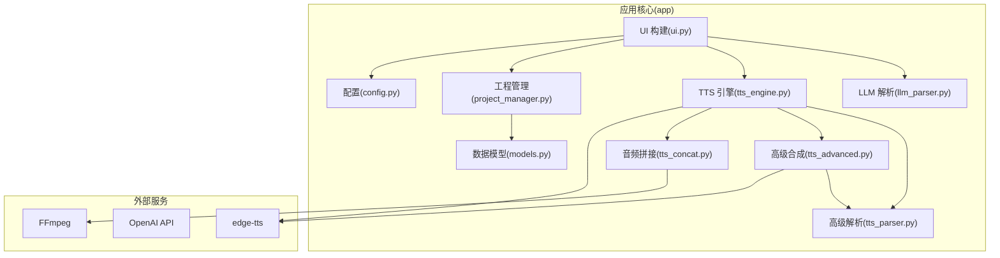
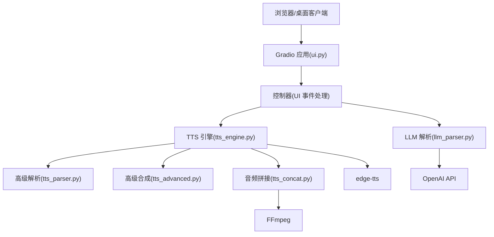
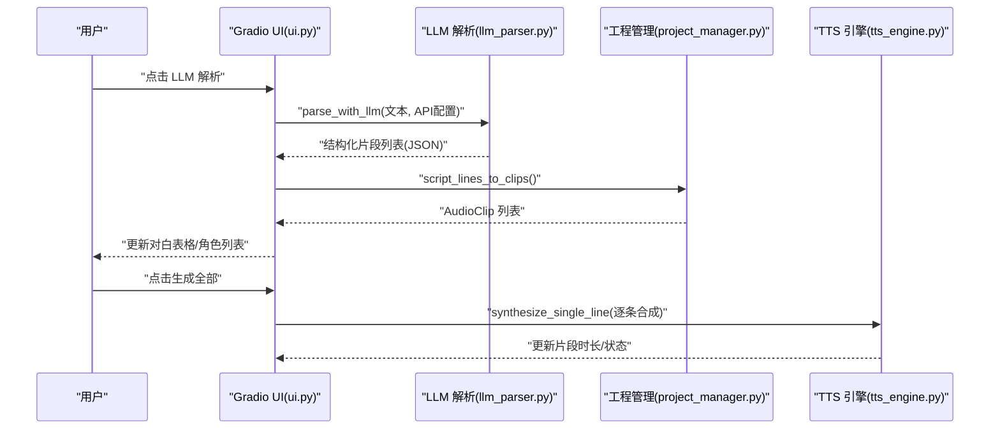
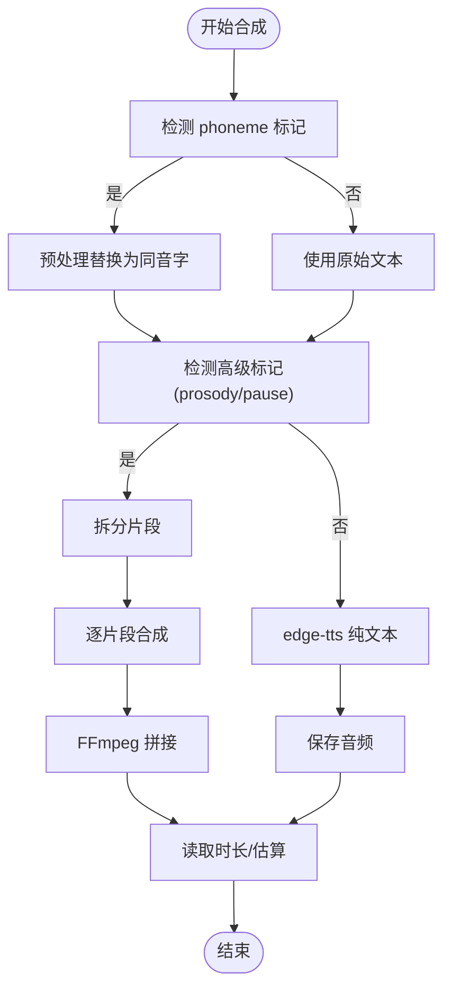
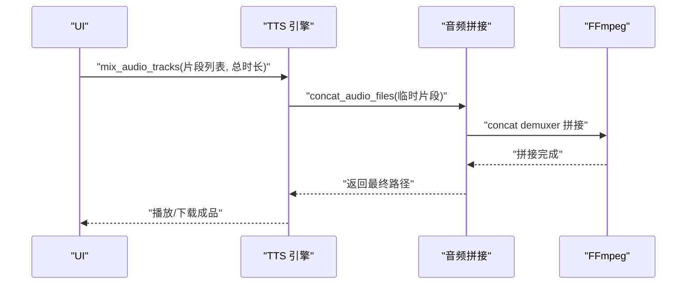
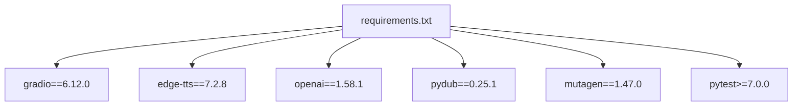

# 项目概述

<cite>
**本文引用的文件**
- [app/main.py](file://app/main.py)
- [app/ui.py](file://app/ui.py)
- [app/tts_engine.py](file://app/tts_engine.py)
- [app/models.py](file://app/models.py)
- [app/config.py](file://app/config.py)
- [app/tts_parser.py](file://app/tts_parser.py)
- [app/llm_parser.py](file://app/llm_parser.py)
- [app/project_manager.py](file://app/project_manager.py)
- [app/tts_advanced.py](file://app/tts_advanced.py)
- [app/tts_concat.py](file://app/tts_concat.py)
- [requirements.txt](file://requirements.txt)
- [run_server.py](file://run_server.py)
- [docs/README.md](file://docs/README.md)
- [docs/EDGE_TTS_ADVANCED_MARKERS_GUIDE.md](file://docs/EDGE_TTS_ADVANCED_MARKERS_GUIDE.md)
- [demo_complex.py](file://demo_complex.py)
</cite>

## 目录
1. [简介](#简介)
2. [项目结构](#项目结构)
3. [核心组件](#核心组件)
4. [架构总览](#架构总览)
5. [详细组件分析](#详细组件分析)
6. [依赖关系分析](#依赖关系分析)
7. [性能考量](#性能考量)
8. [故障排除指南](#故障排除指南)
9. [结论](#结论)
10. [附录](#附录)

## 简介
TTS Studio 是一个基于 Python 的桌面语音合成应用程序，采用 Gradio Web 界面框架构建，面向中文有声书、播客与配音工作流的创作者。项目的核心价值主张在于：
- 智能文本解析：通过本地或远程 LLM 将自由格式文本解析为结构化的剧本片段，自动识别角色与对白。
- 高级 TTS 合成：在 edge-tts 原生能力基础上，通过 Monkey Patch 与“自动拆分+拼接”架构，支持多音字标注、停顿插入、语气强调与多段语速/音调变化。
- 多音字精确控制：通过标记语法在句内实现同音字替换，确保发音精准。
- 多轨混音：将对白、背景音乐与音效按时间轴精确混合，支持总时长裁剪与静音拼接。

整体采用 MVC 分离、模块化设计与事件驱动的交互模式，清晰地划分了 UI（Gradio）、业务逻辑（TTS 引擎与解析器）、数据模型（工程、角色、片段）与外部服务集成（edge-tts、OpenAI、FFmpeg）。

## 项目结构
项目采用按功能域划分的模块化组织方式，核心目录与职责如下：
- app：应用核心逻辑，包含 UI 构建、TTS 引擎、文本解析、工程管理、配置与数据模型。
- docs：用户与开发者文档，涵盖性能优化、高级标记语法、安装与部署指南。
- scripts：辅助脚本（如 edge-tts 补丁脚本）。
- tests：端到端与单元测试集合。
- 根目录：运行入口、依赖声明与容器化配置。

**图示来源**
- [app/ui.py:13-183](file://app/ui.py#L13-L183)
- [app/tts_engine.py:1-547](file://app/tts_engine.py#L1-L547)
- [app/tts_parser.py:1-220](file://app/tts_parser.py#L1-L220)
- [app/tts_advanced.py:1-290](file://app/tts_advanced.py#L1-L290)
- [app/tts_concat.py:1-159](file://app/tts_concat.py#L1-L159)
- [app/llm_parser.py:1-21](file://app/llm_parser.py#L1-L21)
- [app/project_manager.py:1-73](file://app/project_manager.py#L1-L73)
- [app/models.py:1-78](file://app/models.py#L1-L78)
- [app/config.py:1-74](file://app/config.py#L1-L74)

**章节来源**
- [app/main.py:1-51](file://app/main.py#L1-L51)
- [app/ui.py:13-183](file://app/ui.py#L13-L183)
- [requirements.txt:1-16](file://requirements.txt#L1-L16)

## 核心组件
- Gradio UI（UI 构建与事件驱动）
  - 负责工程管理、文本解析、对白编辑、SSML 标记与属性编辑、混音输出等页面与交互。
  - 通过回调函数响应按钮点击、表格选择、滑块变更等事件，驱动业务逻辑执行。
- LLM 文本解析（LLM 解析）
  - 使用 OpenAI 客户端调用远程或本地 Ollama/自建 API，将输入文本解析为结构化 JSON（类型、角色、情感、文本）。
- TTS 引擎（TTS 引擎）
  - 统一合成入口，支持 edge-tts 原生文本、自定义 SSML 与高级标记（prosody/pause/phoneme）。
  - 自动检测标记类型，必要时拆分片段、调用 edge-tts 合成、使用 FFmpeg 拼接，返回时长。
- 高级解析器（高级解析）
  - 解析新语法标记（<prosody>/<pause>/[phoneme]），拆分为 TextSegment 列表，支持多片段与停顿。
- 高级合成（高级合成）
  - 针对复杂标记的替代实现，提供基于旧语法的 {rate}/{pitch}/{pause} 解析与拼接。
- 音频拼接（音频拼接）
  - 使用 FFmpeg concat demuxer 将多个片段按顺序拼接，避免 pydub 的额外依赖。
- 工程管理（工程管理）
  - 负责将 ScriptLine 转换为 AudioClip，序列化/反序列化工程文件，维护角色与音色配置。
- 数据模型（数据模型）
  - 定义 Character、AudioClip、ScriptLine、Project 等核心数据结构，统一工程状态。
- 配置（配置）
  - 环境变量与默认值（API 地址、模型、音色选项、数据目录），支持 Docker 与本地开发环境。

**章节来源**
- [app/ui.py:13-183](file://app/ui.py#L13-L183)
- [app/llm_parser.py:7-21](file://app/llm_parser.py#L7-L21)
- [app/tts_engine.py:120-547](file://app/tts_engine.py#L120-L547)
- [app/tts_parser.py:39-220](file://app/tts_parser.py#L39-L220)
- [app/tts_advanced.py:112-290](file://app/tts_advanced.py#L112-L290)
- [app/tts_concat.py:17-159](file://app/tts_concat.py#L17-L159)
- [app/project_manager.py:9-73](file://app/project_manager.py#L9-L73)
- [app/models.py:4-78](file://app/models.py#L4-L78)
- [app/config.py:5-74](file://app/config.py#L5-L74)

## 架构总览
项目采用“UI（Gradio）—业务逻辑（TTS/解析/工程）—外部服务（edge-tts/OpenAI/FFmpeg）”的分层架构，遵循 MVC 分离与模块化设计：
- 视图层（UI）：负责用户交互与状态展示，通过事件回调触发控制器逻辑。
- 控制器（业务逻辑）：封装 TTS 合成、文本解析、工程管理等核心流程。
- 模型（数据模型）：统一工程状态与数据结构，便于跨模块共享。
- 外部集成：edge-tts（微软 TTS）、OpenAI（LLM 解析）、FFmpeg（音频拼接/混音）。

**图示来源**
- [app/ui.py:13-183](file://app/ui.py#L13-L183)
- [app/llm_parser.py:7-21](file://app/llm_parser.py#L7-L21)
- [app/tts_engine.py:120-547](file://app/tts_engine.py#L120-L547)
- [app/tts_parser.py:39-220](file://app/tts_parser.py#L39-L220)
- [app/tts_advanced.py:112-290](file://app/tts_advanced.py#L112-L290)
- [app/tts_concat.py:17-159](file://app/tts_concat.py#L17-L159)

## 详细组件分析

### UI 与交互（Gradio）
- 页面组织：工程与配置、文本解析、对白编辑、混音输出四大 Tab，支持角色管理、工程导入导出、批量生成与预览。
- 事件驱动：按钮点击、表格选择、滑块变更等触发异步合成与混音流程，实时更新表格与状态。
- 数据绑定：通过全局 current_project 维护工程状态，表格与下拉框的数据源动态刷新。

**图示来源**
- [app/ui.py:464-558](file://app/ui.py#L464-L558)
- [app/llm_parser.py:7-21](file://app/llm_parser.py#L7-L21)
- [app/project_manager.py:9-29](file://app/project_manager.py#L9-L29)
- [app/tts_engine.py:120-218](file://app/tts_engine.py#L120-L218)

**章节来源**
- [app/ui.py:13-183](file://app/ui.py#L13-L183)

### TTS 引擎与高级标记
- 自动检测与分支：
  - 若包含 phoneme/pause/prosody 标记，进入“高级文本合成”，拆分片段、调用 edge-tts 合成、FFmpeg 拼接。
  - 若为自定义 SSML，直接透传给 edge-tts。
  - 否则走 edge-tts 原生纯文本模式。
- Monkey Patch：通过替换 edge-tts 的内部方法，使其支持自定义 SSML，突破官方限制。
- 时长获取：优先使用 mutagen 读取 MP3 时长，降级为估算。

**图示来源**
- [app/tts_engine.py:167-218](file://app/tts_engine.py#L167-L218)
- [app/tts_engine.py:321-453](file://app/tts_engine.py#L321-L453)
- [app/tts_parser.py:39-183](file://app/tts_parser.py#L39-L183)

**章节来源**
- [app/tts_engine.py:120-547](file://app/tts_engine.py#L120-L547)
- [app/tts_parser.py:39-220](file://app/tts_parser.py#L39-L220)
- [docs/EDGE_TTS_ADVANCED_MARKERS_GUIDE.md:1-240](file://docs/EDGE_TTS_ADVANCED_MARKERS_GUIDE.md#L1-L240)

### 高级合成（替代实现）
- 旧语法支持：解析 {rate}/{pitch}/{pause} 等标记，拆分为多个片段，分别合成后拼接。
- 重试与清理：为每个片段提供指数回退重试，最终清理临时文件。

**章节来源**
- [app/tts_advanced.py:22-290](file://app/tts_advanced.py#L22-L290)

### 音频拼接与混音
- 拼接：使用 FFmpeg concat demuxer 将多个片段顺序拼接，避免重新编码。
- 混音：将多个 AudioClip（对白/背景乐/音效）按起始时间与音量叠加，支持总时长裁剪。

**图示来源**
- [app/tts_engine.py:454-534](file://app/tts_engine.py#L454-L534)
- [app/tts_concat.py:17-90](file://app/tts_concat.py#L17-L90)

**章节来源**
- [app/tts_engine.py:454-534](file://app/tts_engine.py#L454-L534)
- [app/tts_concat.py:17-159](file://app/tts_concat.py#L17-L159)

### 工程与数据模型
- Project：工程容器，包含原始文本、剧本行、音频片段、BGM/音效、角色与 LLM 配置。
- ScriptLine：中间表示，提供 get_tts_text 决定合成文本来源。
- AudioClip：对白/背景乐/音效的抽象，含起始时间、时长与生成状态。
- Project Manager：负责序列化/反序列化工程文件，维护角色与音色映射。

**章节来源**
- [app/models.py:4-78](file://app/models.py#L4-L78)
- [app/project_manager.py:9-73](file://app/project_manager.py#L9-L73)

## 依赖关系分析
- 运行时依赖：Gradio、edge-tts、OpenAI、pydub、mutagen、pytest。
- 外部服务：edge-tts（微软 TTS）、OpenAI（LLM 解析）、FFmpeg（音频处理）。
- 项目内模块耦合：UI 依赖 LLM、TTS 引擎、工程管理；TTS 引擎依赖解析器与拼接工具；解析器与高级合成相互协作；工程管理与数据模型强关联。

**图示来源**
- [requirements.txt:1-16](file://requirements.txt#L1-L16)

**章节来源**
- [requirements.txt:1-16](file://requirements.txt#L1-L16)

## 性能考量
- Gradio 性能：项目配套文档记录了常见性能问题与优化实践，建议避免在 demo.load 中进行重型初始化，采用手动列表加载与懒加载策略。
- TTS 合成：为每个片段提供指数回退重试，减少网络波动影响；尽量使用自定义 SSML 以减少请求次数。
- 音频处理：拼接阶段使用 FFmpeg concat demuxer，避免重复解码/编码；混音阶段使用 adelay + amix，保证对齐与音量平衡。
- 资源管理：合成完成后及时清理临时文件，避免磁盘占用。

[本节为通用指导，无需特定文件引用]

## 故障排除指南
- Gradio 页面卡顿/空白：参考文档中的性能问题记录与快速参考，检查初始化逻辑与组件更新频率。
- FFmpeg 未安装或找不到命令：根据安装指南配置环境变量与路径。
- edge-tts 403/网络异常：检查代理设置或网络可达性；必要时设置 HTTP_PROXY/https_proxy。
- 合成失败重试：TTS 引擎与高级合成均提供重试机制，关注日志中的错误堆栈与最后一次异常信息。

**章节来源**
- [docs/README.md:1-171](file://docs/README.md#L1-L171)
- [app/tts_engine.py:256-318](file://app/tts_engine.py#L256-L318)
- [app/tts_advanced.py:194-221](file://app/tts_advanced.py#L194-L221)

## 结论
TTS Studio 通过 Gradio 提供直观易用的桌面化界面，结合 edge-tts 的 Monkey Patch 与“自动拆分+拼接”架构，实现了中文场景下的高级 TTS 能力与多轨混音工作流。其模块化设计与清晰的 MVC 分离，既满足初学者快速上手，也为进阶用户提供充分的扩展空间。配合完善的文档与测试体系，项目具备良好的可维护性与可部署性。

[本节为总结性内容，无需特定文件引用]

## 附录
- 示例演示：demo_complex.py 展示了多音字、停顿、强调与多片段组合的合成效果，适合快速验证标记语法与效果。
- 文档索引：docs/README.md 提供了文档分类与快速查找入口，涵盖性能优化、TTS 功能、编辑器使用与部署指南。

**章节来源**
- [demo_complex.py:1-239](file://demo_complex.py#L1-L239)
- [docs/README.md:1-171](file://docs/README.md#L1-L171)