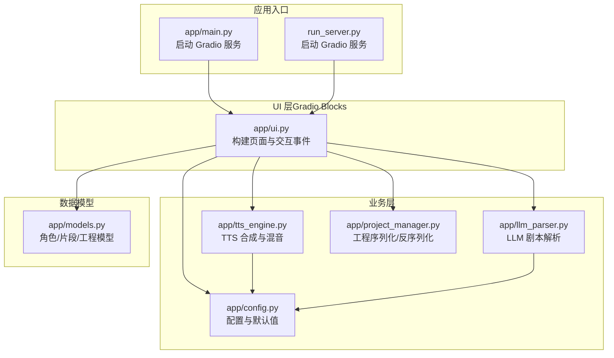
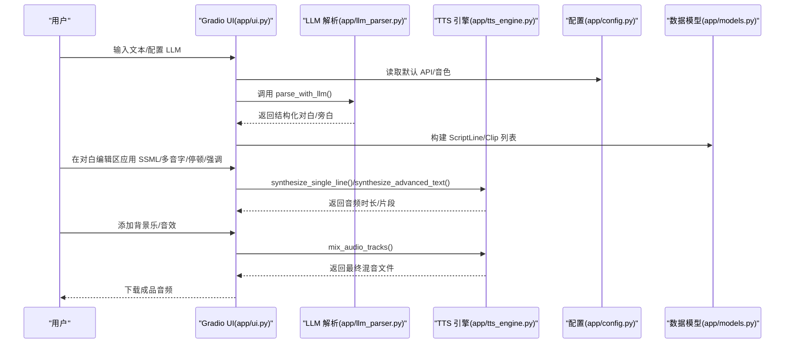
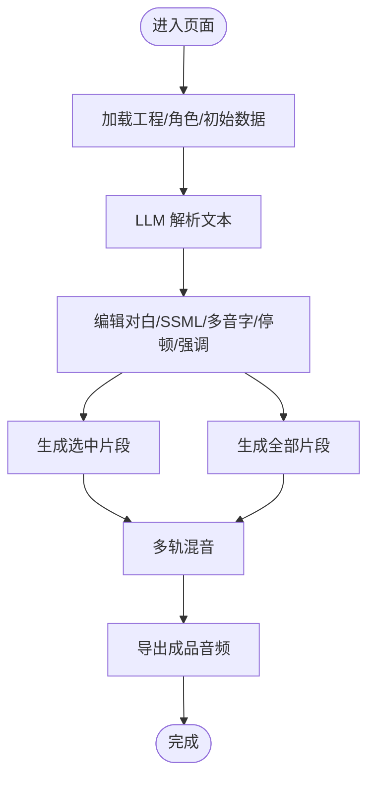
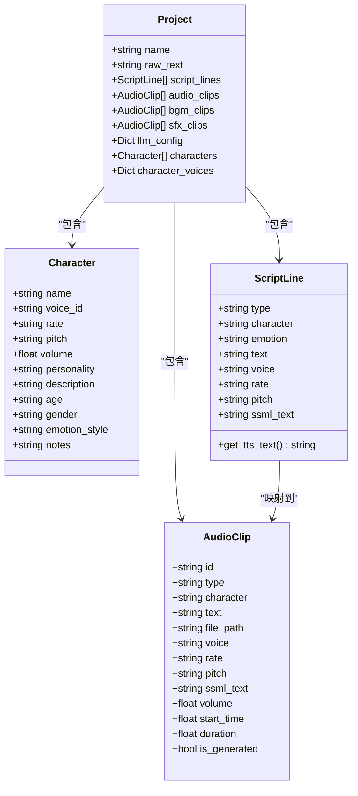
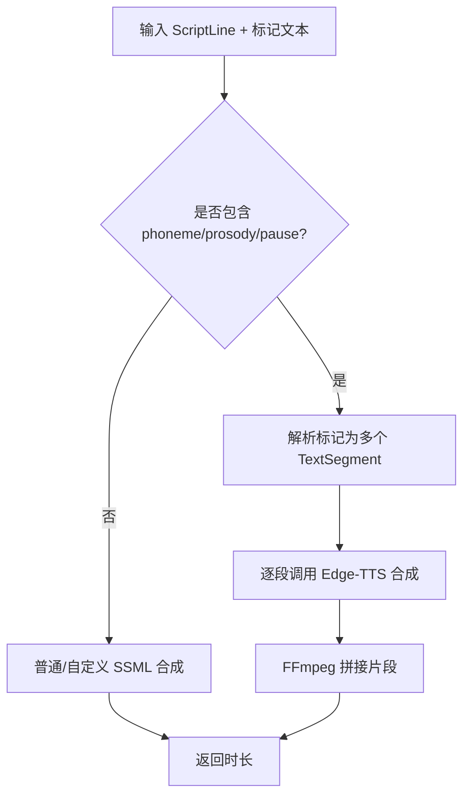
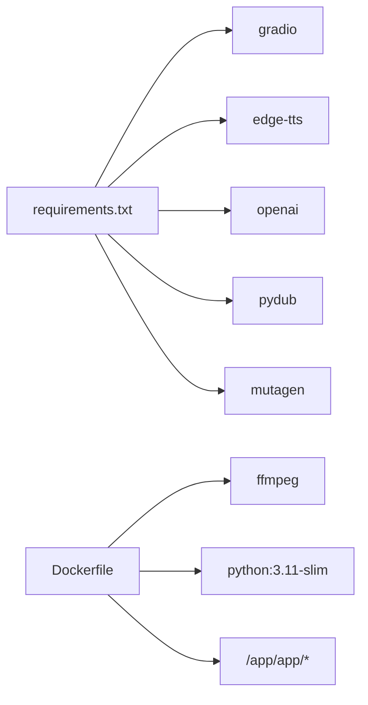

# 项目简介

<cite>
**本文引用的文件**
- [app/main.py](file://app/main.py)
- [app/ui.py](file://app/ui.py)
- [app/tts_engine.py](file://app/tts_engine.py)
- [app/models.py](file://app/models.py)
- [app/config.py](file://app/config.py)
- [app/llm_parser.py](file://app/llm_parser.py)
- [run_server.py](file://run_server.py)
- [requirements.txt](file://requirements.txt)
- [Dockerfile](file://Dockerfile)
- [setup.sh](file://setup.sh)
- [docs/README.md](file://docs/README.md)
- [demo_complex.py](file://demo_complex.py)
</cite>

## 目录
1. [简介](#简介)
2. [项目结构](#项目结构)
3. [核心组件](#核心组件)
4. [架构总览](#架构总览)
5. [详细组件分析](#详细组件分析)
6. [依赖关系分析](#依赖关系分析)
7. [性能考量](#性能考量)
8. [故障排查指南](#故障排查指南)
9. [结论](#结论)
10. [附录](#附录)

## 简介
TTS Studio 是一个基于 Python 的桌面语音合成应用程序，采用 Gradio Web 界面框架构建，专注于中文有声内容的高效制作。项目的核心价值在于提供一套完整的“智能文本解析 + 高级 TTS 合成 + 多音字精确控制 + 多轨混音”的工作流，帮助创作者从纯文本快速生成高质量的播客、有声书、音频内容等。

- 智能文本解析：通过 LLM 将任意格式的小说或剧本解析为结构化的对白与旁白，自动识别角色与情绪，极大降低人工标注成本。
- 高级 TTS 合成：支持 Edge-TTS 与 Azure Speech Service，具备 SSML 标记、语速/音调/音量等参数控制，以及多音字标注、停顿插入、语气强调等高级能力。
- 多音字精确控制：通过自定义标记语法，针对多音字进行精准发音控制，确保语音合成的准确性与自然度。
- 多轨混音：支持背景音乐与音效的多轨叠加与时间轴对齐，提供灵活的音频后期整合能力。

目标用户包括：
- 内容创作者：播客作者、短视频创作者、音频内容制作者
- 有声书制作团队：需要批量合成与精细控制的制作方
- 教育与培训领域：需要高质量语音讲解与演示的讲师与机构
- 本地化与翻译团队：需要统一音色与语调风格的配音制作

应用场景：
- 播客制作：从脚本到成品音频的一站式合成与混音
- 有声书录制：将长篇文本自动化转为连续语音，配合背景音乐与音效提升沉浸感
- 音频内容创作：广告配音、课程讲解、故事朗读等多样化内容生产

## 项目结构
项目采用模块化设计，围绕“UI层（Gradio）—业务层（解析/合成/混音）—数据层（工程/片段/角色）”组织代码，便于扩展与维护。

图表来源
- [app/main.py:15-51](file://app/main.py#L15-L51)
- [run_server.py:1-5](file://run_server.py#L1-5)
- [app/ui.py:13-1826](file://app/ui.py#L13-L1826)
- [app/config.py:1-74](file://app/config.py#L1-L74)
- [app/llm_parser.py:7-21](file://app/llm_parser.py#L7-L21)
- [app/tts_engine.py:1-547](file://app/tts_engine.py#L1-L547)
- [app/models.py:1-78](file://app/models.py#L1-L78)

章节来源
- [app/main.py:15-51](file://app/main.py#L15-L51)
- [run_server.py:1-5](file://run_server.py#L1-L5)
- [app/ui.py:13-1826](file://app/ui.py#L13-L1826)
- [app/config.py:1-74](file://app/config.py#L1-L74)

## 核心组件
- Gradio UI（app/ui.py）：构建工程管理、文本解析、对白编辑、混音输出四大功能区，提供角色管理、SSML 标记编辑、音轨添加与混音导出等交互。
- LLM 解析（app/llm_parser.py）：基于 OpenAI 客户端接口，使用系统提示词将输入文本解析为结构化对白/旁白数组。
- TTS 引擎（app/tts_engine.py）：封装 Edge-TTS/Azure 合成，支持高级标记（prosody/pause/phoneme）、分段合成与 FFmpeg 拼接、多轨混音。
- 数据模型（app/models.py）：定义角色、音频片段、剧本行与工程对象，提供统一的数据结构与序列化支持。
- 配置中心（app/config.py）：集中管理 API 默认值、音色选项、数据目录与系统提示词。
- 工程管理（app/project_manager.py）：负责工程的保存/加载，将 ScriptLine 转换为 AudioClip 并计算时间轴。

章节来源
- [app/ui.py:13-1826](file://app/ui.py#L13-L1826)
- [app/llm_parser.py:7-21](file://app/llm_parser.py#L7-L21)
- [app/tts_engine.py:120-547](file://app/tts_engine.py#L120-L547)
- [app/models.py:1-78](file://app/models.py#L1-L78)
- [app/config.py:1-74](file://app/config.py#L1-L74)

## 架构总览
下图展示了从用户输入到最终混音输出的关键流程，涵盖 LLM 解析、TTS 合成、多音字处理、停顿与强调标记、以及多轨混音。

图表来源
- [app/ui.py:471-706](file://app/ui.py#L471-L706)
- [app/llm_parser.py:7-21](file://app/llm_parser.py#L7-L21)
- [app/tts_engine.py:120-547](file://app/tts_engine.py#L120-L547)
- [app/config.py:1-74](file://app/config.py#L1-L74)
- [app/models.py:36-78](file://app/models.py#L36-L78)

## 详细组件分析

### UI 与交互流程（Gradio Blocks）
- 工程与配置：支持新建/保存/加载工程，管理角色列表与音色参数，配置 LLM API。
- 文本解析：一键触发 LLM 解析，自动识别角色与对白，并生成初始音频片段。
- 对白编辑：表格化编辑对白文本与角色，支持 SSML 标记、多音字标注、停顿插入、语气强调等。
- 混音输出：添加背景乐与音效，按时间轴对齐并导出最终混音。

图表来源
- [app/ui.py:13-1826](file://app/ui.py#L13-L1826)

章节来源
- [app/ui.py:13-1826](file://app/ui.py#L13-L1826)

### 数据模型与工程管理
- 角色（Character）：包含姓名、音色ID、语速、音调、音量、性格摘要等字段。
- 音频片段（AudioClip）：对白/背景乐/音效的统一抽象，记录起止时间、时长、音量与生成状态。
- 剧本行（ScriptLine）：解析后的中间格式，提供 get_tts_text() 以优先使用带标记的 SSML 文本。
- 工程（Project）：聚合原始文本、剧本行、音频片段、背景乐、音效、角色与 LLM 配置。

图表来源
- [app/models.py:4-78](file://app/models.py#L4-L78)

章节来源
- [app/models.py:1-78](file://app/models.py#L1-L78)

### TTS 引擎与高级标记
- 单行合成：支持普通文本与自定义 SSML，自动检测代理与重试机制，返回音频时长。
- 高级标记：解析 prosody/pause/phoneme 等标记，拆分为多个片段并逐段合成，最后使用 FFmpeg 拼接。
- 多轨混音：将对白、背景乐与音效按时间轴叠加，支持总时长控制与静音/测试音生成。

图表来源
- [app/tts_engine.py:120-453](file://app/tts_engine.py#L120-L453)

章节来源
- [app/tts_engine.py:120-547](file://app/tts_engine.py#L120-L547)

### LLM 解析与系统提示词
- 使用 OpenAI 客户端接口，基于系统提示词将输入文本解析为结构化 JSON 数组，包含类型、角色、情感与文本。
- 提示词强调仅输出纯 JSON 数组，避免 Markdown 包裹，便于程序解析。

章节来源
- [app/llm_parser.py:7-21](file://app/llm_parser.py#L7-L21)
- [app/config.py:60-74](file://app/config.py#L60-L74)

## 依赖关系分析
- 运行时依赖：Gradio（Web UI）、edge-tts（TTS）、OpenAI（LLM）、pydub/mutagen（音频处理）、FFmpeg（拼接/混音）。
- 部署依赖：Dockerfile 内置 FFmpeg 与 Python 依赖，支持容器化部署与数据卷挂载。

图表来源
- [requirements.txt:1-16](file://requirements.txt#L1-L16)
- [Dockerfile:1-51](file://Dockerfile#L1-L51)

章节来源
- [requirements.txt:1-16](file://requirements.txt#L1-L16)
- [Dockerfile:1-51](file://Dockerfile#L1-L51)

## 性能考量
- Gradio 性能优化：项目文档提供了完整的性能问题记录、优化指南与快速参考手册，涵盖组件更新、首次加载、Tab 切换卡顿等问题的排查与修复。
- 合成策略：高级标记采用分段合成与拼接，避免一次性超长文本导致的不稳定；提供重试机制与代理支持，提升网络异常下的稳定性。
- 混音策略：使用 FFmpeg 命令行实现多轨叠加，避免 pydub 的内存压力；支持总时长控制与静音占位，保证输出一致性。

章节来源
- [docs/README.md:1-171](file://docs/README.md#L1-L171)
- [app/tts_engine.py:255-318](file://app/tts_engine.py#L255-L318)
- [app/tts_engine.py:454-534](file://app/tts_engine.py#L454-L534)

## 故障排查指南
- Gradio 常见问题：Tab 切换卡死、控制台大量警告、组件更新不显示、首次加载数据空白等，均有对应的快速参考与完整排查记录。
- FFmpeg 安装与验证：Windows 环境下需正确安装并配置环境变量，文档提供了安装指南与验证方法。
- Docker 部署：容器化部署时注意数据卷挂载、环境变量与健康检查配置，确保服务稳定运行。

章节来源
- [docs/README.md:113-133](file://docs/README.md#L113-L133)
- [docs/README.md:71-80](file://docs/README.md#L71-L80)

## 结论
TTS Studio 以 Gradio 为交互入口，结合 LLM 解析与高级 TTS 能力，实现了从文本到成品音频的全链路自动化与精细化控制。其多音字精确控制、停顿与语气强调、多轨混音等特性，使其在播客、有声书与音频内容创作场景中具有显著优势。配套的性能优化与部署文档，进一步降低了使用门槛与运维成本。

## 附录
- 复杂示例演示：demo_complex.py 展示了多音字、停顿、强调、音调变化与多片段拼接的综合效果，适合深入理解高级标记语法与合成流程。
- 快速上手建议：阅读性能问题记录了解项目背景，参考 Edge-TTS 高级标记指南掌握核心功能，使用 Docker 部署快速启动服务。

章节来源
- [demo_complex.py:1-239](file://demo_complex.py#L1-L239)
- [docs/README.md:147-166](file://docs/README.md#L147-L166)