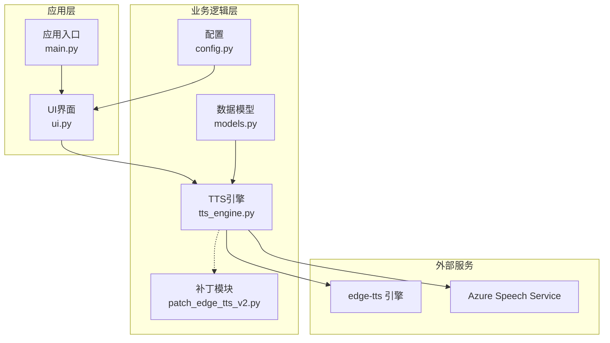
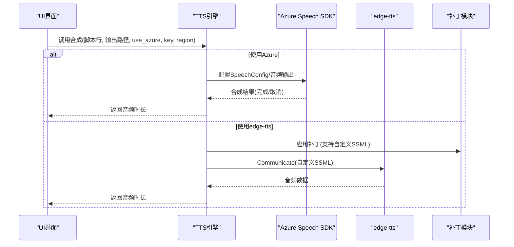
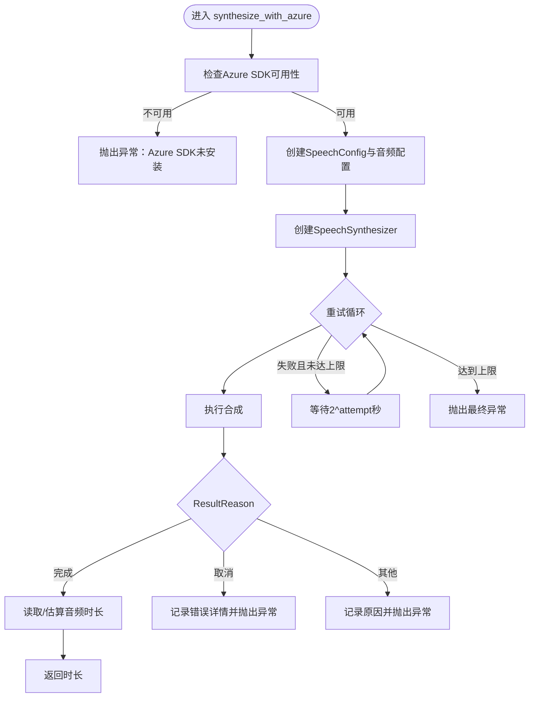
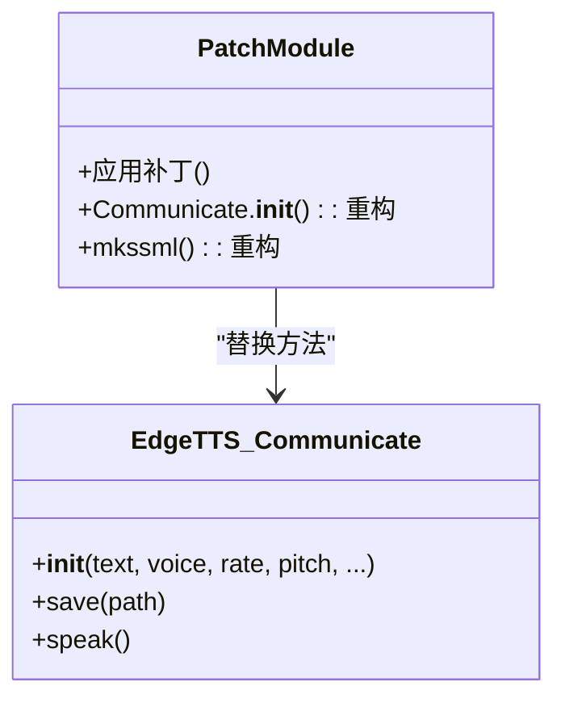
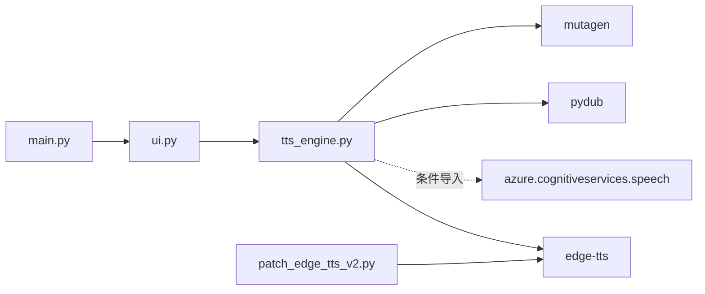

# Azure语音服务集成

<cite>
**本文引用的文件**
- [tts_engine.py](file://app/tts_engine.py)
- [patch_edge_tts_v2.py](file://app/patch_edge_tts_v2.py)
- [config.py](file://app/config.py)
- [models.py](file://app/models.py)
- [ui.py](file://app/ui.py)
- [main.py](file://app/main.py)
- [requirements.txt](file://requirements.txt)
- [README.md](file://docs/README.md)
- [EDGE_TTS_ADVANCED_MARKERS_GUIDE.md](file://docs/EDGE_TTS_ADVANCED_MARKERS_GUIDE.md)
- [README_GRADIO_PERFORMANCE_TESTS.md](file://tests/README_GRADIO_PERFORMANCE_TESTS.md)
- [test_gradio_performance.py](file://tests/test_gradio_performance.py)
</cite>

## 目录
1. [简介](#简介)
2. [项目结构](#项目结构)
3. [核心组件](#核心组件)
4. [架构总览](#架构总览)
5. [详细组件分析](#详细组件分析)
6. [依赖关系分析](#依赖关系分析)
7. [性能考量](#性能考量)
8. [故障排除指南](#故障排除指南)
9. [结论](#结论)
10. [附录](#附录)

## 简介
本文件面向TTS Studio中Azure语音服务的集成与使用，重点解释Azure Speech Service与edge-tts引擎的对比与优势，详述Azure服务的配置方法（API密钥、区域、端点），深入剖析补丁机制patch_edge_tts_v2.py如何实现Azure的无缝集成，提供使用示例与最佳实践（错误处理、重试机制、性能监控），并给出Azure服务的定价模式与成本优化建议及故障排除指南。

## 项目结构
围绕Azure语音服务集成的相关文件主要集中在app目录，核心文件包括：
- tts_engine.py：TTS引擎入口，包含Azure合成与edge-tts合成的统一调度、重试与日志
- patch_edge_tts_v2.py：对edge-tts进行Monkey Patch，使其支持自定义SSML，为Azure无缝切换提供基础
- config.py：全局配置与音色选项
- models.py：脚本行与音频片段数据模型
- ui.py：Gradio界面，负责用户交互与调用合成
- main.py：应用入口
- requirements.txt：第三方依赖声明（不含Azure SDK）

图表来源
- [tts_engine.py:1-547](file://app/tts_engine.py#L1-L547)
- [patch_edge_tts_v2.py:1-117](file://app/patch_edge_tts_v2.py#L1-L117)
- [config.py:1-74](file://app/config.py#L1-L74)
- [models.py:1-78](file://app/models.py#L1-L78)
- [ui.py:1-800](file://app/ui.py#L1-L800)
- [main.py:1-51](file://app/main.py#L1-L51)

章节来源
- [tts_engine.py:1-547](file://app/tts_engine.py#L1-L547)
- [patch_edge_tts_v2.py:1-117](file://app/patch_edge_tts_v2.py#L1-L117)
- [config.py:1-74](file://app/config.py#L1-L74)
- [models.py:1-78](file://app/models.py#L1-L78)
- [ui.py:1-800](file://app/ui.py#L1-L800)
- [main.py:1-51](file://app/main.py#L1-L51)

## 核心组件
- Azure合成函数：synthesize_with_azure，封装Azure Speech SDK的配置、重试与结果处理
- 统一合成入口：synthesize_single_line，根据use_azure与配置决定走Azure还是edge-tts
- 补丁模块：patch_edge_tts_v2.py，替换edge-tts内部方法，支持自定义SSML，为Azure无缝切换提供兼容性
- 数据模型：ScriptLine与AudioClip，承载文本、音色、语速、音调等参数
- UI与入口：ui.py与main.py，负责用户交互与应用启动

章节来源
- [tts_engine.py:43-144](file://app/tts_engine.py#L43-L144)
- [patch_edge_tts_v2.py:112-117](file://app/patch_edge_tts_v2.py#L112-L117)
- [models.py:36-61](file://app/models.py#L36-L61)
- [ui.py:13-51](file://app/ui.py#L13-L51)
- [main.py:15-51](file://app/main.py#L15-L51)

## 架构总览
Azure语音服务集成采用“统一调度 + 边缘补丁”的架构设计：
- 统一调度：synthesize_single_line根据use_azure与配置判断使用Azure或edge-tts
- Azure路径：synthetize_with_azure使用speechsdk.SpeechConfig与SpeechSynthesizer进行合成，具备指数退避重试
- edge-tts路径：通过patch_edge_tts_v2.py支持自定义SSML，结合高级标记解析与FFmpeg拼接实现复杂语气控制
- 数据模型：ScriptLine/ssml_text优先使用自定义SSML，确保Azure与edge-tts行为一致

图表来源
- [tts_engine.py:120-144](file://app/tts_engine.py#L120-L144)
- [tts_engine.py:43-118](file://app/tts_engine.py#L43-L118)
- [patch_edge_tts_v2.py:112-117](file://app/patch_edge_tts_v2.py#L112-L117)

## 详细组件分析

### Azure合成流程（synthesize_with_azure）
- 可用性检查：导入azure.cognitiveservices.speech失败时AZURE_SPEECH_AVAILABLE为False
- 配置步骤：使用subscription与region创建SpeechConfig；设置speech_synthesis_voice_name
- 合成器：AudioOutputConfig(filename)与SpeechSynthesizer组合
- 结果处理：ResultReason判断完成/取消；取消时读取cancellation_details
- 重试机制：指数退避（2^attempt秒），最多max_retries次
- 时长获取：优先使用mutagen读取MP3时长，失败时估算

图表来源
- [tts_engine.py:43-118](file://app/tts_engine.py#L43-L118)

章节来源
- [tts_engine.py:43-118](file://app/tts_engine.py#L43-L118)

### 统一合成入口（synthesize_single_line）
- 参数：use_azure、azure_key、azure_region
- 逻辑：若use_azure且key/region齐全且Azure可用，则走Azure；否则走edge-tts原生逻辑
- edge-tts路径：支持自定义SSML、高级标记（prosody/pause/phoneme）、分段合成与拼接

章节来源
- [tts_engine.py:120-144](file://app/tts_engine.py#L120-L144)

### 补丁机制（patch_edge_tts_v2.py）
- 目标：让edge-tts支持自定义SSML，避免escape与二次包装
- 核心方法替换：
  - Communicate.__init__：检测text是否以<speak开头，若是则保持原样，否则按原逻辑转义与分片
  - mkssml：若已是完整SSML则直接返回，否则按原逻辑构建SSML
- 影响：上层可直接传入完整SSML，与Azure行为一致，便于无缝切换

图表来源
- [patch_edge_tts_v2.py:112-117](file://app/patch_edge_tts_v2.py#L112-L117)

章节来源
- [patch_edge_tts_v2.py:112-117](file://app/patch_edge_tts_v2.py#L112-L117)
- [EDGE_TTS_ADVANCED_MARKERS_GUIDE.md:139-240](file://docs/EDGE_TTS_ADVANCED_MARKERS_GUIDE.md#L139-L240)

### 数据模型与SSML优先级
- ScriptLine.get_tts_text：优先返回ssml_text（若非空），否则返回text
- 作用：确保Azure与edge-tts均使用同一份SSML输入，避免行为差异

章节来源
- [models.py:48-61](file://app/models.py#L48-L61)

### UI与入口
- main.py：启动Gradio应用，暴露UI
- ui.py：构建界面、事件绑定、调用synthesize_single_line进行合成与混音

章节来源
- [main.py:15-51](file://app/main.py#L15-L51)
- [ui.py:13-51](file://app/ui.py#L13-L51)

## 依赖关系分析
- 外部依赖：edge-tts、pydub、mutagen、aiohttp（由edge-tts使用）
- Azure SDK：通过条件导入（azure.cognitiveservices.speech），仅在可用时启用Azure路径
- 依赖图：

图表来源
- [tts_engine.py:1-28](file://app/tts_engine.py#L1-L28)
- [patch_edge_tts_v2.py:5-10](file://app/patch_edge_tts_v2.py#L5-L10)
- [requirements.txt:1-16](file://requirements.txt#L1-L16)

章节来源
- [tts_engine.py:1-28](file://app/tts_engine.py#L1-L28)
- [patch_edge_tts_v2.py:5-10](file://app/patch_edge_tts_v2.py#L5-L10)
- [requirements.txt:1-16](file://requirements.txt#L1-L16)

## 性能考量
- 重试策略：Azure合成采用指数退避（2^attempt秒），降低瞬时失败影响
- 时长获取：优先使用mutagen读取MP3时长，失败时使用字符数估算，兼顾准确性与性能
- edge-tts路径：通过补丁支持自定义SSML，避免重复escape与包装，提升兼容性与稳定性
- UI性能：Gradio侧遵循预加载、避免demo.load、组件静态初始化等优化，详见测试文档

章节来源
- [tts_engine.py:77-118](file://app/tts_engine.py#L77-L118)
- [tts_engine.py:89-97](file://app/tts_engine.py#L89-L97)
- [README_GRADIO_PERFORMANCE_TESTS.md:1-405](file://tests/README_GRADIO_PERFORMANCE_TESTS.md#L1-L405)
- [test_gradio_performance.py:252-345](file://tests/test_gradio_performance.py#L252-L345)

## 故障排除指南
- Azure SDK未安装
  - 现象：调用Azure合成时报“Azure SDK未安装”
  - 处理：安装azure-cognitiveservices-speech或在配置中关闭use_azure
- 合成取消/失败
  - 现象：ResultReason=Canceled，cancellation_details包含错误详情
  - 处理：检查API密钥、区域、网络连通性；查看日志中的错误详情
- 403错误（edge-tts）
  - 现象：重试时出现403
  - 处理：检查代理设置（HTTP_PROXY/https_proxy），确保可访问微软服务
- 重试耗时
  - 现象：多次重试导致总耗时增加
  - 处理：合理设置max_retries；在UI层提供进度反馈
- 时长估算偏差
  - 现象：mutagen不可用时使用字符数估算
  - 处理：安装mutagen以获得更准确时长

章节来源
- [tts_engine.py:51-52](file://app/tts_engine.py#L51-L52)
- [tts_engine.py:101-107](file://app/tts_engine.py#L101-L107)
- [tts_engine.py:292-318](file://app/tts_engine.py#L292-L318)
- [tts_engine.py:89-97](file://app/tts_engine.py#L89-L97)

## 结论
通过补丁机制与统一合成入口，TTS Studio实现了Azure Speech Service与edge-tts的无缝切换。Azure路径具备更强的稳定性与可控性，适合生产环境；edge-tts路径通过补丁支持自定义SSML，满足复杂的语气控制需求。配合重试机制、时长估算与Gradio性能优化，整体系统在易用性、稳定性与可扩展性方面达到良好平衡。

## 附录

### Azure语音服务配置方法
- API密钥设置：在调用synthesize_with_azure时传入azure_key
- 区域选择：在调用synthesize_with_azure时传入azure_region
- 端点配置：当前实现使用默认端点；如需自定义端点，可在SpeechConfig中进一步配置（需扩展）

章节来源
- [tts_engine.py:67-69](file://app/tts_engine.py#L67-L69)

### 使用示例与最佳实践
- 使用示例
  - Azure路径：在调用synthesize_single_line时设置use_azure=True，并提供azure_key与azure_region
  - edge-tts路径：直接调用，补丁自动支持自定义SSML
- 最佳实践
  - 合理设置max_retries，避免过长等待
  - 优先使用mutagen获取时长，确保时序准确
  - 在UI层提供进度与状态反馈
  - 对于复杂语气控制，推荐使用自定义SSML并通过补丁透传至edge-tts

章节来源
- [tts_engine.py:120-144](file://app/tts_engine.py#L120-L144)
- [tts_engine.py:77-118](file://app/tts_engine.py#L77-L118)
- [patch_edge_tts_v2.py:112-117](file://app/patch_edge_tts_v2.py#L112-L117)

### Azure服务的定价模式与成本优化
- 定价模式：Azure Speech Service通常按每分钟音频时长计费，具体以Azure官方定价为准
- 成本优化建议
  - 合理设置max_retries，避免不必要的重试
  - 使用本地缓存与增量合成，减少重复合成
  - 在批量合成时合并请求，降低连接开销
  - 选择合适的语音与采样率，平衡质量与体积

[本节为通用指导，不直接分析具体文件]

### 常见问题与解决方案
- 问：如何切换Azure与edge-tts？
  - 答：在调用synthesize_single_line时设置use_azure与相关参数
- 问：为什么edge-tts有时会403？
  - 答：检查代理设置与网络连通性
- 问：如何确保SSML在Azure与edge-tts中一致？
  - 答：使用ScriptLine.ssml_text，补丁确保edge-tts透传自定义SSML

章节来源
- [tts_engine.py:120-144](file://app/tts_engine.py#L120-L144)
- [models.py:48-61](file://app/models.py#L48-L61)
- [patch_edge_tts_v2.py:112-117](file://app/patch_edge_tts_v2.py#L112-L117)