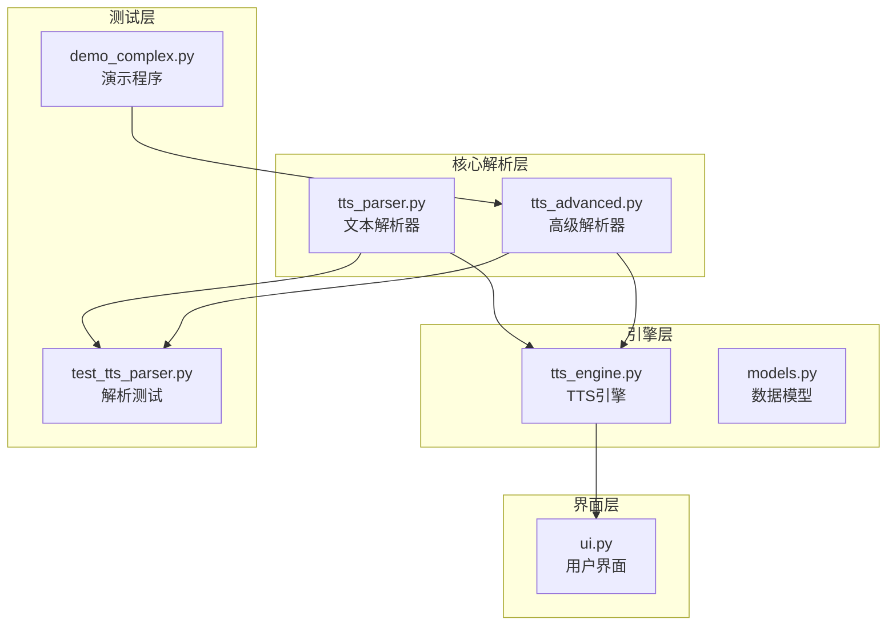
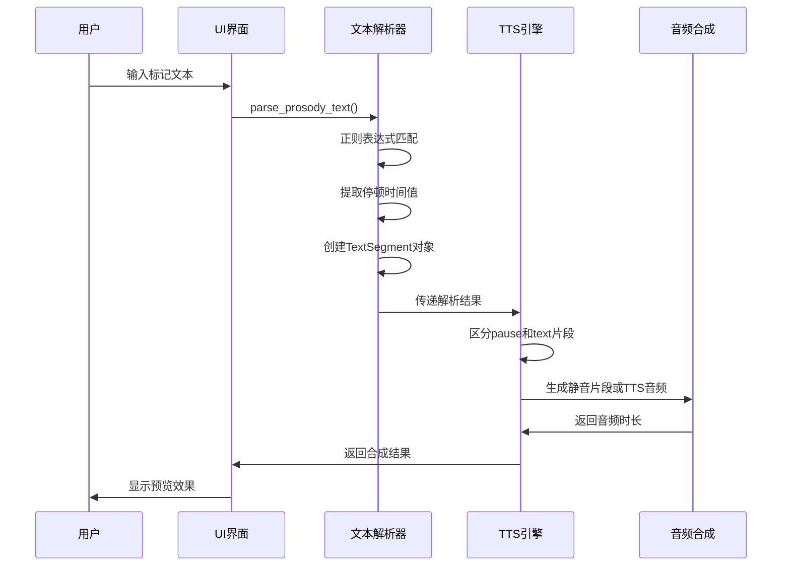
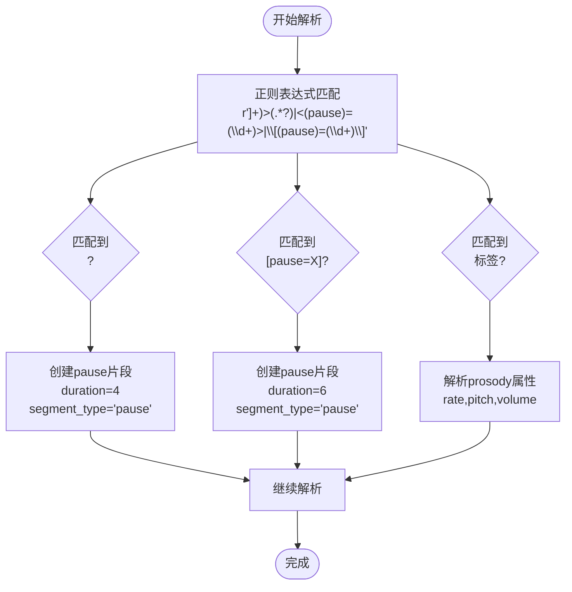
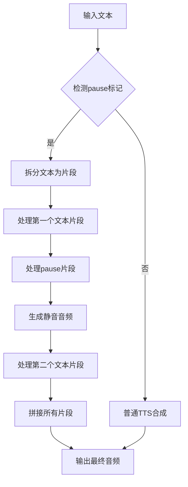
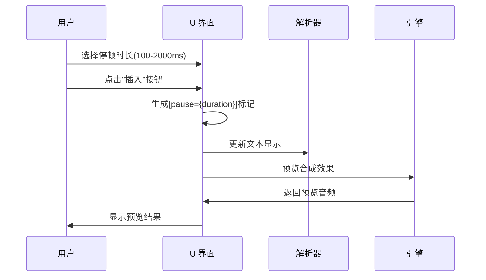
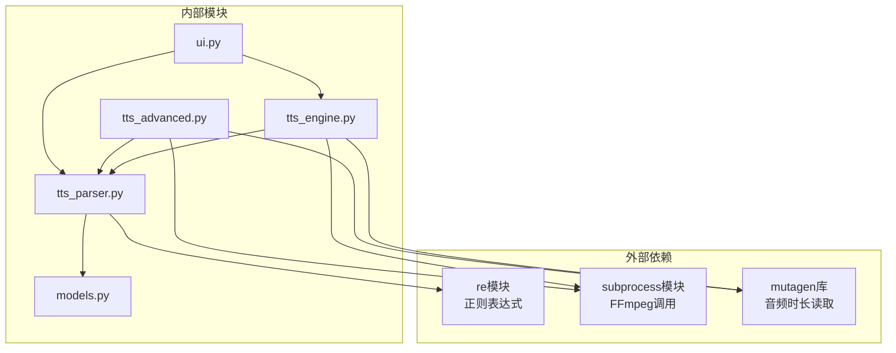

# Pause停顿标记

<cite>
**本文档引用的文件**
- [tts_parser.py](file://app/tts_parser.py)
- [tts_engine.py](file://app/tts_engine.py)
- [tts_advanced.py](file://app/tts_advanced.py)
- [ui.py](file://app/ui.py)
- [models.py](file://app/models.py)
- [test_tts_parser.py](file://tests/test_tts_parser.py)
- [demo_complex.py](file://demo_complex.py)
- [test_pause_debug.py](file://tests/test_pause_debug.py)
</cite>

## 目录
1. [简介](#简介)
2. [项目结构](#项目结构)
3. [核心组件](#核心组件)
4. [架构概览](#架构概览)
5. [详细组件分析](#详细组件分析)
6. [依赖关系分析](#依赖关系分析)
7. [性能考虑](#性能考虑)
8. [故障排除指南](#故障排除指南)
9. [结论](#结论)

## 简介

TTS Studio的Pause停顿标记是一种重要的文本标记功能，允许用户在语音合成过程中精确控制停顿时间和节奏。该功能支持两种不同的标记格式：`<pause=1000>`和`[pause=1000]`，其中数字表示停顿的毫秒数。

Pause停顿标记是TTS Studio高级标记系统的核心组成部分，与prosody强调标记和phoneme多音字替换标记共同构成了完整的文本标记生态系统。通过这些标记，用户可以实现更加自然和富有表现力的语音合成效果。

## 项目结构

TTS Studio采用模块化架构设计，Pause停顿标记功能分布在多个关键模块中：



**图表来源**
- [tts_parser.py:1-220](file://app/tts_parser.py#L1-L220)
- [tts_engine.py:1-547](file://app/tts_engine.py#L1-L547)
- [tts_advanced.py:1-290](file://app/tts_advanced.py#L1-L290)

**章节来源**
- [tts_parser.py:1-220](file://app/tts_parser.py#L1-L220)
- [tts_engine.py:1-547](file://app/tts_engine.py#L1-L547)
- [tts_advanced.py:1-290](file://app/tts_advanced.py#L1-L290)

## 核心组件

### Pause停顿标记格式

TTS Studio支持两种标准的pause停顿标记格式：

#### 格式一：XML样式的`<pause=1000>`
- **语法**：`<pause=毫秒数>`
- **示例**：`<pause=500>`表示停顿500毫秒
- **特点**：符合XML标记规范，适合在SSML环境中使用

#### 格式二：方括号样式的`[pause=1000]`
- **语法**：`[pause=毫秒数]`
- **示例**：`[pause=1000]`表示停顿1000毫秒
- **特点**：更简洁直观，适合快速编辑

### 时间单位和取值范围

- **时间单位**：毫秒（ms）
- **有效取值范围**：1到2147483647（32位整数上限）
- **默认值**：300毫秒
- **步长**：1毫秒

### 数据结构设计

Pause停顿标记在内部使用统一的数据结构进行处理：

```mermaid
classDiagram
class TextSegment {
+string text
+string rate
+string pitch
+string volume
+bool is_marked
+string segment_type
}
class PauseSegment {
+string text "__PAUSE_{duration}__"
+string rate "{duration}"
+string pitch "+0Hz"
+string volume "+0%"
+bool is_marked true
+string segment_type "pause"
}
TextSegment <|-- PauseSegment
```

**图表来源**
- [tts_parser.py:23-36](file://app/tts_parser.py#L23-L36)
- [tts_parser.py:112-132](file://app/tts_parser.py#L112-L132)

**章节来源**
- [tts_parser.py:23-36](file://app/tts_parser.py#L23-L36)
- [tts_parser.py:112-132](file://app/tts_parser.py#L112-L132)

## 架构概览

Pause停顿标记在整个TTS Studio系统中的工作流程如下：



**图表来源**
- [tts_parser.py:69-182](file://app/tts_parser.py#L69-L182)
- [tts_engine.py:321-453](file://app/tts_engine.py#L321-L453)

**章节来源**
- [tts_parser.py:69-182](file://app/tts_parser.py#L69-L182)
- [tts_engine.py:321-453](file://app/tts_engine.py#L321-L453)

## 详细组件分析

### 文本解析器实现

#### 正则表达式匹配机制

文本解析器使用精心设计的正则表达式来识别和解析pause停顿标记：



**图表来源**
- [tts_parser.py:89-92](file://app/tts_parser.py#L89-L92)
- [tts_parser.py:112-132](file://app/tts_parser.py#L112-L132)

#### 时间值提取和验证

解析器对pause标记的时间值进行严格的提取和验证：

1. **时间值提取**：使用`int(match.group(4))`和`int(match.group(6))`提取毫秒值
2. **类型转换**：将字符串形式的毫秒数转换为整数类型
3. **存储格式**：将时间值同时存储在`rate`字段中用于后续处理

#### 片段类型处理

pause停顿标记被识别为特殊的`segment_type='pause'`片段，具有以下特征：

- `text`字段：格式化为`__PAUSE_{duration}__`
- `rate`字段：存储停顿毫秒数
- `is_marked`字段：设置为`True`
- `segment_type`字段：设置为`'pause'`

**章节来源**
- [tts_parser.py:89-182](file://app/tts_parser.py#L89-L182)

### TTS引擎集成

#### 高级文本合成流程

TTS引擎在处理包含pause标记的文本时，采用特殊的合成策略：



**图表来源**
- [tts_engine.py:321-453](file://app/tts_engine.py#L321-L453)
- [tts_engine.py:372-390](file://app/tts_engine.py#L372-L390)

#### 静音生成机制

对于pause片段，TTS引擎使用FFmpeg生成指定时长的静音音频：

1. **命令构建**：`./ffmpeg.exe -f lavfi -i anullsrc=r=24000:cl=mono -t {duration_seconds} -c:a libmp3lame -y {output_path}`
2. **采样率设置**：24000 Hz，单声道
3. **编码格式**：MP3格式
4. **时长计算**：毫秒值转换为秒数

**章节来源**
- [tts_engine.py:372-390](file://app/tts_engine.py#L372-L390)
- [tts_advanced.py:167-187](file://app/tts_advanced.py#L167-L187)

### 用户界面集成

#### 停顿标记插入功能

UI界面提供了便捷的pause标记插入功能：



**图表来源**
- [ui.py:1726-1736](file://app/ui.py#L1726-L1736)
- [ui.py:374-380](file://app/ui.py#L374-L380)

#### 时长滑块配置

UI界面提供灵活的时长调节选项：

- **最小值**：100毫秒
- **最大值**：2000毫秒  
- **默认值**：300毫秒
- **步长**：50毫秒
- **预设选项**：慢速+停顿、快速激昂等

**章节来源**
- [ui.py:1726-1736](file://app/ui.py#L1726-L1736)
- [ui.py:374-380](file://app/ui.py#L374-L380)

### 组合使用规则

Pause停顿标记可以与其他标记进行灵活组合，形成丰富的表达效果：

#### 基本组合示例

1. **pause + prosody组合**：`<pause=500><prosody rate="-20%" pitch="+10Hz">强调文本</prosody>`
2. **pause + phoneme组合**：`<pause=300>[phoneme=日]天[/phoneme]`
3. **多pause组合**：`第一句<pause=500>第二句<pause=800>第三句`

#### 组合解析规则

1. **解析顺序**：按照在文本中出现的先后顺序进行解析
2. **片段分离**：pause标记会将文本分割为独立的片段
3. **时序保持**：各片段按解析顺序依次合成和拼接

**章节来源**
- [demo_complex.py:25-27](file://demo_complex.py#L25-L27)
- [demo_complex.py:121-123](file://demo_complex.py#L121-L123)

## 依赖关系分析

### 模块间依赖关系



**图表来源**
- [tts_parser.py:16](file://app/tts_parser.py#L16)
- [tts_engine.py:5](file://app/tts_engine.py#L5)
- [tts_advanced.py:14](file://app/tts_advanced.py#L14)

### 关键依赖特性

1. **正则表达式依赖**：用于精确匹配pause标记格式
2. **FFmpeg依赖**：用于生成静音音频片段
3. **音频处理依赖**：用于获取音频时长和质量检测
4. **数据结构依赖**：统一的TextSegment数据模型

**章节来源**
- [tts_parser.py:16](file://app/tts_parser.py#L16)
- [tts_engine.py:5](file://app/tts_engine.py#L5)
- [tts_advanced.py:14](file://app/tts_advanced.py#L14)

## 性能考虑

### 解析性能优化

1. **正则表达式优化**：使用编译后的正则表达式提高匹配效率
2. **内存管理**：及时清理临时文件和中间结果
3. **并发处理**：支持异步音频合成减少等待时间

### 合成性能优化

1. **静音生成优化**：使用FFmpeg直接生成静音避免额外处理
2. **缓存机制**：对重复的音频片段进行缓存
3. **批量处理**：支持多个pause标记的批量解析和合成

## 故障排除指南

### 常见问题及解决方案

#### 解析错误

**问题**：pause标记无法被正确识别
**可能原因**：
- 标记格式不正确（缺少等号或引号）
- 数字格式错误（非整数或超出范围）
- 标记嵌套或格式混乱

**解决方案**：
1. 检查pause标记格式是否符合规范
2. 验证数字是否为有效的整数
3. 确认标记位置是否正确

#### 合成错误

**问题**：pause片段合成失败
**可能原因**：
- FFmpeg未正确安装或配置
- 磁盘空间不足
- 权限问题

**解决方案**：
1. 确认FFmpeg可执行文件可用
2. 检查磁盘空间和权限
3. 重新启动应用程序

#### 时长计算错误

**问题**：最终音频时长与预期不符
**可能原因**：
- pause时长计算误差
- 音频拼接时的边界处理
- 音频格式转换损失

**解决方案**：
1. 验证pause时长设置
2. 检查音频拼接过程
3. 使用更高质量的音频格式

**章节来源**
- [test_pause_debug.py:1-26](file://tests/test_pause_debug.py#L1-L26)
- [tts_engine.py:372-390](file://app/tts_engine.py#L372-L390)

## 结论

TTS Studio的Pause停顿标记功能通过精心设计的架构实现了高效、灵活的文本标记处理。该功能不仅支持两种标准的标记格式，还提供了完善的解析、合成和拼接机制。

### 主要优势

1. **双格式支持**：同时支持XML样式的`<pause=1000>`和方括号样式的`[pause=1000]`
2. **精确控制**：毫秒级的时间控制精度，满足各种语音合成需求
3. **无缝集成**：与prosody强调标记和phoneme多音字替换标记完美配合
4. **用户友好**：提供直观的UI界面和灵活的时长调节选项

### 技术特色

1. **高效的解析机制**：基于正则表达式的快速标记识别
2. **可靠的合成流程**：使用FFmpeg生成高质量的静音片段
3. **智能的拼接算法**：确保音频片段的无缝连接
4. **完善的错误处理**：提供详细的错误信息和解决方案

Pause停顿标记功能为TTS Studio用户提供了强大的文本控制能力，使得语音合成更加自然和富有表现力。通过合理的使用pause标记，用户可以创建出更加专业和高质量的语音内容。