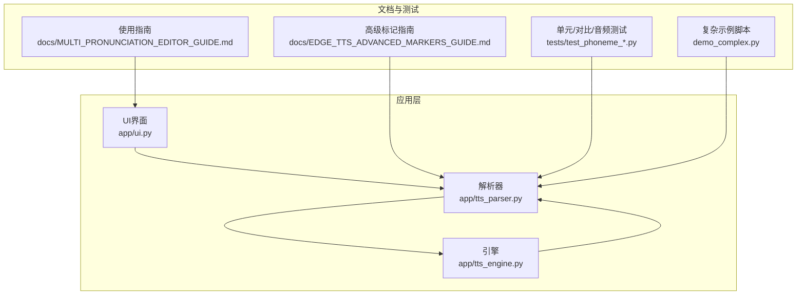
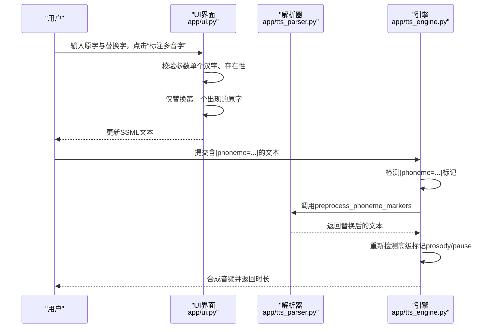
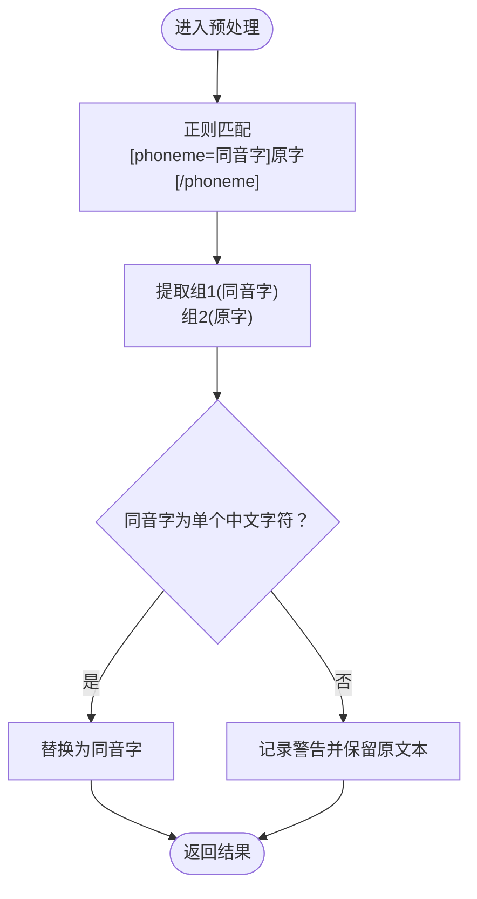
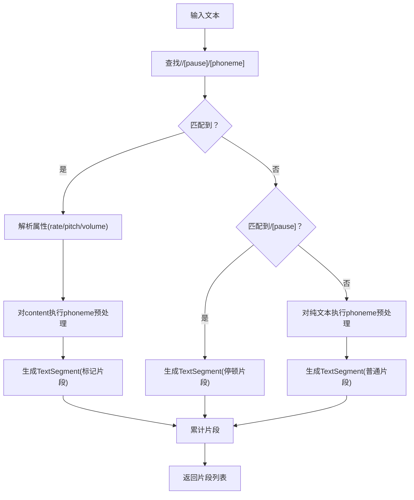
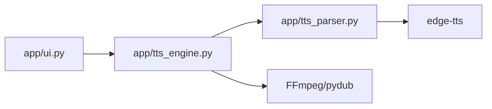

# Phomeme多音字替换

<cite>
**本文引用的文件**
- [tts_parser.py](file://app/tts_parser.py)
- [tts_engine.py](file://app/tts_engine.py)
- [ui.py](file://app/ui.py)
- [MULTI_PRONUNCIATION_EDITOR_GUIDE.md](file://docs/MULTI_PRONUNCIATION_EDITOR_GUIDE.md)
- [EDGE_TTS_ADVANCED_MARKERS_GUIDE.md](file://docs/EDGE_TTS_ADVANCED_MARKERS_GUIDE.md)
- [test_phoneme_simple.py](file://tests/test_phoneme_simple.py)
- [test_phoneme_verify.py](file://tests/test_phoneme_verify.py)
- [test_phoneme_strategies.py](file://tests/test_phoneme_strategies.py)
- [test_phoneme_comparison.py](file://tests/test_phoneme_comparison.py)
- [test_phoneme_audio.py](file://tests/test_phoneme_audio.py)
- [demo_complex.py](file://demo_complex.py)
</cite>

## 目录
1. [简介](#简介)
2. [项目结构](#项目结构)
3. [核心组件](#核心组件)
4. [架构总览](#架构总览)
5. [详细组件分析](#详细组件分析)
6. [依赖分析](#依赖分析)
7. [性能考虑](#性能考虑)
8. [故障排查指南](#故障排查指南)
9. [结论](#结论)
10. [附录](#附录)

## 简介
本文件系统性阐述TTS Studio中“phoneme多音字替换”标记的完整技术方案，围绕以下目标展开：
- 语法规范：[phoneme=同音字]原字[/phoneme]
- 参数约束：同音字参数必须是单个中文字符
- 预处理机制：正则匹配、组提取、替换逻辑
- 匹配规则与优先级：在解析流程中的处理顺序与影响
- 回退与错误处理：格式错误时的容错策略
- 实战示例：常用多音字如“行”“重”“乐”等的应用场景

## 项目结构
与phoneme多音字替换直接相关的模块与文件如下：
- 解析与预处理：app/tts_parser.py
- 引擎集成：app/tts_engine.py
- 前端标记生成与清理：app/ui.py
- 文档与用法参考：docs/MULTI_PRONUNCIATION_EDITOR_GUIDE.md、docs/EDGE_TTS_ADVANCED_MARKERS_GUIDE.md
- 测试与示例：tests/test_phoneme_*.py、demo_complex.py



图表来源
- [tts_parser.py:1-220](file://app/tts_parser.py#L1-L220)
- [tts_engine.py:120-218](file://app/tts_engine.py#L120-L218)
- [ui.py:1700-1858](file://app/ui.py#L1700-L1858)

章节来源
- [tts_parser.py:1-220](file://app/tts_parser.py#L1-L220)
- [tts_engine.py:120-218](file://app/tts_engine.py#L120-L218)
- [ui.py:1700-1858](file://app/ui.py#L1700-L1858)

## 核心组件
- 预处理函数：preprocess_phoneme_markers
  - 功能：将[phoneme=同音字]原字[/phoneme]替换为“同音字”
  - 正则：r'\[phoneme=([^\]]+)\](.*?)\[/phoneme\]'
  - 参数校验：同音字必须是单个中文字符（Unicode范围）
  - 行为：格式正确则替换，否则回退保留原文本
- 解析器：parse_prosody_text
  - 功能：解析包含<prosody>、<pause>、[pause]与[phoneme]的文本，拆分为片段
  - prosody内部：先对content执行phoneme预处理
  - 文本片段：默认参数rate/pitch/volume为“无标记”
- 引擎：synthesize_single_line
  - 功能：在检测到[phoneme=...]时，先预处理替换，再进行后续合成
  - 顺序：phoneme预处理 → 标记检测 → 分片/拼接
- UI：add_phoneme_marker
  - 功能：在SSML文本中插入[phoneme=同音字]原字[/phoneme]，仅替换第一个出现的字符
  - 校验：原字与替换字必须是单个汉字，且原字存在于文本中

章节来源
- [tts_parser.py:39-66](file://app/tts_parser.py#L39-L66)
- [tts_parser.py:69-182](file://app/tts_parser.py#L69-L182)
- [tts_engine.py:172-193](file://app/tts_engine.py#L172-L193)
- [ui.py:1703-1718](file://app/ui.py#L1703-L1718)

## 架构总览
phoneme多音字替换在系统中的工作流如下：



图表来源
- [ui.py:1703-1718](file://app/ui.py#L1703-L1718)
- [tts_engine.py:172-193](file://app/tts_engine.py#L172-L193)
- [tts_parser.py:39-66](file://app/tts_parser.py#L39-L66)

## 详细组件分析

### 1) 语法与参数约束
- 语法：[phoneme=同音字]原字[/phoneme]
- 参数要求：
  - 同音字：必须是单个中文字符（Unicode范围）
  - 原字：可为任意字符序列（但通常为多音字本身）
- 作用域：在prosody内部替换为“同音字”，不参与分片

章节来源
- [tts_parser.py:43-48](file://app/tts_parser.py#L43-L48)
- [tts_parser.py:57-63](file://app/tts_parser.py#L57-L63)
- [MULTI_PRONUNCIATION_EDITOR_GUIDE.md:196-202](file://docs/MULTI_PRONUNCIATION_EDITOR_GUIDE.md#L196-L202)

### 2) 预处理实现机制
- 正则匹配
  - 模式：r'\[phoneme=([^\]]+)\](.*?)\[/phoneme\]'
  - 组1(group(1))：同音字
  - 组2(group(2))：原字
- 组提取与替换
  - 若同音字长度≥1且属于中文字符范围，则替换为同音字
  - 否则记录警告并保留原文本
- flags：re.DOTALL，确保跨行匹配



图表来源
- [tts_parser.py:49-66](file://app/tts_parser.py#L49-L66)

章节来源
- [tts_parser.py:39-66](file://app/tts_parser.py#L39-L66)

### 3) 解析与分片流程
- prosody标签内：先对content执行phoneme预处理，再按prosody拆分
- 纯文本段：同样先执行phoneme预处理
- prosody外：[pause=...]与<pause=...]均作为独立停顿片段
- 无标记文本：作为一个片段（默认参数）



图表来源
- [tts_parser.py:69-182](file://app/tts_parser.py#L69-L182)

章节来源
- [tts_parser.py:69-182](file://app/tts_parser.py#L69-L182)

### 4) 引擎集成与优先级
- 检测顺序：
  1) 检测[phoneme=...] → 预处理替换
  2) 重新检测高级标记（<prosody|<pause=|[pause=）
  3) 根据是否有高级标记决定是否走“自动拆分+拼接”流程
- 重要约定：
  - prosody内部的[phoneme]替换不参与分片
  - prosody外的[phoneme]会被解析器识别为普通文本片段

```mermaid
sequenceDiagram
participant Eng as "引擎"
participant Par as "解析器"
Eng->>Eng : 检测[phoneme=...]
Eng->>Par : preprocess_phoneme_markers(text)
Par-->>Eng : 返回替换后的text'
Eng->>Eng : 重新检测高级标记
Eng-->>Eng : 决策是否分片/拼接
```

图表来源
- [tts_engine.py:172-193](file://app/tts_engine.py#L172-L193)
- [tts_parser.py:39-66](file://app/tts_parser.py#L39-L66)

章节来源
- [tts_engine.py:172-193](file://app/tts_engine.py#L172-L193)

### 5) 前端标记生成与清理
- 生成：add_phoneme_marker
  - 校验：原字与替换字均为单个汉字，且原字存在于文本
  - 仅替换第一个出现的原字
- 清理：clear_all_markers
  - 移除<prosody>标签（保留内容）
  - 移除<pause>标记
  - 移除[phoneme=...]标记（保留原字）

章节来源
- [ui.py:1703-1718](file://app/ui.py#L1703-L1718)
- [ui.py:1803-1818](file://app/ui.py#L1803-L1818)

### 6) 常用多音字实战示例
- “行”字
  - 银行：hang2 → [phoneme=航]行[/phoneme]
  - 行走：xing2 → [phoneme=形]行[/phoneme]
- “重”字
  - 重要：zhong4 → [phoneme=仲]重[/phoneme]
  - 重复：chong2 → [phoneme=虫]重[/phoneme]
- “乐”字
  - 快乐：le5 → [phoneme=勒]乐[/phoneme]
  - 音乐：yue4 → [phoneme=月]乐[/phoneme]
- 更多示例参见测试与演示脚本

章节来源
- [test_phoneme_simple.py:18-47](file://tests/test_phoneme_simple.py#L18-L47)
- [test_phoneme_strategies.py:118-139](file://tests/test_phoneme_strategies.py#L118-L139)
- [MULTI_PRONUNCIATION_EDITOR_GUIDE.md:121-129](file://docs/MULTI_PRONUNCIATION_EDITOR_GUIDE.md#L121-L129)

### 7) 匹配规则与优先级
- prosody内部：[phoneme]替换优先于prosody分片
- prosody外部：[phoneme]被视为普通文本片段，不参与内部分片
- prosody外的<pause>与[pause]独立为停顿片段
- 无标记文本：作为一个片段（默认参数）

章节来源
- [tts_parser.py:133-151](file://app/tts_parser.py#L133-L151)
- [tts_parser.py:155-175](file://app/tts_parser.py#L155-L175)

### 8) 回退与错误处理策略
- 格式错误回退：当同音字非单个中文字符时，记录警告并保留原文本
- UI层校验：前端在生成标记时强制要求单字符与存在性
- 引擎层检测：若检测到[phoneme=...]，先预处理再继续流程

章节来源
- [tts_parser.py:57-63](file://app/tts_parser.py#L57-L63)
- [ui.py:1708-1713](file://app/ui.py#L1708-L1713)
- [tts_engine.py:177-192](file://app/tts_engine.py#L177-L192)

## 依赖分析
- 模块耦合
  - tts_engine依赖tts_parser的预处理函数
  - ui依赖tts_engine进行试听与合成
  - 文档与测试为实现提供行为约束与验证依据
- 外部依赖
  - edge-tts：底层TTS引擎
  - pydub/FFmpeg：音频拼接与静音生成



图表来源
- [tts_engine.py:120-218](file://app/tts_engine.py#L120-L218)
- [tts_parser.py:39-66](file://app/tts_parser.py#L39-L66)

章节来源
- [tts_engine.py:120-218](file://app/tts_engine.py#L120-L218)
- [tts_parser.py:39-66](file://app/tts_parser.py#L39-L66)

## 性能考虑
- 正则匹配：单次遍历，复杂度O(n)，n为文本长度
- 预处理：对每个匹配项执行一次替换，整体线性
- prosody解析：按标签边界扫描，线性复杂度
- 建议：
  - 避免在超长文本中滥用[phoneme]标记
  - 合理使用prosody分片，减少不必要的片段数量

## 故障排查指南
- 症状：多音字未按预期读出
  - 检查同音字是否为单个中文字符
  - 确认[phoneme]标记是否位于正确位置（prosody内部或外部）
- 症状：标记被读出或残留
  - 确认解析器已执行preprocess_phoneme_markers
  - 使用“清除所有标记”功能验证
- 症状：UI报错“请指定待标注字和替换字”
  - 检查输入是否为单个汉字且原字存在于文本

章节来源
- [tts_parser.py:57-63](file://app/tts_parser.py#L57-L63)
- [ui.py:1708-1713](file://app/ui.py#L1708-L1713)
- [ui.py:1803-1818](file://app/ui.py#L1803-L1818)

## 结论
- 语法简洁明确：[phoneme=同音字]原字[/phoneme]
- 参数严格：同音字必须是单个中文字符
- 预处理高效：正则匹配+组提取+条件替换
- 流程清晰：引擎先预处理，再按高级标记分片/拼接
- 实战性强：覆盖常见多音字场景，易于上手与扩展

## 附录
- 常用多音字对照表（节选）
  - 行：hang2→航（银行），xing2→形（行动）
  - 长：chang2→常（长短），zhang3→掌（生长）
  - 重：zhong4→仲（重要），chong2→虫（重复）
  - 乐：le5→勒（快乐），yue4→月（音乐）
  - 好：hao3→郝（好坏），hao4→号（爱好）
  - 着：zhe5→这（看着），zhao2→找（着急）
- 相关测试与演示
  - 简化对比：test_phoneme_simple.py
  - 标记验证：test_phoneme_verify.py
  - 策略对比：test_phoneme_strategies.py
  - 实际音频：test_phoneme_audio.py
  - 复杂示例：demo_complex.py

章节来源
- [MULTI_PRONUNCIATION_EDITOR_GUIDE.md:121-129](file://docs/MULTI_PRONUNCIATION_EDITOR_GUIDE.md#L121-L129)
- [test_phoneme_simple.py:18-47](file://tests/test_phoneme_simple.py#L18-L47)
- [test_phoneme_strategies.py:118-139](file://tests/test_phoneme_strategies.py#L118-L139)
- [test_phoneme_audio.py:19-145](file://tests/test_phoneme_audio.py#L19-L145)
- [demo_complex.py:25-155](file://demo_complex.py#L25-L155)