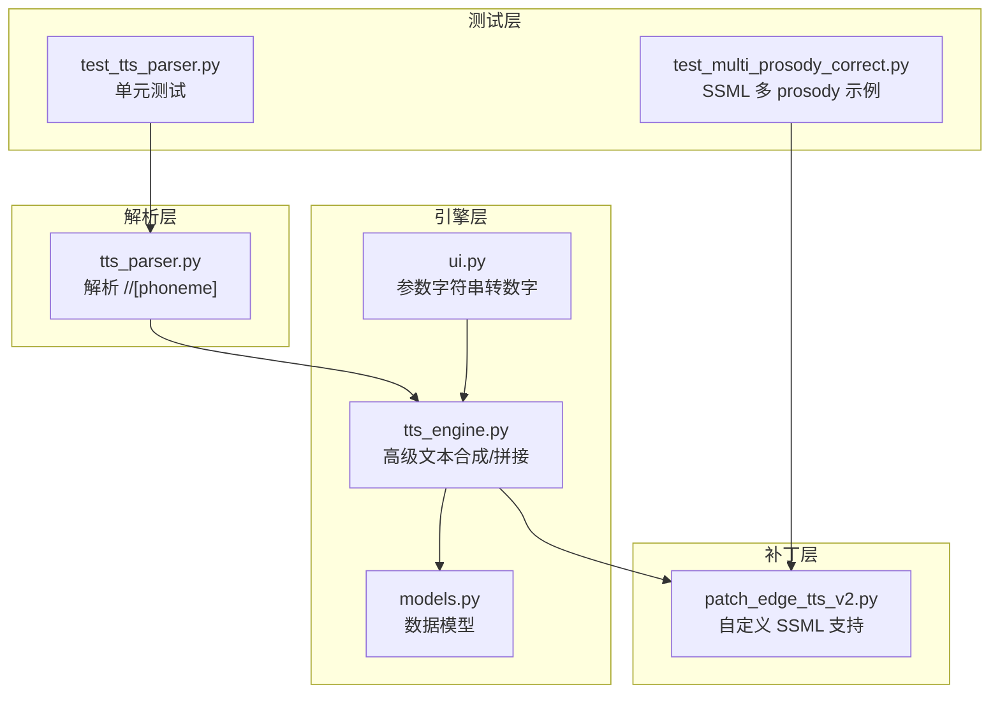
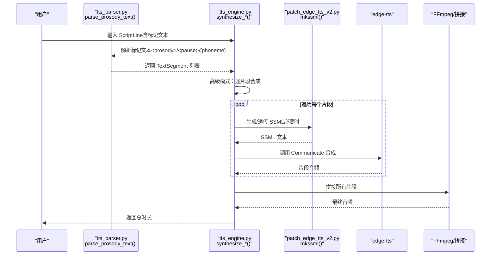
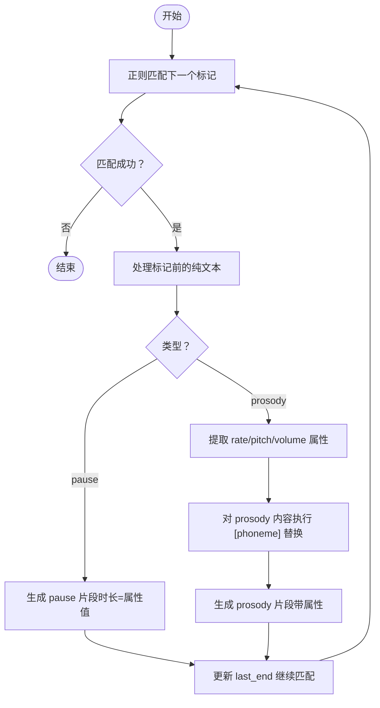
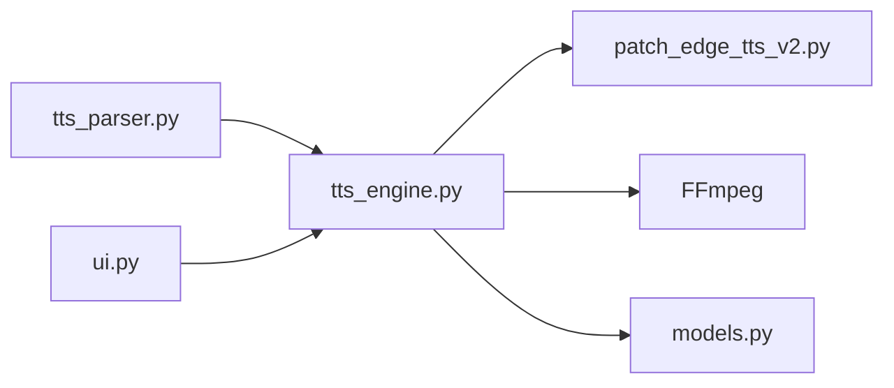

# Prosody标签

<cite>
**本文引用的文件**
- [tts_parser.py](file://app/tts_parser.py)
- [tts_engine.py](file://app/tts_engine.py)
- [patch_edge_tts_v2.py](file://app/patch_edge_tts_v2.py)
- [test_tts_parser.py](file://tests/test_tts_parser.py)
- [test_multi_prosody_correct.py](file://tests/test_multi_prosody_correct.py)
- [models.py](file://app/models.py)
- [ui.py](file://app/ui.py)
</cite>

## 目录
1. [简介](#简介)
2. [项目结构](#项目结构)
3. [核心组件](#核心组件)
4. [架构总览](#架构总览)
5. [详细组件分析](#详细组件分析)
6. [依赖分析](#依赖分析)
7. [性能考虑](#性能考虑)
8. [故障排查指南](#故障排查指南)
9. [结论](#结论)
10. [附录](#附录)

## 简介
本文件围绕 TTS Studio 中的 prosody 标签展开，系统化阐述其语法、属性含义与解析机制，覆盖以下主题：
- prosody 标签的基本语法结构与属性取值规范
- rate（语速）、pitch（音调）、volume（音量）的百分比与数值格式
- 标签解析的正则表达式实现、属性提取与默认值处理
- 与其他标记（pause、phoneme）的嵌套与优先级
- 实战示例与常见问题排查

## 项目结构
与 prosody 标签相关的核心模块与测试如下：
- 解析与合成流程：app/tts_parser.py、app/tts_engine.py
- 自定义 SSML 支持补丁：app/patch_edge_tts_v2.py
- 单元测试与示例：tests/test_tts_parser.py、tests/test_multi_prosody_correct.py
- 数据模型：app/models.py
- UI 层参数转换：app/ui.py

图表来源
- [tts_parser.py:69-182](file://app/tts_parser.py#L69-L182)
- [tts_engine.py:120-453](file://app/tts_engine.py#L120-L453)
- [patch_edge_tts_v2.py:15-117](file://app/patch_edge_tts_v2.py#L15-L117)
- [test_tts_parser.py:11-364](file://tests/test_tts_parser.py#L11-L364)
- [test_multi_prosody_correct.py:13-50](file://tests/test_multi_prosody_correct.py#L13-L50)
- [models.py:36-62](file://app/models.py#L36-L62)
- [ui.py:1574-1597](file://app/ui.py#L1574-L1597)

章节来源
- [tts_parser.py:1-220](file://app/tts_parser.py#L1-L220)
- [tts_engine.py:1-547](file://app/tts_engine.py#L1-L547)
- [patch_edge_tts_v2.py:1-117](file://app/patch_edge_tts_v2.py#L1-L117)
- [test_tts_parser.py:1-364](file://tests/test_tts_parser.py#L1-L364)
- [test_multi_prosody_correct.py:1-51](file://tests/test_multi_prosody_correct.py#L1-L51)
- [models.py:1-78](file://app/models.py#L1-L78)
- [ui.py:1574-1597](file://app/ui.py#L1574-L1597)

## 核心组件
- prosody 标签解析器：负责识别并拆分文本中的 <prosody>、<pause>、[pause] 与 [phoneme] 标记，生成 TextSegment 列表。
- 高级文本合成器：当检测到标记文本时，按片段分别调用 TTS 合成，并通过 FFmpeg 拼接。
- 自定义 SSML 补丁：允许直接传入完整 SSML 文档，绕开 edge-tts 的限制。
- 数据模型：ScriptLine、AudioClip 等承载 rate、pitch、volume 等参数。

章节来源
- [tts_parser.py:69-182](file://app/tts_parser.py#L69-L182)
- [tts_engine.py:321-453](file://app/tts_engine.py#L321-L453)
- [patch_edge_tts_v2.py:73-110](file://app/patch_edge_tts_v2.py#L73-L110)
- [models.py:36-62](file://app/models.py#L36-L62)

## 架构总览
下面的序列图展示了从输入文本到最终音频的端到端流程，重点体现 prosody 标签的解析与合成阶段。

图表来源
- [tts_engine.py:321-453](file://app/tts_engine.py#L321-L453)
- [tts_parser.py:69-182](file://app/tts_parser.py#L69-L182)
- [patch_edge_tts_v2.py:73-110](file://app/patch_edge_tts_v2.py#L73-L110)

## 详细组件分析

### 1) prosody 标签语法与属性
- 基本语法
  - <prosody rate="X" pitch="Y" volume="Z">文本内容</prosody>
- 属性取值
  - rate（语速）：支持百分比（如 "+20%"、"-10%"）与赫兹（如 "+500Hz"）两种格式；解析器默认值为 "+0%"
  - pitch（音调）：支持音分（如 "+10Hz"）与赫兹（如 "+500Hz"）；解析器默认值为 "+0Hz"
  - volume（音量）：支持数值（如 "1.2"）与百分比（如 "+0%"）；解析器默认值为 "+0%"
- 默认值策略：当属性缺失时，解析器使用默认值填充，确保每个片段都有明确的 rate/pitch/volume。

章节来源
- [tts_parser.py:69-144](file://app/tts_parser.py#L69-L144)
- [tts_parser.py:185-189](file://app/tts_parser.py#L185-L189)

### 2) 正则表达式解析机制
- 匹配目标
  - <prosody ...>...</prosody>
  - <pause=...>
  - [pause=...]
- 解析步骤
  - 使用正则迭代匹配，定位各标记边界
  - 记录上一个匹配结束位置，处理两标记之间的纯文本
  - 对 prosody 内容先执行 [phoneme] 替换，再提取属性
  - 对 pause 标记提取时长（毫秒），并标记为 pause 片段
- 属性提取
  - 通过子模式按属性名提取值，若缺失则使用默认值
- 默认值处理
  - TextSegment 的默认 rate/pitch/volume 分别为 "+0%"、"+0Hz"、"+0%"

图表来源
- [tts_parser.py:89-182](file://app/tts_parser.py#L89-L182)

章节来源
- [tts_parser.py:69-182](file://app/tts_parser.py#L69-L182)

### 3) 与 pause、phoneme 的嵌套与优先级
- pause 标记
  - 两种形式：<pause=1000> 与 [pause=1000]
  - 解析为独立的 pause 片段，时长由属性决定
- phoneme 标记
  - 形如 [phoneme=同音字]原字[/phoneme]
  - 在 prosody 内部先进行替换，再进入 TTS 合成
  - 仅替换内部文本，不计入“标记片段”
- 优先级与顺序
  - 解析按出现顺序依次处理，先处理 prosody 内部的 phoneme，再提取 prosody 属性
  - pause 片段与文本片段交替出现，保持原有顺序
  - 若同一 prosody 内同时存在 pause 与 phoneme，先执行 phoneme 替换，再按顺序插入 pause

章节来源
- [tts_parser.py:39-66](file://app/tts_parser.py#L39-L66)
- [tts_parser.py:112-144](file://app/tts_parser.py#L112-L144)
- [test_tts_parser.py:67-86](file://tests/test_tts_parser.py#L67-L86)
- [test_tts_parser.py:89-134](file://tests/test_tts_parser.py#L89-L134)

### 4) 与自定义 SSML 的关系
- 自定义 SSML 支持
  - 通过补丁直接透传完整 SSML 文档（以 <speak> 开头）
  - 补丁保留自定义 SSML，不进行 escape，避免 edge-tts 限制
- prosody 在自定义 SSML 中的使用
  - 可直接使用 <prosody pitch='...' rate='...' volume='...'>... </prosody>
  - 项目测试中演示了多段 prosody 的正确用法
- 与高级文本合成的协作
  - 当检测到标记文本时，引擎采用“拆分+拼接”策略；当检测到自定义 SSML 时，直接透传

章节来源
- [patch_edge_tts_v2.py:29-42](file://app/patch_edge_tts_v2.py#L29-L42)
- [patch_edge_tts_v2.py:89-93](file://app/patch_edge_tts_v2.py#L89-L93)
- [tts_engine.py:194-217](file://app/tts_engine.py#L194-L217)
- [test_multi_prosody_correct.py:18-47](file://tests/test_multi_prosody_correct.py#L18-L47)

### 5) 参数在 UI 与引擎中的转换
- UI 层将带单位的字符串（如 "10%"、"10Hz"）转换为纯数字，便于后续处理
- 引擎层在高级模式下，将每个 TextSegment 的 rate/pitch/volume 传入 TTS 合成

章节来源
- [ui.py:1574-1597](file://app/ui.py#L1574-L1597)
- [tts_engine.py:393-412](file://app/tts_engine.py#L393-L412)

## 依赖分析
- 解析层依赖
  - 正则表达式驱动的标记识别
  - phoneme 预处理函数
- 引擎层依赖
  - 解析层输出的 TextSegment 列表
  - 自定义 SSML 补丁（可选）
  - FFmpeg 用于生成静音片段与拼接
- 数据模型依赖
  - ScriptLine/AudioClip 等承载 rate/pitch/volume

图表来源
- [tts_parser.py:69-182](file://app/tts_parser.py#L69-L182)
- [tts_engine.py:321-453](file://app/tts_engine.py#L321-L453)
- [patch_edge_tts_v2.py:15-117](file://app/patch_edge_tts_v2.py#L15-L117)
- [models.py:36-62](file://app/models.py#L36-L62)
- [ui.py:1574-1597](file://app/ui.py#L1574-L1597)

章节来源
- [tts_parser.py:69-182](file://app/tts_parser.py#L69-L182)
- [tts_engine.py:321-453](file://app/tts_engine.py#L321-L453)
- [patch_edge_tts_v2.py:15-117](file://app/patch_edge_tts_v2.py#L15-L117)
- [models.py:36-62](file://app/models.py#L36-L62)
- [ui.py:1574-1597](file://app/ui.py#L1574-L1597)

## 性能考虑
- 拆分+拼接策略
  - 每个片段独立合成，便于参数差异化，但会增加 TTS 调用次数与拼接开销
  - 建议合理划分片段，避免过多短片段导致拼接耗时
- 静音生成
  - pause 片段通过 FFmpeg 生成静音，避免额外 TTS 请求
- 代理与重试
  - 引擎内置重试与代理支持，提升网络不稳定时的稳定性

[本节为通用建议，不涉及特定文件分析]

## 故障排查指南
- 常见问题
  - prosody 属性格式错误：确认使用正确的单位（百分比、音分/赫兹、数值）
  - pause 时长非数字：确保属性值为整数（毫秒）
  - 标签未闭合：检查 <prosody>/<pause>/[phoneme] 的闭合
  - 自定义 SSML 未生效：确认文本以 <speak> 开头，且补丁已加载
- 定位手段
  - 查看解析器日志：解析为多少片段、各片段的 rate/pitch/volume
  - 单元测试参考：使用测试用例验证解析行为
  - 自定义 SSML 测试：验证多段 prosody 的正确性

章节来源
- [tts_parser.py:177-181](file://app/tts_parser.py#L177-L181)
- [test_tts_parser.py:43-86](file://tests/test_tts_parser.py#L43-L86)
- [test_multi_prosody_correct.py:18-47](file://tests/test_multi_prosody_correct.py#L18-L47)

## 结论
- prosody 标签提供了灵活的语速、音调与音量控制能力，配合 pause 与 phoneme 可实现丰富的语音表现
- 解析器以正则为核心，具备良好的扩展性与兼容性
- 引擎层通过“拆分+拼接”策略与自定义 SSML 补丁，兼顾易用性与功能完整性
- 建议在实际使用中遵循统一的属性格式与嵌套顺序，结合测试用例验证效果

[本节为总结性内容，不涉及特定文件分析]

## 附录

### A. 语法与属性取值速查
- prosody 语法
  - <prosody rate="X" pitch="Y" volume="Z">文本内容</prosody>
- rate（语速）
  - 百分比：如 "+20%"、"-10%"
  - 数值（赫兹）：如 "+500Hz"
  - 默认值："+0%"
- pitch（音调）
  - 音分/赫兹：如 "+10Hz"
  - 默认值："+0Hz"
- volume（音量）
  - 数值：如 "1.2"
  - 百分比：如 "+0%"
  - 默认值："+0%"

章节来源
- [tts_parser.py:69-144](file://app/tts_parser.py#L69-L144)

### B. 嵌套与优先级规则
- prosody 内部先执行 phoneme 替换，再提取属性
- pause 片段与文本片段交替出现，保持原有顺序
- 多个 prosody 标签可串联，形成多片段合成与拼接

章节来源
- [tts_parser.py:133-144](file://app/tts_parser.py#L133-L144)
- [test_tts_parser.py:113-161](file://tests/test_tts_parser.py#L113-L161)

### C. 代码示例路径（不展示具体代码）
- 单个 prosody 标签示例
  - [示例路径:48-64](file://tests/test_tts_parser.py#L48-L64)
- prosody 内部 phoneme 替换示例
  - [示例路径:72-86](file://tests/test_tts_parser.py#L72-L86)
- pause 标记示例
  - [示例路径:94-110](file://tests/test_tts_parser.py#L94-L110)
- prosody 与 pause 混合示例
  - [示例路径:118-134](file://tests/test_tts_parser.py#L118-L134)
- 自定义 SSML 多段 prosody 示例
  - [示例路径:18-47](file://tests/test_multi_prosody_correct.py#L18-L47)