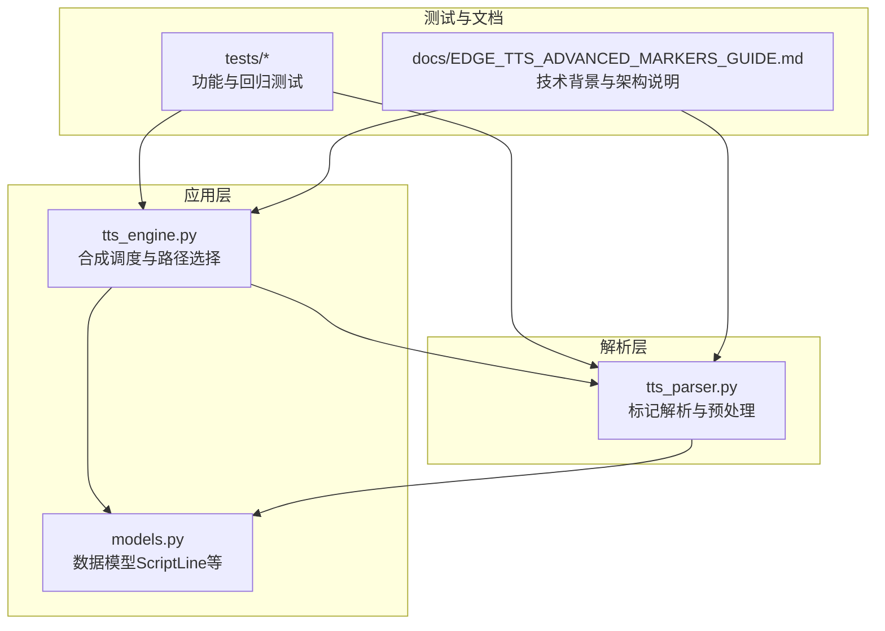
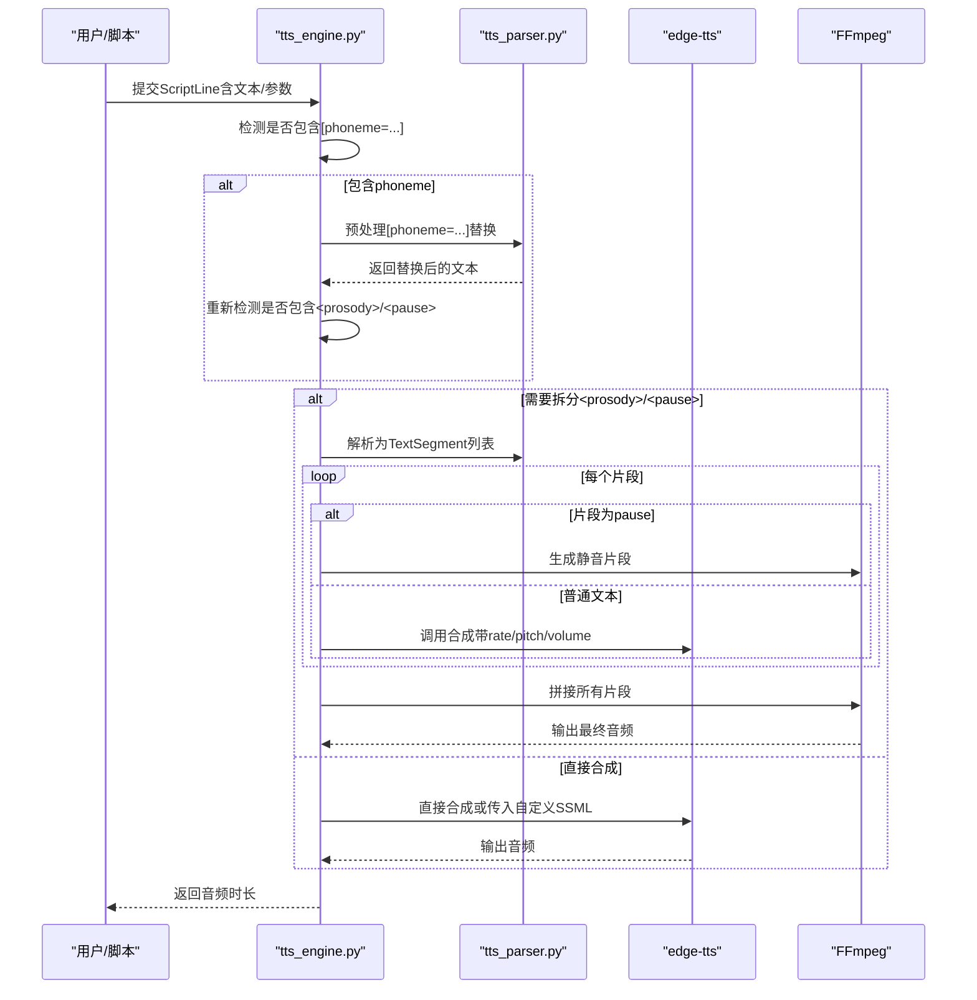
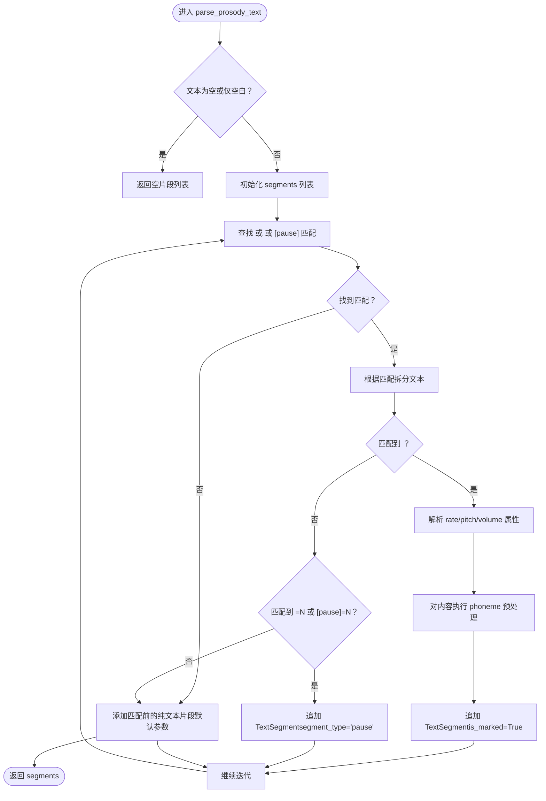
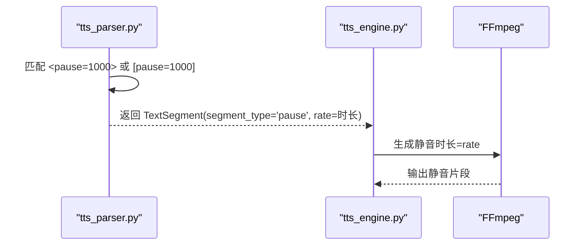
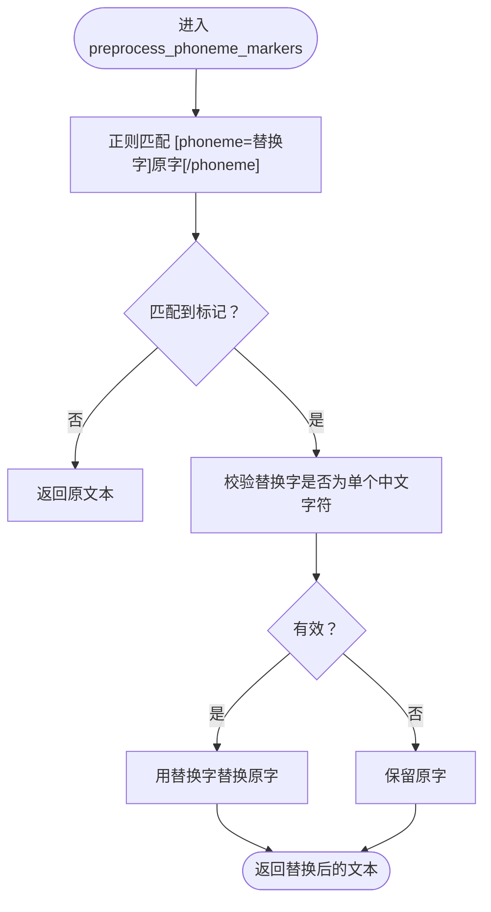
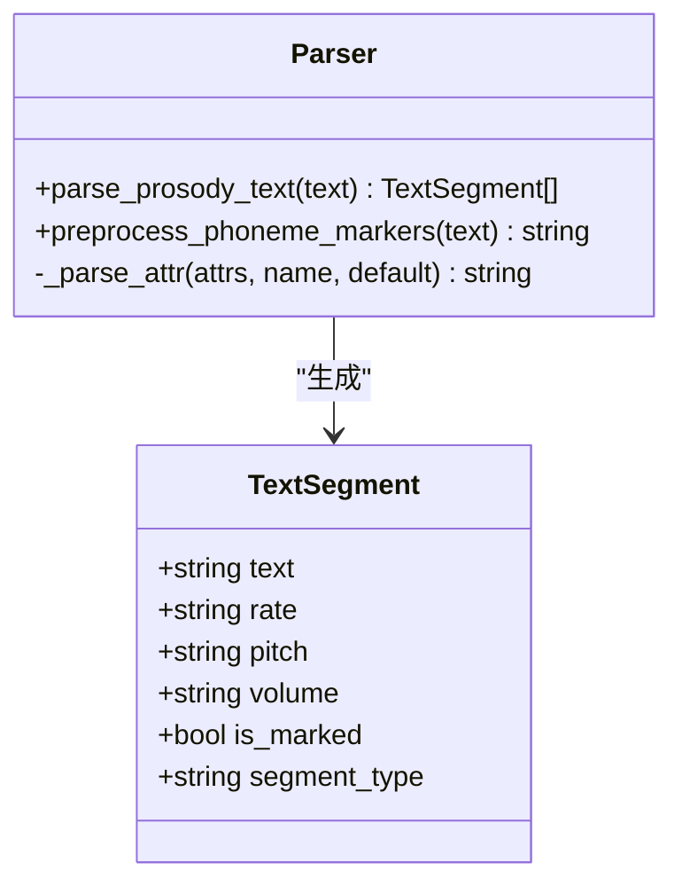
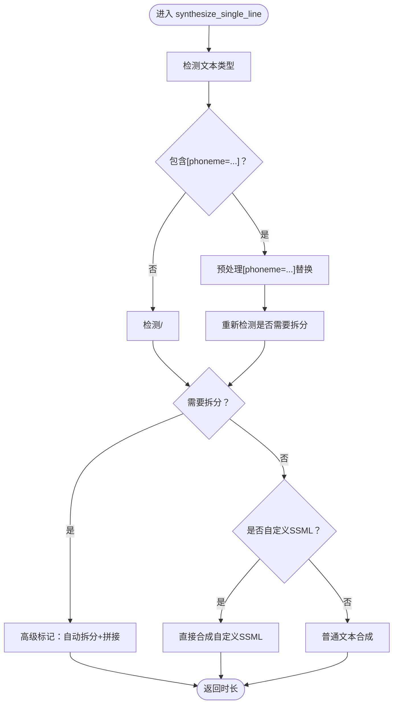
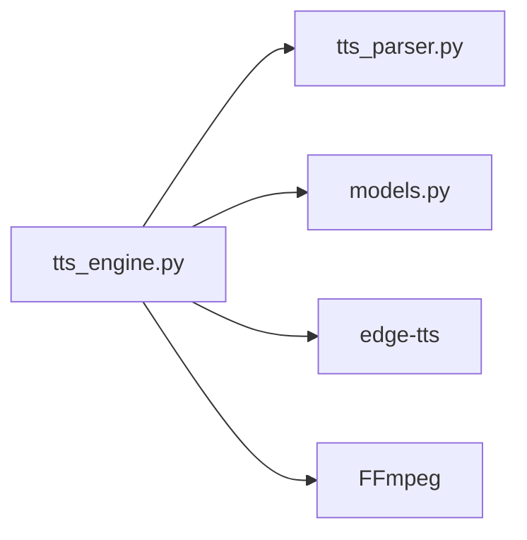

# SSML标记语法

<cite>
**本文引用的文件**
- [tts_parser.py](file://app/tts_parser.py)
- [tts_engine.py](file://app/tts_engine.py)
- [models.py](file://app/models.py)
- [test_tts_parser.py](file://tests/test_tts_parser.py)
- [test_advanced_ssml.py](file://tests/test_advanced_ssml.py)
- [test_ssml.py](file://tests/test_ssml.py)
- [test_phoneme_simple.py](file://tests/test_phoneme_simple.py)
- [test_phoneme_verify.py](file://tests/test_phoneme_verify.py)
- [test_pause_debug.py](file://tests/test_pause_debug.py)
- [EDGE_TTS_ADVANCED_MARKERS_GUIDE.md](file://docs/EDGE_TTS_ADVANCED_MARKERS_GUIDE.md)
</cite>

## 目录
1. [简介](#简介)
2. [项目结构](#项目结构)
3. [核心组件](#核心组件)
4. [架构总览](#架构总览)
5. [详细组件分析](#详细组件分析)
6. [依赖分析](#依赖分析)
7. [性能考虑](#性能考虑)
8. [故障排查指南](#故障排查指南)
9. [结论](#结论)
10. [附录](#附录)

## 简介
本文件面向TTS Studio的SSML标记语法，系统化阐述以下内容：
- prosody标签的使用方法，包括rate（语速）、pitch（音调）、volume（音量）属性的设置与取值范围
- pause停顿标记的两种格式（<pause=1000>与[pause=1000]）及其应用场景
- phoneme多音字替换标记的语法结构[phoneme=同音字]原字[/phoneme]，包括匹配规则、验证机制与替换逻辑
- 标记解析的内部实现机制与处理流程
- 标记语法的最佳实践与常见错误处理方法

## 项目结构
围绕SSML标记语法，本项目的关键文件与职责如下：
- app/tts_parser.py：负责解析SSML标记，拆分为TextSegment片段，并执行phoneme预处理
- app/tts_engine.py：根据输入文本类型选择合成路径（自定义SSML、高级标记、普通文本），并在需要时进行自动拆分与拼接
- app/models.py：定义ScriptLine等数据模型，承载用于TTS合成的文本与参数
- tests/*：提供大量端到端与单元测试，覆盖prosody、pause、phoneme等标记的解析与合成行为
- docs/EDGE_TTS_ADVANCED_MARKERS_GUIDE.md：提供Monkey Patch实现、切片处理架构与多音字策略等技术背景

**图表来源**
- [tts_engine.py:1-547](file://app/tts_engine.py#L1-L547)
- [tts_parser.py:1-220](file://app/tts_parser.py#L1-L220)
- [models.py:1-78](file://app/models.py#L1-L78)
- [test_tts_parser.py:1-364](file://tests/test_tts_parser.py#L1-L364)
- [EDGE_TTS_ADVANCED_MARKERS_GUIDE.md:1-1175](file://docs/EDGE_TTS_ADVANCED_MARKERS_GUIDE.md#L1-L1175)

**章节来源**
- [tts_engine.py:1-547](file://app/tts_engine.py#L1-L547)
- [tts_parser.py:1-220](file://app/tts_parser.py#L1-L220)
- [models.py:1-78](file://app/models.py#L1-L78)
- [test_tts_parser.py:1-364](file://tests/test_tts_parser.py#L1-L364)
- [EDGE_TTS_ADVANCED_MARKERS_GUIDE.md:1-1175](file://docs/EDGE_TTS_ADVANCED_MARKERS_GUIDE.md#L1-L1175)

## 核心组件
- TextSegment：表示一个可合成的文本片段，包含text、rate、pitch、volume、is_marked、segment_type等字段
- parse_prosody_text：解析包含<prosody>、<pause>与[phoneme]的文本，拆分为多个TextSegment
- preprocess_phoneme_markers：在prosody内部或纯文本中，将[phoneme=同音字]原字[/phoneme]替换为同音字
- synthesize_single_line：根据输入文本类型选择路径（自定义SSML、高级标记、普通文本），并在必要时进行自动拆分与拼接

**章节来源**
- [tts_parser.py:23-32](file://app/tts_parser.py#L23-L32)
- [tts_parser.py:69-182](file://app/tts_parser.py#L69-L182)
- [tts_parser.py:39-66](file://app/tts_parser.py#L39-L66)
- [tts_engine.py:120-218](file://app/tts_engine.py#L120-L218)

## 架构总览
SSML标记的处理流程如下：
- 输入文本被检测是否包含标记
- 若包含[phoneme=...]，先进行预处理替换，再判断是否需要按<prosody>/<pause>拆分
- 若需要拆分，则逐片段调用edge-tts合成，使用FFmpeg拼接；否则直接合成或传入自定义SSML

**图表来源**
- [tts_engine.py:167-218](file://app/tts_engine.py#L167-L218)
- [tts_engine.py:321-453](file://app/tts_engine.py#L321-L453)
- [tts_parser.py:69-182](file://app/tts_parser.py#L69-L182)

## 详细组件分析

### prosody标签与属性
- 语法：`<prosody rate="X" pitch="Y" volume="Z">内容</prosody>`
- 属性说明：
  - rate：语速，支持百分比（如"-20%"、"+40%"），以及绝对Hz值（如"+10Hz"）
  - pitch：音调，支持相对Hz（如"+10Hz"、"-5Hz"）
  - volume：音量，支持数值（如"1.2"）
- 解析规则：
  - 从prosody标签中提取属性，若缺失则使用默认值
  - prosody内部的[phoneme]标记会在解析时被预处理替换
  - prosody前后的纯文本也会作为独立片段，使用默认参数

**图表来源**
- [tts_parser.py:69-182](file://app/tts_parser.py#L69-L182)

**章节来源**
- [tts_parser.py:69-182](file://app/tts_parser.py#L69-L182)
- [test_tts_parser.py:43-86](file://tests/test_tts_parser.py#L43-L86)

### pause停顿标记
- 两种格式：
  - `<pause=1000>`：XML风格
  - `[pause=1000]`：方括号风格
- 作用：在合成序列中插入固定时长的静音片段
- 解析与处理：
  - 解析器将pause标记识别为独立片段，segment_type设为"pause"
  - rate字段存储停顿时长（毫秒）
  - 合成阶段由tts_engine使用FFmpeg生成对应时长的静音文件

**图表来源**
- [tts_parser.py:112-132](file://app/tts_parser.py#L112-L132)
- [tts_engine.py:372-390](file://app/tts_engine.py#L372-L390)

**章节来源**
- [tts_parser.py:112-132](file://app/tts_parser.py#L112-L132)
- [tts_engine.py:372-390](file://app/tts_engine.py#L372-L390)
- [test_tts_parser.py:89-111](file://tests/test_tts_parser.py#L89-L111)

### phoneme多音字替换标记
- 语法：`[phoneme=同音字]原字[/phoneme]`
- 匹配规则：
  - 使用正则匹配形如`[phoneme=...]...[/phoneme]`的标记
  - group(1)为替换字，group(2)为原字
- 验证机制：
  - 仅当替换字为单个中文字符（Unicode范围）时才执行替换
  - 否则保留原文本，避免错误替换
- 替换逻辑：
  - 在prosody标签内部或纯文本中，预处理阶段将原字替换为同音字
  - 替换后的文本作为整体传给edge-tts，确保连贯性
- 应用场景：
  - 精确控制多音字读音（如“行”、“长”、“重”等）
  - 与prosody结合，实现“特定字的语速/音调”控制

**图表来源**
- [tts_parser.py:39-66](file://app/tts_parser.py#L39-L66)

**章节来源**
- [tts_parser.py:39-66](file://app/tts_parser.py#L39-L66)
- [test_phoneme_simple.py:14-51](file://tests/test_phoneme_simple.py#L14-L51)
- [test_phoneme_verify.py:14-34](file://tests/test_phoneme_verify.py#L14-L34)

### 标记解析与处理流程（代码级）
- 解析入口：parse_prosody_text
- 关键步骤：
  - 正则匹配<prosody>/<pause>/[pause]
  - 对prosody内容执行phoneme预处理
  - 对pause标记生成pause片段
  - 对纯文本片段使用默认参数
- 输出：TextSegment列表，供合成阶段使用

**图表来源**
- [tts_parser.py:23-32](file://app/tts_parser.py#L23-L32)
- [tts_parser.py:69-182](file://app/tts_parser.py#L69-L182)
- [tts_parser.py:39-66](file://app/tts_parser.py#L39-L66)

**章节来源**
- [tts_parser.py:69-182](file://app/tts_parser.py#L69-L182)
- [tts_parser.py:39-66](file://app/tts_parser.py#L39-L66)

### 合成路径与集成
- 路径选择：
  - 若包含[phoneme=...]，先预处理替换，再检测是否包含<prosody>/<pause>
  - 若包含<prosody>/<pause>，进入“高级标记”路径：自动拆分+拼接
  - 若为自定义SSML（以<speak开头），直接传给edge-tts
  - 否则按普通文本合成
- 高级标记路径：
  - 对每个片段分别调用edge-tts合成
  - pause片段使用FFmpeg生成静音
  - 使用FFmpeg拼接所有片段

**图表来源**
- [tts_engine.py:167-218](file://app/tts_engine.py#L167-L218)
- [tts_engine.py:321-453](file://app/tts_engine.py#L321-L453)

**章节来源**
- [tts_engine.py:167-218](file://app/tts_engine.py#L167-L218)
- [tts_engine.py:321-453](file://app/tts_engine.py#L321-L453)

## 依赖分析
- tts_engine依赖tts_parser提供的解析与预处理能力
- tts_engine依赖edge-tts进行文本合成，依赖FFmpeg进行静音生成与音频拼接
- models提供ScriptLine等数据模型，承载用于TTS合成的文本与参数

**图表来源**
- [tts_engine.py:13-15](file://app/tts_engine.py#L13-L15)
- [tts_parser.py:16-18](file://app/tts_parser.py#L16-L18)
- [models.py:48-61](file://app/models.py#L48-L61)

**章节来源**
- [tts_engine.py:13-15](file://app/tts_engine.py#L13-L15)
- [tts_parser.py:16-18](file://app/tts_parser.py#L16-L18)
- [models.py:48-61](file://app/models.py#L48-L61)

## 性能考虑
- 切片代价：每个片段均需一次edge-tts请求，N个片段耗时约为N×T（T为单次合成时间）
- 网络开销：多次HTTP请求带来额外开销
- 拼接损耗：FFmpeg拼接可能产生轻微不自然，但已通过淡入淡出缓解
- 优化建议：
  - 合理合并相近参数的片段，减少拆分数量
  - 控制pause时长，避免过多静音片段
  - 使用代理或合适的网络环境，减少超时与重试

[本节为通用性能讨论，不直接分析具体文件]

## 故障排查指南
- 常见问题与定位：
  - 403错误：通常为网络连接问题，检查代理设置或网络可达性
  - 重试机制：合成失败会按指数回退重试，最多重试指定次数
  - 标记未生效：确认是否正确使用<prosody>/<pause>或[phoneme=...]，并确保文本被识别为需要拆分
- 日志与调试：
  - 解析器与引擎均输出详细日志，便于定位问题
  - 测试用例提供多种边界场景，可参考其断言与预期行为

**章节来源**
- [tts_engine.py:292-318](file://app/tts_engine.py#L292-L318)
- [test_pause_debug.py:1-26](file://tests/test_pause_debug.py#L1-L26)

## 结论
TTS Studio通过解析层与合成层的协同，实现了对SSML标记的灵活支持：
- prosody标签提供语速、音调、音量的细粒度控制
- pause停顿标记支持两种格式，满足不同场景需求
- phoneme多音字替换通过预处理实现，保证替换字的准确性与连贯性
- 自动拆分与拼接机制弥补了edge-tts在多片段控制上的不足，为复杂表达提供了可能

[本节为总结性内容，不直接分析具体文件]

## 附录

### 标记语法速查
- prosody标签
  - 语法：<prosody rate="X" pitch="Y" volume="Z">内容</prosody>
  - 属性：
    - rate：语速，支持百分比（如"-20%"、"+40%"）与绝对Hz（如"+10Hz"）
    - pitch：音调，支持相对Hz（如"+10Hz"、"-5Hz"）
    - volume：音量，支持数值（如"1.2"）
- pause停顿标记
  - 语法：<pause=1000> 或 [pause=1000]
  - 作用：插入固定时长的静音片段（单位：毫秒）
- phoneme多音字替换
  - 语法：[phoneme=同音字]原字[/phoneme]
  - 规则：仅当替换字为单个中文字符时才替换，否则保留原字

**章节来源**
- [tts_parser.py:6-8](file://app/tts_parser.py#L6-L8)
- [tts_parser.py:138-140](file://app/tts_parser.py#L138-L140)
- [tts_parser.py:39-66](file://app/tts_parser.py#L39-L66)

### 示例与组合用法
- 单个prosody：包含rate/pitch/volume属性，内容可包含phoneme
- prosody与pause混合：在同一句中实现语气变化与停顿
- 复杂真实场景：phoneme、pause、prosody组合，体现多音字与语气变化的协同

**章节来源**
- [test_tts_parser.py:43-86](file://tests/test_tts_parser.py#L43-L86)
- [test_tts_parser.py:113-134](file://tests/test_tts_parser.py#L113-L134)
- [test_tts_parser.py:206-247](file://tests/test_tts_parser.py#L206-L247)

### 技术背景与实现要点
- Monkey Patch：通过替换edge-tts内部方法，使其支持自定义SSML
- 切片处理：将复杂文本拆分为多个片段，分别合成后拼接
- 多音字策略：采用“同音字替换”，避免edge-tts对拼音的不兼容

**章节来源**
- [EDGE_TTS_ADVANCED_MARKERS_GUIDE.md:139-280](file://docs/EDGE_TTS_ADVANCED_MARKERS_GUIDE.md#L139-L280)
- [EDGE_TTS_ADVANCED_MARKERS_GUIDE.md:687-773](file://docs/EDGE_TTS_ADVANCED_MARKERS_GUIDE.md#L687-L773)