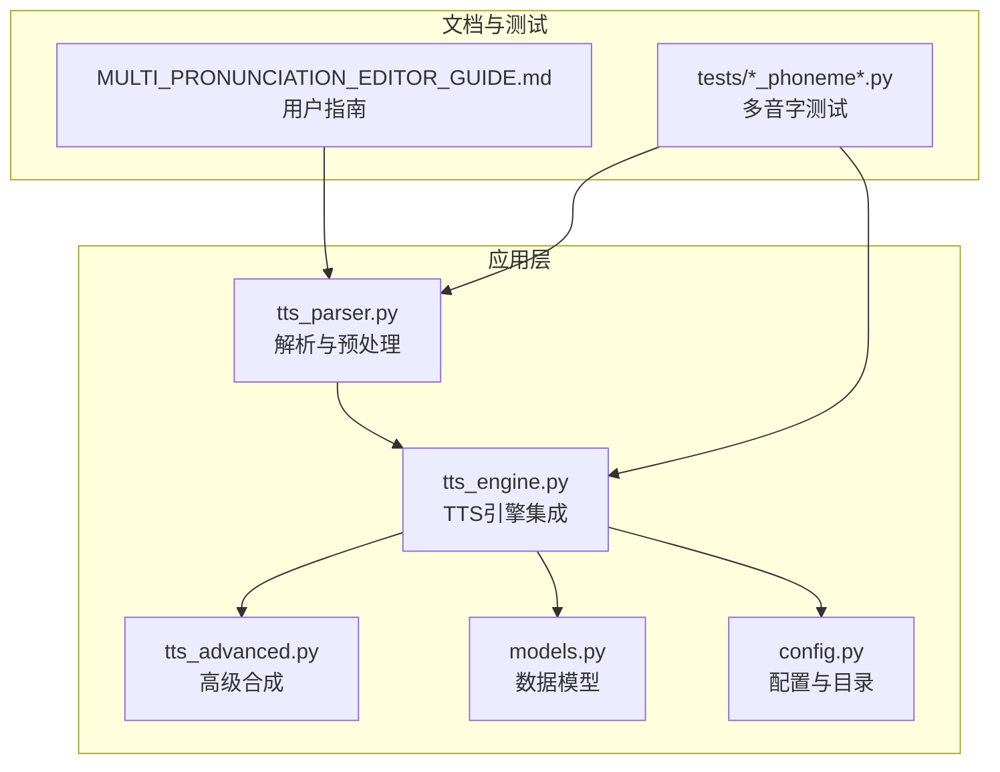
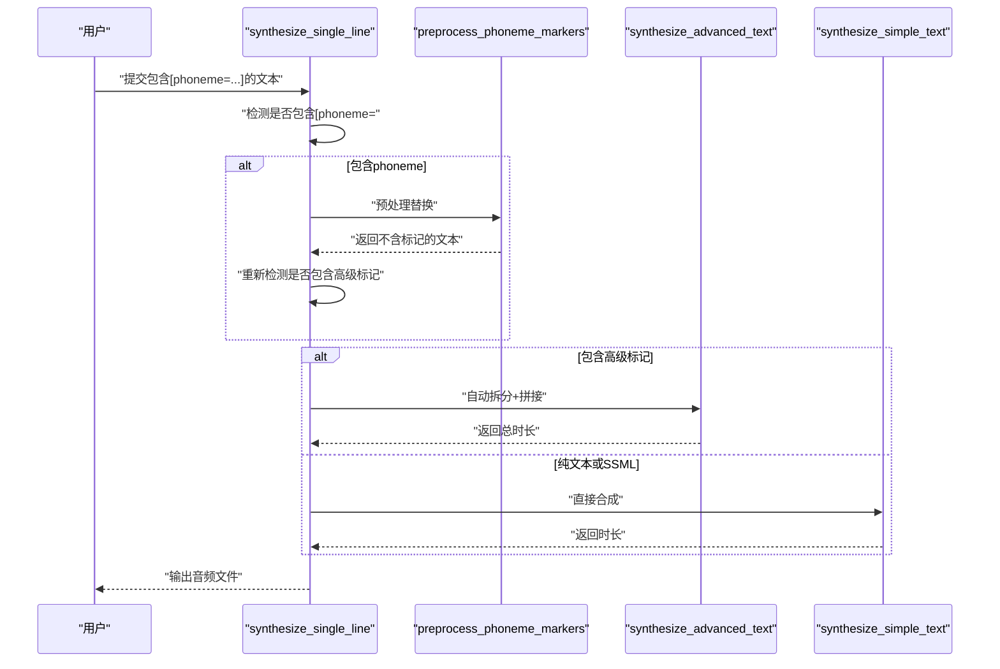
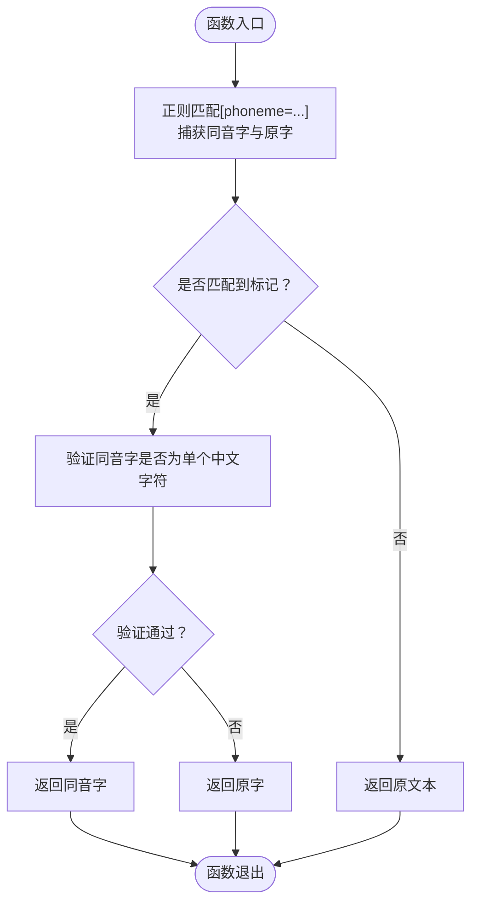
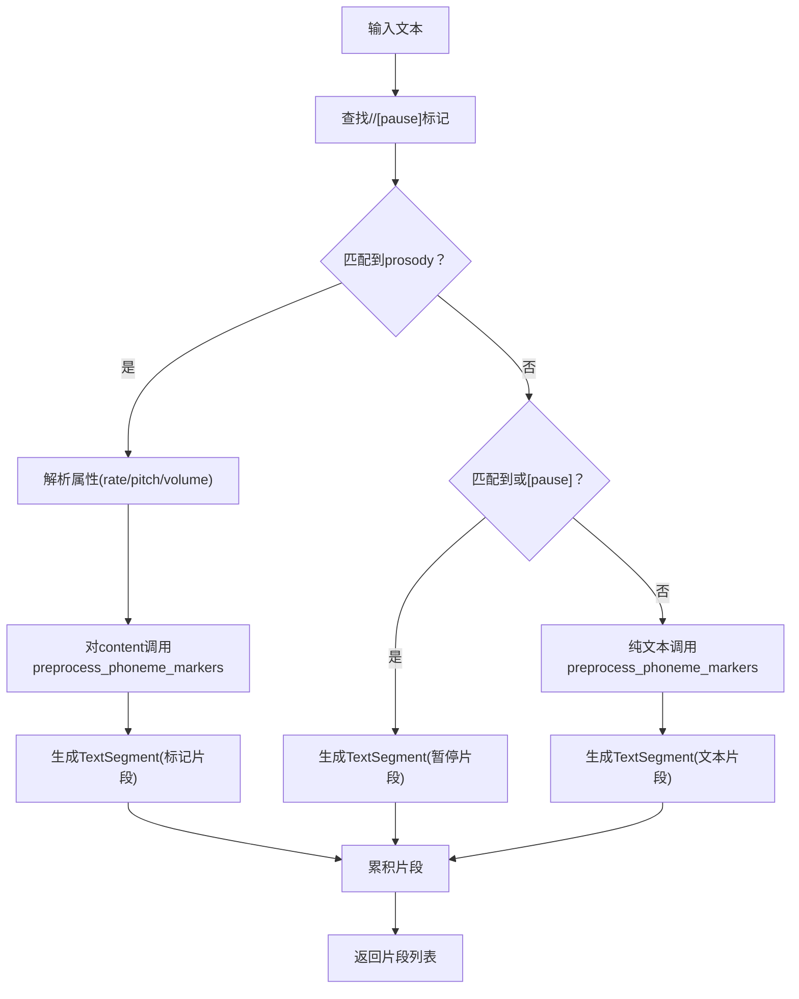
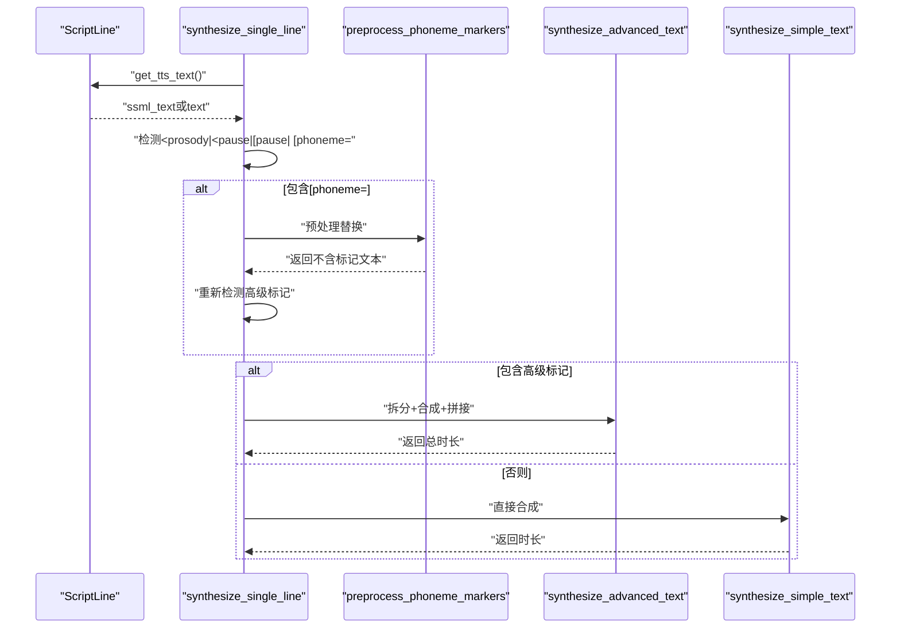
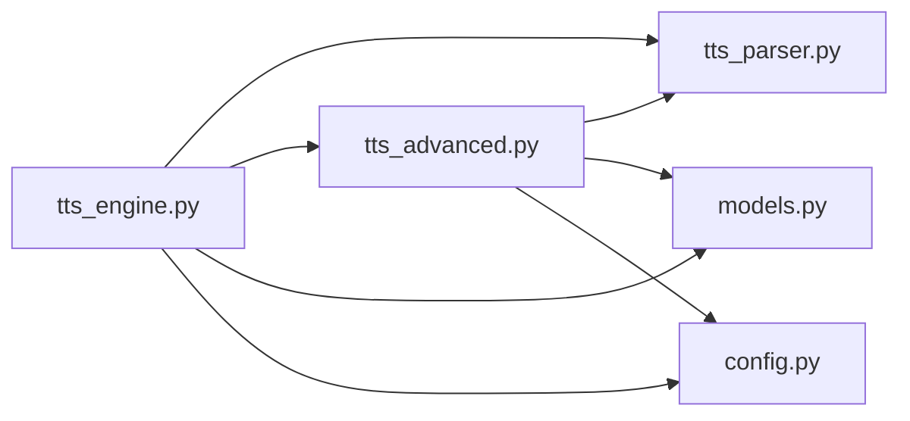

# 多音字精确控制

<cite>
**本文引用的文件**
- [tts_parser.py](file://app/tts_parser.py)
- [tts_engine.py](file://app/tts_engine.py)
- [tts_advanced.py](file://app/tts_advanced.py)
- [models.py](file://app/models.py)
- [config.py](file://app/config.py)
- [MULTI_PRONUNCIATION_EDITOR_GUIDE.md](file://docs/MULTI_PRONUNCIATION_EDITOR_GUIDE.md)
- [test_phoneme_simple.py](file://tests/test_phoneme_simple.py)
- [test_phoneme_strategies.py](file://tests/test_phoneme_strategies.py)
- [test_phoneme_debug.py](file://tests/test_phoneme_debug.py)
- [test_phoneme_comparison.py](file://tests/test_phoneme_comparison.py)
- [test_phoneme_audio.py](file://tests/test_phoneme_audio.py)
- [test_phoneme_verify.py](file://tests/test_phoneme_verify.py)
</cite>

## 目录
1. [简介](#简介)
2. [项目结构](#项目结构)
3. [核心组件](#核心组件)
4. [架构概览](#架构概览)
5. [详细组件分析](#详细组件分析)
6. [依赖分析](#依赖分析)
7. [性能考虑](#性能考虑)
8. [故障排除指南](#故障排除指南)
9. [结论](#结论)
10. [附录](#附录)

## 简介
本文件面向TTS Studio的多音字处理功能，系统性阐述多音字替换的工作原理、同音字检测机制、替换算法与验证流程；详解phoneme标记的语法规范与使用方法；展示如何通过[phoneme=同音字]原字[/phoneme]格式实现精确的多音字控制；提供中文多音字、成语、专有名词等复杂场景的处理示例；深入解析预处理函数preprocess_phoneme_markers的实现逻辑（正则表达式匹配、字符验证与替换策略）；并给出性能优化建议与故障排除指南。

## 项目结构
围绕多音字处理的关键模块与文件如下：
- 解析与预处理：app/tts_parser.py
- 引擎集成：app/tts_engine.py
- 高级合成（拆分+拼接）：app/tts_advanced.py
- 数据模型：app/models.py
- 配置与目录：app/config.py
- 用户指南与标记语法：docs/MULTI_PRONUNCIATION_EDITOR_GUIDE.md
- 单元测试与示例：tests/*_phoneme*.py

图表来源
- [tts_parser.py:1-220](file://app/tts_parser.py#L1-L220)
- [tts_engine.py:1-547](file://app/tts_engine.py#L1-L547)
- [tts_advanced.py:1-290](file://app/tts_advanced.py#L1-L290)
- [models.py:1-78](file://app/models.py#L1-L78)
- [config.py:1-74](file://app/config.py#L1-L74)
- [MULTI_PRONUNCIATION_EDITOR_GUIDE.md:1-248](file://docs/MULTI_PRONUNCIATION_EDITOR_GUIDE.md#L1-L248)
- [test_phoneme_simple.py:1-51](file://tests/test_phoneme_simple.py#L1-L51)
- [test_phoneme_strategies.py:1-139](file://tests/test_phoneme_strategies.py#L1-L139)
- [test_phoneme_debug.py:1-31](file://tests/test_phoneme_debug.py#L1-L31)
- [test_phoneme_comparison.py:1-167](file://tests/test_phoneme_comparison.py#L1-L167)
- [test_phoneme_audio.py:1-149](file://tests/test_phoneme_audio.py#L1-L149)
- [test_phoneme_verify.py:1-34](file://tests/test_phoneme_verify.py#L1-L34)

章节来源
- [tts_parser.py:1-220](file://app/tts_parser.py#L1-L220)
- [tts_engine.py:1-547](file://app/tts_engine.py#L1-L547)
- [tts_advanced.py:1-290](file://app/tts_advanced.py#L1-L290)
- [models.py:1-78](file://app/models.py#L1-L78)
- [config.py:1-74](file://app/config.py#L1-L74)
- [MULTI_PRONUNCIATION_EDITOR_GUIDE.md:1-248](file://docs/MULTI_PRONUNCIATION_EDITOR_GUIDE.md#L1-L248)
- [test_phoneme_simple.py:1-51](file://tests/test_phoneme_simple.py#L1-L51)
- [test_phoneme_strategies.py:1-139](file://tests/test_phoneme_strategies.py#L1-L139)
- [test_phoneme_debug.py:1-31](file://tests/test_phoneme_debug.py#L1-L31)
- [test_phoneme_comparison.py:1-167](file://tests/test_phoneme_comparison.py#L1-L167)
- [test_phoneme_audio.py:1-149](file://tests/test_phoneme_audio.py#L1-L149)
- [test_phoneme_verify.py:1-34](file://tests/test_phoneme_verify.py#L1-L34)

## 核心组件
- 预处理函数：preprocess_phoneme_markers，负责将[phoneme=同音字]原字[/phoneme]标记替换为同音字或拼音，确保最终文本不含标记且可被TTS引擎正确读出。
- 解析器：parse_prosody_text，将包含<prosody>、<pause>、[pause]与[phoneme]的文本拆分为多个TextSegment，其中[phoneme]在prosody内部进行替换。
- 引擎：synthesize_single_line，检测并预处理phoneme标记，再根据是否包含高级标记决定走简单合成还是高级合成（自动拆分+拼接）。
- 高级合成：synthesize_advanced_text，将解析后的片段逐一合成，最后拼接输出。
- 数据模型：ScriptLine，提供get_tts_text接口，优先返回ssml_text（含标记的完整文本），否则回退到text（纯文本）。

章节来源
- [tts_parser.py:39-66](file://app/tts_parser.py#L39-L66)
- [tts_parser.py:69-182](file://app/tts_parser.py#L69-L182)
- [tts_engine.py:177-217](file://app/tts_engine.py#L177-L217)
- [tts_engine.py:321-453](file://app/tts_engine.py#L321-L453)
- [models.py:48-61](file://app/models.py#L48-L61)

## 架构概览
多音字处理在TTS Studio中的端到端流程如下：
- 输入文本包含[phoneme=同音字]原字[/phoneme]标记
- 引擎检测到phoneme标记后，先调用preprocess_phoneme_markers进行替换
- 若同时存在<prosody>/<pause>/[pause]等高级标记，则进入高级合成流程，按片段拆分、逐段合成、最后拼接
- 若仅包含phoneme标记或纯文本，则走简单合成流程

图表来源
- [tts_engine.py:177-217](file://app/tts_engine.py#L177-L217)
- [tts_engine.py:321-453](file://app/tts_engine.py#L321-L453)
- [tts_parser.py:39-66](file://app/tts_parser.py#L39-L66)

## 详细组件分析

### 预处理函数：preprocess_phoneme_markers
- 功能：将[phoneme=同音字]原字[/phoneme]替换为同音字或拼音，确保最终文本不含标记。
- 正则匹配：使用捕获组group(1)表示同音字，group(2)表示原字。
- 字符验证：仅当同音字为单个中文字符（Unicode范围\u4e00-\u9fff）时才执行替换，否则保留原文本，避免错误标记导致的不可控读音。
- 替换策略：成功验证后返回同音字；否则返回原字，保证安全回退。

图表来源
- [tts_parser.py:39-66](file://app/tts_parser.py#L39-L66)

章节来源
- [tts_parser.py:39-66](file://app/tts_parser.py#L39-L66)

### 解析器：parse_prosody_text
- 功能：解析包含<prosody>、<pause>、[pause]与[phoneme]的文本，拆分为TextSegment列表。
- prosody处理：解析rate/pitch/volume属性，内部再次调用preprocess_phoneme_markers进行替换。
- pause处理：支持<pause=...>与[pause=...]两种格式，统一转换为内部暂停片段。
- 文本片段：纯文本同样先经过preprocess_phoneme_markers处理，确保无标记残留。
- 返回值：TextSegment列表，包含text、rate、pitch、volume、is_marked、segment_type等字段。

图表来源
- [tts_parser.py:69-182](file://app/tts_parser.py#L69-L182)

章节来源
- [tts_parser.py:69-182](file://app/tts_parser.py#L69-L182)

### 引擎集成：synthesize_single_line
- 功能：根据输入文本是否包含phoneme、高级标记或SSML，决定不同的合成路径。
- phoneme预处理：若检测到[phoneme=，则先调用preprocess_phoneme_markers替换，再重新检测是否包含高级标记。
- 高级合成：parse_marked_text拆分后，逐片段合成并拼接。
- 简单合成：直接调用edge-tts进行合成。
- 日志与错误处理：记录详细步骤、时长估算与重试机制。

图表来源
- [tts_engine.py:177-217](file://app/tts_engine.py#L177-L217)
- [tts_engine.py:321-453](file://app/tts_engine.py#L321-L453)
- [tts_parser.py:39-66](file://app/tts_parser.py#L39-L66)

章节来源
- [tts_engine.py:177-217](file://app/tts_engine.py#L177-L217)
- [tts_engine.py:321-453](file://app/tts_engine.py#L321-L453)

### 高级合成：synthesize_advanced_text
- 功能：将解析后的片段逐一合成，最后使用FFmpeg拼接，返回总时长。
- 片段类型：pause片段使用静音生成；非pause片段调用synthesize_simple_text合成。
- 临时文件管理：生成临时文件，完成后清理。
- 时长获取：优先使用mutagen读取MP3时长，否则估算。

章节来源
- [tts_advanced.py:321-453](file://app/tts_advanced.py#L321-L453)

### 数据模型与配置
- ScriptLine：提供get_tts_text，优先返回ssml_text（含标记的完整文本），否则回退到text。
- config：定义音频输出目录、默认音色等全局配置。

章节来源
- [models.py:48-61](file://app/models.py#L48-L61)
- [config.py:20-58](file://app/config.py#L20-L58)

## 依赖分析
- 模块耦合
  - tts_engine依赖tts_parser（预处理）、tts_advanced（高级合成）、models（数据模型）、config（目录配置）。
  - tts_parser独立，仅依赖标准库re与logging。
  - tts_advanced依赖tts_parser（解析）、models（ScriptLine）、config（目录）。
- 关键依赖链
  - 引擎入口 → 预处理 → 解析 → 合成/拼接 → 输出
- 循环依赖
  - 未发现循环依赖，模块职责清晰。

图表来源
- [tts_engine.py:13-15](file://app/tts_engine.py#L13-L15)
- [tts_advanced.py:17](file://app/tts_advanced.py#L17)

章节来源
- [tts_engine.py:13-15](file://app/tts_engine.py#L13-L15)
- [tts_advanced.py:17](file://app/tts_advanced.py#L17)

## 性能考虑
- 正则匹配
  - preprocess_phoneme_markers使用re.sub一次性替换，复杂度近似O(n)，n为文本长度。
  - parse_prosody_text使用re.finditer遍历标记，整体复杂度O(n)。
- 文本预处理
  - prosody内部与纯文本均调用preprocess_phoneme_markers，避免重复标记残留。
- 合成路径选择
  - 仅在包含高级标记时启用高级合成，减少不必要的拆分与拼接开销。
- 时长估算
  - 当无法读取MP3时长时，使用字符数估算，避免阻塞等待外部工具。
- 临时文件清理
  - 高级合成完成后清理临时文件，避免磁盘占用。

[本节为通用性能讨论，不直接分析具体文件]

## 故障排除指南
- 症状：多音字未按预期读出
  - 检查标记格式是否正确：[phoneme=同音字]原字[/phoneme]或[phoneme=拼音]原字[/phoneme]。
  - 验证同音字是否为单个中文字符（preprocess_phoneme_markers对非中文字符会回退为原字）。
  - 使用测试脚本验证解析结果：参考test_phoneme_verify.py与test_phoneme_debug.py。
- 症状：高级标记未生效
  - 确认文本是否包含<prosody>、<pause>或[pause]，否则引擎会走简单合成路径。
  - 检查是否混用不同格式的pause标签，应统一为<pause=...>或[pause=...]。
- 症状：403错误或网络异常
  - 检查代理设置（HTTP_PROXY/https_proxy），必要时配置代理。
  - 确认网络可访问微软服务。
- 症状：音频拼接失败
  - 检查FFmpeg是否可用，确保命令行可用。
  - 查看日志中的FFmpeg错误输出，定位具体问题。

章节来源
- [tts_engine.py:292-318](file://app/tts_engine.py#L292-L318)
- [tts_engine.py:377-387](file://app/tts_engine.py#L377-L387)
- [tts_advanced.py:244-264](file://app/tts_advanced.py#L244-L264)

## 结论
TTS Studio通过preprocess_phoneme_markers与parse_prosody_text实现了对[phoneme=同音字]原字[/phoneme]标记的精确替换与解析，结合引擎的智能路径选择与高级合成的拆分拼接能力，能够稳定地控制多音字读音。配合丰富的测试用例与用户指南，开发者与使用者可以在中文多音字、成语、专有名词等复杂场景下获得高质量的语音输出。

[本节为总结性内容，不直接分析具体文件]

## 附录

### 语法规范与使用方法
- 标记语法
  - [phoneme=同音字]原字[/phoneme]：用同音字替换原字
  - [phoneme=拼音]原字[/phoneme]：用拼音替换原字
  - <prosody rate="±X%" pitch="±YHz" volume="Z">文本</prosody>：语速/音调/音量控制
  - <pause=X> 或 [pause=X]：停顿（毫秒）
- 使用建议
  - 优先使用拼音策略（更精确），若效果不佳再尝试同音字替换
  - 可与语速/音调标记嵌套使用，形成复合控制
  - 常见多音字对照可参考用户指南中的最佳实践

章节来源
- [MULTI_PRONUNCIATION_EDITOR_GUIDE.md:194-202](file://docs/MULTI_PRONUNCIATION_EDITOR_GUIDE.md#L194-L202)
- [MULTI_PRONUNCIATION_EDITOR_GUIDE.md:119-129](file://docs/MULTI_PRONUNCIATION_EDITOR_GUIDE.md#L119-L129)

### 多语言与复杂场景示例
- 中文多音字
  - 银行行长：[phoneme=hang2]行[/phoneme][phoneme=zhang3]行[/phoneme]长
  - 重要：[phoneme=zhong4]重[/phoneme]要
- 成语与固定搭配
  - 长长久久：[phoneme=chang2]长[/phoneme][phoneme=chang2]长[/phoneme]的[phoneme=jiu4]久[/phoneme]
- 专有名词
  - 人名/地名：根据实际读音选择同音字或拼音
- 复合标记
  - [rate=-20%][phoneme=zhong4]重[/phoneme]要[/rate]：放慢语速强调“重”

章节来源
- [test_phoneme_strategies.py:16-139](file://tests/test_phoneme_strategies.py#L16-L139)
- [test_phoneme_comparison.py:18-167](file://tests/test_phoneme_comparison.py#L18-L167)
- [test_phoneme_audio.py:19-149](file://tests/test_phoneme_audio.py#L19-L149)

### 验证流程与测试用例
- 解析验证：test_phoneme_verify.py验证标记被正确移除
- 简化对比：test_phoneme_simple.py对比同音字替换与拼音策略
- 策略测试：test_phoneme_strategies.py覆盖多种场景
- 对比测试：test_phoneme_comparison.py生成三种音频进行对比
- 实际音频：test_phoneme_audio.py验证多音字实际读音效果

章节来源
- [test_phoneme_verify.py:14-34](file://tests/test_phoneme_verify.py#L14-L34)
- [test_phoneme_simple.py:15-51](file://tests/test_phoneme_simple.py#L15-L51)
- [test_phoneme_strategies.py:16-139](file://tests/test_phoneme_strategies.py#L16-L139)
- [test_phoneme_comparison.py:18-167](file://tests/test_phoneme_comparison.py#L18-L167)
- [test_phoneme_audio.py:19-149](file://tests/test_phoneme_audio.py#L19-L149)