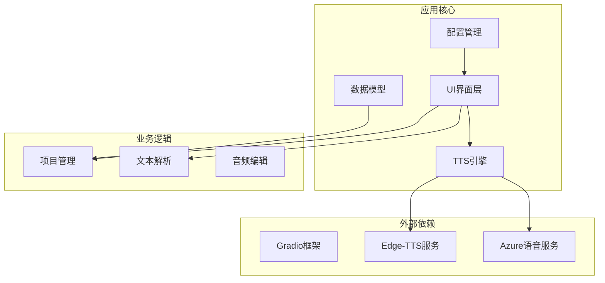
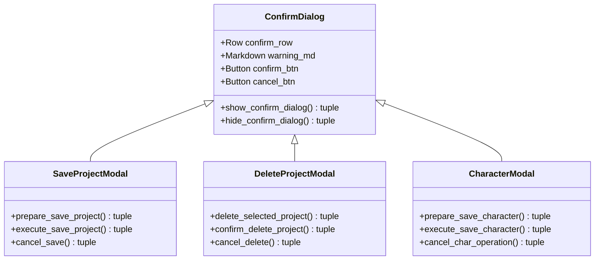
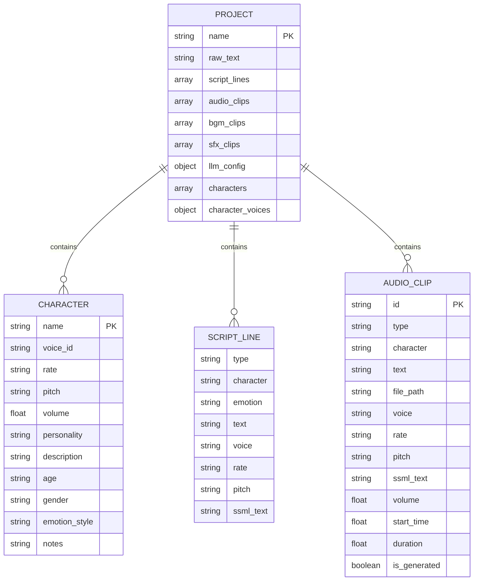
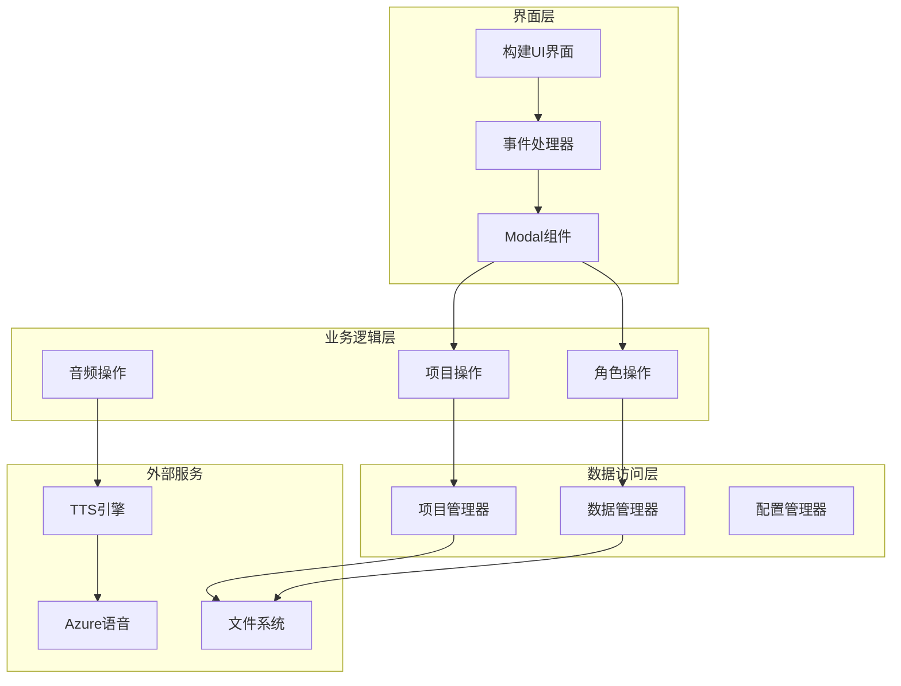
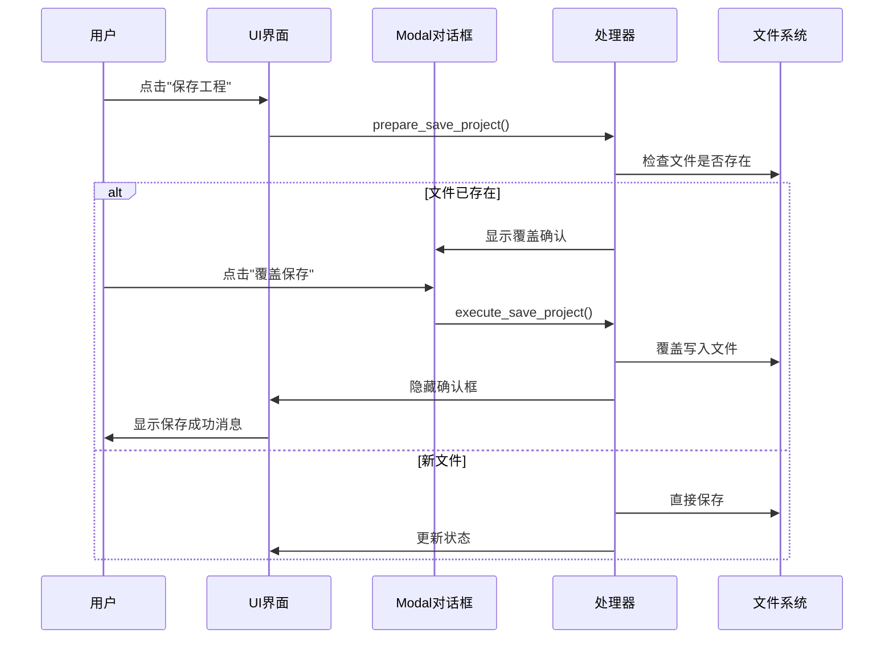
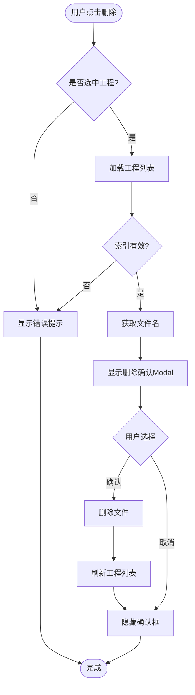
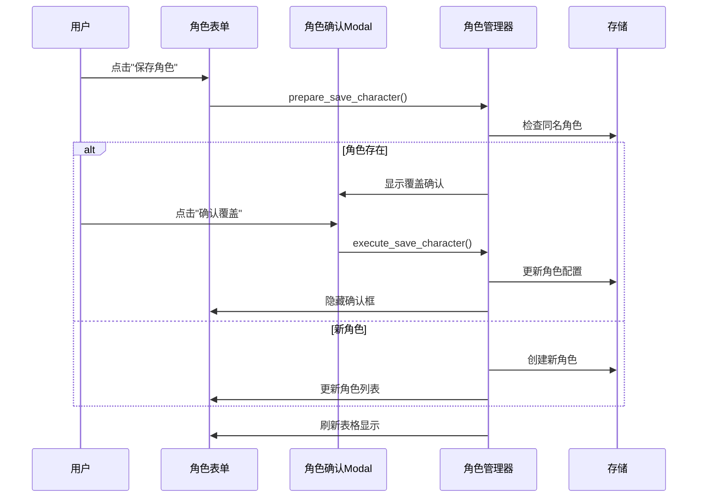
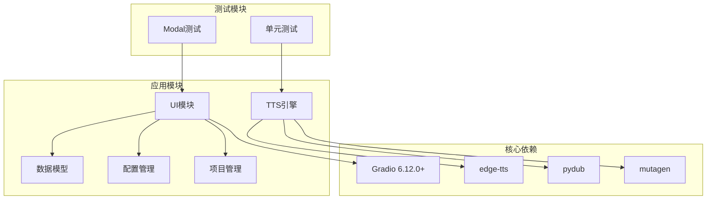
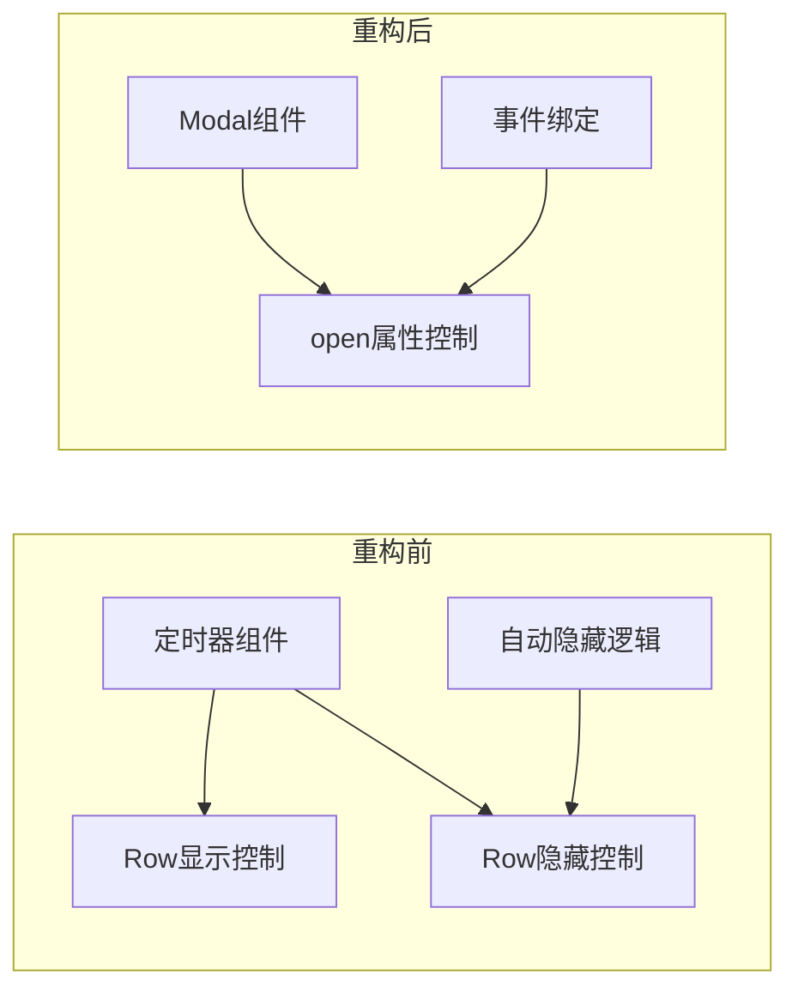
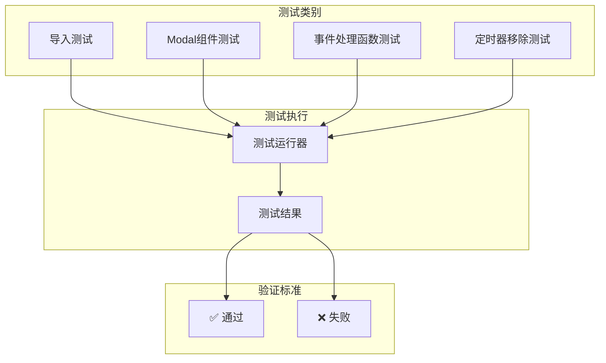

# 模态重构技术总结

<cite>
**本文档引用的文件**
- [MODAL_REFACTOR_SUMMARY.md](file://MODAL_REFACTOR_SUMMARY.md)
- [app/ui.py](file://app/ui.py)
- [app/tts_engine.py](file://app/tts_engine.py)
- [app/models.py](file://app/models.py)
- [app/config.py](file://app/config.py)
- [app/project_manager.py](file://app/project_manager.py)
- [test_modal_changes.py](file://test_modal_changes.py)
</cite>

## 目录
1. [简介](#简介)
2. [项目结构](#项目结构)
3. [核心组件](#核心组件)
4. [架构概览](#架构概览)
5. [详细组件分析](#详细组件分析)
6. [依赖关系分析](#依赖关系分析)
7. [性能考虑](#性能考虑)
8. [故障排除指南](#故障排除指南)
9. [结论](#结论)

## 简介

本文档详细分析了TTS Studio项目中的模态重构技术实现。该项目将原有的基于Row + Timer的确认对话框模式重构为基于Gradio Modal组件的现代化确认机制，显著提升了用户体验和交互可靠性。

该重构解决了原有定时器自动隐藏导致用户错过确认操作的问题，通过Modal对话框提供更直观、可控的确认流程。重构涉及三个主要业务场景：工程保存覆盖确认、工程删除确认、角色覆盖确认。

## 项目结构

TTS Studio采用模块化架构设计，主要包含以下核心模块：

**图表来源**
- [app/ui.py:13-211](file://app/ui.py#L13-L211)
- [app/tts_engine.py:1-50](file://app/tts_engine.py#L1-L50)

**章节来源**
- [app/ui.py:1-50](file://app/ui.py#L1-L50)
- [app/config.py:1-74](file://app/config.py#L1-L74)

## 核心组件

### Modal确认对话框系统

重构的核心是将传统的Row显示/隐藏机制升级为Gradio Modal组件。每个确认场景都实现了完整的生命周期管理：

**图表来源**
- [app/ui.py:22-64](file://app/ui.py#L22-L64)
- [app/ui.py:818-895](file://app/ui.py#L818-L895)
- [app/ui.py:1121-1210](file://app/ui.py#L1121-L1210)
- [app/ui.py:1252-1340](file://app/ui.py#L1252-L1340)

### 数据模型重构

项目的数据模型保持稳定，但增加了对角色管理的支持：

**图表来源**
- [app/models.py:4-78](file://app/models.py#L4-L78)

**章节来源**
- [app/models.py:1-78](file://app/models.py#L1-L78)
- [app/ui.py:22-64](file://app/ui.py#L22-L64)

## 架构概览

重构后的系统架构采用了分层设计，确保了良好的可维护性和扩展性：

**图表来源**
- [app/ui.py:13-1931](file://app/ui.py#L13-L1931)
- [app/tts_engine.py:1-547](file://app/tts_engine.py#L1-L547)

## 详细组件分析

### 工程保存确认流程

重构的核心流程展示了Modal组件的优势：

**图表来源**
- [app/ui.py:818-895](file://app/ui.py#L818-L895)

#### 关键实现细节

1. **条件判断逻辑**：通过检查`current_project_path`的存在性决定保存策略
2. **状态管理**：使用`nonlocal`变量跟踪当前工程路径
3. **错误处理**：完善的异常捕获和日志记录机制
4. **UI反馈**：实时的状态更新和用户提示

**章节来源**
- [app/ui.py:818-895](file://app/ui.py#L818-L895)

### 工程删除确认流程

删除操作采用了相同的Modal模式，但增加了额外的安全检查：

**图表来源**
- [app/ui.py:1121-1210](file://app/ui.py#L1121-L1210)

#### 安全特性

1. **双重确认**：通过Modal提供明确的删除确认
2. **文件存在性检查**：删除前验证文件确实存在
3. **当前工程保护**：自动清理`current_project_path`引用
4. **列表同步更新**：删除后立即刷新工程列表

**章节来源**
- [app/ui.py:1121-1210](file://app/ui.py#L1121-L1210)

### 角色覆盖确认流程

角色管理是重构中最复杂的场景，涉及多种数据类型的处理：

**图表来源**
- [app/ui.py:1252-1340](file://app/ui.py#L1252-L1340)

#### 数据完整性保证

1. **类型安全**：严格的参数类型检查和转换
2. **默认值处理**：自动为缺失字段提供合理默认值
3. **格式标准化**：统一音色参数的格式（带单位的字符串）
4. **向后兼容**：支持旧版工程文件的平滑迁移

**章节来源**
- [app/ui.py:1252-1340](file://app/ui.py#L1252-L1340)

## 依赖关系分析

重构后的依赖关系更加清晰，减少了组件间的耦合：

**图表来源**
- [MODAL_REFACTOR_SUMMARY.md:5](file://MODAL_REFACTOR_SUMMARY.md#L5)
- [app/ui.py:1-10](file://app/ui.py#L1-L10)

### 版本兼容性

重构严格遵循了以下版本要求：
- **Gradio**: 6.12.0及以上版本，支持`gr.Modal`组件
- **Python**: 3.10+
- **依赖包**: edge-tts, pydub, mutagen等

**章节来源**
- [MODAL_REFACTOR_SUMMARY.md:3-6](file://MODAL_REFACTOR_SUMMARY.md#L3-L6)

## 性能考虑

### Modal组件性能优势

重构后的Modal组件相比Row+Timer方案具有以下性能优势：

1. **渲染优化**：Modal组件一次性渲染，避免多次DOM操作
2. **内存效率**：Modal状态通过`open`属性控制，减少不必要的组件实例化
3. **响应速度**：Modal显示/隐藏操作更加流畅，无定时器延迟
4. **资源占用**：减少了定时器相关的系统资源消耗

### 事件处理优化

重构后的事件处理机制更加高效：

**图表来源**
- [MODAL_REFACTOR_SUMMARY.md:10-16](file://MODAL_REFACTOR_SUMMARY.md#L10-L16)

## 故障排除指南

### 常见问题及解决方案

#### Modal组件创建失败

**问题症状**：应用启动时报错，提示Modal组件创建失败

**可能原因**：
1. Gradio版本过低（<6.12.0）
2. Modal组件导入错误
3. CSS样式冲突

**解决方案**：
1. 检查Gradio版本：`pip show gradio`
2. 确认Modal组件正确导入
3. 检查自定义CSS样式

#### 事件处理函数签名不匹配

**问题症状**：点击确认按钮时抛出参数数量不匹配错误

**解决方案**：
1. 确保事件处理函数返回值数量与输出组件数量一致
2. 检查`gr.update()`调用的参数顺序
3. 验证函数签名与事件绑定的一致性

#### Modal状态管理问题

**问题症状**：Modal无法正确显示或隐藏

**解决方案**：
1. 使用`gr.update(open=True/False)`显式控制Modal状态
2. 确保在事件处理函数中正确返回状态更新
3. 检查Modal组件的`open`属性初始化

**章节来源**
- [test_modal_changes.py:34-66](file://test_modal_changes.py#L34-L66)

### 测试验证

项目提供了完整的测试套件来验证重构的正确性：

**图表来源**
- [test_modal_changes.py:85-126](file://test_modal_changes.py#L85-L126)

**章节来源**
- [test_modal_changes.py:1-126](file://test_modal_changes.py#L1-L126)

## 结论

TTS Studio的模态重构技术成功地将传统的Row+Timer确认机制升级为现代化的Gradio Modal解决方案。这次重构不仅解决了用户体验问题，还带来了代码质量、可维护性和性能的全面提升。

### 主要成果

1. **用户体验提升**：Modal对话框提供更直观的确认流程
2. **代码质量改善**：减少了定时器相关的复杂逻辑
3. **性能优化**：降低了系统资源消耗，提升了响应速度
4. **可维护性增强**：统一的Modal组件模式简化了代码结构

### 技术亮点

- **模块化设计**：每个确认场景都有独立的处理逻辑
- **状态管理**：通过`gr.update()`精确控制组件状态
- **错误处理**：完善的异常捕获和用户友好的错误提示
- **测试覆盖**：全面的自动化测试确保重构质量

### 未来展望

这次重构为后续的功能扩展奠定了坚实基础，特别是在以下方面：
- 更复杂的确认场景支持
- 多语言本地化适配
- 更丰富的用户交互模式
- 性能监控和优化

通过这次成功的模态重构实践，TTS Studio项目展示了一个现代Web应用应该如何采用最佳实践来提升用户体验和技术架构水平。