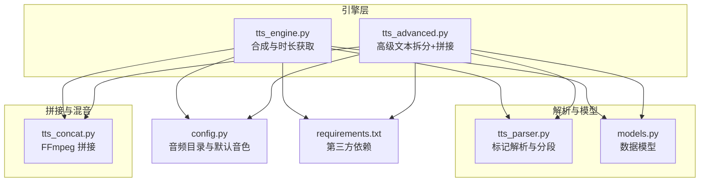
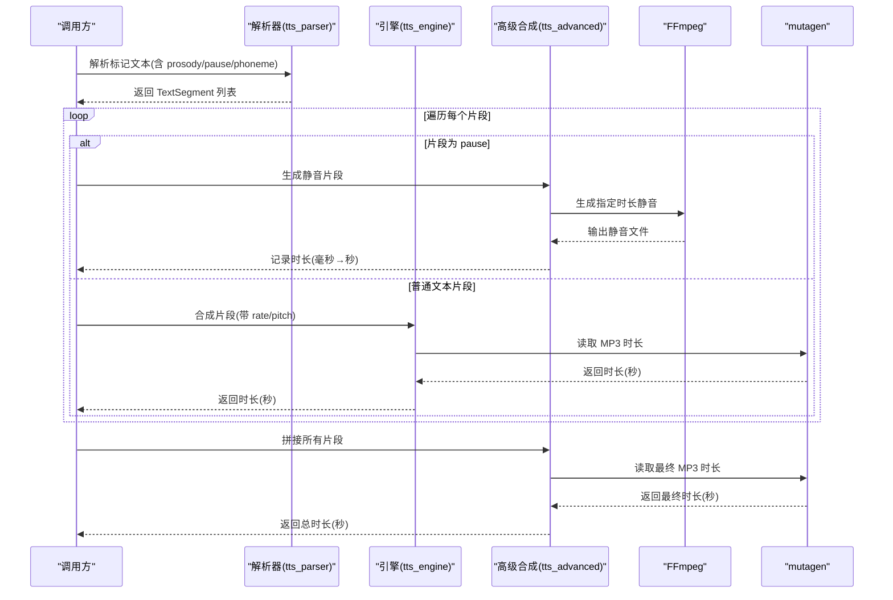
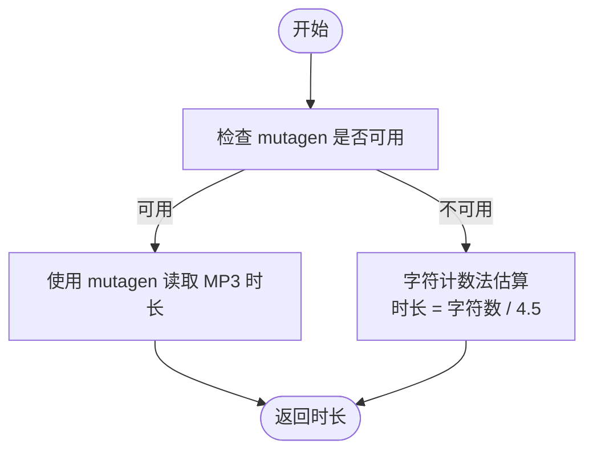
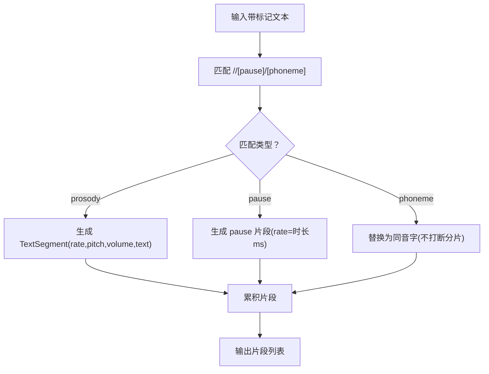
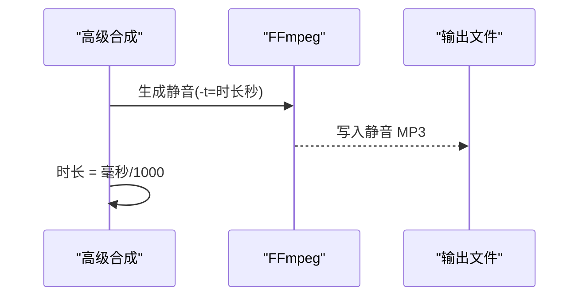
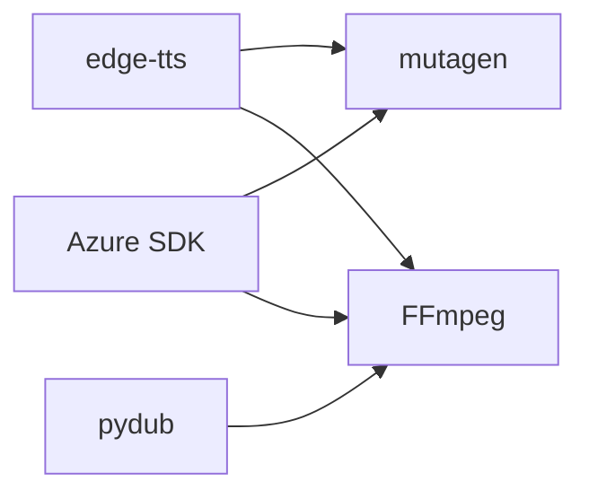

# 音频时长计算与估算

<cite>
**本文引用的文件**
- [app/tts_engine.py](file://app/tts_engine.py)
- [app/tts_advanced.py](file://app/tts_advanced.py)
- [app/tts_concat.py](file://app/tts_concat.py)
- [app/tts_parser.py](file://app/tts_parser.py)
- [app/models.py](file://app/models.py)
- [app/config.py](file://app/config.py)
- [app/project_manager.py](file://app/project_manager.py)
- [requirements.txt](file://requirements.txt)
- [tests/test_advanced_tts.py](file://tests/test_advanced_tts.py)
- [tests/test_pause_debug.py](file://tests/test_pause_debug.py)
</cite>

## 目录
1. [简介](#简介)
2. [项目结构](#项目结构)
3. [核心组件](#核心组件)
4. [架构总览](#架构总览)
5. [详细组件分析](#详细组件分析)
6. [依赖关系分析](#依赖关系分析)
7. [性能与精度考量](#性能与精度考量)
8. [故障排查指南](#故障排查指南)
9. [结论](#结论)
10. [附录](#附录)

## 简介
本文件聚焦于 TTS Studio 的“音频时长计算与估算”能力，系统梳理基于文本长度、语速参数与停顿标记的时长预测算法，以及三种主要时长获取方式：
- 通过 mutagen 库精确读取 MP3 时长
- 基于文本字符数的估算算法（字符计数法）
- 通过 FFmpeg 生成静音片段并读取其时长

同时覆盖不同 TTS 引擎（edge-tts、Azure Speech）在时长获取上的差异与兼容性处理，提供精度对比、误差来源分析与修正策略，并给出实际代码实现与使用示例的定位路径，帮助开发者理解与优化时长计算的准确性。

## 项目结构
围绕时长计算与估算的关键模块如下：
- 引擎层：负责具体 TTS 合成与时长获取（edge-tts、Azure）
- 高级文本解析与拆分：支持 prosody/pause/phoneme 等标记，拆分为多个片段
- 拼接工具：使用 FFmpeg 命令行进行音频拼接与混音
- 数据模型：记录脚本行与音频片段的时长、起止时间等
- 配置与依赖：音频目录、第三方库（mutagen、pydub、edge-tts、ffmpeg）

图表来源
- [app/tts_engine.py:1-547](file://app/tts_engine.py#L1-L547)
- [app/tts_advanced.py:1-290](file://app/tts_advanced.py#L1-L290)
- [app/tts_concat.py:1-159](file://app/tts_concat.py#L1-L159)
- [app/tts_parser.py:1-220](file://app/tts_parser.py#L1-L220)
- [app/models.py:1-78](file://app/models.py#L1-L78)
- [app/config.py:1-74](file://app/config.py#L1-L74)
- [requirements.txt:1-16](file://requirements.txt#L1-L16)

章节来源
- [app/tts_engine.py:1-547](file://app/tts_engine.py#L1-L547)
- [app/tts_advanced.py:1-290](file://app/tts_advanced.py#L1-L290)
- [app/tts_concat.py:1-159](file://app/tts_concat.py#L1-L159)
- [app/tts_parser.py:1-220](file://app/tts_parser.py#L1-L220)
- [app/models.py:1-78](file://app/models.py#L1-L78)
- [app/config.py:1-74](file://app/config.py#L1-L74)
- [requirements.txt:1-16](file://requirements.txt#L1-L16)

## 核心组件
- 时长获取方式一：通过 mutagen 精确读取 MP3 时长
  - 在 edge-tts 合成后与高级合成后，均优先使用 mutagen 读取 MP3 的实际播放时长
  - 若缺失依赖，则回退到字符计数法估算
- 时长获取方式二：字符计数法估算
  - 基于文本字符数除以固定系数（约 4.5 字符/秒）估算时长
  - 适用于缺少 mutagen 或无法读取 MP3 的场景
- 时长获取方式三：FFmpeg 生成静音片段的时长
  - 高级文本合成中，遇到 <pause> 或 [pause] 标记时，使用 FFmpeg 生成指定时长的静音片段
  - 静音片段时长即为标记值（毫秒→秒），直接累加得到总时长
- 不同引擎差异与兼容性
  - edge-tts：通过 edge-tts.Communicate 合成，随后使用 mutagen 读取时长；若无依赖则使用字符计数法
  - Azure Speech：合成完成后同样尝试使用 mutagen 读取时长；若失败则使用字符计数法估算
- 停顿片段处理机制
  - 解析器将 <pause> 与 [pause] 标记识别为独立片段，类型为 pause
  - 高级合成流程中，pause 片段由 FFmpeg 生成静音，时长直接等于标记值（ms）

章节来源
- [app/tts_engine.py:89-100](file://app/tts_engine.py#L89-L100)
- [app/tts_engine.py:278-290](file://app/tts_engine.py#L278-L290)
- [app/tts_engine.py:422-430](file://app/tts_engine.py#L422-L430)
- [app/tts_advanced.py:167-187](file://app/tts_advanced.py#L167-L187)
- [app/tts_advanced.py:206-213](file://app/tts_advanced.py#L206-L213)
- [app/tts_parser.py:112-132](file://app/tts_parser.py#L112-L132)

## 架构总览
下面的序列图展示了“高级文本合成”的时长计算流程，包括片段拆分、逐段合成、静音生成与最终拼接、时长读取与累加。

图表来源
- [app/tts_parser.py:69-182](file://app/tts_parser.py#L69-L182)
- [app/tts_engine.py:321-453](file://app/tts_engine.py#L321-L453)
- [app/tts_advanced.py:112-290](file://app/tts_advanced.py#L112-L290)

## 详细组件分析

### 组件A：时长获取与估算算法
- 字符计数法
  - 基于文本字符数除以固定系数（约 4.5 字符/秒）估算时长
  - 适用场景：缺少 mutagen 依赖、无法读取 MP3、或作为回退策略
  - 关键实现位置：
    - edge-tts 合成后：[app/tts_engine.py:284-287](file://app/tts_engine.py#L284-L287)
    - Azure 合成后：[app/tts_engine.py:95-97](file://app/tts_engine.py#L95-L97)
    - 高级合成后（拼接后）：[app/tts_engine.py:427-429](file://app/tts_engine.py#L427-L429)
- 停顿片段处理
  - 解析器将 <pause> 与 [pause] 标记识别为独立片段，类型为 pause
  - 高级合成流程中，pause 片段由 FFmpeg 生成静音，时长直接等于标记值（毫秒→秒）
  - 关键实现位置：
    - 解析器：[app/tts_parser.py:112-132](file://app/tts_parser.py#L112-L132)
    - 高级合成：[app/tts_advanced.py:167-187](file://app/tts_advanced.py#L167-L187)
    - 引擎高级合成：[app/tts_engine.py:372-390](file://app/tts_engine.py#L372-L390)
- 精确时长读取（mutagen）
  - 合成完成后，优先使用 mutagen 读取 MP3 的实际播放时长
  - 关键实现位置：
    - edge-tts 合成后：[app/tts_engine.py:278-283](file://app/tts_engine.py#L278-L283)
    - 高级合成后：[app/tts_advanced.py:273-277](file://app/tts_advanced.py#L273-L277)
    - Azure 合成后：[app/tts_engine.py:89-94](file://app/tts_engine.py#L89-L94)

图表来源
- [app/tts_engine.py:278-287](file://app/tts_engine.py#L278-L287)
- [app/tts_engine.py:89-97](file://app/tts_engine.py#L89-L97)
- [app/tts_engine.py:422-429](file://app/tts_engine.py#L422-L429)

章节来源
- [app/tts_engine.py:89-100](file://app/tts_engine.py#L89-L100)
- [app/tts_engine.py:278-290](file://app/tts_engine.py#L278-L290)
- [app/tts_engine.py:372-390](file://app/tts_engine.py#L372-L390)
- [app/tts_engine.py:422-430](file://app/tts_engine.py#L422-L430)
- [app/tts_advanced.py:167-187](file://app/tts_advanced.py#L167-L187)
- [app/tts_advanced.py:206-213](file://app/tts_advanced.py#L206-L213)
- [app/tts_parser.py:112-132](file://app/tts_parser.py#L112-L132)

### 组件B：高级文本解析与拆分
- 功能概述
  - 支持 <prosody>、<pause>、[pause]、[phoneme] 等标记
  - 将复杂文本拆分为多个片段，每个片段可独立设置 rate/pitch/volume
  - pause 片段单独处理，生成静音
- 关键点
  - prosody 内部的 [phoneme] 标记会在解析阶段被替换为同音字，不打断分片
  - 解析结果包含 segment_type、rate、pitch、volume 等字段
- 关键实现位置：
  - 解析器：[app/tts_parser.py:69-182](file://app/tts_parser.py#L69-L182)
  - 高级合成入口：[app/tts_advanced.py:112-132](file://app/tts_advanced.py#L112-L132)

图表来源
- [app/tts_parser.py:69-182](file://app/tts_parser.py#L69-L182)

章节来源
- [app/tts_parser.py:69-182](file://app/tts_parser.py#L69-L182)
- [app/tts_advanced.py:112-132](file://app/tts_advanced.py#L112-L132)

### 组件C：FFmpeg 静音生成与时长计算
- 静音生成
  - 使用 FFmpeg lavfi 的 anullsrc 生成指定时长的静音（采样率 24000Hz，单声道）
  - 输出为 MP3，便于后续拼接与时长读取
- 时长计算
  - 静音片段时长直接等于暂停时长（毫秒→秒），无需额外读取
- 关键实现位置：
  - 高级合成（tts_advanced）：[app/tts_advanced.py:167-187](file://app/tts_advanced.py#L167-L187)
  - 引擎高级合成（tts_engine）：[app/tts_engine.py:372-390](file://app/tts_engine.py#L372-L390)

图表来源
- [app/tts_advanced.py:167-187](file://app/tts_advanced.py#L167-L187)
- [app/tts_engine.py:372-390](file://app/tts_engine.py#L372-L390)

章节来源
- [app/tts_advanced.py:167-187](file://app/tts_advanced.py#L167-L187)
- [app/tts_engine.py:372-390](file://app/tts_engine.py#L372-L390)

### 组件D：多引擎时长获取差异与兼容性
- edge-tts
  - 合成后优先使用 mutagen 读取时长；若失败则使用字符计数法估算
  - 关键实现位置：[app/tts_engine.py:278-290](file://app/tts_engine.py#L278-L290)
- Azure Speech
  - 合成后优先使用 mutagen 读取时长；若失败则使用字符计数法估算
  - 关键实现位置：[app/tts_engine.py:89-100](file://app/tts_engine.py#L89-L100)
- 兼容性处理
  - 当 mutagen 未安装或读取失败时，统一回退到字符计数法
  - 高级合成拼接后若仍无法读取时长，使用各片段时长之和作为估算

章节来源
- [app/tts_engine.py:89-100](file://app/tts_engine.py#L89-L100)
- [app/tts_engine.py:278-290](file://app/tts_engine.py#L278-L290)
- [app/tts_engine.py:422-430](file://app/tts_engine.py#L422-L430)

### 组件E：数据模型与时间轴管理
- ScriptLine 与 AudioClip
  - 记录文本、音色、语速、音调、SSML 文本等
  - AudioClip 包含 start_time、duration 等时间信息，用于时间轴布局与混音
- 时间轴计算
  - 项目管理器根据已生成片段的 duration 累加计算下一个片段的 start_time
  - 关键实现位置：[app/project_manager.py:9-29](file://app/project_manager.py#L9-L29)

章节来源
- [app/models.py:36-61](file://app/models.py#L36-L61)
- [app/project_manager.py:9-29](file://app/project_manager.py#L9-L29)

## 依赖关系分析
- 第三方依赖
  - edge-tts：TTS 合成
  - mutagen：MP3 时长读取
  - pydub：静音生成与混音（部分场景）
  - FFmpeg：静音生成与音频拼接（命令行）
- 依赖安装与版本
  - 依赖清单见 requirements.txt
- 依赖缺失时的行为
  - 缺少 mutagen：回退到字符计数法
  - 缺少 edge-tts/Azure SDK：无法使用对应引擎
  - 缺少 FFmpeg：无法生成静音或拼接音频

图表来源
- [requirements.txt:1-16](file://requirements.txt#L1-L16)
- [app/tts_engine.py:20-28](file://app/tts_engine.py#L20-L28)

章节来源
- [requirements.txt:1-16](file://requirements.txt#L1-L16)
- [app/tts_engine.py:20-28](file://app/tts_engine.py#L20-L28)

## 性能与精度考量
- 精度对比
  - 精确读取（mutagen）：最接近真实播放时长，推荐优先使用
  - 字符计数法（≈4.5 字符/秒）：实现简单、通用性强，但受语速、标点、语言特性影响较大
  - 静音片段：完全由标记时长决定，误差最小
- 误差来源
  - 语速参数：rate 越快，字符计数法越偏慢；rate 越慢，越偏快
  - 标点与停顿：标点触发的自然停顿在字符计数法中未体现
  - 语言与口音：不同音色与语言的发音节奏不同，影响字符与时间的线性关系
  - 依赖缺失：mutagen 缺失导致回退到字符计数法，误差增大
- 优化建议
  - 优先保证 mutagen 安装与可用
  - 对关键片段（如停顿、强调）使用精确时长读取
  - 在字符计数法基础上引入语速系数校正（按实际 rate 调整）
  - 对高频停顿使用静音生成，确保停顿时长稳定

[本节为通用指导，不直接分析具体文件]

## 故障排查指南
- 无法读取 MP3 时长
  - 现象：mutagen 抛错或读取失败
  - 处理：回退到字符计数法；检查文件是否损坏或权限问题
  - 参考位置：
    - [app/tts_engine.py:278-290](file://app/tts_engine.py#L278-L290)
    - [app/tts_engine.py:422-430](file://app/tts_engine.py#L422-L430)
- Azure SDK 未安装
  - 现象：导入失败
  - 处理：安装 Azure SDK 或回退到 edge-tts
  - 参考位置：
    - [app/tts_engine.py:20-28](file://app/tts_engine.py#L20-L28)
- FFmpeg 未安装或路径错误
  - 现象：生成静音或拼接失败
  - 处理：安装 FFmpeg 并确保命令可用
  - 参考位置：
    - [app/tts_advanced.py:173-183](file://app/tts_advanced.py#L173-L183)
    - [app/tts_engine.py:377-387](file://app/tts_engine.py#L377-L387)
- 代理与网络问题（edge-tts）
  - 现象：403 等网络错误
  - 处理：配置 HTTP_PROXY/https_proxy 环境变量
  - 参考位置：
    - [app/tts_engine.py:303-307](file://app/tts_engine.py#L303-L307)

章节来源
- [app/tts_engine.py:20-28](file://app/tts_engine.py#L20-L28)
- [app/tts_engine.py:278-290](file://app/tts_engine.py#L278-L290)
- [app/tts_engine.py:377-387](file://app/tts_engine.py#L377-L387)
- [app/tts_engine.py:422-430](file://app/tts_engine.py#L422-L430)
- [app/tts_advanced.py:173-183](file://app/tts_advanced.py#L173-L183)

## 结论
TTS Studio 的时长计算与估算体系以“精确读取优先、静音片段稳定、字符计数法兜底”为核心策略。通过高级文本解析与拆分，结合 FFmpeg 生成静音与 mutagen 精确读取，能够在不同引擎与场景下获得较为稳定的时长估计。开发者应优先保证 mutagen 与 FFmpeg 的可用性，并针对语速与停顿等关键因素进行校正，以提升整体精度。

[本节为总结，不直接分析具体文件]

## 附录
- 实际使用示例（代码路径）
  - 高级文本合成与时长获取：[tests/test_advanced_tts.py:12-110](file://tests/test_advanced_tts.py#L12-L110)
  - 停顿标记解析调试：[tests/test_pause_debug.py:1-26](file://tests/test_pause_debug.py#L1-L26)
- 相关实现定位
  - 字符计数法估算（edge-tts）：[app/tts_engine.py:284-287](file://app/tts_engine.py#L284-L287)
  - 字符计数法估算（Azure）：[app/tts_engine.py:95-97](file://app/tts_engine.py#L95-L97)
  - 静音生成与时长（高级合成）：[app/tts_advanced.py:167-187](file://app/tts_advanced.py#L167-L187)
  - 静音生成与时长（引擎高级合成）：[app/tts_engine.py:372-390](file://app/tts_engine.py#L372-L390)
  - 精确时长读取（mutagen）：[app/tts_engine.py:278-283](file://app/tts_engine.py#L278-L283)，[app/tts_advanced.py:273-277](file://app/tts_advanced.py#L273-L277)