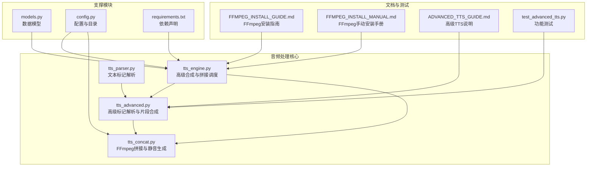
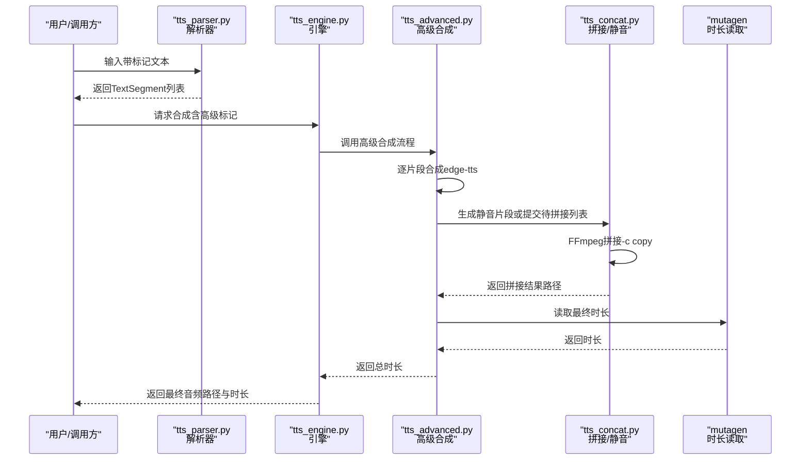
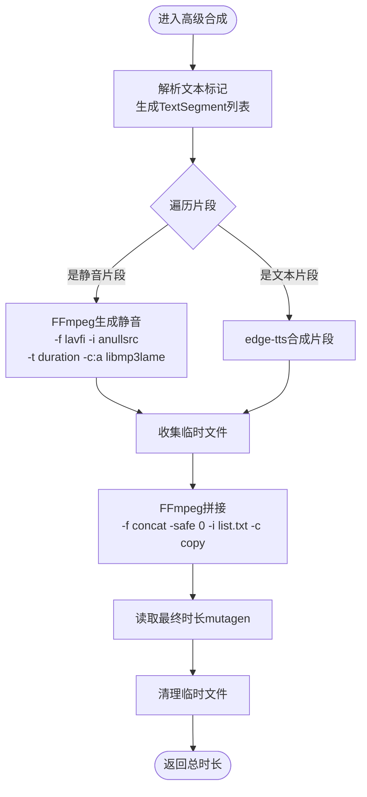
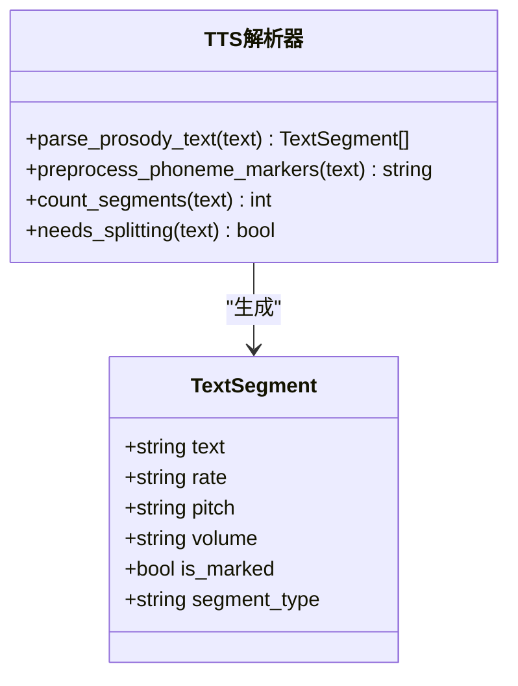
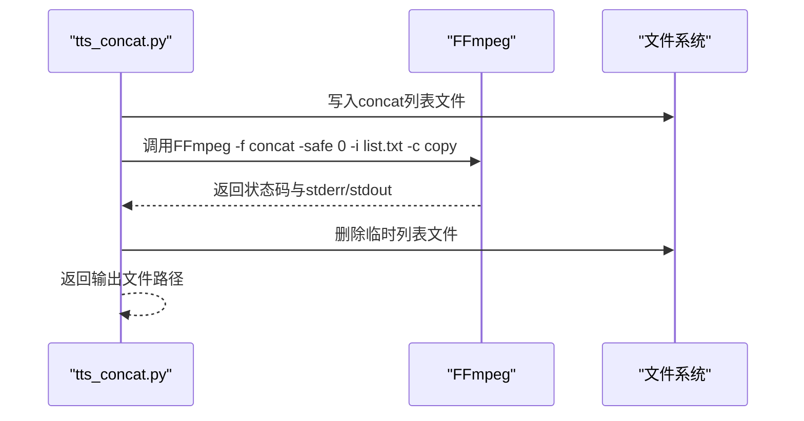
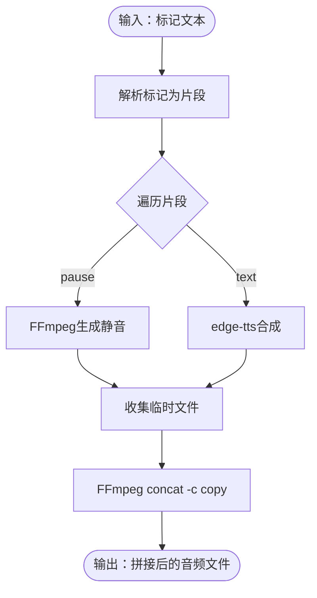
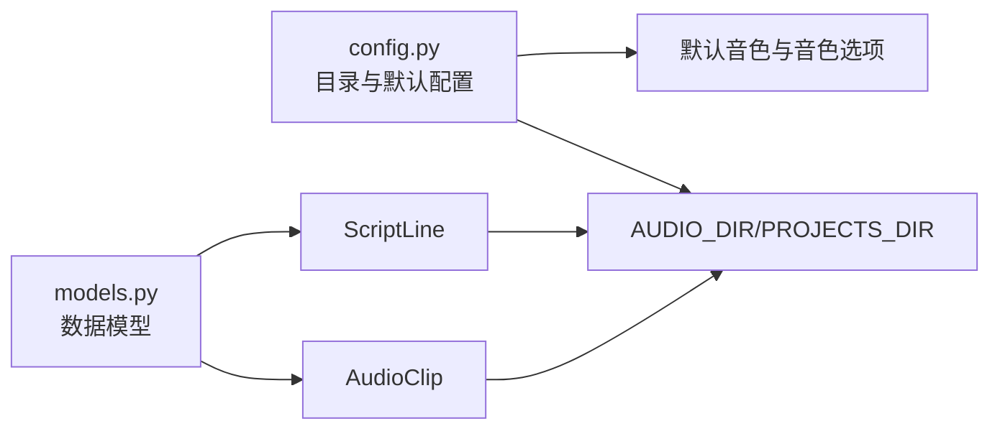
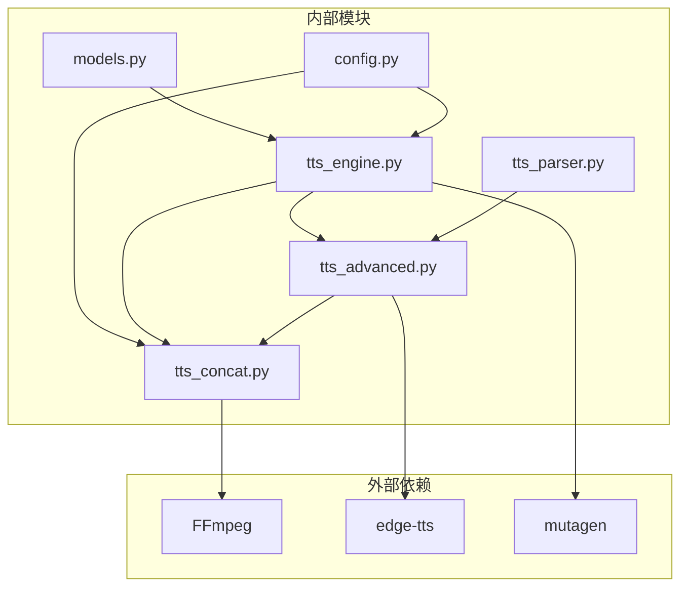

# 音频格式转换处理

<cite>
**本文引用的文件**
- [app/tts_engine.py](file://app/tts_engine.py)
- [app/tts_advanced.py](file://app/tts_advanced.py)
- [app/tts_concat.py](file://app/tts_concat.py)
- [app/tts_parser.py](file://app/tts_parser.py)
- [app/models.py](file://app/models.py)
- [app/config.py](file://app/config.py)
- [docs/FFMPEG_INSTALL_GUIDE.md](file://docs/FFMPEG_INSTALL_GUIDE.md)
- [docs/FFMPEG_INSTALL_MANUAL.md](file://docs/FFMPEG_INSTALL_MANUAL.md)
- [docs/ADVANCED_TTS_GUIDE.md](file://docs/ADVANCED_TTS_GUIDE.md)
- [requirements.txt](file://requirements.txt)
- [tests/test_advanced_tts.py](file://tests/test_advanced_tts.py)
</cite>

## 目录
1. [简介](#简介)
2. [项目结构](#项目结构)
3. [核心组件](#核心组件)
4. [架构总览](#架构总览)
5. [详细组件分析](#详细组件分析)
6. [依赖分析](#依赖分析)
7. [性能考量](#性能考量)
8. [故障排查指南](#故障排查指南)
9. [结论](#结论)
10. [附录](#附录)

## 简介
本文件面向TTS Studio的音频格式转换处理能力，聚焦于基于FFmpeg的音频拼接、混音与静音生成流程，结合项目中的高级标记文本解析与自动拆分拼接机制，系统阐述命令行参数配置、音频格式转换流程、质量保证与兼容性处理策略，并提供批量处理与性能优化建议。文档同时给出常见问题排查方法与最佳实践，帮助开发者与使用者高效、稳定地完成音频格式转换与质量控制。

## 项目结构
围绕音频格式转换与处理的相关模块主要分布在以下文件：
- 高级TTS引擎与拼接：app/tts_engine.py、app/tts_advanced.py、app/tts_concat.py
- 文本标记解析：app/tts_parser.py
- 数据模型与配置：app/models.py、app/config.py
- FFmpeg安装与使用指南：docs/FFMPEG_INSTALL_GUIDE.md、docs/FFMPEG_INSTALL_MANUAL.md
- 高级TTS功能说明：docs/ADVANCED_TTS_GUIDE.md
- 依赖声明：requirements.txt
- 功能测试：tests/test_advanced_tts.py

图表来源
- [app/tts_engine.py:1-547](file://app/tts_engine.py#L1-L547)
- [app/tts_advanced.py:1-290](file://app/tts_advanced.py#L1-L290)
- [app/tts_concat.py:1-159](file://app/tts_concat.py#L1-L159)
- [app/tts_parser.py:1-220](file://app/tts_parser.py#L1-L220)
- [app/models.py:1-78](file://app/models.py#L1-L78)
- [app/config.py:1-74](file://app/config.py#L1-L74)
- [docs/FFMPEG_INSTALL_GUIDE.md:1-99](file://docs/FFMPEG_INSTALL_GUIDE.md#L1-L99)
- [docs/FFMPEG_INSTALL_MANUAL.md:77-133](file://docs/FFMPEG_INSTALL_MANUAL.md#L77-L133)
- [docs/ADVANCED_TTS_GUIDE.md:1-188](file://docs/ADVANCED_TTS_GUIDE.md#L1-L188)
- [requirements.txt:1-16](file://requirements.txt#L1-L16)
- [tests/test_advanced_tts.py:1-110](file://tests/test_advanced_tts.py#L1-L110)

章节来源
- [app/tts_engine.py:1-547](file://app/tts_engine.py#L1-L547)
- [app/tts_advanced.py:1-290](file://app/tts_advanced.py#L1-L290)
- [app/tts_concat.py:1-159](file://app/tts_concat.py#L1-L159)
- [app/tts_parser.py:1-220](file://app/tts_parser.py#L1-L220)
- [app/models.py:1-78](file://app/models.py#L1-L78)
- [app/config.py:1-74](file://app/config.py#L1-L74)
- [docs/FFMPEG_INSTALL_GUIDE.md:1-99](file://docs/FFMPEG_INSTALL_GUIDE.md#L1-L99)
- [docs/FFMPEG_INSTALL_MANUAL.md:77-133](file://docs/FFMPEG_INSTALL_MANUAL.md#L77-L133)
- [docs/ADVANCED_TTS_GUIDE.md:1-188](file://docs/ADVANCED_TTS_GUIDE.md#L1-L188)
- [requirements.txt:1-16](file://requirements.txt#L1-L16)
- [tests/test_advanced_tts.py:1-110](file://tests/test_advanced_tts.py#L1-L110)

## 核心组件
- 高级TTS引擎与拼接调度：负责高级标记文本解析、片段拆分、逐片段合成、静音生成与最终拼接，统一管理时长获取与错误处理。
- 高级标记解析器：将包含<prosody>、<pause>、[phoneme]等标记的文本拆分为多个片段，保留语速、音调、音量等参数。
- FFmpeg拼接与静音生成：提供基于命令行的音频拼接、静音生成与混音能力，避免对第三方探测工具的强依赖。
- 配置与模型：统一管理音频输出目录、音色配置与数据结构，确保跨模块一致的数据契约。

章节来源
- [app/tts_engine.py:120-453](file://app/tts_engine.py#L120-L453)
- [app/tts_advanced.py:22-290](file://app/tts_advanced.py#L22-L290)
- [app/tts_concat.py:17-90](file://app/tts_concat.py#L17-L90)
- [app/tts_parser.py:23-182](file://app/tts_parser.py#L23-L182)
- [app/models.py:19-61](file://app/models.py#L19-L61)
- [app/config.py:20-58](file://app/config.py#L20-L58)

## 架构总览
整体流程由“文本解析—片段合成—静音/拼接—时长校验”构成，FFmpeg贯穿拼接与静音生成环节，确保在不依赖外部探测工具的前提下完成高质量音频拼接。

图表来源
- [app/tts_parser.py:69-182](file://app/tts_parser.py#L69-L182)
- [app/tts_engine.py:321-453](file://app/tts_engine.py#L321-L453)
- [app/tts_advanced.py:112-290](file://app/tts_advanced.py#L112-L290)
- [app/tts_concat.py:17-90](file://app/tts_concat.py#L17-L90)

## 详细组件分析

### 组件A：高级TTS引擎与拼接调度（tts_engine.py）
- 功能要点
  - 高级文本合成：自动拆分<prosody>/<pause>等标记，逐片段调用edge-tts合成，再通过FFmpeg拼接。
  - 静音生成：使用FFmpeg的lavfi源生成指定时长的静音MP3。
  - 混音轨道：基于adelay与amix滤镜链进行多轨混合，支持起始时间偏移与最长时长控制。
  - 时长获取：优先使用mutagen读取MP3时长，失败时采用估算。
  - 错误处理：统一重试机制与异常上报，失败后清理临时文件。
- 关键流程图（高级合成）

图表来源
- [app/tts_engine.py:321-453](file://app/tts_engine.py#L321-L453)
- [app/tts_concat.py:17-90](file://app/tts_concat.py#L17-L90)

章节来源
- [app/tts_engine.py:321-453](file://app/tts_engine.py#L321-L453)
- [app/tts_engine.py:454-547](file://app/tts_engine.py#L454-L547)

### 组件B：高级标记解析器（tts_parser.py）
- 功能要点
  - 支持<prosody rate/pitch/volume>、<pause=ms>、[pause=ms]与[phoneme=替换字]等标记。
  - 将标记文本拆分为多个TextSegment，保留rate/pitch/volume与segment_type等元信息。
  - phoneme标记在prosody内部替换为同音字，不打断分片。
- 类关系图

图表来源
- [app/tts_parser.py:23-182](file://app/tts_parser.py#L23-L182)

章节来源
- [app/tts_parser.py:23-182](file://app/tts_parser.py#L23-L182)

### 组件C：FFmpeg拼接与静音生成（tts_concat.py）
- 功能要点
  - 使用FFmpeg concat demuxer拼接多个音频片段，采用“-c copy”零重编码，提升性能与稳定性。
  - 生成静音：通过lavfi anullsrc源与libmp3lame编码器生成指定时长的MP3静音。
  - 列表文件管理：动态生成concat列表文件，拼接后自动清理。
- 拼接序列图

图表来源
- [app/tts_concat.py:17-90](file://app/tts_concat.py#L17-L90)

章节来源
- [app/tts_concat.py:17-90](file://app/tts_concat.py#L17-L90)

### 组件D：高级TTS功能与标记语法（tts_advanced.py）
- 功能要点
  - 从文本中解析rate/pitch/style/pause等标记，生成片段序列。
  - 对每个片段调用edge-tts合成，支持代理与重试。
  - 使用FFmpeg concat demuxer进行拼接，避免对ffprobe的依赖。
- 关键流程图（高级合成）

图表来源
- [app/tts_advanced.py:112-290](file://app/tts_advanced.py#L112-L290)

章节来源
- [app/tts_advanced.py:112-290](file://app/tts_advanced.py#L112-L290)

### 组件E：配置与数据模型（config.py、models.py）
- 功能要点
  - 统一音频输出目录（AUDIO_DIR）、项目目录（PROJECTS_DIR）与默认音色配置。
  - 定义AudioClip、ScriptLine等数据结构，确保跨模块一致的数据契约。
- 配置关系图

图表来源
- [app/config.py:20-58](file://app/config.py#L20-L58)
- [app/models.py:19-61](file://app/models.py#L19-L61)

章节来源
- [app/config.py:20-58](file://app/config.py#L20-L58)
- [app/models.py:19-61](file://app/models.py#L19-L61)

### 组件F：FFmpeg安装与使用指南（docs）
- 功能要点
  - Windows平台FFmpeg安装步骤与PATH配置。
  - 验证安装与pydub可用性的方法。
  - 常见问题与备选方案（无FFmpeg时的替代模式）。
- 指南要点
  - 推荐使用完整release包，包含ffprobe等工具。
  - 若PATH未生效，需关闭并重新打开终端窗口。
  - 可通过手动指定converter与ffprobe路径解决pydub找不到FFmpeg的问题。

章节来源
- [docs/FFMPEG_INSTALL_GUIDE.md:1-99](file://docs/FFMPEG_INSTALL_GUIDE.md#L1-L99)
- [docs/FFMPEG_INSTALL_MANUAL.md:77-133](file://docs/FFMPEG_INSTALL_MANUAL.md#L77-L133)

### 组件G：高级TTS说明与测试（docs、tests）
- 功能要点
  - 高级标记语法、工作原理与限制说明。
  - 测试脚本覆盖多片段、音调变化、复合样式与停顿等场景。
- 测试要点
  - 生成多个测试音频文件，便于人工验收与自动化回归。

章节来源
- [docs/ADVANCED_TTS_GUIDE.md:1-188](file://docs/ADVANCED_TTS_GUIDE.md#L1-L188)
- [tests/test_advanced_tts.py:1-110](file://tests/test_advanced_tts.py#L1-L110)

## 依赖分析
- 外部工具
  - FFmpeg：用于音频拼接（concat demuxer）、静音生成（lavfi/anullsrc）、混音（adelay/amix）。
  - edge-tts：用于文本到音频的合成。
  - mutagen：用于读取MP3时长。
- 内部模块耦合
  - tts_parser.py与tts_advanced.py紧密协作，前者负责解析，后者负责合成与拼接。
  - tts_engine.py作为编排者，协调高级合成与拼接、静音生成与混音。
  - tts_concat.py独立提供拼接与静音能力，降低对pydub的依赖。

图表来源
- [requirements.txt:1-16](file://requirements.txt#L1-L16)
- [app/tts_engine.py:1-547](file://app/tts_engine.py#L1-L547)
- [app/tts_advanced.py:1-290](file://app/tts_advanced.py#L1-L290)
- [app/tts_concat.py:1-159](file://app/tts_concat.py#L1-L159)
- [app/tts_parser.py:1-220](file://app/tts_parser.py#L1-L220)
- [app/config.py:1-74](file://app/config.py#L1-L74)
- [app/models.py:1-78](file://app/models.py#L1-L78)

章节来源
- [requirements.txt:1-16](file://requirements.txt#L1-L16)
- [app/tts_engine.py:1-547](file://app/tts_engine.py#L1-L547)
- [app/tts_advanced.py:1-290](file://app/tts_advanced.py#L1-L290)
- [app/tts_concat.py:1-159](file://app/tts_concat.py#L1-L159)
- [app/tts_parser.py:1-220](file://app/tts_parser.py#L1-L220)
- [app/config.py:1-74](file://app/config.py#L1-L74)
- [app/models.py:1-78](file://app/models.py#L1-L78)

## 性能考量
- 零重编码拼接：使用“-c copy”避免重复编码，显著提升拼接速度与质量一致性。
- 重试与指数退避：在网络不稳定时自动重试，减少失败率。
- 估算时长兜底：在无法读取时长时采用字符计数估算，保障流程连续性。
- 混音滤镜链：使用adelay与amix组合，支持多轨混合与起始时间偏移，避免额外转码。
- 临时文件清理：无论成功与否均清理临时文件，避免磁盘占用累积。

章节来源
- [app/tts_concat.py:56-80](file://app/tts_concat.py#L56-L80)
- [app/tts_engine.py:77-117](file://app/tts_engine.py#L77-L117)
- [app/tts_engine.py:255-318](file://app/tts_engine.py#L255-L318)
- [app/tts_engine.py:493-534](file://app/tts_engine.py#L493-L534)

## 故障排查指南
- FFmpeg未安装或未加入PATH
  - 现象：命令不可用或提示找不到命令。
  - 处理：参考安装指南，确认PATH已更新并重新打开终端；必要时手动指定converter与ffprobe路径。
- 拼接失败（concat demuxer）
  - 现象：FFmpeg返回非零状态码。
  - 处理：检查列表文件格式、路径是否包含中文或特殊字符；确认所有输入文件存在且可读。
- 静音生成失败
  - 现象：生成静音失败或时长异常。
  - 处理：确认lavfi源与libmp3lame编码器可用；检查时长参数与采样率设置。
- 时长读取失败
  - 现象：mutagen无法解析MP3时长。
  - 处理：降级使用估算时长；确认文件未损坏。
- 网络与代理问题（edge-tts）
  - 现象：403错误或连接超时。
  - 处理：配置HTTP_PROXY或https_proxy环境变量；检查网络连通性与代理设置。

章节来源
- [docs/FFMPEG_INSTALL_GUIDE.md:60-99](file://docs/FFMPEG_INSTALL_GUIDE.md#L60-L99)
- [docs/FFMPEG_INSTALL_MANUAL.md:98-133](file://docs/FFMPEG_INSTALL_MANUAL.md#L98-L133)
- [app/tts_concat.py:76-88](file://app/tts_concat.py#L76-L88)
- [app/tts_engine.py:292-318](file://app/tts_engine.py#L292-L318)

## 结论
TTS Studio通过“标记解析—片段合成—FFmpeg拼接/静音/混音”的流水线，实现了高质量、可扩展的音频格式转换与处理。项目在性能与稳定性方面采取多项优化策略（零重编码、重试与清理、估算兜底），并通过详尽的文档与测试保障可用性。建议在生产环境中优先满足FFmpeg安装要求，并结合批量处理策略与监控告警，持续提升吞吐与质量。

## 附录
- 常用命令行参数说明（基于项目实现）
  - 拼接：-f concat -safe 0 -i list.txt -c copy -y
  - 静音：-f lavfi -i anullsrc=r=24000:cl=mono -t duration -c:a libmp3lame -y
  - 混音：-filter_complex "[0:a]adelay=offset|offset[a0];...;[a0][a1]amix=inputs=N:duration=longest[aout]" -map [aout] -t duration -y
- 批量处理建议
  - 控制单句片段数，避免过多API调用导致超时。
  - 使用队列化与并发控制，结合指数退避重试。
  - 对输出进行一致性校验（时长、采样率、声道数）。
- 质量控制与兼容性
  - 优先使用“-c copy”零重编码拼接，保持原始质量。
  - 对多音字发音需求，采用同音字替换策略或未来接入支持SSML的TTS服务。
  - 在容器化部署时，确保FFmpeg与相关工具在镜像中可用。