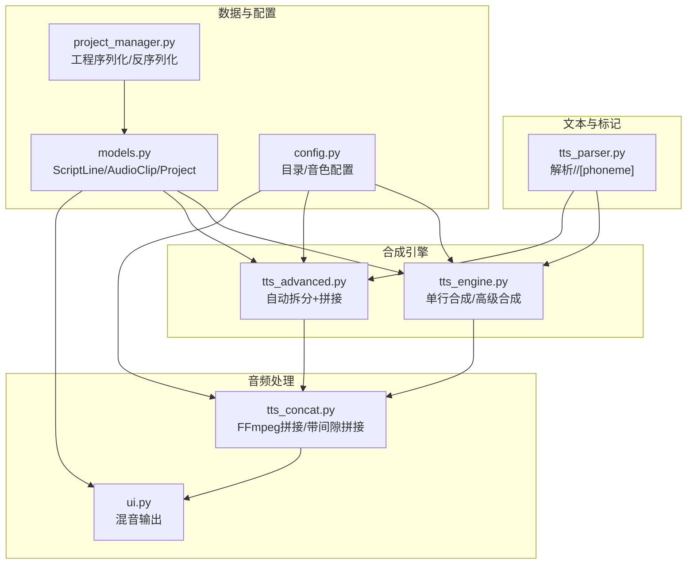
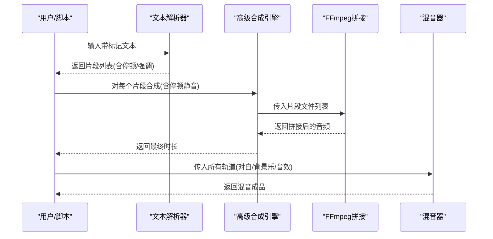
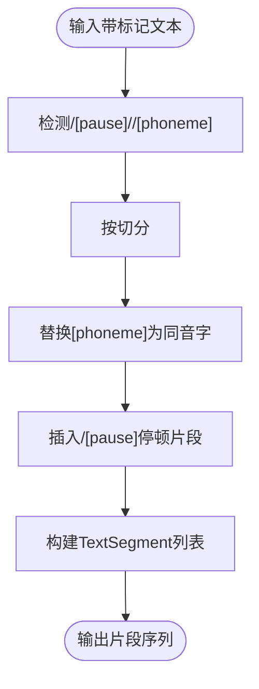
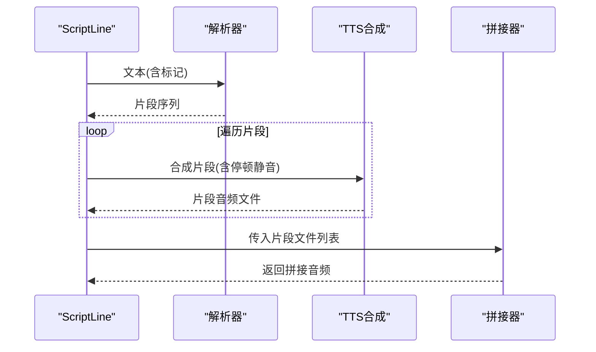
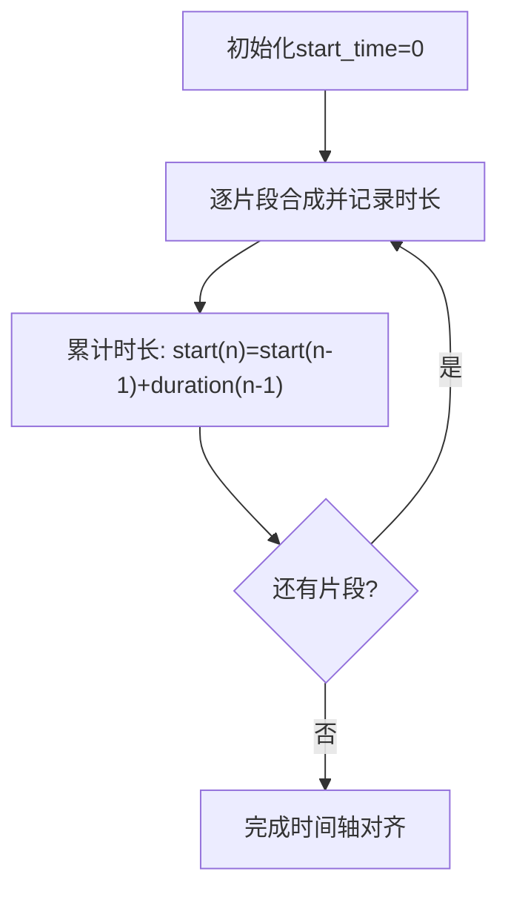
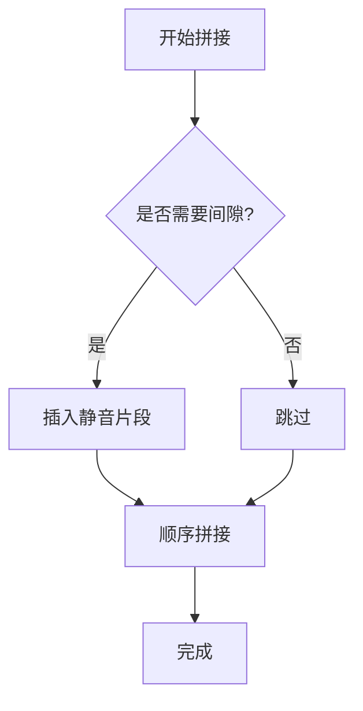
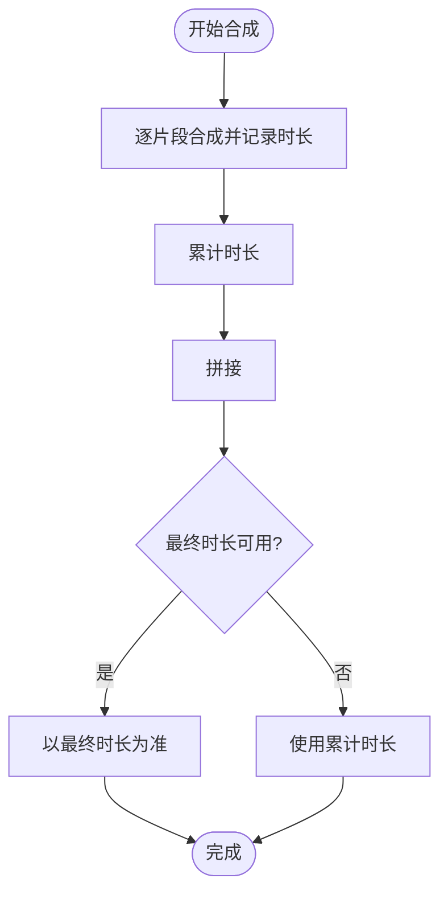
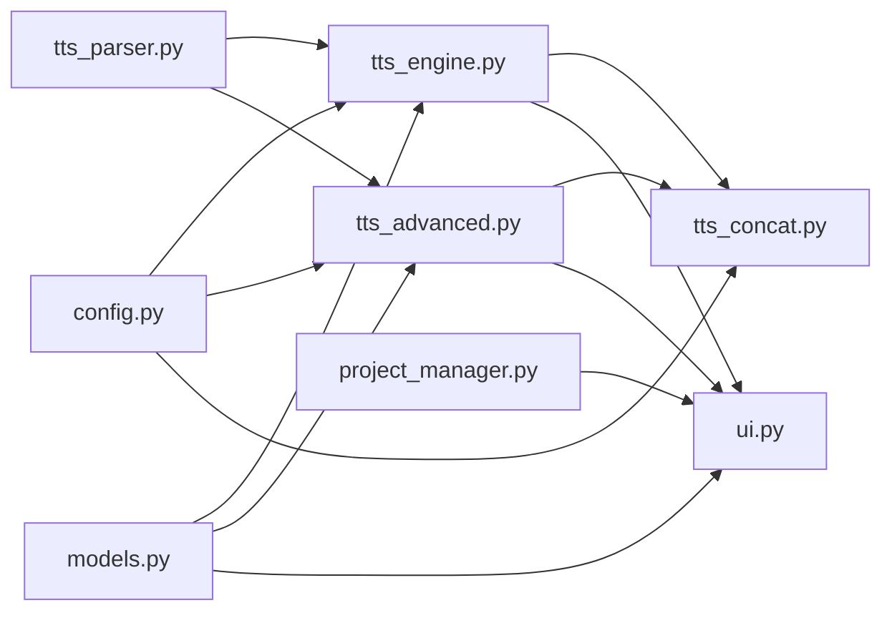
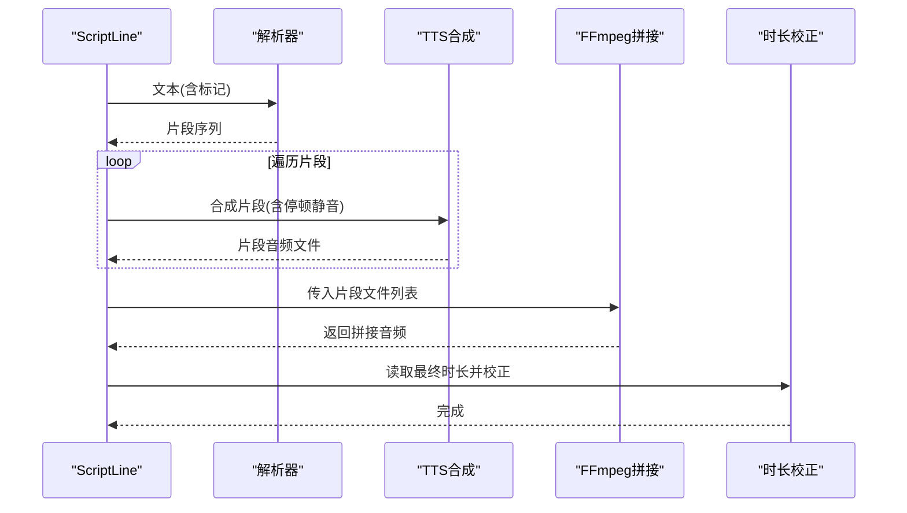

# 音频片段分割与同步

<cite>
**本文引用的文件**
- [app/tts_concat.py](file://app/tts_concat.py)
- [app/tts_parser.py](file://app/tts_parser.py)
- [app/tts_engine.py](file://app/tts_engine.py)
- [app/tts_advanced.py](file://app/tts_advanced.py)
- [app/models.py](file://app/models.py)
- [app/config.py](file://app/config.py)
- [app/project_manager.py](file://app/project_manager.py)
- [app/ui.py](file://app/ui.py)
- [demo_complex.py](file://demo_complex.py)
- [tests/test_ssml_before_split.py](file://tests/test_ssml_before_split.py)
- [tests/test_pause_debug.py](file://tests/test_pause_debug.py)
- [tests/test_advanced_tts.py](file://tests/test_advanced_tts.py)
</cite>

## 目录
1. [简介](#简介)
2. [项目结构](#项目结构)
3. [核心组件](#核心组件)
4. [架构总览](#架构总览)
5. [详细组件分析](#详细组件分析)
6. [依赖分析](#依赖分析)
7. [性能考虑](#性能考虑)
8. [故障排查指南](#故障排查指南)
9. [结论](#结论)
10. [附录](#附录)

## 简介
本文件面向TTS Studio的音频片段分割与同步能力，系统化阐述以下主题：
- 基于标记的音频片段自动分割算法：停顿标记检测、语义边界识别、自然停顿判断
- 精确同步机制：时间戳对齐、片段拼接顺序、重叠区域处理
- 拼接优化策略：静音处理、过渡效果与平滑连接
- 时长估算与校正：拼接后总时长计算与误差修正
- 片段管理最佳实践：临时文件处理、内存管理与清理策略
- 实战示例：复杂剧本处理流程与边界情况应对
- 性能优化与大规模处理建议

## 项目结构
围绕音频片段的“解析-合成-拼接-混音”的主流程，关键模块如下：
- 文本解析与标记处理：tts_parser.py
- 高级合成与自动拆分：tts_engine.py、tts_advanced.py
- 音频拼接与混音：tts_concat.py
- 数据模型与工程管理：models.py、project_manager.py
- 配置与资源目录：config.py
- 用户界面与工作流：ui.py
- 示例与测试：demo_complex.py、tests/*

**图表来源**
- [app/tts_parser.py:1-220](file://app/tts_parser.py#L1-L220)
- [app/tts_engine.py:1-547](file://app/tts_engine.py#L1-L547)
- [app/tts_advanced.py:1-290](file://app/tts_advanced.py#L1-L290)
- [app/tts_concat.py:1-159](file://app/tts_concat.py#L1-L159)
- [app/models.py:1-78](file://app/models.py#L1-L78)
- [app/config.py:1-74](file://app/config.py#L1-L74)
- [app/project_manager.py:1-73](file://app/project_manager.py#L1-L73)
- [app/ui.py:1-800](file://app/ui.py#L1-L800)

**章节来源**
- [app/tts_parser.py:1-220](file://app/tts_parser.py#L1-L220)
- [app/tts_engine.py:1-547](file://app/tts_engine.py#L1-L547)
- [app/tts_advanced.py:1-290](file://app/tts_advanced.py#L1-L290)
- [app/tts_concat.py:1-159](file://app/tts_concat.py#L1-L159)
- [app/models.py:1-78](file://app/models.py#L1-L78)
- [app/config.py:1-74](file://app/config.py#L1-L74)
- [app/project_manager.py:1-73](file://app/project_manager.py#L1-L73)
- [app/ui.py:1-800](file://app/ui.py#L1-L800)

## 核心组件
- 文本解析器：负责将带标记的文本拆分为多个片段，支持<prosody>、<pause>、[pause]与[phoneme]等标记；并进行预处理（同音字替换）。
- 高级合成引擎：根据解析结果对每个片段单独合成，再通过FFmpeg拼接；支持停顿片段的静音生成。
- 拼接工具：提供基于FFmpeg concat demuxer的拼接与带间隙拼接，避免依赖外部库的复杂依赖。
- 混音工具：将多个音频轨道按起始时间对齐，使用FFmpeg滤镜链实现延迟与混合。
- 数据模型：统一表示剧本行、音频片段与工程，支撑UI与持久化。

**章节来源**
- [app/tts_parser.py:23-182](file://app/tts_parser.py#L23-L182)
- [app/tts_engine.py:321-453](file://app/tts_engine.py#L321-L453)
- [app/tts_advanced.py:112-290](file://app/tts_advanced.py#L112-L290)
- [app/tts_concat.py:17-159](file://app/tts_concat.py#L17-L159)
- [app/models.py:36-78](file://app/models.py#L36-L78)

## 架构总览
下图展示了从文本到最终混音的端到端流程，重点体现“自动拆分-拼接-混音”的关键节点。

**图表来源**
- [app/tts_parser.py:69-182](file://app/tts_parser.py#L69-L182)
- [app/tts_engine.py:321-453](file://app/tts_engine.py#L321-L453)
- [app/tts_concat.py:17-90](file://app/tts_concat.py#L17-L90)
- [app/ui.py:700-706](file://app/ui.py#L700-L706)

## 详细组件分析

### 文本解析与片段拆分
- 停顿标记检测：支持<pause=...>与[pause=...]两种格式，解析为独立的停顿片段。
- 语义边界识别：以<prosody>标签为界，形成独立片段；标签内的[phoneme]标记先替换为同音字，再参与后续合成。
- 自然停顿判断：通过解析器将连续文本与停顿标记分离，形成稳定的片段序列，便于后续时长统计与拼接。

**图表来源**
- [app/tts_parser.py:69-182](file://app/tts_parser.py#L69-L182)
- [app/tts_parser.py:39-66](file://app/tts_parser.py#L39-L66)

**章节来源**
- [app/tts_parser.py:69-182](file://app/tts_parser.py#L69-L182)
- [tests/test_pause_debug.py:1-26](file://tests/test_pause_debug.py#L1-L26)

### 高级合成与自动拼接
- 片段级合成：对每个TextSegment分别调用TTS合成，停顿片段通过FFmpeg生成静音。
- 拼接策略：使用FFmpeg concat demuxer按顺序拼接，避免二次解码带来的质量损失与性能开销。
- 时长统计：先按片段逐一合成获取时长，再以最终文件时长为准进行校正。

**图表来源**
- [app/tts_engine.py:321-453](file://app/tts_engine.py#L321-L453)
- [app/tts_advanced.py:112-290](file://app/tts_advanced.py#L112-L290)
- [app/tts_concat.py:17-90](file://app/tts_concat.py#L17-L90)

**章节来源**
- [app/tts_engine.py:321-453](file://app/tts_engine.py#L321-L453)
- [app/tts_advanced.py:112-290](file://app/tts_advanced.py#L112-L290)

### 精确同步与时间戳对齐
- 时间戳对齐：在UI层，生成完成后按顺序累加各片段时长，更新后续片段的start_time，确保时间轴连续。
- 片段拼接顺序：严格遵循解析器输出的顺序，保证语义边界与停顿位置一致。
- 重叠区域处理：当前实现采用顺序拼接与静音间隔，未引入重叠交叉淡化；若需重叠对齐，可在拼接前对相邻片段做裁剪与淡入淡出。

**图表来源**
- [app/ui.py:601-613](file://app/ui.py#L601-L613)
- [app/tts_engine.py:590-597](file://app/tts_engine.py#L590-L597)

**章节来源**
- [app/ui.py:601-613](file://app/ui.py#L601-L613)
- [app/tts_engine.py:590-597](file://app/tts_engine.py#L590-L597)

### 拼接优化策略
- 静音处理：停顿片段通过FFmpeg生成固定时长的静音文件，避免额外依赖。
- 过渡效果：当前未内置淡入淡出；如需平滑连接，可在拼接前对相邻片段做裁剪与淡入淡出处理。
- 平滑连接技术：可通过FFmpeg滤镜链实现跨频道交叉淡化，但当前实现以顺序拼接为主。

**图表来源**
- [app/tts_concat.py:106-159](file://app/tts_concat.py#L106-L159)

**章节来源**
- [app/tts_concat.py:106-159](file://app/tts_concat.py#L106-L159)

### 时长估算与校正
- 片段级时长：每个片段合成后通过音频元数据读取时长。
- 总时长计算：拼接前累计时长，拼接后以最终文件时长为准进行校正。
- 误差修正：若最终时长与累计值存在偏差，以最终文件时长为基准更新工程中的时长字段。

**图表来源**
- [app/tts_engine.py:422-430](file://app/tts_engine.py#L422-L430)
- [app/tts_advanced.py:273-277](file://app/tts_advanced.py#L273-L277)

**章节来源**
- [app/tts_engine.py:422-430](file://app/tts_engine.py#L422-L430)
- [app/tts_advanced.py:273-277](file://app/tts_advanced.py#L273-L277)

### 片段管理最佳实践
- 临时文件处理：合成与拼接过程中生成大量临时文件，应在finally块中清理，避免磁盘占用。
- 内存管理：避免一次性加载过多音频至内存；使用流式处理与分块写入。
- 清理策略：拼接完成后删除临时列表文件与中间片段文件；混音前过滤无效片段。

**章节来源**
- [app/tts_engine.py:444-453](file://app/tts_engine.py#L444-L453)
- [app/tts_advanced.py:282-289](file://app/tts_advanced.py#L282-L289)
- [app/tts_concat.py:82-89](file://app/tts_concat.py#L82-L89)

### 实际示例与边界情况
- 复杂剧本处理：演示多种标记组合（多音字、停顿、强调、复合样式）的拼接效果。
- 边界情况：空文本、停顿格式差异、[phoneme]格式错误等，解析器与合成器均具备容错与日志提示。

**章节来源**
- [demo_complex.py:20-239](file://demo_complex.py#L20-L239)
- [tests/test_ssml_before_split.py:1-116](file://tests/test_ssml_before_split.py#L1-L116)
- [tests/test_advanced_tts.py:1-110](file://tests/test_advanced_tts.py#L1-L110)

## 依赖分析
- 模块耦合：tts_engine与tts_advanced依赖tts_parser进行文本拆分；二者共同依赖tts_concat进行拼接；ui.py协调合成与混音。
- 外部依赖：FFmpeg用于高质量无损拼接与静音生成；mutagen用于MP3时长读取；pydub仅在特定场景使用（如生成静音与测试音）。
- 循环依赖：未见循环导入；各模块职责清晰。

**图表来源**
- [app/tts_parser.py:1-220](file://app/tts_parser.py#L1-L220)
- [app/tts_engine.py:1-547](file://app/tts_engine.py#L1-L547)
- [app/tts_advanced.py:1-290](file://app/tts_advanced.py#L1-L290)
- [app/tts_concat.py:1-159](file://app/tts_concat.py#L1-L159)
- [app/models.py:1-78](file://app/models.py#L1-L78)
- [app/config.py:1-74](file://app/config.py#L1-L74)
- [app/project_manager.py:1-73](file://app/project_manager.py#L1-L73)
- [app/ui.py:1-800](file://app/ui.py#L1-L800)

**章节来源**
- [app/tts_engine.py:1-547](file://app/tts_engine.py#L1-L547)
- [app/tts_advanced.py:1-290](file://app/tts_advanced.py#L1-L290)
- [app/tts_concat.py:1-159](file://app/tts_concat.py#L1-L159)
- [app/models.py:1-78](file://app/models.py#L1-L78)
- [app/config.py:1-74](file://app/config.py#L1-L74)
- [app/project_manager.py:1-73](file://app/project_manager.py#L1-L73)
- [app/ui.py:1-800](file://app/ui.py#L1-L800)

## 性能考虑
- 拼接性能：使用FFmpeg concat demuxer避免重编码，显著降低CPU与I/O开销。
- 合成并发：当前为顺序合成；在稳定性和一致性前提下，可评估异步并发（注意网络限流与资源争用）。
- 时长读取：优先使用音频元数据读取时长，避免重复解码；缺失时采用估算策略。
- 大规模处理：分批生成与拼接，限制同时打开的文件句柄数量；定期清理临时文件。

[本节为通用指导，无需具体文件引用]

## 故障排查指南
- FFmpeg错误：拼接失败时检查命令行输出与权限；确认ffmpeg.exe路径正确。
- 时长异常：若最终时长与累计值不符，以最终文件时长为准；检查拼接过程是否中断。
- 标记解析问题：确认<pause>、<prosody>、[phoneme]格式正确；必要时使用测试用例验证正则匹配。
- 代理与网络：Edge-TTS合成可能受网络影响，检查代理配置与服务可达性。

**章节来源**
- [app/tts_concat.py:76-78](file://app/tts_concat.py#L76-L78)
- [app/tts_engine.py:292-318](file://app/tts_engine.py#L292-L318)
- [tests/test_pause_debug.py:1-26](file://tests/test_pause_debug.py#L1-L26)

## 结论
TTS Studio通过“标记驱动的自动拆分+FFmpeg高质量拼接+严格的时长校正”，实现了稳定可靠的音频片段分割与同步。配合UI层面的时间轴对齐与混音输出，能够满足复杂剧本的生产需求。未来可在重叠对齐、淡入淡出与并发合成等方面进一步优化，以提升用户体验与处理效率。

[本节为总结性内容，无需具体文件引用]

## 附录

### 关键流程图：高级合成与拼接

**图表来源**
- [app/tts_engine.py:321-453](file://app/tts_engine.py#L321-L453)
- [app/tts_advanced.py:112-290](file://app/tts_advanced.py#L112-L290)
- [app/tts_concat.py:17-90](file://app/tts_concat.py#L17-L90)