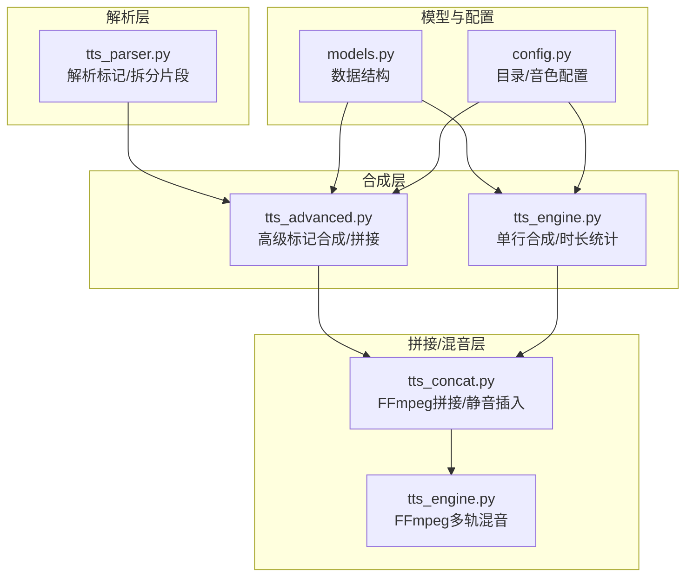
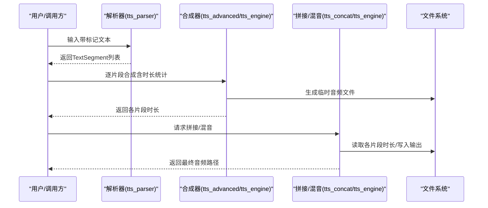
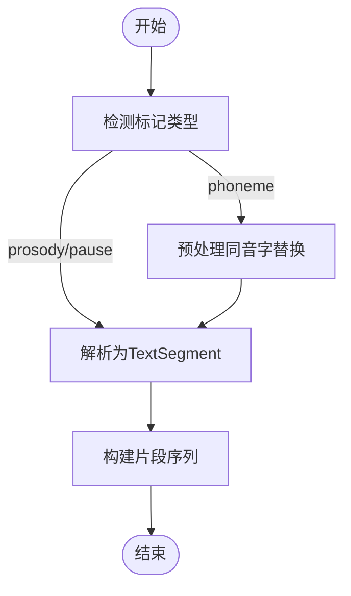
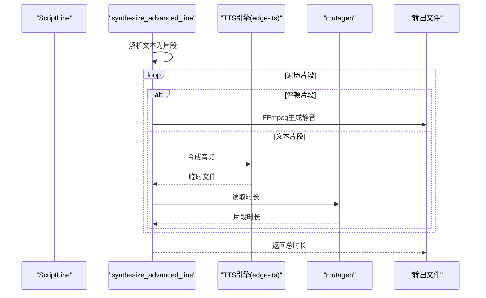
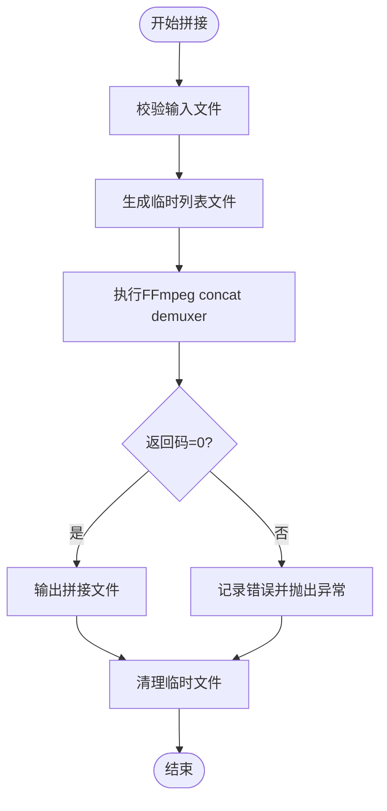
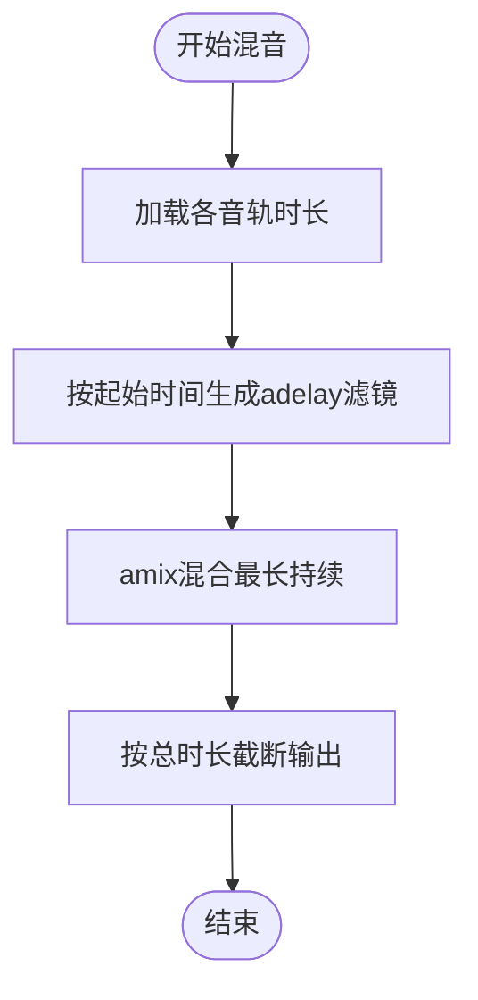
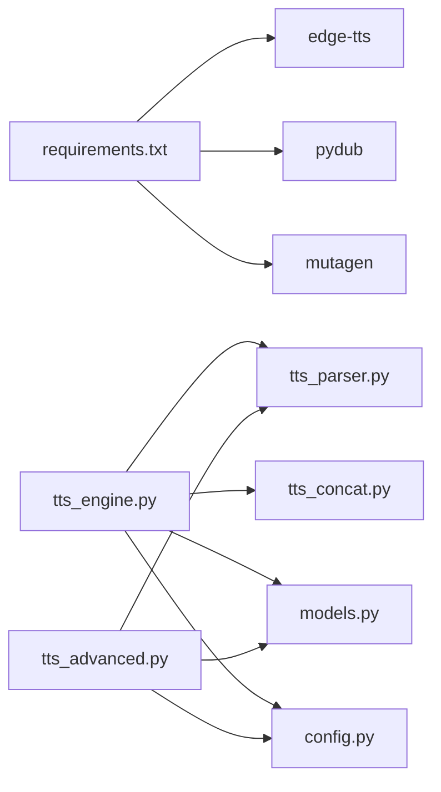

# 音频质量优化

<cite>
**本文引用的文件**
- [tts_engine.py](file://app/tts_engine.py)
- [tts_advanced.py](file://app/tts_advanced.py)
- [tts_concat.py](file://app/tts_concat.py)
- [tts_parser.py](file://app/tts_parser.py)
- [models.py](file://app/models.py)
- [config.py](file://app/config.py)
- [requirements.txt](file://requirements.txt)
- [ADVANCED_TTS_GUIDE.md](file://docs/ADVANCED_TTS_GUIDE.md)
- [EDGE_TTS_ADVANCED_MARKERS_GUIDE.md](file://docs/EDGE_TTS_ADVANCED_MARKERS_GUIDE.md)
- [FFMPEG_INSTALL_GUIDE.md](file://docs/FFMPEG_INSTALL_GUIDE.md)
- [FFMPEG_INSTALL_MANUAL.md](file://docs/FFMPEG_INSTALL_MANUAL.md)
- [test_advanced_tts.py](file://tests/test_advanced_tts.py)
- [test_phoneme_audio.py](file://tests/test_phoneme_audio.py)
</cite>

## 目录
1. [简介](#简介)
2. [项目结构](#项目结构)
3. [核心组件](#核心组件)
4. [架构总览](#架构总览)
5. [详细组件分析](#详细组件分析)
6. [依赖分析](#依赖分析)
7. [性能考量](#性能考量)
8. [故障排查指南](#故障排查指南)
9. [结论](#结论)
10. [附录](#附录)

## 简介
本文件面向TTS Studio的音频质量优化功能，系统化阐述以下主题：
- 音频时长计算与估算机制：基于文本长度、语速参数与停顿标记的时长预测与校准流程
- 音频格式转换与拼接：FFmpeg集成、格式兼容性与质量保证
- 多轨音频混音：音轨同步、音量平衡与延迟对齐
- 音频拼接优化：静音处理、过渡与平滑连接策略
- 音频质量评估：标准、方法与常见问题诊断
- 高级技巧与性能优化建议

## 项目结构
围绕音频质量优化的核心模块由三层组成：
- 解析层：负责标记解析与片段拆分，支持语速、音调、音量、停顿与多音字预处理
- 合成层：调用TTS引擎（edge-tts/自定义SSML/Azure）合成各片段，并统计时长
- 拼接/混音层：使用FFmpeg进行无损拼接与多轨混合，确保时序与音质一致

**图表来源**
- [tts_parser.py:1-220](file://app/tts_parser.py#L1-L220)
- [tts_engine.py:1-547](file://app/tts_engine.py#L1-L547)
- [tts_advanced.py:1-290](file://app/tts_advanced.py#L1-L290)
- [tts_concat.py:1-159](file://app/tts_concat.py#L1-L159)
- [models.py:1-78](file://app/models.py#L1-L78)
- [config.py:1-74](file://app/config.py#L1-L74)

**章节来源**
- [tts_engine.py:1-547](file://app/tts_engine.py#L1-L547)
- [tts_advanced.py:1-290](file://app/tts_advanced.py#L1-L290)
- [tts_concat.py:1-159](file://app/tts_concat.py#L1-L159)
- [tts_parser.py:1-220](file://app/tts_parser.py#L1-L220)
- [models.py:1-78](file://app/models.py#L1-L78)
- [config.py:1-74](file://app/config.py#L1-L74)

## 核心组件
- 文本标记解析与片段拆分：支持<prosody>、<pause>、[phoneme]等，生成TextSegment序列
- 高级TTS合成：针对多片段分别调用TTS，生成临时音频并拼接
- FFmpeg拼接：使用concat demuxer进行无损拼接；支持静音插入
- 多轨混音：基于FFmpeg filter_complex，按起始时间延迟对齐，amix混合
- 时长统计：优先使用mutagen读取MP3时长，失败时回退估算

**章节来源**
- [tts_parser.py:23-182](file://app/tts_parser.py#L23-L182)
- [tts_advanced.py:112-290](file://app/tts_advanced.py#L112-L290)
- [tts_concat.py:17-90](file://app/tts_concat.py#L17-L90)
- [tts_engine.py:454-534](file://app/tts_engine.py#L454-L534)
- [tts_engine.py:220-318](file://app/tts_engine.py#L220-L318)

## 架构总览
下图展示了从输入文本到最终音频输出的端到端流程，涵盖解析、合成、拼接与混音环节。

**图表来源**
- [tts_parser.py:69-182](file://app/tts_parser.py#L69-L182)
- [tts_advanced.py:112-290](file://app/tts_advanced.py#L112-L290)
- [tts_engine.py:321-453](file://app/tts_engine.py#L321-L453)
- [tts_concat.py:17-90](file://app/tts_concat.py#L17-L90)

## 详细组件分析

### 组件A：文本标记解析与片段拆分
- 功能要点
  - 支持<prosody>、<pause>、[pause]、[phoneme]等标记
  - 生成TextSegment对象，包含text、rate、pitch、volume、segment_type等字段
  - phoneme在解析前进行同音字替换，避免参与分片
- 时长估算与校准
  - 合成后使用mutagen读取MP3时长，作为最终时长
  - 若读取失败，回退到基于字符数的估算（用于边缘情况）

**图表来源**
- [tts_parser.py:39-182](file://app/tts_parser.py#L39-L182)

**章节来源**
- [tts_parser.py:23-182](file://app/tts_parser.py#L23-L182)

### 组件B：高级TTS合成与时长统计
- 功能要点
  - 针对每个TextSegment分别调用TTS合成
  - 停顿片段通过FFmpeg生成静音音频
  - 使用mutagen读取时长，失败时回退估算
- 重试与容错
  - 合成失败自动指数退避重试
  - 边界条件（空文本、代理配置）均有日志提示

**图表来源**
- [tts_advanced.py:112-290](file://app/tts_advanced.py#L112-L290)
- [tts_engine.py:321-453](file://app/tts_engine.py#L321-L453)

**章节来源**
- [tts_advanced.py:112-290](file://app/tts_advanced.py#L112-L290)
- [tts_engine.py:220-318](file://app/tts_engine.py#L220-L318)

### 组件C：FFmpeg音频拼接与静音插入
- 功能要点
  - 使用concat demuxer进行无损拼接（-c copy）
  - 支持在片段间插入静音间隙
  - 生成临时列表文件，拼接后清理
- 质量保证
  - 严格路径处理（绝对路径、斜杠规范化）
  - 失败时记录stderr并抛出异常

**图表来源**
- [tts_concat.py:17-90](file://app/tts_concat.py#L17-L90)

**章节来源**
- [tts_concat.py:17-90](file://app/tts_concat.py#L17-L90)

### 组件D：多轨音频混音与音量平衡
- 功能要点
  - 基于FFmpeg filter_complex，使用adelay对齐各音轨起始时间
  - 使用amix混合多轨，选择“最长持续时间”策略
  - 通过start_time换算为毫秒延迟，确保同步
- 质量控制
  - 读取各音轨时长，计算最大结束时间
  - 输出时长可由外部传入，或自动推断

**图表来源**
- [tts_engine.py:454-534](file://app/tts_engine.py#L454-L534)

**章节来源**
- [tts_engine.py:454-534](file://app/tts_engine.py#L454-L534)

### 组件E：音频格式转换与兼容性
- FFmpeg集成
  - 拼接使用concat demuxer（-c copy），避免重编码
  - 静音生成使用lavfi源（anullsrc），编码为libmp3lame
- 兼容性与质量
  - 输出统一为MP3，便于后续处理与播放
  - 通过绝对路径与斜杠规范化规避跨平台路径问题

**章节来源**
- [tts_concat.py:56-80](file://app/tts_concat.py#L56-L80)
- [tts_advanced.py:172-183](file://app/tts_advanced.py#L172-L183)

## 依赖分析
- 外部依赖
  - edge-tts：TTS引擎
  - pydub/mutagen：音频读写与时长读取
  - FFmpeg：拼接与混音
- 内部模块耦合
  - tts_engine依赖tts_parser、tts_concat与models
  - tts_advanced独立完成解析、合成与拼接
  - config提供目录与音色配置

**图表来源**
- [requirements.txt:1-16](file://requirements.txt#L1-L16)
- [tts_engine.py:1-18](file://app/tts_engine.py#L1-L18)
- [tts_advanced.py:1-18](file://app/tts_advanced.py#L1-L18)
- [tts_concat.py:1-16](file://app/tts_concat.py#L1-L16)
- [tts_parser.py:1-22](file://app/tts_parser.py#L1-L22)
- [models.py:1-78](file://app/models.py#L1-L78)
- [config.py:1-74](file://app/config.py#L1-L74)

**章节来源**
- [requirements.txt:1-16](file://requirements.txt#L1-L16)
- [tts_engine.py:1-18](file://app/tts_engine.py#L1-L18)
- [tts_advanced.py:1-18](file://app/tts_advanced.py#L1-L18)
- [tts_concat.py:1-16](file://app/tts_concat.py#L1-L16)
- [tts_parser.py:1-22](file://app/tts_parser.py#L1-L22)
- [models.py:1-78](file://app/models.py#L1-L78)
- [config.py:1-74](file://app/config.py#L1-L74)

## 性能考量
- 片段数量与合成时间
  - 片段数与单次合成耗时线性相关，建议单句片段数不超过合理阈值
- 拼接性能
  - 使用FFmpeg concat demuxer避免重编码，显著提升性能
- 时长统计
  - 优先使用mutagen读取真实时长，失败时回退估算，保证时序一致性

**章节来源**
- [ADVANCED_TTS_GUIDE.md:88-93](file://docs/ADVANCED_TTS_GUIDE.md#L88-L93)
- [tts_concat.py:56-80](file://app/tts_concat.py#L56-L80)
- [tts_engine.py:278-288](file://app/tts_engine.py#L278-L288)

## 故障排查指南
- FFmpeg相关
  - 安装与PATH配置：参考安装指南，验证命令可用
  - pydub探测：确认pydub可调用FFmpeg
- TTS合成
  - 403错误：通常为网络/代理问题，检查代理设置
  - 重试机制：默认最多3次指数退避重试
- 时长读取
  - mutagen缺失：回退到基于字符数的估算
- 多音字与停顿
  - phoneme仅做同音字替换，不参与分片
  - 停顿使用FFmpeg生成静音，避免拼接处突变

**章节来源**
- [FFMPEG_INSTALL_GUIDE.md:41-98](file://docs/FFMPEG_INSTALL_GUIDE.md#L41-L98)
- [FFMPEG_INSTALL_MANUAL.md:77-133](file://docs/FFMPEG_INSTALL_MANUAL.md#L77-L133)
- [tts_engine.py:292-318](file://app/tts_engine.py#L292-L318)
- [tts_engine.py:278-288](file://app/tts_engine.py#L278-L288)
- [tts_advanced.py:172-183](file://app/tts_advanced.py#L172-L183)

## 结论
TTS Studio通过“解析-合成-拼接-混音”的流水线实现了高质量的音频生产：以FFmpeg为核心保障拼接与混音质量，以多轨延迟与amix策略实现精准对齐，以时长读取与估算机制确保时序一致性。配合合理的标记使用与性能优化建议，可在保证质量的同时获得良好的吞吐表现。

## 附录
- 测试参考
  - 高级TTS功能测试：[test_advanced_tts.py:1-110](file://tests/test_advanced_tts.py#L1-L110)
  - 多音字音频生成测试：[test_phoneme_audio.py:1-149](file://tests/test_phoneme_audio.py#L1-L149)
- 文档参考
  - 高级标记语法与工作原理：[ADVANCED_TTS_GUIDE.md:1-188](file://docs/ADVANCED_TTS_GUIDE.md#L1-L188)
  - Edge-TTS高级标记技术细节与优化实践：[EDGE_TTS_ADVANCED_MARKERS_GUIDE.md:1-1175](file://docs/EDGE_TTS_ADVANCED_MARKERS_GUIDE.md#L1-L1175)