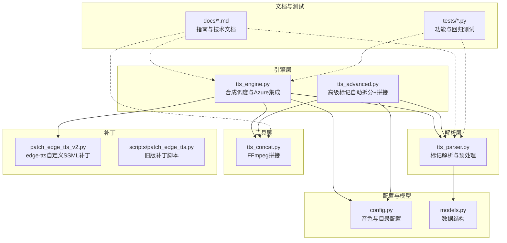
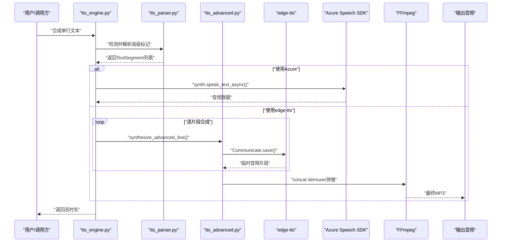
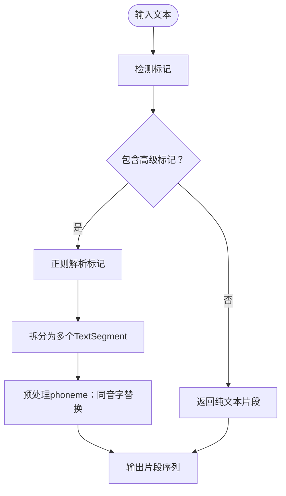
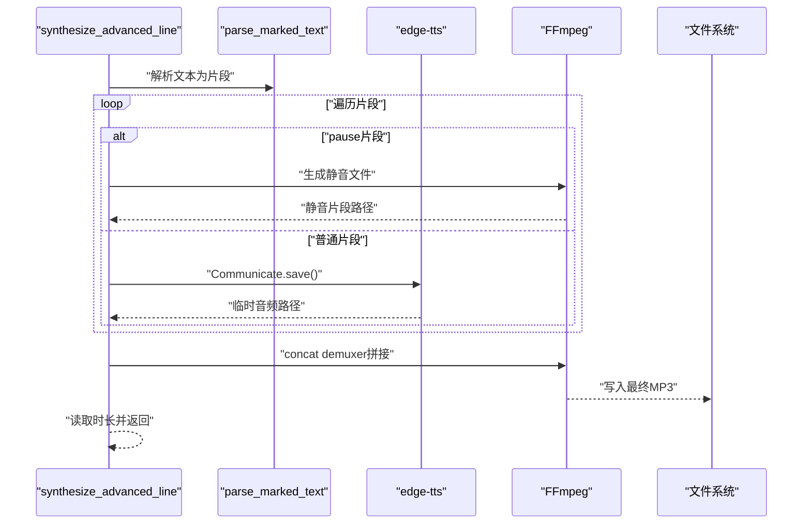
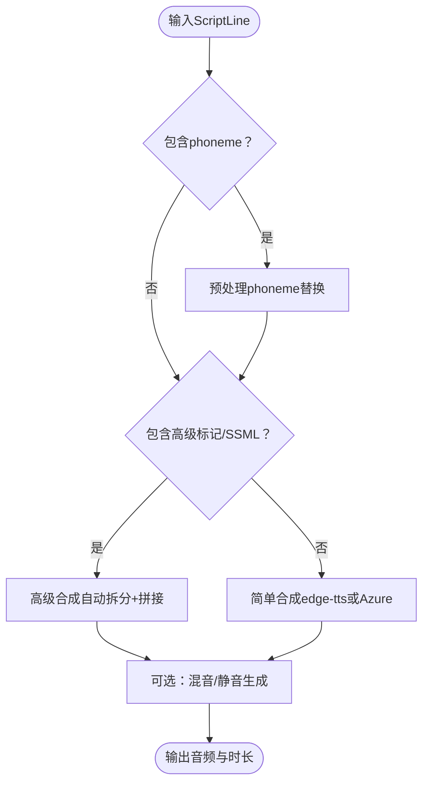
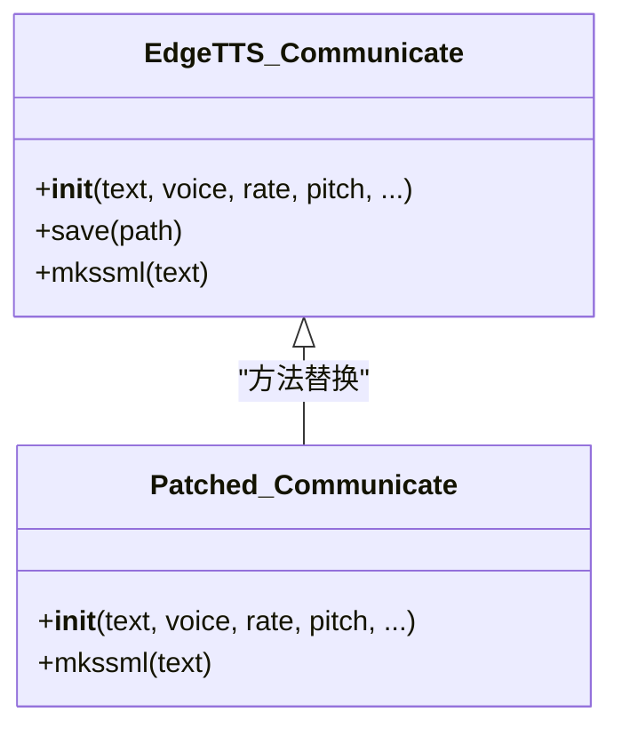
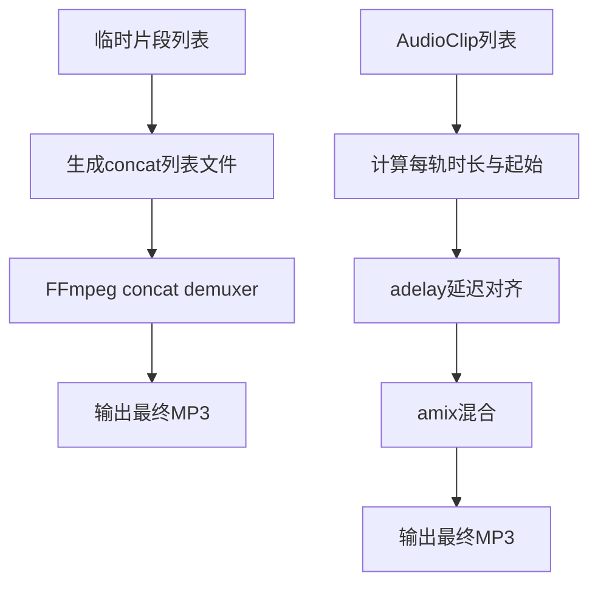
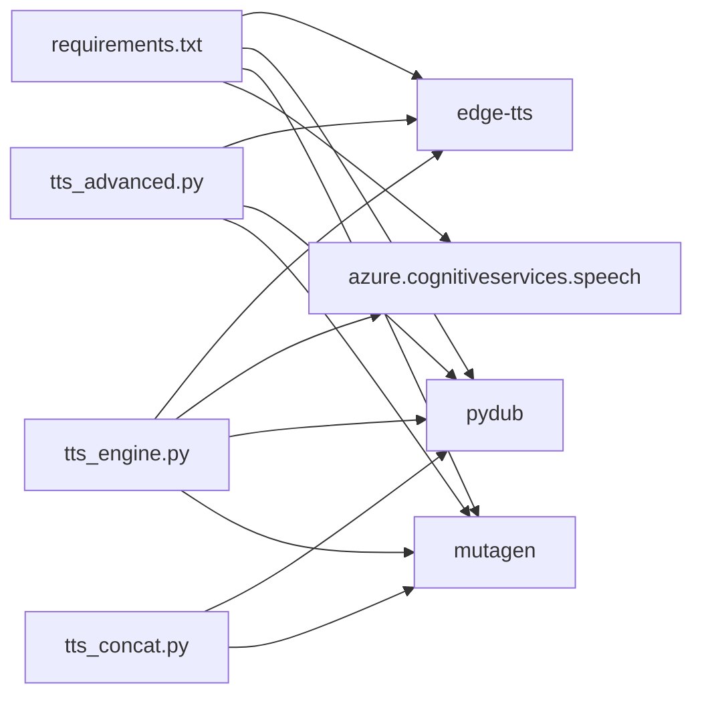

# 高级功能详解

<cite>
**本文引用的文件**
- [app/tts_advanced.py](file://app/tts_advanced.py)
- [app/tts_parser.py](file://app/tts_parser.py)
- [app/tts_engine.py](file://app/tts_engine.py)
- [app/tts_concat.py](file://app/tts_concat.py)
- [app/models.py](file://app/models.py)
- [app/config.py](file://app/config.py)
- [app/patch_edge_tts_v2.py](file://app/patch_edge_tts_v2.py)
- [scripts/patch_edge_tts.py](file://scripts/patch_edge_tts.py)
- [docs/ADVANCED_TTS_GUIDE.md](file://docs/ADVANCED_TTS_GUIDE.md)
- [docs/EDGE_TTS_ADVANCED_MARKERS_GUIDE.md](file://docs/EDGE_TTS_ADVANCED_MARKERS_GUIDE.md)
- [docs/MULTI_PRONUNCIATION_EDITOR_GUIDE.md](file://docs/MULTI_PRONUNCIATION_EDITOR_GUIDE.md)
- [tests/test_advanced_features.py](file://tests/test_advanced_features.py)
- [tests/test_advanced_ssml.py](file://tests/test_advanced_ssml.py)
- [tests/test_phoneme_debug.py](file://tests/test_phoneme_debug.py)
- [tests/test_pause_debug.py](file://tests/test_pause_debug.py)
- [requirements.txt](file://requirements.txt)
</cite>

## 目录
1. [简介](#简介)
2. [项目结构](#项目结构)
3. [核心组件](#核心组件)
4. [架构总览](#架构总览)
5. [详细组件分析](#详细组件分析)
6. [依赖分析](#依赖分析)
7. [性能考量](#性能考量)
8. [故障排除指南](#故障排除指南)
9. [结论](#结论)
10. [附录](#附录)

## 简介
本文件面向TTS Studio的高级功能，围绕以下主题展开：
- SSML标记语法与扩展标记的使用：prosody语速/音调控制、pause停顿、phoneme多音字替换
- 多音字处理策略：同音字替换原理、自动检测机制、精确控制方法
- 音频质量优化：时长计算与估算、音频格式转换、混音质量保证
- Azure Speech Service集成与edge-tts补丁的作用机制
- 性能优化建议与故障排除

文档结合源码与测试用例，提供代码级图示与路径引用，帮助读者快速定位实现细节并进行二次开发。

## 项目结构
TTS Studio采用模块化分层设计：
- 引擎层：负责TTS合成调度、Azure集成、高级标记解析与自动拆分拼接
- 解析层：负责标记语法解析、多音字预处理、片段拆分
- 工具层：音频拼接、混音、静音生成
- 配置与模型：音色配置、数据结构定义
- 文档与测试：指南文档、端到端测试与调试用例

**图表来源**
- [app/tts_engine.py:1-547](file://app/tts_engine.py#L1-L547)
- [app/tts_advanced.py:1-290](file://app/tts_advanced.py#L1-L290)
- [app/tts_parser.py:1-220](file://app/tts_parser.py#L1-L220)
- [app/tts_concat.py:1-159](file://app/tts_concat.py#L1-L159)
- [app/config.py:1-74](file://app/config.py#L1-L74)
- [app/models.py:1-78](file://app/models.py#L1-L78)
- [app/patch_edge_tts_v2.py:1-117](file://app/patch_edge_tts_v2.py#L1-L117)
- [scripts/patch_edge_tts.py:1-105](file://scripts/patch_edge_tts.py#L1-L105)

**章节来源**
- [app/tts_engine.py:1-547](file://app/tts_engine.py#L1-L547)
- [app/tts_advanced.py:1-290](file://app/tts_advanced.py#L1-L290)
- [app/tts_parser.py:1-220](file://app/tts_parser.py#L1-L220)
- [app/tts_concat.py:1-159](file://app/tts_concat.py#L1-L159)
- [app/config.py:1-74](file://app/config.py#L1-L74)
- [app/models.py:1-78](file://app/models.py#L1-L78)
- [app/patch_edge_tts_v2.py:1-117](file://app/patch_edge_tts_v2.py#L1-L117)
- [scripts/patch_edge_tts.py:1-105](file://scripts/patch_edge_tts.py#L1-L105)

## 核心组件
- 高级标记解析器：支持<prosody>、<pause>、[phoneme]等标记，将文本拆分为多个片段，每个片段携带独立的rate/pitch/volume参数
- 高级合成引擎：针对包含高级标记的文本，自动拆分并逐片段合成，随后使用FFmpeg拼接
- edge-tts补丁：允许传入自定义SSML，避免edge-tts对非标准标签的拒绝
- Azure Speech Service集成：在可用时优先使用Azure SDK进行合成，提供更丰富的SSML支持
- 音频拼接与混音：基于FFmpeg命令行实现高质量拼接与多轨混合，确保时长与音质稳定

**章节来源**
- [app/tts_parser.py:1-220](file://app/tts_parser.py#L1-L220)
- [app/tts_advanced.py:1-290](file://app/tts_advanced.py#L1-L290)
- [app/tts_engine.py:1-547](file://app/tts_engine.py#L1-L547)
- [app/patch_edge_tts_v2.py:1-117](file://app/patch_edge_tts_v2.py#L1-L117)

## 架构总览
下图展示了从输入文本到最终音频输出的端到端流程，包括标记解析、片段拆分、逐片段合成、拼接与混音。

**图表来源**
- [app/tts_engine.py:120-218](file://app/tts_engine.py#L120-L218)
- [app/tts_advanced.py:112-290](file://app/tts_advanced.py#L112-L290)
- [app/tts_parser.py:69-182](file://app/tts_parser.py#L69-L182)

**章节来源**
- [app/tts_engine.py:120-218](file://app/tts_engine.py#L120-L218)
- [app/tts_advanced.py:112-290](file://app/tts_advanced.py#L112-L290)
- [app/tts_parser.py:69-182](file://app/tts_parser.py#L69-L182)

## 详细组件分析

### 组件A：高级标记解析器（tts_parser.py）
- 职责
  - 解析<prosody>、<pause>、[phoneme]等标记
  - 将文本拆分为TextSegment序列，每个片段携带rate/pitch/volume参数
  - 预处理phoneme标记，用同音字替换原字，确保传给TTS引擎的文本连贯
- 关键数据结构
  - TextSegment：text、rate、pitch、volume、is_marked、segment_type
- 算法要点
  - 使用正则表达式匹配标记，支持嵌套与无结束标签的pause
  - 对pause生成特殊片段，segment_type为pause
  - phoneme在解析阶段仅记录，实际替换在预处理阶段完成

**图表来源**
- [app/tts_parser.py:39-182](file://app/tts_parser.py#L39-L182)

**章节来源**
- [app/tts_parser.py:23-182](file://app/tts_parser.py#L23-L182)

### 组件B：高级合成引擎（tts_advanced.py）
- 职责
  - 针对包含高级标记的文本，自动拆分并逐片段合成
  - 生成pause静音片段（FFmpeg）
  - 使用FFmpeg concat demuxer拼接所有片段
  - 返回最终音频时长
- 关键流程
  - parse_marked_text：解析文本为片段
  - synthesize_text_segment：逐片段调用edge-tts合成并获取时长
  - FFmpeg拼接：使用concat列表文件，避免依赖ffprobe
- 错误处理
  - 片段级重试与指数退避
  - 清理临时文件，防止磁盘泄漏

**图表来源**
- [app/tts_advanced.py:112-290](file://app/tts_advanced.py#L112-L290)

**章节来源**
- [app/tts_advanced.py:88-290](file://app/tts_advanced.py#L88-L290)

### 组件C：TTS引擎入口与Azure集成（tts_engine.py）
- 职责
  - 统一合成入口，根据文本特征选择路径
  - 支持Azure Speech Service与edge-tts双栈
  - 自动检测高级标记与自定义SSML
  - 提供时长估算与获取
- 关键逻辑
  - detect markers：检测<prosody|<pause|pause|phoneme|自定义SSML
  - phoneme预处理：先替换再检测
  - Azure分支：speechsdk.SpeechSynthesizer
  - edge-tts分支：调用高级合成或简单合成
- 混音与静音
  - mix_audio_tracks：基于FFmpeg amix与adelay实现多轨混合
  - generate_silence/generate_tone：辅助占位

**图表来源**
- [app/tts_engine.py:120-218](file://app/tts_engine.py#L120-L218)
- [app/tts_engine.py:454-547](file://app/tts_engine.py#L454-L547)

**章节来源**
- [app/tts_engine.py:120-218](file://app/tts_engine.py#L120-L218)
- [app/tts_engine.py:454-547](file://app/tts_engine.py#L454-L547)

### 组件D：edge-tts补丁（patch_edge_tts_v2.py 与 scripts/patch_edge_tts.py）
- 目标
  - 使edge-tts能够接收自定义SSML而不进行二次转义或包装
  - 避免edge-tts对<break>、<phoneme>、<emphasis>等标签的拒绝
- 实现要点
  - 替换Communicate.__init__与mkssml
  - 检测以<speak开头的完整SSML，直接透传
  - 避免bytes/str类型差异导致的错误
- 旧版补丁
  - scripts/patch_edge_tts.py提供早期实现思路与兼容性参考

**图表来源**
- [app/patch_edge_tts_v2.py:11-117](file://app/patch_edge_tts_v2.py#L11-L117)
- [scripts/patch_edge_tts.py:9-105](file://scripts/patch_edge_tts.py#L9-L105)

**章节来源**
- [app/patch_edge_tts_v2.py:1-117](file://app/patch_edge_tts_v2.py#L1-L117)
- [scripts/patch_edge_tts.py:1-105](file://scripts/patch_edge_tts.py#L1-L105)

### 组件E：音频拼接与混音（tts_concat.py、tts_engine.py）
- 拼接
  - 使用FFmpeg concat demuxer，避免依赖ffprobe
  - 通过列表文件顺序拼接，支持大量片段
- 混音
  - 基于amix与adelay实现多轨混合
  - 通过start_time与时长估算确保对齐

**图表来源**
- [app/tts_concat.py:17-91](file://app/tts_concat.py#L17-L91)
- [app/tts_engine.py:454-534](file://app/tts_engine.py#L454-L534)

**章节来源**
- [app/tts_concat.py:1-159](file://app/tts_concat.py#L1-L159)
- [app/tts_engine.py:454-534](file://app/tts_engine.py#L454-L534)

## 依赖分析
- 外部依赖
  - edge-tts：TTS引擎；通过补丁支持自定义SSML
  - azure.cognitiveservices.speech：Azure Speech SDK（可选）
  - pydub/mutagen：音频处理与时长读取
  - FFmpeg：拼接与混音
- 内部耦合
  - tts_engine依赖tts_parser与tts_concat
  - tts_advanced依赖tts_parser与FFmpeg
  - patch_edge_tts_v2在tts_engine中被导入应用

**图表来源**
- [requirements.txt:1-16](file://requirements.txt#L1-L16)
- [app/tts_engine.py:1-547](file://app/tts_engine.py#L1-L547)
- [app/tts_advanced.py:1-290](file://app/tts_advanced.py#L1-L290)
- [app/tts_concat.py:1-159](file://app/tts_concat.py#L1-L159)

**章节来源**
- [requirements.txt:1-16](file://requirements.txt#L1-L16)
- [app/tts_engine.py:1-547](file://app/tts_engine.py#L1-L547)
- [app/tts_advanced.py:1-290](file://app/tts_advanced.py#L1-L290)
- [app/tts_concat.py:1-159](file://app/tts_concat.py#L1-L159)

## 性能考量
- 片段数量与合成时间
  - 每个片段一次edge-tts请求，N个片段约N倍合成时间
  - 建议单句片段数不超过5个，平衡时长与质量
- 时长计算
  - 优先使用mutagen读取MP3时长
  - 缺失依赖时使用字符数估算（字符/4.5）
- 拼接与混音
  - concat demuxer避免转码，速度更快
  - amix混合时尽量减少轨道数与延迟
- 网络与代理
  - 支持HTTP_PROXY/https_proxy环境变量
  - 片段级指数退避重试，降低瞬时失败影响

**章节来源**
- [app/tts_engine.py:278-318](file://app/tts_engine.py#L278-L318)
- [app/tts_advanced.py:106-109](file://app/tts_advanced.py#L106-L109)
- [app/tts_engine.py:474-489](file://app/tts_engine.py#L474-L489)

## 故障排除指南
- edge-tts 403/网络问题
  - 检查能否访问微软服务
  - 设置HTTP_PROXY或https_proxy环境变量
- 自定义SSML无效
  - 确认补丁已正确应用（patch_edge_tts_v2.py）
  - 确认SSML以<speak开头且结构完整
- 时长异常
  - 安装mutagen以获得准确时长
  - 若缺失，系统会使用估算值
- FFmpeg拼接失败
  - 检查ffmpeg.exe路径与权限
  - 确认列表文件路径使用正斜杠
- Azure合成失败
  - 确认Azure SDK已安装
  - 检查订阅密钥与区域配置

**章节来源**
- [app/tts_engine.py:303-311](file://app/tts_engine.py#L303-L311)
- [app/patch_edge_tts_v2.py:1-117](file://app/patch_edge_tts_v2.py#L1-L117)
- [app/tts_engine.py:90-97](file://app/tts_engine.py#L90-L97)
- [app/tts_concat.py:56-78](file://app/tts_concat.py#L56-L78)

## 结论
TTS Studio通过“标记解析 + 自动拆分 + 边缘合成 + FFmpeg拼接”的架构，突破了edge-tts在SSML标签上的限制，实现了复杂语气变化、停顿与多音字的精确控制。配合Azure Speech Service与补丁机制，系统在灵活性与稳定性之间取得良好平衡。建议在实际使用中遵循性能与故障排除建议，以获得最佳体验。

## 附录

### SSML与高级标记语法速查
- prosody语速/音调/音量控制
- pause停顿（毫秒）
- phoneme多音字替换（同音字预处理）
- emphasis强调（通过rate/pitch模拟）

**章节来源**
- [docs/ADVANCED_TTS_GUIDE.md:15-62](file://docs/ADVANCED_TTS_GUIDE.md#L15-L62)
- [docs/EDGE_TTS_ADVANCED_MARKERS_GUIDE.md:1-1175](file://docs/EDGE_TTS_ADVANCED_MARKERS_GUIDE.md#L1-L1175)

### 多音字处理策略
- 同音字替换原理：在预处理阶段将[phoneme=同音字]原字[/phoneme]替换为同音字，传给edge-tts
- 自动检测：通过正则检测[phoneme=...]
- 精确控制：UI层提供多音字标注与试听，确保发音符合预期

**章节来源**
- [app/tts_parser.py:39-66](file://app/tts_parser.py#L39-L66)
- [docs/MULTI_PRONUNCIATION_EDITOR_GUIDE.md:1-248](file://docs/MULTI_PRONUNCIATION_EDITOR_GUIDE.md#L1-L248)

### 高级标记组合与复杂场景
- 组合使用：语速变化 + 停顿 + 强调 + 多音字替换
- 场景示例：情感曲线设计、悬疑停顿、高潮加速等
- 测试参考：test_advanced_features.py、test_advanced_ssml.py

**章节来源**
- [tests/test_advanced_features.py:1-101](file://tests/test_advanced_features.py#L1-L101)
- [tests/test_advanced_ssml.py:1-143](file://tests/test_advanced_ssml.py#L1-L143)